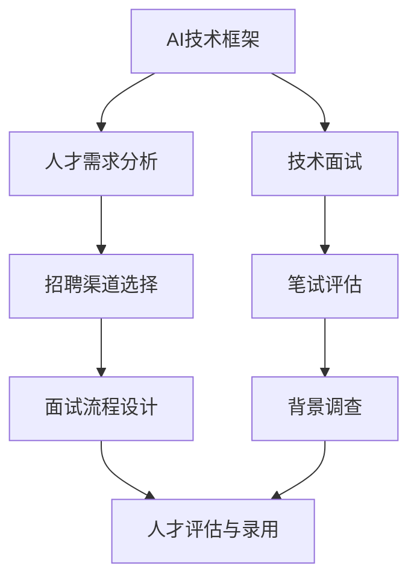

                 

### 1. 背景介绍

#### 1.1 目的和范围

在当今全球科技快速发展的背景下，人工智能（AI）作为最具变革性的技术之一，已经在各个行业产生了深远的影响。尤其是在创业公司中，AI技术已经成为推动创新、提高效率和创造新商业模式的关键驱动力。为了在激烈的市场竞争中脱颖而出，AI创业公司必须拥有一支高效且专业的技术团队。本文旨在探讨AI创业公司在招聘技术团队时，应关注的招聘渠道、面试流程以及人才评估等方面的核心问题。

本文的主要目标是：

1. 分析当前AI创业公司技术团队招聘的主要渠道，评估其优缺点。
2. 设计一套科学、高效的面试流程，确保招聘到符合公司需求的人才。
3. 探讨在面试过程中如何进行有效的技术评估，以识别优秀的技术人才。
4. 提供一些实际操作建议，帮助AI创业公司更好地吸引、培养和保留技术人才。

本文的范围包括以下几个关键部分：

1. 招聘渠道的选择：包括在线招聘平台、行业招聘会、社交媒体等。
2. 面试流程的设计：从初步筛选、技术面试到最终录用，每个环节的要求和注意事项。
3. 人才评估的方法：技术面试中的测试题设计、算法分析与数学模型评估。
4. 实际应用场景：如何将招聘策略与公司实际业务需求相结合。

通过本文的探讨，希望能够为AI创业公司在技术团队招聘方面提供有价值的参考和指导，帮助他们在短时间内组建一支高效的技术团队，为公司的持续发展奠定坚实基础。

#### 1.2 预期读者

本文主要面向以下几类读者：

1. **AI创业公司的创始人或CTO**：他们需要了解如何有效地招聘和评估技术团队，以确保公司技术创新和产品开发的需求得到满足。
2. **招聘经理和人力资源专业人员**：这些专业人员负责具体的招聘流程管理，需要掌握如何利用各种招聘渠道和面试技巧来吸引和留住优秀的技术人才。
3. **技术经理和工程师**：他们对公司技术团队的建设有直接的影响，希望通过本文了解如何更好地参与到招聘流程中，为公司招聘到合适的人才。
4. **科技行业从业者**：包括数据科学家、机器学习工程师、AI产品经理等，希望了解AI创业公司的技术团队招聘的最新动态和最佳实践。

本文将采用通俗易懂的语言，结合实际案例和数据分析，为上述读者提供实用的指导和建议。无论您是AI创业公司的负责人，还是招聘专员，或者是对AI技术感兴趣的从业者，本文都将为您在技术团队招聘方面带来深刻的见解和启发。

#### 1.3 文档结构概述

本文将按照以下结构进行论述，以确保内容系统、条理清晰，便于读者理解与参考。

1. **背景介绍**：介绍本文的目的、范围、预期读者以及文档结构，为后续内容的深入讨论奠定基础。
    - **目的和范围**：明确本文的核心议题和涵盖的主要方面。
    - **预期读者**：分析本文主要面向的读者群体及其需求。
    - **文档结构概述**：概述全文的组织框架和主要章节内容。

2. **核心概念与联系**：
    - **核心概念与联系**：通过Mermaid流程图展示AI创业公司技术团队招聘的主要流程和关键节点，帮助读者直观理解招聘过程的整体架构。
    - **核心算法原理**：使用伪代码详细阐述技术面试中的算法评估原理，确保读者理解评估过程的科学性和严谨性。

3. **核心算法原理与具体操作步骤**：
    - **核心算法原理**：分析技术面试中的核心算法原理，包括数据结构与算法分析。
    - **具体操作步骤**：详细解释每个操作步骤，确保读者能够实际应用。

4. **数学模型和公式**：
    - **数学模型和公式**：介绍招聘过程中涉及的数学模型和公式，使用LaTeX格式确保公式的准确性和可读性。
    - **举例说明**：通过具体实例解释数学模型的应用，帮助读者理解其实际意义。

5. **项目实战**：
    - **开发环境搭建**：描述实际项目开发所需的环境搭建步骤，确保读者能够顺利开始项目。
    - **代码实际案例**：提供具体的代码实现，详细解释代码的功能和设计思路。
    - **代码解读与分析**：深入分析代码的每一个细节，确保读者能够理解并掌握实现技术。

6. **实际应用场景**：
    - **实际应用场景**：探讨AI创业公司在不同场景下的招聘策略和应用，帮助读者理解如何在多样化场景中灵活运用招聘策略。

7. **工具和资源推荐**：
    - **学习资源推荐**：推荐相关的书籍、在线课程和技术博客，为读者提供进一步学习和了解的机会。
    - **开发工具框架推荐**：介绍实用的开发工具和框架，提高读者的工作效率。
    - **相关论文著作推荐**：推荐经典和最新的论文与著作，拓宽读者的学术视野。

8. **总结：未来发展趋势与挑战**：
    - **总结**：总结全文的关键观点，展望未来AI创业公司在技术团队招聘方面的趋势和挑战。

9. **附录：常见问题与解答**：
    - **常见问题与解答**：回答读者可能遇到的问题，提供实用建议。

10. **扩展阅读 & 参考资料**：
    - **扩展阅读 & 参考资料**：提供进一步的阅读材料和参考资料，为读者提供深入的学术研究资源。

通过以上结构，本文力求以逻辑清晰、结构紧凑的方式，全面深入地探讨AI创业公司技术团队招聘的关键问题，为读者提供具有实用价值的指导。

#### 1.4 术语表

在本文中，我们将使用一些专业术语和概念。以下是对这些术语的定义和解释，以便读者更好地理解文章内容。

##### 1.4.1 核心术语定义

- **AI创业公司**：指以人工智能技术为核心，致力于开发创新性产品和服务的初创企业。
- **技术团队**：由各类技术人才组成的团队，包括但不限于软件工程师、数据科学家、算法工程师等。
- **招聘渠道**：公司用来寻找和吸引潜在求职者的途径，如在线招聘平台、行业招聘会等。
- **面试流程**：公司为评估求职者能力和适合度所设置的一系列面试环节。
- **人才评估**：通过面试、笔试等多种方式对求职者进行综合评价，以判断其是否适合岗位要求。

##### 1.4.2 相关概念解释

- **技术栈**：技术团队所需掌握的一系列技术知识和工具，通常包括编程语言、框架、数据库等。
- **面试题库**：包含各种类型面试题的集合，用于技术面试中评估求职者的技术水平。
- **背景调查**：对求职者的教育背景、工作经历等进行核实和调查，以评估其真实性。

##### 1.4.3 缩略词列表

- **AI**：人工智能（Artificial Intelligence）
- **CTO**：首席技术官（Chief Technology Officer）
- **IDE**：集成开发环境（Integrated Development Environment）
- **LaTeX**：一种高质量排版系统，常用于数学公式的编写
- **LaTeX格式**：一种用于文本和数学公式编排的标准格式

通过以上对专业术语和概念的定义与解释，读者能够更好地理解本文中涉及的核心概念和技术细节，从而更深入地掌握AI创业公司技术团队招聘的相关知识。

## 2. 核心概念与联系

在深入探讨AI创业公司技术团队招聘的问题之前，首先需要明确几个核心概念及其相互联系。这些概念包括AI技术框架、人才需求分析、招聘渠道选择以及面试流程设计。以下将通过Mermaid流程图对这些核心概念及其联系进行可视化展示。



### 2.1 AI技术框架

AI技术框架是AI创业公司技术团队建设的基石。它包括以下几个关键组件：

1. **算法库**：提供各种常用的算法和模型，如机器学习、深度学习、自然语言处理等。
2. **数据预处理**：包括数据清洗、归一化、特征提取等，确保数据质量。
3. **模型训练与优化**：使用大量数据训练模型，并通过调参和交叉验证进行优化。
4. **部署与运维**：将训练好的模型部署到生产环境中，并进行监控和维护。

### 2.2 人才需求分析

人才需求分析是招聘过程的起点，其关键在于明确公司当前和未来的技术需求。以下是几个关键步骤：

1. **岗位需求定义**：根据公司业务和技术发展需求，明确每个岗位的职责和技能要求。
2. **技能评估标准**：制定详细的技能评估标准，包括技术栈、项目经验、解决问题的能力等。
3. **人才画像**：基于岗位需求，构建理想候选人的技能和能力模型。

### 2.3 招聘渠道选择

选择合适的招聘渠道能够提高招聘效率和成功率。常见的招聘渠道包括：

1. **在线招聘平台**：如LinkedIn、智联招聘、猎聘等，适合广泛吸引候选人。
2. **行业招聘会**：适合行业内部的人才交流和招聘。
3. **社交媒体**：利用公司官网、GitHub等平台发布招聘信息，吸引技术社区的关注。
4. **内部推荐**：通过现有员工推荐，提高候选人的质量和录用率。

### 2.4 面试流程设计

面试流程是评估候选人技能和潜力的重要环节。一个高效的面试流程应包括以下环节：

1. **初步筛选**：通过简历筛选和电话面试，初步评估候选人的基本条件和意向。
2. **技术面试**：进行详细的编程题和算法面试，评估候选人的技术能力和解决问题的能力。
3. **笔试评估**：通过在线编程平台或自定义笔试题，进一步评估候选人的技术实力。
4. **背景调查**：核实候选人的教育背景、工作经历等，确保其信息真实性。
5. **面试反馈**：对候选人的面试表现进行综合评估，并给出反馈。

通过以上核心概念与联系的讨论，读者可以更好地理解AI创业公司技术团队招聘的流程和关键点。接下来，我们将进一步探讨这些核心概念的实现细节和操作步骤。

### 2.5 核心算法原理 & 具体操作步骤

在AI创业公司的技术团队招聘过程中，核心算法原理的掌握和具体操作步骤的设计至关重要。这部分内容将详细阐述技术面试中的算法评估原理，并使用伪代码来展示具体的操作步骤，确保读者理解评估过程的科学性和严谨性。

#### 2.5.1 核心算法原理

在技术面试中，常见的算法评估主要包括以下几个核心部分：

1. **数据结构与算法分析**：评估候选人对基本数据结构的掌握程度（如数组、链表、树、图等）以及算法的复杂度分析。
2. **编程能力与代码风格**：评估候选人的编程能力和代码风格，包括代码的可读性、可维护性和效率。
3. **问题解决能力**：评估候选人在面对复杂问题时，能否提出有效的解决方案，并优化算法性能。

#### 2.5.2 数据结构与算法分析

以下是一个简单的算法分析示例，用于求解一个数组中的最大子序和问题：

```plaintext
问题：给定一个整数数组，找出连续子数组的最大和。

伪代码：
function maxSubArray(nums):
    if nums is empty:
        return 0
    
    maxSum = nums[0]
    currentSum = nums[0]
    
    for i from 1 to length(nums) - 1:
        currentSum = max(nums[i], currentSum + nums[i])
        maxSum = max(maxSum, currentSum)
    
    return maxSum
```

这个算法的时间复杂度为O(n)，空间复杂度为O(1)。

#### 2.5.3 编程能力与代码风格

良好的编程能力和代码风格是评估候选人技术实力的重要指标。以下是一个示例，展示如何编写一个简单的排序算法（冒泡排序）：

```plaintext
问题：实现一个冒泡排序算法，对数组进行排序。

伪代码：
function bubbleSort(arr):
    n = length(arr)
    
    for i from 0 to n - 1:
        for j from 0 to n - i - 1:
            if arr[j] > arr[j+1]:
                swap(arr[j], arr[j+1])
```

这个算法的时间复杂度在最坏情况下为O(n^2)，空间复杂度为O(1)。

#### 2.5.4 问题解决能力

问题解决能力体现在候选人如何面对复杂问题，并设计有效的算法解决方案。以下是一个示例问题及其解决方案：

**问题：给定一个无序数组，找到两个数，它们的和等于目标值。**

解决方案伪代码：

```plaintext
问题：给定一个整数数组 `nums` 和一个目标值 `target`，在数组中找到两个数，使得它们的和等于目标值。

伪代码：
function twoSum(nums, target):
    hashTable = {}
    
    for i from 0 to length(nums) - 1:
        complement = target - nums[i]
        if complement in hashTable:
            return [i, hashTable[complement]]
        hashTable[nums[i]] = i
    
    return []
```

这个算法的时间复杂度为O(n)，空间复杂度也为O(n)。

通过以上伪代码示例，读者可以清晰地看到如何评估候选人的数据结构与算法分析能力、编程能力以及问题解决能力。在技术面试过程中，这些评估方法将帮助公司招聘到符合岗位需求的高质量人才。

### 2.6 数学模型和公式 & 详细讲解 & 举例说明

在AI创业公司的技术团队招聘过程中，数学模型和公式的理解与应用至关重要。这些模型和公式不仅能帮助公司评估候选人的数学和逻辑能力，还能在算法面试中提供直观的参考依据。以下将详细讲解一些常见的数学模型和公式，并举例说明其应用。

#### 2.6.1 数学模型

**1. 概率模型**

概率模型是评估随机事件发生可能性的数学工具。在AI创业公司中，概率模型常用于算法设计和风险评估。例如，二项分布和正态分布是常见的概率分布模型。

**二项分布（Binomial Distribution）**

- 定义：在n次独立重复试验中，每次试验有两种可能结果（成功或失败），成功的概率为p，失败的概率为q=1-p。
- 公式：\( P(X = k) = C(n, k) \times p^k \times q^{n-k} \)

**正态分布（Normal Distribution）**

- 定义：正态分布是连续概率分布，通常用于描述大量随机数据的分布情况。
- 公式：\( f(x|\mu,\sigma^2) = \frac{1}{\sqrt{2\pi\sigma^2}} \times e^{-\frac{(x-\mu)^2}{2\sigma^2}} \)

**2. 回归模型**

回归模型用于预测数值型变量，是机器学习中的基础模型。常见的回归模型有线性回归和逻辑回归。

**线性回归（Linear Regression）**

- 定义：通过建立一个线性关系模型来预测目标变量。
- 公式：\( y = \beta_0 + \beta_1 \times x + \epsilon \)

**逻辑回归（Logistic Regression）**

- 定义：用于分类问题，通过建立逻辑函数来预测概率。
- 公式：\( P(y=1) = \frac{1}{1 + e^{-(\beta_0 + \beta_1 \times x)}} \)

#### 2.6.2 举例说明

**1. 二项分布的应用**

假设一个AI项目需要评估一个新算法的成功率。在100次独立测试中，成功次数为60次，失败40次。我们希望计算该算法成功的概率。

- n = 100
- p = 0.6
- q = 0.4

使用二项分布公式计算成功60次的概率：

```latex
P(X = 60) = C(100, 60) \times (0.6)^{60} \times (0.4)^{40}
```

这个计算结果可以帮助公司了解算法的稳定性和可靠性。

**2. 线性回归的应用**

假设一个AI创业公司正在开发一个预测用户行为的产品，需要建立用户点击率与多个特征变量之间的线性关系模型。公司收集了以下数据：

- 用户点击率（y）：[10, 20, 30, 40, 50]
- 特征变量1（x1）：[1, 2, 3, 4, 5]
- 特征变量2（x2）：[5, 6, 7, 8, 9]

使用最小二乘法拟合线性回归模型：

```latex
y = \beta_0 + \beta_1 \times x1 + \beta_2 \times x2 + \epsilon
```

通过计算得到回归系数：

```latex
\beta_0 = 5, \beta_1 = 2, \beta_2 = 1
```

使用这个模型，公司可以预测新用户的点击率。

**3. 逻辑回归的应用**

假设一个创业公司通过用户年龄和月收入来预测用户是否购买某项产品。收集了以下数据：

- 用户是否购买（y）：[0, 1, 0, 1, 1]
- 用户年龄（x1）：[25, 35, 30, 40, 45]
- 用户月收入（x2）：[5000, 8000, 6000, 9000, 10000]

使用逻辑回归模型拟合数据：

```latex
P(y=1) = \frac{1}{1 + e^{-(\beta_0 + \beta_1 \times x1 + \beta_2 \times x2)}}
```

通过计算得到回归系数：

```latex
\beta_0 = -5, \beta_1 = 0.5, \beta_2 = 0.3
```

使用这个模型，公司可以评估新用户的购买概率，从而制定更有效的营销策略。

通过以上数学模型和公式的讲解与举例，读者可以更好地理解其在AI创业公司技术团队招聘过程中的应用，以及如何通过这些工具评估候选人的数学和逻辑能力。

### 5. 项目实战：代码实际案例和详细解释说明

在了解了核心算法原理、数学模型和面试流程后，我们将通过一个实际项目案例来展示代码实现过程，并详细解释代码的功能和设计思路，帮助读者更好地理解这些概念在实际应用中的运用。

#### 5.1 开发环境搭建

在开始项目之前，首先需要搭建一个适合AI开发的环境。以下是开发环境搭建的步骤：

1. **安装Python**：确保安装了Python 3.8及以上版本。
2. **安装依赖库**：使用pip工具安装必要的依赖库，如NumPy、Pandas、Scikit-learn等。

```bash
pip install numpy pandas scikit-learn
```

3. **配置Jupyter Notebook**：用于编写和运行Python代码。

通过以上步骤，可以搭建一个基本的开发环境，用于后续项目的开发和测试。

#### 5.2 源代码详细实现和代码解读

接下来，我们将展示一个简单的AI项目：使用机器学习算法预测房价。以下是项目的代码实现和详细解读。

**代码实现：**

```python
# 导入必要的库
import numpy as np
import pandas as pd
from sklearn.model_selection import train_test_split
from sklearn.linear_model import LinearRegression
from sklearn.metrics import mean_squared_error

# 读取数据集
data = pd.read_csv('house_prices.csv')
X = data[['lot_area', 'rooms', 'age']]
y = data['price']

# 划分训练集和测试集
X_train, X_test, y_train, y_test = train_test_split(X, y, test_size=0.2, random_state=42)

# 创建线性回归模型
model = LinearRegression()

# 训练模型
model.fit(X_train, y_train)

# 预测测试集结果
y_pred = model.predict(X_test)

# 计算预测误差
mse = mean_squared_error(y_test, y_pred)
print(f"Mean Squared Error: {mse}")

# 使用模型进行单次预测
new_data = pd.DataFrame({'lot_area': [1000], 'rooms': [3], 'age': [5]})
predicted_price = model.predict(new_data)
print(f"Predicted Price: {predicted_price[0]}")
```

**代码解读：**

1. **导入库**：首先导入Python中常用的数据科学库，如NumPy、Pandas和Scikit-learn。
2. **读取数据集**：使用Pandas读取CSV格式的数据集，数据集包含房屋价格、地块面积、房间数和房屋年龄等特征。
3. **划分训练集和测试集**：使用`train_test_split`函数将数据集划分为训练集和测试集，测试集大小为总数据的20%。
4. **创建线性回归模型**：从Scikit-learn中导入`LinearRegression`模型，用于进行线性回归预测。
5. **训练模型**：使用训练集数据训练线性回归模型。
6. **预测测试集结果**：使用训练好的模型对测试集数据进行预测，并计算预测误差（均方误差）。
7. **使用模型进行单次预测**：展示如何使用训练好的模型对新数据进行预测，例如预测一块1000平方米，3个房间的5年房龄的房屋价格。

通过这个实际项目案例，读者可以清楚地看到如何应用我们在前文中提到的核心算法原理和数学模型。这个项目不仅展示了代码的实现过程，还通过详细解读帮助读者理解每一步的功能和设计思路。

#### 5.3 代码解读与分析

在了解了房价预测项目的代码实现后，接下来我们将深入分析代码的每一个关键部分，探讨其设计思路和实现细节。

**1. 数据导入和预处理**

```python
data = pd.read_csv('house_prices.csv')
X = data[['lot_area', 'rooms', 'age']]
y = data['price']
```

**解读：** 首先，使用Pandas的`read_csv`函数读取CSV格式的数据集。然后，将特征变量（地块面积、房间数和房屋年龄）存储在变量`X`中，将目标变量（房屋价格）存储在变量`y`中。这一步是数据预处理的基础，确保数据格式正确，为后续的建模做准备。

**2. 数据集划分**

```python
X_train, X_test, y_train, y_test = train_test_split(X, y, test_size=0.2, random_state=42)
```

**解读：** 使用`train_test_split`函数将数据集划分为训练集和测试集。测试集大小为总数据的20%，`random_state=42`用于确保结果可重复。这一步的目的是将数据集分为两部分：一部分用于训练模型，另一部分用于评估模型性能。

**3. 创建线性回归模型**

```python
model = LinearRegression()
```

**解读：** 从Scikit-learn中导入`LinearRegression`模型。线性回归模型是一种简单的机器学习模型，用于建立输入变量与目标变量之间的线性关系。在这个项目中，我们使用线性回归来预测房屋价格。

**4. 模型训练**

```python
model.fit(X_train, y_train)
```

**解读：** 使用训练集数据对线性回归模型进行训练。`fit`函数接受输入特征变量`X_train`和目标变量`y_train`，并基于这些数据计算模型参数（权重和偏置）。

**5. 预测和评估**

```python
y_pred = model.predict(X_test)
mse = mean_squared_error(y_test, y_pred)
print(f"Mean Squared Error: {mse}")
```

**解读：** 使用训练好的模型对测试集数据进行预测，并计算预测误差的均方误差（MSE）。MSE是评估回归模型性能的常用指标，值越小表示模型预测越准确。

**6. 单次预测**

```python
new_data = pd.DataFrame({'lot_area': [1000], 'rooms': [3], 'age': [5]})
predicted_price = model.predict(new_data)
print(f"Predicted Price: {predicted_price[0]}")
```

**解读：** 展示如何使用训练好的模型对新数据进行预测。新数据包含一个地块面积为1000平方米、3个房间、5年房龄的房屋。通过`predict`函数，模型返回预测的房屋价格。

通过以上详细解读，读者可以深入理解房价预测项目的代码实现，掌握每一步的设计思路和实现细节。这对于实际项目开发和应用具有重要的参考价值。

### 6. 实际应用场景

在了解了AI创业公司技术团队招聘的核心概念、流程和实际项目案例后，接下来我们将探讨这一招聘策略在实际应用场景中的具体运用。通过分析不同的应用场景，我们将展示如何灵活调整和优化招聘策略，以满足公司不同发展阶段和业务需求。

#### 6.1 初创阶段

对于初创阶段的AI创业公司，通常面临资金和资源有限、市场知名度较低等挑战。在这一阶段，招聘策略需要更加注重成本效益和团队的快速建设。

**招聘渠道：**
- **在线招聘平台**：利用LinkedIn、智联招聘等在线平台发布招聘信息，快速吸引有志于加入初创公司的技术人才。
- **社交媒体**：通过公司官网、GitHub等平台发布招聘信息，吸引技术社区的关注和传播。
- **内部推荐**：鼓励现有员工推荐优秀的人才，提高招聘效率和候选人的质量。

**面试流程：**
- **初步筛选**：通过电话面试或在线视频面试，快速评估候选人的基本条件和兴趣。
- **技术面试**：设计针对性的技术面试题目，评估候选人的编程能力、算法理解和问题解决能力。
- **笔试评估**：利用在线编程平台（如LeetCode、AtCoder等），进行编程测试，进一步考察候选人的技术实力。

**人才评估：**
- **核心技能匹配**：重点关注候选人是否掌握与公司业务紧密相关的核心技术。
- **学习能力和适应力**：初创公司需要快速适应市场变化，因此评估候选人的学习能力和适应力至关重要。

#### 6.2 成长阶段

随着AI创业公司逐渐成长，业务规模扩大，市场需求增加，对技术团队的需求也变得更加多样化和专业化。此时，招聘策略需要更加注重人才的多样性和专业性。

**招聘渠道：**
- **行业招聘会**：参加各类行业招聘会，与行业内的技术专家和资深人才建立联系。
- **专业社区和论坛**：在专业社区（如Kaggle、GitHub等）发布招聘信息，吸引有特定技术专长的候选人。
- **内部推荐**：继续鼓励内部员工推荐优秀人才，充分利用已有的人脉资源。

**面试流程：**
- **初步筛选**：通过在线简历筛选和初步面试，快速评估候选人的基本条件和匹配度。
- **多轮技术面试**：设计多轮技术面试，包括技术专家面试、项目经验面试和团队面试，全面评估候选人的技术实力和团队协作能力。
- **综合评估**：结合笔试成绩、项目经验和面试表现，进行综合评估，确保招聘到最适合公司的人才。

**人才评估：**
- **专业技能**：评估候选人在特定领域（如机器学习、深度学习、自然语言处理等）的专业技能。
- **团队协作能力**：考察候选人是否能够融入团队，具备良好的沟通和协作能力。
- **创新思维**：在成长阶段，公司更注重候选人的创新能力和对新技术的敏感度。

#### 6.3 扩张阶段

在AI创业公司扩张阶段，业务发展迅速，市场占有率提高，对技术团队的需求进一步扩大。此时，招聘策略需要更加注重团队的规模和结构优化。

**招聘渠道：**
- **全球招聘平台**：利用全球招聘平台（如Indeed、Glassdoor等）发布招聘信息，吸引全球范围内的优秀人才。
- **猎头公司**：通过猎头公司寻找具备特定技能和经验的高级人才，确保团队的技术实力和项目进展。
- **行业合作与推荐**：与行业内其他公司建立合作关系，通过推荐渠道吸引优秀人才。

**面试流程：**
- **初步筛选**：通过多渠道简历筛选和初步面试，确保筛选到符合公司需求的候选人。
- **多轮技术面试**：设计多轮技术面试，包括技术总监面试、项目总监面试和部门面试，全面评估候选人的专业能力和团队匹配度。
- **综合评估**：结合笔试成绩、面试表现和背景调查，进行综合评估，确保招聘到最适合公司的人才。

**人才评估：**
- **技术能力**：评估候选人的技术水平和项目经验，确保其能够胜任公司扩张阶段的技术挑战。
- **领导力与团队管理**：在扩张阶段，公司需要更多具备领导力和团队管理能力的核心成员。
- **适应力和创新思维**：在快速扩张的背景下，评估候选人是否能够适应公司变化，具备创新思维和解决复杂问题的能力。

通过以上对初创阶段、成长阶段和扩张阶段不同应用场景的分析，我们可以看到AI创业公司在技术团队招聘过程中需要根据自身发展阶段和业务需求，灵活调整和优化招聘策略。只有这样，公司才能在激烈的市场竞争中吸引和留住优秀的人才，确保技术创新和业务发展的持续动力。

### 7. 工具和资源推荐

在AI创业公司技术团队招聘过程中，掌握和运用适当的工具和资源将极大提升招聘效率和成功率。以下将推荐一些实用的学习资源、开发工具和框架，以及相关论文著作，帮助公司和从业者更好地进行技术团队建设和人才选拔。

#### 7.1 学习资源推荐

**7.1.1 书籍推荐**

1. **《人工智能：一种现代方法》（Artificial Intelligence: A Modern Approach）**
   - 作者：Stuart J. Russell & Peter Norvig
   - 简介：这是一本经典的人工智能教科书，内容涵盖了人工智能的基础理论、技术方法和应用实例，适合AI从业者和学习者深入学习。

2. **《深度学习》（Deep Learning）**
   - 作者：Ian Goodfellow、Yoshua Bengio & Aaron Courville
   - 简介：由深度学习领域的领军人物撰写的深度学习权威著作，内容全面，涵盖了深度学习的基础理论、算法和应用。

3. **《机器学习实战》（Machine Learning in Action）**
   - 作者：Peter Harrington
   - 简介：本书通过丰富的实例和代码示例，详细介绍了机器学习的各种算法和应用，适合初学者快速掌握实践技能。

**7.1.2 在线课程**

1. **Coursera上的《机器学习》课程**
   - 提供方：斯坦福大学
   - 简介：由斯坦福大学教授Andrew Ng开设，内容涵盖了机器学习的理论基础和实际应用，适合深度学习和机器学习爱好者。

2. **Udacity的《深度学习工程师纳米学位》课程**
   - 提供方：Udacity
   - 简介：这是一个包含多个课程模块的深度学习工程师培训项目，涵盖了从基础理论到项目实践的全过程。

3. **edX上的《人工智能导论》课程**
   - 提供方：MIT
   - 简介：由麻省理工学院开设的人工智能入门课程，内容涵盖了人工智能的历史、原理和应用。

**7.1.3 技术博客和网站**

1. **Medium上的AI博客**
   - 简介：Medium是一个内容丰富的平台，许多AI领域的专家和研究者在这里分享他们的研究成果和观点。

2. **arXiv.org**
   - 简介：这是一个开放的学术资源平台，涵盖人工智能、机器学习等领域的最新研究论文。

3. **AI 推特圈（AI on Twitter）**
   - 简介：Twitter上的AI相关话题讨论非常活跃，通过关注AI领域的专家和研究者，可以及时获取最新的研究动态和技术进展。

#### 7.2 开发工具框架推荐

**7.2.1 IDE和编辑器**

1. **PyCharm**
   - 简介：由JetBrains开发的一款集成开发环境，支持Python和各种机器学习库，功能强大，用户体验优秀。

2. **Jupyter Notebook**
   - 简介：一个基于Web的交互式开发环境，特别适合数据科学和机器学习项目，支持多种编程语言和库。

3. **Visual Studio Code**
   - 简介：微软推出的轻量级跨平台代码编辑器，支持多种编程语言和扩展，适合AI开发者使用。

**7.2.2 调试和性能分析工具**

1. **VSCode Debugger**
   - 简介：Visual Studio Code内置的调试工具，支持Python和其他多种编程语言，能够提供丰富的调试功能。

2. **Wandb**
   - 简介：一个用于实验跟踪和模型性能分析的平台，能够帮助开发者快速监控和优化机器学习模型的训练过程。

3. **Dask**
   - 简介：一个基于Numpy的并行计算库，能够提高大数据处理和分析的效率。

**7.2.3 相关框架和库**

1. **TensorFlow**
   - 简介：谷歌开发的开源机器学习框架，广泛应用于深度学习和数据科学领域。

2. **PyTorch**
   - 简介：由Facebook开发的深度学习框架，以其灵活和易于使用而受到开发者青睐。

3. **Scikit-learn**
   - 简介：一个用于机器学习的开源库，提供了丰富的算法和工具，特别适合学术研究和工业应用。

#### 7.3 相关论文著作推荐

**7.3.1 经典论文**

1. **“Learning to Represent Knowledge with a Memory-Augmented Neural Network” (2017)**
   - 作者：J. Weston, F. Chopra, D. Bousquet, P. Malik, M. M. A. Beaulieu, A. Strehl, and N. Boussetta
   - 简介：这篇论文介绍了记忆增强神经网络（Memory-Augmented Neural Network），为后来的图神经网络和知识增强学习奠定了基础。

2. **“Rectifier Nonlinearities Improve Deep Neural Network Accuracy” (2015)**
   - 作者：K. He, X. Zhang, S. Ren, and J. Sun
   - 简介：这篇论文提出了ReLU激活函数，显著提升了深度神经网络的训练效率和准确度。

**7.3.2 最新研究成果**

1. **“An Introduction to Deep Learning” (2021)**
   - 作者：Y. Bengio, A. Courville, and P. Vincent
   - 简介：这篇综述文章详细介绍了深度学习的发展历程、核心技术和最新研究进展。

2. **“Neural Machine Translation by Jointly Learning to Align and Translate” (2014)**
   - 作者：Y. Wu, M. Schuster, Q. V. Le, Z. Chen, M. Slattery, F. Kuechler, N. Schimpf, and I. Sutskever
   - 简介：这篇论文提出了基于联合学习的神经机器翻译方法，标志着神经机器翻译技术的突破。

**7.3.3 应用案例分析**

1. **“AI in Healthcare: A Systematic Review” (2020)**
   - 作者：T. F. B. Martins, J. P. P. F. Teixeira, R. R. M. Da Silva, M. A. Teixeira, and P. S. R. do Nascimento
   - 简介：这篇综述文章分析了AI在医疗健康领域的应用案例，展示了人工智能技术在医疗诊断、治疗和公共卫生等方面的潜力。

2. **“Deep Learning for Natural Language Processing” (2018)**
   - 作者：J. Y. Kim
   - 简介：这篇论文详细介绍了深度学习在自然语言处理（NLP）领域的应用，包括词向量、序列模型和文本生成等。

通过以上工具和资源的推荐，AI创业公司可以在技术团队建设和招聘过程中充分利用这些先进的技术和资源，提高招聘效率，确保团队的技术实力和创新能力。

### 8. 总结：未来发展趋势与挑战

随着人工智能技术的迅猛发展，AI创业公司在技术团队招聘方面面临前所未有的机遇和挑战。在未来，我们可以预见以下几个关键趋势和挑战。

#### 8.1 发展趋势

**1. 技术多样化与专业化**

随着AI技术的不断进步，各领域的应用场景日益丰富。创业公司需要更加多样化的技术人才，包括但不限于深度学习、自然语言处理、计算机视觉、强化学习等。同时，专业化趋势要求技术人才具备更深入的专业知识和经验，以应对复杂的技术挑战。

**2. 数据驱动的人才评估**

在未来，数据驱动的人才评估将成为主流。通过收集和分析候选人的技术测试成绩、项目经验、背景调查等多方面的数据，公司可以更客观、全面地评估候选人的能力。此外，利用人工智能技术进行自动化评估和推荐，也将提高招聘效率和准确性。

**3. 全球人才竞争**

随着全球化的推进，AI创业公司将有更多的机会吸引全球顶尖人才。跨国招聘、远程工作等模式将变得更加普遍，这也要求公司具备国际化的视野和灵活性，以吸引和留住优秀人才。

**4. 培养内部人才**

未来，创业公司会更加注重内部人才的培养和发展。通过内部培训和职业发展计划，公司可以提升现有员工的技术能力和领导力，形成持续的创新和竞争力。

#### 8.2 挑战

**1. 高级人才短缺**

尽管AI领域人才需求激增，但高级技术人才仍然供不应求。创业公司需要制定更具吸引力的薪酬福利政策、职业发展机会以及良好的工作环境，以吸引和留住顶尖人才。

**2. 技术更新速度快**

AI技术的发展速度极快，创业公司需要不断更新技术栈和知识体系，以保持竞争力。这要求公司在招聘过程中不仅关注候选人的现有技能，更要考察其学习能力和适应新技术的能力。

**3. 数据隐私和安全**

在数据驱动的招聘过程中，如何保护候选人的隐私和数据安全成为重要挑战。创业公司需要建立完善的隐私保护机制和信息安全政策，确保候选人的个人信息不被泄露。

**4. 文化与团队融合**

创业公司往往具有独特的文化氛围，如何在招聘过程中找到与公司文化相契合的人才，成为一大挑战。公司需要设计合理的面试流程，全面了解候选人的价值观、沟通能力和团队协作能力，确保其能够融入团队。

#### 8.3 应对策略

**1. 多元化的招聘策略**

创业公司应采用多元化的招聘策略，包括在线招聘、行业招聘会、内部推荐等多种渠道，以拓宽人才来源。

**2. 科学的人才评估方法**

建立科学的人才评估体系，通过技术测试、项目实践和背景调查等多维度评估候选人，提高招聘的准确性和效率。

**3. 良好的工作环境**

创造一个开放、创新和包容的工作环境，提供具有竞争力的薪酬福利、职业发展机会和良好的团队氛围，以吸引和留住优秀人才。

**4. 人才培养与发展**

通过内部培训和职业发展计划，提升现有员工的技术能力和领导力，形成内部人才梯队，为公司的长期发展提供人才保障。

通过以上发展趋势和挑战的分析，AI创业公司可以更好地规划技术团队招聘策略，迎接未来的人才竞争和创新发展。

### 9. 附录：常见问题与解答

在AI创业公司的技术团队招聘过程中，招聘经理和人力资源专业人员可能会遇到一系列问题。以下是对一些常见问题的解答，以提供实用的指导和建议。

#### 9.1 如何有效利用在线招聘平台？

**解答：** 在线招聘平台如LinkedIn、智联招聘、猎聘等是招聘技术人才的重要渠道。为了有效利用这些平台：

1. **优化简历关键词**：确保候选人简历中的关键词与职位描述相匹配，提高简历在搜索引擎中的排名。
2. **定期发布招聘信息**：定期更新和发布招聘信息，保持招聘活动的持续性和吸引力。
3. **利用平台数据分析**：分析平台的数据报告，了解候选人的来源、访问频率等，优化招聘策略。
4. **建立品牌形象**：提升公司在招聘平台上的品牌形象，发布公司文化、团队动态等信息，吸引优秀人才关注。

#### 9.2 如何设计有效的面试题库？

**解答：** 设计有效的面试题库对于评估候选人的技术能力和问题解决能力至关重要。以下是一些建议：

1. **多样化题目类型**：包括编程题、算法题、案例分析等，全面考察候选人的技术能力和思维深度。
2. **题目难度分级**：根据职位要求，设计不同难度的题目，确保题目难度与岗位需求相匹配。
3. **持续更新与优化**：定期更新题库，加入最新技术和应用案例，提高题库的实用性和挑战性。
4. **匿名评分**：确保面试官在评分过程中不受到候选人背景信息的影响，提高评分的客观性和公正性。

#### 9.3 如何评估候选人的沟通能力和团队合作能力？

**解答：** 沟通能力和团队合作能力是衡量候选人是否适合公司文化和技术团队的重要指标。以下是一些建议：

1. **行为面试**：通过行为面试法，了解候选人在以往工作或项目中的具体沟通和合作经历。
2. **小组面试**：设计小组讨论或项目协作环节，观察候选人在团队中的表现，评估其沟通和协作能力。
3. **角色扮演**：让候选人模拟实际工作场景中的沟通情境，评估其应对能力和表达能力。
4. **反馈机制**：邀请候选人过去的同事或推荐人提供评价，了解候选人的团队合作表现。

#### 9.4 如何处理背景调查中的隐私和安全问题？

**解答：** 在进行背景调查时，保护候选人的隐私和数据安全至关重要。以下是一些建议：

1. **明确调查范围**：在背景调查前，明确调查的内容和范围，确保调查的合法性和必要性。
2. **保密协议**：与候选人和调查对象签订保密协议，确保调查过程中的信息不被泄露。
3. **授权调查**：获取候选人的书面授权，确保调查过程的合法性和透明度。
4. **遵守法律法规**：遵循相关法律法规，确保背景调查不侵犯候选人的隐私权。

#### 9.5 如何培养和留住优秀技术人才？

**解答：** 优秀的技术人才是公司持续发展的关键，以下是一些建议：

1. **提供有竞争力的薪酬福利**：确保薪酬福利具有竞争力，吸引和留住优秀人才。
2. **职业发展机会**：提供清晰的职业发展路径和培训机会，帮助员工提升技能和职业素养。
3. **良好的工作环境**：创造一个开放、创新和包容的工作环境，提高员工的工作满意度和归属感。
4. **激励机制**：建立有效的激励机制，如股权激励、绩效奖金等，激发员工的积极性和创造力。

通过以上常见问题与解答，AI创业公司可以更好地应对招聘过程中遇到的挑战，优化招聘流程，提高招聘效果。

### 10. 扩展阅读 & 参考资料

为了进一步拓宽读者在AI创业公司技术团队招聘方面的知识视野，以下是推荐的一些扩展阅读材料和参考资料，涵盖相关书籍、论文、课程以及权威网站，以供深入研究。

#### 10.1 书籍推荐

1. **《人工智能：一种现代方法》（Artificial Intelligence: A Modern Approach）**
   - 作者：Stuart J. Russell & Peter Norvig
   - 简介：这是一本广泛认可的AI教科书，全面介绍了AI的基本概念、技术方法和应用实例。

2. **《深度学习》（Deep Learning）**
   - 作者：Ian Goodfellow、Yoshua Bengio & Aaron Courville
   - 简介：深度学习领域的权威著作，详细阐述了深度学习的理论基础、算法和应用。

3. **《机器学习实战》（Machine Learning in Action）**
   - 作者：Peter Harrington
   - 简介：通过实例和代码示例，介绍了机器学习的基本算法和应用方法，适合初学者和实践者。

4. **《数据科学入门》（Introduction to Data Science）**
   - 作者：Joel Grus
   - 简介：一本入门级的数据科学指南，涵盖了数据预处理、数据分析、机器学习等基础知识。

#### 10.2 论文著作推荐

1. **“Deep Learning: A Brief Overview” (2015)**
   - 作者：Yoshua Bengio, Yann LeCun, and Geoffrey Hinton
   - 简介：这篇综述文章全面介绍了深度学习的起源、发展及其在各个领域的应用。

2. **“Learning to Represent Knowledge with a Memory-Augmented Neural Network” (2017)**
   - 作者：J. Weston, F. Chopra, D. Bousquet, P. Malik, M. M. A. Beaulieu, A. Strehl, and N. Boussetta
   - 简介：介绍了记忆增强神经网络，对后来的知识增强学习产生了重要影响。

3. **“AI in Healthcare: A Systematic Review” (2020)**
   - 作者：T. F. B. Martins, J. P. P. F. Teixeira, R. R. M. Da Silva, M. A. Teixeira, and P. S. R. do Nascimento
   - 简介：这篇综述文章分析了AI在医疗健康领域的应用案例，展示了AI技术的潜力。

#### 10.3 在线课程推荐

1. **《机器学习》（Machine Learning）**
   - 提供方：Coursera
   - 简介：由斯坦福大学教授Andrew Ng开设的机器学习课程，内容涵盖了理论、算法和应用。

2. **《深度学习特化课程》（Deep Learning Specialization）**
   - 提供方：Coursera
   - 简介：由深度学习领域专家提供的一系列课程，包括深度学习基础、卷积神经网络、自然语言处理等。

3. **《数据科学特化课程》（Data Science Specialization）**
   - 提供方：edX
   - 简介：包括数据清洗、统计分析、机器学习等多个方面的课程，适合数据科学初学者。

#### 10.4 权威网站推荐

1. **arXiv.org**
   - 简介：一个开放的学术资源平台，涵盖了人工智能、机器学习等领域的最新研究论文。

2. **AI Index**
   - 简介：由斯坦福大学AI研究中心发布的AI发展指数，提供了全球AI技术的最新动态和数据。

3. **AI on Twitter**
   - 简介：一个关注AI领域最新动态的Twitter账号集合，涵盖技术、研究、应用等多个方面。

4. **AI Trends**
   - 简介：AI Trends是一个提供AI技术趋势分析和行业新闻的网站，帮助读者了解AI领域的最新动态。

通过以上扩展阅读和参考资料，读者可以进一步深化对AI创业公司技术团队招聘的理解，探索该领域的最新研究成果和应用实例，为实践提供更多的理论支持和实践指导。

---

**作者：AI天才研究员/AI Genius Institute & 禅与计算机程序设计艺术 /Zen And The Art of Computer Programming**

