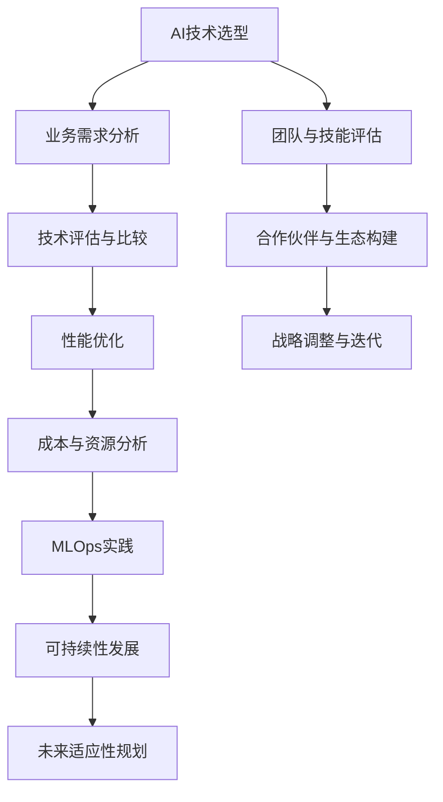

                 

# AI创业公司的技术选型策略

> **关键词**：AI技术选型、创业公司、技术战略、性能优化、可持续性发展

> **摘要**：本文深入探讨了AI创业公司在技术选型过程中所需考虑的多个关键因素。我们将从背景介绍、核心概念与联系、算法原理、数学模型、实战案例、应用场景等多个角度，逐步分析AI创业公司在技术选型时如何制定有效的策略。读者将了解如何平衡技术先进性与实际可行性，优化资源利用，以及确保技术选型的可持续性和未来适应性。

## 1. 背景介绍

### 1.1 目的和范围

本文旨在为AI创业公司提供一份全面的技术选型策略指南。我们将分析当前AI技术领域的趋势，探讨如何根据公司的具体情况和目标选择合适的技术路线。本文不仅涵盖技术层面的考量，还涉及业务战略和可持续发展等方面的内容。

### 1.2 预期读者

本文适合以下读者群体：

- 初创公司的技术负责人和CTO
- AI领域的研究人员和技术专家
- 投资者和商业顾问
- 对AI技术选型有兴趣的技术爱好者

### 1.3 文档结构概述

本文将分为以下几个部分：

1. 背景介绍：介绍文章的目的、范围和预期读者。
2. 核心概念与联系：定义核心概念，展示技术架构的Mermaid流程图。
3. 核心算法原理 & 具体操作步骤：讲解关键算法原理，并使用伪代码详细阐述。
4. 数学模型和公式 & 详细讲解 & 举例说明：介绍数学模型，使用latex格式展示公式，并进行举例说明。
5. 项目实战：提供实际代码案例，详细解释说明。
6. 实际应用场景：分析技术应用的场景和案例。
7. 工具和资源推荐：推荐学习和开发资源。
8. 总结：展望未来发展趋势与挑战。
9. 附录：常见问题与解答。
10. 扩展阅读 & 参考资料：提供进一步的阅读建议和参考资料。

### 1.4 术语表

#### 1.4.1 核心术语定义

- **AI技术选型**：指在选择AI技术时，对多种技术方案进行分析、评估和选择的过程。
- **创业公司**：指在初创阶段，以创新技术或商业模式为基础，致力于开拓新市场的企业。
- **技术战略**：企业在长期经营中，为实现业务目标和竞争优势而制定的技术规划和策略。
- **性能优化**：通过技术手段提高系统或应用的运行效率和响应速度。
- **可持续性发展**：在满足当前需求的同时，不损害后代满足自身需求的能力。

#### 1.4.2 相关概念解释

- **AI算法**：实现人工智能功能的具体方法，如深度学习、强化学习等。
- **技术栈**：一个项目中使用的所有技术和工具的集合。
- **MLOps**：机器学习与运维的结合，旨在提高机器学习系统的开发、部署和运维效率。

#### 1.4.3 缩略词列表

- **AI**：人工智能（Artificial Intelligence）
- **ML**：机器学习（Machine Learning）
- **DL**：深度学习（Deep Learning）
- **NLP**：自然语言处理（Natural Language Processing）
- **MLOps**：机器学习与运维（Machine Learning Operations）

## 2. 核心概念与联系

为了更好地理解AI创业公司在技术选型中的考量，我们需要首先了解一些核心概念及其相互联系。以下是一个简化的技术架构Mermaid流程图，展示了AI创业公司技术选型中的一些关键环节。



### 2.1. 业务需求分析

业务需求分析是技术选型的第一步，它关乎AI创业公司能否准确理解并满足市场需求。在这一过程中，公司需要：

- **市场调研**：了解目标市场的需求、竞争态势和用户行为。
- **业务目标**：明确公司的短期和长期目标，如产品性能、用户规模、市场占有率等。
- **用例场景**：定义AI技术将如何应用于实际业务场景，如推荐系统、智能客服、图像识别等。

### 2.2. 技术评估与比较

在业务需求明确后，公司需要评估和比较不同的AI技术方案。这一环节包括：

- **技术调研**：研究各种AI算法、框架和工具的性能、优缺点和适用场景。
- **性能测试**：通过实验或模拟，评估不同技术方案在实际应用中的表现。
- **成本分析**：考虑技术方案的开发、部署和维护成本，以及长期的可持续性。

### 2.3. 性能优化

性能优化是技术选型中的一个重要方面，它直接影响到产品的用户体验和市场竞争力。公司需要：

- **性能指标**：确定关键性能指标（KPIs），如响应时间、准确率、吞吐量等。
- **优化策略**：根据性能测试结果，采取算法优化、系统优化和资源调度等策略。
- **持续改进**：通过持续监控和反馈，不断优化系统性能。

### 2.4. 成本与资源分析

成本与资源分析是技术选型中不可忽视的一部分，它关系到公司的财务健康和资源利用效率。公司需要：

- **预算制定**：根据业务需求和性能目标，制定合理的预算计划。
- **资源评估**：评估公司现有的技术资源和人力资源，确定是否需要招聘新员工或引入外部资源。
- **成本效益分析**：通过成本与收益的比较，评估不同技术方案的经济效益。

### 2.5. MLOps实践

MLOps实践是将机器学习模型从开发到部署的全过程，确保其稳定运行和持续改进。公司需要：

- **模型管理**：建立模型生命周期管理机制，包括训练、验证、部署和监控等环节。
- **自动化流水线**：构建自动化流水线，提高模型开发、测试和部署的效率。
- **监控与反馈**：实时监控模型性能，收集用户反馈，进行持续优化。

### 2.6. 可持续性与未来适应性规划

可持续性与未来适应性规划是确保AI创业公司长期发展的关键。公司需要：

- **技术前瞻**：关注技术发展趋势，提前布局未来可能需要的技术。
- **资源可持续性**：采用绿色技术，降低能耗和碳排放，确保资源利用的可持续性。
- **战略调整**：根据市场和技术变化，灵活调整技术战略，以适应未来需求。

### 2.7. 团队与技能评估

团队与技能评估是技术选型中不可或缺的一环，它关系到项目的成功与否。公司需要：

- **团队建设**：建立具备多方面技能的技术团队，包括AI算法、系统架构、数据工程等。
- **技能提升**：通过培训和学习，不断提升团队的技术能力和专业水平。
- **知识共享**：鼓励团队成员之间的知识共享和协作，提高团队整体战斗力。

### 2.8. 合作伙伴与生态构建

合作伙伴与生态构建是AI创业公司成长过程中重要的一环。公司需要：

- **合作伙伴选择**：选择合适的合作伙伴，共同推动项目的进展和市场拓展。
- **生态构建**：建立良好的生态系统，包括技术合作伙伴、投资人、客户等。
- **合作模式**：探索多样化的合作模式，如战略合作、投资合作、技术共享等。

### 2.9. 战略调整与迭代

战略调整与迭代是技术选型过程中的一个持续过程。公司需要：

- **战略评估**：定期评估技术战略的执行效果，发现潜在问题和改进机会。
- **迭代优化**：根据评估结果，对技术战略进行优化和调整，以适应市场和技术变化。
- **持续学习**：通过不断学习和实践，积累经验，提高战略决策的科学性和有效性。

## 3. 核心算法原理 & 具体操作步骤

在AI创业公司的技术选型中，核心算法原理的理解和具体操作步骤的掌握至关重要。以下将介绍几个在AI技术选型中常用的核心算法，并使用伪代码详细阐述其原理和操作步骤。

### 3.1. 深度学习算法

深度学习算法是目前AI领域最流行的算法之一，其核心思想是通过多层神经网络对数据进行特征提取和学习。以下是深度学习算法的伪代码框架：

```python
# 深度学习算法伪代码

# 输入：训练数据集 X，标签数据集 Y，网络结构（层数、神经元数量等）
# 输出：训练好的神经网络模型

def train_deep_learning_model(X, Y, network_structure):
    # 初始化神经网络模型
    model = initialize_model(network_structure)
    
    # 设置优化器和损失函数
    optimizer = initialize_optimizer()
    loss_function = initialize_loss_function()
    
    # 训练神经网络模型
    for epoch in range(num_epochs):
        for x, y in zip(X, Y):
            # 前向传播
            predicted_output = forward_propagation(x, model)
            
            # 计算损失
            loss = loss_function(predicted_output, y)
            
            # 反向传播
            backward_propagation(predicted_output, y, model)
            
            # 更新模型参数
            optimizer.update(model.parameters())
        
        # 记录训练进度
        print(f"Epoch {epoch}: Loss = {loss}")
    
    # 返回训练好的模型
    return model
```

### 3.2. 强化学习算法

强化学习算法是一种通过试错来学习的算法，其核心思想是通过环境反馈不断调整策略，以最大化长期奖励。以下是强化学习算法的伪代码框架：

```python
# 强化学习算法伪代码

# 输入：环境模型，策略网络，奖励函数，训练迭代次数
# 输出：最优策略

def train_reinforcement_learning_model(environment, policy_network, reward_function, num_iterations):
    # 初始化策略网络
    policy_network = initialize_policy_network()
    
    # 设置优化器和损失函数
    optimizer = initialize_optimizer()
    loss_function = initialize_loss_function()
    
    # 训练迭代
    for iteration in range(num_iterations):
        # 执行一次策略动作
        action = policy_network.select_action()
        
        # 与环境互动
        next_state, reward = environment.step(action)
        
        # 更新策略网络
        loss = loss_function(policy_network, reward, next_state)
        optimizer.update(policy_network.parameters())
        
        # 记录训练进度
        print(f"Iteration {iteration}: Loss = {loss}")
    
    # 返回最优策略
    return policy_network
```

### 3.3. 图神经网络算法

图神经网络算法是一种用于处理图结构数据的深度学习算法，其核心思想是将节点和边的信息编码为向量，并通过神经网络进行特征提取和学习。以下是图神经网络算法的伪代码框架：

```python
# 图神经网络算法伪代码

# 输入：图结构数据，训练数据集，网络结构
# 输出：训练好的图神经网络模型

def train_graph_neural_network(graph_data, training_data, network_structure):
    # 初始化图神经网络模型
    model = initialize_model(network_structure)
    
    # 设置优化器和损失函数
    optimizer = initialize_optimizer()
    loss_function = initialize_loss_function()
    
    # 训练神经网络模型
    for epoch in range(num_epochs):
        for x, y in zip(training_data, graph_data):
            # 前向传播
            predicted_output = forward_propagation(x, model)
            
            # 计算损失
            loss = loss_function(predicted_output, y)
            
            # 反向传播
            backward_propagation(predicted_output, y, model)
            
            # 更新模型参数
            optimizer.update(model.parameters())
        
        # 记录训练进度
        print(f"Epoch {epoch}: Loss = {loss}")
    
    # 返回训练好的模型
    return model
```

以上是几种常见AI算法的核心原理和伪代码实现。在实际应用中，AI创业公司需要根据具体业务需求和场景选择合适算法，并结合具体情况进行优化和调整。

## 4. 数学模型和公式 & 详细讲解 & 举例说明

在AI创业公司的技术选型过程中，理解并运用相关的数学模型和公式至关重要。以下将介绍一些在机器学习和深度学习领域常用的数学模型和公式，并使用latex格式进行详细讲解和举例说明。

### 4.1. 损失函数

损失函数是机器学习模型评估和优化过程中不可或缺的一部分。它用于衡量模型预测结果与实际结果之间的差距。以下是一些常用的损失函数：

#### 4.1.1. 交叉熵损失函数

交叉熵损失函数在分类问题中广泛应用，其公式如下：

$$
L_{CE} = -\frac{1}{n}\sum_{i=1}^{n}y_{i}\log(\hat{y}_{i})
$$

其中，$y_{i}$ 是真实标签，$\hat{y}_{i}$ 是模型的预测概率。

**举例说明**：

假设我们有一个二分类问题，真实标签为$y = [1, 0]$，模型预测的概率为$\hat{y} = [0.8, 0.2]$，则交叉熵损失为：

$$
L_{CE} = -\frac{1}{2}\left[1 \cdot \log(0.8) + 0 \cdot \log(0.2)\right] \approx 0.229
$$

#### 4.1.2. 均方误差损失函数

均方误差损失函数在回归问题中应用广泛，其公式如下：

$$
L_{MSE} = \frac{1}{n}\sum_{i=1}^{n}(y_{i} - \hat{y}_{i})^2
$$

其中，$y_{i}$ 是真实值，$\hat{y}_{i}$ 是模型的预测值。

**举例说明**：

假设我们有一个回归问题，真实值为$y = [5, 3, 2]$，模型预测的值为$\hat{y} = [4.8, 3.2, 1.8]$，则均方误差损失为：

$$
L_{MSE} = \frac{1}{3}\left[(5 - 4.8)^2 + (3 - 3.2)^2 + (2 - 1.8)^2\right] \approx 0.04
$$

### 4.2. 优化算法

优化算法用于调整模型参数，以最小化损失函数。以下介绍几种常用的优化算法：

#### 4.2.1. 随机梯度下降（SGD）

随机梯度下降是最简单和最常用的优化算法之一，其公式如下：

$$
w_{t+1} = w_{t} - \alpha \cdot \nabla_w L(w)
$$

其中，$w_{t}$ 是当前参数，$\alpha$ 是学习率，$\nabla_w L(w)$ 是损失函数关于参数的梯度。

**举例说明**：

假设当前参数为$w = [1, 2]$，学习率为$\alpha = 0.1$，损失函数关于参数的梯度为$\nabla_w L(w) = [-0.5, -1]$，则下一轮参数更新为：

$$
w_{t+1} = [1, 2] - 0.1 \cdot [-0.5, -1] = [1.05, 1.1]
$$

#### 4.2.2. Adam优化器

Adam优化器是一种结合了SGD和RMSprop优点的自适应优化算法，其公式如下：

$$
m_t = \beta_1 m_{t-1} + (1 - \beta_1) (g_t - m_{t-1})
$$
$$
v_t = \beta_2 v_{t-1} + (1 - \beta_2) (g_t^2 - v_{t-1})
$$
$$
w_{t+1} = w_{t} - \alpha \frac{m_t}{\sqrt{v_t} + \epsilon}
$$

其中，$m_t$ 和 $v_t$ 分别是梯度的一阶矩估计和二阶矩估计，$\beta_1$ 和 $\beta_2$ 是动量系数，$\alpha$ 是学习率，$\epsilon$ 是一个很小的常数。

**举例说明**：

假设当前参数为$w = [1, 2]$，学习率为$\alpha = 0.1$，$\beta_1 = 0.9$，$\beta_2 = 0.99$，梯度为$g_t = [-0.3, -0.4]$，则下一轮参数更新为：

$$
m_t = [0.9 \cdot 0 + 0.1 \cdot (-0.3), 0.9 \cdot 0 + 0.1 \cdot (-0.4)] = [-0.03, -0.04]
$$
$$
v_t = [0.99 \cdot 0 + 0.01 \cdot (-0.3)^2, 0.99 \cdot 0 + 0.01 \cdot (-0.4)^2] = [0.009, 0.016]
$$
$$
w_{t+1} = [1, 2] - 0.1 \cdot \frac{[-0.03, -0.04]}{\sqrt{[0.009, 0.016]} + \epsilon} \approx [1.029, 1.036]
$$

通过以上数学模型和公式的讲解，我们可以更好地理解AI创业公司在技术选型过程中所需的数学基础，为实际应用提供理论支持。

## 5. 项目实战：代码实际案例和详细解释说明

在本节中，我们将通过一个实际项目案例，详细介绍如何进行AI创业公司的技术选型，包括开发环境搭建、源代码实现和代码解读与分析。

### 5.1 开发环境搭建

为了进行AI项目开发，我们需要搭建一个稳定、高效的开发环境。以下是一个典型的开发环境搭建流程：

**1. 操作系统选择**

- **Linux（推荐）：** Linux系统在AI领域应用广泛，具有良好的稳定性和开源生态。
- **Windows：** 如果团队有特定的Windows依赖或更熟悉Windows环境，可以选择Windows。

**2. 安装Python环境**

- **Python版本：** 选择Python 3.8或更高版本，以确保兼容性和性能。
- **安装方式：** 通过包管理工具（如pip）安装Python，并配置环境变量。

**3. 安装相关依赖**

- **深度学习框架：** 如TensorFlow、PyTorch等，根据项目需求选择合适的框架。
- **其他依赖：** 如NumPy、Pandas、Scikit-learn等基础库，以及MLOps工具（如Kubernetes、Docker等）。

```shell
pip install tensorflow
pip install numpy
pip install pandas
pip install scikit-learn
pip install matplotlib
```

**4. 配置开发工具**

- **IDE（集成开发环境）：** 如PyCharm、Visual Studio Code等，提供代码编写、调试和性能分析功能。
- **版本控制工具：** 如Git，用于代码版本管理和协作开发。

### 5.2 源代码详细实现和代码解读

以下是一个简单的图像分类项目案例，展示如何使用TensorFlow进行模型训练和预测。

**1. 数据准备**

```python
import tensorflow as tf
import tensorflow.keras
from tensorflow.keras.datasets import cifar10
from tensorflow.keras.models import Sequential
from tensorflow.keras.layers import Dense, Conv2D, Flatten, MaxPooling2D

# 加载CIFAR-10数据集
(x_train, y_train), (x_test, y_test) = cifar10.load_data()

# 数据预处理
x_train = x_train.astype('float32') / 255
x_test = x_test.astype('float32') / 255
y_train = tensorflow.keras.utils.to_categorical(y_train, 10)
y_test = tensorflow.keras.utils.to_categorical(y_test, 10)
```

**2. 模型构建**

```python
# 构建模型
model = Sequential()
model.add(Conv2D(32, (3, 3), activation='relu', input_shape=(32, 32, 3)))
model.add(MaxPooling2D(pool_size=(2, 2)))
model.add(Conv2D(64, (3, 3), activation='relu'))
model.add(MaxPooling2D(pool_size=(2, 2)))
model.add(Flatten())
model.add(Dense(64, activation='relu'))
model.add(Dense(10, activation='softmax'))

# 编译模型
model.compile(optimizer='adam', loss='categorical_crossentropy', metrics=['accuracy'])

# 打印模型结构
model.summary()
```

**3. 模型训练**

```python
# 训练模型
history = model.fit(x_train, y_train, epochs=10, batch_size=64, validation_split=0.2)
```

**4. 模型评估**

```python
# 评估模型
test_loss, test_acc = model.evaluate(x_test, y_test, verbose=2)
print(f"Test accuracy: {test_acc:.4f}")
```

**5. 模型预测**

```python
# 预测新数据
predictions = model.predict(x_test[:10])
predicted_classes = tensorflow.argmax(predictions, axis=1)
print(predicted_classes)
```

### 5.3 代码解读与分析

**1. 数据准备**

在这一部分，我们首先加载了CIFAR-10数据集，这是一个常见的图像分类数据集。数据预处理包括将图像数据缩放到[0, 1]范围内，并将标签转换为one-hot编码形式。

**2. 模型构建**

我们使用Sequential模型构建了一个简单的卷积神经网络（CNN）。模型包含两个卷积层、两个池化层和一个全连接层。卷积层用于提取图像特征，池化层用于下采样特征图，全连接层用于分类。

**3. 模型编译**

模型编译阶段指定了优化器、损失函数和评估指标。这里我们选择了Adam优化器和categorical_crossentropy损失函数，后者适用于多分类问题。

**4. 模型训练**

模型训练阶段使用fit方法进行，我们设置了10个训练周期（epoch）和64个批量大小（batch_size）。此外，我们还保留了20%的数据用于验证，以评估模型在未见过的数据上的性能。

**5. 模型评估**

模型评估阶段使用evaluate方法，我们计算了模型在测试集上的损失和准确率。测试准确率是评估模型性能的重要指标。

**6. 模型预测**

模型预测阶段使用predict方法，我们对新数据进行预测并输出预测结果。这里我们只展示了前10个测试样本的预测结果。

通过以上代码案例，我们可以看到如何使用TensorFlow实现一个简单的图像分类项目。实际应用中，根据具体需求和场景，我们可以进一步优化模型结构、调整超参数，以提高模型性能。

## 6. 实际应用场景

AI技术在创业公司的实际应用场景广泛，以下将列举几种典型的应用场景，并分析其技术选型和实施细节。

### 6.1 智能推荐系统

**应用背景**：随着互联网的发展，用户产生的数据量呈爆炸式增长，如何精准地推荐用户感兴趣的内容或产品成为众多创业公司关注的焦点。

**技术选型**：

- **推荐算法**：基于协同过滤、矩阵分解、深度学习等多种算法。协同过滤算法简单高效，但易受稀疏性问题影响；矩阵分解则能在一定程度上解决稀疏性问题，但计算复杂度较高；深度学习算法在处理复杂数据和特征时表现优异。

- **数据预处理**：包括用户行为数据、内容特征数据等的采集、清洗和预处理。

- **模型训练与部署**：选择合适的深度学习框架（如TensorFlow、PyTorch）进行模型训练和部署。

**实施细节**：

- **数据采集**：通过API、日志等方式收集用户行为数据。
- **特征工程**：提取用户和内容的特征，如用户浏览记录、购买历史、商品属性等。
- **模型优化**：通过交叉验证、调整超参数等方法优化模型性能。
- **实时推荐**：使用流处理技术（如Apache Kafka、Flink）实现实时推荐，提高用户体验。

### 6.2 智能客服系统

**应用背景**：随着企业服务需求的增加，传统人工客服难以满足大量用户的咨询需求，智能客服系统成为提升客户服务质量和效率的重要手段。

**技术选型**：

- **自然语言处理**：包括文本分类、实体识别、情感分析等技术，用于理解和处理用户提问。
- **对话管理**：设计对话流程和策略，确保客服系统能够有效地与用户进行交互。
- **语音识别与生成**：对于语音咨询，需要集成语音识别和语音合成技术。

**实施细节**：

- **文本处理**：使用NLP库（如NLTK、spaCy）进行文本预处理和特征提取。
- **对话流程设计**：定义客服系统的工作流程和响应策略。
- **语音处理**：集成开源语音识别和合成工具（如CMU Sphinx、Google Text-to-Speech）。
- **实时交互**：通过Websocket等技术实现实时互动，提高用户满意度。

### 6.3 图像识别与处理

**应用背景**：在安防、医疗、制造业等领域，图像识别与处理技术被广泛应用于目标检测、人脸识别、缺陷检测等场景。

**技术选型**：

- **目标检测算法**：如YOLO、SSD、Faster R-CNN等，用于定位图像中的目标物体。
- **人脸识别算法**：如基于深度学习的FaceNet、VGGFace等，用于识别人脸。
- **图像处理工具**：如OpenCV，用于图像增强、滤波、边缘检测等操作。

**实施细节**：

- **数据采集**：获取大量标注数据，用于模型训练。
- **算法优化**：通过调整网络结构、超参数等方法优化模型性能。
- **系统集成**：将图像识别算法集成到业务系统中，实现自动化处理。
- **实时处理**：使用GPU等硬件加速图像处理，提高处理速度。

### 6.4 智能语音助手

**应用背景**：随着智能硬件的普及，智能语音助手成为智能家居、车载系统等的重要组成部分。

**技术选型**：

- **语音识别**：采用ASR（自动语音识别）技术，将语音转换为文本。
- **语音合成**：使用TTS（文本到语音）技术，将文本转换为自然流畅的语音。
- **对话管理**：设计对话流程和策略，实现智能交互。

**实施细节**：

- **语音识别**：集成开源ASR工具（如CMU Sphinx、Kaldi）或使用商业API（如百度AI、腾讯云）。
- **语音合成**：使用开源TTS工具（如eSpeak、Flite）或商业API。
- **语音处理**：使用语音增强、降噪等技术提高语音质量。
- **用户交互**：设计自然、流畅的交互体验，提升用户体验。

通过以上实际应用场景的分析，我们可以看到AI技术在创业公司中具有广泛的应用前景。在实际实施过程中，需要根据具体业务需求和场景选择合适的技术方案，并不断优化和调整，以满足不断变化的市场需求。

## 7. 工具和资源推荐

在AI创业公司的技术选型过程中，选择合适的工具和资源至关重要。以下将推荐一些学习和开发资源、开发工具框架以及相关论文著作，以帮助创业公司顺利开展技术选型工作。

### 7.1 学习资源推荐

#### 7.1.1 书籍推荐

- 《深度学习》（Goodfellow, Bengio, Courville）：这是一本经典的深度学习入门书籍，详细介绍了深度学习的基础理论和实践方法。
- 《Python机器学习》（Sebastian Raschka）：本书涵盖了机器学习的基础知识，包括线性回归、决策树、神经网络等，并以Python语言为例进行了详细讲解。
- 《自然语言处理与深度学习》（Yarin Gal）：这本书针对自然语言处理领域，介绍了词嵌入、序列模型、注意力机制等深度学习技术。

#### 7.1.2 在线课程

- Coursera的《深度学习专项课程》（吴恩达）：这门课程由深度学习领域的知名专家吴恩达教授主讲，涵盖了深度学习的基础理论、实践方法和最新进展。
- edX的《机器学习基础》（MIT）：由MIT教授授课，介绍了机器学习的基本概念、算法和应用场景。
- Pluralsight的《AI与机器学习基础课程》：提供了丰富的视频教程，涵盖从入门到进阶的多个主题。

#### 7.1.3 技术博客和网站

- Medium上的《AI博客》（AI Blog）：这是一个汇集了众多AI领域专家文章的博客平台，涵盖了深度学习、自然语言处理、计算机视觉等多个方向。
- ArXiv：这是一个预印本论文发布平台，提供了大量最新的AI研究成果，是了解前沿技术的重要渠道。
- AI垂直媒体（如AI科技大本营、机器之心）：这些媒体定期发布AI领域的新闻、分析和教程，有助于了解行业动态和技术趋势。

### 7.2 开发工具框架推荐

#### 7.2.1 IDE和编辑器

- PyCharm：这是一款功能强大的Python IDE，支持多种编程语言，并提供代码补全、调试、性能分析等功能。
- Jupyter Notebook：这是一个基于Web的交互式计算环境，适用于数据分析和机器学习项目，支持多种编程语言。
- VSCode：这是一个轻量级、高度可扩展的代码编辑器，适用于各种编程语言，并提供丰富的插件支持。

#### 7.2.2 调试和性能分析工具

- TensorBoard：这是一个TensorFlow的调试和性能分析工具，可以可视化模型的训练过程和性能指标。
- Matplotlib：这是一个Python的数据可视化库，可以生成高质量的统计图表。
- Profiler：如Python的cProfile库，用于分析代码的执行时间，找出性能瓶颈。

#### 7.2.3 相关框架和库

- TensorFlow：这是一个开源的深度学习框架，适用于构建和训练各种深度学习模型。
- PyTorch：这是一个基于Python的深度学习框架，具有灵活的动态计算图和高效的GPU支持。
- Keras：这是一个高级神经网络API，可以方便地在TensorFlow和Theano上构建和训练模型。
- Scikit-learn：这是一个Python的机器学习库，提供了多种经典的机器学习算法和工具。

### 7.3 相关论文著作推荐

#### 7.3.1 经典论文

- "A Theoretical Analysis of the Voted Perceptron Algorithm"（Shalev-Shwartz & Ben-David）：这篇论文分析了投票感知机算法的理论性能，为理解机器学习算法的收敛性和稳定性提供了重要参考。
- "Learning to Represent Artistic Styles"（Ng & Krizhevsky）：这篇论文介绍了艺术风格迁移技术，展示了深度学习在计算机视觉领域的强大应用。
- "Recurrent Neural Network Based Language Model"（Bengio et al.）：这篇论文介绍了循环神经网络（RNN）在自然语言处理中的应用，奠定了现代序列模型的基础。

#### 7.3.2 最新研究成果

- "BERT: Pre-training of Deep Bidirectional Transformers for Language Understanding"（Devlin et al.）：这篇论文介绍了BERT模型，一种基于Transformer的预训练语言模型，大幅度提升了自然语言处理任务的性能。
- "Momentum Contrast for Unsupervised Visual Representation Learning"（Doersch et al.）：这篇论文提出了MoCo算法，用于无监督学习中的视觉表征学习，在图像分类任务中取得了优异的性能。
- "An Image Database for Studying the Concept of Pose"（Liang et al.）：这篇论文介绍了一个大规模的人体姿态数据集，为研究人体姿态识别提供了宝贵资源。

#### 7.3.3 应用案例分析

- "Deep Learning for Human Pose Estimation: A Survey"（Jana et al.）：这篇综述文章详细分析了深度学习在人体姿态估计领域的应用，涵盖了各种算法和模型。
- "AI in Healthcare: A Review of Recent Advances"（Li et al.）：这篇论文探讨了人工智能在医疗领域的应用，介绍了各种AI技术如何提升医疗服务质量和效率。
- "AI Applications in Manufacturing: A Comprehensive Review"（Al-Baiyati et al.）：这篇综述文章分析了人工智能在制造业中的应用，展示了AI技术如何提高生产效率和质量。

通过以上工具和资源的推荐，创业公司可以更好地开展技术选型工作，掌握前沿技术，提升自身竞争力。同时，相关论文著作的阅读也有助于深入了解AI技术的理论背景和应用方向。

## 8. 总结：未来发展趋势与挑战

AI创业公司在技术选型过程中，不仅要关注当前的技术趋势和市场需求，还需具备前瞻性，以应对未来可能的发展趋势和挑战。以下是未来AI技术发展趋势和创业公司可能面临的挑战：

### 8.1 发展趋势

1. **AI与5G的深度融合**：随着5G技术的普及，低延迟、高带宽的网络环境将为AI应用提供更好的支持，如实时智能监控、自动驾驶等。

2. **边缘计算与云计算的协同**：边缘计算能够降低数据传输延迟，提高数据处理效率，与云计算相结合，将推动AI在更广泛场景中的应用。

3. **多模态数据处理**：未来的AI系统将能够处理多种数据类型（如文本、图像、语音等），实现更复杂的场景理解和交互。

4. **自主决策与自动化**：AI系统将具备更强大的自主决策能力，能够在无人监督或少量监督的情况下进行学习和优化。

5. **隐私保护和数据安全**：随着数据隐私法规的加强，AI创业公司需要确保数据的安全性和隐私保护，以避免法律风险和用户信任问题。

### 8.2 挑战

1. **技术复杂性和人才短缺**：AI技术复杂，对人才的要求较高。创业公司需要持续投入资源进行技术研发和人才培养。

2. **数据质量和隐私**：高质量的数据是AI模型训练的基础，但数据的采集、存储和使用需要遵守隐私法规，如何在保护隐私的同时利用数据成为一大挑战。

3. **计算资源和成本**：AI模型的训练和部署需要大量的计算资源，对硬件设备和能耗的要求较高，如何在有限的资源下实现高效的计算是一个关键问题。

4. **模型解释性与可解释性**：随着模型的复杂度增加，如何确保模型的解释性和可解释性，让用户和监管机构能够理解和信任AI系统，是创业公司需要面对的挑战。

5. **商业模式的创新**：在激烈的市场竞争中，创业公司需要不断创新商业模式，以实现可持续的盈利和发展。

### 8.3 策略建议

为了应对未来发展趋势和挑战，AI创业公司可以采取以下策略：

1. **聚焦特定领域**：选择一个垂直领域，如医疗、金融、制造等，深耕细作，积累行业经验和数据。

2. **建立合作生态**：与高校、研究机构、行业伙伴建立合作关系，共享技术和资源，共同推动AI技术的应用和推广。

3. **持续技术创新**：保持技术前瞻性，不断探索和尝试新的技术和方法，提升自身的技术实力和竞争力。

4. **人才培养与引进**：重视人才培养，通过内部培训、外部招聘等方式，引进和培养高水平的技术人才。

5. **合规与隐私保护**：严格遵守相关法律法规，确保数据安全和隐私保护，树立良好的品牌形象。

通过以上策略，AI创业公司可以更好地应对未来的发展趋势和挑战，实现持续发展和创新。

## 9. 附录：常见问题与解答

### 9.1 技术选型问题

**Q1：如何选择合适的AI技术框架？**

A1：选择AI技术框架时，应考虑以下因素：

- **项目需求**：根据具体业务需求选择合适的框架，如深度学习框架（TensorFlow、PyTorch）或NLP框架（NLTK、spaCy）。
- **性能与效率**：考虑框架的性能和计算效率，选择能够满足项目性能要求的框架。
- **社区支持**：选择具有活跃社区和丰富的文档资源的框架，便于解决问题和获取支持。
- **兼容性与扩展性**：考虑框架的兼容性和扩展性，确保能够轻松集成其他技术和工具。

**Q2：如何评估AI算法的性能？**

A2：评估AI算法的性能通常包括以下几个方面：

- **准确性**：衡量算法在测试集上的预测准确性，常用的指标有准确率、召回率、F1值等。
- **鲁棒性**：评估算法对噪声数据的处理能力，通过添加噪声或使用不同的数据集进行测试。
- **效率**：评估算法的计算效率和资源占用，包括训练时间、推理时间和内存消耗等。
- **泛化能力**：通过交叉验证和跨领域测试，评估算法在未见过的数据上的性能。

### 9.2 资源管理问题

**Q3：如何优化AI模型的计算资源使用？**

A3：优化AI模型的计算资源使用可以从以下几个方面进行：

- **模型压缩**：通过模型剪枝、量化等技术减小模型大小，降低计算资源需求。
- **分布式训练**：利用分布式计算技术（如多GPU、多节点训练）加速模型训练，提高资源利用率。
- **异构计算**：结合CPU、GPU、FPGA等多种计算资源，实现计算任务的合理分配。
- **资源调度**：通过自动化调度工具（如Kubernetes）优化资源分配和任务调度，提高系统整体性能。

**Q4：如何确保数据安全和隐私保护？**

A4：确保数据安全和隐私保护可以从以下几个方面进行：

- **数据加密**：对数据进行加密处理，确保数据在传输和存储过程中的安全性。
- **访问控制**：实施严格的访问控制策略，限制对数据的访问权限。
- **匿名化处理**：对敏感数据进行匿名化处理，降低数据泄露的风险。
- **隐私保护算法**：采用隐私保护算法（如差分隐私）确保模型训练过程中对个人隐私的保护。
- **合规性检查**：定期进行合规性检查，确保数据处理符合相关法律法规的要求。

### 9.3 业务问题

**Q5：如何制定AI创业公司的商业战略？**

A5：制定AI创业公司的商业战略可以从以下几个方面进行：

- **市场分析**：深入分析市场需求、竞争态势和用户痛点，确定目标市场和用户群体。
- **产品定位**：根据市场需求和自身技术优势，明确产品定位和差异化优势。
- **商业模式**：探索多样化的商业模式，如软件即服务（SaaS）、B2B、B2C等，确保可持续的盈利模式。
- **合作伙伴**：寻找合适的合作伙伴，共同推动业务拓展和市场推广。
- **迭代优化**：根据市场反馈和业务数据，不断调整和优化商业战略，以适应市场变化。

通过以上常见问题与解答，创业公司可以更好地理解和应对AI技术选型、资源管理、商业战略等方面的挑战，实现持续发展和创新。

## 10. 扩展阅读 & 参考资料

为了深入理解和进一步探索AI创业公司的技术选型策略，以下推荐一些扩展阅读和参考资料，包括经典论文、最新研究成果、应用案例和技术博客等。

### 10.1 经典论文

- **“A Theoretical Analysis of the Voted Perceptron Algorithm”**（Shalev-Shwartz & Ben-David）：分析投票感知机算法的理论性能，为理解机器学习算法的收敛性和稳定性提供了重要参考。

- **“Deep Learning for Human Pose Estimation: A Survey”**（Jana et al.）：综述了深度学习在人体姿态估计领域的应用，涵盖了各种算法和模型。

- **“AI Applications in Healthcare: A Review of Recent Advances”**（Li et al.）：探讨了人工智能在医疗领域的应用，介绍了各种AI技术如何提升医疗服务质量和效率。

### 10.2 最新研究成果

- **“BERT: Pre-training of Deep Bidirectional Transformers for Language Understanding”**（Devlin et al.）：介绍了BERT模型，一种基于Transformer的预训练语言模型，大幅度提升了自然语言处理任务的性能。

- **“Momentum Contrast for Unsupervised Visual Representation Learning”**（Doersch et al.）：提出了MoCo算法，用于无监督学习中的视觉表征学习，在图像分类任务中取得了优异的性能。

- **“An Image Database for Studying the Concept of Pose”**（Liang et al.）：介绍了一个大规模的人体姿态数据集，为研究人体姿态识别提供了宝贵资源。

### 10.3 应用案例

- **“DeepMind Health”**：DeepMind公司利用深度学习技术为医疗机构提供智能诊断和治疗建议，通过分析医学影像数据提高了诊断准确率。

- **“IBM Watson”**：IBM Watson通过自然语言处理和深度学习技术，为医疗、金融、零售等多个行业提供智能解决方案，帮助企业和医疗机构提升运营效率。

- **“AICHI”**：AICHI公司利用计算机视觉技术提供智能监控解决方案，用于安防、交通等领域，通过实时图像分析提高了监控效率和准确性。

### 10.4 技术博客和网站

- **“AI博客”**：Medium上的一个AI垂直博客，汇集了众多AI领域专家的文章，涵盖了深度学习、自然语言处理、计算机视觉等多个方向。

- **“AI科技大本营”**：一个专注于AI领域的技术博客，定期发布行业动态、技术分析和应用案例。

- **“机器之心”**：一个全面介绍AI技术的中文网站，提供了丰富的教程、论文解读和技术交流。

### 10.5 相关书籍

- **《深度学习》**（Goodfellow, Bengio, Courville）：详细介绍了深度学习的基础理论和实践方法。

- **《Python机器学习》**（Sebastian Raschka）：涵盖了机器学习的基础知识，包括线性回归、决策树、神经网络等。

- **《自然语言处理与深度学习》**（Yarin Gal）：介绍了自然语言处理领域中的深度学习技术，如词嵌入、序列模型、注意力机制等。

通过阅读以上扩展阅读和参考资料，读者可以更深入地了解AI创业公司的技术选型策略，掌握前沿技术和应用案例，为实际工作提供有力的理论支持和实践指导。

