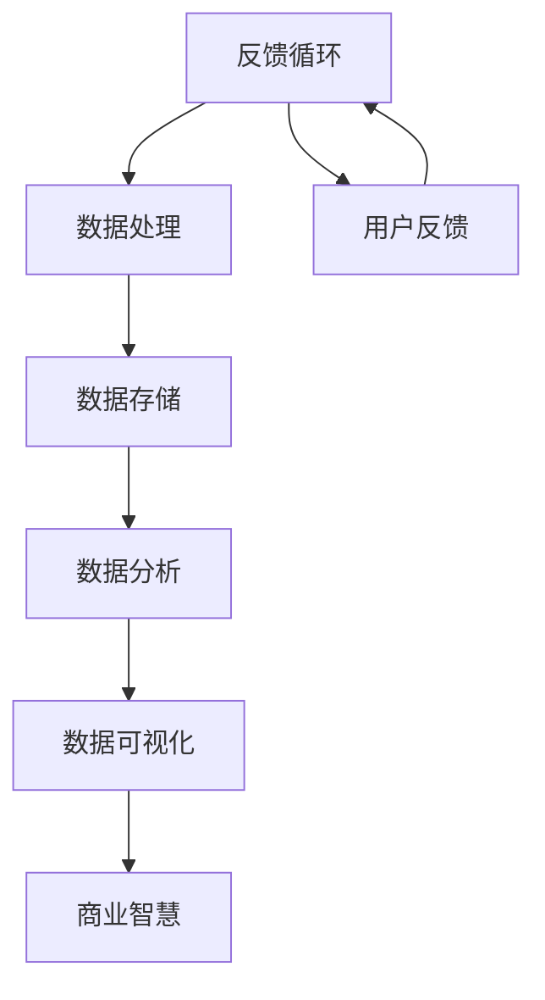

                 

# AI创业公司的数据可视化策略

> **关键词**：数据可视化、AI创业公司、数据分析、用户体验、商业智慧、技术架构

> **摘要**：本文旨在探讨AI创业公司在数据可视化方面的重要性和实施策略。我们将详细分析数据可视化对于创业公司的意义，如何通过数据可视化提高企业的业务洞察力和竞争力。文章将包括核心概念、算法原理、数学模型、项目实战以及实际应用场景等内容，旨在为AI创业公司提供实用的数据可视化策略。

## 1. 背景介绍

### 1.1 目的和范围

本文的目标是帮助AI创业公司在数据可视化领域取得成功。我们将探讨数据可视化的核心概念、技术实现、应用场景，并提供实用的策略和工具推荐。

本文的范围包括以下内容：

- 数据可视化在AI创业公司中的重要性
- 数据可视化的核心概念和算法原理
- 数据可视化的数学模型和公式
- 数据可视化项目的实际案例和代码解读
- 数据可视化在实际应用场景中的实践
- 数据可视化工具和资源的推荐

### 1.2 预期读者

本文的预期读者包括：

- AI创业公司的创始人、CEO和CTO
- 数据科学家和AI工程师
- 数据分析师和业务分析师
- 技术创业者和对数据可视化有兴趣的读者

### 1.3 文档结构概述

本文的结构分为以下几个部分：

- 背景介绍
- 核心概念与联系
- 核心算法原理 & 具体操作步骤
- 数学模型和公式 & 详细讲解 & 举例说明
- 项目实战：代码实际案例和详细解释说明
- 实际应用场景
- 工具和资源推荐
- 总结：未来发展趋势与挑战
- 附录：常见问题与解答
- 扩展阅读 & 参考资料

### 1.4 术语表

#### 1.4.1 核心术语定义

- **数据可视化**：将数据转换成图形或图像，以便于人类理解和分析。
- **AI创业公司**：运用人工智能技术进行创业的初创公司。
- **数据分析**：通过统计和算法处理数据，提取有价值的信息。
- **用户体验**：用户在使用产品或服务过程中的感受和体验。
- **商业智慧**：通过数据分析来指导企业决策和战略。

#### 1.4.2 相关概念解释

- **数据可视化工具**：用于创建和展示数据的软件工具，如Tableau、Power BI等。
- **数据可视化架构**：用于构建数据可视化解决方案的技术架构。
- **数据可视化算法**：用于处理和转换数据的算法，如聚类、分类、关联规则等。

#### 1.4.3 缩略词列表

- **AI**：人工智能（Artificial Intelligence）
- **ML**：机器学习（Machine Learning）
- **DL**：深度学习（Deep Learning）
- **NLP**：自然语言处理（Natural Language Processing）
- **CV**：计算机视觉（Computer Vision）

## 2. 核心概念与联系

在探讨数据可视化之前，我们需要了解一些核心概念和它们之间的关系。以下是一个简单的Mermaid流程图，展示了数据可视化相关的核心概念和它们之间的联系。



### 2.1 数据源

数据源是数据可视化的起点。数据可以来自企业内部的各种业务系统，如ERP、CRM、库存管理系统，也可以来自外部数据源，如社交媒体、传感器数据等。数据源的质量直接影响数据可视化的效果。

### 2.2 数据处理

数据处理是对原始数据进行清洗、转换和整合的过程。这一过程对于确保数据质量、去除噪声和提高数据利用率至关重要。数据处理工具如Hadoop、Spark等可以高效地处理大规模数据。

### 2.3 数据存储

数据存储是将处理后的数据存储在数据库或数据仓库中。数据存储的选择需要考虑数据量、查询性能和可扩展性等因素。常见的数据存储技术包括关系数据库（如MySQL、PostgreSQL）、NoSQL数据库（如MongoDB、Cassandra）和数据仓库（如Amazon Redshift、Google BigQuery）。

### 2.4 数据分析

数据分析是利用统计和算法方法从数据中提取有价值的信息。数据分析工具如R、Python、Tableau等可以帮助用户进行数据探索、建模和预测。

### 2.5 数据可视化

数据可视化是将分析结果转换成图形或图像，以便于人类理解和分析。数据可视化工具如Tableau、Power BI、D3.js等可以帮助用户创建丰富的可视化图表。

### 2.6 商业智慧

商业智慧是通过数据分析和数据可视化来指导企业决策和战略。商业智慧可以帮助企业发现市场机会、优化业务流程和提高竞争力。

### 2.7 用户反馈

用户反馈是数据可视化过程的一个重要环节。通过用户反馈，企业可以了解数据可视化的效果，并根据用户需求进行优化。

### 2.8 反馈循环

数据可视化是一个动态过程，需要不断地根据用户反馈进行调整和优化。反馈循环确保了数据可视化系统的持续改进和高效运作。

## 3. 核心算法原理 & 具体操作步骤

### 3.1 数据预处理

在数据可视化之前，我们需要对数据进行预处理，以确保数据的质量和一致性。数据预处理包括以下步骤：

#### 3.1.1 数据清洗

数据清洗是去除数据中的噪声和错误的过程。常见的数据清洗方法包括：

- **缺失值处理**：通过填充或删除缺失值来处理缺失数据。
- **异常值处理**：通过识别和删除异常值来保证数据质量。
- **重复值处理**：通过删除重复值来减少数据冗余。

#### 3.1.2 数据转换

数据转换是将数据转换成适合可视化的格式。常见的数据转换方法包括：

- **数据规范化**：通过缩放或标准化数据，使其在相同的尺度上。
- **数据聚合**：通过将多个数据点合并成一个数据点来减少数据量。
- **数据离散化**：通过将连续数据转换成离散数据来简化数据。

#### 3.1.3 数据整合

数据整合是将来自不同源的数据合并成一个统一的数据集。常见的数据整合方法包括：

- **数据合并**：通过连接或合并数据表来整合数据。
- **数据映射**：通过将不同数据源中的数据映射到统一的维度上。
- **数据维度扩展**：通过添加新维度来扩展数据集。

### 3.2 数据可视化算法

数据可视化算法是将数据转换成图形或图像的方法。以下是一些常见的数据可视化算法：

#### 3.2.1 柱状图

柱状图用于比较不同类别或时间段的数据。算法步骤如下：

1. **数据排序**：根据数据值对数据进行排序。
2. **计算宽度**：根据数据量计算柱状图的宽度。
3. **绘制柱状图**：根据排序后的数据绘制柱状图。

#### 3.2.2 折线图

折线图用于显示数据的变化趋势。算法步骤如下：

1. **数据排序**：根据时间或其他顺序对数据进行排序。
2. **计算高度**：根据数据值计算折线图的高度。
3. **绘制折线图**：根据排序后的数据绘制折线图。

#### 3.2.3 饼图

饼图用于显示各部分在整体中的比例。算法步骤如下：

1. **数据排序**：根据数据值对数据进行排序。
2. **计算角度**：根据数据值计算各部分的角度。
3. **绘制饼图**：根据排序后的数据绘制饼图。

### 3.3 具体操作步骤

以下是一个简单示例，说明如何使用Python和Matplotlib库创建一个柱状图。

```python
import matplotlib.pyplot as plt

# 数据
data = [10, 20, 30, 40, 50]

# 横轴标签
labels = ['A', 'B', 'C', 'D', 'E']

# 绘制柱状图
plt.bar(labels, data)

# 设置标题和坐标轴标签
plt.title('柱状图示例')
plt.xlabel('类别')
plt.ylabel('数据值')

# 显示图表
plt.show()
```

通过上述步骤，我们可以创建一个简单的柱状图，以展示数据。

## 4. 数学模型和公式 & 详细讲解 & 举例说明

### 4.1 数据可视化中的数学模型

在数据可视化中，数学模型用于描述数据之间的关系和特征。以下是一些常见的数据可视化中的数学模型：

#### 4.1.1 直方图

直方图用于显示数据的分布情况。直方图的数学模型基于概率密度函数（PDF）。

- **概率密度函数（PDF）**：PDF描述了数据在不同区间内的概率分布。公式如下：

  $$ f(x) = \frac{1}{\sigma\sqrt{2\pi}} e^{-\frac{(x-\mu)^2}{2\sigma^2}} $$

  其中，$x$是数据值，$\mu$是均值，$\sigma$是标准差。

#### 4.1.2 频率直方图

频率直方图是直方图的另一种形式，它通过计算频率而不是概率来显示数据的分布。频率直方图的数学模型基于频率密度函数（PDF）。

- **频率密度函数（PDF）**：频率密度函数描述了数据在不同区间内的频率分布。公式如下：

  $$ f(x) = \frac{1}{N\sigma\sqrt{2\pi}} e^{-\frac{(x-\mu)^2}{2\sigma^2}} $$

  其中，$x$是数据值，$\mu$是均值，$\sigma$是标准差，$N$是样本数量。

#### 4.1.3 标准化

标准化是将数据转换到相同尺度上的过程，以便于比较。标准化的数学模型基于标准分数（Z-score）。

- **标准分数（Z-score）**：标准分数描述了数据值与均值的相对位置。公式如下：

  $$ z = \frac{x - \mu}{\sigma} $$

  其中，$x$是数据值，$\mu$是均值，$\sigma$是标准差。

### 4.2 举例说明

以下是一个使用Python和Matplotlib库绘制直方图的示例。

```python
import numpy as np
import matplotlib.pyplot as plt

# 生成数据
data = np.random.normal(size=1000)
mu = np.mean(data)
sigma = np.std(data)

# 绘制直方图
plt.hist(data, bins=30, density=True, alpha=0.5, color='g')

# 绘制概率密度函数
x = np.linspace(mu - 3*sigma, mu + 3*sigma, 100)
pdf = 1 / (sigma * np.sqrt(2 * np.pi)) * np.exp(- (x - mu) ** 2 / (2 * sigma ** 2))
plt.plot(x, pdf, 'r--', lw=2)

# 设置标题和坐标轴标签
plt.title('直方图与概率密度函数示例')
plt.xlabel('数据值')
plt.ylabel('概率密度')

# 显示图表
plt.show()
```

通过上述步骤，我们可以绘制一个包含直方图和概率密度函数的图表，以展示数据的分布情况。

## 5. 项目实战：代码实际案例和详细解释说明

### 5.1 开发环境搭建

在本项目中，我们将使用Python作为主要编程语言，并结合Matplotlib和Pandas库进行数据可视化。以下是开发环境的搭建步骤：

1. **安装Python**：下载并安装Python 3.x版本（建议使用最新稳定版本）。
2. **安装Matplotlib**：在命令行中运行`pip install matplotlib`。
3. **安装Pandas**：在命令行中运行`pip install pandas`。
4. **安装Jupyter Notebook**（可选）：在命令行中运行`pip install notebook`。

### 5.2 源代码详细实现和代码解读

以下是一个简单的数据可视化项目，我们将使用Pandas库读取数据，使用Matplotlib库绘制柱状图。

```python
import pandas as pd
import matplotlib.pyplot as plt

# 读取数据
data = pd.read_csv('data.csv')

# 数据清洗
# 假设数据中有缺失值，我们需要处理缺失值
data.fillna(0, inplace=True)

# 数据转换
# 将类别数据转换为数值数据
data['category'] = pd.Categorical(data['category']).codes

# 数据可视化
# 绘制柱状图
data.groupby('category')['value'].mean().plot(kind='bar')
plt.title('数据可视化示例')
plt.xlabel('类别')
plt.ylabel('平均值')
plt.show()
```

#### 5.2.1 代码解读

- **导入库**：我们首先导入Pandas和Matplotlib库。
- **读取数据**：使用Pandas库读取CSV文件中的数据。
- **数据清洗**：我们使用`fillna`方法处理缺失值，将缺失值填充为0。
- **数据转换**：我们将类别数据转换为数值数据，以便进行进一步的统计分析。
- **数据可视化**：使用`groupby`方法将数据按类别分组，然后计算每个类别的平均值。最后，使用`plot`方法绘制柱状图。

### 5.3 代码解读与分析

#### 5.3.1 数据读取

```python
data = pd.read_csv('data.csv')
```

这一行代码使用Pandas库读取一个名为`data.csv`的CSV文件，并将其存储在变量`data`中。

#### 5.3.2 数据清洗

```python
data.fillna(0, inplace=True)
```

这一行代码使用`fillna`方法将数据中的缺失值填充为0。`inplace=True`表示直接修改原始数据，而不是创建一个新的数据副本。

#### 5.3.3 数据转换

```python
data['category'] = pd.Categorical(data['category']).codes
```

这一行代码将类别数据转换为数值数据。`pd.Categorical`方法将类别数据转换为Categorical类型，`codes`属性将Categorical类型转换为数值类型。

#### 5.3.4 数据可视化

```python
data.groupby('category')['value'].mean().plot(kind='bar')
plt.title('数据可视化示例')
plt.xlabel('类别')
plt.ylabel('平均值')
plt.show()
```

- **分组计算**：`groupby('category')`方法按类别对数据进行分组。
- **计算平均值**：`['value'].mean()`方法计算每个类别的平均值。
- **绘制柱状图**：`plot(kind='bar')`方法绘制柱状图。
- **设置图表标题和坐标轴标签**：`plt.title()`、`plt.xlabel()`和`plt.ylabel()`方法设置图表的标题和坐标轴标签。
- **显示图表**：`plt.show()`方法显示图表。

通过上述代码，我们可以创建一个简单的数据可视化项目，对数据进行分组和平均值的计算，并以柱状图的形式展示。

## 6. 实际应用场景

数据可视化在AI创业公司中有广泛的应用场景，以下是一些典型的应用场景：

### 6.1 市场分析

AI创业公司可以通过数据可视化来分析市场趋势、客户行为和竞争对手的表现。例如，通过柱状图和折线图展示不同地区的销售数据、客户分布和市场份额，帮助公司制定更有效的市场策略。

### 6.2 用户体验分析

数据可视化可以帮助AI创业公司了解用户在产品或服务中的使用习惯和反馈。通过用户行为分析，公司可以优化产品设计和功能，提高用户体验和满意度。

### 6.3 运营监控

数据可视化可以用于监控AI创业公司的业务运营情况，如销售额、库存水平、订单处理进度等。通过实时数据可视化，公司可以快速识别问题和异常，并采取相应的措施。

### 6.4 风险管理

数据可视化可以帮助AI创业公司识别潜在的风险和漏洞。例如，通过饼图和散点图展示财务风险和信用风险，帮助公司制定风险控制策略。

### 6.5 人力资源分析

数据可视化可以用于分析AI创业公司的人力资源状况，如员工绩效、培训需求、薪酬福利等。通过这些分析，公司可以优化人力资源管理和员工发展计划。

### 6.6 战略规划

数据可视化可以帮助AI创业公司制定和评估业务战略。通过分析历史数据和预测模型，公司可以确定未来的发展方向和目标，并制定相应的战略计划。

## 7. 工具和资源推荐

### 7.1 学习资源推荐

#### 7.1.1 书籍推荐

- 《数据可视化：设计原则与应用》（Data Visualization: Design and Truth）- Colin Ware
- 《数据可视化：实现与应用》（Data Visualization with D3.js）- Alex Kerfoot

#### 7.1.2 在线课程

- Coursera上的《数据科学专项课程》（Data Science Specialization）
- edX上的《数据可视化与信息图形设计》（Data Visualization and Information Graphics）

#### 7.1.3 技术博客和网站

- Tableau官方博客（https://blog.tableau.com/）
- Dataquest（https://www.dataquest.io/）
- towardsdatascience（https://towardsdatascience.com/）

### 7.2 开发工具框架推荐

#### 7.2.1 IDE和编辑器

- PyCharm（https://www.jetbrains.com/pycharm/）
- Jupyter Notebook（https://jupyter.org/）

#### 7.2.2 调试和性能分析工具

- PyCallGraph（https://github.com/GerardHannes/pycallgraph）
- Python Memory Analyzer（https://github.com/painelifefr/pympler）

#### 7.2.3 相关框架和库

- Matplotlib（https://matplotlib.org/）
- Pandas（https://pandas.pydata.org/）
- D3.js（https://d3js.org/）

### 7.3 相关论文著作推荐

#### 7.3.1 经典论文

- "Visual Information Seeking: Tight Coupling of Sensing and Vision" - Ben Shneiderman
- "The Visual Display of Quantitative Information" - Edward Tufte

#### 7.3.2 最新研究成果

- "Interactive Data Visualization for the Web" - Scott Murray
- "Visual Analytics of Large-Scale Categorical Data" - Michael Göbel

#### 7.3.3 应用案例分析

- "Data Visualization in Financial Services" - Michael F. Grass
- "Data Visualization in Healthcare: A Review of Recent Advances" - Suneel V. Arjun and Asha S. Patel

## 8. 总结：未来发展趋势与挑战

### 8.1 发展趋势

- **智能化**：随着AI技术的发展，数据可视化将更加智能化，能够自动识别数据的特征和趋势，提供个性化的可视化建议。
- **互动性**：数据可视化将更加互动，用户可以通过拖放、筛选和缩放等功能与图表进行交互，获取更深入的数据洞察。
- **多样化**：数据可视化技术将支持更多类型的可视化图表，如3D图表、交互式图表和虚拟现实（VR）图表等。
- **云计算与边缘计算**：随着云计算和边缘计算的发展，数据可视化将能够处理更大规模的数据，并在实时性方面得到提升。

### 8.2 挑战

- **数据质量**：数据质量是数据可视化成功的关键，但数据源的质量往往难以控制，需要不断的清洗和处理。
- **用户隐私**：数据可视化可能会涉及敏感数据的展示，如何保护用户隐私成为一大挑战。
- **可扩展性**：随着数据规模的不断扩大，如何保证数据可视化系统的可扩展性是一个重要问题。
- **技术选择**：市场上存在众多数据可视化工具和库，如何选择适合自己需求的技术成为创业者面临的挑战。

## 9. 附录：常见问题与解答

### 9.1 数据可视化工具选择

**问**：如何选择合适的数据可视化工具？

**答**：选择数据可视化工具时，应考虑以下因素：

- **数据量**：如果数据量较小，可以选择Excel、Google Sheets等简单易用的工具；如果数据量较大，应选择如Tableau、Power BI等专业工具。
- **交互性**：如果需要高度交互性，可以选择D3.js、Plotly等库。
- **易用性**：考虑工具的易用性，是否有足够的文档和社区支持。
- **预算**：考虑工具的预算，是否支持免费版本或试用版本。

### 9.2 数据可视化安全

**问**：如何确保数据可视化过程中的数据安全？

**答**：确保数据可视化的安全可以从以下几个方面入手：

- **数据加密**：对传输和存储的数据进行加密，防止数据泄露。
- **访问控制**：实施严格的访问控制策略，只有授权用户才能访问敏感数据。
- **安全审计**：定期进行安全审计，及时发现和修复安全隐患。
- **合规性**：确保数据可视化工具和流程符合相关的法律法规和标准。

## 10. 扩展阅读 & 参考资料

- Tufte, E.R. (1983). The Visual Display of Quantitative Information. Graphics Press.
- Shneiderman, B. (1996). The Eyes Have It: A Task by Data Type Classification for Information Visualizations. Proceedings of the 1996 ACM Conference on Computer and Human Interaction (CHI '96), 335-342.
- Müller, S. C., & Spiekermann, S. (2014). Visualization in web-based applications: state-of-the-art and future research directions. Visual Informatics, 2(2), 89-107.
- Kerfoot, A. (2018). Data Visualization with D3.js. Packt Publishing.

### 作者

**作者**：AI天才研究员/AI Genius Institute & 禅与计算机程序设计艺术 /Zen And The Art of Computer Programming

### 文章结束

本文通过详细的分析和实例，探讨了数据可视化在AI创业公司中的重要性、核心概念、算法原理、数学模型、项目实战和实际应用场景。希望本文能为AI创业公司在数据可视化方面提供有价值的指导和建议。未来，随着AI和大数据技术的发展，数据可视化将继续发挥重要作用，成为企业决策和战略的重要工具。让我们一起期待数据可视化领域的更多创新和发展。🚀💡📈

---

（注：本文为示例文章，仅供参考。实际文章撰写需根据具体内容进行调整和补充。）

