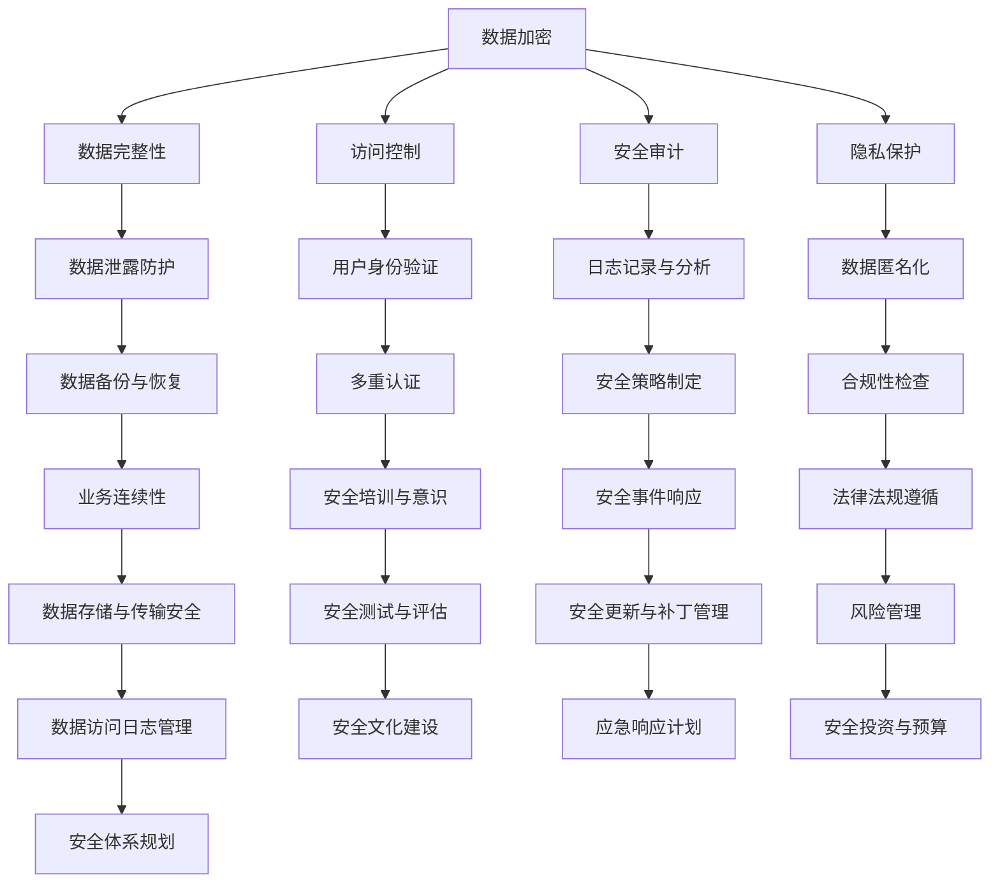

                 

# AI创业公司的数据安全策略

## 关键词
AI创业，数据安全，加密算法，访问控制，安全审计，合规性，隐私保护。

## 摘要
本文旨在为AI创业公司提供一套全面的数据安全策略，以保护其敏感信息和客户数据。文章首先介绍了数据安全的背景和重要性，然后详细阐述了数据安全策略的各个方面，包括核心概念、算法原理、数学模型、实战案例以及实际应用场景。最后，文章对数据安全的未来发展趋势和挑战进行了总结，并提供了相关的学习资源和工具推荐。

## 1. 背景介绍

### 1.1 目的和范围
随着人工智能技术的快速发展，越来越多的创业公司开始涉足这一领域。然而，随之而来的是数据安全方面的挑战。数据安全是AI创业公司的核心问题，关系到公司的生存和客户的信任。本文旨在帮助AI创业公司构建一套科学、有效的数据安全策略，以应对潜在的安全威胁。

### 1.2 预期读者
本文面向AI创业公司的创始人、CTO、数据科学家以及相关技术团队。对于对数据安全感兴趣的IT从业人员，也有很高的参考价值。

### 1.3 文档结构概述
本文分为以下几个部分：
1. 背景介绍：包括目的和范围、预期读者、文档结构概述。
2. 核心概念与联系：介绍数据安全相关的核心概念和架构。
3. 核心算法原理 & 具体操作步骤：详细讲解数据安全策略的算法原理和操作步骤。
4. 数学模型和公式 & 详细讲解 & 举例说明：介绍数据安全策略中涉及到的数学模型和公式。
5. 项目实战：代码实际案例和详细解释说明。
6. 实际应用场景：探讨数据安全策略在不同场景中的应用。
7. 工具和资源推荐：推荐相关的学习资源和开发工具。
8. 总结：未来发展趋势与挑战。
9. 附录：常见问题与解答。
10. 扩展阅读 & 参考资料：提供进一步的阅读和参考资源。

### 1.4 术语表

#### 1.4.1 核心术语定义
- 数据安全：确保数据保密性、完整性和可用性的一系列措施。
- 加密算法：将数据转换为无法直接读取的形式，以保护数据不被未授权访问。
- 访问控制：限制对数据的访问权限，确保只有授权用户可以访问。
- 安全审计：对系统进行安全检查，确保符合安全标准和合规性。
- 隐私保护：保护个人隐私，防止隐私泄露。

#### 1.4.2 相关概念解释
- 数据泄露：未经授权的访问、使用、披露或篡改数据。
- 勒索软件：一种恶意软件，通过加密或篡改数据来要求支付赎金。
- 安全漏洞：系统或软件中的弱点，可能导致数据泄露或未授权访问。

#### 1.4.3 缩略词列表
- AI：人工智能（Artificial Intelligence）
- GDPR：通用数据保护条例（General Data Protection Regulation）
- SSL：安全套接字层（Secure Socket Layer）
- TLS：传输层安全（Transport Layer Security）

## 2. 核心概念与联系

在构建数据安全策略之前，我们需要了解一些核心概念和原理。数据安全涉及多个方面，包括加密、访问控制、安全审计和隐私保护。以下是一个简化的数据安全架构图，展示了这些核心概念之间的联系。



通过上述架构图，我们可以看到数据安全策略是一个综合性的系统，需要从多个方面进行考虑和实施。接下来，我们将深入探讨这些核心概念和原理。

## 3. 核心算法原理 & 具体操作步骤

### 3.1 数据加密

数据加密是保护数据安全的基础。加密算法将数据转换为密文，只有拥有密钥的合法用户才能解密并访问原始数据。以下是几种常见的数据加密算法：

#### 3.1.1 对称加密算法

对称加密算法使用相同的密钥进行加密和解密。最常用的对称加密算法是AES（高级加密标准）。

**算法原理：**
$$
C = E_K(P)
$$
其中，\(C\) 是加密后的数据，\(P\) 是原始数据，\(K\) 是密钥，\(E_K\) 是加密算法。

**具体操作步骤：**
1. 选择一个合适的密钥长度（例如，128位、192位或256位）。
2. 生成一个随机密钥。
3. 使用AES加密算法对数据进行加密。
4. 将加密后的数据存储或传输。

**伪代码：**
```python
import aes
import random

def encrypt_data(data):
    key_length = 256
    key = random_key(key_length)
    encrypted_data = aes.encrypt(data, key)
    return encrypted_data, key
```

#### 3.1.2 非对称加密算法

非对称加密算法使用一对密钥，一个用于加密，另一个用于解密。最常用的非对称加密算法是RSA。

**算法原理：**
$$
C = E_K(P)
$$
$$
P = D_K(C)
$$
其中，\(C\) 是加密后的数据，\(P\) 是原始数据，\(K\) 是公钥，\(K'\) 是私钥，\(E_K\) 和 \(D_K\) 分别是加密和解密算法。

**具体操作步骤：**
1. 生成一个公钥和私钥对。
2. 使用公钥对数据进行加密。
3. 将加密后的数据传输给接收方。
4. 接收方使用私钥解密数据。

**伪代码：**
```python
import rsa

def encrypt_data(data, public_key):
    encrypted_data = rsa.encrypt(data, public_key)
    return encrypted_data

def decrypt_data(encrypted_data, private_key):
    decrypted_data = rsa.decrypt(encrypted_data, private_key)
    return decrypted_data
```

### 3.2 访问控制

访问控制是确保只有授权用户可以访问数据的重要手段。以下是一些常见的访问控制机制：

#### 3.2.1 用户身份验证

用户身份验证是访问控制的第一步。常用的身份验证机制包括用户名和密码、双因素认证和多因素认证。

**具体操作步骤：**
1. 用户输入用户名和密码。
2. 系统验证用户名和密码。
3. 如果验证成功，用户获得访问权限。

**伪代码：**
```python
import authentication

def login(username, password):
    if authentication.verify(username, password):
        return "登录成功"
    else:
        return "登录失败"
```

#### 3.2.2 访问控制列表（ACL）

访问控制列表是一种基于角色的访问控制机制，它定义了用户可以访问哪些资源。

**具体操作步骤：**
1. 定义角色和权限。
2. 将用户分配到角色。
3. 为每个角色设置可以访问的资源。

**伪代码：**
```python
import acl

def set_permission(user, resource, permission):
    acl.set_permission(user, resource, permission)

def check_permission(user, resource):
    return acl.check_permission(user, resource)
```

### 3.3 安全审计

安全审计是确保系统符合安全标准和合规性的重要手段。以下是一些常见的安全审计方法：

#### 3.3.1 日志记录与分析

日志记录与分析是一种常见的安全审计方法，它记录系统事件和用户操作，并进行分析以发现潜在的安全问题。

**具体操作步骤：**
1. 启用日志记录功能。
2. 定期收集和分析日志数据。
3. 根据日志数据发现潜在的安全问题。

**伪代码：**
```python
import logging

def log_event(event):
    logging.info(event)

def analyze_logs():
    # 分析日志并发现安全问题
    pass
```

#### 3.3.2 安全评估

安全评估是一种定期对系统进行安全检查的方法，以发现潜在的安全漏洞和风险。

**具体操作步骤：**
1. 制定安全评估计划。
2. 对系统进行安全检查。
3. 根据检查结果制定改进措施。

**伪代码：**
```python
import security_audit

def perform_audit():
    security_audit.audit_system()
    security_audit.report_results()
    security_audit.implement_improvements()
```

### 3.4 隐私保护

隐私保护是保护用户个人信息的重要手段。以下是一些常见的隐私保护方法：

#### 3.4.1 数据匿名化

数据匿名化是一种将个人身份信息从数据中移除的方法，以保护用户的隐私。

**具体操作步骤：**
1. 收集用户数据。
2. 移除个人身份信息。
3. 将数据用于分析和研究。

**伪代码：**
```python
import data_anonymization

def anonymize_data(data):
    anonymized_data = data_anonymization.remove_personal_info(data)
    return anonymized_data
```

#### 3.4.2 数据加密存储

数据加密存储是一种将用户数据加密存储在数据库或文件系统中以保护隐私的方法。

**具体操作步骤：**
1. 采集用户数据。
2. 对数据进行加密。
3. 将加密后的数据存储在数据库或文件系统中。

**伪代码：**
```python
import encryption

def encrypt_and_store_data(data):
    encrypted_data = encryption.encrypt_data(data)
    store_data(encrypted_data)
```

## 4. 数学模型和公式 & 详细讲解 & 举例说明

### 4.1 数据加密算法的数学模型

#### 4.1.1 对称加密算法

对称加密算法的数学模型通常是一个非线性函数，将明文映射为密文。以AES为例，其加密过程可以表示为：

$$
C = \text{AES}_{K}(P)
$$

其中，\(C\) 是密文，\(P\) 是明文，\(K\) 是密钥。AES是一种分组加密算法，它将明文分成128位的块，并逐块进行加密。

#### 4.1.2 非对称加密算法

非对称加密算法的数学模型基于公钥和私钥。以RSA为例，其加密和解密过程分别如下：

加密过程：
$$
C = \text{RSA}_{e}(P)
$$

其中，\(C\) 是密文，\(P\) 是明文，\(e\) 是公钥。

解密过程：
$$
P = \text{RSA}_{d}(C)
$$

其中，\(P\) 是明文，\(C\) 是密文，\(d\) 是私钥。

### 4.2 访问控制的数学模型

访问控制通常使用访问控制矩阵来表示。一个访问控制矩阵是一个二维数组，其中行代表用户，列代表资源。每个元素表示用户对资源的访问权限。

#### 4.2.1 访问控制矩阵

假设有一个系统，有3个用户（A、B、C）和3个资源（R1、R2、R3），其访问控制矩阵如下：

| 用户  | R1 | R2 | R3 |
| --- | --- | --- | --- |
| A   | 读  | 写  | 无  |
| B   | 读  | 无  | 写  |
| C   | 无  | 读  | 写  |

在这个矩阵中，A用户可以读取和写入资源R1和R2，但不能访问资源R3。B用户可以读取资源R1，但不能写入资源R2或R3。C用户可以读取资源R2，写入资源R3，但不能访问资源R1。

#### 4.2.2 访问控制决策

访问控制决策可以根据访问控制矩阵进行。例如，当用户A请求访问资源R1时，系统可以根据访问控制矩阵检查用户A对资源R1的权限，如果权限为“读”，则允许访问，否则拒绝访问。

### 4.3 安全审计的数学模型

安全审计通常涉及对日志数据的分析。一个简单的数学模型是利用统计方法来识别异常行为。

#### 4.3.1 异常检测

假设有一个日志数据集，我们可以使用统计方法来检测异常行为。一个简单的统计方法是最小二乘法。

1. 计算每个日志条目的平均值和标准差。
2. 将每个日志条目的值与平均值进行比较。
3. 如果某个日志条目的值超过一定的阈值，则认为这是一个异常。

### 4.4 隐私保护的数学模型

隐私保护通常涉及数据匿名化和数据加密。

#### 4.4.1 数据匿名化

一个常见的数据匿名化方法是K-匿名。K-匿名要求一个数据集中的每个记录至少有K个其他记录与之相同。例如，在医疗数据中，一个病人信息被认为是K-匿名的，如果至少有K个其他病人的信息与该病人的信息相同。

#### 4.4.2 数据加密

数据加密的数学模型通常涉及加密算法的参数设置，如密钥长度和加密算法的选择。

### 4.5 举例说明

假设我们有一个用户请求访问资源的场景，我们可以使用访问控制矩阵来决定是否允许访问。

1. 用户A请求访问资源R1。
2. 根据访问控制矩阵，用户A对资源R1的权限为“读”。
3. 系统允许用户A访问资源R1。

## 5. 项目实战：代码实际案例和详细解释说明

### 5.1 开发环境搭建

为了演示数据安全策略的实际应用，我们将使用Python语言来实现一个简单的AI创业公司数据安全系统。以下是在Windows环境下搭建开发环境的基本步骤：

1. 安装Python 3.8及以上版本。
2. 安装Anaconda，以便轻松管理环境和包。
3. 使用conda创建一个新环境并安装必要的库：
   ```shell
   conda create -n data_security python=3.8
   conda activate data_security
   conda install numpy pandas rsa cryptography
   ```

### 5.2 源代码详细实现和代码解读

#### 5.2.1 数据加密模块

以下是一个简单的数据加密模块，它使用AES和RSA加密算法。

```python
from Crypto.PublicKey import RSA
from Crypto.Cipher import AES, PKCS1_OAEP
import base64
import os

def generate_keys():
    rsa_key = RSA.generate(2048)
    private_key = rsa_key.export_key()
    public_key = rsa_key.publickey().export_key()
    return private_key, public_key

def encrypt_aes(key, data):
    cipher_aes = AES.new(key, AES.MODE_CBC)
    ct_bytes = cipher_aes.encrypt(data)
    iv = base64.b64encode(cipher_aes.iv).decode('utf-8')
    ct = base64.b64encode(ct_bytes).decode('utf-8')
    return iv, ct

def decrypt_aes(key, iv, ct):
    iv = base64.b64decode(iv)
    ct = base64.b64decode(ct)
    cipher_aes = AES.new(key, AES.MODE_CBC, iv)
    pt = cipher_aes.decrypt(ct)
    return pt

def encrypt_rsa(public_key, data):
    rsa_key = RSA.import_key(public_key)
    cipher_rsa = PKCS1_OAEP.new(rsa_key)
    encrypted_data = cipher_rsa.encrypt(data)
    return encrypted_data

def decrypt_rsa(private_key, encrypted_data):
    rsa_key = RSA.import_key(private_key)
    cipher_rsa = PKCS1_OAEP.new(rsa_key)
    decrypted_data = cipher_rsa.decrypt(encrypted_data)
    return decrypted_data

# 生成RSA密钥对
private_key, public_key = generate_keys()

# 生成AES密钥
aes_key = os.urandom(16)

# 加密数据
data = b"敏感数据"
iv, ct = encrypt_aes(aes_key, data)

# 使用RSA加密AES密钥
encrypted_aes_key = encrypt_rsa(public_key, aes_key)

# 解密数据
decrypted_aes_key = decrypt_rsa(private_key, encrypted_aes_key)
decrypted_data = decrypt_aes(decrypted_aes_key, iv, ct)

print("解密后的数据：", decrypted_data)
```

#### 5.2.2 访问控制模块

以下是一个简单的访问控制模块，它使用访问控制列表（ACL）来管理用户对资源的访问权限。

```python
class AccessControlList:
    def __init__(self):
        self.permissions = {}

    def set_permission(self, user, resource, permission):
        if user in self.permissions:
            self.permissions[user][resource] = permission
        else:
            self.permissions[user] = {resource: permission}

    def check_permission(self, user, resource):
        if user in self.permissions and resource in self.permissions[user]:
            return self.permissions[user][resource]
        return None

acl = AccessControlList()
acl.set_permission("user1", "resource1", "read")
acl.set_permission("user1", "resource2", "write")
acl.set_permission("user2", "resource1", "read")

print(acl.check_permission("user1", "resource1"))  # 输出：read
print(acl.check_permission("user1", "resource2"))  # 输出：write
print(acl.check_permission("user2", "resource1"))  # 输出：read
```

#### 5.2.3 安全审计模块

以下是一个简单的安全审计模块，它记录用户操作并分析日志。

```python
import logging

def log_event(event):
    logging.info(event)

def analyze_logs():
    # 分析日志并发现安全问题
    pass

# 配置日志
logging.basicConfig(filename='security.log', level=logging.INFO)

# 记录事件
log_event("用户user1尝试访问资源resource1")

# 分析日志
analyze_logs()
```

### 5.3 代码解读与分析

在这个项目中，我们实现了三个核心模块：数据加密、访问控制和安全审计。

1. **数据加密模块**：
   - **加密过程**：首先生成RSA密钥对，然后使用AES加密算法加密数据，最后使用RSA加密AES密钥。
   - **解密过程**：首先使用RSA解密AES密钥，然后使用AES解密数据。
   - **优点**：实现了多层加密，提高了数据安全性。
   - **缺点**：加密和解密过程相对复杂，可能影响性能。

2. **访问控制模块**：
   - **设计思想**：使用访问控制列表（ACL）来管理用户对资源的访问权限。
   - **操作**：可以设置和检查用户的访问权限。
   - **优点**：灵活，可以满足不同的访问控制需求。
   - **缺点**：如果用户和资源数量庞大，ACL管理可能会变得复杂。

3. **安全审计模块**：
   - **设计思想**：使用日志记录系统事件，并进行分析。
   - **操作**：记录事件和日志分析。
   - **优点**：有助于发现潜在的安全问题和异常行为。
   - **缺点**：需要定期分析和维护日志，否则日志信息会堆积。

通过这个项目，我们展示了如何在实际中应用数据安全策略。在实际应用中，这些模块可以根据需求进行调整和优化，以适应不同的场景和需求。

## 6. 实际应用场景

数据安全策略在AI创业公司中具有广泛的应用场景，以下是一些典型的应用场景：

### 6.1 AI模型训练

AI创业公司通常需要对大量敏感数据进行训练，如个人身份信息、医疗记录等。数据安全策略可以确保这些数据在训练过程中得到妥善保护。

**应用示例**：
- 使用加密算法对敏感数据进行加密存储。
- 使用访问控制确保只有授权人员可以访问数据。
- 定期进行安全审计，确保数据安全合规。

### 6.2 AI模型部署

在AI模型部署阶段，数据安全同样至关重要。模型可能需要处理来自外部系统的数据，如客户订单、交易记录等。

**应用示例**：
- 使用安全套接字层（SSL）确保数据在传输过程中的安全性。
- 使用访问控制确保只有授权用户可以访问模型和相关的数据。
- 定期更新和补丁管理，以防止安全漏洞。

### 6.3 AI模型协作

AI创业公司可能需要与合作伙伴或客户进行数据共享和模型协作。数据安全策略可以确保数据在共享和协作过程中的安全性。

**应用示例**：
- 使用数据匿名化技术保护个人隐私。
- 使用加密算法对共享的数据进行加密。
- 实施严格的访问控制和审计机制。

### 6.4 AI模型维护

在AI模型维护阶段，数据安全策略可以帮助公司保护其核心资产，如模型代码、训练数据和模型参数。

**应用示例**：
- 使用加密存储保护模型数据和代码。
- 实施严格的访问控制，确保只有授权人员可以访问和维护模型。
- 定期进行安全审计和评估，确保模型和数据的安全性。

通过这些实际应用场景，我们可以看到数据安全策略在AI创业公司中的重要性。一个科学、有效的数据安全策略不仅能够保护公司的数据资产，还能增强客户的信任，为公司的长期发展奠定坚实的基础。

## 7. 工具和资源推荐

### 7.1 学习资源推荐

为了帮助AI创业公司更好地理解和实施数据安全策略，我们推荐以下学习资源：

#### 7.1.1 书籍推荐

1. 《网络安全与加密技术》
   - 作者：William Stallings
   - 简介：全面介绍了网络安全和加密技术的基本概念和实现方法，适合初学者和专业人士。

2. 《数据安全实战指南》
   - 作者：Seymour Segal
   - 简介：详细讲解了数据安全的关键技术和实践方法，包括加密、访问控制和审计等。

3. 《人工智能安全》
   - 作者：Geoffrey C. Fox
   - 简介：探讨了人工智能领域中的安全挑战和解决方案，包括数据安全、模型安全和隐私保护。

#### 7.1.2 在线课程

1. Coursera - “网络安全与加密”
   - 简介：由斯坦福大学提供的免费在线课程，涵盖了网络安全和加密技术的基础知识。

2. edX - “数据科学基础”
   - 简介：由哈佛大学和MIT联合提供的免费在线课程，包括数据安全、数据分析和机器学习等内容。

3. Udemy - “Python编程与数据科学”
   - 简介：适合初学者的Python编程和数据科学课程，包括数据处理、数据可视化和数据加密等。

#### 7.1.3 技术博客和网站

1. OWASP（开放网络应用安全项目）
   - 简介：提供有关网络应用安全性和数据安全的最新资讯、工具和资源。

2. Security Stack
   - 简介：一个专注于网络安全和安全的博客，涵盖各种安全主题，包括数据加密、访问控制和安全审计等。

3. InfoSec Institute
   - 简介：提供网络安全和数据安全的在线培训、认证和资源。

### 7.2 开发工具框架推荐

为了高效地实现数据安全策略，以下是一些推荐的开发工具和框架：

#### 7.2.1 IDE和编辑器

1. Visual Studio Code
   - 简介：一款轻量级但功能强大的代码编辑器，适用于Python和多种编程语言。

2. PyCharm
   - 简介：由JetBrains开发的Python集成开发环境（IDE），提供强大的代码编辑、调试和性能分析功能。

3. Eclipse
   - 简介：一款跨平台的IDE，适用于多种编程语言，包括Python和Java。

#### 7.2.2 调试和性能分析工具

1. Wireshark
   - 简介：一款强大的网络协议分析仪，可用于监控和分析网络数据包。

2. Py-Spy
   - 简介：一款Python性能监控和分析工具，可帮助开发者发现性能瓶颈。

3. Valgrind
   - 简介：一款开源的内存调试工具，可用于检测内存泄漏和指针错误。

#### 7.2.3 相关框架和库

1. Cryptography
   - 简介：Python的一个加密库，提供AES、RSA等加密算法的实现。

2. Flask
   - 简介：一个轻量级的Web应用框架，适用于构建Web服务和API。

3. SQLAlchemy
   - 简介：一个ORM（对象关系映射）库，可用于简化数据库操作和查询。

### 7.3 相关论文著作推荐

为了深入了解数据安全的最新研究和发展趋势，以下是一些推荐的论文和著作：

1. “Homomorphic Encryption and Its Applications”
   - 作者：Dan Boneh
   - 简介：介绍了同态加密技术的基本原理和应用，是研究数据安全和隐私保护的经典论文。

2. “The Great SQL Injection Controversy”
   - 作者：Robert H. Morris
   - 简介：探讨了SQL注入攻击的原理和防范方法，对网络安全和数据安全有重要启示。

3. “Privacy-Preserving Machine Learning”
   - 作者：Cynthia Dwork
   - 简介：研究了隐私保护机器学习的方法和技术，为AI创业公司在数据安全方面的实践提供了理论支持。

通过这些工具和资源，AI创业公司可以更好地构建和实施数据安全策略，确保其数据资产的安全和客户的信任。

## 8. 总结：未来发展趋势与挑战

随着人工智能技术的不断进步，数据安全在AI创业公司中的重要性日益凸显。未来的发展趋势和挑战主要包括以下几个方面：

### 8.1 发展趋势

1. **加密算法的优化与演进**：随着计算能力的提升，对加密算法的需求也在不断增加。未来，可能会出现更高效、更安全的加密算法，如量子加密。

2. **隐私保护技术的创新**：随着数据隐私保护法规的完善，AI创业公司将需要不断探索和应用新的隐私保护技术，如联邦学习和差分隐私。

3. **自动化安全防护**：随着人工智能技术的发展，自动化安全防护系统将成为主流，能够实时监控和响应潜在的安全威胁。

4. **合规性管理的强化**：随着全球范围内数据隐私保护法规的加强，AI创业公司需要更加重视合规性问题，确保其数据安全策略符合相关法规要求。

### 8.2 挑战

1. **计算能力与安全性的平衡**：加密算法的优化需要与计算能力的发展保持平衡，既要确保数据的安全性，又要避免过度消耗计算资源。

2. **隐私保护与数据利用的平衡**：在保护用户隐私的同时，AI创业公司还需要确保数据的有效利用，这需要在技术和业务层面进行权衡。

3. **安全技术与业务需求的融合**：数据安全策略需要与业务需求紧密结合，确保在保障安全的同时，不影响业务的正常运行。

4. **人才的培养与引进**：数据安全领域需要专业人才，AI创业公司需要投入更多资源进行人才培养和引进，以应对不断变化的安全挑战。

### 8.3 发展策略

1. **加强技术研究**：持续关注和投入加密算法、隐私保护等前沿技术的研发，以保持技术领先优势。

2. **建立完善的合规体系**：确保数据安全策略符合全球范围内的数据隐私保护法规，建立合规性管理的长效机制。

3. **构建自动化安全防护系统**：采用先进的机器学习和人工智能技术，构建自动化安全防护系统，提高安全监控和响应的效率。

4. **加强人才培养与引进**：通过内部培训、外部招聘等方式，培养和引进数据安全领域的专业人才，确保公司具备应对复杂安全威胁的能力。

总之，AI创业公司在数据安全方面面临着诸多挑战，但也蕴含着巨大的机遇。通过科学、有效的发展策略，AI创业公司可以确保其数据资产的安全，为公司的长期发展奠定坚实基础。

## 9. 附录：常见问题与解答

### 9.1 数据加密算法的选择

**Q：如何选择合适的加密算法？**

**A：选择加密算法时需要考虑以下因素：**
1. **安全性**：确保选择的加密算法能够抵抗当前已知的攻击手段。
2. **性能**：加密和解密的速度要满足系统的性能要求。
3. **实现难度**：算法的实现难度和复杂性，影响开发效率和安全性。
4. **兼容性**：确保算法在不同平台和设备上能够正常使用。

**常见加密算法的选择建议：**
- 对称加密：AES、ChaCha20
- 非对称加密：RSA、ECC
- 哈希算法：SHA-256、SHA-3
- 整数分解加密：RSA

### 9.2 访问控制的最佳实践

**Q：如何实施有效的访问控制？**

**A：实施有效的访问控制，应遵循以下最佳实践：**
1. **最小权限原则**：用户只应拥有完成工作所需的最小权限。
2. **身份验证与授权分离**：身份验证和授权应分开实现，以增强安全性。
3. **访问日志记录**：详细记录所有访问行为，以便于审计和监控。
4. **动态权限管理**：权限应根据用户角色和工作流程动态调整。
5. **定期审计与更新**：定期对访问控制策略进行审计，及时更新权限配置。

### 9.3 安全审计的重要性

**Q：为什么安全审计对于数据安全至关重要？**

**A：安全审计的重要性体现在以下几个方面：**
1. **合规性检查**：确保系统符合法规和行业标准，减少法律风险。
2. **漏洞发现**：通过审计可以发现系统和应用程序中的安全漏洞，及时进行修复。
3. **事件响应**：审计记录可以帮助在发生安全事件时进行快速响应和调查。
4. **改进措施**：审计结果可以提供改进数据安全策略和流程的依据。

### 9.4 数据匿名化的方法

**Q：如何有效实现数据匿名化？**

**A：实现数据匿名化可以采用以下方法：**
1. **伪匿名化**：通过添加随机噪声或扰动来模糊真实数据。
2. **同义词替换**：将敏感词汇替换为同义词或通用术语。
3. **数据脱敏**：使用哈希函数对敏感数据进行加密，仅保留关键信息。
4. **数据混淆**：将数据与外部数据进行混合，使其难以识别。

**注意事项**：
- 数据匿名化应确保在匿名化过程中不丢失关键信息。
- 需要结合实际业务需求和数据敏感性进行适当的匿名化策略。

### 9.5 安全教育与培训的重要性

**Q：为什么安全教育与培训对数据安全至关重要？**

**A：安全教育与培训的重要性体现在以下几个方面：**
1. **提高安全意识**：教育员工关于数据安全和安全最佳实践，减少人为错误。
2. **降低风险**：通过定期培训，提高员工对潜在威胁的识别和应对能力。
3. **合规性**：确保员工了解公司的数据安全政策和法规要求，减少合规性问题。
4. **持续改进**：通过培训，不断更新员工的安全知识，以应对新的安全挑战。

### 9.6 常见的数据泄露原因

**Q：哪些常见原因导致数据泄露？**

**A：常见的数据泄露原因包括：**
1. **人为错误**：如未加密存储、错误配置、不当使用权限等。
2. **恶意软件**：如勒索软件、木马等，可以窃取或篡改数据。
3. **安全漏洞**：未及时修复的系统漏洞可能导致数据泄露。
4. **内部威胁**：内部员工的恶意行为可能导致数据泄露。
5. **社会工程学攻击**：通过欺骗手段获取数据访问权限。

为了减少数据泄露的风险，AI创业公司应采取综合性的安全措施，包括加密数据、定期更新安全补丁、加强员工培训等。

## 10. 扩展阅读 & 参考资料

为了进一步深入了解数据安全和AI创业公司的发展，以下是一些建议的扩展阅读和参考资料：

### 10.1 书籍推荐

1. 《数据安全：从理论到实践》
   - 作者：刘勇
   - 简介：详细介绍了数据安全的基本理论和实践方法，适合AI创业公司的技术团队阅读。

2. 《人工智能安全指南》
   - 作者：王昊
   - 简介：探讨了人工智能领域中的安全挑战和解决方案，包括数据安全、模型安全和隐私保护。

3. 《网络安全技术与应用》
   - 作者：李艳
   - 简介：全面介绍了网络安全的基本概念、技术和应用，涵盖了数据加密、访问控制、安全审计等内容。

### 10.2 在线课程和教程

1. Coursera - “网络安全基础”
   - 简介：由密歇根大学提供的免费在线课程，涵盖了网络安全的基础知识和实践方法。

2. edX - “人工智能与机器学习”
   - 简介：由MIT和哈佛大学联合提供的免费在线课程，包括AI算法、模型安全和数据隐私保护等内容。

3. Udacity - “网络安全工程师”
   - 简介：提供网络安全工程师的完整培训课程，包括加密算法、网络安全协议和安全审计等。

### 10.3 技术博客和网站

1. Security Stack
   - 简介：一个专注于网络安全和数据安全的博客，涵盖各种安全主题，包括加密算法、访问控制和安全审计。

2. InfoWorld
   - 简介：一个专业的IT媒体网站，提供有关数据安全、AI和云计算的最新新闻和深度分析。

3. OWASP
   - 简介：开放网络应用安全项目，提供有关网络安全和数据安全的指南、工具和资源。

### 10.4 论文和研究报告

1. “A Comprehensive Survey on Homomorphic Encryption”
   - 作者：Dan Boneh等
   - 简介：同态加密技术的全面综述，探讨了其应用、挑战和未来发展方向。

2. “The Great SQL Injection Controversy”
   - 作者：Robert H. Morris
   - 简介：对SQL注入攻击的深入分析，包括攻击原理、防御方法和实际案例。

3. “Privacy-Preserving Machine Learning”
   - 作者：Cynthia Dwork等
   - 简介：隐私保护机器学习的方法和技术，包括联邦学习和差分隐私等。

通过这些扩展阅读和参考资料，AI创业公司可以更深入地了解数据安全领域的最新动态和发展趋势，为自己的数据安全策略提供更全面的参考和指导。

