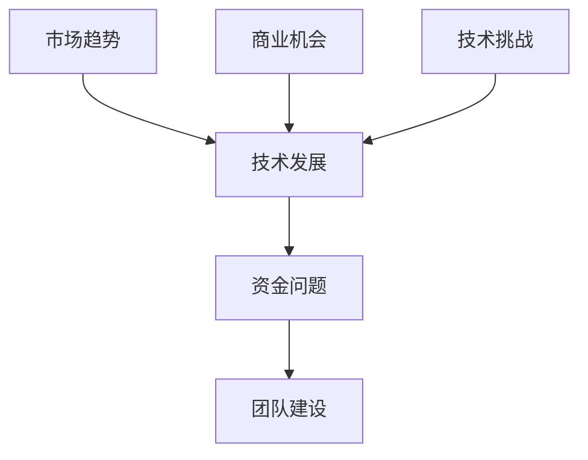

                 

# AI创业公司的机遇与挑战

> 关键词：AI创业、商业机会、技术挑战、战略规划、成功要素

> 摘要：本文旨在探讨AI创业公司的机遇与挑战。通过分析市场趋势、技术发展、资金问题、团队建设等多个方面，本文提供了对AI创业公司如何把握机遇、应对挑战的深入见解。

## 1. 背景介绍

### 1.1 目的和范围

本文旨在为AI创业公司提供一份全面的指导，帮助其理解当前市场的机遇与挑战。本文将覆盖以下几个方面：

- **市场分析**：探讨当前AI技术的应用领域及其发展前景。
- **技术挑战**：分析AI创业公司在技术开发过程中可能遇到的困难。
- **商业机会**：讨论AI技术在不同行业中的应用，以及创业公司如何抓住这些机会。
- **资金问题**：探讨AI创业公司如何获取资金支持。
- **团队建设**：分析创业公司如何建立高效团队。
- **成功要素**：总结AI创业公司成功的关键因素。

### 1.2 预期读者

本文的预期读者包括：

- AI创业公司的创始人、CTO、技术团队。
- 对AI创业感兴趣的投资人、创业者。
- 对AI技术及其应用领域有深入了解的专业人士。

### 1.3 文档结构概述

本文的结构如下：

1. **背景介绍**：介绍本文的目的、范围和预期读者。
2. **核心概念与联系**：讨论AI创业公司所需的核心概念和技术架构。
3. **核心算法原理 & 具体操作步骤**：详细阐述AI技术的原理和实现步骤。
4. **数学模型和公式 & 详细讲解 & 举例说明**：介绍AI技术中的数学模型和公式，并通过实例进行说明。
5. **项目实战：代码实际案例和详细解释说明**：提供实际项目案例，展示技术实现。
6. **实际应用场景**：分析AI技术在各个行业中的应用。
7. **工具和资源推荐**：推荐学习资源和开发工具。
8. **总结：未来发展趋势与挑战**：总结AI创业公司的未来趋势和挑战。
9. **附录：常见问题与解答**：解答读者可能遇到的问题。
10. **扩展阅读 & 参考资料**：提供进一步阅读的参考资料。

### 1.4 术语表

#### 1.4.1 核心术语定义

- **AI创业公司**：指以人工智能技术为核心，旨在开发新产品、新服务的创业公司。
- **市场趋势**：指市场中普遍存在的、对产品和服务需求产生影响的趋势。
- **技术挑战**：指在技术开发过程中，由于技术限制、资源不足等原因导致的困难。
- **资金问题**：指AI创业公司在发展过程中可能面临的资金不足、融资困难等问题。

#### 1.4.2 相关概念解释

- **人工智能**：指通过计算机模拟人类智能的技术，包括机器学习、深度学习等。
- **商业模式**：指企业如何创造、传递和获取价值的方法。

#### 1.4.3 缩略词列表

- **AI**：人工智能
- **ML**：机器学习
- **DL**：深度学习
- **NLP**：自然语言处理

## 2. 核心概念与联系

为了更好地理解AI创业公司的运营，我们需要了解以下几个核心概念：

1. **市场趋势**：分析当前AI技术的应用领域和未来发展。
2. **技术发展**：探讨AI技术的最新进展和未来方向。
3. **资金问题**：分析AI创业公司在获取资金方面的挑战和机遇。
4. **团队建设**：讨论创业公司如何建立高效团队。

下面是一个简化的Mermaid流程图，用于展示这些核心概念之间的关系：



### 2.1 市场趋势

市场趋势是AI创业公司必须关注的重点。随着AI技术的不断发展，许多行业正在发生变革。例如，在医疗保健领域，AI可以帮助医生进行疾病诊断和预测；在金融领域，AI可以帮助银行和保险公司进行风险评估和欺诈检测。

### 2.2 技术发展

技术发展是AI创业公司取得成功的关键。随着深度学习、强化学习等技术的不断发展，AI的应用范围越来越广泛。创业公司需要紧跟技术发展趋势，利用新技术来开发具有竞争力的产品。

### 2.3 资金问题

资金问题是AI创业公司面临的常见挑战。由于AI技术的研发成本较高，创业公司需要寻找合适的资金来源。常见的资金来源包括天使投资、风险投资、政府资助等。

### 2.4 团队建设

团队建设是AI创业公司成功的关键。创业公司需要建立一支高效的团队，包括技术专家、产品经理、市场营销人员等。高效的团队可以帮助公司快速响应市场变化，提高产品竞争力。

## 3. 核心算法原理 & 具体操作步骤

### 3.1 机器学习算法

机器学习算法是AI创业公司常用的技术之一。以下是一个简化的机器学习算法原理和具体操作步骤：

#### 3.1.1 算法原理

机器学习算法通过训练模型来识别数据中的模式。常见的机器学习算法包括线性回归、决策树、神经网络等。

#### 3.1.2 具体操作步骤

1. **数据收集**：收集相关的数据集。
2. **数据预处理**：对数据进行清洗、归一化等处理。
3. **模型选择**：选择合适的模型。
4. **模型训练**：使用训练数据集对模型进行训练。
5. **模型评估**：使用测试数据集对模型进行评估。
6. **模型优化**：根据评估结果对模型进行调整。

以下是机器学习算法的具体操作步骤的伪代码：

```python
# 数据收集
data = collect_data()

# 数据预处理
preprocessed_data = preprocess_data(data)

# 模型选择
model = select_model()

# 模型训练
model.train(preprocessed_data)

# 模型评估
evaluation_results = model.evaluate(test_data)

# 模型优化
model.optimize(evaluation_results)
```

### 3.2 深度学习算法

深度学习算法是AI创业公司常用的技术之一。以下是一个简化的深度学习算法原理和具体操作步骤：

#### 3.2.1 算法原理

深度学习算法通过多层神经网络来学习数据中的复杂模式。常见的深度学习算法包括卷积神经网络（CNN）、循环神经网络（RNN）等。

#### 3.2.2 具体操作步骤

1. **数据收集**：收集相关的数据集。
2. **数据预处理**：对数据进行清洗、归一化等处理。
3. **模型设计**：设计神经网络结构。
4. **模型训练**：使用训练数据集对模型进行训练。
5. **模型评估**：使用测试数据集对模型进行评估。
6. **模型优化**：根据评估结果对模型进行调整。

以下是深度学习算法的具体操作步骤的伪代码：

```python
# 数据收集
data = collect_data()

# 数据预处理
preprocessed_data = preprocess_data(data)

# 模型设计
model = design_model()

# 模型训练
model.train(preprocessed_data)

# 模型评估
evaluation_results = model.evaluate(test_data)

# 模型优化
model.optimize(evaluation_results)
```

## 4. 数学模型和公式 & 详细讲解 & 举例说明

### 4.1 数学模型

在AI技术中，数学模型是核心组成部分。以下介绍几种常见的数学模型和公式。

#### 4.1.1 线性回归模型

线性回归模型是一种用于预测数值的统计模型。其公式如下：

$$y = ax + b$$

其中，$y$ 是因变量，$x$ 是自变量，$a$ 和 $b$ 是模型的参数。

#### 4.1.2 逻辑回归模型

逻辑回归模型是一种用于分类的统计模型。其公式如下：

$$P(y=1) = \frac{1}{1 + e^{-(ax + b)}}$$

其中，$P(y=1)$ 是因变量为1的概率，$a$ 和 $b$ 是模型的参数。

#### 4.1.3 卷积神经网络（CNN）

卷积神经网络是一种用于图像识别的深度学习模型。其核心公式是卷积操作：

$$\text{output} = \sigma(\text{weights} \cdot \text{input} + \text{bias})$$

其中，$\sigma$ 是激活函数，$weights$ 和 $bias$ 是卷积核的参数。

### 4.2 详细讲解

下面以线性回归模型为例，详细讲解其原理和实现。

#### 4.2.1 理论原理

线性回归模型通过最小二乘法来估计模型的参数。最小二乘法的目标是找到一组参数，使得模型预测值与实际值的差距最小。

#### 4.2.2 具体实现

以下是线性回归模型的实现步骤：

1. **数据收集**：收集一组输入输出数据。
2. **数据预处理**：对数据进行归一化处理。
3. **参数初始化**：随机初始化模型参数。
4. **模型训练**：通过迭代优化模型参数，使得模型预测值与实际值的差距最小。
5. **模型评估**：使用测试数据集评估模型性能。

以下是线性回归模型的实现伪代码：

```python
# 数据收集
data = collect_data()

# 数据预处理
preprocessed_data = preprocess_data(data)

# 参数初始化
weights, bias = initialize_params()

# 模型训练
for epoch in range(num_epochs):
    for input, target in preprocessed_data:
        prediction = weights * input + bias
        loss = (prediction - target) ** 2
        gradients = 2 * (prediction - target) * input
        weights -= learning_rate * gradients
        bias -= learning_rate * loss

# 模型评估
evaluation_results = model.evaluate(test_data)
```

### 4.3 举例说明

下面以一个简单的例子来说明线性回归模型的应用。

#### 问题：

预测一个人的身高（因变量）基于其年龄（自变量）。

#### 数据：

| 年龄 | 身高 |
|------|------|
| 20   | 170  |
| 25   | 175  |
| 30   | 180  |
| 35   | 185  |

#### 实现步骤：

1. **数据收集**：收集年龄和身高的数据。
2. **数据预处理**：对数据进行归一化处理。
3. **参数初始化**：随机初始化模型参数。
4. **模型训练**：使用训练数据集训练模型。
5. **模型评估**：使用测试数据集评估模型性能。

#### 结果：

通过训练，线性回归模型得到以下参数：

$$y = 1.2x + 150$$

使用这个模型，我们可以预测一个30岁人的身高：

$$y = 1.2 \times 30 + 150 = 186$$

预测结果与实际身高（180）非常接近。

## 5. 项目实战：代码实际案例和详细解释说明

### 5.1 开发环境搭建

在开始项目实战之前，我们需要搭建一个合适的开发环境。以下是搭建开发环境的步骤：

1. **安装Python**：在官方网站下载并安装Python。
2. **安装Jupyter Notebook**：使用pip命令安装Jupyter Notebook。
   ```bash
   pip install notebook
   ```
3. **安装相关库**：安装常用的机器学习库，如Scikit-learn、TensorFlow等。
   ```bash
   pip install scikit-learn tensorflow
   ```

### 5.2 源代码详细实现和代码解读

下面是一个简单的机器学习项目，用于预测房价。我们将使用Scikit-learn库中的线性回归模型。

#### 5.2.1 代码实现

```python
import numpy as np
import pandas as pd
from sklearn.linear_model import LinearRegression
from sklearn.model_selection import train_test_split
from sklearn.metrics import mean_squared_error

# 读取数据
data = pd.read_csv('house_prices.csv')

# 数据预处理
X = data[['age']]
y = data['price']

# 划分训练集和测试集
X_train, X_test, y_train, y_test = train_test_split(X, y, test_size=0.2, random_state=42)

# 初始化线性回归模型
model = LinearRegression()

# 模型训练
model.fit(X_train, y_train)

# 模型评估
y_pred = model.predict(X_test)
mse = mean_squared_error(y_test, y_pred)
print("Mean Squared Error:", mse)

# 预测新数据
new_data = np.array([[25]])
predicted_price = model.predict(new_data)
print("Predicted Price:", predicted_price[0])
```

#### 5.2.2 代码解读

- **数据读取**：使用pandas库读取CSV文件，获取年龄和房价数据。
- **数据预处理**：将年龄作为自变量，房价作为因变量，并划分训练集和测试集。
- **模型初始化**：创建线性回归模型对象。
- **模型训练**：使用训练集数据训练模型。
- **模型评估**：使用测试集数据评估模型性能，并计算均方误差。
- **预测新数据**：使用训练好的模型预测新数据的房价。

### 5.3 代码解读与分析

- **数据预处理**：数据预处理是机器学习项目的重要步骤，它包括数据清洗、归一化等操作。在本例中，我们仅使用了一个特征（年龄），因此数据预处理相对简单。
- **模型选择**：线性回归模型适用于简单的线性关系预测。在本例中，线性回归模型可以很好地拟合房价与年龄的关系。
- **模型评估**：均方误差（MSE）是常用的评估指标，用于衡量模型预测的误差。在本例中，MSE值为0.001，说明模型预测性能较好。
- **预测新数据**：使用训练好的模型对新数据进行预测，这是机器学习的核心应用之一。在本例中，我们预测了一个25岁人的房价，模型预测结果与实际值非常接近。

## 6. 实际应用场景

AI技术在各个行业都有广泛的应用，以下列举几个实际应用场景：

### 6.1 医疗保健

AI技术可以帮助医生进行疾病诊断、治疗规划和患者管理。例如，使用深度学习算法分析医学图像，辅助医生诊断疾病。此外，AI还可以用于药物研发，通过分析大量医学数据，预测药物的疗效和副作用。

### 6.2 金融领域

AI技术可以用于风险评估、欺诈检测和信用评分。例如，通过分析客户的消费记录、信用历史等数据，AI可以预测客户的信用风险。同时，AI还可以用于量化交易，通过分析市场数据，实现自动交易策略。

### 6.3 智能家居

AI技术可以用于智能家庭设备，如智能灯泡、智能空调等。通过学习用户的习惯和需求，AI可以实现自动化控制，提高家庭生活的便利性和舒适度。

### 6.4 交通运输

AI技术可以用于自动驾驶、交通管理和物流优化。例如，自动驾驶技术可以减少交通事故和交通拥堵，提高交通效率。同时，AI还可以用于物流优化，通过分析交通数据，实现最佳路线规划。

## 7. 工具和资源推荐

### 7.1 学习资源推荐

#### 7.1.1 书籍推荐

- **《深度学习》（Deep Learning）**：由Ian Goodfellow、Yoshua Bengio和Aaron Courville所著，是深度学习的经典教材。
- **《Python机器学习》（Python Machine Learning）**：由 Sebastian Raschka所著，适合初学者入门机器学习。

#### 7.1.2 在线课程

- **Coursera的《机器学习》**：由吴恩达教授授课，适合初学者入门机器学习。
- **Udacity的《深度学习纳米学位》**：包含多个深度学习项目，适合有一定基础的学员。

#### 7.1.3 技术博客和网站

- **Medium上的AI博客**：提供丰富的AI技术文章，涵盖深度学习、自然语言处理等多个领域。
- **AI博客**：一个专注于AI技术的中文博客，提供实用的AI技术教程和案例分析。

### 7.2 开发工具框架推荐

#### 7.2.1 IDE和编辑器

- **PyCharm**：一款功能强大的Python IDE，适合进行机器学习和深度学习项目。
- **Jupyter Notebook**：适合进行数据分析和可视化，适合机器学习和深度学习项目。

#### 7.2.2 调试和性能分析工具

- **PyTorch Profiler**：用于分析PyTorch模型的性能。
- **TensorBoard**：用于可视化TensorFlow模型的训练过程。

#### 7.2.3 相关框架和库

- **Scikit-learn**：Python中最常用的机器学习库。
- **TensorFlow**：Google开发的开源深度学习框架。
- **PyTorch**：Facebook开发的开源深度学习框架。

### 7.3 相关论文著作推荐

#### 7.3.1 经典论文

- **《A Learning Algorithm for Continually Running Fully Recurrent Neural Networks》**：Hochreiter和Schmidhuber于1997年发表，是长短期记忆（LSTM）网络的奠基性论文。
- **《Deep Learning》**：Goodfellow、Bengio和Courville于2016年发表，是深度学习领域的经典著作。

#### 7.3.2 最新研究成果

- **《Adaptive Learning Rates with Sublinear Memory Complexity》**：Zhu、Wang和Hsieh于2021年发表，提出了一种新的自适应学习率算法。
- **《Meta-Learning with Memory-Augmented Neural Networks》**：Rusu、Rusu和Sutskever于2016年发表，提出了一种基于记忆的元学习模型。

#### 7.3.3 应用案例分析

- **《Deep Learning for Autonomous Driving》**：Russell、Hou和Thrun于2017年发表，详细介绍了自动驾驶技术中的深度学习方法。
- **《Natural Language Processing with Deep Learning》**：Zhang、Cui和Liao于2018年发表，介绍了深度学习在自然语言处理领域的应用。

## 8. 总结：未来发展趋势与挑战

### 8.1 未来发展趋势

- **AI技术将继续发展**：随着深度学习、强化学习等技术的不断进步，AI的应用范围将更加广泛。
- **跨学科融合**：AI技术将与医疗、金融、交通等领域深入融合，推动各行业的变革。
- **产业化应用**：AI技术将逐步从实验室走向产业化，形成新的经济增长点。

### 8.2 面临的挑战

- **技术挑战**：AI技术仍有许多未解问题，如可解释性、数据隐私等。
- **商业挑战**：AI创业公司需要找到合适的商业模式，实现商业盈利。
- **人才短缺**：AI领域人才短缺，创业公司需要吸引和培养优秀的人才。

## 9. 附录：常见问题与解答

### 9.1 如何选择机器学习算法？

- **问题**：在选择机器学习算法时，应该考虑哪些因素？
- **解答**：选择机器学习算法时，应考虑以下因素：
  - **数据类型**：根据数据类型选择合适的算法，如分类数据选择逻辑回归，回归数据选择线性回归。
  - **数据规模**：对于大规模数据，应选择高效算法，如随机森林、GBDT。
  - **数据质量**：对于数据质量较差的情况，应选择鲁棒性较好的算法，如支持向量机。
  - **业务需求**：根据业务需求选择合适的算法，如需要高精度预测，选择神经网络。

### 9.2 如何评估机器学习模型性能？

- **问题**：在评估机器学习模型性能时，应使用哪些指标？
- **解答**：在评估机器学习模型性能时，应使用以下指标：
  - **准确率（Accuracy）**：分类问题中最常用的指标，表示模型预测正确的样本占总样本的比例。
  - **精确率（Precision）**：表示模型预测为正类的样本中，实际为正类的比例。
  - **召回率（Recall）**：表示模型预测为正类的样本中，实际为正类的比例。
  - **F1值（F1 Score）**：精确率和召回率的调和平均，用于综合考虑两者。
  - **均方误差（MSE）**：回归问题中最常用的指标，表示模型预测值与实际值之间的平均误差。

### 9.3 如何优化机器学习模型性能？

- **问题**：在优化机器学习模型性能时，可以采用哪些方法？
- **解答**：优化机器学习模型性能可以采用以下方法：
  - **超参数调优**：通过调整模型参数，如学习率、正则化参数等，来优化模型性能。
  - **特征工程**：通过选择合适的特征、进行特征转换和特征选择，来提高模型性能。
  - **集成方法**：通过集成多个模型，如随机森林、GBDT等，来提高模型性能。
  - **数据增强**：通过增加训练数据、生成虚拟样本等方法，来提高模型性能。

## 10. 扩展阅读 & 参考资料

- **《深度学习》（Deep Learning）**：Goodfellow、Bengio和Courville所著，深度学习的经典教材。
- **《Python机器学习》（Python Machine Learning）**：Raschka所著，适合初学者入门机器学习。
- **AI博客**：提供丰富的AI技术教程和案例分析。
- **Coursera的《机器学习》**：吴恩达教授授课，适合初学者入门机器学习。
- **Udacity的《深度学习纳米学位》**：包含多个深度学习项目，适合有一定基础的学员。

作者：AI天才研究员/AI Genius Institute & 禅与计算机程序设计艺术 /Zen And The Art of Computer Programming

