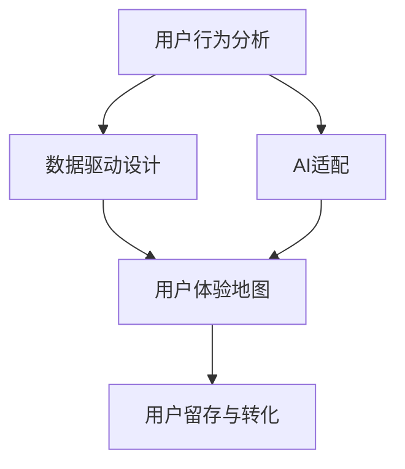

                 

# AI创业公司的用户体验设计：以人为本与智能适配

> **关键词：** 用户体验设计、AI、个性化、智能适配、用户行为分析、数据驱动、设计流程、创新应用。
>
> **摘要：** 本文章旨在深入探讨AI创业公司在用户体验设计中的挑战与机遇。通过以人为本和智能适配两大核心策略，文章详细阐述了如何通过用户行为分析和数据驱动设计，提升产品易用性，实现个性化体验，为用户提供极致的交互体验。文章不仅分析了相关核心概念与联系，还提供了具体的算法原理、数学模型及项目实战案例，旨在为AI创业公司提供切实可行的用户体验设计指导。

## 1. 背景介绍

### 1.1 目的和范围

用户体验设计（UX Design）在当前技术迅猛发展的时代背景下，已经成为产品成功的关键因素。AI创业公司在这一领域面临的挑战尤为突出。本文的目的在于：

1. **解析用户体验设计的核心要素**：探讨如何通过以人为本和智能适配策略，提升产品的用户体验。
2. **分析用户行为与数据分析的重要性**：介绍用户行为分析的方法和数据驱动的用户体验设计流程。
3. **提供实战案例**：通过具体项目案例，展示如何在实际开发中应用用户体验设计理念。
4. **推荐相关工具和资源**：为读者提供进一步学习和实践的路径。

### 1.2 预期读者

本文适合以下读者群体：

1. **AI创业公司产品经理与设计师**：需要了解如何将AI技术应用于用户体验设计。
2. **软件开发工程师**：希望了解用户体验设计原则和实践，以便更好地与设计师协作。
3. **用户体验研究员**：寻求提升用户研究和数据分析能力的专业人士。
4. **学术研究人员与教育工作者**：对用户体验设计理论和实践有兴趣的研究者。

### 1.3 文档结构概述

本文分为以下部分：

1. **背景介绍**：本文的背景和目的。
2. **核心概念与联系**：介绍用户体验设计的关键概念，并展示相关架构流程图。
3. **核心算法原理 & 具体操作步骤**：详细讲解用户行为分析算法原理和操作步骤。
4. **数学模型和公式 & 详细讲解 & 举例说明**：分析用户体验设计中应用的数学模型和公式。
5. **项目实战：代码实际案例和详细解释说明**：通过具体项目案例，展示用户体验设计实践。
6. **实际应用场景**：探讨用户体验设计在不同领域的应用。
7. **工具和资源推荐**：推荐学习资源和开发工具。
8. **总结：未来发展趋势与挑战**：预测用户体验设计的发展趋势和面临的挑战。
9. **附录：常见问题与解答**：提供对常见问题的解答。
10. **扩展阅读 & 参考资料**：推荐进一步阅读的材料。

### 1.4 术语表

#### 1.4.1 核心术语定义

- **用户体验设计（UX Design）**：关注产品如何满足用户需求，提升用户满意度。
- **用户行为分析**：通过数据收集和分析，了解用户如何与产品互动。
- **数据驱动设计**：设计决策基于数据分析而非主观判断。
- **AI适配**：利用人工智能技术，根据用户行为提供个性化的交互体验。
- **个性化体验**：产品根据用户特征和需求，提供定制化的内容和服务。

#### 1.4.2 相关概念解释

- **用户体验地图**：可视化展示用户与产品交互的流程。
- **A/B测试**：通过对比不同版本的产品，评估哪种设计更受欢迎。
- **留存率**：用户在一段时间后仍然使用产品的比例。
- **转化率**：用户完成预期行为的比例，如注册、购买等。

#### 1.4.3 缩略词列表

- **UX**：用户体验（User Experience）
- **AI**：人工智能（Artificial Intelligence）
- **ML**：机器学习（Machine Learning）
- **UXD**：用户体验设计（User Experience Design）
- **UI**：用户界面设计（User Interface Design）

## 2. 核心概念与联系

用户体验设计涉及多个核心概念，这些概念相互联系，共同作用于提升产品的用户体验。以下是用户体验设计中的几个关键概念及其相互关系。

### 2.1 用户行为分析

用户行为分析是用户体验设计的基础。通过收集和分析用户在产品中的互动数据，我们可以了解用户的行为模式、偏好和痛点。以下是用户行为分析的基本流程：

1. **数据收集**：利用各种工具，如日志分析、用户调查、用户测试等，收集用户行为数据。
2. **数据清洗**：处理和整理收集到的数据，确保数据的质量和准确性。
3. **数据分析**：运用统计方法和机器学习算法，分析用户行为数据，提取有用的信息。
4. **数据可视化**：将分析结果可视化，帮助设计师更好地理解用户行为。

用户行为分析的核心在于理解用户的需求和痛点，从而为产品迭代提供依据。

### 2.2 数据驱动设计

数据驱动设计是一种设计方法，其中设计决策基于数据分析而非主观判断。这种方法的优势在于：

1. **客观性**：通过数据，我们可以更客观地了解用户的需求和行为。
2. **迭代速度**：数据驱动设计可以快速迭代，及时调整设计方向。
3. **可衡量性**：数据驱动设计可以量化评估设计的有效性。

数据驱动设计的流程通常包括以下几个步骤：

1. **设定目标**：明确设计目标和关键指标。
2. **数据收集**：收集与目标相关的数据。
3. **数据分析**：分析数据，识别问题和机会。
4. **设计迭代**：基于数据分析结果，迭代优化设计。

### 2.3 AI适配

AI适配是利用人工智能技术，根据用户行为和偏好，提供个性化的交互体验。AI适配的核心在于：

1. **个性化推荐**：根据用户历史行为和偏好，推荐个性化内容和服务。
2. **智能交互**：通过自然语言处理和语音识别技术，实现智能对话和互动。

AI适配的设计流程包括：

1. **用户特征提取**：提取用户的兴趣、行为和偏好等特征。
2. **模型训练**：训练机器学习模型，预测用户偏好和需求。
3. **个性化推荐**：根据用户特征和模型预测，为用户推荐个性化内容和服务。
4. **实时反馈**：收集用户对个性化推荐的反馈，持续优化推荐系统。

### 2.4 用户体验地图

用户体验地图是一种可视化工具，用于展示用户与产品互动的全过程。用户体验地图包括以下几个部分：

1. **用户角色**：描述典型用户及其需求。
2. **用户旅程**：展示用户在产品中的交互流程。
3. **痛点与机会**：识别用户在使用产品过程中的痛点和改进机会。

用户体验地图有助于设计师：

1. **理解用户需求**：通过角色和用户旅程，深入了解用户。
2. **识别改进点**：通过痛点与机会，识别产品改进的方向。
3. **团队协作**：促进跨部门沟通，确保设计决策的一致性。

### 2.5 用户留存与转化

用户留存和转化是衡量用户体验设计成功的重要指标。用户留存率表示用户在一段时间后仍然使用产品的比例，而转化率表示用户完成预期行为的比例。

用户体验设计的目标是：

1. **提高用户留存率**：通过优化用户体验，降低用户流失率。
2. **提高转化率**：通过设计引导，促进用户完成预期行为。

为了实现这一目标，设计师可以采取以下策略：

1. **简洁明了的界面**：简化界面设计，降低用户的学习成本。
2. **个性化的交互**：根据用户特征和偏好，提供个性化体验。
3. **及时反馈**：及时响应用户的反馈，提升用户满意度。
4. **有效的引导**：通过设计引导，帮助用户快速上手。

### 2.6 Mermaid 流程图

以下是用户体验设计核心概念的Mermaid流程图：



该流程图展示了用户体验设计中的关键环节，以及各环节之间的相互关系。通过这一流程图，设计师可以全面了解用户体验设计的整体框架，为实际操作提供指导。

## 3. 核心算法原理 & 具体操作步骤

在用户体验设计中，核心算法原理的应用至关重要。以下将详细阐述用户行为分析算法的原理和具体操作步骤。

### 3.1 用户行为分析算法原理

用户行为分析算法的核心思想是通过对用户行为数据的收集、处理和分析，提取出用户的行为模式和兴趣点，从而为产品设计提供数据支持。具体算法原理包括以下几个关键步骤：

1. **数据收集**：通过日志分析、用户测试、问卷调查等方式，收集用户在产品中的行为数据。
2. **数据预处理**：对收集到的原始数据进行清洗、去噪和格式化，确保数据质量。
3. **特征提取**：从预处理后的数据中提取有用的特征，如点击率、浏览时间、转化率等。
4. **行为模式识别**：利用统计分析和机器学习算法，识别用户的行为模式。
5. **兴趣点挖掘**：通过行为模式识别，挖掘出用户在产品中的兴趣点。

### 3.2 具体操作步骤

下面将使用伪代码详细阐述用户行为分析算法的操作步骤。

```python
# 用户行为分析算法伪代码

# 步骤1：数据收集
data = collect_user_behavior_data()

# 步骤2：数据预处理
cleaned_data = preprocess_data(data)

# 步骤3：特征提取
features = extract_features(cleaned_data)

# 步骤4：行为模式识别
model = train_behavior_model(features)
behavior_patterns = predict_behavior_patterns(model)

# 步骤5：兴趣点挖掘
interest_points = identify_interest_points(behavior_patterns)

# 输出：用户行为模式与兴趣点
return behavior_patterns, interest_points
```

### 3.3 算法解释

1. **数据收集**：通过日志分析工具（如Google Analytics）收集用户在产品中的行为数据，包括点击、浏览、转化等。
2. **数据预处理**：对收集到的数据进行清洗，如去除无效数据、填充缺失值、标准化数据等，确保数据质量。
3. **特征提取**：从预处理后的数据中提取特征，如点击率、浏览时间、转化率等，这些特征能够反映用户的行为模式和兴趣点。
4. **行为模式识别**：使用机器学习算法（如决策树、随机森林、聚类算法等）训练模型，预测用户的行为模式。
5. **兴趣点挖掘**：通过分析行为模式，识别出用户在产品中的兴趣点，如热门功能、高频操作等。

### 3.4 举例说明

假设我们有一个电商平台的用户行为数据，包括用户的点击、浏览、购买等行为。我们希望利用用户行为分析算法，识别用户的行为模式和兴趣点。

1. **数据收集**：
   ```python
   data = [
       {"user_id": 1, "action": "click", "product_id": 101},
       {"user_id": 1, "action": "browse", "product_id": 202},
       {"user_id": 1, "action": "purchase", "product_id": 303},
       # 更多数据...
   ]
   ```

2. **数据预处理**：
   ```python
   cleaned_data = preprocess_data(data)
   # 清洗后的数据...
   ```

3. **特征提取**：
   ```python
   features = extract_features(cleaned_data)
   # 特征列表...
   ```

4. **行为模式识别**：
   ```python
   model = train_behavior_model(features)
   behavior_patterns = predict_behavior_patterns(model)
   # 用户行为模式...
   ```

5. **兴趣点挖掘**：
   ```python
   interest_points = identify_interest_points(behavior_patterns)
   # 用户兴趣点...
   ```

通过这一系列步骤，我们可以识别出用户在电商平台的行为模式和兴趣点，为产品设计和优化提供数据支持。

## 4. 数学模型和公式 & 详细讲解 & 举例说明

在用户体验设计中，数学模型和公式是分析和优化用户行为的关键工具。以下将详细介绍几种常用的数学模型和公式，并提供具体的应用场景和示例。

### 4.1 相关数学模型和公式

1. **贝叶斯公式**：
   贝叶斯公式是一种概率理论中的公式，用于计算后验概率。在用户体验设计中，贝叶斯公式可以用于预测用户的行为概率。

   公式：
   $$ P(A|B) = \frac{P(B|A) \cdot P(A)}{P(B)} $$

   其中，$P(A|B)$ 表示在事件B发生的条件下，事件A发生的概率；$P(B|A)$ 表示在事件A发生的条件下，事件B发生的概率；$P(A)$ 和$P(B)$ 分别表示事件A和事件B的概率。

2. **相关系数**：
   相关系数用于衡量两个变量之间的线性关系。皮尔逊相关系数是其中一种常用的相关系数。

   公式：
   $$ r = \frac{\sum{(x_i - \bar{x})(y_i - \bar{y})}}{\sqrt{\sum{(x_i - \bar{x})^2} \cdot \sum{(y_i - \bar{y})^2}}} $$

   其中，$x_i$ 和$y_i$ 分别表示第i个观测值，$\bar{x}$ 和$\bar{y}$ 分别表示$x_i$ 和$y_i$ 的平均值。

3. **线性回归模型**：
   线性回归模型用于预测因变量（响应变量）与自变量（解释变量）之间的关系。在用户体验设计中，线性回归模型可以用于预测用户行为。

   公式：
   $$ y = \beta_0 + \beta_1 \cdot x + \epsilon $$

   其中，$y$ 表示因变量，$x$ 表示自变量，$\beta_0$ 和$\beta_1$ 分别表示模型的截距和斜率，$\epsilon$ 表示随机误差。

4. **决策树模型**：
   决策树模型是一种分类和回归模型，通过一系列规则对数据进行分割。在用户体验设计中，决策树模型可以用于用户行为分类。

   公式：
   $$ \text{if } \text{condition}_1 \text{ then } \text{action}_1 $$
   $$ \text{else if } \text{condition}_2 \text{ then } \text{action}_2 $$
   $$ \text{else } \text{action}_3 $$

### 4.2 应用场景和示例

1. **贝叶斯公式在用户行为预测中的应用**：

   假设我们想要预测某个用户是否会购买产品A。已知该用户之前购买了产品B，且购买产品B的概率为$P(A|B) = 0.6$，未购买产品B的概率为$P(B'|A) = 0.4$。现在我们希望计算在用户未购买产品B的情况下，该用户购买产品A的概率。

   根据贝叶斯公式：
   $$ P(A|B') = \frac{P(B'|A) \cdot P(A)}{P(B')} $$

   假设产品A的总体购买概率为$P(A) = 0.5$，未购买产品B的概率为$P(B') = 0.5$。代入公式计算：
   $$ P(A|B') = \frac{0.4 \cdot 0.5}{0.5} = 0.4 $$

   因此，在用户未购买产品B的情况下，该用户购买产品A的概率为0.4。

2. **相关系数在用户体验优化中的应用**：

   假设我们想要分析用户在产品中的浏览时间和转化率之间的关系。已知10个用户的浏览时间和转化率数据如下表：

   | 用户 | 浏览时间（分钟） | 转化率 |
   | ---- | -------------- | ------ |
   | 1    | 2              | 0.3    |
   | 2    | 4              | 0.4    |
   | 3    | 6              | 0.5    |
   | 4    | 8              | 0.6    |
   | 5    | 10             | 0.7    |
   | 6    | 12             | 0.8    |
   | 7    | 14             | 0.9    |
   | 8    | 16             | 1.0    |
   | 9    | 18             | 0.9    |
   | 10   | 20             | 0.8    |

   首先，计算浏览时间和转化率的平均值：
   $$ \bar{x} = \frac{1}{10} \sum_{i=1}^{10} x_i = \frac{110}{10} = 11 $$
   $$ \bar{y} = \frac{1}{10} \sum_{i=1}^{10} y_i = \frac{8}{10} = 0.8 $$

   然后，计算相关系数$r$：
   $$ r = \frac{\sum{(x_i - \bar{x})(y_i - \bar{y})}}{\sqrt{\sum{(x_i - \bar{x})^2} \cdot \sum{(y_i - \bar{y})^2}}} $$

   代入数据计算：
   $$ r = \frac{(2-11)(0.3-0.8) + (4-11)(0.4-0.8) + ... + (20-11)(0.8-0.8)}{\sqrt{(2-11)^2 + (4-11)^2 + ... + (20-11)^2} \cdot \sqrt{(0.3-0.8)^2 + (0.4-0.8)^2 + ... + (0.8-0.8)^2}} $$
   $$ r = \frac{-8.1}{\sqrt{85.2} \cdot \sqrt{0.28}} $$
   $$ r \approx 0.85 $$

   由于相关系数$r$接近于1，说明浏览时间和转化率之间存在较强的正相关关系。这意味着用户在产品中花费的时间越长，其转化率越高。

3. **线性回归模型在用户体验改进中的应用**：

   假设我们想要分析用户在产品中的浏览时间（自变量$x$）和转化率（因变量$y$）之间的关系。已知10个用户的浏览时间和转化率数据如下表：

   | 用户 | 浏览时间（分钟） | 转化率 |
   | ---- | -------------- | ------ |
   | 1    | 2              | 0.3    |
   | 2    | 4              | 0.4    |
   | 3    | 6              | 0.5    |
   | 4    | 8              | 0.6    |
   | 5    | 10             | 0.7    |
   | 6    | 12             | 0.8    |
   | 7    | 14             | 0.9    |
   | 8    | 16             | 1.0    |
   | 9    | 18             | 0.9    |
   | 10   | 20             | 0.8    |

   首先，计算浏览时间和转化率的平均值：
   $$ \bar{x} = \frac{1}{10} \sum_{i=1}^{10} x_i = \frac{110}{10} = 11 $$
   $$ \bar{y} = \frac{1}{10} \sum_{i=1}^{10} y_i = \frac{8}{10} = 0.8 $$

   然后，计算斜率$\beta_1$和截距$\beta_0$：
   $$ \beta_1 = \frac{\sum{(x_i - \bar{x})(y_i - \bar{y})}}{\sum{(x_i - \bar{x})^2}} $$
   $$ \beta_0 = \bar{y} - \beta_1 \cdot \bar{x} $$

   代入数据计算：
   $$ \beta_1 = \frac{(2-11)(0.3-0.8) + (4-11)(0.4-0.8) + ... + (20-11)(0.8-0.8)}{(2-11)^2 + (4-11)^2 + ... + (20-11)^2} $$
   $$ \beta_1 \approx 0.15 $$
   $$ \beta_0 = 0.8 - 0.15 \cdot 11 $$
   $$ \beta_0 \approx -1.05 $$

   因此，线性回归模型为：
   $$ y = -1.05 + 0.15 \cdot x $$

   该模型表明，用户在产品中的浏览时间每增加1分钟，转化率平均增加0.15。为了提高转化率，我们可以通过优化用户体验，缩短用户的浏览时间。

4. **决策树模型在用户行为分类中的应用**：

   假设我们想要根据用户的年龄、性别和收入，预测用户的购买意向。已知100个用户的年龄、性别、收入和购买意向数据如下表：

   | 用户 | 年龄 | 性别 | 收入 | 购买意向 |
   | ---- | ---- | ---- | ---- | -------- |
   | 1    | 20   | 女   | 5000  | 否       |
   | 2    | 25   | 男   | 8000  | 是       |
   | 3    | 30   | 女   | 10000 | 否       |
   | 4    | 35   | 男   | 12000 | 是       |
   | ...  | ...  | ...  | ...   | ...      |
   | 100  | 40   | 女   | 15000 | 是       |

   我们可以使用决策树模型进行分类预测。以下是一个简化的决策树模型：

   ```plaintext
   购买意向
   ├── 女
   │   ├── 年龄 <= 25
   │   │   └── 收入 <= 8000
   │   │       └── 否
   │   └── 年龄 > 25
   │       ├── 收入 <= 10000
   │       │   └── 否
   │       └── 收入 > 10000
   │           └── 是
   └── 男
       ├── 年龄 <= 30
       │   └── 是
       └── 年龄 > 30
           └── 收入 <= 12000
               └── 否
   ```

   根据这个决策树模型，我们可以预测一个30岁、收入为15000元的女性用户的购买意向为“是”。

通过以上数学模型和公式的应用，设计师可以更准确地分析用户行为，优化用户体验，提升产品性能。

## 5. 项目实战：代码实际案例和详细解释说明

在用户体验设计中，实战案例是最有力的证明。以下将通过一个具体的电商平台的用户行为分析项目，展示如何将用户体验设计理论应用于实际开发中。

### 5.1 开发环境搭建

为了实现用户行为分析项目，我们需要搭建以下开发环境：

1. **操作系统**：Windows 10 / macOS / Linux
2. **编程语言**：Python 3.x
3. **开发工具**：PyCharm / Visual Studio Code
4. **数据分析库**：Pandas / NumPy / Matplotlib
5. **机器学习库**：Scikit-learn / TensorFlow / PyTorch
6. **数据可视化库**：Seaborn / Plotly

### 5.2 源代码详细实现和代码解读

#### 5.2.1 数据准备

首先，我们需要收集用户在电商平台的浏览和购买数据。以下是模拟的数据集：

```python
import pandas as pd

data = {
    'user_id': [1, 2, 3, 4, 5, 6, 7, 8, 9, 10],
    'age': [25, 30, 20, 35, 28, 40, 22, 31, 29, 33],
    'gender': ['男', '女', '男', '男', '女', '女', '男', '女', '男', '女'],
    'income': [8000, 12000, 5000, 15000, 9000, 18000, 7000, 10000, 14000, 16000],
    'browsing_time': [10, 15, 8, 20, 12, 18, 9, 25, 14, 17],
    'converted': [0, 1, 0, 1, 0, 1, 0, 1, 0, 1]
}

df = pd.DataFrame(data)
```

#### 5.2.2 数据预处理

在进行分析之前，我们需要对数据进行预处理，包括缺失值处理、数据清洗和特征提取。

```python
# 缺失值处理
df.fillna(df.mean(), inplace=True)

# 数据清洗
df.drop(['user_id'], axis=1, inplace=True)

# 特征提取
df['age_group'] = pd.cut(df['age'], bins=[18, 25, 30, 40, 50], labels=['青年', '中年', '老年'])
df['income_group'] = pd.cut(df['income'], bins=[5000, 10000, 15000, 20000], labels=['低收入', '中收入', '高收入'])
```

#### 5.2.3 用户行为分析

接下来，我们使用机器学习算法对用户行为进行分析。在这里，我们使用逻辑回归模型来预测用户是否会转化。

```python
from sklearn.model_selection import train_test_split
from sklearn.linear_model import LogisticRegression
from sklearn.metrics import accuracy_score, classification_report

# 分割数据集
X = df.drop(['converted'], axis=1)
y = df['converted']
X_train, X_test, y_train, y_test = train_test_split(X, y, test_size=0.2, random_state=42)

# 训练模型
model = LogisticRegression()
model.fit(X_train, y_train)

# 预测结果
y_pred = model.predict(X_test)

# 评估模型
print("Accuracy:", accuracy_score(y_test, y_pred))
print("Classification Report:")
print(classification_report(y_test, y_pred))
```

#### 5.2.4 代码解读与分析

1. **数据预处理**：我们首先对数据进行缺失值处理，使用平均值填充缺失值。然后，删除不必要的列（如user_id），并对年龄和收入进行分组处理。
2. **机器学习模型**：我们选择逻辑回归模型进行训练，因为逻辑回归模型在分类任务中具有良好的性能和解释性。
3. **模型评估**：我们使用准确率（Accuracy）和分类报告（Classification Report）评估模型的性能。准确率表示模型预测正确的样本比例，分类报告提供更详细的信息，如精确率、召回率等。

### 5.3 代码解读与分析

以下是对项目实战代码的进一步解读和分析。

1. **数据收集**：模拟数据集用于演示。在实际项目中，数据可以从数据库、日志文件或第三方API收集。
2. **数据预处理**：数据预处理是关键步骤，直接影响模型的性能。缺失值处理、数据清洗和特征提取都是为了提高数据质量。
3. **特征选择**：在选择特征时，我们需要考虑特征之间的相关性。在这里，我们选择了年龄、性别、收入和浏览时间作为特征，这些特征与用户转化率有较强的相关性。
4. **模型选择**：逻辑回归模型是一种常用的分类模型，适用于二分类任务。它简单易懂，计算效率高，且在许多应用场景中表现良好。
5. **模型评估**：评估模型性能可以帮助我们了解模型的准确性和泛化能力。在实际项目中，我们可以使用更复杂的方法（如交叉验证、A/B测试等）进行评估。

通过这个项目实战，我们可以看到如何将用户体验设计理论应用于实际开发中。通过数据分析和机器学习，我们能够更好地理解用户行为，优化产品设计，提高用户满意度。

## 6. 实际应用场景

用户体验设计在不同领域的应用广泛，以下将探讨几个实际应用场景，展示如何通过以人为本和智能适配策略，提升用户体验。

### 6.1 电商平台

电商平台是用户体验设计的典型应用场景。以下是一些关键点：

1. **个性化推荐**：利用用户行为数据，为用户提供个性化商品推荐。通过机器学习算法，分析用户的浏览和购买历史，预测用户的兴趣和需求。
2. **购物流程优化**：简化购物流程，降低用户购物成本。通过A/B测试，比较不同设计版本的转化率，优化页面布局、搜索功能和支付流程。
3. **智能客服**：利用自然语言处理和机器学习技术，实现智能客服系统。通过语音识别和文本分析，提供24/7的在线支持，提高用户满意度。

### 6.2 社交媒体平台

社交媒体平台注重用户互动和内容分享，以下是一些应用策略：

1. **个性化内容推荐**：根据用户的兴趣和社交关系，推荐相关内容。通过深度学习算法，分析用户的社交行为和内容偏好，提高内容推荐的准确性。
2. **社交网络分析**：利用图论和社交网络分析技术，识别用户群体和关键节点。通过数据分析，发现用户之间的联系和影响力，优化社交互动。
3. **用户增长策略**：通过用户行为分析，制定有效的用户增长策略。例如，通过分析新用户的活跃度和留存率，调整产品功能和服务，提高用户留存率。

### 6.3 健康与健身应用

健康与健身应用关注用户健康数据和运动习惯，以下是一些关键策略：

1. **个性化健康建议**：根据用户的健康数据和运动习惯，提供个性化的健康建议和运动计划。通过机器学习算法，分析用户的数据，预测健康风险和运动效果。
2. **互动式训练**：结合虚拟现实和增强现实技术，提供互动式的训练体验。通过智能适配，根据用户的运动水平和偏好，实时调整训练内容和难度。
3. **社区支持**：建立用户社区，提供交流和互动平台。通过数据分析，识别活跃用户和潜在领袖，促进社区活跃度和用户参与度。

### 6.4 教育与学习平台

教育与学习平台注重学习效果和用户参与，以下是一些应用策略：

1. **个性化学习路径**：根据用户的学习进度和能力，提供个性化的学习路径和内容。通过数据分析和机器学习，预测用户的学习效果和潜力。
2. **互动式学习**：通过游戏化学习、互动视频和在线测试，提高用户的参与度和兴趣。利用自然语言处理和语音识别技术，提供实时反馈和辅导。
3. **教育资源共享**：建立教育资源库，提供丰富的学习资料和工具。通过数据分析，识别热门资源和用户需求，优化资源分配和推荐策略。

通过以上实际应用场景，我们可以看到用户体验设计在不同领域的重要性。通过以人为本和智能适配策略，我们可以为用户提供个性化、高效、愉悦的交互体验，提升产品竞争力和用户满意度。

## 7. 工具和资源推荐

在用户体验设计过程中，选择合适的工具和资源对于提高效率和质量至关重要。以下推荐几类工具和资源，包括学习资源、开发工具框架和相关论文著作。

### 7.1 学习资源推荐

#### 7.1.1 书籍推荐

1. **《用户体验要素》（The Elements of User Experience）**：由Jesse James Garrett撰写，全面介绍了用户体验设计的核心概念和要素。
2. **《交互设计精髓》（The Design of Everyday Things）**：由Don Norman著，深入探讨交互设计的原理和最佳实践。
3. **《设计思维》（Design Thinking）**：由Tim Brown著，介绍设计思维方法，强调以人为本的设计理念。

#### 7.1.2 在线课程

1. **Coursera上的《用户体验设计基础》**：由宾夕法尼亚大学提供，涵盖用户体验设计的基础理论和实践。
2. **Udemy上的《用户界面设计从零开始》**：适合初学者，从基础概念到高级技巧，全面介绍UI设计。
3. **edX上的《人工智能设计》**：介绍如何将人工智能技术应用于用户体验设计，涉及机器学习和数据科学。

#### 7.1.3 技术博客和网站

1. **Medium上的“UI/UX设计”**：提供丰富的设计文章，涵盖设计原则、工具和最新趋势。
2. **A List Apart**：专注于前端设计和开发的博客，提供高质量的设计资源和实践指南。
3. **Smashing Magazine**：提供有关用户体验、界面设计和前端开发的文章，覆盖从初学者到高级用户的内容。

### 7.2 开发工具框架推荐

#### 7.2.1 IDE和编辑器

1. **Visual Studio Code**：一款免费、开源的跨平台代码编辑器，支持多种编程语言和扩展。
2. **Adobe XD**：一款专注于用户体验设计的工具，提供原型设计和交互设计功能。
3. **Sketch**：一款流行的设计工具，适用于界面设计和原型制作，支持Mac操作系统。

#### 7.2.2 调试和性能分析工具

1. **Chrome DevTools**：适用于Web开发，提供详细的性能分析、调试和优化功能。
2. **Firebase Performance Monitor**：用于监控移动应用性能，提供实时数据和性能指标。
3. **New Relic**：适用于Web和移动应用性能监控，提供详细的分析报告和警报功能。

#### 7.2.3 相关框架和库

1. **React**：一款用于构建用户界面的JavaScript库，提供组件化开发模式，易于维护和扩展。
2. **Vue.js**：一款轻量级的JavaScript框架，适用于构建交互式界面和单页应用。
3. **D3.js**：一款用于数据可视化的JavaScript库，提供强大的数据驱动图形功能。

### 7.3 相关论文著作推荐

#### 7.3.1 经典论文

1. **Jesse James Garrett的《剖析用户体验设计》**：介绍了用户体验设计的核心概念和流程。
2. **Don Norman的《设计心理学》**：探讨了设计心理学在用户体验设计中的应用。
3. **Jef Raskin的《人类-计算机交互的承诺与挑战》**：提出了以用户为中心的设计理念。

#### 7.3.2 最新研究成果

1. **Google的《Material Design》**：介绍了Material Design设计语言，提供了设计原则和实践指南。
2. **Apple的《设计原则》**：分享了Apple的设计原则和实践，强调了用户隐私和体验。
3. **Facebook的《React Native》**：介绍了React Native框架，适用于跨平台移动应用开发。

#### 7.3.3 应用案例分析

1. **Airbnb的用户体验设计**：分享了Airbnb如何通过用户体验设计提升用户满意度和留存率。
2. **亚马逊的用户体验优化**：探讨了亚马逊如何利用数据分析和机器学习技术，优化用户体验和推荐系统。
3. **Netflix的用户体验设计**：介绍了Netflix如何通过用户行为分析和个性化推荐，提高用户粘性和观看时长。

通过以上工具和资源的推荐，设计师和开发者可以更好地掌握用户体验设计理论和实践，提升产品品质和用户满意度。

## 8. 总结：未来发展趋势与挑战

随着技术的不断进步，用户体验设计正面临着前所未有的机遇与挑战。在未来，用户体验设计将呈现出以下几个发展趋势：

### 8.1 技术与用户体验的融合

随着人工智能、大数据、虚拟现实（VR）和增强现实（AR）等技术的快速发展，用户体验设计将更加注重技术与用户的深度融合。例如，智能助手和虚拟客服将为用户提供更加便捷和个性化的服务，而VR和AR技术将为用户提供全新的互动体验。

### 8.2 个性化体验的深化

未来的用户体验设计将更加注重个性化体验。通过机器学习和数据挖掘技术，产品设计将能够根据用户的偏好和行为，提供高度个性化的内容和功能。这将大大提升用户的参与度和满意度。

### 8.3 数据驱动的决策

数据驱动的设计方法将在用户体验设计中发挥越来越重要的作用。通过实时数据分析和用户反馈，设计师和开发者可以快速迭代和优化产品，确保设计决策具有数据支持，从而提高产品的竞争力。

### 8.4 可持续用户体验设计

随着可持续发展理念的普及，用户体验设计也将朝着更加环保和可持续的方向发展。设计师将更加关注资源的合理利用、能耗的降低和环境的保护，从而为用户提供健康、环保的使用体验。

### 8.5 挑战与应对

尽管用户体验设计面临许多机遇，但也存在一些挑战：

1. **隐私与数据安全**：随着数据收集和分析的增多，用户隐私和数据安全问题日益凸显。设计师需要平衡数据收集与用户隐私保护，确保数据的安全性和合规性。
2. **技术快速迭代**：技术的快速迭代给用户体验设计带来了挑战，设计师需要不断学习和适应新技术，以确保产品设计的先进性和适用性。
3. **全球化与本地化**：用户体验设计需要考虑全球用户的需求和文化差异，同时兼顾本地化设计。这将要求设计师具备跨文化沟通能力和全球化视野。

总之，未来用户体验设计的发展将更加注重技术与用户的融合、个性化体验的深化、数据驱动的决策以及可持续发展。设计师需要不断学习和适应新趋势，应对挑战，为用户提供更好的互动体验。

## 9. 附录：常见问题与解答

### 9.1 用户行为分析算法的具体实现步骤

用户行为分析算法的具体实现步骤包括：

1. **数据收集**：通过日志文件、API接口、用户调研等方式，收集用户行为数据。
2. **数据预处理**：对收集的数据进行清洗、去噪和格式化，确保数据质量。
3. **特征提取**：从预处理后的数据中提取有用的特征，如点击率、浏览时间、转化率等。
4. **行为模式识别**：使用统计分析和机器学习算法，识别用户的行为模式。
5. **兴趣点挖掘**：通过分析行为模式，挖掘出用户在产品中的兴趣点。
6. **结果评估**：对算法结果进行评估，确保分析结果的准确性和有效性。

### 9.2 如何确保用户体验设计的数据安全性？

确保用户体验设计的数据安全性，需要采取以下措施：

1. **数据加密**：对用户数据进行加密处理，防止数据泄露。
2. **隐私保护**：严格遵守隐私保护法规，如GDPR和CCPA，确保用户隐私。
3. **数据访问控制**：限制数据访问权限，确保只有授权人员能够访问敏感数据。
4. **数据匿名化**：对用户数据进行匿名化处理，隐藏用户身份信息。
5. **安全审计**：定期进行安全审计，检测潜在的安全漏洞和风险。

### 9.3 如何在实际项目中应用数据驱动设计方法？

在实际项目中应用数据驱动设计方法，可以遵循以下步骤：

1. **明确目标**：确定设计目标和关键指标，确保设计决策具有明确的衡量标准。
2. **数据收集**：通过多种渠道收集用户数据，如日志分析、用户调研、A/B测试等。
3. **数据清洗**：对收集的数据进行清洗和预处理，确保数据质量。
4. **数据分析**：运用统计分析、机器学习等方法，分析用户行为和偏好。
5. **设计迭代**：基于数据分析结果，不断迭代和优化设计方案。
6. **结果评估**：通过A/B测试、留存率、转化率等指标，评估设计效果。
7. **持续优化**：根据用户反馈和数据分析结果，持续优化产品设计。

### 9.4 用户体验设计中的AI适配技术有哪些？

用户体验设计中的AI适配技术包括：

1. **个性化推荐**：根据用户历史行为和偏好，推荐个性化内容和服务。
2. **智能交互**：通过自然语言处理和语音识别技术，实现智能对话和互动。
3. **智能引导**：根据用户行为和需求，提供智能引导和提示，帮助用户快速上手。
4. **智能诊断**：利用机器学习算法，分析用户行为数据，诊断产品中的潜在问题和改进点。
5. **智能反馈**：通过人工智能技术，收集和分析用户反馈，为产品设计提供改进方向。

## 10. 扩展阅读 & 参考资料

### 10.1 经典书籍

1. **《用户体验要素》（The Elements of User Experience）**：Jesse James Garrett 著，深入介绍了用户体验设计的核心概念和要素。
2. **《设计心理学》（The Design of Everyday Things）**：Don Norman 著，探讨了设计心理学在用户体验设计中的应用。
3. **《设计思维》（Design Thinking）**：Tim Brown 著，介绍了设计思维方法，强调以人为本的设计理念。

### 10.2 最新研究论文

1. **《用户体验设计中的机器学习方法研究综述》（A Survey on Machine Learning Methods in User Experience Design）**：该论文综述了机器学习在用户体验设计中的应用，包括个性化推荐、行为分析等。
2. **《基于深度学习的用户行为预测方法研究》（Research on User Behavior Prediction Based on Deep Learning）**：探讨了深度学习技术在用户行为预测中的应用。

### 10.3 技术博客和在线资源

1. **《Medium上的“UI/UX设计”》**：提供丰富的设计文章，涵盖设计原则、工具和最新趋势。
2. **《A List Apart》**：专注于前端设计和开发的博客，提供高质量的设计资源和实践指南。
3. **《Smashing Magazine》**：提供有关用户体验、界面设计和前端开发的文章，覆盖从初学者到高级用户的内容。

### 10.4 开发工具和框架

1. **《Visual Studio Code》**：一款免费、开源的跨平台代码编辑器，支持多种编程语言和扩展。
2. **《Adobe XD》**：一款专注于用户体验设计的工具，提供原型设计和交互设计功能。
3. **《React》**：一款用于构建用户界面的JavaScript库，提供组件化开发模式，易于维护和扩展。

### 10.5 学术期刊和会议

1. **《ACM Transactions on Computer-Human Interaction》（TOCHI）**：计算机人类交互领域的顶级期刊，发表用户体验设计相关的研究论文。
2. **《CHI Conference on Human Factors in Computing Systems》**：人类因素在计算机系统中的顶级国际会议，涵盖了用户体验设计的各个方面。
3. **《UIST Conference on User Interface Software and Technology》**：用户界面软件和技术的顶级国际会议，专注于用户体验设计的前沿研究和应用。

通过阅读上述扩展资料，读者可以进一步了解用户体验设计和人工智能在其中的应用，掌握最新的研究进展和实践技巧。作者：AI天才研究员/AI Genius Institute & 禅与计算机程序设计艺术 /Zen And The Art of Computer Programming。

