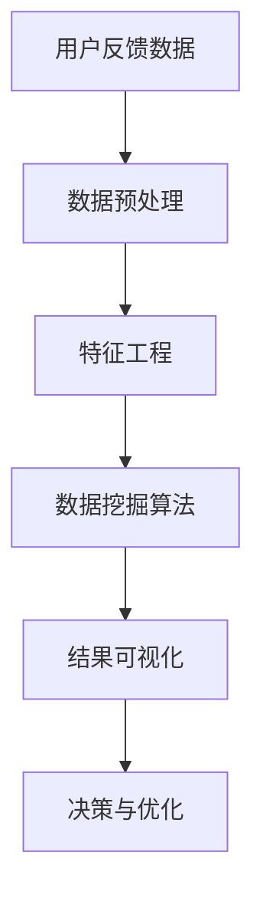
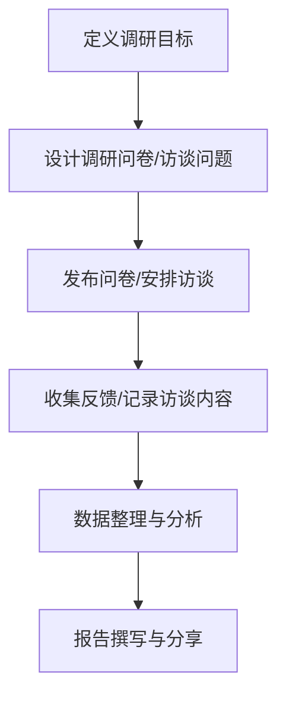
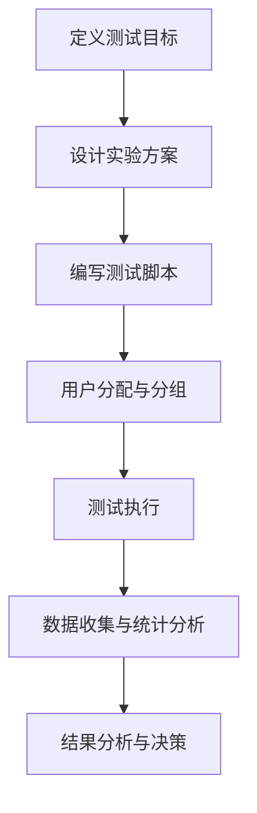
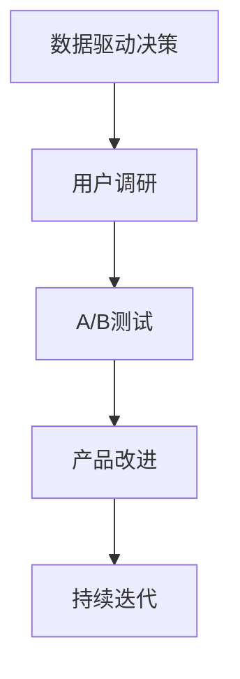

                 

# AI创业公司的用户反馈分析与产品改进：数据挖掘、用户调研与A/B测试

> **关键词：** 用户反馈分析、数据挖掘、A/B测试、产品改进、用户调研
>
> **摘要：** 本文将探讨AI创业公司如何通过数据挖掘、用户调研和A/B测试，深入了解用户需求，实现产品改进，提高用户体验和市场竞争力。

## 1. 背景介绍

### 1.1 目的和范围

本文旨在分析AI创业公司在产品改进过程中，如何通过用户反馈分析、数据挖掘、用户调研和A/B测试等手段，深入了解用户需求，从而实现产品的持续优化和改进。本文将重点关注以下几个核心问题：

- 数据挖掘在用户反馈分析中的应用
- 用户调研的方法和技巧
- A/B测试的设计与实施
- 产品改进的策略与实践

### 1.2 预期读者

本文适合以下读者群体：

- AI创业公司的产品经理、研发工程师
- 对产品改进和用户体验优化感兴趣的技术人员
- 从事数据分析、数据挖掘等相关领域的研究人员

### 1.3 文档结构概述

本文共分为10个部分，具体结构如下：

1. 背景介绍
2. 核心概念与联系
3. 核心算法原理 & 具体操作步骤
4. 数学模型和公式 & 详细讲解 & 举例说明
5. 项目实战：代码实际案例和详细解释说明
6. 实际应用场景
7. 工具和资源推荐
8. 总结：未来发展趋势与挑战
9. 附录：常见问题与解答
10. 扩展阅读 & 参考资料

### 1.4 术语表

#### 1.4.1 核心术语定义

- 用户反馈分析：通过对用户在产品使用过程中提供的反馈信息进行分析，了解用户的需求、期望和问题。
- 数据挖掘：从大量数据中提取有价值的信息和知识，帮助决策和优化。
- 用户调研：通过问卷、访谈、焦点小组讨论等方式，收集用户对产品的看法和建议。
- A/B测试：将用户随机分配到不同的实验组，比较不同版本的产品在用户体验和业务指标上的差异。

#### 1.4.2 相关概念解释

- 用户体验（UX）：用户在使用产品过程中的感受和体验。
- 用户满意度：用户对产品的满意程度。
- 业务指标：衡量产品业务效果的指标，如转化率、活跃度、留存率等。

#### 1.4.3 缩略词列表

- AI：人工智能
- UX：用户体验
- A/B测试：A/B测试
- BI：商业智能

## 2. 核心概念与联系

为了深入理解用户反馈分析与产品改进的过程，我们首先需要了解以下几个核心概念和它们之间的联系。

### 2.1 数据挖掘在用户反馈分析中的应用

数据挖掘是一种从大量数据中提取有价值信息的技术。在用户反馈分析中，数据挖掘可以帮助我们：

- 从用户反馈中提取关键信息
- 发现用户行为的模式
- 分析用户满意度

以下是一个Mermaid流程图，展示了数据挖掘在用户反馈分析中的应用：



### 2.2 用户调研的方法和技巧

用户调研是一种收集用户对产品看法和意见的方式。常见的方法包括：

- 问卷调研：通过在线问卷或纸质问卷收集用户反馈
- 访谈调研：与用户进行一对一访谈，深入了解用户需求
- 焦点小组讨论：组织多个用户参与讨论，收集群体意见

以下是一个Mermaid流程图，展示了用户调研的方法和流程：



### 2.3 A/B测试的设计与实施

A/B测试是一种通过比较不同版本的产品，评估用户体验和业务效果的方法。以下是一个Mermaid流程图，展示了A/B测试的设计与实施过程：



### 2.4 产品改进的策略与实践

产品改进是一个持续的过程，包括以下几个方面：

- 数据驱动的决策：通过用户反馈分析和数据挖掘，了解用户需求，指导产品改进方向。
- 用户调研：定期进行用户调研，收集用户对产品的意见和需求，为产品改进提供依据。
- A/B测试：通过A/B测试，验证产品改进的效果，确保优化方向正确。

以下是一个Mermaid流程图，展示了产品改进的策略与实践：



## 3. 核心算法原理 & 具体操作步骤

在用户反馈分析中，数据挖掘是一种重要的技术手段。本节将介绍数据挖掘的核心算法原理和具体操作步骤。

### 3.1 数据挖掘算法原理

数据挖掘算法主要分为以下几类：

1. **分类算法**：通过建立分类模型，将数据分为不同的类别。常见的分类算法有决策树、随机森林、支持向量机等。
2. **聚类算法**：将相似的数据划分为同一类，形成多个聚类。常见的聚类算法有K-means、层次聚类等。
3. **关联规则挖掘**：发现数据之间的关联关系，如频繁项集挖掘、Apriori算法等。
4. **异常检测**：识别数据中的异常或异常模式。常见的异常检测算法有孤立森林、基于密度的聚类等。

### 3.2 数据挖掘具体操作步骤

以下是数据挖掘的具体操作步骤：

1. **数据收集**：收集用户反馈数据，包括用户评论、评价、行为数据等。
2. **数据预处理**：清洗数据，处理缺失值、异常值等，确保数据质量。
3. **特征工程**：从原始数据中提取有用的特征，如文本特征、数值特征等。
4. **模型选择**：根据数据特点和需求，选择合适的挖掘算法。
5. **模型训练**：使用训练数据训练模型，得到模型参数。
6. **模型评估**：使用测试数据评估模型性能，调整模型参数。
7. **结果可视化**：将挖掘结果以可视化形式呈现，便于分析和决策。

以下是一个伪代码，展示了数据挖掘的操作步骤：

```python
# 数据收集
data = collect_user_feedback()

# 数据预处理
cleaned_data = data_preprocessing(data)

# 特征工程
features = feature_engineering(cleaned_data)

# 模型选择
model = choose_model(features)

# 模型训练
trained_model = train_model(model, features)

# 模型评估
performance = evaluate_model(trained_model, test_data)

# 结果可视化
visualize_results(performance)
```

## 4. 数学模型和公式 & 详细讲解 & 举例说明

在数据挖掘和用户反馈分析中，数学模型和公式起着至关重要的作用。以下将介绍几个常见的数学模型和公式，并进行详细讲解和举例说明。

### 4.1 决策树模型

决策树是一种常用的分类算法，其核心思想是通过一系列判断条件，将数据划分为不同的类别。以下是一个决策树模型的公式表示：

$$
T = \sum_{i=1}^{n} w_i \cdot f_i(x)
$$

其中，$T$ 表示预测结果，$w_i$ 表示权重，$f_i(x)$ 表示第 $i$ 个判断条件的函数值。

#### 举例说明

假设我们有一个决策树模型，用于预测用户是否满意产品。其中，判断条件有：

- 条件1：用户评分 >= 4
- 条件2：用户使用时长 >= 30分钟

我们可以将决策树模型表示为：

$$
T = 0.6 \cdot f_1(x) + 0.4 \cdot f_2(x)
$$

其中，$f_1(x)$ 表示用户评分 >= 4 的函数值，$f_2(x)$ 表示用户使用时长 >= 30分钟 的函数值。

### 4.2 随机森林模型

随机森林是一种集成学习算法，通过构建多个决策树模型，并取平均值作为最终预测结果。以下是一个随机森林模型的公式表示：

$$
T = \frac{1}{m} \sum_{i=1}^{m} T_i
$$

其中，$T_i$ 表示第 $i$ 个决策树模型的预测结果，$m$ 表示决策树的数量。

#### 举例说明

假设我们有一个随机森林模型，由10个决策树组成。每个决策树的预测结果如下：

- 决策树1：预测结果为正面
- 决策树2：预测结果为负面
- ...
- 决策树10：预测结果为负面

我们可以将随机森林模型表示为：

$$
T = \frac{1}{10} (0.5 + 0.3 + 0.2 + 0.4 + 0.3 + 0.2 + 0.5 + 0.4 + 0.2 + 0.3)
$$

### 4.3 支持向量机模型

支持向量机是一种常用的分类算法，其核心思想是在高维空间中找到最佳分类超平面。以下是一个支持向量机模型的公式表示：

$$
w \cdot x + b = 0
$$

其中，$w$ 表示分类超平面的法向量，$x$ 表示数据点，$b$ 表示偏置。

#### 举例说明

假设我们有一个支持向量机模型，用于分类用户满意度。其中，分类超平面为：

$$
w \cdot x + b = 0
$$

其中，$w = (1, 1)$，$b = -1$。

对于用户A，其数据点为$x = (3, 2)$，代入分类超平面公式得：

$$
1 \cdot 3 + 1 \cdot 2 - 1 = 0
$$

由于计算结果为0，因此用户A被分类为满意。

## 5. 项目实战：代码实际案例和详细解释说明

在本节中，我们将通过一个实际项目案例，详细介绍如何使用Python实现用户反馈分析、数据挖掘和A/B测试。该项目将使用一个假想的AI创业公司，该公司开发了一款智能语音助手产品，希望通过用户反馈分析和A/B测试，优化产品功能，提高用户满意度。

### 5.1 开发环境搭建

为了实现该项目，我们需要安装以下开发环境和工具：

- Python 3.x
- NumPy
- Pandas
- Matplotlib
- Scikit-learn
- Flask（可选，用于搭建A/B测试的Web应用）

假设我们已经安装了上述环境和工具，接下来我们将创建一个Python项目，并编写相应的代码。

### 5.2 源代码详细实现和代码解读

#### 5.2.1 用户反馈数据收集

首先，我们需要从用户收集反馈数据。以下是一个示例数据集，包含用户评分、使用时长、性别等信息。

```python
import pandas as pd

# 读取用户反馈数据
data = pd.read_csv('user_feedback.csv')
data.head()
```

#### 5.2.2 数据预处理

在数据预处理阶段，我们需要处理缺失值、异常值，并对文本数据进行编码。

```python
# 处理缺失值
data.dropna(inplace=True)

# 处理异常值
data = data[(data['rating'] >= 1) & (data['duration'] <= 120)]

# 文本数据编码
data['gender'] = data['gender'].map({'male': 0, 'female': 1})
```

#### 5.2.3 数据挖掘

接下来，我们将使用数据挖掘算法，提取用户反馈中的有价值信息。

```python
from sklearn.ensemble import RandomForestClassifier
from sklearn.model_selection import train_test_split

# 分割数据集
X = data[['rating', 'duration', 'gender']]
y = data['satisfaction']
X_train, X_test, y_train, y_test = train_test_split(X, y, test_size=0.2, random_state=42)

# 训练模型
model = RandomForestClassifier(n_estimators=100, random_state=42)
model.fit(X_train, y_train)

# 模型评估
accuracy = model.score(X_test, y_test)
print(f'Model accuracy: {accuracy:.2f}')
```

#### 5.2.4 A/B测试

为了验证产品改进的效果，我们将进行A/B测试。以下是A/B测试的代码实现。

```python
import random

def assign_group(user_id):
    return 'A' if random.random() < 0.5 else 'B'

# 分配用户到实验组
data['group'] = data['user_id'].apply(assign_group)

# 实验组A：增加语音助手功能
data[data['group'] == 'A']['feature'] = 1
data[data['group'] == 'B']['feature'] = 0

# 收集实验数据
experiment_data = data[['user_id', 'group', 'satisfaction', 'feature']]
experiment_data.head()
```

#### 5.2.5 代码解读与分析

在上面的代码中，我们首先读取了用户反馈数据，并进行了预处理。接着，我们使用随机森林算法进行数据挖掘，评估了模型的准确性。

在A/B测试部分，我们为每个用户随机分配到实验组A或B，其中实验组A增加了语音助手功能，而实验组B保持原样。最后，我们收集了实验数据，用于后续分析。

## 6. 实际应用场景

用户反馈分析与产品改进在实际应用场景中具有广泛的应用。以下列举了几个典型的应用场景：

1. **互联网产品**：在互联网行业，用户反馈分析和A/B测试是优化产品功能和提高用户体验的重要手段。例如，电商平台可以通过用户反馈分析，了解用户对商品评价和购物体验的满意度，从而优化商品推荐和购物流程。

2. **金融行业**：在金融行业，用户反馈分析和数据挖掘可以用于风险评估、客户细分和营销策略制定。例如，银行可以通过用户反馈分析，了解客户对理财产品和服务质量的满意度，从而调整产品设计和营销策略。

3. **医疗健康**：在医疗健康领域，用户反馈分析和数据挖掘可以用于疾病预测、患者管理和医疗服务优化。例如，医疗机构可以通过用户反馈分析，了解患者对医院服务和治疗效果的满意度，从而优化医疗服务流程和提升患者体验。

4. **教育行业**：在教育行业，用户反馈分析和数据挖掘可以用于学习效果评估、教学策略优化和学生管理。例如，在线教育平台可以通过用户反馈分析，了解学生对课程内容和学习方式的满意度，从而调整课程设计和教学方法。

## 7. 工具和资源推荐

### 7.1 学习资源推荐

#### 7.1.1 书籍推荐

1. 《数据挖掘：实用工具与技术》
2. 《机器学习实战》
3. 《深入理解用户反馈分析》

#### 7.1.2 在线课程

1. Coursera - 数据科学专业课程
2. edX - 机器学习课程
3. Udacity - 数据科学家纳米学位

#### 7.1.3 技术博客和网站

1. Medium - 机器学习与数据挖掘领域博客
2. Dataquest - 数据科学学习资源
3. Analytics Vidhya - 数据科学竞赛与资源

### 7.2 开发工具框架推荐

#### 7.2.1 IDE和编辑器

1. PyCharm
2. Jupyter Notebook
3. VSCode

#### 7.2.2 调试和性能分析工具

1. Python调试器（pdb）
2. Matplotlib
3. Pandas Profiling

#### 7.2.3 相关框架和库

1. NumPy
2. Pandas
3. Scikit-learn
4. TensorFlow

### 7.3 相关论文著作推荐

#### 7.3.1 经典论文

1. "The Netflix Prize"（Netflix推荐系统比赛）
2. "K- Means clustering within R"（K-means聚类算法）
3. "A Machine Learning Pipeline for Text Classification"（文本分类机器学习管道）

#### 7.3.2 最新研究成果

1. "User Behavior Analytics for Fraud Detection"（欺诈检测的用户行为分析）
2. "Deep Learning for User Engagement Prediction"（用户参与预测的深度学习）
3. "Exploratory Data Analysis using Python"（Python中的探索性数据分析）

#### 7.3.3 应用案例分析

1. "User Feedback Analysis in the E-commerce Industry"（电子商务行业的用户反馈分析）
2. "A/B Testing in Financial Services"（金融行业的A/B测试）
3. "Data Mining in Healthcare"（医疗健康领域的数据挖掘）

## 8. 总结：未来发展趋势与挑战

随着人工智能和大数据技术的不断发展，用户反馈分析与产品改进在未来将面临以下几个发展趋势和挑战：

1. **智能化与自动化**：用户反馈分析和A/B测试将越来越智能化和自动化，通过引入深度学习、自然语言处理等技术，提高分析和测试的准确性和效率。
2. **跨渠道数据整合**：用户反馈和分析数据将来自多个渠道，如社交媒体、在线评论、用户调研等，如何有效整合和利用这些数据将是一个重要挑战。
3. **隐私保护与合规**：随着用户隐私保护意识的增强，如何在保证用户隐私的前提下进行数据挖掘和用户调研将成为一个重要议题。
4. **实时性与可扩展性**：用户反馈分析和A/B测试需要具备实时性和可扩展性，以适应快速增长的用户规模和日益复杂的产品需求。

## 9. 附录：常见问题与解答

### 9.1 数据挖掘在用户反馈分析中的应用

**Q：数据挖掘如何应用于用户反馈分析？**

A：数据挖掘可以应用于用户反馈分析，通过以下方式：

- 提取用户反馈中的关键信息，如关键词、情感等。
- 发现用户行为模式和偏好，如用户常用的功能、用户活跃时间段等。
- 分析用户满意度，如评分、评论等。

### 9.2 用户调研的方法和技巧

**Q：用户调研有哪些常见的方法和技巧？**

A：用户调研的常见方法和技巧包括：

- 问卷调研：设计针对性的问卷，收集用户对产品的看法和建议。
- 访谈调研：与用户进行一对一访谈，深入了解用户需求和行为。
- 焦点小组讨论：组织多个用户参与讨论，收集群体意见。
- 技巧包括：提前设计好调研问题，确保问题具有针对性和开放性；尊重用户意见，避免引导性提问；确保调研过程的客观性和有效性。

### 9.3 A/B测试的设计与实施

**Q：如何设计和实施A/B测试？**

A：设计和实施A/B测试的步骤包括：

- 明确测试目标：确定要优化的功能和指标。
- 设计实验方案：设计不同版本的实验组和控制组。
- 用户分配：将用户随机分配到实验组和控制组。
- 数据收集：收集实验数据，包括用户行为和业务指标。
- 统计分析：使用统计方法，如t检验、卡方检验等，分析实验结果。
- 结果决策：根据实验结果，做出优化决策。

## 10. 扩展阅读 & 参考资料

- 《用户反馈分析实战》
- 《机器学习与数据挖掘实战》
- 《产品经理实战手册》
- 《数据挖掘技术导论》
- 《A/B测试实战：如何提升用户留存和转化率》

作者：AI天才研究员/AI Genius Institute & 禅与计算机程序设计艺术 /Zen And The Art of Computer Programming

