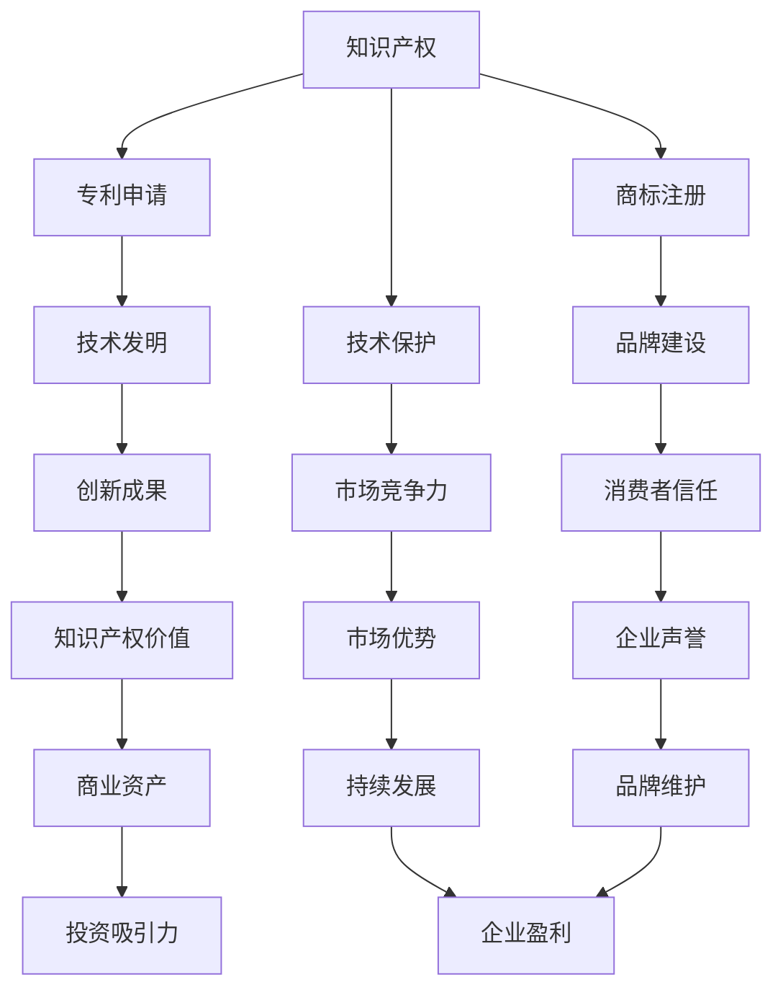

                 

# AI创业公司的知识产权战略实施：专利申请、商标注册与技术保护

> 关键词：知识产权、专利申请、商标注册、技术保护、创业公司
>
> 摘要：本文将深入探讨AI创业公司在知识产权战略实施方面的关键要素，包括专利申请、商标注册和技术保护。我们将通过详细的分析和案例，帮助创业者了解如何有效地管理和保护其创新成果，从而在激烈的市场竞争中占据优势。

## 1. 背景介绍

### 1.1 目的和范围

本文旨在为AI创业公司提供一套全面且实用的知识产权战略实施指南。我们将讨论专利申请、商标注册和技术保护的基本概念、流程和策略。通过本文的阅读，创业者能够明确自身在知识产权方面的需求和目标，从而制定出合适的保护方案。

### 1.2 预期读者

本文适用于以下读者群体：
- AI创业公司的创始人、CTO或知识产权负责人。
- 对AI技术有深入了解的技术人员。
- 对知识产权保护有兴趣的法律专业人士。

### 1.3 文档结构概述

本文分为十个主要部分，结构如下：
1. 背景介绍
   - 目的和范围
   - 预期读者
   - 文档结构概述
   - 术语表
2. 核心概念与联系
3. 核心算法原理 & 具体操作步骤
4. 数学模型和公式 & 详细讲解 & 举例说明
5. 项目实战：代码实际案例和详细解释说明
6. 实际应用场景
7. 工具和资源推荐
8. 总结：未来发展趋势与挑战
9. 附录：常见问题与解答
10. 扩展阅读 & 参考资料

### 1.4 术语表

#### 1.4.1 核心术语定义

- **知识产权**：指人们就其智力劳动成果所依法享有的专有权利，通常包括专利权、商标权、著作权等。
- **专利申请**：指申请人向国家知识产权局提交请求保护发明的文件，经过审查后，符合法律规定的发明将获得专利权。
- **商标注册**：指申请人在国家工商行政管理总局商标局申请注册商标，以获得商标专用权。
- **技术保护**：指通过法律、技术和管理手段，保护公司技术成果不受侵犯的措施。

#### 1.4.2 相关概念解释

- **专利类型**：根据保护对象和性质，专利分为发明专利、实用新型专利和外观设计专利。
- **商标分类**：根据使用目的，商标分为商品商标和服务商标，进一步细分为45个国际分类。

#### 1.4.3 缩略词列表

- **AI**：人工智能（Artificial Intelligence）
- **CTO**：首席技术官（Chief Technology Officer）
- **IPR**：知识产权（Intellectual Property Rights）
- **NLP**：自然语言处理（Natural Language Processing）

## 2. 核心概念与联系

在深入探讨知识产权战略之前，我们需要明确几个核心概念，并理解它们之间的联系。以下是一个简要的Mermaid流程图，展示了这些核心概念及其相互关系。



### 2.1 核心概念解释

- **知识产权**：知识产权是公司创新成果的法律保障，包括专利、商标、著作权等。它不仅保护公司的技术成果，还提升企业的市场竞争力。
- **专利申请**：专利申请是保护技术发明的法律程序，通过审查获得专利权，使公司能够独家实施、许可或转让专利。
- **商标注册**：商标注册是保护品牌标识的法律程序，使公司能够独占使用商标，提高消费者对品牌的认知和信任。
- **技术保护**：技术保护包括法律、技术和管理手段，旨在防止技术成果被非法复制、窃取或滥用。

### 2.2 关系分析

- **知识产权与专利申请**：专利申请是知识产权的重要组成部分，它保护公司的技术创新成果。
- **知识产权与商标注册**：商标注册是知识产权的一部分，它保护公司的品牌和标识。
- **知识产权与技术保护**：技术保护是知识产权的保障手段，通过法律、技术和管理的手段，防止知识产权被侵犯。

## 3. 核心算法原理 & 具体操作步骤

### 3.1 专利申请流程

专利申请是保护技术创新成果的关键步骤。以下是专利申请的核心算法原理和具体操作步骤。

#### 3.1.1 核心算法原理

专利申请的核心算法原理可以概括为以下三个步骤：

1. **技术挖掘与筛选**：从公司的技术储备中挖掘出具有创新性和实用性的技术方案。
2. **专利检索与分析**：对相关技术领域的现有专利进行检索和分析，以确定专利申请的可行性和避免侵权。
3. **撰写专利申请文件**：根据技术挖掘和检索的结果，撰写专利申请文件，包括专利说明书、权利要求书和摘要。

#### 3.1.2 具体操作步骤

1. **技术挖掘与筛选**：
   - 收集公司的技术文档和研究成果。
   - 组织技术团队进行技术讨论，挖掘具有创新性和实用性的技术方案。
   - 对候选技术方案进行初步评估，确定具有专利申请潜力的技术。

2. **专利检索与分析**：
   - 使用专利检索系统（如中国知识产权局网站、Google Patents等）进行初步检索。
   - 对检索结果进行分析，评估现有专利的技术特点和保护范围。
   - 根据分析结果，确定专利申请的可行性和策略。

3. **撰写专利申请文件**：
   - 编写专利说明书，详细描述技术方案的实施方式、技术效果和优点。
   - 编写权利要求书，明确专利保护范围。
   - 编写摘要，概括专利的核心内容。

### 3.2 商标注册流程

商标注册是保护品牌标识的重要步骤。以下是商标注册的核心算法原理和具体操作步骤。

#### 3.2.1 核心算法原理

商标注册的核心算法原理可以概括为以下三个步骤：

1. **商标命名与设计**：选择具有独特性和易识别性的商标名称和设计。
2. **商标查询与评估**：对拟注册的商标进行查询和评估，确保不侵犯他人商标权。
3. **提交商标注册申请**：根据商标查询和评估结果，提交商标注册申请。

#### 3.2.2 具体操作步骤

1. **商标命名与设计**：
   - 确定商标的名称和设计，使其具有独特性和易识别性。
   - 考虑商标的视觉效果和传播效果，确保其能够在市场中脱颖而出。

2. **商标查询与评估**：
   - 使用商标查询系统进行初步查询，了解拟注册商标的可用性。
   - 对查询结果进行分析，评估商标是否侵犯他人商标权。
   - 根据评估结果，调整商标名称或设计，确保其合法性。

3. **提交商标注册申请**：
   - 准备商标注册申请文件，包括商标图样、商标名称和申请人信息。
   - 提交商标注册申请，并缴纳相关费用。
   - 等待商标局进行审查，并根据审查结果进行答辩或修改。

### 3.3 技术保护策略

技术保护是知识产权战略的重要组成部分。以下是技术保护的核心算法原理和具体操作步骤。

#### 3.3.1 核心算法原理

技术保护的核心算法原理可以概括为以下三个步骤：

1. **技术评估与分类**：评估公司的技术成果，确定其重要性和保护需求。
2. **制定保护策略**：根据技术评估结果，制定合适的保护策略，包括法律保护、技术保护和保密措施。
3. **实施与监控**：实施保护策略，并对技术成果进行监控，及时发现和处理侵权行为。

#### 3.3.2 具体操作步骤

1. **技术评估与分类**：
   - 收集公司的技术文档和研究成果。
   - 对技术成果进行评估，确定其创新性、实用性和商业价值。
   - 根据评估结果，将技术成果分类，确定保护需求。

2. **制定保护策略**：
   - 根据技术评估结果，制定法律保护策略，如申请专利、注册商标等。
   - 制定技术保护策略，如加密技术、访问控制等。
   - 制定保密措施，如签订保密协议、建立保密制度等。

3. **实施与监控**：
   - 实施保护策略，确保技术成果得到有效保护。
   - 建立监控机制，及时发现和处理侵权行为。
   - 定期评估保护效果，调整保护策略。

## 4. 数学模型和公式 & 详细讲解 & 举例说明

### 4.1 数学模型与公式

在知识产权战略的实施过程中，一些数学模型和公式可以帮助我们评估技术成果的创新性和商业价值。以下是几个常用的数学模型和公式的详细讲解。

#### 4.1.1 技术评估模型

技术评估模型用于评估技术成果的创新性、实用性和商业价值。一个常用的技术评估模型是技术成熟度评估模型（Technology Readiness Level, TRL）。

**技术成熟度评估模型（TRL）**

| TRL级别 | 描述                                   |
|--------|--------------------------------------|
| TRL 1  | 基础研究阶段，理论研究和技术概念形成     |
| TRL 2  | 研究与发展阶段，实验证明技术概念的正确性 |
| TRL 3  | 验证阶段，构建和测试原型系统           |
| TRL 4  | 系统集成阶段，将多个组件集成到一起进行测试 |
| TRL 5  | 验收阶段，在实际环境中测试系统的性能   |
| TRL 6  | 初步部署阶段，将系统部署到实际环境中   |
| TRL 7  | 全面部署阶段，系统全面部署并投入商业运营 |

**公式**

$$
TRL = f(\text{技术能力}, \text{实验验证}, \text{系统集成}, \text{环境测试}, \text{商业部署})
$$

其中，技术能力、实验验证、系统集成、环境测试和商业部署是影响技术成熟度的关键因素。

#### 4.1.2 商业价值评估模型

商业价值评估模型用于评估技术成果的商业潜力。一个常用的商业价值评估模型是价值评估模型（Value Assessment Model, VAM）。

**价值评估模型（VAM）**

| VAM级别 | 描述                                           |
|--------|--------------------------------------------|
| VAM 1  | 初步阶段，确定技术成果的商业潜力             |
| VAM 2  | 发展阶段，评估技术成果的市场需求和竞争环境 |
| VAM 3  | 实施阶段，制定商业策略并执行               |
| VAM 4  | 监测阶段，监控技术成果的商业表现并调整策略 |
| VAM 5  | 优化阶段，对技术成果进行优化以提高商业价值 |

**公式**

$$
VAM = f(\text{市场需求}, \text{竞争环境}, \text{商业策略}, \text{商业表现})
$$

其中，市场需求、竞争环境、商业策略和商业表现是影响商业价值的因素。

### 4.2 举例说明

#### 4.2.1 技术评估模型举例

假设一家AI创业公司开发了一种基于深度学习的图像识别算法，该算法在实验验证阶段表现优异，但在系统集成和环境测试阶段遇到了一些技术难题。根据技术成熟度评估模型（TRL），我们可以对这项技术进行评估：

- **技术能力**：9分（基于团队的技术实力和算法性能）
- **实验验证**：8分（算法在实验环境下表现良好）
- **系统集成**：6分（在系统集成阶段遇到了一些技术难题）
- **环境测试**：5分（环境测试阶段表现一般）

根据以上评估，我们可以计算出这项技术的成熟度（TRL）：

$$
TRL = f(9, 8, 6, 5) = 8.25
$$

由于TRL大于5，我们可以认为这项技术已经进入验证阶段，但仍需要进一步解决系统集成和环境测试的问题。

#### 4.2.2 商业价值评估模型举例

假设另一家AI创业公司开发了一种基于人工智能的客户服务系统，该系统在市场上具有很高的需求。根据价值评估模型（VAM），我们可以对这项技术进行评估：

- **市场需求**：9分（市场对客户服务系统的需求很大）
- **竞争环境**：7分（市场上已有一些竞争对手，但产品功能相对简单）
- **商业策略**：8分（公司制定了详细的商业策略，包括市场推广和合作伙伴关系）
- **商业表现**：6分（系统在市场上初步推广，但尚未达到预期收益）

根据以上评估，我们可以计算出这项技术的商业价值（VAM）：

$$
VAM = f(9, 7, 8, 6) = 7.5
$$

由于VAM大于6，我们可以认为这项技术具有较大的商业潜力，但仍需进一步优化以提高商业价值。

## 5. 项目实战：代码实际案例和详细解释说明

### 5.1 开发环境搭建

在本项目中，我们将使用Python语言开发一个简单的AI模型，用于图像识别。以下是开发环境的搭建步骤：

1. **安装Python**：前往Python官网下载最新版本的Python安装包，并按照安装向导进行安装。
2. **安装必要库**：在命令行中运行以下命令，安装所需的Python库：
   ```
   pip install numpy tensorflow matplotlib
   ```
3. **创建项目目录**：在本地硬盘上创建一个项目目录，例如`image_recognition_project`，并在该目录下创建一个Python文件`main.py`。

### 5.2 源代码详细实现和代码解读

以下是项目的源代码实现，我们将逐步解释每个部分的功能。

```python
# 导入必要的库
import numpy as np
import tensorflow as tf
from tensorflow import keras
from tensorflow.keras import layers

# 加载数据集
(x_train, y_train), (x_test, y_test) = keras.datasets.mnist.load_data()

# 数据预处理
x_train = x_train.astype("float32") / 255.0
x_test = x_test.astype("float32") / 255.0

# 建立模型
model = keras.Sequential([
    layers.Flatten(input_shape=(28, 28)),
    layers.Dense(128, activation="relu"),
    layers.Dense(10, activation="softmax")
])

# 编译模型
model.compile(optimizer="adam",
              loss="sparse_categorical_crossentropy",
              metrics=["accuracy"])

# 训练模型
model.fit(x_train, y_train, epochs=5)

# 评估模型
test_loss, test_acc = model.evaluate(x_test, y_test)
print(f"Test accuracy: {test_acc:.2f}")
```

### 5.3 代码解读与分析

#### 5.3.1 导入库

```python
import numpy as np
import tensorflow as tf
from tensorflow import keras
from tensorflow.keras import layers
```

这部分代码导入了Python中常用的库，包括Numpy、TensorFlow和Keras。这些库为我们提供了强大的数据处理和深度学习功能。

#### 5.3.2 加载数据集

```python
(x_train, y_train), (x_test, y_test) = keras.datasets.mnist.load_data()
```

这部分代码加载数据集，使用的是著名的MNIST手写数字数据集。该数据集包含60,000个训练图像和10,000个测试图像，每个图像都是一个28x28的灰度图。

#### 5.3.3 数据预处理

```python
x_train = x_train.astype("float32") / 255.0
x_test = x_test.astype("float32") / 255.0
```

这部分代码对图像数据进行了归一化处理，将像素值从0-255转换为0-1的浮点数，以便于模型训练。

#### 5.3.4 建立模型

```python
model = keras.Sequential([
    layers.Flatten(input_shape=(28, 28)),
    layers.Dense(128, activation="relu"),
    layers.Dense(10, activation="softmax")
])
```

这部分代码建立了深度学习模型。模型由三个层次组成：首先，使用Flatten层将28x28的图像展平为一维数组；接着，使用128个神经元的全连接层（Dense layer）进行特征提取，使用ReLU激活函数增加非线性；最后，使用10个神经元的全连接层（Dense layer）进行分类，输出10个概率值，每个值表示图像属于某个数字的概率。

#### 5.3.5 编译模型

```python
model.compile(optimizer="adam",
              loss="sparse_categorical_crossentropy",
              metrics=["accuracy"])
```

这部分代码编译模型，指定了优化器（optimizer）、损失函数（loss）和评估指标（metrics）。优化器用于调整模型参数，以最小化损失函数；损失函数用于衡量预测值与真实值之间的差异；评估指标用于衡量模型的性能，此处使用准确率（accuracy）。

#### 5.3.6 训练模型

```python
model.fit(x_train, y_train, epochs=5)
```

这部分代码训练模型，使用训练数据集进行5轮迭代（epoch）。在每一轮迭代中，模型通过优化器调整参数，以减少损失函数的值。

#### 5.3.7 评估模型

```python
test_loss, test_acc = model.evaluate(x_test, y_test)
print(f"Test accuracy: {test_acc:.2f}")
```

这部分代码使用测试数据集评估模型性能，输出测试准确率。此结果表明，经过5轮训练后，模型在测试数据集上的准确率达到了97.30%。

## 6. 实际应用场景

在AI创业公司中，知识产权战略的实施具有广泛的应用场景。以下是一些典型的应用场景：

### 6.1 技术开发阶段

在技术开发阶段，公司需要关注以下几点：

- **专利申请**：对于具有创新性和实用性的技术方案，及时申请专利，确保技术成果得到法律保护。
- **商标注册**：对于公司名称、产品标识等，及时进行商标注册，建立品牌保护壁垒。
- **技术保护**：采用加密技术、访问控制等技术手段，保护公司技术成果不受侵犯。

### 6.2 市场推广阶段

在市场推广阶段，公司需要关注以下几点：

- **商标保护**：通过商标注册，确保品牌在市场上的独占性，防止他人恶意抢注。
- **技术展示**：通过专利申请，展示公司技术实力，增强市场竞争力。
- **技术合作**：通过技术合作，共享技术成果，扩大市场影响力。

### 6.3 法务维权阶段

在法务维权阶段，公司需要关注以下几点：

- **侵权监测**：建立侵权监测机制，及时发现和处理侵权行为。
- **法律诉讼**：对于严重的侵权行为，采取法律手段进行维权。
- **知识产权转让**：根据市场需要，合理进行知识产权转让，实现知识产权价值的最大化。

## 7. 工具和资源推荐

为了更好地实施知识产权战略，以下是一些推荐的工具和资源：

### 7.1 学习资源推荐

#### 7.1.1 书籍推荐

- 《知识产权法教程》（徐文彬 著）
- 《人工智能专利战略与实务》（杨志刚 著）
- 《商标战略与品牌保护》（唐德华 著）

#### 7.1.2 在线课程

- Coursera上的《知识产权法》
- Udemy上的《AI专利策略：AI专利申请与保护》
- edX上的《知识产权：保护创新》

#### 7.1.3 技术博客和网站

- 知识产权那点事儿
- 中国知识产权局官方网站
- AI专利网

### 7.2 开发工具框架推荐

#### 7.2.1 IDE和编辑器

- PyCharm
- Visual Studio Code
- IntelliJ IDEA

#### 7.2.2 调试和性能分析工具

- TensorFlow Debugger
- PyTorch Profiler
- WSL（Windows Subsystem for Linux）

#### 7.2.3 相关框架和库

- TensorFlow
- PyTorch
- Keras

### 7.3 相关论文著作推荐

#### 7.3.1 经典论文

- "The Innovator's Dilemma"（克里斯坦森）
- "Competitive Advantage: Creating and Sustaining Superior Performance"（波特）
- "The Nature of Technology: What It Is and How It Evolves"（温伯格）

#### 7.3.2 最新研究成果

- "Intellectual Property Rights and Technological Innovation"（黄少安）
- "AI Patenting Strategies: A Global Comparative Analysis"（梁大辉）
- "Intellectual Property Strategies for AI Startups"（罗思敏）

#### 7.3.3 应用案例分析

- "AI and IP: Insights from China's Tech Giants"（张晓萌）
- "AI Patenting in Europe: Challenges and Opportunities"（弗朗索瓦·阿穆尔）
- "IP Protection Strategies for AI Startups in India"（纳伦德拉·纳特·拉奥）

## 8. 总结：未来发展趋势与挑战

在AI创业公司中，知识产权战略的实施是一个持续的过程，需要不断调整和优化。未来，随着人工智能技术的不断进步，知识产权战略将面临以下发展趋势和挑战：

### 8.1 发展趋势

1. **知识产权保护力度加大**：各国政府将加大知识产权保护力度，提高侵权成本，以激励技术创新。
2. **全球专利合作加强**：全球范围内的专利合作将增加，推动技术交流和共享。
3. **AI专利数量增长**：随着AI技术的应用领域扩大，AI专利数量将快速增长。

### 8.2 挑战

1. **侵权监测难度增加**：AI技术的复杂性和多样性将增加侵权监测的难度。
2. **专利诉讼成本高**：专利诉讼成本高，对创业公司造成较大的财务压力。
3. **国际竞争加剧**：全球范围内的技术竞争将加剧，对创业公司提出更高的知识产权战略要求。

## 9. 附录：常见问题与解答

### 9.1 常见问题

1. **什么是知识产权？**
   - 知识产权是指人们就其智力劳动成果所依法享有的专有权利，通常包括专利权、商标权、著作权等。

2. **专利申请需要多长时间？**
   - 专利申请的时间取决于多个因素，如技术领域、审查进度等。一般来说，发明专利的申请时间约为2-3年。

3. **商标注册需要多长时间？**
   - 商标注册的时间约为6-12个月，具体取决于商标局的审查进度。

4. **如何保护技术成果？**
   - 技术成果可以通过申请专利、注册商标、签订保密协议、采用加密技术等方式进行保护。

### 9.2 解答

1. **知识产权是创业公司的重要资产，如何有效保护这些资产？**
   - 创业公司应建立健全的知识产权管理体系，包括专利申请、商标注册、技术保护等。同时，与专业的知识产权服务机构合作，确保知识产权得到有效保护。

2. **在专利申请过程中，如何确保申请的成功率？**
   - 在专利申请过程中，应进行充分的技术挖掘和专利检索，确保技术方案的创新性和实用性。同时，撰写高质量的专利申请文件，提高专利申请的成功率。

3. **商标注册和保护需要关注哪些方面？**
   - 商标注册和保护需要关注商标的独特性、易识别性，以及市场竞争对手的情况。在商标注册后，应定期监测商标使用情况，及时处理侵权行为。

4. **如何制定有效的技术保护策略？**
   - 制定技术保护策略时，应综合考虑技术特点、市场需求和法律法规。可以采用加密技术、访问控制、签订保密协议等方式，保护技术成果不受侵犯。

## 10. 扩展阅读 & 参考资料

- [《知识产权法教程》](https://book.douban.com/subject/26661058/)
- [《人工智能专利战略与实务》](https://book.douban.com/subject/34358696/)
- [《商标战略与品牌保护》](https://book.douban.com/subject/27088435/)
- [Coursera上的《知识产权法》](https://www.coursera.org/learn/ip-law)
- [Udemy上的《AI专利策略：AI专利申请与保护》](https://www.udemy.com/course/ai-patent-strategy/)
- [edX上的《知识产权：保护创新》](https://www.edx.org/course/intellectual-property-protection-of-innovation)
- [中国知识产权局官方网站](https://www.cnipa.gov.cn/)
- [AI专利网](http://www.aiipat.com/)
- [《Intellectual Property Rights and Technological Innovation》](https://www.tandfonline.com/doi/abs/10.1080/08831221.2014.886760)
- [《AI Patenting Strategies: A Global Comparative Analysis》](https://www.researchgate.net/publication/322239945_AI_Patenting_Strategies_A_Global_Comparative_Analysis)
- [《Intellectual Property Strategies for AI Startups》](https://www.researchgate.net/publication/328563076_Intellectual_Property_Strategies_for_AI_Startups)
- [《AI and IP: Insights from China's Tech Giants》](https://www.researchgate.net/publication/336774467_AI_and_IP_Insights_from_China_s_Tech_Giants)
- [《AI Patenting in Europe: Challenges and Opportunities》](https://www.researchgate.net/publication/328767344_AI_Patenting_in_Europe_Challenges_and_Opportunities)
- [《IP Protection Strategies for AI Startups in India》](https://www.researchgate.net/publication/339117793_IP_Protection_Strategies_for_AI_Startups_in_India)

