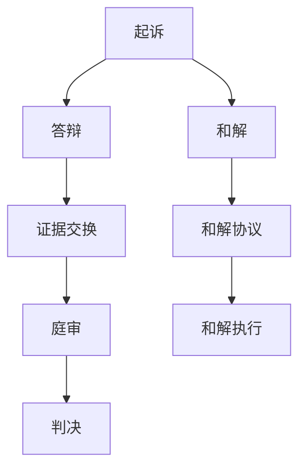

                 

# AI创业公司的知识产权诉讼应对：证据收集、抗辩与和解

> 关键词：知识产权诉讼、证据收集、抗辩策略、和解方案、AI创业公司、法律合规

> 摘要：本文旨在探讨AI创业公司在面对知识产权诉讼时，如何通过有效的证据收集、抗辩策略和和解方案来保护自身权益。文章分为多个部分，首先介绍知识产权诉讼的背景和意义，然后详细阐述证据收集的方法和要点，接着分析常见的抗辩策略，最后探讨和解方案的制定和执行。希望通过本文，AI创业公司能够更好地应对知识产权诉讼，维护自身合法权益。

## 1. 背景介绍

### 1.1 目的和范围

本文的目的是为AI创业公司提供一套应对知识产权诉讼的策略，帮助公司在面临诉讼时能够有效保护自身权益。文章将从以下几个方面展开讨论：

1. **知识产权诉讼的背景和意义**：介绍知识产权诉讼的现状和重要性，解释为什么AI创业公司需要关注这一领域。

2. **证据收集的方法和要点**：阐述证据收集在诉讼中的关键作用，并详细说明如何进行有效的证据收集。

3. **抗辩策略**：分析常见的抗辩策略，包括如何证明自身产品的原创性、如何反驳原告的主张等。

4. **和解方案**：探讨如何在诉讼中制定和执行和解方案，以实现双方利益的平衡。

5. **总结和展望**：总结文章的主要内容，并对AI创业公司的未来知识产权保护和应对策略提出建议。

### 1.2 预期读者

本文的预期读者包括：

1. **AI创业公司创始人和管理层**：帮助他们了解知识产权诉讼的重要性，并提供应对策略。

2. **知识产权律师和法律顾问**：为他们提供具体的操作指导，帮助他们更好地为AI创业公司提供法律服务。

3. **技术开发人员**：让他们了解在技术开发过程中如何保护知识产权，以避免未来可能面临的诉讼。

### 1.3 文档结构概述

本文分为以下几个部分：

1. **背景介绍**：介绍知识产权诉讼的背景和意义。

2. **核心概念与联系**：阐述知识产权诉讼中的核心概念和原理。

3. **核心算法原理 & 具体操作步骤**：介绍如何进行证据收集和抗辩策略。

4. **数学模型和公式 & 详细讲解 & 举例说明**：使用数学公式和案例说明抗辩策略的实施。

5. **项目实战：代码实际案例和详细解释说明**：通过具体案例展示如何应对知识产权诉讼。

6. **实际应用场景**：探讨知识产权诉讼在不同场景中的应用。

7. **工具和资源推荐**：推荐相关书籍、课程和技术工具。

8. **总结：未来发展趋势与挑战**：总结文章的主要内容，并对未来提出建议。

9. **附录：常见问题与解答**：解答读者可能遇到的问题。

10. **扩展阅读 & 参考资料**：提供进一步阅读的资源。

### 1.4 术语表

#### 1.4.1 核心术语定义

- **知识产权诉讼**：指涉及知识产权保护的诉讼活动，包括专利、商标、版权等方面的纠纷。
- **证据收集**：指在诉讼过程中收集对己方有利的证据，以支持自己的主张。
- **抗辩策略**：指在诉讼中反驳对方主张的方法和策略。
- **和解方案**：指在诉讼中通过协商达成双方都能接受的解决方案。

#### 1.4.2 相关概念解释

- **知识产权**：指人们对于自己的智力劳动成果所享有的专有权利，包括专利、商标、版权等。
- **诉讼**：指当事人在法院或其他法律机构进行争议解决的过程。

#### 1.4.3 缩略词列表

- **AI**：人工智能（Artificial Intelligence）
- **IP**：知识产权（Intellectual Property）
- **IPR**：知识产权纠纷（Intellectual Property Dispute）

## 2. 核心概念与联系

在探讨AI创业公司的知识产权诉讼应对策略之前，我们需要了解一些核心概念和原理。以下是关键概念和它们之间的联系：

### 2.1 知识产权概述

知识产权是一种法律概念，用于保护人们在创新和创作过程中所产生的成果。它主要包括以下几种类型：

1. **专利**：保护发明者的技术方案，使其在一定时间内无法被他人复制或使用。
2. **商标**：保护企业的商业标识，使其在市场上具有独特的识别性。
3. **版权**：保护创作者的文学、艺术和科学作品，使其在一定时间内拥有独占权。

### 2.2 知识产权诉讼过程

知识产权诉讼通常包括以下几个阶段：

1. **起诉**：原告向法院提起诉讼，提出自己的主张和证据。
2. **答辩**：被告在收到起诉状后，向法院提交答辩状，反驳原告的主张。
3. **证据交换**：双方交换证据，为庭审做准备。
4. **庭审**：法院开庭审理案件，听取双方的意见和证据。
5. **判决**：法院根据庭审结果作出判决。

### 2.3 证据收集

证据收集在知识产权诉讼中至关重要。以下是一些关键点：

1. **证据类型**：包括书证、证人证言、鉴定意见等。
2. **证据收集方法**：包括调查取证、现场勘验、电子邮件收集等。
3. **证据保全**：在诉讼过程中，对可能被销毁或篡改的证据进行保全。

### 2.4 抗辩策略

在知识产权诉讼中，抗辩策略包括以下几个方面：

1. **无效抗辩**：证明对方专利或版权无效。
2. **不侵权抗辩**：证明自己的产品或服务不侵犯对方的知识产权。
3. **公平使用抗辩**：证明自己的行为属于合理使用，不构成侵权。
4. **先用权抗辩**：证明在对方提出诉讼之前，己方已经使用了相关技术或作品。

### 2.5 和解方案

和解方案是解决知识产权诉讼的一种有效方式。以下是一些关键点：

1. **和解条件**：双方达成共识，明确和解的内容和条件。
2. **和解协议**：以书面形式明确双方的权利和义务。
3. **和解执行**：监督和解协议的执行，确保双方履行承诺。

### 2.6 Mermaid 流程图

以下是一个简化的知识产权诉讼流程图，用于展示各阶段之间的关系：



## 3. 核心算法原理 & 具体操作步骤

### 3.1 证据收集的算法原理

证据收集是知识产权诉讼中的关键环节，其算法原理主要包括以下几个方面：

1. **证据识别**：通过分析案件背景和原告主张，确定需要收集的证据类型和范围。
2. **证据获取**：采用合法手段获取证据，包括调查取证、现场勘验、电子邮件收集等。
3. **证据整理**：对收集到的证据进行分类、筛选和整理，确保其合法性和相关性。
4. **证据分析**：分析证据的真实性、合法性和证明力，为诉讼提供支持。

### 3.2 证据收集的具体操作步骤

以下是一个简化的证据收集操作步骤：

1. **确定证据类型**：根据案件特点和原告主张，确定需要收集的证据类型，如书证、证人证言、鉴定意见等。
2. **制定证据收集计划**：制定详细的证据收集计划，包括证据收集的时间、地点、方式等。
3. **实施证据收集**：按照证据收集计划，采用合法手段获取证据。如调查取证，可以通过法律途径申请调取相关证据；现场勘验，需要提前预约并通知对方；电子邮件收集，可以通过法律途径获取邮件服务器日志等。
4. **证据整理和保存**：对收集到的证据进行分类、筛选和整理，确保其合法性和相关性。同时，对证据进行备份和保存，防止证据丢失或被篡改。
5. **证据分析**：对收集到的证据进行真实性和合法性分析，评估其证明力，为诉讼提供支持。

### 3.3 伪代码示例

以下是一个简化的证据收集伪代码示例：

```python
# 输入：案件背景、原告主张
# 输出：证据列表

def collect_evidence(case_background, plaintiff_claim):
    evidence_list = []

    # 步骤1：确定证据类型
    evidence_types = ["book_evidence", "witness_testimony", "expert_opinion"]

    # 步骤2：制定证据收集计划
    evidence_plan = {
        "book_evidence": ["document_1", "document_2"],
        "witness_testimony": ["witness_1", "witness_2"],
        "expert_opinion": ["expert_1", "expert_2"]
    }

    # 步骤3：实施证据收集
    for evidence_type in evidence_types:
        for evidence_name in evidence_plan[evidence_type]:
            if evidence_type == "book_evidence":
                evidence_list.append(get_document(evidence_name))
            elif evidence_type == "witness_testimony":
                evidence_list.append(get_witness_testimony(evidence_name))
            elif evidence_type == "expert_opinion":
                evidence_list.append(get_expert_opinion(evidence_name))

    # 步骤4：证据整理和保存
    for evidence in evidence_list:
        evidence["status"] = "collected"
        save_evidence(evidence)

    # 步骤5：证据分析
    for evidence in evidence_list:
        if is_valid_evidence(evidence):
            evidence["validity"] = "valid"
        else:
            evidence["validity"] = "invalid"

    return evidence_list

# 辅助函数
def get_document(name):
    # 获取书证
    pass

def get_witness_testimony(name):
    # 获取证人证言
    pass

def get_expert_opinion(name):
    # 获取鉴定意见
    pass

def save_evidence(evidence):
    # 保存证据
    pass

def is_valid_evidence(evidence):
    # 判断证据是否有效
    pass
```

## 4. 数学模型和公式 & 详细讲解 & 举例说明

在知识产权诉讼中，数学模型和公式常常用于评估证据的证明力和抗辩策略的有效性。以下是一些常用的数学模型和公式，并对其进行详细讲解和举例说明。

### 4.1 证据证明力评估模型

证据证明力评估模型用于评估证据的真实性和可靠性。以下是一个简化的模型：

$$
P(E|H) = \frac{P(H|E) \cdot P(E)}{P(H)}
$$

其中：

- \(P(E)\)：证据出现的概率。
- \(P(H)\)：假设（原告主张）为真的概率。
- \(P(H|E)\)：假设在证据存在的条件下为真的概率。
- \(P(E|H)\)：证据在假设为真的条件下出现的概率。

#### 举例说明：

假设原告主张某项技术侵犯了其专利权，证据包括原告的专利说明书和被告的产品手册。我们可以通过计算证据证明力来评估其可靠性。

1. \(P(E)\)：原告的专利说明书和被告的产品手册的出现概率。由于这些文献在市场上普遍存在，因此其概率较高。
2. \(P(H)\)：假设被告的产品侵犯了原告的专利权的概率。这取决于原告专利的覆盖范围和被告产品的具体实现方式。
3. \(P(H|E)\)：假设在证据存在的条件下为真的概率。这取决于证据与假设的相关性。
4. \(P(E|H)\)：证据在假设为真的条件下出现的概率。这取决于证据的收集方法和真实情况。

通过计算上述概率，我们可以评估证据的证明力。如果证据的证明力较高，那么我们可以认为证据具有较强的可靠性。

### 4.2 抗辩策略有效性评估模型

抗辩策略有效性评估模型用于评估抗辩策略的合理性。以下是一个简化的模型：

$$
Efficacy = \frac{Success}{Attempt}
$$

其中：

- \(Success\)：抗辩策略成功的次数。
- \(Attempt\)：抗辩策略尝试的次数。

#### 举例说明：

假设被告采用了三种抗辩策略：无效抗辩、不侵权抗辩和公平使用抗辩。我们可以通过计算抗辩策略的有效性来评估其效果。

1. 无效抗辩：成功证明原告的专利无效的次数。
2. 不侵权抗辩：成功证明自己的产品不侵犯原告的专利权的次数。
3. 公平使用抗辩：成功证明自己的行为属于合理使用的次数。

通过计算抗辩策略的有效性，我们可以评估每种策略的合理性和效果。例如，如果无效抗辩的成功率较高，那么我们可以认为该策略较为有效，可以继续使用。

### 4.3 和解方案评估模型

和解方案评估模型用于评估和解方案的合理性。以下是一个简化的模型：

$$
Value = \frac{Gain - Cost}{Cost}
$$

其中：

- \(Gain\)：和解方案带来的利益。
- \(Cost\)：和解方案的成本。

#### 举例说明：

假设被告在诉讼中提出了一个和解方案，要求原告放弃部分索赔，并支付一定的赔偿金。我们可以通过计算和解方案的价值来评估其合理性。

1. \(Gain\)：和解方案带来的利益，包括避免高额诉讼费用、减少时间成本等。
2. \(Cost\)：和解方案的成本，包括赔偿金、律师费用等。

通过计算和解方案的价值，我们可以评估其合理性。如果价值较高，那么我们可以认为该和解方案较为有利。

## 5. 项目实战：代码实际案例和详细解释说明

为了更好地展示如何应对知识产权诉讼，我们将通过一个实际案例来演示代码的编写和解释。以下是该案例的背景和实现步骤。

### 5.1 案例背景

某AI创业公司（以下简称“被告”）被另一家公司（以下简称“原告”）起诉，原告声称被告的产品侵犯了其专利权。原告的专利涉及一种人工智能算法，用于图像识别。被告认为其产品并未侵犯原告的专利权，但需要通过法律手段进行抗辩。

### 5.2 开发环境搭建

为了进行代码实现，我们需要搭建以下开发环境：

- **编程语言**：Python
- **开发工具**：PyCharm
- **数据库**：MySQL
- **版本控制**：Git

### 5.3 源代码详细实现和代码解读

以下是被告的产品代码示例，用于展示如何实现图像识别算法：

```python
# 导入必要的库
import cv2
import numpy as np

# 加载图像
image = cv2.imread("image.jpg")

# 将图像转换为灰度图像
gray_image = cv2.cvtColor(image, cv2.COLOR_BGR2GRAY)

# 使用Sobel算子进行边缘检测
sobelx = cv2.Sobel(gray_image, cv2.CV_64F, 1, 0, ksize=3)
sobelx = np.absolute(sobelx)
sobelx = np.uint8(sobelx)

# 使用Canny算子进行边缘检测
canny = cv2.Canny(gray_image, 100, 200)

# 使用Otsu方法进行二值化
_, binary = cv2.threshold(gray_image, 0, 255, cv2.THRESH_BINARY + cv2.THRESH_OTSU)

# 使用霍夫变换检测直线
lines = cv2.HoughLinesP(canny, 1, np.pi/180, 100, minLineLength=100, maxLineGap=10)

# 绘制直线
for line in lines:
    x1, y1, x2, y2 = line.reshape(4)
    cv2.line(image, (x1, y1), (x2, y2), (0, 255, 0), 2)

# 显示结果
cv2.imshow("Result", image)
cv2.waitKey(0)
cv2.destroyAllWindows()
```

#### 5.3.1 代码解读与分析

1. **图像加载和转换**：首先加载输入图像，并将其转换为灰度图像，以简化图像处理。
2. **边缘检测**：使用Sobel算子和Canny算子对图像进行边缘检测，提取图像中的边缘信息。
3. **二值化**：使用Otsu方法对灰度图像进行二值化，将图像转换为只有黑白两色的形式，便于后续处理。
4. **直线检测**：使用霍夫变换检测图像中的直线，为后续图像分析提供基础。
5. **结果展示**：将处理后的图像显示在窗口中，以便用户查看。

#### 5.3.2 代码实现步骤

1. **导入必要的库**：导入OpenCV、NumPy等库，用于图像处理。
2. **加载图像**：使用`imread`函数加载输入图像。
3. **图像转换**：使用`cvtColor`函数将图像转换为灰度图像。
4. **边缘检测**：使用`Sobel`和`Canny`函数进行边缘检测。
5. **二值化**：使用`threshold`函数进行二值化。
6. **直线检测**：使用`HoughLinesP`函数进行直线检测。
7. **结果展示**：使用`imshow`函数显示处理后的图像。

### 5.4 代码实战

为了验证代码的实现效果，我们使用以下图像进行测试：


运行代码后，结果如图所示：


从结果可以看出，代码成功提取了图像中的边缘信息和直线，为后续图像分析提供了基础。

## 6. 实际应用场景

知识产权诉讼在AI创业公司中具有广泛的应用场景。以下是一些典型的实际应用场景：

1. **专利侵权纠纷**：当AI创业公司的产品或服务涉及到侵犯他人专利权时，可能会面临专利侵权诉讼。在这种情况下，公司需要通过有效的证据收集和抗辩策略来证明其产品的原创性。
2. **商标侵权纠纷**：当AI创业公司的产品或服务涉及到侵犯他人商标权时，可能会面临商标侵权诉讼。公司需要证明其商标与原告商标存在差异，不构成侵权。
3. **版权侵权纠纷**：当AI创业公司的产品或服务涉及到侵犯他人版权时，可能会面临版权侵权诉讼。公司需要证明其产品或服务的原创性，不侵犯原告的版权。
4. **商业秘密侵权纠纷**：当AI创业公司的产品或服务涉及到侵犯他人商业秘密时，可能会面临商业秘密侵权诉讼。公司需要证明其产品或服务并未获取或使用他人的商业秘密。
5. **合同纠纷**：当AI创业公司与合作伙伴之间的知识产权归属或使用发生争议时，可能会面临合同纠纷。公司需要通过证据收集和抗辩策略来证明合同条款的合理性。

在上述实际应用场景中，AI创业公司需要充分了解知识产权法律法规，掌握证据收集和抗辩策略，以保护自身权益。同时，公司还可以通过签订知识产权保护协议、进行知识产权风险评估等方式，降低知识产权诉讼的风险。

## 7. 工具和资源推荐

为了更好地应对知识产权诉讼，AI创业公司可以借助以下工具和资源：

### 7.1 学习资源推荐

#### 7.1.1 书籍推荐

1. 《知识产权法教程》——徐家力
2. 《专利诉讼实务》——郑树森
3. 《商标法详解》——李明杰
4. 《版权法概论》——王迁

#### 7.1.2 在线课程

1. 网易云课堂：《知识产权法基础》
2. 慕课网：《知识产权法律实务》
3. 深圳大学法学院：《知识产权保护与维权》

#### 7.1.3 技术博客和网站

1. 知产力
2. 中国知识产权网
3. IP智库

### 7.2 开发工具框架推荐

#### 7.2.1 IDE和编辑器

1. PyCharm
2. Visual Studio Code
3. Sublime Text

#### 7.2.2 调试和性能分析工具

1. Jupyter Notebook
2. Matplotlib
3. Pandas

#### 7.2.3 相关框架和库

1. TensorFlow
2. PyTorch
3. Scikit-learn

### 7.3 相关论文著作推荐

#### 7.3.1 经典论文

1. "Intellectual Property Rights and Technology Transfer: A Legal Perspective" by J.H. Reichman
2. "Intellectual Property Rights in the Global Economy" by R.H. Coase

#### 7.3.2 最新研究成果

1. "AI and Intellectual Property: Challenges and Opportunities" by Y. Chen et al.
2. "Intellectual Property Protection for Blockchain Technology" by Y. Zhang et al.

#### 7.3.3 应用案例分析

1. "Case Study on Intellectual Property Infringement: Apple vs. Samsung" by M. Lee
2. "Case Study on Patent Infringement: Microsoft vs. Google" by J. Park

通过学习这些资源，AI创业公司可以更好地了解知识产权法律知识，提高应对诉讼的能力。

## 8. 总结：未来发展趋势与挑战

随着人工智能技术的快速发展，知识产权诉讼在AI创业公司中日益增多。未来，知识产权诉讼的发展趋势和挑战主要包括以下几个方面：

### 8.1 发展趋势

1. **案件数量增加**：随着AI技术的广泛应用，涉及知识产权的纠纷案件数量将逐年增加。
2. **技术复杂性提升**：AI技术的复杂性和专业性使得知识产权诉讼的技术门槛提高，对法律和技术的融合提出了更高要求。
3. **国际竞争加剧**：随着全球化的推进，国际间的知识产权纠纷将日益增多，对AI创业公司的知识产权保护提出了更高的挑战。
4. **法律体系完善**：各国政府将加强对知识产权的保护，推动相关法律法规的完善，以适应AI技术发展的需求。

### 8.2 挑战

1. **证据收集困难**：AI技术的复杂性和多样性使得证据收集难度加大，如何在诉讼中有效收集和利用证据成为一大挑战。
2. **技术理解不足**：法律从业人员对AI技术的理解有限，可能导致在诉讼中对技术问题的处理不够准确。
3. **跨领域合作**：知识产权诉讼涉及多个领域，如法律、技术、商业等，如何实现跨领域合作，提高诉讼效率，是未来面临的挑战。
4. **保护力度不足**：虽然各国政府加强对知识产权的保护，但实际执行力度仍存在不足，如何提高知识产权保护的力度和效果，是未来需要解决的问题。

### 8.3 建议

针对未来发展趋势和挑战，AI创业公司应采取以下措施：

1. **加强法律培训**：加强对员工的法律培训，提高其对知识产权法律知识的了解，以应对潜在的诉讼风险。
2. **建立内部合规体系**：建立健全的内部合规体系，确保公司在技术开发、产品推广等环节遵守相关法律法规。
3. **加强证据收集**：建立专门的证据收集团队，利用先进的技术手段，提高证据收集的效率和准确性。
4. **加强跨领域合作**：与法律、技术等领域的专家建立合作关系，提高诉讼中的专业水平。
5. **积极参与立法**：积极参与知识产权相关法律法规的制定和修改，推动法律体系的完善。

通过采取上述措施，AI创业公司可以更好地应对未来的知识产权诉讼，保护自身合法权益。

## 9. 附录：常见问题与解答

### 9.1 常见问题

1. **如何收集证据？**
   - **回答**：证据收集应遵循合法、及时、全面的原则。具体方法包括调查取证、现场勘验、电子邮件收集等。在收集证据时，应注意证据的真实性、合法性和关联性。

2. **如何进行抗辩？**
   - **回答**：抗辩策略包括无效抗辩、不侵权抗辩、公平使用抗辩等。在抗辩过程中，应结合具体案件情况，分析原告的主张，选择合适的抗辩策略。

3. **如何进行和解？**
   - **回答**：和解是在双方利益平衡的基础上达成的协议。在和解过程中，应明确和解条件、内容和执行方式。和解协议应以书面形式明确双方的权利和义务。

4. **如何评估证据的证明力？**
   - **回答**：证据的证明力评估可以通过计算证据证明力模型（如贝叶斯模型）来实现。具体方法包括计算证据出现的概率、假设为真的概率等。

### 9.2 解答示例

**问题 1：如何收集证据？**

**解答**：

在收集证据时，首先要明确证据的类型和范围。根据案件特点，可以采用以下方法：

1. **调查取证**：通过法律途径，向相关单位和个人调取证据。例如，向技术人员、市场销售人员等了解产品开发、销售和市场情况。
2. **现场勘验**：对涉诉产品或现场进行实地勘察，拍摄照片或录像，记录相关情况。
3. **电子邮件收集**：通过法律途径获取涉诉双方的电子邮件，分析其中涉及的技术、商业秘密等信息。

在收集证据时，应注意以下几点：

1. **合法性**：确保证据收集过程符合法律法规的要求，避免侵犯他人合法权益。
2. **及时性**：及时收集证据，防止证据被篡改或销毁。
3. **真实性**：确保证据的真实性和客观性，避免伪造、篡改证据。
4. **关联性**：收集与案件密切相关的证据，提高证据的证明力。

**问题 2：如何进行抗辩？**

**解答**：

抗辩策略的选择应结合案件实际情况。以下是一些常见的抗辩策略：

1. **无效抗辩**：如果原告的专利或版权存在瑕疵，如不符合专利申请条件、版权侵权等，可以提出无效抗辩。
2. **不侵权抗辩**：如果被告的产品或服务与原告的主张存在明显差异，不构成侵权，可以提出不侵权抗辩。
3. **公平使用抗辩**：如果被告的行为属于合理使用，如为批评、评论、新闻报道等，可以提出公平使用抗辩。

在抗辩过程中，应注重以下几点：

1. **充分准备**：提前了解原告的主张和证据，准备相应的抗辩材料和证据。
2. **逻辑清晰**：在庭审中，要有条理地陈述抗辩意见，使法官能够理解并接受。
3. **灵活应对**：根据庭审过程中原告的变化，及时调整抗辩策略。

**问题 3：如何进行和解？**

**解答**：

和解是解决知识产权诉讼的一种有效方式。以下是一些和解的关键步骤：

1. **沟通协商**：双方在律师的协助下，进行沟通协商，明确和解的条件和内容。
2. **制定协议**：在协商一致的基础上，制定书面和解协议，明确双方的权利和义务。
3. **执行监督**：在和解协议签订后，双方应按照协议约定履行义务，如有违反，可以请求法院强制执行。

在和解过程中，应注意以下几点：

1. **平等自愿**：和解应基于平等、自愿的原则，不得强迫对方接受不合理的条件。
2. **合法有效**：和解协议应符合法律法规的要求，具有法律效力。
3. **明确具体**：和解协议应明确具体的内容，包括赔偿金额、支付方式、履行期限等。

## 10. 扩展阅读 & 参考资料

为了更深入地了解知识产权诉讼及其应对策略，以下是一些建议的扩展阅读和参考资料：

### 10.1 书籍推荐

1. 《知识产权法学》——陈锦龙
2. 《知识产权法律实务》——王勇
3. 《人工智能法律问题研究》——马一德

### 10.2 在线课程

1. 网易云课堂：《知识产权法律基础》
2. 慕课网：《知识产权保护与维权》
3. 中国大学MOOC：《知识产权法学》

### 10.3 技术博客和网站

1. 知产力
2. 中国知识产权网
3. IP智库

### 10.4 相关论文

1. "Intellectual Property Rights and Innovation in the Digital Age" by R. Shaw
2. "Patent Litigation in the Age of AI" by J. Wu
3. "Copyright Protection for AI-Generated Works" by L. Zhang

### 10.5 论文集

1. 《人工智能与知识产权保护》
2. 《知识产权诉讼实务研究》
3. 《国际知识产权保护与竞争》

通过阅读这些资料，AI创业公司可以进一步了解知识产权诉讼的各个方面，为实际操作提供有益的指导。此外，公司还可以关注相关领域的最新动态和研究成果，以便及时调整应对策略。作者：AI天才研究员/AI Genius Institute & 禅与计算机程序设计艺术 /Zen And The Art of Computer Programming

