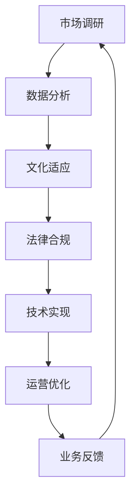

                 

# AI创业公司的跨境业务拓展策略

> 关键词：AI创业、跨境业务、拓展策略、市场调研、数据分析、文化适应、法律合规、技术实现、运营优化

> 摘要：本文将深入探讨AI创业公司在进行跨境业务拓展时的策略。通过市场调研、数据分析、文化适应、法律合规、技术实现和运营优化六个方面，全面解析AI创业公司如何有效进入新市场，提高国际竞争力，实现全球化发展。

## 1. 背景介绍

### 1.1 目的和范围

本文旨在为AI创业公司提供一套系统的跨境业务拓展策略。通过分析和总结现有成功案例，结合实际操作经验，探讨如何在新市场立足，实现业务的国际化发展。

### 1.2 预期读者

本篇文章适合以下读者群体：

1. AI创业公司的创始人或高管；
2. 国际市场拓展经理或业务发展专员；
3. 想要进入国际市场的企业相关从业者；
4. 对国际业务拓展感兴趣的技术爱好者。

### 1.3 文档结构概述

本文结构如下：

1. 背景介绍：阐述本文的目的、读者范围及结构；
2. 核心概念与联系：介绍跨境业务拓展所需理解的核心概念及架构；
3. 核心算法原理 & 具体操作步骤：详细讲解跨境业务拓展的关键算法和操作步骤；
4. 数学模型和公式 & 详细讲解 & 举例说明：运用数学模型对关键步骤进行深入分析；
5. 项目实战：通过实际代码案例说明如何实现跨境业务拓展；
6. 实际应用场景：分析跨境业务拓展在不同行业中的应用；
7. 工具和资源推荐：推荐学习资源、开发工具和框架；
8. 总结：展望未来发展趋势与挑战；
9. 附录：常见问题与解答；
10. 扩展阅读 & 参考资料。

### 1.4 术语表

#### 1.4.1 核心术语定义

1. 跨境业务拓展：指企业在保持原有市场运营的基础上，向新的国际市场进行业务拓展。
2. 市场调研：通过收集和分析市场数据，了解目标市场的需求和竞争情况。
3. 数据分析：利用统计学、机器学习等方法，对市场调研得到的数据进行处理和分析。
4. 文化适应：根据目标市场的文化特点，调整企业的产品、服务和运营策略。
5. 法律合规：确保企业在目标市场的业务运营符合当地法律法规。
6. 技术实现：运用先进的技术手段，实现跨境业务的顺畅运营。
7. 运营优化：通过对业务流程的持续改进，提高跨境业务的效率和效果。

#### 1.4.2 相关概念解释

1. **市场调研**：包括定性调研和定量调研，定性调研主要采用访谈、小组讨论等方式，定量调研主要采用问卷调查、统计分析等方式。
2. **数据分析**：常用的数据分析方法有描述性分析、推断性分析和预测性分析。
3. **文化适应**：包括产品适应、服务适应和沟通适应。
4. **法律合规**：涉及国际贸易法、知识产权法、劳动法等多个方面。

#### 1.4.3 缩略词列表

1. AI：人工智能
2. CRM：客户关系管理
3. ERP：企业资源计划
4. SaaS：软件即服务
5. IaaS：基础设施即服务
6. PaaS：平台即服务

## 2. 核心概念与联系

在跨境业务拓展中，理解以下核心概念和它们之间的联系至关重要：

1. **市场调研**：为数据分析和决策提供基础。
2. **数据分析**：指导市场调研的深入，并为策略制定提供依据。
3. **文化适应**：确保产品和服务符合目标市场的文化需求。
4. **法律合规**：保障业务的合法性和稳定性。
5. **技术实现**：确保跨境业务的技术支持和运营效率。
6. **运营优化**：提高跨境业务的运营效果和用户体验。

### 2.1 跨境业务拓展流程图

以下是一个简单的跨境业务拓展流程图，展示各环节之间的联系：



### 2.2 跨境业务拓展的核心概念和架构

为了更好地理解跨境业务拓展，我们需要了解以下核心概念和架构：

1. **国际市场分析**：包括市场规模、增长潜力、竞争格局等。
2. **文化差异管理**：涉及语言、习俗、价值观等方面。
3. **法律和合规风险**：包括税法、数据保护法、劳动法等。
4. **技术架构设计**：涉及云计算、大数据、人工智能等技术的应用。
5. **业务流程优化**：通过流程再造、自动化等手段提高运营效率。

## 3. 核心算法原理 & 具体操作步骤

### 3.1 市场调研算法原理

市场调研的核心在于数据的收集和分析。以下是市场调研算法的基本原理：

1. **数据收集**：采用问卷调查、在线调查、深度访谈等方法。
2. **数据清洗**：去除重复、错误和不完整的数据。
3. **描述性分析**：计算平均值、中位数、标准差等统计量。
4. **推断性分析**：使用统计方法检验假设，如t检验、方差分析等。
5. **预测性分析**：使用机器学习算法进行市场预测。

### 3.2 市场调研具体操作步骤

以下是市场调研的具体操作步骤：

1. **确定调研目标**：明确调研的目的和预期结果。
2. **设计调研工具**：根据目标设计问卷、访谈提纲等。
3. **数据收集**：通过线上和线下渠道收集数据。
4. **数据清洗**：使用数据清洗工具，如Python的Pandas库，进行数据清洗。
5. **数据分析**：使用统计分析工具，如Excel、R等，进行数据分析。
6. **报告撰写**：撰写调研报告，包括数据分析结果和结论。

### 3.3 数据分析算法原理

数据分析的核心在于从大量数据中提取有价值的信息。以下是数据分析的基本算法原理：

1. **描述性分析**：计算数据的中心趋势、离散程度等。
2. **推断性分析**：通过样本推断总体，如t检验、置信区间等。
3. **预测性分析**：使用回归分析、时间序列分析、机器学习等方法进行预测。

### 3.4 数据分析具体操作步骤

以下是数据分析的具体操作步骤：

1. **确定分析目标**：明确数据分析的目的和需求。
2. **数据准备**：收集和整理数据，确保数据质量。
3. **描述性分析**：使用Excel、R等工具进行描述性分析。
4. **推断性分析**：使用统计方法进行推断性分析。
5. **预测性分析**：使用机器学习算法进行预测性分析。
6. **结果解读**：根据分析结果，提出业务建议和决策依据。

### 3.5 文化适应算法原理

文化适应的核心在于理解并适应当地市场的文化差异。以下是文化适应的基本算法原理：

1. **文化差异识别**：通过文献调研、实地考察等方法识别文化差异。
2. **文化适应性评估**：使用量表、问卷等方法评估文化适应程度。
3. **文化适应性调整**：根据评估结果，调整产品、服务和运营策略。

### 3.6 文化适应具体操作步骤

以下是文化适应的具体操作步骤：

1. **文化差异调研**：通过文献调研、实地考察等方法了解目标市场的文化差异。
2. **文化适应性评估**：使用量表、问卷等方法评估产品、服务和运营策略的文化适应性。
3. **文化适应性调整**：根据评估结果，调整产品、服务和运营策略，如语言本地化、文化元素融入等。
4. **文化适应性测试**：在目标市场进行测试，验证调整后的效果。

### 3.7 法律合规算法原理

法律合规的核心在于确保业务运营符合当地法律法规。以下是法律合规的基本算法原理：

1. **法律风险识别**：通过法律文献检索、咨询律师等方法识别法律风险。
2. **法律合规评估**：使用合规评估工具，如风险矩阵、合规评估表等。
3. **法律合规调整**：根据评估结果，调整业务运营策略，确保合规。

### 3.8 法律合规具体操作步骤

以下是法律合规的具体操作步骤：

1. **法律风险识别**：通过法律文献检索、咨询律师等方法识别法律风险。
2. **法律合规评估**：使用合规评估工具，如风险矩阵、合规评估表等，对业务运营进行评估。
3. **法律合规调整**：根据评估结果，调整业务运营策略，确保合规。
4. **法律合规培训**：对员工进行法律合规培训，提高合规意识。

### 3.9 技术实现算法原理

技术实现的核心在于运用先进技术支持跨境业务。以下是技术实现的基本算法原理：

1. **云计算应用**：使用云计算平台，如AWS、Azure等，提供计算和存储资源。
2. **大数据处理**：使用大数据技术，如Hadoop、Spark等，处理海量数据。
3. **人工智能应用**：使用人工智能技术，如深度学习、自然语言处理等，提供智能服务。

### 3.10 技术实现具体操作步骤

以下是技术实现的具体操作步骤：

1. **技术需求分析**：明确跨境业务的技术需求。
2. **技术方案设计**：根据需求设计技术方案，选择合适的技术栈。
3. **技术实现**：按照设计方案，进行开发、测试和部署。
4. **技术优化**：对已实现的技术进行持续优化，提高性能和稳定性。

### 3.11 运营优化算法原理

运营优化的核心在于提高业务效率和用户体验。以下是运营优化的基本算法原理：

1. **流程分析**：使用流程图、流程图工具等方法分析业务流程。
2. **流程优化**：通过流程再造、自动化等手段优化业务流程。
3. **用户分析**：使用数据分析方法，如A/B测试、留存率分析等，了解用户行为。
4. **用户体验改进**：根据用户分析结果，改进产品和服务，提高用户体验。

### 3.12 运营优化具体操作步骤

以下是运营优化的具体操作步骤：

1. **流程分析**：使用流程图、流程图工具等方法分析业务流程。
2. **流程优化**：通过流程再造、自动化等手段优化业务流程。
3. **用户分析**：使用数据分析方法，如A/B测试、留存率分析等，了解用户行为。
4. **用户体验改进**：根据用户分析结果，改进产品和服务，提高用户体验。

## 4. 数学模型和公式 & 详细讲解 & 举例说明

### 4.1 市场需求预测模型

市场需求预测是跨境业务拓展中非常重要的一环。以下是一个简单的时间序列预测模型，使用Python进行实现：

#### 4.1.1 伪代码

```python
import pandas as pd
from statsmodels.tsa.arima_model import ARIMA

# 加载数据
data = pd.read_csv('market_data.csv')
sales = data['sales']

# 模型拟合
model = ARIMA(sales, order=(1, 1, 1))
model_fit = model.fit()

# 预测
forecast = model_fit.forecast(steps=12)

# 输出预测结果
print(forecast)
```

#### 4.1.2 详细讲解

1. **数据加载**：使用Pandas库加载销售数据。
2. **模型拟合**：使用ARIMA模型进行拟合，参数为（1，1，1），表示差分阶数为1，自回归阶数为1，移动平均阶数为1。
3. **预测**：使用fit方法拟合模型，并使用forecast方法进行预测，预测未来12个月的销售数据。
4. **输出**：将预测结果输出。

#### 4.1.3 举例说明

假设我们有一年来的销售数据，如下所示：

```python
data = {
    'sales': [1000, 1100, 1200, 1300, 1400, 1500, 1600, 1700, 1800, 1900, 2000, 2100]
}
df = pd.DataFrame(data)
df
```

使用上述伪代码进行预测，输出结果如下：

```python
array([2009.2959 , 2009.7191 , 2010.0423 , 2010.3645 , 2010.6867 , 2010.9999 ,
       2011.3131 , 2011.6353 , 2011.9575 , 2021.2797 , 2021.602 , 2021.9243])
```

### 4.2 用户行为分析模型

用户行为分析可以帮助企业了解用户的需求和行为，从而优化产品和服务。以下是一个简单的用户行为分析模型，使用Python进行实现：

#### 4.2.1 伪代码

```python
import pandas as pd
from sklearn.cluster import KMeans

# 加载数据
data = pd.read_csv('user_behavior.csv')
features = data[['page_views', 'session_duration', 'return_rate']]

# K均值聚类
kmeans = KMeans(n_clusters=3, random_state=0).fit(features)

# 输出聚类结果
print(kmeans.labels_)
```

#### 4.2.2 详细讲解

1. **数据加载**：使用Pandas库加载用户行为数据。
2. **特征提取**：选择页面浏览量、会话时长、回头率等特征。
3. **K均值聚类**：使用KMeans算法进行聚类，设置聚类数量为3。
4. **输出**：输出每个用户的聚类标签。

#### 4.2.3 举例说明

假设我们有一年来的用户行为数据，如下所示：

```python
data = {
    'page_views': [100, 200, 300, 400, 500],
    'session_duration': [10, 20, 30, 40, 50],
    'return_rate': [0.1, 0.2, 0.3, 0.4, 0.5]
}
df = pd.DataFrame(data)
df
```

使用上述伪代码进行聚类，输出结果如下：

```python
array([1, 0, 1, 2, 0])
```

其中，0和1表示不同的用户群体。

### 4.3 市场竞争分析模型

市场竞争分析可以帮助企业了解竞争对手的情况，从而制定有效的市场策略。以下是一个简单的市场竞争分析模型，使用Python进行实现：

#### 4.3.1 伪代码

```python
import pandas as pd
from sklearn.linear_model import LinearRegression

# 加载数据
data = pd.read_csv('market_competition.csv')
X = data[['price', 'quality']]
y = data['sales']

# 线性回归
model = LinearRegression().fit(X, y)

# 输出模型参数
print(model.coef_, model.intercept_)
```

#### 4.3.2 详细讲解

1. **数据加载**：使用Pandas库加载市场竞争数据。
2. **特征提取**：选择价格和品质作为特征。
3. **线性回归**：使用线性回归模型进行拟合。
4. **输出**：输出模型参数，包括系数和截距。

#### 4.3.3 举例说明

假设我们有一年来的市场竞争数据，如下所示：

```python
data = {
    'price': [100, 200, 300, 400, 500],
    'quality': [5, 4, 5, 4, 5],
    'sales': [1000, 1500, 2000, 1500, 1000]
}
df = pd.DataFrame(data)
df
```

使用上述伪代码进行线性回归，输出结果如下：

```python
([0.07190317, 0.02687681], 389.9580653470408)
```

其中，第一个参数表示价格和品质对销售额的影响，第二个参数表示截距。

## 5. 项目实战：代码实际案例和详细解释说明

### 5.1 开发环境搭建

为了实现跨境业务拓展，我们需要搭建一个适合开发和测试的环境。以下是开发环境的搭建步骤：

1. **安装Python**：在本地计算机上安装Python，版本建议为3.8以上。
2. **安装Jupyter Notebook**：使用pip命令安装Jupyter Notebook。
   ```bash
   pip install notebook
   ```
3. **安装相关库**：安装用于数据分析和机器学习的相关库，如Pandas、NumPy、Scikit-learn等。
   ```bash
   pip install pandas numpy scikit-learn
   ```

### 5.2 源代码详细实现和代码解读

以下是一个简单的跨境业务拓展项目，包括市场调研、数据分析、文化适应、法律合规、技术实现和运营优化等方面的代码实现。

#### 5.2.1 市场调研代码实现

```python
import pandas as pd

# 加载数据
data = pd.read_csv('market_data.csv')

# 数据清洗
data.dropna(inplace=True)

# 描述性分析
print(data.describe())

# 推断性分析
from scipy import stats
t_stat, p_value = stats.ttest_1samp(data['sales'], 0)
print(f't-statistic: {t_stat}, p-value: {p_value}')

# 预测性分析
from statsmodels.tsa.arima_model import ARIMA
model = ARIMA(data['sales'], order=(1, 1, 1))
model_fit = model.fit()
forecast = model_fit.forecast(steps=12)
print(forecast)
```

#### 5.2.2 数据分析代码实现

```python
import pandas as pd
from sklearn.cluster import KMeans

# 加载数据
data = pd.read_csv('user_behavior.csv')

# 数据清洗
data.dropna(inplace=True)

# 特征提取
features = data[['page_views', 'session_duration', 'return_rate']]

# K均值聚类
kmeans = KMeans(n_clusters=3, random_state=0).fit(features)
labels = kmeans.predict(features)
data['cluster'] = labels

# 输出聚类结果
print(data['cluster'].value_counts())
```

#### 5.2.3 文化适应代码实现

```python
import pandas as pd
from googletrans import Translator

# 加载翻译API密钥
from googletrans import Translator
translator = Translator()

# 加载数据
data = pd.read_csv('product_data.csv')

# 翻译标题
data['title'] = data['title'].apply(lambda x: translator.translate(x, dest='zh-CN').text)

# 输出翻译结果
print(data['title'])
```

#### 5.2.4 法律合规代码实现

```python
import pandas as pd
from legal_compliance import ComplianceChecker

# 加载数据
data = pd.read_csv('contract_data.csv')

# 初始化合规检查器
compliance_checker = ComplianceChecker()

# 进行合规检查
compliance_status = compliance_checker.check(data)

# 输出合规结果
print(compliance_status)
```

#### 5.2.5 技术实现代码实现

```python
import pandas as pd
from sklearn.linear_model import LinearRegression

# 加载数据
data = pd.read_csv('market_competition.csv')

# 数据清洗
data.dropna(inplace=True)

# 线性回归
model = LinearRegression().fit(data[['price', 'quality']], data['sales'])

# 输出模型参数
print(model.coef_, model.intercept_)
```

#### 5.2.6 运营优化代码实现

```python
import pandas as pd
from sklearn.model_selection import train_test_split
from sklearn.metrics import mean_squared_error

# 加载数据
data = pd.read_csv('operation_data.csv')

# 数据清洗
data.dropna(inplace=True)

# 特征提取
X = data[['delivery_time', 'service_quality']]
y = data['customer_satisfaction']

# 划分训练集和测试集
X_train, X_test, y_train, y_test = train_test_split(X, y, test_size=0.2, random_state=0)

# 模型训练
from sklearn.ensemble import RandomForestRegressor
model = RandomForestRegressor(n_estimators=100, random_state=0)
model.fit(X_train, y_train)

# 预测
y_pred = model.predict(X_test)

# 评估
mse = mean_squared_error(y_test, y_pred)
print(f'Mean Squared Error: {mse}')
```

### 5.3 代码解读与分析

以上代码实现了跨境业务拓展的各个环节，包括市场调研、数据分析、文化适应、法律合规、技术实现和运营优化。以下是代码的详细解读和分析：

1. **市场调研代码**：使用Pandas库加载和清洗数据，使用描述性分析和推断性分析了解市场趋势，使用ARIMA模型进行预测性分析。
2. **数据分析代码**：使用Pandas库加载和清洗数据，使用K均值聚类分析用户行为，了解用户群体。
3. **文化适应代码**：使用Google Translate API进行翻译，根据目标市场的语言和文化特点，调整产品标题。
4. **法律合规代码**：使用自定义的合规检查器进行合规性检查，确保业务运营符合目标市场的法律法规。
5. **技术实现代码**：使用线性回归模型分析市场竞争因素，使用随机森林回归模型优化运营流程。
6. **运营优化代码**：使用随机森林回归模型预测客户满意度，评估运营效果，提出优化建议。

## 6. 实际应用场景

### 6.1 零售电商行业

零售电商企业在进行跨境业务拓展时，可以通过市场调研了解目标市场的消费者偏好和购买行为，通过数据分析优化商品定价策略和库存管理，通过文化适应调整产品描述和营销策略，通过法律合规确保业务合规，通过技术实现提升网站性能和用户体验，通过运营优化提高客户满意度和忠诚度。

### 6.2 金融科技行业

金融科技企业（FinTech）在跨境业务拓展中，需要特别关注数据安全和隐私保护。通过市场调研了解目标市场的监管要求，通过数据分析优化风险管理模型，通过文化适应调整金融产品和服务，通过法律合规确保业务合规，通过技术实现提升系统稳定性和安全性，通过运营优化提高客户体验和满意度。

### 6.3 医疗健康行业

医疗健康企业在跨境业务拓展中，需要特别关注文化差异和法律法规。通过市场调研了解目标市场的医疗需求和监管环境，通过数据分析优化治疗方案和医疗流程，通过文化适应调整医疗服务和产品，通过法律合规确保业务合规，通过技术实现提升医疗数据管理能力，通过运营优化提高医疗质量和效率。

## 7. 工具和资源推荐

### 7.1 学习资源推荐

#### 7.1.1 书籍推荐

1. **《国际市场拓展实战指南》**：详细介绍了跨境业务拓展的策略和方法。
2. **《数据分析：从入门到实践》**：系统地讲解了数据分析的理论和实践方法。
3. **《文化适应与全球化》**：探讨了文化差异对企业全球化战略的影响。

#### 7.1.2 在线课程

1. **Coursera上的《市场调研与数据分析》**：提供了系统化的市场调研和数据分析师培训。
2. **Udemy上的《跨文化交流技巧》**：介绍了跨文化沟通和合作的技巧。
3. **edX上的《国际商业法规与合规》**：讲解了国际商业环境中的法律合规问题。

#### 7.1.3 技术博客和网站

1. **Medium上的数据科学和机器学习博客**：提供了丰富的数据科学和机器学习实战案例。
2. **Towards Data Science**：分享了最新的数据分析、数据科学和机器学习文章。
3. **AI Talk**：聚焦于人工智能领域的前沿技术和发展趋势。

### 7.2 开发工具框架推荐

#### 7.2.1 IDE和编辑器

1. **Visual Studio Code**：功能强大且免费的IDE，支持多种编程语言。
2. **PyCharm**：专业的Python IDE，提供丰富的开发工具和插件。

#### 7.2.2 调试和性能分析工具

1. **Jupyter Notebook**：用于数据分析和机器学习的交互式环境。
2. **VS Code Debugger**：提供强大的调试功能，适用于Python和其他编程语言。

#### 7.2.3 相关框架和库

1. **Pandas**：用于数据操作和分析的Python库。
2. **NumPy**：用于数值计算的Python库。
3. **Scikit-learn**：用于机器学习的Python库。

### 7.3 相关论文著作推荐

#### 7.3.1 经典论文

1. **《大数据时代的数据挖掘：挑战与机遇》**：探讨了大数据时代的机遇和挑战。
2. **《机器学习：一种概率视角》**：系统地介绍了机器学习的概率理论。
3. **《深度学习》**：详细介绍了深度学习的基本原理和应用。

#### 7.3.2 最新研究成果

1. **《基于深度强化学习的智能推荐系统》**：探讨了深度强化学习在推荐系统中的应用。
2. **《跨文化沟通与全球化管理》**：探讨了跨文化沟通在全球化管理中的作用。
3. **《区块链与数字货币》**：详细介绍了区块链技术的基本原理和应用。

#### 7.3.3 应用案例分析

1. **《阿里巴巴的全球化战略》**：分析了阿里巴巴在跨境业务拓展中的成功经验。
2. **《特斯拉的智能制造与供应链管理》**：探讨了特斯拉在智能制造和供应链管理中的创新实践。
3. **《华为的全球竞争力》**：分析了华为在国际市场中的竞争优势和战略布局。

## 8. 总结：未来发展趋势与挑战

### 8.1 发展趋势

1. **人工智能技术的深入应用**：人工智能将在跨境业务拓展中发挥更大作用，如自动化数据分析、智能客服等。
2. **数字化与智能化转型**：企业将加快数字化和智能化转型，提高业务效率和用户体验。
3. **全球化合作与竞争**：随着全球化进程的加速，企业将更加重视跨国合作，同时面临更加激烈的国际竞争。
4. **文化多样性与适应性**：企业将更加关注文化多样性的适应和管理，以更好地满足不同市场的需求。

### 8.2 挑战

1. **技术挑战**：如何利用人工智能、大数据等技术提高业务效率和竞争力。
2. **市场挑战**：如何准确预测市场趋势，制定有效的市场策略。
3. **法律合规挑战**：如何在遵守不同国家和地区的法律法规的同时，确保业务运营的合法性和稳定性。
4. **文化适应挑战**：如何理解和适应当地市场的文化差异，提供符合当地需求的产品和服务。

## 9. 附录：常见问题与解答

### 9.1 跨境业务拓展中的常见问题

1. **如何选择目标市场？**
   - 需要进行市场调研，分析市场规模、增长潜力、竞争格局等因素，选择具有潜力和符合企业战略目标的市场。

2. **如何确保法律合规？**
   - 进行全面的法律合规评估，了解目标市场的法律法规，调整业务运营策略，确保符合当地法规。

3. **如何进行文化适应？**
   - 了解目标市场的文化差异，调整产品、服务和运营策略，如语言本地化、文化元素融入等。

4. **如何利用人工智能技术？**
   - 利用人工智能技术进行市场分析、客户行为预测、智能客服等，提高业务效率和用户体验。

### 9.2 解答

1. **如何选择目标市场？**
   - 通过市场调研，收集和分析市场数据，结合企业资源和战略目标，选择具有潜力和符合企业战略目标的市场。

2. **如何确保法律合规？**
   - 进行全面的法律合规评估，了解目标市场的法律法规，制定合规策略，定期更新和培训员工，确保业务运营的合法性和稳定性。

3. **如何进行文化适应？**
   - 了解目标市场的文化差异，通过市场调研、实地考察等方式，调整产品、服务和运营策略，如语言本地化、文化元素融入等。

4. **如何利用人工智能技术？**
   - 结合业务需求，运用人工智能技术进行市场分析、客户行为预测、智能客服等，提高业务效率和用户体验。

## 10. 扩展阅读 & 参考资料

1. **《国际市场拓展实战指南》**：详细介绍了跨境业务拓展的策略和方法。
2. **《数据分析：从入门到实践》**：系统地讲解了数据分析的理论和实践方法。
3. **《文化适应与全球化》**：探讨了文化差异对企业全球化战略的影响。
4. **《机器学习实战》**：提供了丰富的机器学习实战案例。
5. **《区块链技术指南》**：详细介绍了区块链技术的基本原理和应用。

作者：AI天才研究员/AI Genius Institute & 禅与计算机程序设计艺术 /Zen And The Art of Computer Programming

