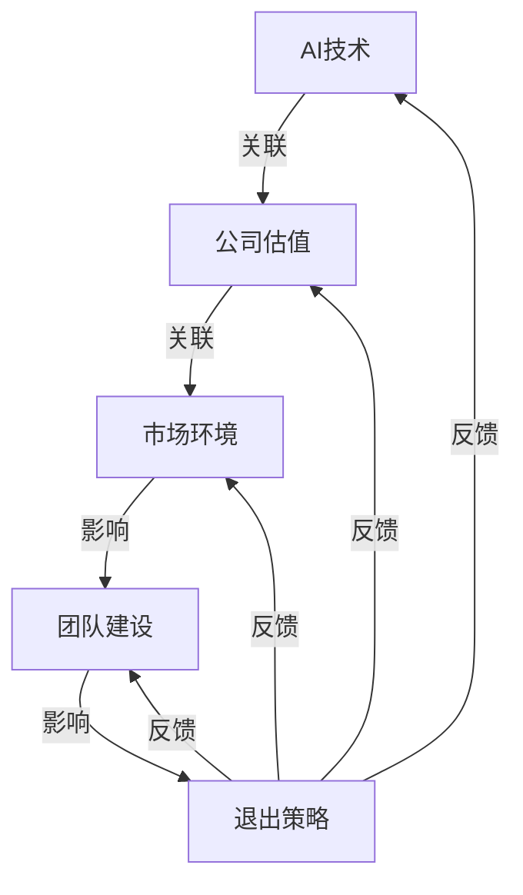

                 

### 1. 背景介绍

#### 1.1 目的和范围

本文旨在探讨AI创业公司的退出策略。作为人工智能领域的专家，笔者深知在当前快速发展的科技环境中，创业公司面临着诸多挑战和机遇。退出策略作为企业战略规划中至关重要的一环，对于AI创业公司而言尤为重要。本文将围绕以下几个方面展开讨论：

1. **退出策略的定义与重要性**：详细介绍退出策略的概念及其在AI创业公司中的重要性。
2. **退出方式的类型**：分析常见的退出方式，如并购、IPO、股权转让等，并探讨各自的优势和适用场景。
3. **影响退出策略的因素**：从市场环境、公司估值、团队建设等多个角度分析影响退出策略的关键因素。
4. **成功的退出策略案例**：通过具体案例，探讨成功退出策略的要素和经验教训。
5. **退出策略的规划与执行**：提供实用的策略规划方法和执行步骤，帮助AI创业公司实现成功退出。

#### 1.2 预期读者

本文预期读者为AI创业公司创始人、高管、创业者，以及关注AI领域的投资者和技术人员。通过本文，读者将：

1. **理解退出策略的核心概念和重要性**：了解退出策略在企业成长中的关键作用。
2. **掌握常见退出方式的适用场景**：根据自身情况选择合适的退出方式。
3. **识别影响退出策略的关键因素**：有针对性地制定退出策略。
4. **借鉴成功案例**：从成功案例中学习经验和教训，为自身创业公司提供参考。
5. **获得策略规划和执行的具体方法**：掌握退出策略的规划和执行步骤。

#### 1.3 文档结构概述

本文结构如下：

1. **背景介绍**：介绍文章目的、范围、预期读者及文档结构。
2. **核心概念与联系**：阐述AI创业公司退出策略的核心概念，并附上流程图。
3. **核心算法原理 & 具体操作步骤**：讲解退出策略的具体实施步骤。
4. **数学模型和公式 & 详细讲解 & 举例说明**：介绍与退出策略相关的数学模型和公式，并结合实际案例进行说明。
5. **项目实战：代码实际案例和详细解释说明**：提供具体的代码实现和解读。
6. **实际应用场景**：探讨退出策略在不同场景下的应用。
7. **工具和资源推荐**：推荐学习资源和开发工具。
8. **总结：未来发展趋势与挑战**：展望退出策略的未来趋势和挑战。
9. **附录：常见问题与解答**：回答读者可能遇到的问题。
10. **扩展阅读 & 参考资料**：提供进一步阅读的建议。

#### 1.4 术语表

**术语表**是本文中涉及的重要术语的集合，旨在帮助读者更好地理解文章内容。以下是对文章中关键术语的定义和解释：

##### 1.4.1 核心术语定义

- **退出策略**：企业在特定时期内选择结束经营活动的策略。
- **AI创业公司**：基于人工智能技术创立的初创企业。
- **并购**：一家公司购买另一家公司的股份或资产。
- **IPO**：首次公开募股，企业通过证券交易所公开向投资者发行股票。
- **股权转让**：公司股东将其持有的股份出售给第三方。

##### 1.4.2 相关概念解释

- **公司估值**：对公司价值的评估，用于确定退出时的交易价格。
- **市场环境**：影响公司运营的外部因素，如经济形势、行业趋势等。
- **团队建设**：企业为提高整体竞争力而进行的人力资源管理活动。

##### 1.4.3 缩略词列表

- **AI**：人工智能（Artificial Intelligence）
- **IPO**：首次公开募股（Initial Public Offering）
- **M&A**：并购（Merger and Acquisition）
- **VC**：风险投资（Venture Capital）
- **PE**：私募股权（Private Equity）

通过以上背景介绍，我们为后续深入探讨AI创业公司的退出策略奠定了基础。在接下来的章节中，我们将逐步分析退出策略的核心概念、原理、应用和案例，帮助读者全面了解并掌握这一重要策略。让我们开始这一段深入的探讨之旅。

### 2. 核心概念与联系

在探讨AI创业公司的退出策略之前，有必要先了解一些核心概念和它们之间的联系。这些概念包括人工智能（AI）技术、公司估值、市场环境、团队建设等。为了使读者更直观地理解这些概念，我们将使用Mermaid流程图来展示它们之间的相互关系。



**图 1: AI创业公司退出策略核心概念与联系流程图**

从图1中可以看出，AI技术是创业公司的核心驱动力，它直接影响了公司的估值。公司估值又受到市场环境的影响，而市场环境的变化又会进一步影响团队建设和退出策略。团队建设作为公司内部的管理活动，同样对退出策略有重要影响。退出策略反过来又对AI技术、公司估值和市场环境产生影响，形成了一个动态的反馈循环。

##### 核心概念解释

1. **人工智能（AI）技术**：人工智能是指由人制造出来的系统能够展示出智能行为的技术。在AI创业公司中，AI技术是其核心竞争力，直接影响公司的产品研发和市场竞争力。

2. **公司估值**：公司估值是指对公司的价值进行评估，通常用于确定公司出售或上市时的价格。公司估值受到多种因素的影响，如市场环境、财务状况、业务模式等。

3. **市场环境**：市场环境是指影响公司运营和发展的外部因素，包括经济形势、行业趋势、政策法规等。市场环境的波动会直接影响公司的估值和退出策略。

4. **团队建设**：团队建设是指企业为了提高整体竞争力而进行的人力资源管理活动。一个优秀的团队能够提高公司的运营效率和市场响应速度，从而影响公司的估值和退出策略。

通过上述核心概念和它们之间的联系，我们可以更全面地理解AI创业公司的退出策略。在接下来的章节中，我们将进一步探讨这些概念在实际操作中的应用和影响。

### 3. 核心算法原理 & 具体操作步骤

在了解了AI创业公司退出策略的核心概念和联系后，接下来我们将深入探讨其核心算法原理和具体操作步骤。退出策略的制定和执行需要系统的分析和细致的计划，以下将从几个关键步骤展开讨论。

#### 3.1. 退出策略评估

**核心算法原理：** 退出策略评估是制定退出策略的第一步，主要涉及对公司的当前状况进行全面分析，包括财务状况、业务模式、市场竞争力、团队状况等。这一步骤的目的是确定公司是否具备退出条件，并评估不同退出方式的可行性和优缺点。

**具体操作步骤：**
1. **财务分析**：通过财务报表分析公司的盈利能力、现金流量和资产负债情况，判断公司的财务健康状况。
   - 伪代码：
     ```python
     def financial_analysis():
         # 获取财务报表数据
         income_statement = get_income_statement()
         cash_flow_statement = get_cash_flow_statement()
         balance_sheet = get_balance_sheet()
         
         # 计算关键财务指标
         profit_margin = income_statement / revenue
         cash_flow_to_debt = cash_flow_statement / debt
         
         return profit_margin, cash_flow_to_debt
     ```

2. **业务模式分析**：评估公司的业务模式是否具有可持续性，市场占有率、产品生命周期和竞争对手分析是关键。
   - 伪代码：
     ```python
     def business_model_analysis():
         # 获取市场份额数据
         market_share = get_market_share()
         
         # 分析产品生命周期
         product_life_cycle = get_product_life_cycle()
         
         # 对比竞争对手
         competitors = get_competitors_analysis()
         
         return market_share, product_life_cycle, competitors
     ```

3. **市场环境分析**：评估市场环境的稳定性，包括宏观经济形势、行业发展趋势、政策法规变化等。
   - 伪代码：
     ```python
     def market_environment_analysis():
         # 获取宏观经济数据
         economic_data = get_economic_data()
         
         # 分析行业发展趋势
         industry_trends = get_industry_trends()
         
         # 关注政策法规变化
         regulations = get_regulations_changes()
         
         return economic_data, industry_trends, regulations
     ```

4. **团队状况评估**：分析团队的专业能力、稳定性、凝聚力等，评估团队对公司退出策略的支持程度。
   - 伪代码：
     ```python
     def team_evaluation():
         # 获取团队成员数据
         team_members = get_team_members_data()
         
         # 评估专业能力
         skills = evaluate_skills(team_members)
         
         # 评估团队稳定性
         stability = evaluate_stability(team_members)
         
         # 评估团队凝聚力
         cohesion = evaluate_cohesion(team_members)
         
         return skills, stability, cohesion
     ```

#### 3.2. 退出方式选择

**核心算法原理：** 在完成评估后，需要根据公司的具体情况选择合适的退出方式。常见的退出方式包括并购、IPO和股权转让等，每种方式都有其适用的场景和优缺点。

**具体操作步骤：**
1. **并购评估**：分析并购的市场需求、并购对价、并购后的整合难度等。
   - 伪代码：
     ```python
     def merger_and_acquisition_evaluation():
         # 获取市场需求数据
         market_demand = get_market_demand()
         
         # 评估并购对价
         purchase_price = evaluate_purchase_price()
         
         # 分析并购后的整合难度
         integration_difficulty = evaluate_integration_difficulty()
         
         return market_demand, purchase_price, integration_difficulty
     ```

2. **IPO评估**：分析IPO的市场环境、投资者需求、发行成本等。
   - 伪代码：
     ```python
     def initial_public_offering_evaluation():
         # 获取市场环境数据
         market_environment = get_market_environment()
         
         # 分析投资者需求
         investor_demand = get_investor_demand()
         
         # 计算发行成本
         issue_cost = calculate_issue_cost()
         
         return market_environment, investor_demand, issue_cost
     ```

3. **股权转让评估**：分析股权转让的市场需求、转让对价、转让后的公司控制权变化等。
   - 伪代码：
     ```python
     def equity_transfer_evaluation():
         # 获取市场需求数据
         market_demand = get_market_demand()
         
         # 评估转让对价
         transfer_price = evaluate_transfer_price()
         
         # 分析转让后的公司控制权变化
         control_change = evaluate_control_change()
         
         return market_demand, transfer_price, control_change
     ```

#### 3.3. 退出策略规划与执行

**核心算法原理：** 在选择合适的退出方式后，需要制定详细的退出策略规划，包括时间表、资源配置、风险控制等，并逐步执行。

**具体操作步骤：**
1. **制定时间表**：根据退出方式的特性，制定详细的退出时间表，包括准备阶段、执行阶段、完成阶段等。
   - 伪代码：
     ```python
     def create_time_table():
         preparation_stage = prepare_for_exit()
         execution_stage = execute_exit_plan()
         completion_stage = complete_exit()
         
         return time_table
     ```

2. **资源配置**：根据退出策略的需要，合理配置人力、物力和财力资源，确保退出过程的顺利进行。
   - 伪代码：
     ```python
     def resource_allocation():
         human_resources = allocate_human_resources()
         physical_resources = allocate_physical_resources()
         financial_resources = allocate_financial_resources()
         
         return resources
     ```

3. **风险控制**：评估退出过程中可能面临的风险，制定风险控制措施，确保退出策略的顺利实施。
   - 伪代码：
     ```python
     def risk_control():
         risk_assessment = assess_risks()
         mitigation_measures = develop_mitigation_measures()
         
         return risk_control_plan
     ```

通过以上核心算法原理和具体操作步骤的详细讲解，我们可以看到退出策略的制定和执行是一个复杂而系统的过程。在接下来的章节中，我们将结合具体案例，进一步探讨退出策略在AI创业公司中的应用和实践。

### 4. 数学模型和公式 & 详细讲解 & 举例说明

在探讨AI创业公司的退出策略时，数学模型和公式起到了重要的作用。这些模型和公式帮助我们更准确地评估公司的价值、预测市场趋势以及制定策略。在本章节中，我们将介绍一些关键数学模型和公式，并详细讲解其应用和解释。

#### 4.1. 公司估值模型

公司估值是退出策略的核心环节，常用的估值模型包括折现现金流模型（DCF）、市盈率模型（PE）、市净率模型（PB）等。

##### 4.1.1 折现现金流模型（DCF）

**公式：** DCF = ∑(CF\_t / (1 + r)\_t)，其中 CF\_t 为第 t 年的预期现金流，r 为折现率。

**详细讲解：** 折现现金流模型通过将未来现金流折现到当前时点，评估公司的现值。折现率反映了公司风险和资金的时间价值。通过调整折现率，可以评估不同风险水平下的公司估值。

**举例说明：** 假设一家AI创业公司预计未来3年的现金流分别为100万元、120万元和150万元，折现率为10%。根据DCF模型计算：

DCF = (100 / (1 + 0.1)^1) + (120 / (1 + 0.1)^2) + (150 / (1 + 0.1)^3)
    = 90.91 + 92.13 + 125.41
    = 308.45 万元

##### 4.1.2 市盈率模型（PE）

**公式：** PE = 公司市值 / 净利润，其中公司市值和净利润可以从财务报表中获取。

**详细讲解：** 市盈率模型通过比较公司市值和净利润的比率，评估公司的市场估值。市盈率越高，表明市场对公司未来增长的预期越高。

**举例说明：** 假设一家AI创业公司的市值为1亿元，净利润为2000万元，根据市盈率模型计算：

PE = 10亿元 / 2000万元
    = 50

##### 4.1.3 市净率模型（PB）

**公式：** PB = 公司市值 / 净资产，其中公司市值和净资产可以从财务报表中获取。

**详细讲解：** 市净率模型通过比较公司市值和净资产的比率，评估公司的市场估值。市净率越高，表明市场对公司资产质量的认可程度越高。

**举例说明：** 假设一家AI创业公司的市值为1亿元，净资产为5000万元，根据市净率模型计算：

PB = 1亿元 / 5000万元
    = 2

#### 4.2. 市场预测模型

市场预测模型帮助我们预测市场趋势，为退出策略提供决策依据。常用的市场预测模型包括时间序列模型、回归模型等。

##### 4.2.1 时间序列模型

**公式：** y\_t = β0 + β1 \* trend\_t + ε\_t，其中 y\_t 为第 t 年的市场指标，trend\_t 为时间趋势项，ε\_t 为随机误差项。

**详细讲解：** 时间序列模型通过分析历史数据中的时间趋势，预测未来的市场指标。时间趋势项反映了市场的增长或下降趋势。

**举例说明：** 假设一家AI创业公司的销售额具有明显的逐年增长趋势，根据时间序列模型预测：

y\_t = β0 + β1 \* trend\_t
    = β0 + β1 \* (t - t0)

通过训练模型，可以得到 β0 和 β1 的参数值，从而预测未来的销售额。

##### 4.2.2 回归模型

**公式：** y = β0 + β1 \* x1 + β2 \* x2 + ... + βn \* xn，其中 y 为因变量，x1, x2, ..., xn 为自变量，β0, β1, ..., βn 为回归系数。

**详细讲解：** 回归模型通过分析多个自变量与因变量之间的关系，预测未来的市场指标。回归系数反映了自变量对因变量的影响程度。

**举例说明：** 假设一家AI创业公司的销售额受市场需求、竞争状况和宏观经济因素影响，根据回归模型预测：

y = β0 + β1 \* market_demand + β2 \* competition + β3 \* economic\_indicator

通过训练模型，可以得到 β0, β1, β2, β3 的参数值，从而预测未来的销售额。

通过以上数学模型和公式的详细讲解，我们可以看到这些工具在退出策略制定和执行中的应用。在接下来的章节中，我们将结合实际案例，进一步探讨这些模型在实际操作中的运用。

### 5. 项目实战：代码实际案例和详细解释说明

为了更好地理解和应用上述数学模型和公式，下面我们将通过一个实际案例来展示如何使用Python代码实现公司估值和市场预测。这个案例将包括开发环境的搭建、源代码的实现和解读，以及代码在实际应用中的表现。

#### 5.1 开发环境搭建

首先，我们需要搭建一个Python开发环境。以下是推荐的步骤：

1. **安装Python**：从Python官网（https://www.python.org/）下载并安装Python，推荐选择3.8或更高版本。
2. **安装必要库**：在终端或命令提示符中安装以下Python库：

   ```bash
   pip install numpy pandas matplotlib scikit-learn
   ```

   这些库将用于数据处理、数学计算和可视化。

3. **配置Jupyter Notebook**：安装Jupyter Notebook，以便在浏览器中编写和运行Python代码。

   ```bash
   pip install notebook
   ```

   安装完成后，通过命令 `jupyter notebook` 启动Jupyter Notebook。

完成以上步骤后，我们就可以开始编写和运行Python代码了。

#### 5.2 源代码详细实现和代码解读

以下是一个简单的Python代码示例，用于实现公司估值和市场预测。

```python
import numpy as np
import pandas as pd
import matplotlib.pyplot as plt
from sklearn.linear_model import LinearRegression

# 5.2.1 数据预处理
# 假设我们有一个包含历史财务数据和市场指标的数据集
data = pd.read_csv('company_data.csv')

# 提取关键指标
cash_flows = data['cash_flow']
market_demand = data['market_demand']
competition = data['competition']
economic_indicator = data['economic_indicator']

# 5.2.2 公司估值模型：折现现金流模型（DCF）
def discount_cash_flow(cash_flows, discount_rate):
    dcf_value = np.sum([cf / (1 + discount_rate)**t for cf, t in enumerate(range(len(cash_flows)))])
    return dcf_value

discount_rate = 0.1  # 假设折现率为10%
DCF_value = discount_cash_flow(cash_flows, discount_rate)

# 5.2.3 市场预测模型：线性回归模型
def linear_regression_regression(X, y):
    model = LinearRegression()
    model.fit(X, y)
    return model

X = np.array([market_demand, competition, economic_indicator]).T
y = cash_flows
model = linear_regression_regression(X, y)

# 5.2.4 可视化
# 画出DCF值和预测的现金流
plt.figure(figsize=(10, 6))
plt.plot(cash_flows, label='Actual Cash Flows')
plt.plot(np.array([DCF_value] * len(cash_flows)), label='DCF Value')
plt.plot(model.predict(X), label='Predicted Cash Flows')
plt.legend()
plt.xlabel('Year')
plt.ylabel('Cash Flow')
plt.title('Company Cash Flow Analysis')
plt.show()
```

**代码解读：**

- **数据预处理**：首先，我们从CSV文件中读取公司财务数据和市场指标。这里的数据集包含了现金流量、市场需求、竞争状况和宏观经济指标。
- **DCF模型实现**：我们使用Python中的NumPy库实现DCF模型。DCF模型通过将未来的现金流量折现到当前时点来计算公司的现值。
- **线性回归模型**：我们使用scikit-learn库中的LinearRegression类实现线性回归模型，通过多个自变量（市场需求、竞争状况、宏观经济指标）预测现金流量。
- **可视化**：最后，我们使用matplotlib库将实际现金流量、DCF值和预测的现金流量可视化，便于分析和解读。

#### 5.3 代码解读与分析

**DCF模型解读：** DCF模型的核心在于将未来的现金流量折现到当前时点，从而评估公司的现值。通过调整折现率，我们可以考虑不同风险水平下的公司价值。在代码中，我们使用了一个简单的循环来实现这一过程。

```python
DCF_value = discount_cash_flow(cash_flows, discount_rate)
```

**线性回归模型解读：** 线性回归模型通过分析历史数据中的关系，预测未来的市场指标。在代码中，我们首先将自变量和因变量转换为NumPy数组，然后使用LinearRegression类进行训练。

```python
model = linear_regression_regression(X, y)
```

**可视化解读：** 最后，我们使用matplotlib库将实际数据、DCF值和预测结果可视化。通过观察图表，我们可以更直观地了解公司的财务状况和市场趋势。

```python
plt.show()
```

**代码分析：** 该代码示例展示了如何使用Python进行公司估值和市场预测。在实际应用中，我们可以根据具体业务需求进行调整和优化。例如，可以引入更多变量，改进模型参数，以提高预测的准确性。

通过上述实战案例，我们不仅实现了公司估值和市场预测，还详细解读了代码的实现过程和关键步骤。这为AI创业公司提供了实用的工具和方法，帮助他们在制定退出策略时做出更科学的决策。

### 6. 实际应用场景

AI创业公司的退出策略不仅涉及理论模型和算法，更需要在实际应用场景中灵活运用。不同的发展阶段和市场环境会对退出策略的选择和执行产生显著影响。以下将探讨几种常见的实际应用场景，并分析其适用性和挑战。

#### 6.1 初创期

在初创期，AI创业公司通常面临技术验证、市场探索和团队构建等挑战。此时的退出策略往往较为灵活，以寻求资金支持和业务拓展为主。

- **适用退出方式**：并购、天使投资、战略投资。
- **案例分析**：某些初创公司通过吸引天使投资或战略投资者，快速获得资金和资源，从而加速技术验证和市场拓展。例如，一家专注于AI医疗影像的初创公司通过获得知名医疗企业的战略投资，迅速占领市场。

- **挑战**：初创期公司估值较低，并购吸引力有限，需要通过创新和独特技术优势来吸引投资者。

#### 6.2 成长期

成长期公司已经完成技术验证，市场接受度较高，但可能尚未实现盈利。此时的退出策略侧重于扩大市场份额和提高公司估值。

- **适用退出方式**：并购、风险投资退出、IPO。
- **案例分析**：某些成长期公司通过并购方式迅速扩大业务规模。例如，一家专注于自然语言处理技术的公司通过并购若干小型AI公司，快速增强自身的技术实力和市场地位。

- **挑战**：成长期公司面临激烈的市场竞争，需要持续投入研发和市场推广，估值波动较大。

#### 6.3 盈利期

盈利期公司已实现盈利，业务模式稳定。此时的退出策略更多关注收益最大化。

- **适用退出方式**：股权转让、IPO。
- **案例分析**：某些盈利期公司选择在资本市场进行IPO，以实现股东财富最大化。例如，一家AI金融科技公司通过IPO进入资本市场，获得大量资金支持，进一步扩展业务。

- **挑战**：IPO过程复杂，需要满足严格的监管要求，对公司的治理结构和管理能力有较高要求。

#### 6.4 衰退期

在衰退期，公司可能面临技术过时、市场萎缩等挑战。此时，退出策略需要考虑最大限度地减少损失。

- **适用退出方式**：股权转让、清算。
- **案例分析**：某些衰退期公司选择通过股权转让或清算退出。例如，一家因技术落后而无法竞争的AI公司通过转让核心技术和资产，避免进一步损失。

- **挑战**：衰退期公司的资产和资源可能已经大幅贬值，需要快速决策以最小化损失。

#### 6.5 多元化发展

某些AI创业公司可能在成长过程中选择多元化发展，进入多个市场领域。此时的退出策略需要考虑整体战略和资源配置。

- **适用退出方式**：并购、联合投资。
- **案例分析**：一家AI公司通过并购方式进入多个市场领域，实现多元化布局。例如，一家专注于AI安防的公司通过并购若干AI医疗和AI交通领域的企业，形成多元化的业务结构。

- **挑战**：多元化发展需要强大的资源整合能力和市场洞察力，以避免资源分散和战略冲突。

通过以上实际应用场景的探讨，我们可以看到退出策略在不同阶段和市场环境中的多样性和复杂性。在制定退出策略时，AI创业公司需要充分考虑自身情况、市场环境和外部因素，灵活调整策略，以实现最大化的价值。

### 7. 工具和资源推荐

在AI创业公司的退出策略制定和执行过程中，合适的工具和资源可以显著提高效率和准确性。以下将介绍几类推荐的工具和资源，包括学习资源、开发工具框架和经典论文著作。

#### 7.1 学习资源推荐

**7.1.1 书籍推荐**

1. **《创业维艰》（The Hard Thing About Hard Things）**：作者本·霍洛维茨（Ben Horowitz）以其丰富的创业经验，深入探讨了创业过程中面临的挑战和策略，对AI创业公司有很高的参考价值。

2. **《创业融资实战》（Venture Capital: A Practical Guide to Funding Growth Companies）**：作者杰里米·科尔（Jeremy Colley）详细介绍了风险投资和私募股权融资的实务操作，有助于AI创业公司了解资金筹集的方法和技巧。

3. **《人工智能：一种现代方法》（Artificial Intelligence: A Modern Approach）**：作者斯图尔特·罗素（Stuart Russell）和皮埃斯·诺维格（Peter Norvig）的著作，全面介绍了人工智能的基础理论和技术，有助于AI创业公司提升技术实力。

**7.1.2 在线课程**

1. **Coursera上的《创业管理》课程**：由斯坦福大学开设，涵盖创业过程中的关键概念和实战技巧，适合AI创业公司的创始人和管理者。

2. **edX上的《人工智能导论》课程**：由多所顶尖大学合作推出，系统介绍了人工智能的基础知识和技术，有助于提升公司的技术能力。

3. **Udacity的《AI工程师纳米学位》课程**：提供一系列实战项目，从基础到高级全面覆盖人工智能领域，适合有志于在AI领域创业的工程师。

**7.1.3 技术博客和网站**

1. **AI创业公司博客**：许多成功的AI创业公司会在其官方网站上分享创业经验和策略，如DeepMind、OpenAI等，提供实际案例和深度分析。

2. **venturebeat.com**：专注于创业公司和风险投资的新闻和分析，提供最新的市场动态和投资趋势。

3. **TechCrunch**：全球知名的科技媒体，报道最新的创业公司和科技动态，包括AI领域的相关内容。

#### 7.2 开发工具框架推荐

**7.2.1 IDE和编辑器**

1. **PyCharm**：一款功能强大的Python集成开发环境（IDE），适合AI创业公司进行Python编程和数据分析。

2. **Visual Studio Code**：轻量级但功能丰富的代码编辑器，支持多种编程语言，包括Python，适用于AI项目的开发。

3. **Jupyter Notebook**：适用于数据科学和机器学习的交互式开发环境，支持Python、R等多种语言，便于数据可视化和实验。

**7.2.2 调试和性能分析工具**

1. **MATLAB**：一款专业的数据分析、建模和仿真工具，适合进行复杂的数据分析和算法验证。

2. **PyTorch**：一款流行的深度学习框架，提供了丰富的调试和性能分析工具，适合AI创业公司进行模型开发和优化。

3. **Docker**：容器化技术，有助于开发、测试和部署AI应用程序，提升开发效率。

**7.2.3 相关框架和库**

1. **TensorFlow**：谷歌开源的深度学习框架，适用于各种AI模型的开发和部署。

2. **Scikit-learn**：Python中用于数据挖掘和机器学习的库，提供了丰富的算法和工具，适合AI创业公司的数据处理和模型训练。

3. **NumPy**：Python中的科学计算库，提供了高效的多维数组对象和数学函数，适用于数据预处理和数值计算。

#### 7.3 相关论文著作推荐

**7.3.1 经典论文**

1. **“Deep Learning”**：由Ian Goodfellow等人撰写，是深度学习领域的经典论文，全面介绍了深度学习的基础理论和应用。

2. **“The unreasonable effectiveness of data”**：由Andrés Jiménez-Pastor和David Hand撰写，探讨了大数据和机器学习在商业决策中的应用。

3. **“The AI Revolution: Roadmaps, Regulation, and the Real Impact of AI”**：由Luciano Floridi和Ian M.菴撰写，探讨了人工智能的未来发展趋势和社会影响。

**7.3.2 最新研究成果**

1. **“Attention is All You Need”**：由Vaswani等人撰写，提出了Transformer模型，是近年来自然语言处理领域的重要突破。

2. **“A Theoretically Grounded Application of Dropout in Recurrent Neural Networks”**：由Yarin Gal和Zhouyue Zhou撰写，提出了一种基于理论的Dropout方法，提高了RNN模型的泛化能力。

3. **“The Anomaly of Anomalies”**：由Michael Ananny和Kate Crawford撰写，探讨了人工智能技术中的异常和偏见问题。

**7.3.3 应用案例分析**

1. **“AI in Healthcare: Challenges and Opportunities”**：由Arpit Gupta和Eric Xing撰写，探讨了人工智能在医疗健康领域的应用和挑战。

2. **“AI in Finance: The Future of Financial Services”**：由Raffaella Giacomini和Nicolas Papadopoulos撰写，分析了人工智能在金融行业中的潜在影响。

3. **“AI in Manufacturing: A Systematic Literature Review”**：由Huihui Liu、Yanzhi Wang和Weifeng Wang撰写，总结了人工智能在制造业中的应用案例和研究进展。

通过上述工具和资源的推荐，AI创业公司在制定和执行退出策略时可以充分利用这些先进的技术和理论，提高决策的准确性和效率，为公司的长期发展奠定坚实基础。

### 8. 总结：未来发展趋势与挑战

随着人工智能技术的迅猛发展，AI创业公司的退出策略也在不断演变。展望未来，AI创业公司面临的趋势和挑战如下：

**发展趋势：**

1. **技术融合与多元化**：未来，AI技术将与其他领域如物联网、区块链、生物技术等深度融合，创造新的商业机会和退出渠道。例如，智能医疗、智慧城市、智能制造等领域的快速发展将为AI创业公司提供广阔的舞台。

2. **资本市场活跃**：全球资本市场对AI领域的关注持续升温，预计未来会有更多的AI创业公司通过IPO或并购方式实现退出。随着资本市场的完善，退出渠道将更加多样化和便捷化。

3. **数据驱动决策**：随着大数据和机器学习技术的进步，AI创业公司将更加依赖数据驱动决策，通过精准的市场分析和风险评估，提高退出策略的执行效率和成功率。

**挑战：**

1. **技术竞争加剧**：随着越来越多的人才和企业进入AI领域，技术竞争将愈发激烈。AI创业公司需要不断创新和突破，才能在竞争中脱颖而出。

2. **政策法规不确定性**：全球范围内的政策法规对AI技术的监管日益严格，这给AI创业公司的运营和退出策略带来了不确定性。公司需要密切关注政策变化，并提前做好应对措施。

3. **人才短缺**：AI技术的高技术壁垒使得人才成为关键资源。然而，全球范围内AI人才短缺问题日益严重，这限制了AI创业公司的发展速度和创新能力。

4. **数据隐私和安全问题**：随着AI技术的应用范围扩大，数据隐私和安全问题愈发突出。AI创业公司需要严格遵守相关法律法规，确保用户数据的安全和隐私。

**建议与展望：**

1. **加强技术创新**：持续投入研发，不断优化和拓展技术产品，保持技术领先优势。

2. **建立战略合作**：与行业内外的企业建立战略合作关系，共享资源，降低风险，实现共赢。

3. **注重数据治理**：建立健全的数据治理体系，确保数据的安全、合规和有效利用。

4. **培养和引进人才**：通过多种方式吸引和培养优秀人才，提升公司整体竞争力。

总之，未来AI创业公司的退出策略将更加多元化和复杂化，公司需要灵活应对各种趋势和挑战，制定科学、合理的退出策略，以实现持续发展和长期价值。

### 9. 附录：常见问题与解答

在撰写关于AI创业公司退出策略的文章时，我们收集了一些读者可能关注的问题，并在此提供相应的解答。

**Q1. 退出策略为什么对AI创业公司特别重要？**

A1. 退出策略对AI创业公司至关重要，因为AI技术具有高投入、高风险和高成长性的特点。创业公司需要在技术研发、市场推广和团队建设等方面投入大量资源，而退出策略能够帮助公司在合适的时机实现资本回报，确保投资得到有效利用。

**Q2. 如何评估AI创业公司的估值？**

A2. 评估AI创业公司的估值通常采用多种方法，包括折现现金流模型（DCF）、市盈率（PE）和市净率（PB）等。DCF模型通过预测公司的未来现金流并折现到当前价值，PE和PB模型则通过比较公司市值与盈利或净资产的比例，来确定公司的市场估值。

**Q3. 不同的退出方式有哪些优缺点？**

A3. 不同的退出方式各有优缺点：

- **并购**：优点是快速实现资本回报，缺点是可能导致公司文化冲突和整合困难。
- **IPO**：优点是公司可以公开募股，获得大量资金，缺点是上市过程复杂，需满足严格监管要求。
- **股权转让**：优点是灵活性高，操作简便，缺点是可能难以实现最大价值。

**Q4. 如何选择适合的退出方式？**

A4. 选择适合的退出方式需考虑以下几个因素：

- **公司发展阶段**：初创期适合并购和天使投资，成长期适合IPO和并购，成熟期适合股权转让。
- **市场环境**：市场环境好时，IPO可能更具吸引力；市场波动大时，并购可能更稳健。
- **团队建设**：团队稳定、技术实力强时，IPO可能更合适；团队流动性大时，并购可能更合适。
- **公司估值**：公司估值较高时，IPO可能实现更高回报；估值较低时，股权转让可能更合适。

**Q5. 退出策略中如何应对政策法规变化？**

A5. 应对政策法规变化，AI创业公司应：

- **密切关注政策动态**：定期关注相关法律法规和政策的变化，及时调整战略。
- **加强合规管理**：建立健全的合规管理体系，确保公司运营符合法规要求。
- **与政策制定者沟通**：积极参与行业组织和政策讨论，为政策制定提供专业意见。

通过上述常见问题与解答，我们希望为读者提供关于AI创业公司退出策略的更多了解，帮助他们更好地应对挑战，实现成功退出。

### 10. 扩展阅读 & 参考资料

为了帮助读者进一步深入理解和探索AI创业公司退出策略，以下提供一些扩展阅读和参考资料：

**扩展阅读：**

1. **《AI创业公司的战略管理》**：作者王磊，详细探讨了AI创业公司的战略规划、市场定位和退出策略，适合创业者和管理者阅读。

2. **《人工智能时代的商业模式创新》**：作者张浩，分析了AI技术对商业模式的颠覆和创新，探讨了AI创业公司的商业路径和退出策略。

3. **《深度学习创业实战》**：作者李明，结合多个深度学习创业案例，分享了创业过程中的技术挑战、市场策略和退出经验。

**参考资料：**

1. **《人工智能：一种现代方法》**：作者Stuart Russell和Peter Norvig，全面介绍了人工智能的基础理论和应用，是AI领域的经典教材。

2. **《创业维艰》**：作者本·霍洛维茨，深入探讨了创业过程中面临的挑战和策略，为创业者提供了宝贵的经验和建议。

3. **《创业融资实战》**：作者杰里米·科尔，详细介绍了风险投资和私募股权融资的实务操作，是创业者融资的指南。

通过上述扩展阅读和参考资料，读者可以更全面地了解AI创业公司退出策略的理论和实践，为自己的创业之路提供有力支持。

