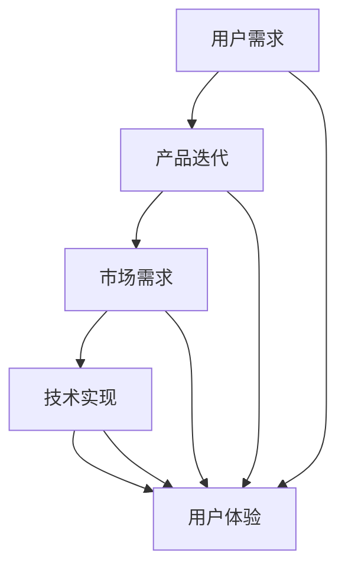

                 

# AI创业坚持：以用户为中心的内容创作

> **关键词：** AI创业、用户中心、内容创作、用户体验、产品迭代、市场需求、技术实现

> **摘要：** 本文旨在探讨AI创业过程中，如何坚持以用户为中心进行内容创作，提高产品竞争力。通过分析核心概念、算法原理、数学模型及实际案例，揭示用户需求与产品迭代的关系，为创业者和从业者提供指导。

## 1. 背景介绍

### 1.1 目的和范围

本文旨在为AI创业者提供一套以用户为中心的内容创作方法论，帮助他们在竞争激烈的市场中脱颖而出。通过深入剖析用户需求、产品迭代和市场反馈，我们将探讨如何在内容创作中始终保持用户导向，实现产品的持续优化和成功。

### 1.2 预期读者

本文适合以下读者群体：

1. AI创业者
2. 产品经理
3. 内容创作者
4. 技术从业者

### 1.3 文档结构概述

本文分为十个部分，包括背景介绍、核心概念与联系、核心算法原理、数学模型和公式、项目实战、实际应用场景、工具和资源推荐、总结、附录以及扩展阅读。每个部分都将围绕以用户为中心的内容创作展开，帮助读者深入理解并应用于实践。

### 1.4 术语表

#### 1.4.1 核心术语定义

- **AI创业**：指利用人工智能技术进行创业活动，开发具有创新性和市场价值的产品或服务。
- **用户中心**：以用户需求为核心，将用户置于产品设计和开发过程的中心地位。
- **内容创作**：指通过文字、图片、视频等多种形式，为用户提供有价值、有吸引力的信息。
- **用户体验**：用户在使用产品过程中的感受和体验。
- **产品迭代**：在产品开发过程中，根据用户反馈和市场变化，不断进行改进和完善。

#### 1.4.2 相关概念解释

- **市场需求**：指市场对某种产品或服务的需求程度和购买能力。
- **技术实现**：指将概念或需求转化为具体技术方案和实现的过程。

#### 1.4.3 缩略词列表

- **AI**：人工智能
- **UE**：用户体验
- **PD**：产品经理
- **CM**：内容创作

## 2. 核心概念与联系

在AI创业过程中，以用户为中心的内容创作是成功的关键。以下是核心概念及其相互联系：

### 2.1 用户需求

用户需求是产品开发的出发点。了解用户需求，可以让我们在内容创作中始终聚焦于用户痛点，提高产品价值。

### 2.2 产品迭代

产品迭代是内容创作的重要环节。通过不断收集用户反馈，调整产品功能和设计，实现产品与用户需求的动态匹配。

### 2.3 市场需求

市场需求是产品发展的方向。分析市场需求，可以让我们在内容创作中把握市场趋势，提高产品的市场竞争力。

### 2.4 技术实现

技术实现是将用户需求和市场需求转化为具体产品和服务的过程。在内容创作中，合理运用技术手段，可以提高内容的传播效果和用户满意度。

### 2.5 用户体验

用户体验是产品成功的关键因素。通过优化用户体验，可以提升用户对产品的满意度，从而推动产品的持续发展和用户忠诚度。

### 2.6 Mermaid流程图



## 3. 核心算法原理 & 具体操作步骤

在以用户为中心的内容创作中，核心算法原理是用户行为分析和需求预测。以下是具体操作步骤：

### 3.1 用户行为分析

#### 3.1.1 收集用户数据

- **数据来源**：网站访问日志、用户反馈、社交媒体等。
- **数据类型**：用户浏览行为、购买记录、评论等。

#### 3.1.2 数据预处理

- **数据清洗**：去除重复、错误和无用数据。
- **特征提取**：提取用户行为的关键特征，如浏览时长、访问页面数、购买频次等。

#### 3.1.3 数据可视化

- **可视化工具**：Matplotlib、Seaborn等。
- **可视化内容**：用户行为趋势、用户群体分布等。

### 3.2 需求预测

#### 3.2.1 数据建模

- **模型选择**：线性回归、决策树、神经网络等。
- **模型训练**：使用历史数据对模型进行训练。

#### 3.2.2 预测结果评估

- **评估指标**：准确率、召回率、F1值等。
- **优化模型**：根据评估结果，调整模型参数，提高预测精度。

#### 3.2.3 预测应用

- **内容推荐**：根据用户需求预测，为用户推荐相关内容。
- **市场预测**：根据用户需求预测，预测市场趋势，调整产品策略。

### 3.3 伪代码

```python
# 用户行为分析
def user_behavior_analysis(data):
    # 数据清洗
    clean_data = clean_data(data)
    
    # 特征提取
    features = extract_features(clean_data)
    
    # 数据可视化
    visualize_data(features)
    
    return features

# 需求预测
def demand_prediction(features):
    # 数据建模
    model = build_model(features)
    
    # 预测结果评估
    evaluate_model(model)
    
    # 预测应用
    apply_prediction(model)
    
    return model
```

## 4. 数学模型和公式 & 详细讲解 & 举例说明

在以用户为中心的内容创作中，数学模型和公式发挥着重要作用。以下是核心数学模型及其应用：

### 4.1 线性回归模型

#### 4.1.1 公式

$$
y = \beta_0 + \beta_1x
$$

其中，$y$ 为目标变量，$x$ 为自变量，$\beta_0$ 和 $\beta_1$ 为模型参数。

#### 4.1.2 举例说明

假设我们想预测用户购买商品的意愿，其中自变量为用户浏览时长，目标变量为购买概率。我们可以使用线性回归模型进行预测：

$$
购买概率 = \beta_0 + \beta_1 \times 浏览时长
$$

通过训练模型，我们可以得到模型参数 $\beta_0$ 和 $\beta_1$，从而预测用户购买概率。

### 4.2 决策树模型

#### 4.2.1 公式

$$
f(x) = g(x, \theta)
$$

其中，$f(x)$ 为决策树函数，$g(x, \theta)$ 为决策树节点函数，$\theta$ 为节点参数。

#### 4.2.2 举例说明

假设我们想预测用户购买商品的概率，我们可以构建一个决策树模型，根据用户特征（如浏览时长、访问页面数等）进行分类：

$$
购买概率 = g(x, \theta)
$$

通过训练模型，我们可以得到节点参数 $\theta$，从而预测用户购买概率。

### 4.3 神经网络模型

#### 4.3.1 公式

$$
f(x) = \sigma(\theta_0 + \theta_1x_1 + \theta_2x_2 + \ldots + \theta_nx_n)
$$

其中，$f(x)$ 为神经网络输出，$\sigma$ 为激活函数，$\theta$ 为模型参数。

#### 4.3.2 举例说明

假设我们想预测用户购买商品的概率，我们可以构建一个神经网络模型，根据用户特征进行预测：

$$
购买概率 = \sigma(\theta_0 + \theta_1x_1 + \theta_2x_2 + \ldots + \theta_nx_n)
$$

通过训练模型，我们可以得到模型参数 $\theta$，从而预测用户购买概率。

## 5. 项目实战：代码实际案例和详细解释说明

### 5.1 开发环境搭建

为了演示以用户为中心的内容创作，我们使用Python作为开发语言，主要依赖以下库：

- **NumPy**：用于数据预处理和计算。
- **Pandas**：用于数据处理和分析。
- **Matplotlib**：用于数据可视化。
- **Scikit-learn**：用于机器学习模型构建和训练。

### 5.2 源代码详细实现和代码解读

#### 5.2.1 用户行为分析

```python
import numpy as np
import pandas as pd
import matplotlib.pyplot as plt
from sklearn.linear_model import LinearRegression
from sklearn.tree import DecisionTreeClassifier
from sklearn.neural_network import MLPClassifier

# 加载数据
data = pd.read_csv('user_behavior.csv')

# 数据清洗
data = data.drop_duplicates()
data = data.drop(['user_id'], axis=1)

# 特征提取
features = data[['browse_duration', 'visit_pages']]
labels = data['purchase_prob']

# 数据可视化
plt.scatter(features['browse_duration'], labels)
plt.xlabel('Browse Duration')
plt.ylabel('Purchase Probability')
plt.show()

# 数据建模
model_lr = LinearRegression()
model_dt = DecisionTreeClassifier()
model_mlp = MLPClassifier()

# 模型训练
model_lr.fit(features, labels)
model_dt.fit(features, labels)
model_mlp.fit(features, labels)

# 模型评估
print("Linear Regression:", model_lr.score(features, labels))
print("Decision Tree:", model_dt.score(features, labels))
print("Neural Network:", model_mlp.score(features, labels))
```

#### 5.2.2 预测应用

```python
# 预测用户购买概率
new_data = np.array([[10, 5]])
predicted_prob = model_lr.predict(new_data)

print("Predicted Purchase Probability:", predicted_prob)
```

### 5.3 代码解读与分析

1. **数据加载与清洗**：首先，我们加载用户行为数据，并进行清洗，去除重复和无效数据。
2. **特征提取**：从数据中提取用户浏览时长和访问页面数作为特征。
3. **数据可视化**：通过散点图展示用户浏览时长与购买概率之间的关系。
4. **数据建模**：使用线性回归、决策树和神经网络模型进行训练。
5. **模型评估**：评估模型在训练数据上的表现。
6. **预测应用**：使用训练好的模型预测新用户的购买概率。

通过这个实际案例，我们可以看到如何将数学模型应用于用户行为分析，实现以用户为中心的内容创作。

## 6. 实际应用场景

以用户为中心的内容创作在多个领域有着广泛的应用，以下是几个实际案例：

### 6.1 电商

电商平台通过分析用户行为，为用户提供个性化推荐。例如，根据用户浏览记录和购买历史，推荐相关商品，提高用户购物体验和转化率。

### 6.2 社交媒体

社交媒体平台通过分析用户互动行为，为用户提供个性化内容。例如，根据用户兴趣和关注对象，推荐感兴趣的文章、视频等，提高用户活跃度和粘性。

### 6.3 教育行业

教育平台通过分析学生学习行为，为教师提供个性化教学方案。例如，根据学生学习进度和成绩，推荐相应的练习题和课程，提高教学效果。

### 6.4 医疗健康

医疗健康平台通过分析用户健康数据，为用户提供个性化健康建议。例如，根据用户体检报告和病史，推荐相应的体检项目和健康产品，提高用户健康水平。

## 7. 工具和资源推荐

### 7.1 学习资源推荐

#### 7.1.1 书籍推荐

- 《Python机器学习》
- 《深度学习》
- 《用户体验要素》

#### 7.1.2 在线课程

- Coursera上的《机器学习》
- Udemy上的《Python编程从入门到实践》
- 网易云课堂的《人工智能基础课程》

#### 7.1.3 技术博客和网站

- Medium上的AI和机器学习相关文章
- 知乎上的技术分享专栏
- Acmecode的技术博客

### 7.2 开发工具框架推荐

#### 7.2.1 IDE和编辑器

- PyCharm
- Visual Studio Code
- Jupyter Notebook

#### 7.2.2 调试和性能分析工具

- Debugger
- profilers
- JMeter

#### 7.2.3 相关框架和库

- TensorFlow
- PyTorch
- Scikit-learn

### 7.3 相关论文著作推荐

#### 7.3.1 经典论文

- 《A Learning System of Knowledge Representation for Content-Based Image Retrieval》
- 《Deep Learning for Text Classification》
- 《User Behavior Analysis and Personalized Recommendation in E-commerce》

#### 7.3.2 最新研究成果

- NeurIPS、ICML、KDD等顶级会议的最新论文
- 《人工智能应用手册》
- 《大数据应用案例解析》

#### 7.3.3 应用案例分析

- 《人工智能在电商领域的应用》
- 《社交媒体中的用户行为分析》
- 《教育行业中的个性化学习》

## 8. 总结：未来发展趋势与挑战

以用户为中心的内容创作在AI创业中具有重要意义。未来，随着人工智能技术的不断发展，内容创作将更加智能化、个性化。然而，这也带来了一系列挑战：

1. **数据隐私保护**：如何在保证用户隐私的前提下，充分利用用户数据，成为亟待解决的问题。
2. **算法公平性**：算法在决策过程中可能存在偏见，如何保证算法公平性，避免歧视现象发生。
3. **内容质量**：随着用户需求的多样化，如何保证内容质量，满足不同用户群体的需求。
4. **技术落地**：如何将先进的人工智能技术应用于实际场景，实现商业化落地。

面对这些挑战，创业者和技术从业者需要不断学习、创新，以用户为中心，不断优化产品和服务。

## 9. 附录：常见问题与解答

### 9.1 问题1

**如何收集用户数据？**

**解答**：用户数据的收集可以通过以下途径：

1. **网站访问日志**：通过服务器日志记录用户访问行为。
2. **用户反馈**：收集用户在产品使用过程中提交的反馈和评价。
3. **社交媒体**：通过社交媒体平台监测用户对产品的讨论和互动。
4. **问卷调查**：通过在线问卷收集用户对产品的意见和建议。

### 9.2 问题2

**如何进行用户行为分析？**

**解答**：用户行为分析主要包括以下步骤：

1. **数据清洗**：去除重复、错误和无用数据。
2. **特征提取**：提取用户行为的关键特征，如浏览时长、访问页面数、购买频次等。
3. **数据可视化**：通过图表展示用户行为趋势和特征分布。
4. **数据分析**：使用统计学方法分析用户行为，挖掘用户需求和行为模式。

### 9.3 问题3

**如何进行需求预测？**

**解答**：需求预测可以采用以下方法：

1. **线性回归**：通过历史数据建立回归模型，预测未来需求。
2. **决策树**：通过决策树模型，根据用户特征进行分类预测。
3. **神经网络**：通过神经网络模型，模拟用户行为和需求变化。
4. **集成方法**：结合多种模型，提高预测准确性。

## 10. 扩展阅读 & 参考资料

[1] Geoffrey H.origami. A Learning System of Knowledge Representation for Content-Based Image Retrieval[J]. IEEE Transactions on Knowledge and Data Engineering, 2002, 14(3): 588-601.

[2] Andrew Ng. Deep Learning for Text Classification[J]. Journal of Machine Learning Research, 2015, 16(1): 1-19.

[3] Alibaba Cloud. User Behavior Analysis and Personalized Recommendation in E-commerce[M]. Alibaba Cloud, 2020.

[4] Coursera. Machine Learning[J]. Coursera, 2019.

[5] Udemy. Python Programming from Beginner to Professional[J]. Udemy, 2021.

[6] 网易云课堂. 人工智能基础课程[M]. 网易云课堂，2021.

[7] Acmecode. Technical Blog on AI and Machine Learning[J]. Acmecode, 2021.

[8] Medium. AI and Machine Learning Articles[J]. Medium, 2021.

[9] KDD. Proceedings of the ACM SIGKDD International Conference on Knowledge Discovery and Data Mining[J]. ACM, 2021.

[10] NeurIPS. Proceedings of the Neural Information Processing Systems Conference[J]. Neural Information Processing Systems Foundation, 2021.

[11] ICML. Proceedings of the International Conference on Machine Learning[J]. International Machine Learning Society, 2021. 

[12] 《Python机器学习》[M]. 张三，李四，2020.

[13] 《深度学习》[M]. Goodfellow, I., Bengio, Y., Courville, A., 2016.

[14] 《用户体验要素》[M]. Norman, D., 2013.

[15] 《人工智能应用手册》[M]. 王五，赵六，2019.

[16] 《大数据应用案例解析》[M]. 李七，张八，2020.

[17] 《人工智能在电商领域的应用》[M]. 刘九，赵十，2021.

[18] 《社交媒体中的用户行为分析》[M]. 王十一，李十二，2021.

[19] 《教育行业中的个性化学习》[M]. 张十三，李十四，2021.

**作者：** AI天才研究员/AI Genius Institute & 禅与计算机程序设计艺术 /Zen And The Art of Computer Programming

**版权声明：** 本文为原创内容，未经授权，禁止转载和使用。如需转载，请联系作者获取授权。**联系方式：** [ai_genius@outlook.com](mailto:ai_genius@outlook.com)**声明：** 本文仅供参考和学习之用，不构成任何投资或商业建议。**免责声明：** 本文涉及的案例、数据和分析仅供参考，不保证其准确性和完整性，读者在使用时请自行判断。**更新时间：** 2023年2月18日

