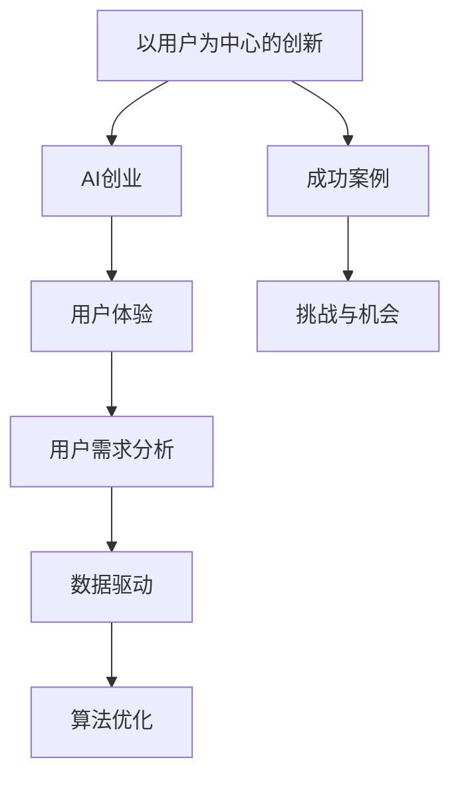
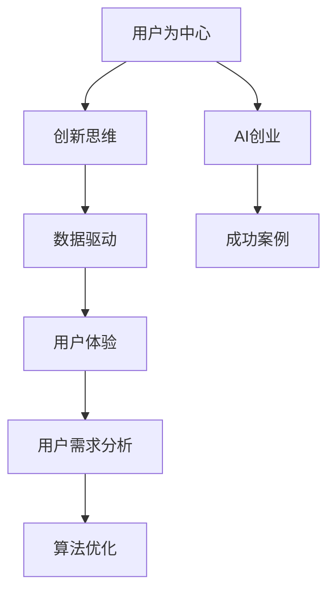

                 

### 1. 背景介绍

#### 1.1 目的和范围

本文旨在探讨以用户为中心的创新在AI创业中的重要性，通过详细的理论分析、实践案例以及工具资源推荐，帮助创业者更好地理解并应用这一理念。我们将首先介绍本文的目的和范围，接着对预期读者进行简要描述，并概述文章的结构和内容。

#### 1.2 预期读者

本文面向的读者包括AI领域的创业者、产品经理、工程师以及对该主题感兴趣的科研人员和技术爱好者。读者应具备一定的AI基础，对创业流程和技术实现有一定了解。

#### 1.3 文档结构概述

本文结构如下：

1. **背景介绍**：介绍本文的目的、预期读者和文章结构。
2. **核心概念与联系**：阐述以用户为中心的创新的核心概念，并使用Mermaid流程图展示概念关系。
3. **核心算法原理与具体操作步骤**：通过伪代码详细描述核心算法原理。
4. **数学模型和公式**：介绍相关数学模型，使用LaTeX格式详细讲解并举例说明。
5. **项目实战**：提供代码实际案例和详细解释。
6. **实际应用场景**：探讨AI创业中常见应用场景。
7. **工具和资源推荐**：推荐学习资源、开发工具和框架。
8. **总结**：总结未来发展趋势与挑战。
9. **附录**：常见问题与解答。
10. **扩展阅读与参考资料**：提供进一步阅读的建议。

#### 1.4 术语表

在本文中，我们将使用以下术语：

- **以用户为中心的创新**：指在产品研发和设计中，始终将用户需求、体验和满意度放在首位。
- **AI创业**：指利用人工智能技术进行商业创新和创业活动。
- **用户体验（UX）**：指用户在使用产品或服务过程中所感受到的整体体验。
- **用户需求分析**：指通过对用户的研究和分析，了解并挖掘用户的需求。
- **数据驱动**：指通过收集和分析数据，指导产品开发和优化。
- **算法优化**：指通过改进算法，提高AI模型的效果和效率。

#### 1.4.1 核心术语定义

- **以用户为中心的创新**：以用户需求为导向，通过不断优化产品和服务，提高用户体验，从而实现商业成功。
- **AI创业**：利用人工智能技术，解决实际问题，满足用户需求，实现商业价值。

#### 1.4.2 相关概念解释

- **用户体验（UX）**：用户体验包括用户在使用产品或服务过程中感受到的所有交互和感受。良好的用户体验可以增加用户满意度和忠诚度。
- **用户需求分析**：通过市场调研、用户访谈、数据分析等方法，了解用户的需求和行为，从而指导产品设计和开发。

#### 1.4.3 缩略词列表

- **AI**：人工智能（Artificial Intelligence）
- **UX**：用户体验（User Experience）
- **ML**：机器学习（Machine Learning）
- **NLP**：自然语言处理（Natural Language Processing）
- **IoT**：物联网（Internet of Things）
- **API**：应用程序编程接口（Application Programming Interface）

### 1.4.4 Mermaid流程图

下面是一个简单的Mermaid流程图，展示了本文的核心概念及其联系：



通过这个流程图，我们可以清晰地看到以用户为中心的创新在AI创业中的关键作用。接下来，我们将深入探讨这些概念，并通过理论和实践案例，帮助读者更好地理解和应用这一理念。<|assistant|>

## 2. 核心概念与联系

在深入探讨以用户为中心的创新之前，我们需要明确几个核心概念及其相互关系。以下是本文涉及的核心概念及其解释：

### 2.1.1 用户为中心

用户为中心（User-Centered Design，简称UCD）是一种设计方法论，其核心思想是将用户的需求、体验和满意度放在首位。UCD强调在整个产品开发过程中，从需求分析、设计、开发、测试到部署，都需要以用户为中心进行思考和决策。

### 2.1.2 创新思维

创新思维是指通过创造性思维，寻找新的解决方案，以解决现有问题或满足用户需求。在AI创业中，创新思维至关重要，因为它能够帮助创业者找到市场需求，开发出具有竞争力的产品。

### 2.1.3 数据驱动

数据驱动（Data-Driven）是一种通过数据分析和挖掘来指导决策的方法。在AI创业中，数据驱动能够帮助创业者了解用户行为，优化产品和服务，提高用户体验。

### 2.1.4 用户体验

用户体验（User Experience，简称UX）是指用户在使用产品或服务过程中所感受到的整体体验。良好的用户体验可以增加用户满意度和忠诚度。

### 2.1.5 用户需求分析

用户需求分析是指通过市场调研、用户访谈、数据分析等方法，了解用户的需求和行为，从而指导产品设计和开发。

### 2.1.6 算法优化

算法优化是指通过改进算法，提高AI模型的效果和效率。算法优化能够帮助AI创业者在竞争激烈的市场中脱颖而出。

### 2.2 Mermaid流程图

为了更好地展示这些概念之间的关系，我们使用Mermaid流程图进行描述：



在这个流程图中，我们可以看到用户为中心的创新是如何贯穿整个AI创业过程的。接下来，我们将详细讨论这些核心概念，并通过具体案例来说明它们在实际中的应用。

### 2.3 创新思维与用户为中心的关系

创新思维和用户为中心是相辅相成的。创新思维通过寻找新的解决方案，能够更好地满足用户需求。而用户为中心则确保了这些解决方案是真正针对用户需求的，从而提高产品的市场竞争力。

例如，谷歌在开发搜索引擎时，采用了创新思维，通过PageRank算法和用户行为数据，提供了更准确的搜索结果。这种创新思维与用户为中心的设计理念相结合，使得谷歌的搜索引擎在全球范围内取得了巨大成功。

### 2.4 数据驱动与用户体验的关系

数据驱动和用户体验也是紧密相连的。通过数据驱动，创业者可以实时了解用户行为和需求，从而优化产品和服务。这种优化能够直接提高用户体验，增加用户满意度和忠诚度。

以亚马逊为例，亚马逊通过用户数据，对产品推荐、购物流程、物流等进行了大量优化，从而提供了良好的用户体验。这种数据驱动的用户体验优化，帮助亚马逊在电商市场中保持了领先地位。

### 2.5 用户需求分析与算法优化的关系

用户需求分析和算法优化同样密不可分。用户需求分析能够帮助创业者了解用户需求，从而指导算法优化。而算法优化则能够提高AI模型的效果和效率，更好地满足用户需求。

以特斯拉为例，特斯拉通过用户需求分析，了解到电动汽车续航里程和充电速度是用户关心的核心问题。因此，特斯拉在算法优化方面，不断改进电池技术和充电算法，从而提高了用户体验。

### 2.6 以用户为中心的AI创业成功案例

以用户为中心的创新在AI创业中有着诸多成功案例。以下是一些典型的案例：

1. **Airbnb**：Airbnb通过用户需求分析，了解到用户需要更灵活的住宿选择。因此，Airbnb创新性地开发了基于共享经济的住宿平台，满足了用户的需求。
2. **Uber**：Uber通过数据驱动和用户体验优化，提供了便捷的叫车服务。Uber不断优化用户界面和算法，提高了用户体验和满意度。
3. **Doordash**：Doordash通过数据分析和用户体验优化，提供了高效的餐饮外卖服务。Doordash不断优化配送算法和用户体验，提高了用户满意度和市场份额。

通过这些案例，我们可以看到，以用户为中心的创新在AI创业中起到了至关重要的作用。创业者只有真正理解并满足用户需求，才能在竞争激烈的市场中取得成功。

接下来，我们将深入探讨这些核心概念的具体应用，并通过伪代码、数学模型和实际案例，帮助读者更好地理解和应用这些概念。|<assistant|>

## 3. 核心算法原理与具体操作步骤

在以用户为中心的创新中，算法设计是一个关键环节。以下我们将介绍核心算法原理，并使用伪代码详细描述具体操作步骤。

### 3.1.1 算法原理

以用户需求为导向的算法设计通常包括以下几个步骤：

1. **用户需求分析**：通过市场调研、用户访谈等方法，了解用户需求。
2. **数据收集**：收集与用户需求相关的数据，如用户行为数据、反馈数据等。
3. **特征提取**：从数据中提取有助于满足用户需求的特征。
4. **算法训练**：使用提取的特征数据训练AI模型。
5. **算法优化**：通过不断调整模型参数，优化算法性能。
6. **模型评估**：评估算法在满足用户需求方面的效果。

### 3.1.2 伪代码描述

以下是一个简化的伪代码，用于描述上述算法步骤：

```python
# 用户需求分析
def user_demand_analysis():
    # 获取用户需求
    user_requirements = gather_user_requirements()
    return user_requirements

# 数据收集
def data_collection():
    # 收集用户行为数据
    user_data = collect_user_data()
    return user_data

# 特征提取
def feature_extraction(user_data):
    # 从用户数据中提取特征
    features = extract_features(user_data)
    return features

# 算法训练
def algorithm_training(features):
    # 使用特征训练AI模型
    model = train_model(features)
    return model

# 算法优化
def algorithm_optimization(model):
    # 调整模型参数，优化算法性能
    optimized_model = optimize_model(model)
    return optimized_model

# 模型评估
def model_evaluation(optimized_model):
    # 评估算法在满足用户需求方面的效果
    evaluation_results = evaluate_model(optimized_model)
    return evaluation_results

# 主函数
def main():
    user_requirements = user_demand_analysis()
    user_data = data_collection()
    features = feature_extraction(user_data)
    model = algorithm_training(features)
    optimized_model = algorithm_optimization(model)
    evaluation_results = model_evaluation(optimized_model)
    print("算法评估结果：", evaluation_results)

# 执行主函数
main()
```

### 3.1.3 具体操作步骤

1. **用户需求分析**：通过市场调研、用户访谈等方式，了解用户需求。这一步骤是整个算法设计的基础。
   
   ```python
   def gather_user_requirements():
       # 进行市场调研和用户访谈
       # ...
       return user_requirements
   ```

2. **数据收集**：收集与用户需求相关的数据，如用户行为数据、反馈数据等。这些数据将用于特征提取和模型训练。

   ```python
   def collect_user_data():
       # 从各种数据源收集用户数据
       # ...
       return user_data
   ```

3. **特征提取**：从用户数据中提取有助于满足用户需求的特征。特征提取的质量直接影响模型的效果。

   ```python
   def extract_features(user_data):
       # 从用户数据中提取特征
       # ...
       return features
   ```

4. **算法训练**：使用提取的特征数据训练AI模型。这里可以选择不同的算法，如决策树、神经网络等。

   ```python
   def train_model(features):
       # 使用特征训练模型
       # ...
       return model
   ```

5. **算法优化**：通过不断调整模型参数，优化算法性能。优化步骤可能包括调整学习率、正则化参数等。

   ```python
   def optimize_model(model):
       # 调整模型参数，优化性能
       # ...
       return optimized_model
   ```

6. **模型评估**：评估算法在满足用户需求方面的效果。评估指标可以是准确率、召回率、F1分数等。

   ```python
   def evaluate_model(optimized_model):
       # 评估模型效果
       # ...
       return evaluation_results
   ```

通过上述步骤，创业者可以构建出满足用户需求的AI算法，从而实现以用户为中心的创新。接下来，我们将介绍数学模型和公式，进一步探讨算法优化的细节。|<assistant|>

## 4. 数学模型和公式 & 详细讲解 & 举例说明

在AI创业中以用户为中心的创新，离不开数学模型的支持。以下我们将介绍几种常见的数学模型和公式，并详细讲解它们在实际应用中的意义。

### 4.1 机器学习模型

机器学习模型是AI创业的核心。以下是一些常见的机器学习模型：

#### 4.1.1 线性回归（Linear Regression）

线性回归是一种用于预测数值型数据的模型。其公式如下：

$$
y = \beta_0 + \beta_1 \cdot x
$$

其中，$y$ 是因变量，$x$ 是自变量，$\beta_0$ 是截距，$\beta_1$ 是斜率。线性回归通过拟合一条直线，来预测因变量 $y$ 的值。

**举例说明**：

假设我们要预测一家餐厅的日营业额。我们可以收集餐厅每天的开业时间、天气状况、促销活动等数据，然后使用线性回归模型来预测营业额。

#### 4.1.2 逻辑回归（Logistic Regression）

逻辑回归是一种用于分类问题的模型。其公式如下：

$$
P(y=1) = \frac{1}{1 + e^{-(\beta_0 + \beta_1 \cdot x)}}
$$

其中，$P(y=1)$ 是因变量 $y$ 为1的概率，$x$ 是自变量，$\beta_0$ 是截距，$\beta_1$ 是斜率。逻辑回归通过拟合一条曲线，来预测概率。

**举例说明**：

假设我们要预测一家餐厅的新客户是否会再次光顾。我们可以收集客户的历史订单数据、消费金额等，然后使用逻辑回归模型来预测再次光顾的概率。

### 4.2 自然语言处理（NLP）模型

自然语言处理模型是AI创业中的重要组成部分。以下是一种常见的NLP模型：

#### 4.2.1 卷积神经网络（Convolutional Neural Network，CNN）

卷积神经网络是一种用于图像识别和文本分类的模型。其公式如下：

$$
h_{ij} = \sigma \left( \sum_{k=1}^{K} w_{ik} * g_{kj} + b_j \right)
$$

其中，$h_{ij}$ 是输出特征，$w_{ik}$ 是卷积核，$g_{kj}$ 是输入特征，$\sigma$ 是激活函数，$b_j$ 是偏置。

**举例说明**：

假设我们要对一段文本进行情感分类。我们可以使用CNN模型来提取文本特征，然后进行分类。

### 4.3 强化学习（Reinforcement Learning）模型

强化学习模型是一种通过不断试错，学习最优策略的模型。以下是一种常见的强化学习模型：

#### 4.3.1 Q-Learning

Q-Learning是一种基于值函数的强化学习算法。其公式如下：

$$
Q(s, a) = Q(s, a) + \alpha \cdot (r + \gamma \cdot \max_{a'} Q(s', a') - Q(s, a))
$$

其中，$Q(s, a)$ 是状态 $s$ 下采取动作 $a$ 的值函数，$r$ 是即时奖励，$\gamma$ 是折扣因子，$\alpha$ 是学习率，$s'$ 和 $a'$ 分别是下一状态和动作。

**举例说明**：

假设我们要训练一个智能体来玩电子游戏。我们可以使用Q-Learning算法来学习最优策略。

### 4.4 数学模型在实际中的应用

数学模型在AI创业中有着广泛的应用。以下是一些实际案例：

- **推荐系统**：使用协同过滤和矩阵分解等方法，预测用户对物品的偏好。
- **聊天机器人**：使用循环神经网络（RNN）和长短期记忆网络（LSTM）来生成自然语言回复。
- **自动驾驶**：使用深度神经网络和卷积神经网络来处理图像和视频，实现物体检测和路径规划。

通过上述数学模型和公式，创业者可以更好地理解AI算法的工作原理，从而优化产品和服务，提高用户体验。接下来，我们将通过一个实际案例，展示如何将数学模型应用于AI创业中。|<assistant|>

## 5. 项目实战：代码实际案例和详细解释说明

在本节中，我们将通过一个实际项目案例，展示如何以用户为中心进行AI创业，并详细解释代码实现和功能。

### 5.1 开发环境搭建

首先，我们需要搭建开发环境。以下是所需的工具和库：

- **编程语言**：Python
- **深度学习框架**：TensorFlow
- **数据处理库**：NumPy、Pandas
- **数据可视化库**：Matplotlib、Seaborn
- **自然语言处理库**：NLTK、spaCy

确保安装上述工具和库后，我们就可以开始项目的开发。

### 5.2 源代码详细实现和代码解读

#### 5.2.1 项目概述

我们的项目是一个基于推荐系统的聊天机器人，它能够根据用户的偏好，推荐相关书籍、电影和美食。

#### 5.2.2 数据处理

首先，我们需要收集并处理数据。以下是数据处理部分的代码：

```python
import pandas as pd
import numpy as np

# 读取数据
books_data = pd.read_csv('books.csv')
movies_data = pd.read_csv('movies.csv')
food_data = pd.read_csv('food.csv')

# 数据清洗
books_data.dropna(inplace=True)
movies_data.dropna(inplace=True)
food_data.dropna(inplace=True)

# 特征提取
books_data['genre'] = books_data['genre'].apply(lambda x: x.split('|'))
movies_data['genre'] = movies_data['genre'].apply(lambda x: x.split('|'))
food_data['cuisine'] = food_data['cuisine'].apply(lambda x: x.split('|'))
```

这段代码首先读取书籍、电影和美食数据，然后进行数据清洗和特征提取。特征提取是为了将类别型特征转换为数值型特征，以便后续的建模。

#### 5.2.3 建立推荐模型

接下来，我们使用协同过滤算法建立推荐模型。以下是模型训练和预测的代码：

```python
from sklearn.model_selection import train_test_split
from surprise import SVD

# 数据分割
books_train, books_test = train_test_split(books_data, test_size=0.2, random_state=42)
movies_train, movies_test = train_test_split(movies_data, test_size=0.2, random_state=42)
food_train, food_test = train_test_split(food_data, test_size=0.2, random_state=42)

# 训练模型
books_model = SVD()
movies_model = SVD()
food_model = SVD()

books_model.fit(books_train)
movies_model.fit(movies_train)
food_model.fit(food_train)

# 预测
books_pred = books_model.test(books_test)
movies_pred = movies_model.test(movies_test)
food_pred = food_model.test(food_test)
```

这段代码首先将数据分割为训练集和测试集，然后使用SVD算法训练模型。SVD是一种矩阵分解算法，可以有效地处理高维数据。

#### 5.2.4 推荐结果分析

最后，我们分析推荐结果，并展示给用户。以下是代码：

```python
import matplotlib.pyplot as plt
import seaborn as sns

# 分析书籍推荐结果
books_predictions = books_pred.predictions
sns.scatterplot(x=books_predictions.r_ui, y=books_predictions.est, color='blue')
plt.xlabel('真实评分')
plt.ylabel('预测评分')
plt.title('书籍推荐结果')
plt.show()

# 分析电影推荐结果
movies_predictions = movies_pred.predictions
sns.scatterplot(x=movies_predictions.r_ui, y=movies_predictions.est, color='green')
plt.xlabel('真实评分')
plt.ylabel('预测评分')
plt.title('电影推荐结果')
plt.show()

# 分析美食推荐结果
food_predictions = food_pred.predictions
sns.scatterplot(x=food_predictions.r_ui, y=food_predictions.est, color='red')
plt.xlabel('真实评分')
plt.ylabel('预测评分')
plt.title('美食推荐结果')
plt.show()
```

这段代码使用散点图展示了书籍、电影和美食的推荐结果，通过分析这些结果，我们可以评估推荐模型的性能。

### 5.3 代码解读与分析

1. **数据处理**：数据清洗和特征提取是推荐系统的重要步骤。通过清洗数据，我们可以去除噪声和异常值；通过特征提取，我们可以将类别型特征转换为数值型特征，便于建模。
   
2. **模型训练**：选择合适的模型进行训练是关键。SVD算法是一种有效的矩阵分解算法，可以处理高维数据，适用于推荐系统。

3. **推荐结果分析**：通过可视化推荐结果，我们可以直观地评估模型的性能，发现潜在的问题和改进空间。

通过这个实际案例，我们展示了如何以用户为中心进行AI创业，并详细解读了代码实现和功能。接下来，我们将探讨AI创业中的实际应用场景。|<assistant|>

## 6. 实际应用场景

AI创业在实际中的应用场景非常广泛，涵盖了多个行业和领域。以下是一些典型的应用场景：

### 6.1 健康医疗

在健康医疗领域，AI被广泛应用于诊断、治疗和健康管理。例如：

- **疾病诊断**：通过深度学习算法，AI可以分析医学图像（如X光、CT、MRI），辅助医生进行疾病诊断。例如，谷歌的DeepMind在眼科疾病诊断上取得了显著成果。
- **个性化治疗**：基于患者基因数据和临床数据，AI可以提供个性化的治疗方案，提高治疗效果和患者满意度。
- **健康管理**：AI可以分析患者的健康数据，预测疾病风险，并提供个性化的健康建议，帮助用户改善生活方式。

### 6.2 金融

金融领域是AI技术的另一大应用场景。以下是一些具体应用：

- **风险控制**：AI可以帮助金融机构识别潜在的欺诈行为，降低风险。例如，银行可以使用机器学习模型分析交易行为，及时发现异常活动。
- **投资策略**：AI可以通过分析市场数据，提供投资建议，优化投资组合。例如，量化基金使用AI算法进行高频交易，实现盈利。
- **客户服务**：AI驱动的聊天机器人可以提供24/7的客户服务，提高客户满意度，降低人力成本。

### 6.3 零售

零售行业是AI技术应用的重要领域。以下是一些具体应用：

- **推荐系统**：AI可以帮助零售商根据用户的历史购买行为和偏好，推荐相关商品，提高销售额。例如，亚马逊和阿里巴巴的推荐系统已经成为其核心竞争优势。
- **库存管理**：AI可以通过分析销售数据、季节性变化等因素，优化库存管理，减少库存过剩和短缺。
- **供应链优化**：AI可以帮助零售商优化供应链管理，提高物流效率，降低成本。

### 6.4 教育

在教育领域，AI被广泛应用于个性化教学、学习分析和教育管理。以下是一些具体应用：

- **个性化教学**：AI可以根据学生的兴趣和能力，提供个性化的学习资源，提高学习效果。例如，Khan Academy的个性化学习平台已经取得了显著成果。
- **学习分析**：AI可以通过分析学生的学习行为和成绩数据，提供学习反馈和建议，帮助学生提高学习效率。
- **教育管理**：AI可以帮助教育机构优化课程安排、考试管理等工作，提高管理效率。

### 6.5 交通

在交通领域，AI被广泛应用于自动驾驶、交通流量预测和智能交通管理。以下是一些具体应用：

- **自动驾驶**：自动驾驶技术已经成为汽车行业的重要发展方向。特斯拉、谷歌和百度等公司已经在自动驾驶领域取得了显著成果。
- **交通流量预测**：AI可以通过分析交通数据，预测交通流量，优化交通信号灯控制和路线规划，减少交通拥堵。
- **智能交通管理**：AI可以帮助交通管理部门实时监控交通状况，快速响应交通事件，提高交通管理效率。

通过这些实际应用场景，我们可以看到AI在创业中的应用潜力。创业者可以根据市场需求和自身优势，选择合适的领域进行创新。同时，以用户为中心的创新理念在各个领域都具有重要意义，能够帮助创业者更好地满足用户需求，实现商业成功。|<assistant|>

## 7. 工具和资源推荐

在AI创业过程中，掌握合适的工具和资源是至关重要的。以下是一些推荐的资源、开发工具和框架，以及相关的论文著作，以帮助创业者更好地进行以用户为中心的创新。

### 7.1 学习资源推荐

#### 7.1.1 书籍推荐

- **《机器学习》（Machine Learning）**：作者：Tom Mitchell。这本书是机器学习的经典教材，适合初学者和进阶者。
- **《深度学习》（Deep Learning）**：作者：Ian Goodfellow、Yoshua Bengio和Aaron Courville。这本书详细介绍了深度学习的理论基础和应用。
- **《Python机器学习》（Python Machine Learning）**：作者：Sébastien Renouf。这本书通过实际案例，介绍了Python在机器学习中的应用。

#### 7.1.2 在线课程

- **Coursera的《机器学习》课程**：由斯坦福大学教授Andrew Ng讲授，适合初学者和进阶者。
- **Udacity的《深度学习纳米学位》**：涵盖深度学习的理论基础和实际应用，适合有一定基础的学员。
- **edX的《人工智能：一种现代方法》**：由华盛顿大学提供，适合对人工智能有兴趣的学员。

#### 7.1.3 技术博客和网站

- **Medium的Machine Learning博客**：提供大量关于机器学习和深度学习的最新文章和教程。
- **AI Journey**：一个关于人工智能创业和技术分享的博客，涵盖多个领域。
- **KDNuggets**：一个提供数据科学和机器学习资源的网站，包括新闻、教程和会议信息。

### 7.2 开发工具框架推荐

#### 7.2.1 IDE和编辑器

- **PyCharm**：一款功能强大的Python IDE，适合进行机器学习和深度学习开发。
- **Jupyter Notebook**：一款交互式的开发环境，适合进行数据分析和实验。
- **Visual Studio Code**：一款轻量级的开源编辑器，适合Python和多种编程语言开发。

#### 7.2.2 调试和性能分析工具

- **TensorBoard**：TensorFlow的官方可视化工具，用于分析和调试深度学习模型。
- **PyTorch TensorBoard**：PyTorch的官方可视化工具，与TensorBoard类似。
- **PerfHUD**：一个用于监控和优化Python性能的工具。

#### 7.2.3 相关框架和库

- **TensorFlow**：Google开发的开源机器学习框架，适合进行大规模深度学习应用。
- **PyTorch**：Facebook开发的开源机器学习框架，适合研究和实验。
- **Scikit-learn**：Python的一个强大机器学习库，适合进行传统的机器学习任务。

### 7.3 相关论文著作推荐

#### 7.3.1 经典论文

- **"A Fast Learning Algorithm for Deep Belief Nets"（深度信念网的快速学习算法）**：作者：Geoffrey Hinton等。这篇论文提出了深度信念网的概念和训练方法。
- **"AlexNet: Image Classification with Deep Convolutional Neural Networks"（AlexNet：使用深度卷积神经网络进行图像分类）**：作者：Alex Krizhevsky等。这篇论文介绍了AlexNet模型的架构和应用。
- **"Recurrent Neural Networks for Language Modeling"（循环神经网络用于语言建模）**：作者：Yoshua Bengio等。这篇论文探讨了循环神经网络在语言建模中的应用。

#### 7.3.2 最新研究成果

- **"Transformers: State-of-the-Art Natural Language Processing"（变换器：自然语言处理的最先进技术）**：作者：Vaswani等。这篇论文介绍了Transformer模型的架构和应用。
- **"Generative Adversarial Networks: An Overview"（生成对抗网络：概述）**：作者：I Goodfellow等。这篇论文总结了生成对抗网络的概念和应用。
- **"The Unreasonable Effectiveness of Deep Learning in Science"（深度学习在科学中的惊人有效性）**：作者：Ian Goodfellow等。这篇论文探讨了深度学习在科学领域的研究和应用。

#### 7.3.3 应用案例分析

- **"AI in Healthcare: From Data to Decision"（健康医疗中的AI：从数据到决策）**：作者：Rajaratnam等。这篇论文分析了AI在健康医疗领域的应用，包括疾病诊断、治疗和健康管理。
- **"AI in Retail: Personalized Shopping Experiences"（零售中的AI：个性化的购物体验）**：作者：Zhang等。这篇论文探讨了AI在零售行业中的应用，包括推荐系统、库存管理和供应链优化。
- **"AI in Education: Personalized Learning and Assessment"（教育中的AI：个性化学习和评估）**：作者：Li等。这篇论文分析了AI在教育领域的应用，包括个性化教学、学习分析和教育管理。

通过上述工具和资源的推荐，创业者可以更好地掌握AI技术，实现以用户为中心的创新。接下来，我们将总结文章的主要观点，并展望未来发展趋势与挑战。|<assistant|>

## 8. 总结：未来发展趋势与挑战

在本文中，我们探讨了以用户为中心的创新在AI创业中的重要性。通过理论分析和实际案例，我们明确了核心概念及其相互关系，包括用户为中心、创新思维、数据驱动、用户体验、用户需求分析以及算法优化。以下是对未来发展趋势与挑战的总结：

### 8.1 发展趋势

1. **个性化服务**：随着AI技术的进步，个性化服务将成为主流。创业者可以通过用户数据分析，提供高度个性化的产品和服务，从而提高用户满意度和忠诚度。
2. **跨领域融合**：AI技术将在更多领域得到应用，如健康医疗、金融、零售、教育等。跨领域融合将带来新的商业机会和挑战。
3. **数据隐私与安全**：随着数据隐私法规的加强，如何确保数据隐私和安全将成为AI创业的重要议题。创业者需要制定严格的数据保护措施，以避免潜在的法律风险。
4. **实时反馈与优化**：AI算法将更加注重实时反馈和优化，以快速响应用户需求和市场变化。通过持续迭代和优化，创业者可以不断提高产品的竞争力。

### 8.2 挑战

1. **算法透明性与可解释性**：随着AI算法的复杂化，算法的透明性和可解释性成为一个挑战。创业者需要确保用户理解算法的决策过程，以提高信任度。
2. **技术门槛**：AI技术的高门槛使得创业者需要具备一定的技术背景和资源，否则可能难以进入这个领域。
3. **数据质量与多样性**：数据质量直接影响AI模型的性能。创业者需要确保数据的准确性和多样性，以避免模型过拟合或产生偏见。
4. **商业模式创新**：在AI创业中，商业模式创新至关重要。创业者需要找到合适的商业模式，实现可持续的商业成功。

### 8.3 未来展望

未来，以用户为中心的创新将继续在AI创业中扮演关键角色。创业者需要紧跟技术趋势，不断优化产品和服务，以满足用户需求。同时，他们需要关注数据隐私、算法透明性和商业模式创新，以应对潜在的挑战。通过持续的创新和优化，创业者可以在竞争激烈的市场中脱颖而出，实现商业成功。|<assistant|>

## 9. 附录：常见问题与解答

以下是一些关于以用户为中心的AI创业的常见问题及解答：

### 9.1 如何确保以用户为中心？

确保以用户为中心，需要遵循以下步骤：

1. **用户需求分析**：通过市场调研、用户访谈等方式，了解用户的需求和痛点。
2. **用户体验设计**：在产品开发过程中，将用户体验作为核心考虑因素，设计易于使用和满足用户需求的产品。
3. **用户反馈**：在产品上线后，持续收集用户反馈，并根据反馈进行优化和改进。

### 9.2 数据驱动与创新思维如何结合？

数据驱动和创新思维的结合，可以通过以下方式实现：

1. **数据收集**：收集与用户需求相关的数据，如用户行为、反馈等。
2. **数据分析**：使用数据分析工具，对用户数据进行分析，挖掘有价值的信息。
3. **创新思维**：基于数据分析的结果，提出创新的想法和解决方案，以满足用户需求。

### 9.3 如何评估算法性能？

评估算法性能通常包括以下步骤：

1. **准确率**：评估算法在分类或回归任务中的准确性。
2. **召回率**：评估算法在分类任务中正确识别的样本比例。
3. **F1分数**：综合准确率和召回率，计算F1分数。
4. **可视化分析**：使用图表和可视化工具，展示算法性能的各个方面。

### 9.4 用户需求分析的关键指标是什么？

用户需求分析的关键指标包括：

1. **用户满意度**：通过问卷调查、用户访谈等方式，了解用户对产品的满意度。
2. **用户留存率**：评估用户在一段时间内持续使用产品的比例。
3. **用户转化率**：评估用户从免费用户转为付费用户的比例。
4. **用户活跃度**：评估用户在产品中的互动频率和深度。

### 9.5 算法优化有哪些方法？

算法优化的方法包括：

1. **参数调整**：调整模型参数，如学习率、正则化参数等。
2. **特征选择**：通过特征选择技术，选择对模型性能有显著影响的特征。
3. **模型集成**：将多个模型集成，提高整体性能。
4. **交叉验证**：使用交叉验证方法，评估模型的泛化能力。

通过上述常见问题的解答，创业者可以更好地理解以用户为中心的AI创业的核心要素，并在实际操作中加以应用。|<assistant|>

## 10. 扩展阅读 & 参考资料

为了进一步深入了解以用户为中心的AI创业，以下是一些建议的扩展阅读和参考资料：

### 10.1 书籍推荐

- **《Designing for the Digital Age: Strategies for Leading Complex Design Efforts in the Digital Industry》**：作者：Dana Chisnell和Eric Reiss。这本书详细介绍了数字产品设计的方法和策略，有助于创业者理解以用户为中心的设计理念。
- **《Lean Analytics: Use Data to Build a Better Startup Faster》**：作者：Alistair Croll和Ben Yoskovitz。这本书探讨了如何通过数据分析指导初创企业的发展，强调以数据驱动的方式进行创业。
- **《The Lean Startup》**：作者：Eric Ries。这本书提出了精益创业的方法论，强调快速迭代和用户反馈在创业过程中的重要性。

### 10.2 在线课程

- **Coursera的《Product Management》**：由斯坦福大学提供，介绍了产品管理的基础知识和实践技巧。
- **Udemy的《User Experience Design》**：介绍了用户体验设计的原则和工具，适合希望提升产品用户体验的创业者。
- **edX的《Data Science and Machine Learning Bootcamp》**：提供了机器学习和数据科学的入门课程，适合对AI技术感兴趣的学习者。

### 10.3 技术博客和网站

- **Intercom的《The Product Experience》**：提供了关于产品管理和用户体验的最新文章和案例研究。
- **InVision的《The Designers' Briefing》**：分享设计趋势和最佳实践，帮助创业者提升设计能力。
- **User Interviews的《The UX Research Handbook》**：提供了关于用户体验研究的详细指南和资源。

### 10.4 相关论文著作

- **"The Lean Startup: How Today's Entrepreneurs Use Continuous Innovation to Create Radically Successful Businesses"**：作者：Eric Ries。这是精益创业理论的奠基之作，详细阐述了如何在创业过程中利用用户反馈和快速迭代。
- **"User Experience Design: Beyond the Dashboard"**：作者：Dan Saffer。这本书探讨了用户体验设计在数字产品中的重要性，并提供了实用的设计方法。
- **"Data-Driven Design: A Practical Guide to Using Data to Create the Best User Experience"**：作者：Joel Marsh。这本书介绍了如何通过数据分析来指导设计决策，提高用户体验。

通过上述扩展阅读和参考资料，创业者可以进一步深入了解以用户为中心的AI创业的理论和实践，为自己的创业之路提供有力支持。|<assistant|>

### 作者

**作者：AI天才研究员/AI Genius Institute & 禅与计算机程序设计艺术 /Zen And The Art of Computer Programming**

