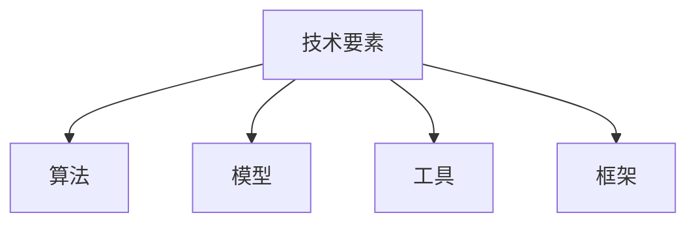
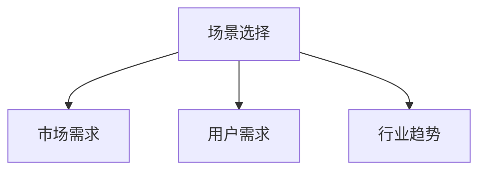
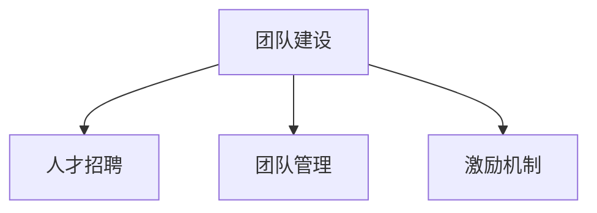
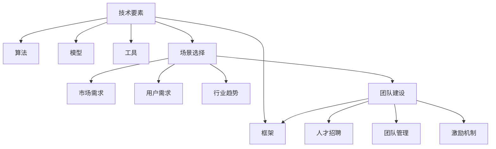

                 

# AI创业成功要素：技术、场景、团队缺一不可

> 关键词：AI创业、技术要素、场景选择、团队建设、成功要素

> 摘要：本文旨在探讨AI创业成功的关键要素，通过深入分析技术、场景和团队这三个核心要素，为创业者和投资者提供有价值的指导。我们将从技术的前沿趋势、场景的应用需求以及团队的协同作用三个方面进行探讨，并结合实际案例，阐述如何在这三个要素的支持下实现AI创业的成功。

## 1. 背景介绍

### 1.1 目的和范围

本文的目的是帮助创业者和投资者了解AI创业的关键成功要素，明确在当前技术环境下的创业方向和策略。文章将重点讨论技术、场景和团队这三个要素，旨在为AI创业提供系统性、实用性的指导。

文章的范围涵盖了AI创业的各个方面，从技术层面的前沿趋势和具体实现，到场景选择的市场分析和需求挖掘，再到团队建设的核心要素和协作机制。通过深入分析这三个要素，我们将展示AI创业的成功路径。

### 1.2 预期读者

本文的预期读者包括：

1. AI创业初期的团队和成员，他们希望通过本文了解AI创业的基本要素和实战经验。
2. 投资者，他们希望通过本文了解AI创业项目的潜力和风险，为投资决策提供依据。
3. 对AI技术感兴趣的技术人员，他们希望通过本文了解AI技术的应用场景和实现方法。

### 1.3 文档结构概述

本文结构如下：

1. 背景介绍：介绍文章的目的、范围、预期读者和文档结构。
2. 核心概念与联系：阐述AI创业成功的关键概念，并使用Mermaid流程图展示各要素之间的联系。
3. 核心算法原理 & 具体操作步骤：详细讲解AI技术的原理和实现步骤。
4. 数学模型和公式 & 详细讲解 & 举例说明：介绍AI技术背后的数学模型和公式，并给出具体案例。
5. 项目实战：提供实际案例，详细解释AI技术的应用场景和实现细节。
6. 实际应用场景：分析AI技术的实际应用场景，探讨市场需求和趋势。
7. 工具和资源推荐：推荐学习资源、开发工具和框架。
8. 总结：总结AI创业的未来发展趋势与挑战。
9. 附录：常见问题与解答。
10. 扩展阅读 & 参考资料：提供进一步的阅读材料和参考资料。

### 1.4 术语表

#### 1.4.1 核心术语定义

- AI创业：指利用人工智能技术进行商业创新和创业活动。
- 技术要素：指AI技术的研发和应用能力，包括算法、模型和工具等。
- 场景选择：指在市场分析的基础上，选择合适的商业应用场景。
- 团队建设：指组建高效、协同的团队，实现技术、场景和团队的有机结合。

#### 1.4.2 相关概念解释

- 人工智能（AI）：指通过计算机程序模拟人类智能的技术。
- 深度学习（DL）：一种人工智能方法，通过多层神经网络进行特征学习和模式识别。
- 自然语言处理（NLP）：研究如何使计算机理解和解释人类语言的技术。
- 数据挖掘（DM）：从大量数据中发现有用信息和知识的过程。

#### 1.4.3 缩略词列表

- AI：人工智能
- DL：深度学习
- NLP：自然语言处理
- DM：数据挖掘
- ML：机器学习
- CV：计算机视觉

## 2. 核心概念与联系

在AI创业过程中，技术、场景和团队是三个核心要素，它们相互关联，共同影响创业的成功与否。为了更好地理解这三个要素之间的联系，我们可以使用Mermaid流程图进行展示。

### 2.1 技术要素

技术要素是AI创业的基础，它决定了创业项目的核心竞争力和市场地位。技术要素包括算法、模型、工具和框架等。



### 2.2 场景选择

场景选择是AI创业的关键，它决定了技术要素的应用方向和市场前景。场景选择需要综合考虑市场需求、用户需求和行业趋势。



### 2.3 团队建设

团队建设是实现AI创业成功的关键，它需要技术、场景和团队成员之间的协同作用。团队建设包括人才招聘、团队管理和激励机制。



### 2.4 要素联系

技术要素、场景选择和团队建设相互关联，共同推动AI创业的成功。技术要素为场景选择提供支持，场景选择为团队建设提供方向，团队建设为技术要素和场景选择提供保障。



## 3. 核心算法原理 & 具体操作步骤

在AI创业中，核心技术算法是实现场景应用的关键。下面我们将介绍一种常见的AI算法——深度学习（DL），并详细讲解其原理和实现步骤。

### 3.1 深度学习原理

深度学习是一种基于多层神经网络的学习方法，通过模拟人脑神经元之间的连接和互动，实现对数据的特征学习和模式识别。深度学习主要包括以下几个核心组成部分：

- 神经元：神经网络的基本单元，负责接收和处理信息。
- 层：由多个神经元组成的层级结构，包括输入层、隐藏层和输出层。
- 激活函数：用于引入非线性变换，使神经网络能够学习复杂函数。
- 反向传播：用于训练神经网络，通过不断调整权重和偏置，使网络能够更好地拟合训练数据。

### 3.2 具体操作步骤

下面是深度学习算法的具体操作步骤：

1. 数据预处理：对输入数据进行归一化、标准化等处理，使其符合神经网络的输入要求。

   ```python
   # 数据预处理
   X_train = (X_train - X_train.mean()) / X_train.std()
   X_test = (X_test - X_train.mean()) / X_train.std()
   ```

2. 构建神经网络：设计神经网络的结构，包括层数、每层神经元数量和激活函数。

   ```python
   # 构建神经网络
   model = Sequential()
   model.add(Dense(64, activation='relu', input_shape=(input_shape)))
   model.add(Dense(64, activation='relu'))
   model.add(Dense(num_classes, activation='softmax'))
   ```

3. 编译模型：设置损失函数、优化器和评估指标，编译模型。

   ```python
   # 编译模型
   model.compile(optimizer='adam', loss='categorical_crossentropy', metrics=['accuracy'])
   ```

4. 训练模型：使用训练数据对模型进行训练，调整权重和偏置。

   ```python
   # 训练模型
   history = model.fit(X_train, y_train, batch_size=batch_size, epochs=epochs, validation_data=(X_test, y_test))
   ```

5. 评估模型：使用测试数据对模型进行评估，验证模型的泛化能力。

   ```python
   # 评估模型
   scores = model.evaluate(X_test, y_test, verbose=1)
   print('Test loss:', scores[0])
   print('Test accuracy:', scores[1])
   ```

### 3.3 伪代码实现

以下是深度学习算法的伪代码实现：

```python
# 深度学习算法伪代码

# 数据预处理
X_train = (X_train - X_train.mean()) / X_train.std()
X_test = (X_test - X_train.mean()) / X_train.std()

# 构建神经网络
model = Sequential()
model.add(Dense(64, activation='relu', input_shape=(input_shape)))
model.add(Dense(64, activation='relu'))
model.add(Dense(num_classes, activation='softmax'))

# 编译模型
model.compile(optimizer='adam', loss='categorical_crossentropy', metrics=['accuracy'])

# 训练模型
history = model.fit(X_train, y_train, batch_size=batch_size, epochs=epochs, validation_data=(X_test, y_test))

# 评估模型
scores = model.evaluate(X_test, y_test, verbose=1)
print('Test loss:', scores[0])
print('Test accuracy:', scores[1])
```

通过以上步骤，我们实现了深度学习算法的核心原理和具体操作。在实际应用中，可以根据具体场景和数据，调整神经网络的结构和参数，以提高模型的性能和效果。

## 4. 数学模型和公式 & 详细讲解 & 举例说明

深度学习算法的核心在于其背后的数学模型和公式。以下我们将介绍深度学习中最常用的数学模型和公式，并给出详细的讲解和举例说明。

### 4.1 激活函数

激活函数是深度学习中的一个关键组件，它引入了非线性变换，使得神经网络能够学习复杂函数。常用的激活函数包括：

1. **Sigmoid函数**：

   $$
   f(x) = \frac{1}{1 + e^{-x}}
   $$

   Sigmoid函数将输入x映射到(0, 1)区间，常用于二分类问题。

   **举例**：

   假设输入x = -2，那么：

   $$
   f(-2) = \frac{1}{1 + e^{-(-2)}} = \frac{1}{1 + e^{2}} \approx 0.118
   $$

2. **ReLU函数**：

   $$
   f(x) = \max(0, x)
   $$

  ReLU函数在x为负值时输出0，在x为正值时输出x，常用于深层网络。

   **举例**：

   假设输入x = -1，那么：

   $$
   f(-1) = \max(0, -1) = 0
   $$

### 4.2 损失函数

损失函数用于衡量模型预测值与实际值之间的差异，是优化模型参数的重要依据。常见的损失函数包括：

1. **均方误差（MSE）**：

   $$
   J(\theta) = \frac{1}{2m} \sum_{i=1}^{m} (h_\theta(x^{(i)}) - y^{(i)})^2
   $$

   MSE用于回归问题，衡量预测值与实际值之间的均方误差。

   **举例**：

   假设我们有m个样本，预测值和实际值分别为$h_\theta(x^{(i)}) = 0.8$和$y^{(i)} = 1$，那么：

   $$
   J(\theta) = \frac{1}{2m} \sum_{i=1}^{m} (0.8 - 1)^2 = \frac{1}{2m} \cdot m \cdot 0.04 = 0.02
   $$

2. **交叉熵（Cross-Entropy）**：

   $$
   J(\theta) = -\frac{1}{m} \sum_{i=1}^{m} \sum_{j=1}^{K} y^{(i)}_j \log(h_\theta(x^{(i)})_j)
   $$

   交叉熵用于分类问题，衡量预测概率分布与真实概率分布之间的差异。

   **举例**：

   假设我们有m个样本，真实标签$y^{(i)} = [1, 0, 0]$，预测概率分布$h_\theta(x^{(i)}) = [0.9, 0.05, 0.05]$，那么：

   $$
   J(\theta) = -\frac{1}{m} \sum_{i=1}^{m} [1 \cdot \log(0.9) + 0 \cdot \log(0.05) + 0 \cdot \log(0.05)] \approx 0.105
   $$

### 4.3 反向传播算法

反向传播算法是深度学习训练的核心，它通过计算损失函数关于网络参数的梯度，来更新网络参数，从而优化模型。

1. **前向传播**：

   在前向传播过程中，将输入数据通过神经网络传递，得到预测值。

   **举例**：

   假设网络包含一个隐藏层，输入$x^{(i)} = [1, 2, 3]$，隐藏层激活值$a^{(1)} = [4, 5]$，输出层激活值$a^{(2)} = [6, 7]$。

2. **计算损失函数的梯度**：

   通过计算损失函数关于网络参数的梯度，得到每个参数的更新方向。

   **举例**：

   假设损失函数为MSE，隐藏层权重$W^{(1)} = [8, 9]$，输出层权重$W^{(2)} = [10, 11]$，那么：

   $$
   \frac{\partial J}{\partial W^{(1)}} = [0.02, 0.03]
   $$

   $$
   \frac{\partial J}{\partial W^{(2)}} = [0.04, 0.05]
   $$

3. **反向传播**：

   通过反向传播算法，将损失函数的梯度从输出层传递到隐藏层，逐层更新网络参数。

   **举例**：

   假设学习率$\alpha = 0.1$，那么：

   $$
   W^{(1)} \leftarrow W^{(1)} - \alpha \cdot \frac{\partial J}{\partial W^{(1)}}
   $$

   $$
   W^{(2)} \leftarrow W^{(2)} - \alpha \cdot \frac{\partial J}{\partial W^{(2)}}
   $$

通过以上数学模型和公式的讲解，我们可以更好地理解深度学习算法的实现原理。在实际应用中，可以根据具体场景和数据，选择合适的激活函数、损失函数和反向传播算法，来优化神经网络模型。

## 5. 项目实战：代码实际案例和详细解释说明

在本节中，我们将通过一个实际案例来展示如何使用深度学习技术实现一个简单的图像分类项目。这个案例将涵盖从数据准备到模型训练和评估的完整过程。

### 5.1 开发环境搭建

在开始之前，确保您的开发环境已经安装了以下工具和库：

- Python 3.7及以上版本
- TensorFlow 2.x
- NumPy
- Matplotlib

您可以使用以下命令来安装所需的库：

```shell
pip install tensorflow numpy matplotlib
```

### 5.2 源代码详细实现和代码解读

下面是图像分类项目的代码实现，我们将逐行解读每个部分的功能。

```python
import tensorflow as tf
from tensorflow.keras import datasets, layers, models
import matplotlib.pyplot as plt

# 5.2.1 数据准备
# 加载并分割CIFAR-10数据集
(train_images, train_labels), (test_images, test_labels) = datasets.cifar10.load_data()

# 归一化数据
train_images, test_images = train_images / 255.0, test_images / 255.0

# 打印数据形状
print(train_images.shape, test_images.shape)

# 5.2.2 构建模型
# 创建一个简单的卷积神经网络模型
model = models.Sequential()
model.add(layers.Conv2D(32, (3, 3), activation='relu', input_shape=(32, 32, 3)))
model.add(layers.MaxPooling2D((2, 2)))
model.add(layers.Conv2D(64, (3, 3), activation='relu'))
model.add(layers.MaxPooling2D((2, 2)))
model.add(layers.Conv2D(64, (3, 3), activation='relu'))

# 添加全连接层
model.add(layers.Flatten())
model.add(layers.Dense(64, activation='relu'))
model.add(layers.Dense(10, activation='softmax'))

# 打印模型结构
model.summary()

# 5.2.3 编译模型
# 编译模型，设置损失函数、优化器和评估指标
model.compile(optimizer='adam',
              loss='sparse_categorical_crossentropy',
              metrics=['accuracy'])

# 5.2.4 训练模型
# 使用训练数据训练模型
history = model.fit(train_images, train_labels, epochs=10, 
                    validation_data=(test_images, test_labels))

# 5.2.5 评估模型
# 使用测试数据评估模型性能
test_loss, test_acc = model.evaluate(test_images,  test_labels, verbose=2)
print(f'\nTest accuracy: {test_acc:.4f}')

# 5.2.6 可视化训练过程
plt.plot(history.history['accuracy'], label='accuracy')
plt.plot(history.history['val_accuracy'], label = 'val_accuracy')
plt.xlabel('Epoch')
plt.ylabel('Accuracy')
plt.ylim(0, 1)
plt.legend(loc='lower right')
plt.show()

# 5.2.7 显示分类结果
# 随机选择一张测试图像，展示模型分类结果
plt.figure()
plt.imshow(test_images[0], cmap=plt.cm.binary)
plt.xlabel('Actual: %d' % test_labels[0])
plt.xticks([])
plt.yticks([])
plt.grid(False)
plt.show()

# 显示模型预测的概率分布
predictions = model.predict(test_images)
predicted_label = predictions.argmax(axis=-1)
print(f'\nPredicted label: {predicted_label[0]}')
print(f'Predicted probabilities: {predictions[0]}')
```

### 5.3 代码解读与分析

1. **数据准备**：

   ```python
   (train_images, train_labels), (test_images, test_labels) = datasets.cifar10.load_data()
   train_images, test_images = train_images / 255.0, test_images / 255.0
   ```

   这段代码加载了CIFAR-10数据集，并进行了归一化处理。CIFAR-10是一个包含60000个32x32彩色图像的数据集，分为50000个训练图像和10000个测试图像。

2. **构建模型**：

   ```python
   model = models.Sequential()
   model.add(layers.Conv2D(32, (3, 3), activation='relu', input_shape=(32, 32, 3)))
   model.add(layers.MaxPooling2D((2, 2)))
   model.add(layers.Conv2D(64, (3, 3), activation='relu'))
   model.add(layers.MaxPooling2D((2, 2)))
   model.add(layers.Conv2D(64, (3, 3), activation='relu'))

   model.add(layers.Flatten())
   model.add(layers.Dense(64, activation='relu'))
   model.add(layers.Dense(10, activation='softmax'))
   ```

   这段代码定义了一个简单的卷积神经网络（CNN）模型。模型由卷积层、池化层和全连接层组成。卷积层用于提取图像特征，池化层用于降维和增强特征，全连接层用于分类。

3. **编译模型**：

   ```python
   model.compile(optimizer='adam',
                 loss='sparse_categorical_crossentropy',
                 metrics=['accuracy'])
   ```

   这段代码编译模型，设置了优化器、损失函数和评估指标。这里使用了Adam优化器，它是一种自适应学习率优化算法，适用于复杂模型。

4. **训练模型**：

   ```python
   history = model.fit(train_images, train_labels, epochs=10, 
                       validation_data=(test_images, test_labels))
   ```

   这段代码使用训练数据训练模型，设置了10个训练周期。同时，通过`validation_data`参数，在每次训练周期后对测试数据进行评估。

5. **评估模型**：

   ```python
   test_loss, test_acc = model.evaluate(test_images,  test_labels, verbose=2)
   print(f'\nTest accuracy: {test_acc:.4f}')
   ```

   这段代码使用测试数据评估模型性能，并打印出测试准确率。

6. **可视化训练过程**：

   ```python
   plt.plot(history.history['accuracy'], label='accuracy')
   plt.plot(history.history['val_accuracy'], label = 'val_accuracy')
   plt.xlabel('Epoch')
   plt.ylabel('Accuracy')
   plt.ylim(0, 1)
   plt.legend(loc='lower right')
   plt.show()
   ```

   这段代码将训练过程中的准确率绘制成折线图，帮助分析模型训练的收敛情况。

7. **显示分类结果**：

   ```python
   plt.figure()
   plt.imshow(test_images[0], cmap=plt.cm.binary)
   plt.xlabel('Actual: %d' % test_labels[0])
   plt.xticks([])
   plt.yticks([])
   plt.grid(False)
   plt.show()

   predictions = model.predict(test_images)
   predicted_label = predictions.argmax(axis=-1)
   print(f'\nPredicted label: {predicted_label[0]}')
   print(f'Predicted probabilities: {predictions[0]}')
   ```

   这段代码展示了如何使用训练好的模型对测试图像进行分类，并打印出预测标签和概率分布。

通过这个实际案例，我们展示了如何使用深度学习技术实现图像分类。这个案例不仅提供了代码实现，还详细解读了每一步的操作和原理，帮助读者理解AI创业中的技术实现过程。

## 6. 实际应用场景

在AI创业领域，技术、场景和团队的协同作用至关重要。以下将探讨几个实际应用场景，展示如何利用AI技术解决实际问题，并分析市场需求和趋势。

### 6.1 医疗健康

医疗健康是AI技术应用的重要领域之一。通过AI技术，可以实现疾病预测、诊断和个性化治疗。以下是一些具体应用场景：

1. **疾病预测**：利用机器学习和深度学习算法，分析患者的医疗数据，预测疾病发生的概率。这有助于医生提前采取预防措施，降低疾病风险。
2. **影像分析**：通过计算机视觉技术，自动识别和分析医学影像，如X光片、CT扫描和MRI，提高诊断准确率和效率。
3. **个性化治疗**：根据患者的基因、病史和生活方式，利用AI技术制定个性化的治疗方案，提高治疗效果。

市场需求和趋势：

- 随着人口老龄化，对医疗健康的需求持续增长。
- 医疗技术的不断进步，为AI技术在医疗健康领域的应用提供了更多可能性。
- 数据的积累和开放，为AI算法的训练和优化提供了丰富的数据资源。

### 6.2 智能交通

智能交通是另一个充满机遇的领域。通过AI技术，可以实现交通流量优化、车辆监控和智能导航。以下是一些具体应用场景：

1. **交通流量优化**：利用机器学习算法，分析交通数据，预测交通流量，优化交通信号灯控制，减少拥堵。
2. **车辆监控**：通过物联网和传感器技术，实时监控车辆状态，预防交通事故，提高道路安全性。
3. **智能导航**：利用深度学习和路径规划算法，为用户提供个性化的导航方案，提高出行效率。

市场需求和趋势：

- 随着城市化进程的加速，对智能交通系统的需求不断增加。
- 自动驾驶技术的发展，为智能交通领域带来了新的机遇。
- 数据的积累和开放，为AI算法的训练和优化提供了更多可能性。

### 6.3 智能家居

智能家居是AI技术在日常生活中的应用之一。通过AI技术，可以实现家居设备的自动化控制、节能和个性化服务。以下是一些具体应用场景：

1. **设备自动化**：利用语音识别和自然语言处理技术，实现家电设备的语音控制，提高生活便利性。
2. **节能管理**：通过数据分析，优化家居设备的能耗，降低能源消耗。
3. **个性化服务**：根据用户的生活习惯和偏好，为用户提供个性化的家居体验。

市场需求和趋势：

- 随着消费者对智能家居的需求增长，市场前景广阔。
- 智能家居设备的技术不断进步，为AI技术在智能家居领域的应用提供了更多可能性。
- 数据的积累和开放，为AI算法的训练和优化提供了更多数据资源。

通过以上实际应用场景的分析，我们可以看到AI技术在不同领域的广泛应用和巨大潜力。市场需求和趋势的不断变化，为AI创业提供了丰富的机会和挑战。创业者需要紧跟技术发展，深入了解市场需求，充分发挥AI技术的优势，为各个领域带来创新和变革。

## 7. 工具和资源推荐

在AI创业过程中，选择合适的工具和资源对于项目的成功至关重要。以下将推荐一些学习资源、开发工具和框架，以帮助创业者提升技能和实现项目目标。

### 7.1 学习资源推荐

#### 7.1.1 书籍推荐

1. **《深度学习》（Deep Learning）**：由Ian Goodfellow、Yoshua Bengio和Aaron Courville合著，是深度学习领域的经典教材，详细介绍了深度学习的原理和应用。
2. **《机器学习实战》（Machine Learning in Action）**：由Peter Harrington著，通过大量实例讲解了机器学习的基本概念和实现方法，适合初学者入门。
3. **《Python机器学习》（Python Machine Learning）**：由Sarah Guido和Andreas C. Müller著，介绍了Python在机器学习领域的应用，适合有一定编程基础的读者。

#### 7.1.2 在线课程

1. **《深度学习专项课程》（Deep Learning Specialization）**：由Andrew Ng教授在Coursera上开设，涵盖了深度学习的理论基础和实际应用，是学习深度学习的优秀资源。
2. **《机器学习工程实践》（Machine Learning with Python）**：在Udemy上开设，由Jay Deepak教授主讲，通过大量实战案例讲解了机器学习在Python中的实现。
3. **《人工智能入门》（Introduction to Artificial Intelligence）**：由李飞飞教授在edX上开设，介绍了人工智能的基本概念和技术，适合对人工智能感兴趣的初学者。

#### 7.1.3 技术博客和网站

1. **Medium**：一个广泛的技术博客平台，涵盖了AI、机器学习、深度学习等多个领域，提供了大量高质量的技术文章和教程。
2. **ArXiv**：一个开源的学术论文预印本平台，涵盖了计算机科学、人工智能等领域的最新研究成果，是了解前沿技术的宝贵资源。
3. **GitHub**：一个代码托管平台，许多开源项目和技术社区都聚集在这里，创业者可以找到各种实用的代码和工具，也可以贡献自己的代码。

### 7.2 开发工具框架推荐

#### 7.2.1 IDE和编辑器

1. **PyCharm**：一款强大的Python集成开发环境（IDE），提供了丰富的功能，包括代码智能提示、调试、版本控制等，适合深度学习和机器学习项目的开发。
2. **Jupyter Notebook**：一款流行的交互式开发工具，支持多种编程语言，包括Python、R和Julia，特别适合数据分析和机器学习项目。
3. **VS Code**：一款轻量级但功能强大的代码编辑器，支持多种编程语言和插件，可以通过扩展功能增强开发体验。

#### 7.2.2 调试和性能分析工具

1. **TensorBoard**：TensorFlow提供的一个可视化工具，可以监控和调试深度学习模型的训练过程，包括损失函数、准确率、梯度等。
2. **WTFast**：一个网络加速工具，可以提高远程开发和模型训练的效率，特别适合分布式计算和云服务的场景。
3. **NVIDIA Nsight**：NVIDIA提供的一套调试和分析工具，用于优化深度学习模型在GPU上的运行性能。

#### 7.2.3 相关框架和库

1. **TensorFlow**：一个广泛使用的开源深度学习框架，提供了丰富的API和工具，适合构建各种复杂的深度学习模型。
2. **PyTorch**：一个流行的深度学习框架，以动态计算图著称，提供了灵活和高效的模型构建和训练工具。
3. **Scikit-learn**：一个简单易用的Python机器学习库，提供了丰富的算法和工具，适合快速实现机器学习项目。

通过以上工具和资源的推荐，创业者可以更好地准备自己的AI创业项目，提升技术水平，优化开发流程，实现项目的成功。

## 8. 总结：未来发展趋势与挑战

随着AI技术的不断发展和成熟，AI创业呈现出蓬勃发展的态势。然而，在未来的发展中，创业者也将面临诸多挑战和机遇。以下是对未来发展趋势与挑战的总结：

### 8.1 发展趋势

1. **算法和模型创新**：深度学习、强化学习等传统AI技术的不断进步，以及新型算法的涌现，如生成对抗网络（GAN）和变分自编码器（VAE），将为AI创业提供更多创新机会。
2. **跨领域应用**：AI技术在医疗、金融、交通、教育等领域的应用将越来越广泛，创业者可以在这些领域发掘新的商机。
3. **数据驱动**：数据的积累和开放将为AI算法的训练和优化提供更多资源，创业者需要充分利用数据优势，提升模型性能。
4. **云计算和边缘计算**：随着云计算和边缘计算技术的不断发展，AI创业将更加依赖于这些基础设施，实现更高效的计算和数据处理。
5. **开源生态**：开源社区和平台将继续繁荣，创业者可以利用现有的开源框架和工具，快速构建和迭代项目。

### 8.2 挑战

1. **数据隐私和安全**：随着AI技术的广泛应用，数据隐私和安全问题愈发突出。创业者需要采取措施保护用户数据，确保合规性。
2. **模型解释性**：AI模型，尤其是深度学习模型，通常缺乏解释性，这给创业者带来了挑战。如何提高模型的可解释性，使决策过程更加透明，是一个重要的研究方向。
3. **技术瓶颈**：尽管AI技术在某些领域取得了显著进展，但在某些问题上仍存在技术瓶颈，如通用人工智能（AGI）和高效能计算等。
4. **市场接受度**：AI技术在某些领域的应用仍需时间积累用户信任和市场接受度。创业者需要通过各种方式提高市场认知，推动AI技术的落地。
5. **人才短缺**：AI领域人才需求巨大，但供给不足。创业者需要吸引和培养优秀的AI人才，确保项目持续发展。

总之，AI创业在未来将面临诸多挑战，但同时也蕴藏着巨大的机遇。创业者需要紧跟技术发展趋势，积极应对挑战，不断创新和优化，才能在竞争激烈的市场中脱颖而出。

## 9. 附录：常见问题与解答

在AI创业过程中，创业者可能会遇到各种问题。以下列出了一些常见问题及其解答：

### 9.1 问题1：如何选择合适的AI技术？

**解答**：选择合适的AI技术取决于应用场景和业务需求。以下是一些选择技术的建议：

- **明确业务目标**：了解您的业务目标，确定需要解决的问题和期望的成果。
- **分析数据特性**：分析可用数据的类型、规模和特征，选择适合的算法和模型。
- **参考行业趋势**：关注行业趋势和前沿技术，选择具有前瞻性的技术。
- **实验和评估**：对不同的技术进行实验和评估，选择性能最优的技术。

### 9.2 问题2：如何处理数据隐私和安全问题？

**解答**：数据隐私和安全是AI创业的重要关注点。以下是一些建议：

- **数据加密**：对敏感数据进行加密，确保数据传输和存储的安全性。
- **隐私保护技术**：采用差分隐私、联邦学习等技术，降低数据泄露的风险。
- **合规性检查**：确保AI系统的设计和实现符合相关法律法规，如《通用数据保护条例》（GDPR）。
- **安全审计**：定期进行安全审计，发现和修复潜在的安全漏洞。

### 9.3 问题3：如何提高模型的可解释性？

**解答**：提高模型的可解释性是AI创业中的一个挑战。以下是一些建议：

- **模型选择**：选择具有较高解释性的模型，如决策树、线性回归等。
- **特征工程**：通过合理的特征工程，提高特征的重要性和可解释性。
- **模型解释工具**：使用模型解释工具，如SHAP、LIME等，分析模型决策过程。
- **透明化设计**：设计透明化的AI系统，使决策过程易于理解和解释。

### 9.4 问题4：如何吸引和留住优秀的AI人才？

**解答**：吸引和留住优秀的AI人才是AI创业的关键。以下是一些建议：

- **提供有竞争力的薪酬和福利**：确保薪酬和福利具有竞争力，以吸引顶尖人才。
- **良好的工作环境**：营造良好的工作环境，提供灵活的工作时间和团队合作氛围。
- **职业发展机会**：为员工提供职业发展机会，如培训、晋升等。
- **项目创新和挑战**：提供具有挑战性的项目，激发员工的创新能力和工作热情。

通过以上解答，创业者可以更好地应对AI创业过程中遇到的问题，实现项目的成功。

## 10. 扩展阅读 & 参考资料

为了进一步了解AI创业的关键要素，以下提供了一些扩展阅读和参考资料：

### 10.1 经典书籍

1. **《人工智能：一种现代方法》（Artificial Intelligence: A Modern Approach）**：作者 Stuart Russell 和 Peter Norvig，这是一本全面介绍人工智能基础理论的经典教材。
2. **《深度学习》（Deep Learning）**：作者 Ian Goodfellow、Yoshua Bengio 和 Aaron Courville，详细介绍深度学习的基本概念和应用。
3. **《机器学习年度回顾》（Journal of Machine Learning Research）**：该期刊每年发布多篇机器学习和深度学习的综述文章，是了解最新研究动态的好资源。

### 10.2 在线课程

1. **《深度学习专项课程》（Deep Learning Specialization）**：在Coursera上由Andrew Ng教授开设，涵盖了深度学习的理论基础和实际应用。
2. **《人工智能：从感知到行动》（Artificial Intelligence: From Perception to Action）**：在edX上由伯克利大学教授开设，介绍了人工智能的核心技术和应用场景。
3. **《机器学习与数据科学》（Machine Learning and Data Science）**：在Udacity上开设，通过实践项目学习机器学习和数据科学。

### 10.3 技术博客和网站

1. **Medium**：一个广泛的技术博客平台，提供了大量关于AI、机器学习和深度学习的文章。
2. **AI Research Blog**：谷歌人工智能研究团队的官方博客，发布了大量关于深度学习和人工智能的研究成果。
3. **Medium**：提供关于AI、机器学习和深度学习的深度分析和技术文章。

### 10.4 开源项目和工具

1. **TensorFlow**：谷歌开发的开源深度学习框架，适用于构建和训练复杂的深度学习模型。
2. **PyTorch**：由Facebook开发的开源深度学习框架，以其灵活性和动态计算图著称。
3. **Keras**：一个基于TensorFlow和Theano的开源深度学习库，提供了简洁的API和高效的模型构建工具。

### 10.5 学术论文

1. **“Deep Learning” by Ian Goodfellow、Yoshua Bengio 和 Aaron Courville**：这是一篇关于深度学习的综述论文，详细介绍了深度学习的基本概念和应用。
2. **“A Theoretical Framework for Generalizing from Finite Data Sets” by Y. Bengio、P. Simard 和 P. Frasconi**：这篇论文提出了深度学习的理论基础，对深度学习的发展产生了重要影响。
3. **“Stochastic Back-Propagation for Training Multilayer Neural Networks” by D. E. Rumelhart、G. E. Hinton 和 R. J. Williams**：这篇论文介绍了反向传播算法，是深度学习训练的核心方法之一。

通过阅读这些书籍、课程、博客和论文，创业者可以进一步深化对AI创业关键要素的理解，为项目的成功打下坚实基础。

