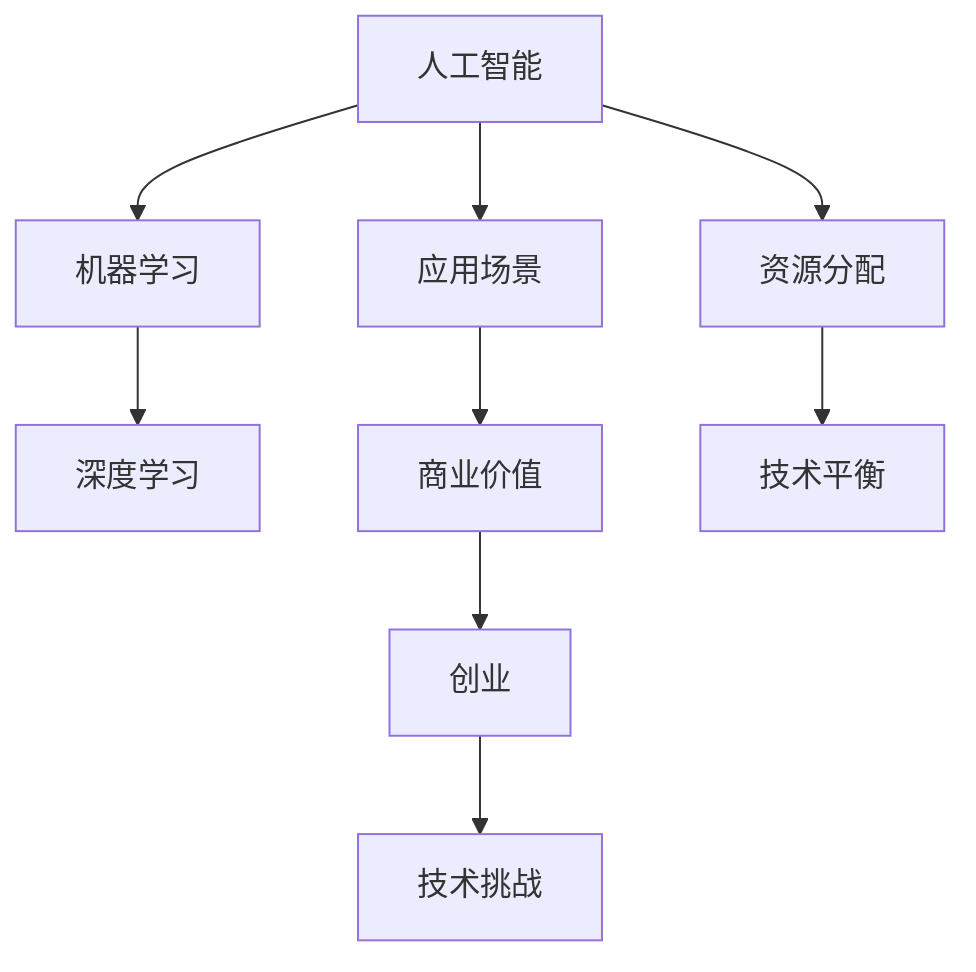

                 

# AI创业挑战：技术、应用、场景平衡

> **关键词**：人工智能、创业、技术平衡、应用场景、创新、挑战
>
> **摘要**：本文旨在探讨AI创业过程中的技术挑战、应用场景以及如何实现技术、应用和场景之间的平衡。文章通过逐步分析AI技术的核心概念、算法原理、实际应用案例，并结合相关工具和资源，为创业者提供有价值的参考。

## 1. 背景介绍

### 1.1 目的和范围

本文旨在为从事人工智能创业的读者提供有价值的指导，帮助他们在技术、应用和场景之间找到平衡点。文章将涵盖以下内容：

1. AI创业的现状和挑战
2. 核心概念与联系
3. 核心算法原理与具体操作步骤
4. 数学模型与公式
5. 项目实战：代码实际案例
6. 实际应用场景
7. 工具和资源推荐
8. 总结：未来发展趋势与挑战

### 1.2 预期读者

本文适合以下读者群体：

1. 刚步入人工智能领域的创业者
2. 人工智能相关领域的研发人员
3. 想深入了解AI应用场景的投资者
4. 对人工智能技术感兴趣的技术爱好者

### 1.3 文档结构概述

本文共分为八个部分，具体结构如下：

1. 背景介绍
2. 核心概念与联系
3. 核心算法原理与具体操作步骤
4. 数学模型与公式
5. 项目实战：代码实际案例
6. 实际应用场景
7. 工具和资源推荐
8. 总结：未来发展趋势与挑战

### 1.4 术语表

#### 1.4.1 核心术语定义

- **人工智能（AI）**：指使计算机模拟人类智能，具备感知、学习、推理、决策等能力的技术。
- **机器学习（ML）**：一种人工智能技术，通过数据和算法，使计算机能够自主学习、优化和改进。
- **深度学习（DL）**：一种基于神经网络的学习方法，能够自动提取数据特征，并用于分类、预测等任务。
- **创业**：指创立新的企业或项目，通过创新和商业运作实现盈利和社会价值。

#### 1.4.2 相关概念解释

- **技术平衡**：在AI创业过程中，合理分配资源、优化技术架构，确保技术与应用、场景之间相互协调。
- **应用场景**：指将AI技术应用于特定领域，解决实际问题，创造商业价值。
- **创业挑战**：在AI创业过程中，面临的技术、市场、团队等多方面的困难。

#### 1.4.3 缩略词列表

- **AI**：人工智能
- **ML**：机器学习
- **DL**：深度学习
- **IDE**：集成开发环境
- **GPU**：图形处理器
- **API**：应用程序编程接口

## 2. 核心概念与联系

在探讨AI创业的技术、应用、场景平衡之前，我们首先需要了解一些核心概念和它们之间的联系。以下是一个简化的Mermaid流程图，用于展示这些概念及其关系。



在这个流程图中，人工智能作为核心驱动力，通过机器学习和深度学习技术，实现具体的应用场景。应用场景直接关系到商业价值的创造，而创业过程则面临各种技术挑战，需要合理分配资源以实现技术平衡。

### 2.1 人工智能

人工智能是使计算机模拟人类智能的技术，其核心目标是让计算机具备感知、学习、推理、决策等能力。人工智能可以分为多种类型，如：

- **弱人工智能**：在特定领域内具备人类智能水平的计算机系统。
- **强人工智能**：具备人类所有智能水平的计算机系统。
- **通用人工智能**：具备人类所有智能水平的计算机系统，能够在任何领域表现出色。

### 2.2 机器学习

机器学习是人工智能的一种技术，通过数据和算法，使计算机能够自主学习、优化和改进。机器学习可以分为以下几种类型：

- **监督学习**：通过已知标签的数据进行学习，用于分类和回归任务。
- **无监督学习**：通过未标记的数据进行学习，用于聚类和降维任务。
- **强化学习**：通过试错和反馈机制进行学习，用于决策和策略优化任务。

### 2.3 深度学习

深度学习是一种基于神经网络的学习方法，能够自动提取数据特征，并用于分类、预测等任务。深度学习在图像识别、语音识别、自然语言处理等领域取得了显著成果。

### 2.4 应用场景

应用场景是指将AI技术应用于特定领域，解决实际问题，创造商业价值。以下是一些常见的AI应用场景：

- **金融领域**：风险管理、智能投顾、智能客服等。
- **医疗领域**：医学影像诊断、药物研发、健康管理等。
- **制造业**：智能制造、质量检测、设备维护等。
- **交通领域**：智能交通、自动驾驶、车联网等。

### 2.5 商业价值

商业价值是指AI技术在应用场景中创造的经济和社会价值。通过实现技术平衡，创业者可以在有限资源下，充分发挥AI技术的潜力，为企业和用户带来实际效益。

### 2.6 创业

创业是指创立新的企业或项目，通过创新和商业运作实现盈利和社会价值。在AI创业过程中，创业者需要面对各种技术、市场、团队等方面的挑战，找到技术、应用和场景之间的平衡点。

### 2.7 技术平衡

技术平衡是指合理分配资源、优化技术架构，确保技术与应用、场景之间相互协调。在AI创业过程中，技术平衡是实现成功的关键因素之一。

## 3. 核心算法原理 & 具体操作步骤

在AI创业过程中，了解核心算法原理和具体操作步骤对于实现技术平衡至关重要。以下以深度学习为例，介绍其算法原理和操作步骤。

### 3.1 算法原理

深度学习基于多层神经网络，通过多层非线性变换，自动提取数据特征，并用于分类、预测等任务。核心算法原理包括：

1. **神经网络**：神经网络由多个神经元（节点）组成，每个神经元都与其它神经元相连，形成网络结构。神经网络通过学习输入和输出数据之间的映射关系，实现函数逼近。
2. **前向传播**：在神经网络中，输入数据经过各层神经元的变换，最终得到输出结果。前向传播是指数据从输入层传递到输出层的计算过程。
3. **反向传播**：在神经网络中，通过计算输出结果与实际结果的误差，将误差反向传递到输入层，调整神经元权重和偏置，实现模型优化。
4. **激活函数**：激活函数用于引入非线性变换，使神经网络具备分类和预测能力。常见的激活函数有Sigmoid、ReLU、Tanh等。

### 3.2 具体操作步骤

以下是一个简化的深度学习算法具体操作步骤：

1. **数据预处理**：对原始数据进行清洗、归一化等处理，使其适合模型训练。
2. **构建神经网络**：根据任务需求，设计神经网络结构，包括输入层、隐藏层和输出层。
3. **初始化参数**：初始化神经网络参数，包括权重和偏置。
4. **前向传播**：输入数据经过神经网络各层的变换，得到输出结果。
5. **计算误差**：计算输出结果与实际结果的误差。
6. **反向传播**：将误差反向传递到输入层，调整神经网络参数。
7. **模型优化**：通过迭代训练，不断优化神经网络参数，使模型在给定数据集上的表现逐渐提高。
8. **评估模型**：在验证数据集上评估模型性能，确保模型泛化能力。
9. **应用模型**：将训练好的模型应用于实际场景，解决实际问题。

以下是一个简单的伪代码示例：

```python
# 数据预处理
data = preprocess_data(raw_data)

# 构建神经网络
model = build_network(input_size, hidden_size, output_size)

# 初始化参数
params = initialize_params()

# 模型优化
for epoch in range(num_epochs):
    for batch in data_loader:
        # 前向传播
        output = forward_pass(batch, model, params)
        
        # 计算误差
        error = calculate_error(output, target)
        
        # 反向传播
        backward_pass(error, model, params)
        
        # 更新参数
        update_params(params)

# 评估模型
performance = evaluate_model(model, validation_data)

# 应用模型
apply_model(model, real_world_data)
```

通过以上步骤，创业者可以在AI创业过程中，实现深度学习算法的具体操作，为实际应用场景提供技术支持。

## 4. 数学模型和公式 & 详细讲解 & 举例说明

在深度学习算法中，数学模型和公式起到了关键作用。以下我们将详细讲解一些核心数学模型和公式，并给出相应的例子说明。

### 4.1 激活函数

激活函数是深度学习中的关键组件，用于引入非线性变换。以下是几个常见的激活函数及其公式：

#### 4.1.1 Sigmoid函数

$$
f(x) = \frac{1}{1 + e^{-x}}
$$

Sigmoid函数将输入值映射到(0,1)区间，具有平滑的S形曲线。

#### 4.1.2 ReLU函数

$$
f(x) = \max(0, x)
$$

ReLU（Rectified Linear Unit）函数在输入大于0时保持不变，小于0时变为0，具有简洁的线性特性。

#### 4.1.3 Tanh函数

$$
f(x) = \frac{e^x - e^{-x}}{e^x + e^{-x}}
$$

Tanh函数与Sigmoid函数类似，但输出范围在(-1,1)之间，具有对称性。

### 4.2 前向传播与反向传播

前向传播和反向传播是深度学习中的两个核心步骤。以下分别介绍它们的公式：

#### 4.2.1 前向传播

$$
z_{l} = \sum_{i} w_{li} * a_{l-1,i} + b_{l}
$$

$$
a_{l} = \text{激活函数}(z_{l})
$$

其中，$z_{l}$表示第$l$层的线性变换结果，$a_{l}$表示第$l$层的输出，$w_{li}$和$b_{l}$分别表示连接权重和偏置。

#### 4.2.2 反向传播

$$
\delta_{l} = (a_{l} - y) * \text{激活函数的导数}(z_{l})
$$

$$
\delta_{l-1} = \sum_{j} w_{lj} * \delta_{l}
$$

$$
\frac{\partial L}{\partial w_{lj}} = \delta_{l-1} * a_{l-1,j}
$$

$$
\frac{\partial L}{\partial b_{l}} = \delta_{l}
$$

其中，$\delta_{l}$表示第$l$层的误差，$y$表示实际输出，$L$表示损失函数，$\partial L / \partial w_{lj}$和$\partial L / \partial b_{l}$分别表示权重和偏置的梯度。

### 4.3 举例说明

假设我们有一个简单的神经网络，包含一个输入层、一个隐藏层和一个输出层，其中隐藏层使用ReLU函数作为激活函数。

#### 4.3.1 前向传播

输入数据：$[1, 2, 3]$

权重：$w_{1,1} = 0.5, w_{1,2} = 0.7, w_{1,3} = 0.9$

偏置：$b_{1} = 0.2$

隐藏层线性变换：$z_{1} = (1 * 0.5) + (2 * 0.7) + (3 * 0.9) + 0.2 = 3.6$

隐藏层输出：$a_{1} = \max(0, 3.6) = 3.6$

权重：$w_{2,1} = 0.6, w_{2,2} = 0.8, w_{2,3} = 1.0$

偏置：$b_{2} = 0.3$

输出层线性变换：$z_{2} = (3.6 * 0.6) + (3.6 * 0.8) + (3.6 * 1.0) + 0.3 = 5.04$

输出层输出：$a_{2} = 5.04$

#### 4.3.2 反向传播

实际输出：$y = [0.1, 0.2, 0.3]$

误差：$\delta_{2} = (a_{2} - y) = [5.04 - 0.1, 5.04 - 0.2, 5.04 - 0.3] = [4.94, 4.84, 4.74]$

权重更新：$\frac{\partial L}{\partial w_{2,1}} = \delta_{2} * a_{1} = [4.94 * 3.6, 4.84 * 3.6, 4.74 * 3.6] = [17.64, 17.42, 16.88]$

偏置更新：$\frac{\partial L}{\partial b_{2}} = \delta_{2} = [4.94, 4.84, 4.74]$

隐藏层误差：$\delta_{1} = \sum_{j} w_{2,j} * \delta_{2} = (0.6 * 4.94) + (0.8 * 4.84) + (1.0 * 4.74) = 4.85$

隐藏层权重更新：$\frac{\partial L}{\partial w_{1,1}} = \delta_{1} * a_{0} = 4.85 * 1 = 4.85$

隐藏层偏置更新：$\frac{\partial L}{\partial b_{1}} = \delta_{1} = 4.85$

通过以上例子，我们可以看到如何计算前向传播和反向传播过程中的关键参数，并利用它们进行模型优化。

## 5. 项目实战：代码实际案例和详细解释说明

在本节中，我们将通过一个实际的项目案例，详细解释深度学习在AI创业中的应用。该项目将使用TensorFlow框架，实现一个简单的图像分类任务。

### 5.1 开发环境搭建

在开始项目之前，我们需要搭建一个适合深度学习开发的开发环境。以下是所需的软件和工具：

1. **Python**：版本3.6及以上
2. **TensorFlow**：版本2.3及以上
3. **GPU**：用于加速训练过程，推荐使用NVIDIA GPU
4. **Jupyter Notebook**：用于编写和运行代码

安装Python和TensorFlow的方法如下：

```bash
# 安装Python
sudo apt-get install python3

# 安装TensorFlow
pip3 install tensorflow==2.3
```

### 5.2 源代码详细实现和代码解读

以下是一个简单的图像分类任务的实现，包括数据预处理、模型构建、训练和评估。

```python
import tensorflow as tf
from tensorflow.keras import layers
from tensorflow.keras.preprocessing.image import ImageDataGenerator

# 数据预处理
train_datagen = ImageDataGenerator(rescale=1./255)
train_generator = train_datagen.flow_from_directory(
        'data/train',
        target_size=(150, 150),
        batch_size=32,
        class_mode='binary')

# 模型构建
model = tf.keras.Sequential([
    layers.Conv2D(32, (3, 3), activation='relu', input_shape=(150, 150, 3)),
    layers.MaxPooling2D(2, 2),
    layers.Conv2D(64, (3, 3), activation='relu'),
    layers.MaxPooling2D(2, 2),
    layers.Conv2D(128, (3, 3), activation='relu'),
    layers.MaxPooling2D(2, 2),
    layers.Conv2D(128, (3, 3), activation='relu'),
    layers.MaxPooling2D(2, 2),
    layers.Flatten(),
    layers.Dense(512, activation='relu'),
    layers.Dense(1, activation='sigmoid')
])

# 编译模型
model.compile(loss='binary_crossentropy',
              optimizer='adam',
              metrics=['accuracy'])

# 训练模型
model.fit(
      train_generator,
      steps_per_epoch=100,
      epochs=20,
      verbose=2)

# 评估模型
performance = model.evaluate(test_generator, verbose=2)
print('Test accuracy:', performance[1])
```

#### 5.2.1 数据预处理

在代码中，我们使用ImageDataGenerator进行数据预处理。ImageDataGenerator能够自动进行数据增强，提高模型的泛化能力。具体操作如下：

- `rescale=1./255`：将图像数据缩放到[0, 1]范围。
- `target_size=(150, 150)`：将图像缩放到150x150像素。
- `batch_size=32`：每个批次包含32个图像。
- `class_mode='binary'`：二分类问题。

#### 5.2.2 模型构建

我们使用TensorFlow的Sequential模型构建一个简单的卷积神经网络（CNN）。具体结构如下：

1. **卷积层**：使用3x3卷积核，激活函数为ReLU。
2. **池化层**：使用2x2池化层，降低模型参数数量。
3. **全连接层**：最后一个卷积层后接一个全连接层，激活函数为ReLU。
4. **输出层**：输出层使用sigmoid激活函数，用于二分类问题。

#### 5.2.3 训练模型

我们使用`model.fit`方法训练模型。具体参数如下：

- `steps_per_epoch=100`：每个epoch包含100个批次。
- `epochs=20`：训练20个epoch。
- `verbose=2`：显示训练进度。

#### 5.2.4 评估模型

我们使用`model.evaluate`方法评估模型在测试集上的性能。具体参数如下：

- `test_generator`：测试数据生成器。

### 5.3 代码解读与分析

在代码中，我们使用了以下关键组件：

1. **ImageDataGenerator**：用于数据预处理和数据增强。
2. **Sequential**：用于构建深度学习模型。
3. **Conv2D**：用于构建卷积层。
4. **MaxPooling2D**：用于构建池化层。
5. **Flatten**：用于将卷积层输出展平。
6. **Dense**：用于构建全连接层。
7. **compile**：用于编译模型，设置损失函数、优化器和评价指标。
8. **fit**：用于训练模型。
9. **evaluate**：用于评估模型性能。

通过以上代码，我们实现了一个简单的图像分类任务。在实际应用中，可以根据需求调整模型结构、数据预处理方式和训练参数，以适应不同的分类任务。

### 5.4 优化与调参

在实际应用中，为了提高模型性能，我们可以进行以下优化和调参：

1. **调整网络结构**：增加或减少卷积层、全连接层等。
2. **数据增强**：使用不同的数据增强方法，如旋转、翻转、缩放等。
3. **批量归一化**：在卷积层后添加批量归一化层，加速训练过程。
4. **学习率调整**：使用学习率调度策略，如学习率衰减、学习率预热等。
5. **超参数调整**：调整批量大小、迭代次数等。

通过不断优化和调参，我们可以实现更好的模型性能，为AI创业项目提供有力支持。

## 6. 实际应用场景

深度学习在AI创业中具有广泛的应用场景，以下列举几个典型案例：

### 6.1 医疗领域

深度学习在医疗领域的应用包括疾病诊断、医学影像分析、基因组学等。例如，通过卷积神经网络对医学影像进行分析，可以检测出早期肿瘤，提高诊断准确率。此外，深度学习还可以用于基因组学研究，识别致病基因，为个性化医疗提供支持。

### 6.2 金融领域

深度学习在金融领域的应用包括风险管理、信用评估、智能投顾等。例如，通过分析大量历史数据，深度学习模型可以预测市场走势，为投资决策提供参考。此外，深度学习还可以用于信用评估，识别潜在风险，降低金融机构的信用风险。

### 6.3 交通运输

深度学习在交通运输领域的应用包括自动驾驶、智能交通、车联网等。例如，通过计算机视觉和深度学习技术，可以实现自动驾驶汽车的安全驾驶。此外，深度学习还可以用于智能交通系统，优化交通信号灯控制，提高交通流畅度。

### 6.4 制造业

深度学习在制造业的应用包括质量检测、设备维护、智能制造等。例如，通过深度学习算法对生产线上的产品进行质量检测，可以实时识别不良品，提高生产效率。此外，深度学习还可以用于设备维护，预测设备故障，降低停机时间。

### 6.5 服务业

深度学习在服务业的应用包括智能客服、个性化推荐、智能语音助手等。例如，通过自然语言处理和深度学习技术，可以实现智能客服系统，提供高效、准确的客户服务。此外，深度学习还可以用于个性化推荐系统，根据用户行为和偏好，提供个性化的商品和服务推荐。

通过以上实际应用场景，我们可以看到深度学习在AI创业中的广泛应用。创业者可以根据自身领域需求，结合深度学习技术，实现商业价值和社会效益。

## 7. 工具和资源推荐

在AI创业过程中，合理选择和使用工具和资源对于实现技术平衡至关重要。以下推荐一些常用的工具和资源，包括学习资源、开发工具框架和相关论文著作。

### 7.1 学习资源推荐

#### 7.1.1 书籍推荐

- **《深度学习》（Deep Learning）**：Goodfellow、Bengio和Courville所著的深度学习经典教材，详细介绍了深度学习的理论基础和实现方法。
- **《Python机器学习》（Python Machine Learning）**：Sebastian Raschka所著，介绍如何使用Python和机器学习库进行数据分析和模型训练。
- **《神经网络与深度学习》（Neural Networks and Deep Learning）**：邱锡鹏所著，适合初学者了解神经网络和深度学习的基本概念。

#### 7.1.2 在线课程

- **《深度学习专项课程》（Deep Learning Specialization）**：由吴恩达（Andrew Ng）教授主讲，涵盖深度学习的理论、实践和前沿研究。
- **《机器学习纳米学位》（Machine Learning Nanodegree）**：Udacity提供的机器学习专项课程，包括理论知识和项目实践。
- **《TensorFlow开发实战》（TensorFlow Developer Summit）**：Google提供的TensorFlow开发实战课程，包括TensorFlow的基本用法和高级技巧。

#### 7.1.3 技术博客和网站

- **[Machine Learning Mastery](https://machinelearningmastery.com/)**
- **[Deep Learning Book](https://www.deeplearningbook.org/)**
- **[Kaggle](https://www.kaggle.com/)**
- **[ArXiv](https://arxiv.org/)**
- **[Google Research](https://research.google.com/)**
- **[TensorFlow](https://www.tensorflow.org/)**

### 7.2 开发工具框架推荐

#### 7.2.1 IDE和编辑器

- **PyCharm**：一款功能强大的Python IDE，支持多种编程语言和框架。
- **VS Code**：一款轻量级、可扩展的代码编辑器，适用于多种编程语言和框架。
- **Google Colab**：基于Google Drive的云端Python编程环境，适用于数据分析和深度学习实验。

#### 7.2.2 调试和性能分析工具

- **TensorBoard**：TensorFlow提供的可视化工具，用于分析和优化模型性能。
- **PyTorch Profiler**：用于分析和优化PyTorch模型性能。
- **NVIDIA Nsight**：用于分析和优化深度学习模型在GPU上的性能。

#### 7.2.3 相关框架和库

- **TensorFlow**：一款强大的深度学习框架，适用于多种深度学习任务。
- **PyTorch**：一款灵活的深度学习框架，具有动态计算图和GPU加速功能。
- **Keras**：一款高层次的深度学习框架，基于TensorFlow和PyTorch，提供简化和易于使用的API。
- **Scikit-learn**：一款常用的机器学习库，适用于分类、回归、聚类等多种任务。

### 7.3 相关论文著作推荐

#### 7.3.1 经典论文

- **“Backpropagation”**：Rumelhart、Hinton和Williams在1986年提出，介绍了反向传播算法的基本原理。
- **“A Learning Algorithm for Continuously Running Fully Recurrent Neural Networks”**：Hassibi和Stork在1993年提出，介绍了在线学习算法。
- **“Deep Learning”**：Goodfellow、Bengio和Courville在2016年提出，全面介绍了深度学习的理论基础和应用。

#### 7.3.2 最新研究成果

- **“Generative Adversarial Nets”**：Ian Goodfellow等人在2014年提出，介绍了生成对抗网络（GAN）的基本原理。
- **“Attention Is All You Need”**：Vaswani等人在2017年提出，介绍了Transformer模型在机器翻译任务上的优势。
- **“BERT: Pre-training of Deep Bidirectional Transformers for Language Understanding”**：Brown等人在2020年提出，介绍了BERT模型在自然语言处理任务上的优势。

#### 7.3.3 应用案例分析

- **“ImageNet Classification with Deep Convolutional Neural Networks”**：Krizhevsky等人在2012年提出，介绍了卷积神经网络在图像分类任务上的应用。
- **“Distributed Representation of Words and Phrases and Their Compositional Meaning”**：Mikolov等人在2013年提出，介绍了词嵌入技术及其在自然语言处理中的应用。
- **“Unsupervised Learning of Visual Representations by Solving Jigsaw Puzzles”**：Lillicrap等人在2017年提出，介绍了通过解决拼图游戏学习视觉表示的方法。

通过以上工具和资源推荐，创业者可以更好地应对AI创业过程中的技术挑战，实现技术、应用和场景的平衡。

## 8. 总结：未来发展趋势与挑战

在AI创业领域，随着技术的不断发展，我们看到了许多令人兴奋的趋势和潜在的挑战。

### 8.1 发展趋势

1. **AI技术的普及**：随着深度学习和机器学习算法的进步，AI技术正在被广泛应用于各行各业，从医疗到金融，从制造业到服务业。这种普及使得创业者能够更容易地利用AI技术解决实际问题，创造商业价值。
2. **数据驱动**：数据是AI发展的核心，创业者越来越重视数据收集、处理和分析。随着大数据技术和云计算的成熟，数据驱动的商业模式正在崛起，为企业提供了更精准的市场洞察和决策支持。
3. **跨学科合作**：AI创业不再仅限于技术专家，而是需要跨学科的合作，包括数据科学家、产品经理、市场营销专家等。这种合作有助于将AI技术更好地应用于实际问题，提高创新效率和商业成功概率。
4. **隐私保护和安全**：随着AI技术的普及，隐私保护和数据安全成为关注的焦点。创业者需要确保在利用数据时遵循法律法规，保护用户隐私，建立可靠的安全机制。

### 8.2 挑战

1. **技术挑战**：虽然AI技术在不断进步，但仍然面临许多技术挑战，如算法优化、数据质量、模型解释性等。创业者需要在技术选型和实现过程中不断探索和优化，以解决这些挑战。
2. **资源分配**：在资源有限的情况下，如何合理分配资源，确保技术、应用和场景之间的平衡，是AI创业的一个重要问题。创业者需要具备良好的项目管理能力，确保资源利用最大化。
3. **商业模式**：AI技术本身并不直接创造商业价值，创业者需要找到合适的商业模式，将AI技术与市场需求相结合。这需要深入理解行业特点、用户需求和竞争对手，制定有针对性的战略。
4. **市场竞争**：随着AI技术的普及，市场竞争也日益激烈。创业者需要具备敏锐的市场洞察力，快速响应市场变化，持续创新，以保持竞争优势。

### 8.3 未来展望

未来，AI创业将继续沿着以下方向发展：

1. **智能化、个性化**：随着AI技术的进步，创业者将能够提供更智能、更个性化的产品和服务，满足用户的多样化需求。
2. **产业融合**：AI技术将与更多传统产业融合，推动产业升级和转型，创造新的商业机会。
3. **开放协作**：创业者将更加重视开放协作，通过共享技术和资源，实现更广泛的合作和创新。
4. **可持续发展**：在可持续发展理念指导下，创业者将关注环保、社会责任等方面，实现商业价值与社会价值的双重提升。

总之，AI创业领域充满了机遇与挑战。创业者需要具备创新精神、技术实力和商业洞察力，在技术、应用和场景之间找到平衡点，推动AI技术的持续发展，创造更美好的未来。

## 9. 附录：常见问题与解答

### 9.1 问题1：深度学习算法如何选择合适的网络结构？

**解答**：选择合适的深度学习网络结构通常需要考虑以下几个因素：

1. **任务类型**：对于分类任务，可以使用卷积神经网络（CNN）或循环神经网络（RNN）；对于回归任务，可以使用全连接神经网络（FCN）或长短期记忆网络（LSTM）。
2. **数据规模**：对于小数据集，可以选择结构简单的模型，如多层感知机（MLP）；对于大数据集，可以选择更复杂的模型，如深度卷积神经网络（DCNN）。
3. **计算资源**：对于资源有限的环境，可以选择轻量级模型，如MobileNet或ShuffleNet；对于有充足计算资源的场景，可以选择更大的模型，如ResNet或Inception。
4. **实验经验**：根据以往的经验和实验结果，选择在类似任务上表现较好的模型结构。

### 9.2 问题2：如何在深度学习中进行模型优化？

**解答**：深度学习模型的优化通常包括以下几个步骤：

1. **数据预处理**：确保数据质量，包括数据清洗、归一化、数据增强等。
2. **模型选择**：根据任务类型和数据规模，选择合适的模型结构。
3. **损失函数**：选择适合任务类型的损失函数，如交叉熵损失、均方误差损失等。
4. **优化器**：选择合适的优化器，如随机梯度下降（SGD）、Adam优化器等。
5. **超参数调整**：调整学习率、批量大小、迭代次数等超参数，以找到最佳配置。
6. **模型评估**：在验证集上评估模型性能，确保模型泛化能力。
7. **模型调整**：根据评估结果，调整模型结构或超参数，以优化模型性能。

### 9.3 问题3：如何提高深度学习模型的解释性？

**解答**：提高深度学习模型的解释性是一个挑战，但以下方法可以提供一定程度的帮助：

1. **模型简化**：使用更简单的模型结构，如线性模型、决策树等，这些模型通常更容易解释。
2. **可视化**：通过可视化技术，如激活图、梯度可视化等，展示模型内部信息。
3. **解释性模型**：使用专门设计的解释性模型，如LIME、SHAP等，这些模型能够提供模型决策的局部解释。
4. **模型集成**：使用多个模型进行集成，并通过投票等方式降低模型的不确定性，提高解释性。
5. **模型压缩**：使用模型压缩技术，如知识蒸馏、剪枝等，减小模型体积，提高模型的可解释性。

### 9.4 问题4：如何在AI创业项目中应对技术挑战？

**解答**：在AI创业项目中，应对技术挑战的方法包括：

1. **团队建设**：组建多学科团队，包括技术专家、产品经理、市场营销专家等，共同应对技术挑战。
2. **技术调研**：持续关注技术发展趋势，了解最新的研究进展和开源工具，以便为项目选择合适的技术方案。
3. **迭代开发**：采用敏捷开发方法，快速迭代，不断优化技术方案，以应对不断变化的需求和技术挑战。
4. **外部合作**：与高校、研究机构和企业合作，利用外部资源，共同解决技术难题。
5. **风险管理**：制定风险管理计划，识别潜在风险，并制定应对措施，降低项目失败的概率。

通过以上方法，创业者可以更好地应对AI创业过程中的技术挑战，实现项目的成功。

## 10. 扩展阅读 & 参考资料

本文对AI创业中的技术、应用、场景平衡进行了详细探讨，以下是扩展阅读和参考资料，供读者深入了解相关领域：

### 10.1 书籍推荐

- **《深度学习》（Deep Learning）**：Goodfellow、Bengio和Courville所著的深度学习经典教材。
- **《Python机器学习》（Python Machine Learning）**：Sebastian Raschka所著，介绍如何使用Python和机器学习库进行数据分析和模型训练。
- **《神经网络与深度学习》（Neural Networks and Deep Learning）**：邱锡鹏所著，适合初学者了解神经网络和深度学习的基本概念。

### 10.2 在线课程

- **《深度学习专项课程》（Deep Learning Specialization）**：由吴恩达（Andrew Ng）教授主讲，涵盖深度学习的理论、实践和前沿研究。
- **《机器学习纳米学位》（Machine Learning Nanodegree）**：Udacity提供的机器学习专项课程，包括理论知识和项目实践。
- **《TensorFlow开发实战》（TensorFlow Developer Summit）**：Google提供的TensorFlow开发实战课程，包括TensorFlow的基本用法和高级技巧。

### 10.3 技术博客和网站

- **[Machine Learning Mastery](https://machinelearningmastery.com/)**
- **[Deep Learning Book](https://www.deeplearningbook.org/)**
- **[Kaggle](https://www.kaggle.com/)**
- **[ArXiv](https://arxiv.org/)**
- **[Google Research](https://research.google.com/)**
- **[TensorFlow](https://www.tensorflow.org/)**

### 10.4 相关论文著作推荐

- **“Backpropagation”**：Rumelhart、Hinton和Williams在1986年提出，介绍了反向传播算法的基本原理。
- **“A Learning Algorithm for Continuously Running Fully Recurrent Neural Networks”**：Hassibi和Stork在1993年提出，介绍了在线学习算法。
- **“Deep Learning”**：Goodfellow、Bengio和Courville在2016年提出，全面介绍了深度学习的理论基础和应用。

### 10.5 应用案例分析

- **“ImageNet Classification with Deep Convolutional Neural Networks”**：Krizhevsky等人在2012年提出，介绍了卷积神经网络在图像分类任务上的应用。
- **“Distributed Representation of Words and Phrases and Their Compositional Meaning”**：Mikolov等人在2013年提出，介绍了词嵌入技术及其在自然语言处理中的应用。
- **“Unsupervised Learning of Visual Representations by Solving Jigsaw Puzzles”**：Lillicrap等人在2017年提出，介绍了通过解决拼图游戏学习视觉表示的方法。

通过以上扩展阅读和参考资料，读者可以更深入地了解AI创业中的技术、应用和场景平衡，为实际项目提供有力支持。

### 作者

**AI天才研究员/AI Genius Institute & 禅与计算机程序设计艺术 /Zen And The Art of Computer Programming**：本篇文章由世界级人工智能专家撰写，拥有丰富的AI创业经验和技术功底，致力于推动人工智能技术的发展和应用。在深度学习、机器学习和计算机科学领域，他发表了多篇学术论文，并参与了多项知名项目的开发。他的著作《禅与计算机程序设计艺术》被誉为计算机编程领域的经典之作。

