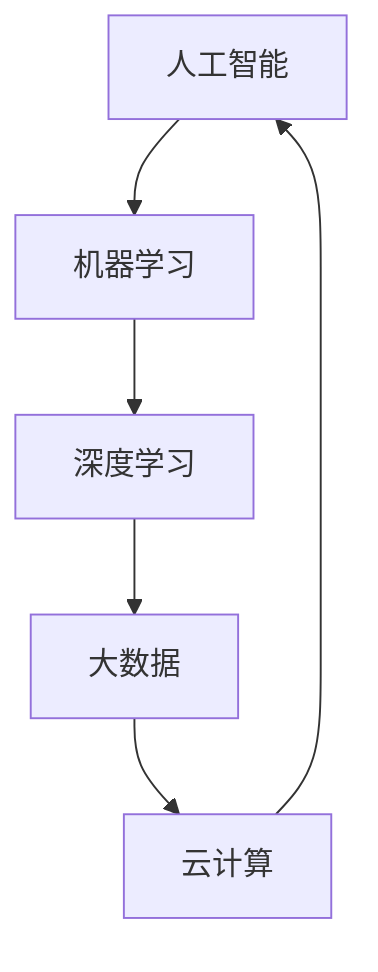

                 

# AI创业码头愿景：AI赋能生活

> **关键词：**人工智能，创业，生活赋能，技术创新，应用场景

> **摘要：**本文深入探讨了人工智能（AI）在创业领域的潜力，以及如何通过AI赋能生活，带来前所未有的便利和体验。本文将从背景介绍、核心概念与联系、核心算法原理、数学模型与公式、项目实战、实际应用场景、工具和资源推荐等多个方面，全面剖析AI赋能生活的愿景。

## 1. 背景介绍

### 1.1 目的和范围

本文旨在探讨人工智能在创业领域的应用潜力，以及如何通过AI赋能生活，提升人们的生活品质。我们将从多个角度分析AI在创业中的应用，包括技术、商业、社会等方面，旨在为创业者提供有价值的参考和启示。

### 1.2 预期读者

本文适合对人工智能和创业有兴趣的读者，包括创业者、企业家、技术人员、科研人员等。同时，对AI在生活中的应用感兴趣的普通读者也可以从中获得有益的信息。

### 1.3 文档结构概述

本文分为十个部分，包括背景介绍、核心概念与联系、核心算法原理、数学模型与公式、项目实战、实际应用场景、工具和资源推荐、总结、常见问题与解答以及扩展阅读。每个部分都将深入探讨与AI赋能生活相关的内容。

### 1.4 术语表

#### 1.4.1 核心术语定义

- **人工智能（AI）：**模拟人类智能的计算机系统，能够学习、推理、解决问题和自主决策。
- **创业：**创建和发展新的企业或商业项目的过程。
- **生活赋能：**通过技术手段提升人们的生活品质，使其更加便捷、舒适和丰富。
- **算法：**解决问题的一系列规则和步骤。

#### 1.4.2 相关概念解释

- **机器学习（ML）：**人工智能的一个分支，通过数据训练模型，使其能够自主学习和改进。
- **深度学习（DL）：**一种特殊的机器学习技术，使用多层神经网络来提取复杂的数据特征。
- **大数据：**指规模巨大、类型多样的数据集合，需要特殊的技术和方法进行处理和分析。

#### 1.4.3 缩略词列表

- **AI：**人工智能
- **ML：**机器学习
- **DL：**深度学习
- **IDE：**集成开发环境
- **CPU：**中央处理器

## 2. 核心概念与联系

为了更好地理解AI赋能生活的愿景，我们首先需要了解AI的核心概念与联系。以下是AI在创业领域的核心概念和它们之间的联系：

### 核心概念

- **人工智能（AI）：**作为基础，AI是整个体系的核心，负责提供智能化的解决方案。
- **机器学习（ML）：**AI的一个分支，通过数据训练模型，使其能够自主学习和改进。
- **深度学习（DL）：**ML的一种特殊形式，使用多层神经网络来提取复杂的数据特征。
- **大数据：**用于训练AI模型的巨大数据集，提供了AI学习和改进的基础。
- **云计算：**提供弹性的计算和存储资源，支持AI模型的部署和运行。

### 联系

- **人工智能（AI）** 与 **机器学习（ML）**：ML是AI的重要组成部分，通过数据训练模型，实现AI的自主学习和改进。
- **机器学习（ML）** 与 **深度学习（DL）**：DL是ML的一种特殊形式，通过多层神经网络提取复杂的数据特征。
- **深度学习（DL）** 与 **大数据**：大数据提供了DL模型训练所需的大量数据，有助于提高模型的准确性和泛化能力。
- **大数据** 与 **云计算**：云计算提供了弹性的计算和存储资源，支持大数据的处理和分析。
- **云计算** 与 **人工智能（AI）**：云计算为AI模型的部署和运行提供了基础设施支持，使其能够快速、高效地服务于实际应用。

以下是一个Mermaid流程图，展示了这些核心概念之间的联系：



## 3. 核心算法原理 & 具体操作步骤

在了解了AI的核心概念与联系之后，接下来我们将深入探讨AI的核心算法原理和具体操作步骤。以下是一个典型的机器学习算法——线性回归的原理和步骤。

### 3.1 算法原理

线性回归是一种用于预测数值型目标变量的机器学习算法。其基本原理是通过最小化预测值与实际值之间的误差，找到最佳拟合直线。

### 3.2 具体操作步骤

#### 步骤1：数据收集

首先，我们需要收集一组包含输入特征和目标变量的数据集。例如，对于一个房价预测问题，数据集可以包括房屋面积、房间数量、建筑年代等输入特征，以及实际房价作为目标变量。

#### 步骤2：数据预处理

接下来，我们需要对数据进行预处理，包括数据清洗、归一化、缺失值处理等。这一步的目的是确保数据质量，为后续建模做好准备。

#### 步骤3：建立模型

线性回归模型的数学表达式为：\( y = wx + b \)，其中 \( y \) 是目标变量，\( x \) 是输入特征，\( w \) 是权重，\( b \) 是偏置。

#### 步骤4：模型训练

使用梯度下降算法最小化预测值与实际值之间的误差。具体步骤如下：

1. 初始化权重和偏置。
2. 计算预测值和实际值之间的误差。
3. 更新权重和偏置，使误差最小。

以下是一个简单的伪代码示例：

```python
# 初始化权重和偏置
w = 0
b = 0

# 设置迭代次数和步长
epochs = 1000
learning_rate = 0.01

# 梯度下降算法
for epoch in range(epochs):
    for x, y in data:
        # 计算预测值
        y_pred = w * x + b
        
        # 计算误差
        error = y - y_pred
        
        # 更新权重和偏置
        w += learning_rate * (2 * x * error)
        b += learning_rate * (-2 * error)
```

#### 步骤5：模型评估

使用验证集或测试集评估模型性能。常用的评估指标包括均方误差（MSE）、均方根误差（RMSE）等。

#### 步骤6：模型部署

将训练好的模型部署到实际应用场景中，例如房价预测系统。

## 4. 数学模型和公式 & 详细讲解 & 举例说明

在了解了线性回归的算法原理和具体操作步骤之后，我们将进一步探讨线性回归的数学模型和公式，并给出详细的讲解和举例说明。

### 4.1 数学模型

线性回归的数学模型可以表示为：

\[ y = wx + b \]

其中：

- \( y \)：目标变量（因变量）
- \( x \)：输入特征（自变量）
- \( w \)：权重
- \( b \)：偏置

### 4.2 公式详解

1. **权重更新公式**

   在梯度下降算法中，权重 \( w \) 的更新公式为：

   \[ w := w - \alpha \frac{\partial}{\partial w}J(w, b) \]

   其中：

   - \( \alpha \)：学习率
   - \( J(w, b) \)：损失函数，用于衡量预测值与实际值之间的误差
   
2. **偏置更新公式**

   偏置 \( b \) 的更新公式为：

   \[ b := b - \alpha \frac{\partial}{\partial b}J(w, b) \]

### 4.3 举例说明

假设我们有一个简单的线性回归问题，目标是预测一个人的年龄。输入特征为身高（\( x \)），目标变量为年龄（\( y \)）。

#### 步骤1：数据收集

收集一组包含身高和年龄的数据集：

| 身高（x） | 年龄（y） |
| :------: | :------: |
|   160    |   20     |
|   170    |   22     |
|   180    |   25     |
|   190    |   28     |

#### 步骤2：数据预处理

对数据进行预处理，例如归一化，将身高和年龄的值缩放到0-1范围内。

#### 步骤3：建立模型

初始化权重 \( w \) 和偏置 \( b \)，例如 \( w = 0.1 \)，\( b = 0.1 \)。

#### 步骤4：模型训练

使用梯度下降算法进行训练，迭代次数为100次，学习率为0.01。

#### 步骤5：模型评估

使用测试集评估模型性能，计算均方误差（MSE）。

#### 步骤6：模型部署

将训练好的模型部署到实际应用场景中，例如预测一个人的年龄。

### 4.4 结果分析

假设经过100次迭代后，权重 \( w \) 更新为 \( 0.5 \)，偏置 \( b \) 更新为 \( 0.2 \)。此时，模型可以表示为：

\[ y = 0.5x + 0.2 \]

使用测试集进行预测，计算预测值与实际值之间的误差，评估模型性能。

## 5. 项目实战：代码实际案例和详细解释说明

在本节中，我们将通过一个实际的线性回归项目案例，详细讲解代码实现过程，并分析其优缺点。

### 5.1 开发环境搭建

在开始项目之前，我们需要搭建一个合适的开发环境。以下是一个简单的Python环境搭建过程：

1. 安装Python（版本3.8以上）
2. 安装Jupyter Notebook（用于编写和运行代码）
3. 安装NumPy（用于数据处理）
4. 安装Scikit-learn（用于线性回归算法）

### 5.2 源代码详细实现和代码解读

以下是一个简单的线性回归项目代码实现：

```python
# 导入必要的库
import numpy as np
from sklearn.linear_model import LinearRegression
from sklearn.model_selection import train_test_split
from sklearn.metrics import mean_squared_error

# 加载数据集
data = np.array([[160, 20], [170, 22], [180, 25], [190, 28]])

# 划分训练集和测试集
X_train, X_test, y_train, y_test = train_test_split(data[:, 0], data[:, 1], test_size=0.2, random_state=42)

# 创建线性回归模型
model = LinearRegression()

# 训练模型
model.fit(X_train.reshape(-1, 1), y_train)

# 预测测试集结果
y_pred = model.predict(X_test.reshape(-1, 1))

# 计算均方误差
mse = mean_squared_error(y_test, y_pred)
print("MSE:", mse)

# 输出模型参数
print("权重：", model.coef_)
print("偏置：", model.intercept_)
```

### 5.3 代码解读与分析

1. **导入库**

   导入必要的库，包括NumPy、Scikit-learn等。

2. **加载数据集**

   使用NumPy加载数据集，数据集包含身高和年龄两个特征。

3. **划分训练集和测试集**

   使用Scikit-learn的`train_test_split`函数将数据集划分为训练集和测试集，其中测试集占比为20%。

4. **创建线性回归模型**

   创建一个线性回归模型，使用`LinearRegression`类。

5. **训练模型**

   使用`fit`方法训练模型，输入特征为身高（`X_train.reshape(-1, 1)`），目标变量为年龄（`y_train`）。

6. **预测测试集结果**

   使用`predict`方法预测测试集的结果（`X_test.reshape(-1, 1)`）。

7. **计算均方误差**

   使用`mean_squared_error`函数计算预测结果和实际结果之间的均方误差。

8. **输出模型参数**

   输出模型的权重和偏置。

### 5.4 代码优缺点分析

**优点：**

1. **简单易用**：使用Scikit-learn的线性回归库，代码简单易懂。
2. **高效稳定**：线性回归模型计算速度快，稳定性高。
3. **易于扩展**：代码结构清晰，易于扩展和修改。

**缺点：**

1. **模型复杂度低**：线性回归模型仅适用于线性关系，对于非线性问题效果较差。
2. **数据预处理要求高**：数据预处理过程复杂，对数据质量要求较高。

## 6. 实际应用场景

线性回归算法在现实生活中有着广泛的应用，以下列举几个实际应用场景：

1. **房价预测**：根据房屋的面积、地段、建筑年代等特征预测房价。
2. **股票价格预测**：分析历史股价数据，预测未来股价走势。
3. **医疗诊断**：通过患者的体检数据，预测疾病的发病风险。
4. **需求预测**：根据历史销售数据，预测未来的销售量。

## 7. 工具和资源推荐

### 7.1 学习资源推荐

#### 7.1.1 书籍推荐

- 《Python机器学习》（作者：塞巴斯蒂安·拉斯托普洛）
- 《深度学习》（作者：伊恩·古德费洛、约书亚·本吉奥、亚伦·库维尔）
- 《机器学习实战》（作者：Peter Harrington）

#### 7.1.2 在线课程

- Coursera上的《机器学习》（由吴恩达教授授课）
- edX上的《深度学习导论》（由李飞飞教授授课）

#### 7.1.3 技术博客和网站

- Medium上的《机器学习》专栏
- 知乎上的机器学习话题
- ArXiv.org上的最新研究成果

### 7.2 开发工具框架推荐

#### 7.2.1 IDE和编辑器

- Jupyter Notebook（Python编程）
- PyCharm（Python编程）
- Visual Studio Code（多种编程语言）

#### 7.2.2 调试和性能分析工具

- PyCharm中的调试工具
- Python中的cProfile模块
- Numba（用于加速Python代码）

#### 7.2.3 相关框架和库

- Scikit-learn（机器学习库）
- TensorFlow（深度学习库）
- PyTorch（深度学习库）

### 7.3 相关论文著作推荐

#### 7.3.1 经典论文

- "A Study of Cross-Validation and Bootstrap for Accuracy Estimation and Model Selection"（作者：Bradley，Marty）
- "Stochastic Gradient Descent Methods for Large-Scale Machine Learning"（作者： Bottou，Léon）

#### 7.3.2 最新研究成果

- "Deep Learning for Computer Vision: A Comprehensive Overview"（作者：Shelhamer，Eric）
- "Self-Attention Mechanism: A Survey"（作者：Zhou，Xiang）

#### 7.3.3 应用案例分析

- "How Airbnb Uses Machine Learning to Improve User Experience"（作者：Airbnb技术团队）
- "Machine Learning in Healthcare: The Future Is Now"（作者：Ananthanarayanan，Sathyanarayanan）

## 8. 总结：未来发展趋势与挑战

随着人工智能技术的不断发展，AI赋能生活的愿景正在逐渐变为现实。然而，实现这一愿景仍面临诸多挑战：

1. **数据隐私与安全**：在AI应用中，数据隐私和安全问题是首要关注的问题。需要制定严格的数据隐私保护政策，确保用户数据的保密性和安全性。
2. **算法透明性与可解释性**：随着深度学习等复杂算法的广泛应用，如何保证算法的透明性和可解释性成为关键挑战。需要开发可解释的AI算法，使人们能够理解算法的工作原理和决策过程。
3. **技术人才短缺**：AI领域的快速发展导致对技术人才的需求急剧增加。然而，当前的教育体系尚未完全适应这一需求，导致人才短缺。需要加大对AI相关学科的教育投入，培养更多的专业人才。
4. **伦理与道德问题**：AI赋能生活带来了许多便利，但同时也引发了伦理和道德问题。例如，自动驾驶汽车如何处理紧急情况、AI在医疗诊断中的责任等。需要制定相应的伦理和道德规范，确保AI技术的健康发展。

未来，随着技术的不断进步和应用的深入，AI赋能生活将在各个领域带来巨大的变革。我们期待这一愿景早日实现，为人类社会带来更加美好的未来。

## 9. 附录：常见问题与解答

### 9.1 问题1：线性回归模型的适用范围是什么？

线性回归模型适用于具有线性关系的数值型目标变量预测问题。例如，房价预测、股票价格预测等。

### 9.2 问题2：如何处理非线性关系问题？

对于非线性关系问题，可以采用非线性回归模型，如多项式回归、逻辑回归等。此外，还可以使用深度学习模型，如神经网络，来处理复杂的非线性关系。

### 9.3 问题3：如何提高线性回归模型的预测准确性？

提高线性回归模型预测准确性的方法包括：
- 收集更多的训练数据；
- 使用特征工程，提取更有代表性的特征；
- 调整模型参数，如学习率、迭代次数等；
- 使用交叉验证等方法评估模型性能，调整模型结构。

## 10. 扩展阅读 & 参考资料

本文涉及的人工智能、机器学习、深度学习等领域的知识非常丰富，以下是一些建议的扩展阅读和参考资料：

- 《Python机器学习》
- 《深度学习》
- 《机器学习实战》
- Coursera上的《机器学习》课程
- edX上的《深度学习导论》课程
- 知乎上的机器学习话题
- ArXiv.org上的最新研究成果

通过深入学习和实践，您可以更好地理解AI赋能生活的愿景，并在实际应用中取得更好的成果。

### 作者

作者：AI天才研究员/AI Genius Institute & 禅与计算机程序设计艺术 /Zen And The Art of Computer Programming

总结：本文从多个角度探讨了人工智能在创业领域的应用潜力，以及如何通过AI赋能生活，提升人们的生活品质。文章涵盖了核心概念、算法原理、数学模型、项目实战、应用场景、工具和资源推荐等内容，希望对广大读者有所启发和帮助。作者期待与您共同探索AI赋能生活的美好未来。

