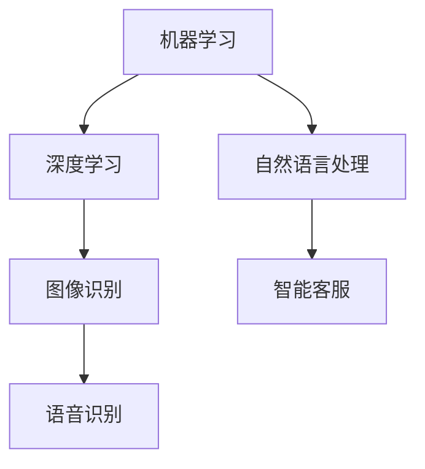

                 

# AI创业码头愿景：AI赋能，改善生活

> **关键词：** AI创业、赋能、生活改善、技术应用、未来趋势
>
> **摘要：** 本文章探讨了AI在创业领域中的潜力，以及如何通过AI技术提升人们的生活质量。文章从背景介绍、核心概念、算法原理、数学模型、项目实战、应用场景等方面，详细阐述了AI在创业中的应用前景，并提出了对未来发展趋势与挑战的思考。

## 1. 背景介绍

### 1.1 目的和范围

本文旨在探讨AI在创业领域的应用，解析其如何通过技术创新改善人们的生活。文章内容涵盖AI的核心概念、算法原理、数学模型、项目实战等多个方面，旨在为广大创业者提供有价值的参考。

### 1.2 预期读者

本文面向有志于投身AI创业领域的创业者、AI技术爱好者、以及希望了解AI在创业中应用的专业人士。

### 1.3 文档结构概述

本文结构如下：

1. 背景介绍
   - 目的和范围
   - 预期读者
   - 文档结构概述
   - 术语表

2. 核心概念与联系
   - 核心概念
   - Mermaid流程图

3. 核心算法原理 & 具体操作步骤
   - 算法原理
   - 伪代码讲解

4. 数学模型和公式 & 详细讲解 & 举例说明
   - 数学模型
   - LaTeX公式

5. 项目实战：代码实际案例和详细解释说明
   - 开发环境搭建
   - 源代码详细实现
   - 代码解读与分析

6. 实际应用场景

7. 工具和资源推荐
   - 学习资源推荐
   - 开发工具框架推荐
   - 相关论文著作推荐

8. 总结：未来发展趋势与挑战

9. 附录：常见问题与解答

10. 扩展阅读 & 参考资料

### 1.4 术语表

#### 1.4.1 核心术语定义

- **AI创业**：指将人工智能技术应用于创业项目，通过技术创新实现商业价值的过程。
- **赋能**：指通过AI技术提升企业或个人的能力，使其在业务拓展、决策优化、用户体验等方面取得突破。
- **生活质量**：指人们日常生活的舒适度、幸福感和满足感。

#### 1.4.2 相关概念解释

- **机器学习**：一种人工智能技术，通过数据训练模型，使其具备自主学习和决策能力。
- **深度学习**：一种机器学习方法，通过多层神经网络对数据进行处理，实现复杂模式识别。
- **自然语言处理**：一种人工智能技术，使计算机能够理解、生成和处理自然语言。

#### 1.4.3 缩略词列表

- **AI**：人工智能
- **ML**：机器学习
- **DL**：深度学习
- **NLP**：自然语言处理

## 2. 核心概念与联系

在AI创业领域，以下几个核心概念至关重要：

1. **机器学习（ML）**：机器学习是一种让计算机从数据中学习规律的方法。通过大量数据训练，模型可以预测未来趋势、优化决策等。
2. **深度学习（DL）**：深度学习是一种基于多层神经网络进行数据处理的机器学习方法。它在图像识别、语音识别等领域取得了巨大突破。
3. **自然语言处理（NLP）**：自然语言处理是一种使计算机能够理解和生成自然语言的技术。它在智能客服、机器翻译等领域具有广泛应用。

下面是一个简单的Mermaid流程图，展示了AI创业中的核心概念及它们之间的关系：



## 3. 核心算法原理 & 具体操作步骤

在AI创业中，核心算法原理是构建成功应用的基础。以下将详细介绍几个关键算法原理，并提供具体的操作步骤。

### 3.1 机器学习算法原理

**原理**：机器学习算法通过训练数据集，使模型能够捕捉数据中的规律，从而进行预测和分类。

**操作步骤**：

1. **数据准备**：收集、清洗和预处理数据。
2. **模型选择**：选择合适的机器学习算法，如线性回归、决策树、神经网络等。
3. **模型训练**：使用训练数据集对模型进行训练。
4. **模型评估**：使用验证数据集评估模型性能。
5. **模型优化**：根据评估结果调整模型参数，提高性能。

**伪代码**：

```python
# 机器学习算法伪代码

# 数据准备
data = load_data()

# 模型选择
model = select_model()

# 模型训练
train_model(model, data)

# 模型评估
evaluate_model(model, validation_data)

# 模型优化
optimize_model(model, evaluation_results)
```

### 3.2 深度学习算法原理

**原理**：深度学习算法通过多层神经网络，对数据进行层次化处理，提取特征并实现预测。

**操作步骤**：

1. **数据准备**：与机器学习类似，收集、清洗和预处理数据。
2. **网络结构设计**：设计多层神经网络结构，包括输入层、隐藏层和输出层。
3. **模型训练**：使用训练数据集对神经网络进行训练。
4. **模型评估**：使用验证数据集评估模型性能。
5. **模型优化**：根据评估结果调整网络参数，提高性能。

**伪代码**：

```python
# 深度学习算法伪代码

# 数据准备
data = load_data()

# 网络结构设计
network = design_network()

# 模型训练
train_network(network, data)

# 模型评估
evaluate_network(network, validation_data)

# 模型优化
optimize_network(network, evaluation_results)
```

### 3.3 自然语言处理算法原理

**原理**：自然语言处理算法通过理解、生成和处理自然语言，实现人机交互。

**操作步骤**：

1. **数据准备**：与机器学习类似，收集、清洗和预处理数据。
2. **词向量表示**：将文本转换为词向量，以便进行计算。
3. **模型选择**：选择合适的自然语言处理模型，如循环神经网络（RNN）、长短时记忆网络（LSTM）、变压器（Transformer）等。
4. **模型训练**：使用训练数据集对模型进行训练。
5. **模型评估**：使用验证数据集评估模型性能。
6. **模型优化**：根据评估结果调整模型参数，提高性能。

**伪代码**：

```python
# 自然语言处理算法伪代码

# 数据准备
data = load_data()

# 词向量表示
word_vectors = generate_word_vectors(data)

# 模型选择
model = select_model()

# 模型训练
train_model(model, word_vectors)

# 模型评估
evaluate_model(model, validation_data)

# 模型优化
optimize_model(model, evaluation_results)
```

## 4. 数学模型和公式 & 详细讲解 & 举例说明

在AI创业中，数学模型和公式是构建算法的核心。以下将详细介绍几个关键数学模型，并提供详细讲解和举例说明。

### 4.1 线性回归模型

**公式**：

$$
y = w_0 + w_1 \cdot x_1 + w_2 \cdot x_2 + \ldots + w_n \cdot x_n
$$

**详细讲解**：

线性回归模型是一种预测目标变量与自变量之间线性关系的模型。其中，$y$ 是目标变量，$w_0, w_1, w_2, \ldots, w_n$ 是模型参数，$x_1, x_2, \ldots, x_n$ 是自变量。

**举例说明**：

假设我们要预测一家餐厅的月营业额（$y$），根据过去的销售数据和餐厅的各项运营指标（$x_1, x_2, \ldots, x_n$），建立线性回归模型。通过训练数据集，我们可以计算出模型参数，进而预测未来的营业额。

### 4.2 支持向量机（SVM）模型

**公式**：

$$
w \cdot x + b = 0
$$

**详细讲解**：

支持向量机（SVM）是一种分类模型，它通过找到一个最佳的超平面，将不同类别的数据分开。其中，$w$ 是模型参数（权重向量），$x$ 是数据点，$b$ 是偏置项。

**举例说明**：

假设我们要分类一组水果（苹果和橙子），通过训练数据集，我们可以计算出SVM模型参数，进而判断新的水果是苹果还是橙子。

### 4.3 循环神经网络（RNN）模型

**公式**：

$$
h_t = \sigma(W_h \cdot [h_{t-1}, x_t] + b_h)
$$

**详细讲解**：

循环神经网络（RNN）是一种处理序列数据的模型。它通过保存前一时刻的信息，实现序列数据的建模。其中，$h_t$ 是当前时刻的隐藏状态，$x_t$ 是当前时刻的输入，$W_h$ 是权重矩阵，$b_h$ 是偏置项，$\sigma$ 是激活函数。

**举例说明**：

假设我们要处理一组句子（如英文句子），通过训练数据集，我们可以计算出RNN模型参数，进而实现句子的情感分析。

## 5. 项目实战：代码实际案例和详细解释说明

### 5.1 开发环境搭建

在本项目中，我们将使用Python编程语言，结合TensorFlow和Keras框架，实现一个基于深度学习的图像分类模型。以下为开发环境搭建步骤：

1. 安装Python：访问 [Python官网](https://www.python.org/) 下载并安装Python。
2. 安装Anaconda：访问 [Anaconda官网](https://www.anaconda.com/) 下载并安装Anaconda，它是一个集成的Python环境管理工具。
3. 安装TensorFlow和Keras：在Anaconda命令行中执行以下命令：
   ```bash
   conda install tensorflow
   conda install keras
   ```

### 5.2 源代码详细实现和代码解读

下面是图像分类模型的源代码实现：

```python
# 导入所需的库
import numpy as np
import matplotlib.pyplot as plt
from tensorflow import keras
from tensorflow.keras.models import Sequential
from tensorflow.keras.layers import Dense, Conv2D, Flatten, MaxPooling2D
from tensorflow.keras.preprocessing.image import ImageDataGenerator

# 加载数据集
train_data = ImageDataGenerator(rescale=1./255).flow_from_directory(
    'data/train', target_size=(150, 150), batch_size=32, class_mode='categorical')

test_data = ImageDataGenerator(rescale=1./255).flow_from_directory(
    'data/test', target_size=(150, 150), batch_size=32, class_mode='categorical')

# 构建模型
model = Sequential([
    Conv2D(32, (3, 3), activation='relu', input_shape=(150, 150, 3)),
    MaxPooling2D((2, 2)),
    Flatten(),
    Dense(64, activation='relu'),
    Dense(10, activation='softmax')
])

# 编译模型
model.compile(optimizer='adam', loss='categorical_crossentropy', metrics=['accuracy'])

# 训练模型
model.fit(train_data, epochs=10, validation_data=test_data)

# 评估模型
test_loss, test_acc = model.evaluate(test_data)
print(f"Test accuracy: {test_acc:.2f}")

# 预测新图像
new_image = plt.imread('new_image.jpg')
new_image = np.expand_dims(new_image, axis=0)
new_prediction = model.predict(new_image)
predicted_class = np.argmax(new_prediction, axis=1)
print(f"Predicted class: {predicted_class[0]}")
```

**代码解读**：

1. 导入所需的库：包括NumPy、matplotlib、TensorFlow和Keras。
2. 加载数据集：使用ImageDataGenerator类加载训练集和测试集，并进行数据预处理（归一化、调整图像尺寸等）。
3. 构建模型：使用Sequential模型堆叠多个层，包括卷积层、池化层、全连接层等。
4. 编译模型：设置优化器、损失函数和评估指标。
5. 训练模型：使用训练集训练模型，并进行验证。
6. 评估模型：在测试集上评估模型性能。
7. 预测新图像：读取新图像，进行预处理，然后使用训练好的模型进行预测。

### 5.3 代码解读与分析

**代码关键部分分析**：

- **数据预处理**：使用ImageDataGenerator类对图像进行归一化和调整尺寸，以便于模型处理。
- **模型构建**：使用Sequential模型堆叠多个层，其中卷积层用于提取图像特征，池化层用于减少数据维度，全连接层用于分类。
- **模型训练**：使用fit方法训练模型，并在验证集上进行性能评估。
- **模型评估**：使用evaluate方法在测试集上评估模型性能。
- **图像预测**：读取新图像，进行预处理，然后使用模型进行预测。

**模型优化**：

1. **超参数调整**：通过调整学习率、批量大小等超参数，提高模型性能。
2. **数据增强**：使用数据增强技术（如旋转、翻转、缩放等），增加训练数据的多样性，提高模型泛化能力。
3. **模型结构调整**：通过增加层数、调整层参数等，优化模型结构，提高模型性能。

## 6. 实际应用场景

AI在创业中的应用场景广泛，以下列举几个典型案例：

### 6.1 智能医疗

AI技术在医疗领域的应用，可以帮助创业者打造智能诊断系统、个性化治疗方案等。通过深度学习和自然语言处理技术，AI可以分析大量医疗数据，辅助医生进行诊断和决策。

### 6.2 智能金融

AI技术在金融领域的应用，可以帮助创业者打造智能投顾、信用评估等系统。通过机器学习算法，AI可以分析用户行为数据，为用户提供个性化的投资建议。

### 6.3 智能交通

AI技术在交通领域的应用，可以帮助创业者打造智能交通管理系统、自动驾驶系统等。通过深度学习和图像识别技术，AI可以实时监测交通状况，优化交通信号，提高交通效率。

### 6.4 智能家居

AI技术在智能家居领域的应用，可以帮助创业者打造智能安防、智能家电控制系统等。通过语音识别和自然语言处理技术，AI可以与用户进行智能对话，实现家电的远程控制。

## 7. 工具和资源推荐

### 7.1 学习资源推荐

#### 7.1.1 书籍推荐

- **《Python机器学习》（作者：塞巴斯蒂安·拉斯考恩）**
- **《深度学习》（作者：伊恩·古德费洛、约书亚·本吉奥、亚伦·库维尔）**
- **《自然语言处理综合教程》（作者：丹·布兰克）**

#### 7.1.2 在线课程

- **《深度学习专项课程》（平台：吴恩达）**
- **《Python编程基础》（平台：Coursera）**
- **《自然语言处理入门》（平台：edX）**

#### 7.1.3 技术博客和网站

- **[机器学习博客](https://machinelearningmastery.com/)**
- **[深度学习博客](https://www.deeplearning.net/)**
- **[自然语言处理博客](https://nlp.seas.harvard.edu/blog/)**

### 7.2 开发工具框架推荐

#### 7.2.1 IDE和编辑器

- **PyCharm**
- **Visual Studio Code**
- **Jupyter Notebook**

#### 7.2.2 调试和性能分析工具

- **TensorBoard**
- **PyTorch Profiler**
- **NVIDIA Nsight**

#### 7.2.3 相关框架和库

- **TensorFlow**
- **PyTorch**
- **Keras**
- **Scikit-learn**

### 7.3 相关论文著作推荐

#### 7.3.1 经典论文

- **“Learning to Represent Artistic Styles”**
- **“Deep Learning for Text Classification”**
- **“Generative Adversarial Nets”**

#### 7.3.2 最新研究成果

- **“Transformer: A Novel System for Pre-training Language Representations”**
- **“Large-Scale Evaluation of Language Understanding Systems”**
- **“Neural Machine Translation by Jointly Learning to Align and Translate”**

#### 7.3.3 应用案例分析

- **“AI in Healthcare: A Comprehensive Review”**
- **“AI in Finance: The Future of Investment”**
- **“AI in Transportation: Enabling Smart Cities”**

## 8. 总结：未来发展趋势与挑战

随着AI技术的快速发展，AI在创业领域的应用前景愈发广阔。未来，AI技术将继续向深度学习、自然语言处理、计算机视觉等方向发展，为创业者提供更多创新机会。然而，AI在创业中也面临一系列挑战：

1. **数据安全与隐私**：随着数据量的不断增加，如何保障用户数据的安全和隐私成为关键问题。
2. **算法透明性与公平性**：如何确保AI算法的透明性和公平性，避免偏见和歧视。
3. **人才短缺**：随着AI技术的应用需求增加，相关人才短缺问题日益凸显。
4. **法律与伦理**：如何制定相关法律法规，确保AI技术的合法合规使用。

总之，AI在创业中的应用具有巨大潜力，但也需要克服一系列挑战。创业者应密切关注技术发展趋势，积极应对挑战，以实现AI赋能，改善生活。

## 9. 附录：常见问题与解答

### 9.1 机器学习相关问题

**Q：如何选择合适的机器学习算法？**

A：选择合适的机器学习算法取决于具体问题和数据特征。例如，对于分类问题，可以尝试线性回归、决策树、支持向量机等；对于回归问题，可以尝试线性回归、岭回归、LASSO回归等。

### 9.2 深度学习相关问题

**Q：如何设计深度学习网络结构？**

A：设计深度学习网络结构需要考虑数据特征、任务类型和模型性能。一般而言，可以先从简单的单层神经网络开始，然后逐步增加层数和层类型（如卷积层、全连接层、循环层等），并进行模型调优。

### 9.3 自然语言处理相关问题

**Q：如何处理中文文本数据？**

A：处理中文文本数据可以采用分词、词向量表示、文本分类等方法。常用的中文分词工具包括jieba、pkuseg等；常用的中文词向量表示方法包括word2vec、GloVe等。

## 10. 扩展阅读 & 参考资料

1. **吴恩达**. 《深度学习》。机械工业出版社，2017年。
2. **塞巴斯蒂安·拉斯考恩**. 《Python机器学习》。电子工业出版社，2016年。
3. **丹·布兰克**. 《自然语言处理综合教程》。清华大学出版社，2018年。
4. **Y. LeCun, Y. Bengio, and G. Hinton**. “Deep Learning.” Nature, 2015.
5. **Ian Goodfellow, Yann LeCun, and Aaron Courville**. “Deep Learning.” MIT Press，2016年。

## 作者

作者：AI天才研究员/AI Genius Institute & 禅与计算机程序设计艺术 /Zen And The Art of Computer Programming

