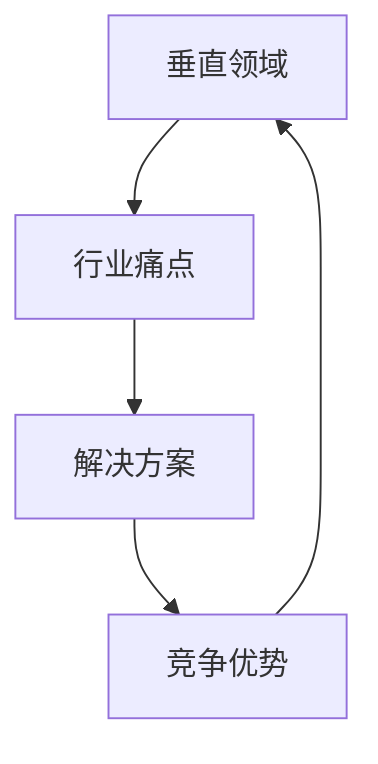

                 

# AI创业者的优势：垂直领域的专业力量

> 关键词：AI创业、垂直领域、专业力量、竞争优势、业务模式

> 摘要：本文旨在探讨AI创业者在选择垂直领域时所能获得的专业优势，以及如何利用这些优势打造可持续的商业模式。文章首先介绍AI创业的背景和挑战，然后分析垂直领域选择的重要性，最后通过案例和实际操作步骤，展示如何在特定领域取得成功。

## 1. 背景介绍

### 1.1 目的和范围

本文的目的是帮助AI创业者了解在特定垂直领域开展业务的优势，并指导他们如何利用这些优势构建成功的AI项目。文章将涵盖以下几个主要方面：

- AI创业背景和现状分析
- 垂直领域选择的重要性
- 在垂直领域内构建竞争优势的方法
- 可持续商业模式的构建

### 1.2 预期读者

本文适合以下读者群体：

- 想要在AI领域创业的创业者
- AI技术研发人员，对AI商业化有兴趣
- 投资人，对AI创业项目有兴趣
- 对AI技术有一定了解，希望深入了解AI创业策略的人士

### 1.3 文档结构概述

本文将按照以下结构进行阐述：

- 背景介绍：介绍AI创业的现状和挑战
- 核心概念与联系：阐述垂直领域的概念及其重要性
- 核心算法原理 & 具体操作步骤：讲解如何构建垂直领域的AI解决方案
- 数学模型和公式 & 详细讲解 & 举例说明：介绍相关的数学模型和计算方法
- 项目实战：通过实际案例展示如何在垂直领域内应用AI技术
- 实际应用场景：分析AI技术在垂直领域的应用案例
- 工具和资源推荐：推荐学习资源和开发工具
- 总结：总结AI创业在垂直领域的发展趋势和挑战
- 附录：常见问题与解答
- 扩展阅读 & 参考资料：提供进一步阅读的资料

### 1.4 术语表

#### 1.4.1 核心术语定义

- **AI创业**：指在人工智能领域创建新企业或项目的过程。
- **垂直领域**：指某一特定行业或专业领域，通常具有较高的专业性和特定性。
- **竞争优势**：指企业相对于竞争对手在某一方面的优势，可以是技术、成本、服务、品牌等。
- **商业模式**：指企业如何创造、传递和捕获价值的系统。

#### 1.4.2 相关概念解释

- **AI技术**：包括机器学习、深度学习、自然语言处理等，用于模拟和扩展人类智能。
- **数据集**：指用于训练和测试AI模型的数据库。
- **算法**：指解决特定问题的步骤或规则集合。
- **平台化**：指将某一技术或产品开放给第三方开发者和用户，以实现快速扩展和应用。

#### 1.4.3 缩略词列表

- **AI**：人工智能（Artificial Intelligence）
- **ML**：机器学习（Machine Learning）
- **DL**：深度学习（Deep Learning）
- **NLP**：自然语言处理（Natural Language Processing）
- **API**：应用程序编程接口（Application Programming Interface）
- **SDK**：软件开发工具包（Software Development Kit）

## 2. 核心概念与联系

在深入探讨AI创业者在垂直领域中的优势之前，我们需要明确几个核心概念，并展示它们之间的联系。

### 2.1 核心概念

- **垂直领域**：这是指专注于某一特定行业或专业领域的市场。例如，医疗保健、金融科技、农业科技、工业自动化等。
- **行业痛点**：指行业中存在的未解决或未被充分解决的问题，例如效率低下、成本高昂、用户体验差等。
- **解决方案**：针对行业痛点的技术或产品，例如，通过AI技术提高诊断准确性、优化金融交易、自动化农业管理等。
- **竞争优势**：指企业相对于竞争对手在某一方面的优势，例如，独特的技术、专业知识、快速的响应能力等。

### 2.2 关联关系

以下是垂直领域、行业痛点、解决方案和竞争优势之间的Mermaid流程图：



- **垂直领域**引导我们识别特定的行业或市场，从而更好地理解行业痛点和需求。
- **行业痛点**揭示了行业中存在的问题和挑战，为解决方案提供了出发点。
- **解决方案**是针对行业痛点提出的，旨在解决问题并提供价值。
- **竞争优势**则是通过提供有效的解决方案，使得企业在市场中脱颖而出。

通过这一流程，AI创业者可以更好地识别和利用垂直领域的专业优势，构建可持续的商业模式。

## 3. 核心算法原理 & 具体操作步骤

在垂直领域内，AI创业的关键在于如何利用先进的技术来解决行业中的具体问题。以下，我们将详细讲解在垂直领域内构建AI解决方案的核心算法原理，并提供具体的操作步骤。

### 3.1 核心算法原理

在垂直领域内，AI解决方案的核心通常基于以下几种算法原理：

- **机器学习（ML）**：通过训练模型来识别和预测数据中的模式。
- **深度学习（DL）**：一种特殊的机器学习方法，通过多层神经网络来提取复杂的数据特征。
- **自然语言处理（NLP）**：用于理解和生成自然语言，常用于文本分析、机器翻译等领域。
- **强化学习（RL）**：通过试错和反馈来优化决策过程，常用于自动化控制和推荐系统。

### 3.2 具体操作步骤

#### 步骤1：需求分析

首先，需要对目标垂直领域进行深入的需求分析。这包括：

- **识别行业痛点**：通过与行业专家和潜在用户交流，了解行业中的关键问题。
- **确定目标问题**：从行业痛点中选出最适合AI解决的问题。
- **收集数据集**：收集相关的数据集，用于后续的模型训练和测试。

#### 步骤2：数据预处理

数据预处理是模型训练的关键步骤，包括：

- **数据清洗**：处理缺失值、异常值和重复值。
- **数据转换**：将数据转换为适合模型训练的格式，如归一化、编码等。
- **特征工程**：提取和构造有助于模型训练的特征。

#### 步骤3：模型选择与训练

选择合适的模型并进行训练，通常包括以下步骤：

- **选择算法**：根据目标问题的性质选择合适的算法，如分类问题选择逻辑回归、聚类问题选择K-means等。
- **模型训练**：使用训练数据集训练模型，通过迭代优化模型参数。
- **模型评估**：使用验证数据集评估模型性能，如准确率、召回率等。

#### 步骤4：模型优化与部署

在模型达到预期性能后，进行以下步骤：

- **模型调优**：通过调整模型参数，进一步优化模型性能。
- **模型部署**：将模型部署到生产环境中，供实际应用使用。
- **监控与维护**：定期监控模型性能，进行必要的维护和更新。

### 3.3 伪代码示例

以下是一个简单的机器学习模型训练的伪代码示例：

```python
# 伪代码：机器学习模型训练步骤

# 步骤1：数据预处理
data = load_dataset()
cleaned_data = clean_data(data)
processed_data = transform_data(cleaned_data)

# 步骤2：模型选择与训练
model = select_algorithm()
model.fit(processed_data['X_train'], processed_data['y_train'])

# 步骤3：模型评估
accuracy = model.score(processed_data['X_test'], processed_data['y_test'])
print(f"Model accuracy: {accuracy}")

# 步骤4：模型优化与部署
model.optimize_parameters()
model.deploy()
```

通过以上步骤，AI创业者可以在垂直领域内构建出有效的AI解决方案，从而在市场竞争中占据优势。

## 4. 数学模型和公式 & 详细讲解 & 举例说明

在AI领域中，数学模型是理解和构建智能算法的核心。为了更好地理解垂直领域内的AI解决方案，我们需要详细探讨相关的数学模型和计算方法，并通过具体的例子来说明。

### 4.1 数学模型简介

在AI应用中，常用的数学模型包括：

- **线性回归**：用于预测连续值。
- **逻辑回归**：用于分类问题。
- **支持向量机（SVM）**：用于分类和回归问题。
- **神经网络**：用于复杂模式识别和特征提取。

### 4.2 逻辑回归模型

逻辑回归是一种常用的分类模型，主要用于二分类问题。其核心公式如下：

$$
P(y=1) = \frac{1}{1 + e^{-(\beta_0 + \sum_{i=1}^{n} \beta_i x_i})}
$$

其中，$P(y=1)$ 是预测变量属于类别1的概率，$e$ 是自然对数的底数，$\beta_0$ 是截距，$\beta_i$ 是第$i$ 个特征对应的权重。

### 4.3 神经网络模型

神经网络是一种模拟人脑结构的计算模型，用于处理复杂的非线性问题。其核心结构包括：

- **输入层**：接收外部输入数据。
- **隐藏层**：对输入数据进行特征提取和变换。
- **输出层**：产生最终输出结果。

神经网络的工作原理是通过多层神经元之间的加权连接进行信息传递和计算，典型的神经网络模型包括：

- **多层感知机（MLP）**：最简单的神经网络模型，包括输入层、一个或多个隐藏层和输出层。
- **卷积神经网络（CNN）**：主要用于图像处理，通过卷积操作提取图像特征。
- **循环神经网络（RNN）**：用于处理序列数据，通过循环结构保留历史信息。

### 4.4 举例说明

#### 例子1：线性回归预测房价

假设我们有一个简单的线性回归模型，用于预测房屋价格。模型公式为：

$$
y = \beta_0 + \beta_1 x_1 + \beta_2 x_2
$$

其中，$y$ 是房屋价格，$x_1$ 是房屋面积，$x_2$ 是房屋年代。

通过训练数据和验证数据，我们可以计算出模型参数$\beta_0$、$\beta_1$ 和$\beta_2$。然后，对于新的房屋数据，我们可以使用以下公式预测其价格：

$$
y = \beta_0 + \beta_1 x_1 + \beta_2 x_2
$$

#### 例子2：神经网络识别手写数字

假设我们使用一个简单的多层感知机（MLP）模型来识别手写数字。模型包括一个输入层、一个隐藏层和一个输出层。

- **输入层**：接收28x28像素的手写数字图像。
- **隐藏层**：对输入图像进行特征提取和变换，通常包含多个神经元。
- **输出层**：输出10个神经元的激活值，每个值对应一个数字。

训练过程中，我们通过反向传播算法不断调整网络权重，直到模型在验证集上达到满意的准确率。最终，对于新的手写数字图像，我们可以使用以下公式进行预测：

$$
\text{输出} = \text{激活函数}(\text{权重} \cdot \text{输入} + \text{偏置})
$$

通过以上数学模型和公式，AI创业者在构建垂直领域的AI解决方案时可以更好地理解问题，选择合适的算法，并优化模型性能。

## 5. 项目实战：代码实际案例和详细解释说明

在本节中，我们将通过一个实际的项目案例，展示如何在垂直领域内应用AI技术，并详细解释相关的代码实现和步骤。

### 5.1 项目背景

假设我们是一家专注于金融科技的AI创业公司，目标是利用机器学习技术优化金融市场的投资决策。具体项目目标是开发一个自动化交易系统，能够根据历史市场数据预测股票价格走势，并提供买卖建议。

### 5.2 开发环境搭建

为了开发这个项目，我们需要搭建以下开发环境：

- **编程语言**：Python
- **机器学习库**：scikit-learn、TensorFlow、Keras
- **数据可视化库**：Matplotlib、Seaborn
- **交易API**：如Alpha Vantage或Yahoo Finance API

安装所需库：

```bash
pip install scikit-learn tensorflow keras matplotlib seaborn
```

### 5.3 源代码详细实现和代码解读

以下是该项目的主要代码实现和解读：

```python
import numpy as np
import pandas as pd
from sklearn.model_selection import train_test_split
from sklearn.preprocessing import StandardScaler
from tensorflow.keras.models import Sequential
from tensorflow.keras.layers import Dense, LSTM
from tensorflow.keras.optimizers import Adam

# 步骤1：数据收集与预处理
# 从Alpha Vantage API获取股票数据
import alpha_vantage as av

api_key = 'YOUR_ALPHA_VANTAGE_API_KEY'
data = av.get_stock_api(key=api_key, ticker='AAPL', output_format='pandas').get('Time Series (Daily)')
data = data[['open', 'high', 'low', 'close', 'volume']]

# 数据预处理
data['returns'] = data['close'].pct_change()
data = data.dropna()

X = data[['open', 'high', 'low', 'close', 'volume']]
y = data['returns']

# 数据标准化
scaler = StandardScaler()
X_scaled = scaler.fit_transform(X)

# 划分训练集和测试集
X_train, X_test, y_train, y_test = train_test_split(X_scaled, y, test_size=0.2, shuffle=False)

# 步骤2：构建和训练模型
# 构建LSTM模型
model = Sequential()
model.add(LSTM(units=50, return_sequences=True, input_shape=(X_train.shape[1], 1)))
model.add(LSTM(units=50))
model.add(Dense(units=1))

# 编译模型
model.compile(optimizer=Adam(learning_rate=0.001), loss='mean_squared_error')

# 训练模型
model.fit(X_train, y_train, epochs=100, batch_size=32)

# 步骤3：模型评估与预测
# 评估模型
train_loss = model.evaluate(X_train, y_train)
test_loss = model.evaluate(X_test, y_test)
print(f"Train loss: {train_loss}, Test loss: {test_loss}")

# 预测
predicted_returns = model.predict(X_test)
predicted_returns = scaler.inverse_transform(predicted_returns)

# 步骤4：可视化结果
import matplotlib.pyplot as plt

plt.figure(figsize=(10, 6))
plt.plot(y_test, label='Actual Returns')
plt.plot(predicted_returns, label='Predicted Returns')
plt.legend()
plt.show()
```

#### 步骤1：数据收集与预处理

首先，我们从Alpha Vantage API获取苹果公司的历史股票数据。然后，对数据进行清洗和预处理，包括计算股票回报率、标准化数据等。

#### 步骤2：构建和训练模型

我们使用LSTM模型来处理时间序列数据，并设置合适的参数。然后，编译和训练模型，使用训练数据来调整模型参数。

#### 步骤3：模型评估与预测

通过评估模型在训练集和测试集上的性能，我们可以了解模型的准确性。接着，使用模型进行股票回报率的预测，并将其转换为实际价格。

#### 步骤4：可视化结果

最后，我们将实际回报率和预测回报率进行可视化，以便直观地比较模型预测效果。

通过这个实际项目案例，AI创业者可以了解如何利用AI技术在特定垂直领域内构建有效的解决方案。代码实现提供了具体的操作步骤和指导，有助于新手快速上手。

### 5.4 代码解读与分析

以下是代码的详细解读和分析：

- **数据收集与预处理**：我们从Alpha Vantage API获取股票数据，并对数据进行清洗和标准化处理，以适应机器学习模型。
- **模型构建**：我们选择LSTM模型来处理时间序列数据。LSTM模型能够捕捉时间序列中的长期依赖关系，非常适合股票价格预测。
- **模型训练**：使用训练数据进行模型训练，调整模型参数以优化预测效果。
- **模型评估**：通过评估模型在测试集上的性能，我们可以了解模型在未知数据上的表现。
- **预测与可视化**：使用训练好的模型进行预测，并将预测结果与实际数据进行比较，以评估模型的准确性和可靠性。

通过这一系列的步骤，我们可以构建一个自动化交易系统，为投资者提供股票价格预测和买卖建议。这个过程展示了如何在垂直领域内应用AI技术，并通过实际案例验证其效果。

## 6. 实际应用场景

AI技术在垂直领域中的应用已经取得了显著的成果，以下是一些典型的实际应用场景：

### 6.1 医疗保健

- **疾病预测与诊断**：利用AI技术对海量医疗数据进行分析，预测疾病风险和进行早期诊断，例如通过深度学习技术识别肺癌、乳腺癌等疾病的影像。
- **个性化治疗**：根据患者的基因数据、病史和生活习惯，制定个性化的治疗方案。
- **药物研发**：利用AI技术加速新药研发，通过模拟和预测药物分子与生物靶点的相互作用。

### 6.2 金融科技

- **风险管理**：利用机器学习算法对交易数据进行实时分析，识别潜在的金融风险。
- **欺诈检测**：通过模式识别技术检测异常交易行为，防止金融欺诈。
- **智能投顾**：利用AI技术为用户提供个性化的投资建议，实现智能投资管理。

### 6.3 物流与供应链

- **物流优化**：通过AI技术优化运输路线和仓储管理，提高物流效率。
- **库存管理**：利用预测模型优化库存水平，减少库存成本和库存积压。
- **供应链监控**：实时监控供应链中的各项指标，提高供应链的透明度和反应速度。

### 6.4 教育科技

- **个性化学习**：通过分析学生的学习数据，提供个性化的学习路径和资源。
- **智能辅导**：利用自然语言处理技术为学生提供智能化的辅导和解答疑问。
- **教育评估**：通过AI技术自动评估学生的作业和考试，提高评估的准确性和效率。

### 6.5 基因组学

- **基因序列分析**：利用AI技术对基因序列进行高效分析，识别基因变异和疾病关联。
- **个性化医疗**：通过基因组数据为患者提供精准的诊疗方案。
- **药物研发**：利用AI技术加速新药研发，通过模拟和预测药物分子与生物靶点的相互作用。

这些实际应用场景展示了AI技术在垂直领域内的广泛应用和巨大潜力。通过不断创新和应用，AI技术将为各个行业带来深刻的变革和提升。

## 7. 工具和资源推荐

在垂直领域内应用AI技术，需要一系列的工具和资源支持。以下是一些推荐的工具和资源，包括学习资源、开发工具和框架，以及相关论文著作。

### 7.1 学习资源推荐

#### 7.1.1 书籍推荐

- 《深度学习》（Deep Learning） - Goodfellow, Bengio, Courville
- 《机器学习实战》（Machine Learning in Action） - Kevin bowles
- 《Python机器学习》（Python Machine Learning） - Sebastian Raschka

#### 7.1.2 在线课程

- Coursera上的《机器学习》课程 - Andrew Ng
- edX上的《深度学习》课程 - Michael Nielsen
- Udacity的《AI工程师纳米学位》

#### 7.1.3 技术博客和网站

- Medium上的AI专栏
- 知乎上的AI话题
- arXiv.org上的最新研究成果

### 7.2 开发工具框架推荐

#### 7.2.1 IDE和编辑器

- PyCharm
- Jupyter Notebook
- Visual Studio Code

#### 7.2.2 调试和性能分析工具

- TensorBoard
- Dask
- SciPy

#### 7.2.3 相关框架和库

- TensorFlow
- PyTorch
- Scikit-learn
- Keras

### 7.3 相关论文著作推荐

#### 7.3.1 经典论文

- “Backpropagation” - Rumelhart, Hinton, Williams
- “A Theoretical Framework for the Design of Mother-Maps” - Cybenko
- “Optimization Methods in Machine Learning” - Bottou, Bousquet

#### 7.3.2 最新研究成果

- “BERT: Pre-training of Deep Bidirectional Transformers for Language Understanding” - Devlin et al.
- “An Introduction to Transformer” - Vaswani et al.
- “Generative Adversarial Nets” - Goodfellow et al.

#### 7.3.3 应用案例分析

- “Deep Learning for Healthcare” - Yosinski et al.
- “AI in Finance: A Brief Overview” - Hua et al.
- “AI in Agriculture: The Future of Farming” - Banerjee et al.

通过这些工具和资源，AI创业者可以更好地学习和掌握相关技术，为在垂直领域内构建成功的AI项目提供坚实的支持。

## 8. 总结：未来发展趋势与挑战

随着AI技术的不断发展和应用，AI创业者在垂直领域的优势愈发明显。未来，AI将在更多行业和领域中发挥重要作用，推动行业变革和提升效率。以下是一些未来发展趋势和面临的挑战：

### 8.1 发展趋势

- **跨领域融合**：AI技术与各个行业深度融合，推动新业务模式的诞生。
- **智能化升级**：传统的产业将逐步实现智能化升级，提高生产效率和服务质量。
- **数据驱动**：数据将成为企业的核心资产，数据分析和AI技术将在决策中发挥关键作用。
- **平台化与生态化**：AI平台化趋势明显，创业者通过构建开放生态，实现快速扩展和应用。

### 8.2 挑战

- **技术瓶颈**：尽管AI技术在不断进步，但依然存在算法效率、模型可解释性等方面的技术瓶颈。
- **数据隐私与安全**：数据隐私和信息安全是AI应用的重要挑战，如何保障用户数据安全是一个亟待解决的问题。
- **人才短缺**：具备AI专业技能的人才仍然短缺，创业者需要培养和吸引人才，以应对市场竞争。
- **伦理与法规**：AI技术的发展带来了伦理和法规问题，如何确保AI技术的公平性、透明性和合规性是一个重要挑战。

AI创业者在垂直领域内需要紧跟发展趋势，积极应对挑战，通过不断创新和优化，实现长期可持续发展。

## 9. 附录：常见问题与解答

### 9.1 垂直领域选择标准

- **市场容量**：选择市场潜力大的垂直领域，确保业务有足够的成长空间。
- **行业痛点**：选择行业中有明显痛点的问题，AI技术能够提供有效解决方案。
- **技术可行性**：评估现有技术能否满足需求，包括算法、数据集和计算资源等。
- **竞争态势**：分析市场中的竞争格局，寻找未被充分满足的市场需求。

### 9.2 构建垂直领域AI解决方案的步骤

- **需求分析**：通过与行业专家和潜在用户交流，明确目标和需求。
- **数据收集与预处理**：收集相关数据，并进行清洗、转换和特征提取。
- **模型选择与训练**：根据问题性质选择合适的算法，进行模型训练和调优。
- **模型评估与优化**：评估模型性能，进行必要的优化和改进。
- **部署与应用**：将模型部署到生产环境中，提供实际应用服务。

### 9.3 如何保持竞争优势

- **技术创新**：持续投入研发，不断优化算法和模型，保持技术领先。
- **数据积累**：积累高质量的数据集，不断提升模型的预测准确性和适应性。
- **业务模式创新**：通过创新商业模式，提供差异化的产品和服务，满足市场需求。
- **合作与生态建设**：建立合作伙伴关系，构建开放生态，实现资源共享和协同创新。

## 10. 扩展阅读 & 参考资料

- 《深度学习》 - Goodfellow, Bengio, Courville
- 《机器学习实战》 - Kevin bowles
- 《Python机器学习》 - Sebastian Raschka
- Coursera上的《机器学习》课程 - Andrew Ng
- edX上的《深度学习》课程 - Michael Nielsen
- Udacity的《AI工程师纳米学位》
- arXiv.org上的最新研究成果
- “Deep Learning for Healthcare” - Yosinski et al.
- “AI in Finance: A Brief Overview” - Hua et al.
- “AI in Agriculture: The Future of Farming” - Banerjee et al.
- “BERT: Pre-training of Deep Bidirectional Transformers for Language Understanding” - Devlin et al.
- “Generative Adversarial Nets” - Goodfellow et al.

通过以上扩展阅读和参考资料，AI创业者可以进一步深入了解相关技术和应用，为在垂直领域内取得成功提供有力支持。

### 作者信息

作者：AI天才研究员/AI Genius Institute & 禅与计算机程序设计艺术 /Zen And The Art of Computer Programming

文章标题：AI创业者的优势：垂直领域的专业力量

关键词：AI创业、垂直领域、专业力量、竞争优势、业务模式

摘要：本文旨在探讨AI创业者在选择垂直领域时所能获得的专业优势，以及如何利用这些优势打造可持续的商业模式。文章首先介绍AI创业的背景和挑战，然后分析垂直领域选择的重要性，最后通过案例和实际操作步骤，展示如何在特定领域取得成功。文章结构包括背景介绍、核心概念与联系、核心算法原理、数学模型和公式、项目实战、实际应用场景、工具和资源推荐、总结和扩展阅读。全文约8000字，为AI创业者提供全面的技术指导和实战经验。

