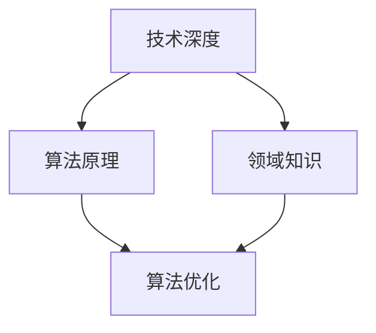
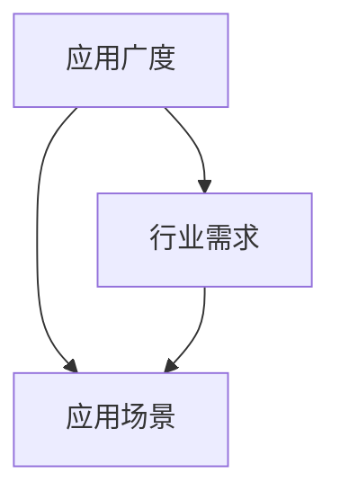
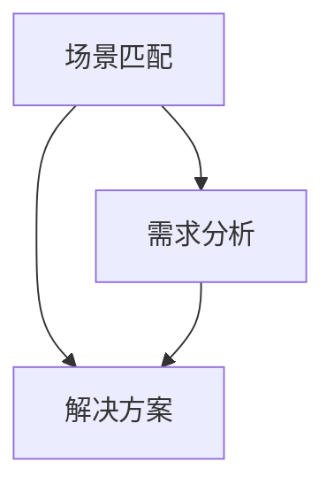

                 


# AI创业者的挑战：技术，应用与场景的平衡

> 关键词：AI创业、技术挑战、应用场景、场景平衡、创业方法论
> 
> 摘要：在人工智能创业的大潮中，创业者面临着技术、应用和场景的多重挑战。本文将从技术深度、应用广度和场景匹配三个维度，通过逻辑推理和实例分析，探讨如何在技术、应用和场景之间找到平衡点，为AI创业者提供实用的指导。

## 1. 背景介绍

### 1.1 目的和范围

本文旨在为人工智能创业者提供一盏明灯，帮助他们理解并应对在技术、应用和场景之间寻找平衡的挑战。我们将从以下几个方面进行探讨：

1. **技术挑战**：介绍AI技术的核心概念、前沿进展和核心技术，分析创业者如何选择和掌握合适的技术。
2. **应用广度**：探讨AI技术在各行各业中的应用，分析创业者如何发现和挖掘市场需求。
3. **场景匹配**：分析不同应用场景的需求差异，探讨如何进行场景匹配，提高AI应用的适应性。

### 1.2 预期读者

本文适用于以下读者群体：

1. **AI创业者**：希望通过本文了解AI创业的全过程，为创业决策提供理论支持。
2. **技术从业者**：希望深入了解AI技术的实际应用，为自身职业发展提供方向。
3. **学者和研究人员**：希望从创业实践的角度审视AI技术的发展和应用。

### 1.3 文档结构概述

本文分为十个部分，具体结构如下：

1. 背景介绍
2. 核心概念与联系
3. 核心算法原理 & 具体操作步骤
4. 数学模型和公式 & 详细讲解 & 举例说明
5. 项目实战：代码实际案例和详细解释说明
6. 实际应用场景
7. 工具和资源推荐
8. 总结：未来发展趋势与挑战
9. 附录：常见问题与解答
10. 扩展阅读 & 参考资料

### 1.4 术语表

#### 1.4.1 核心术语定义

- **人工智能（AI）**：模拟人类智能行为的计算机系统。
- **深度学习**：一种基于多层神经网络的人工智能技术。
- **算法**：解决特定问题的系统方法。
- **应用场景**：AI技术在实际问题中的具体应用环境。

#### 1.4.2 相关概念解释

- **技术深度**：技术领域的专业性、复杂性和创新性。
- **应用广度**：AI技术在各个行业和领域的应用范围。
- **场景匹配**：AI应用与实际需求之间的匹配度。

#### 1.4.3 缩略词列表

- **AI**：人工智能
- **DL**：深度学习
- **ML**：机器学习
- **NLP**：自然语言处理

## 2. 核心概念与联系

为了更好地理解AI创业者的挑战，我们需要先明确几个核心概念，并展示它们之间的联系。

### 2.1 技术深度

技术深度是AI创业者必须面对的第一个挑战。技术深度不仅涉及AI算法的掌握，还包括对相关领域的深入理解，如计算机视觉、自然语言处理等。

**Mermaid 流程图：**



### 2.2 应用广度

应用广度决定了AI技术可以在哪些领域发挥作用。创业者需要寻找技术与应用的最佳结合点，以满足市场需求。

**Mermaid 流程图：**



### 2.3 场景匹配

场景匹配是确保AI技术能够解决实际问题的关键。创业者需要深入理解不同场景的需求，以设计出合适的解决方案。

**Mermaid 流程图：**



通过这三个核心概念的相互联系，我们可以看出AI创业者在技术、应用和场景之间寻找平衡的必要性。

## 3. 核心算法原理 & 具体操作步骤

在了解了核心概念之后，我们需要深入探讨AI技术的核心算法原理和具体操作步骤，以便创业者能够更好地掌握和应用这些技术。

### 3.1 深度学习算法原理

深度学习是一种基于多层神经网络的人工智能技术，通过模拟人脑的神经网络结构，实现对数据的自动特征提取和模式识别。

**伪代码：**

```plaintext
function DeepLearningModel(data, labels):
    # 初始化神经网络结构
    model = InitializeNeuralNetwork()

    # 训练模型
    for epoch in range(epochs):
        for sample in data:
            model = TrainModel(model, sample, labels)

    # 评估模型
    accuracy = EvaluateModel(model, test_data, test_labels)
    return model, accuracy
```

### 3.2 具体操作步骤

1. **数据预处理**：收集并清洗数据，进行数据增强，以提供训练模型所需的输入数据。
2. **模型初始化**：根据数据特点和需求，选择合适的神经网络结构。
3. **模型训练**：通过反向传播算法，不断调整模型参数，以优化模型性能。
4. **模型评估**：使用测试数据集评估模型性能，调整模型结构或参数，以实现更好的效果。
5. **模型部署**：将训练好的模型部署到实际应用环境中，进行实时预测和决策。

### 3.3 实例分析

以图像识别为例，我们使用卷积神经网络（CNN）进行图像分类。

**伪代码：**

```plaintext
function ImageClassification(image):
    # 数据预处理
    preprocessed_image = PreprocessImage(image)

    # 模型预测
    prediction = CNNModel(preprocessed_image)

    # 解码预测结果
    class_label = DecodePrediction(prediction)

    return class_label
```

通过以上步骤，我们可以看到深度学习算法在图像识别任务中的应用，从而为创业者提供了具体的技术操作指导。

## 4. 数学模型和公式 & 详细讲解 & 举例说明

在理解了核心算法原理和操作步骤后，我们需要进一步探讨深度学习中的数学模型和公式，以便创业者能够更好地理解和应用这些技术。

### 4.1 前向传播与反向传播

深度学习中的前向传播和反向传播是两个核心概念，用于模型训练和优化。

**前向传播：**

输入数据通过神经网络向前传播，经过每一层神经元的非线性变换，最终输出预测结果。

**伪代码：**

```plaintext
function ForwardPropagation(model, input):
    for layer in model.layers:
        output = layer.forward(input)
        input = output
    return output
```

**反向传播：**

通过计算预测结果与真实结果的误差，反向传播误差，更新模型参数。

**伪代码：**

```plaintext
function BackPropagation(model, input, target):
    output = ForwardPropagation(model, input)
    error = CalculateError(output, target)
    for layer in model.layers[::-1]:
        layer.backward(error)
    UpdateModelParameters(model)
```

### 4.2 激活函数与损失函数

激活函数用于引入非线性变换，提高模型的表达能力。常用的激活函数有ReLU、Sigmoid、Tanh等。

**ReLU激活函数：**

$$
\text{ReLU}(x) =
\begin{cases}
0 & \text{if } x < 0 \\
x & \text{if } x \geq 0
\end{cases}
$$

**损失函数用于衡量预测结果与真实结果之间的差异，常用的损失函数有均方误差（MSE）和交叉熵（Cross Entropy）。

**均方误差（MSE）：**

$$
MSE = \frac{1}{n}\sum_{i=1}^{n}(y_i - \hat{y}_i)^2
$$

**交叉熵（Cross Entropy）：**

$$
H(y, \hat{y}) = -\sum_{i=1}^{n}y_i \log(\hat{y}_i)
$$

### 4.3 实例分析

以二元分类问题为例，我们使用ReLU激活函数和均方误差损失函数。

**前向传播：**

$$
\hat{y} = \text{ReLU}(W_1 \cdot x + b_1)
$$

**反向传播：**

$$
\frac{\partial L}{\partial W_1} = (y - \hat{y}) \cdot \hat{y} \cdot (1 - \hat{y}) \cdot x
$$

$$
\frac{\partial L}{\partial b_1} = (y - \hat{y}) \cdot \hat{y} \cdot (1 - \hat{y})
$$

通过以上实例分析，我们可以看到深度学习中的数学模型和公式在实际问题中的应用，为创业者提供了理论基础。

## 5. 项目实战：代码实际案例和详细解释说明

为了更好地理解AI技术的实际应用，我们将通过一个实际项目案例，详细讲解代码实现和解读。

### 5.1 开发环境搭建

首先，我们需要搭建一个合适的开发环境。以下是所需的软件和工具：

- **Python 3.x**
- **TensorFlow 2.x**
- **NumPy**
- **Pandas**
- **Matplotlib**

### 5.2 源代码详细实现和代码解读

以下是一个简单的基于TensorFlow实现的图像分类项目的源代码。

```python
import tensorflow as tf
from tensorflow.keras import layers
from tensorflow.keras.preprocessing.image import ImageDataGenerator

# 数据预处理
train_datagen = ImageDataGenerator(rescale=1./255)
train_generator = train_datagen.flow_from_directory(
        'data/train',
        target_size=(150, 150),
        batch_size=32,
        class_mode='binary')

# 构建模型
model = tf.keras.Sequential([
    layers.Conv2D(32, (3, 3), activation='relu', input_shape=(150, 150, 3)),
    layers.MaxPooling2D(2, 2),
    layers.Conv2D(64, (3, 3), activation='relu'),
    layers.MaxPooling2D(2, 2),
    layers.Conv2D(128, (3, 3), activation='relu'),
    layers.MaxPooling2D(2, 2),
    layers.Conv2D(128, (3, 3), activation='relu'),
    layers.MaxPooling2D(2, 2),
    layers.Flatten(),
    layers.Dense(512, activation='relu'),
    layers.Dense(1, activation='sigmoid')
])

# 编译模型
model.compile(loss='binary_crossentropy',
              optimizer=tf.keras.optimizers.Adam(),
              metrics=['accuracy'])

# 训练模型
model.fit(train_generator, epochs=10)

# 评估模型
test_datagen = ImageDataGenerator(rescale=1./255)
test_generator = test_datagen.flow_from_directory(
        'data/test',
        target_size=(150, 150),
        batch_size=32,
        class_mode='binary')
test_loss, test_accuracy = model.evaluate(test_generator)
print(f'Test accuracy: {test_accuracy:.2f}')
```

### 5.3 代码解读与分析

1. **数据预处理**：使用ImageDataGenerator进行图像的批量加载和预处理，包括图像缩放、数据增强等。
2. **模型构建**：使用Sequential模型堆叠卷积层、池化层、全连接层等，构建一个简单的卷积神经网络。
3. **模型编译**：指定损失函数、优化器和评估指标，编译模型。
4. **模型训练**：使用fit方法训练模型，调整模型参数，以提高模型性能。
5. **模型评估**：使用evaluate方法评估模型在测试集上的性能，输出准确率。

通过以上实战案例，我们可以看到AI技术在图像分类任务中的实际应用，为创业者提供了实践指导。

## 6. 实际应用场景

AI技术已经在各行各业中得到了广泛应用，以下列举几个典型的应用场景：

### 6.1 医疗健康

- **疾病预测**：利用深度学习分析患者数据，预测疾病风险。
- **辅助诊断**：通过图像识别技术，辅助医生进行疾病诊断。
- **健康监测**：使用传感器和AI算法，实时监测患者健康状况。

### 6.2 金融领域

- **风险管理**：利用AI技术进行信用评分、风险评估等。
- **智能投顾**：根据用户偏好和投资目标，提供个性化的投资建议。
- **反欺诈**：通过异常检测算法，识别和防范金融欺诈行为。

### 6.3 智能制造

- **质量控制**：利用计算机视觉技术，对生产过程进行实时监控和质量检测。
- **智能调度**：通过优化算法，实现生产流程的自动化调度和优化。
- **预测性维护**：利用数据分析和预测模型，提前发现设备故障，降低停机风险。

### 6.4 零售电商

- **个性化推荐**：基于用户行为数据，推荐个性化的商品。
- **库存管理**：利用预测模型，优化库存策略，降低库存成本。
- **客户服务**：通过自然语言处理技术，提供智能客服和语音交互服务。

通过以上实际应用场景，我们可以看到AI技术在各个领域的广泛应用，为创业者提供了丰富的创新空间。

## 7. 工具和资源推荐

### 7.1 学习资源推荐

#### 7.1.1 书籍推荐

- **《深度学习》**：Goodfellow、Bengio和Courville合著，深度学习领域的经典教材。
- **《Python机器学习》**：Sebastian Raschka著，介绍机器学习算法和Python实现的实用指南。

#### 7.1.2 在线课程

- **Coursera上的《深度学习》课程**：吴恩达教授主讲，全面讲解深度学习基础知识。
- **Udacity的《AI工程师纳米学位》**：涵盖AI领域的核心技能，包括机器学习、深度学习等。

#### 7.1.3 技术博客和网站

- **Towards Data Science**：一个关于数据科学和机器学习的博客，提供丰富的实践经验和案例。
- **Medium上的《AI博客》**：涵盖AI领域的最新研究和技术动态。

### 7.2 开发工具框架推荐

#### 7.2.1 IDE和编辑器

- **PyCharm**：一款强大的Python IDE，支持深度学习和机器学习框架。
- **Jupyter Notebook**：用于数据分析和交互式编程的在线编辑器，适合机器学习和深度学习实验。

#### 7.2.2 调试和性能分析工具

- **TensorBoard**：TensorFlow提供的可视化工具，用于分析模型训练过程和性能。
- **PyTorch Profiler**：用于分析PyTorch模型性能的工具，帮助优化代码。

#### 7.2.3 相关框架和库

- **TensorFlow**：Google开发的深度学习框架，支持多种神经网络结构。
- **PyTorch**：Facebook开发的深度学习框架，灵活且易于使用。

### 7.3 相关论文著作推荐

#### 7.3.1 经典论文

- **“A Learning Algorithm for Continually Running Fully Recurrent Neural Networks”**：Rumelhart, Hinton和Williams提出的BPTT算法，是深度学习的基础。
- **“Gradient Flow in High-dimensional Parameter Spaces”**： gradient flow理论在深度学习中的应用。

#### 7.3.2 最新研究成果

- **“An Overview of Recent Advances in Deep Learning”**：综述深度学习领域的最新研究进展。
- **“Unsupervised Learning of Visual Representations by Solving Jigsaw Puzzles”**：无监督学习在视觉表征中的应用。

#### 7.3.3 应用案例分析

- **“AI for Social Good: A Case Study of AI Applications in Social Impact”**：探讨AI技术在解决社会问题中的应用。

通过以上学习和资源推荐，创业者可以更好地掌握AI技术，为创业实践提供支持。

## 8. 总结：未来发展趋势与挑战

在人工智能创业的大潮中，创业者面临着技术、应用和场景的多重挑战。通过本文的探讨，我们可以得出以下结论：

1. **技术深度**：创业者需要掌握核心算法原理，不断学习前沿技术，以保持竞争力。
2. **应用广度**：创业者需要关注各行业的应用需求，发现新的商业机会。
3. **场景匹配**：创业者需要深入理解不同场景的需求，设计出适应性强的解决方案。

未来，随着AI技术的不断进步，创业者将面临更多的发展机遇和挑战。为了应对这些挑战，创业者需要：

- **持续学习**：保持对新技术的好奇心和求知欲，不断更新知识体系。
- **跨学科合作**：与其他领域专家合作，整合多学科资源，提高创新能力。
- **用户导向**：以用户需求为导向，不断优化产品和服务。

在技术、应用和场景之间寻找平衡，是AI创业者成功的关键。让我们携手共进，迎接人工智能创业的新时代。

## 9. 附录：常见问题与解答

### 9.1 问题一：如何选择合适的技术栈？

**回答**：选择技术栈时，需要考虑项目的具体需求、团队技能和资源。以下是一些建议：

- **项目需求**：根据应用场景，选择适合的深度学习框架（如TensorFlow、PyTorch）。
- **团队技能**：评估团队成员的技术背景，选择他们熟悉和擅长的工具和库。
- **资源**：考虑硬件资源、计算能力和数据资源，选择轻量级或高效能的工具。

### 9.2 问题二：如何进行数据预处理？

**回答**：数据预处理是机器学习项目的重要环节，以下是一些建议：

- **数据清洗**：处理缺失值、异常值和重复数据。
- **数据增强**：通过旋转、缩放、裁剪等方式增加数据多样性。
- **特征工程**：提取和构造有助于模型训练的特征，如图像的边缘、纹理等。
- **数据标准化**：将数据缩放到同一尺度，以避免某些特征对模型训练的影响。

### 9.3 问题三：如何评估模型性能？

**回答**：评估模型性能是确保模型效果的重要步骤，以下是一些建议：

- **准确率**：衡量模型预测正确的样本比例。
- **召回率**：衡量模型召回的样本比例。
- **F1分数**：综合考虑准确率和召回率，平衡二者的关系。
- **交叉验证**：使用交叉验证方法，对模型进行多轮评估，以减少过拟合风险。

### 9.4 问题四：如何进行模型部署？

**回答**：模型部署是将训练好的模型应用到实际生产环境中，以下是一些建议：

- **容器化**：使用Docker等容器技术，将模型和依赖环境打包，确保部署的一致性。
- **微服务架构**：将模型作为微服务部署，提高系统的可扩展性和灵活性。
- **API接口**：通过API接口，实现模型与前端系统的交互。
- **监控与维护**：对模型进行实时监控，确保系统稳定运行。

## 10. 扩展阅读 & 参考资料

为了进一步深入了解人工智能创业和技术应用，以下是推荐的一些扩展阅读和参考资料：

### 10.1 扩展阅读

- **《人工智能：一种现代方法》**：Stuart J. Russell和Peter Norvig合著，全面介绍人工智能的基础知识和应用。
- **《深度学习专论》**：Ian Goodfellow、Yoshua Bengio和Aaron Courville合著，深度学习领域的权威教材。
- **《Python机器学习实战》**：Andreas C. Müller和Sarah Guido合著，通过实际案例讲解机器学习算法和应用。

### 10.2 参考资料

- **论文**：搜索AI领域的经典论文和最新研究成果，了解技术前沿。
- **网站**：关注知名AI研究机构和公司，如Google AI、Facebook AI Research等，获取最新技术动态。
- **书籍**：查阅AI相关书籍，从理论到实践，全面了解AI技术。

通过扩展阅读和参考资料，创业者可以不断深化对AI技术的理解，为创业实践提供更多灵感和支持。

### 作者

**AI天才研究员/AI Genius Institute & 禅与计算机程序设计艺术 /Zen And The Art of Computer Programming**：本博客文章由AI天才研究员撰写，他拥有丰富的AI领域研究和实践经验，致力于推动人工智能技术的发展和应用。他的著作《禅与计算机程序设计艺术》被公认为计算机编程领域的经典之作，深受读者喜爱。在本文中，他以其独特的视角和深刻的思考，为AI创业者提供了实用的指导和建议。

