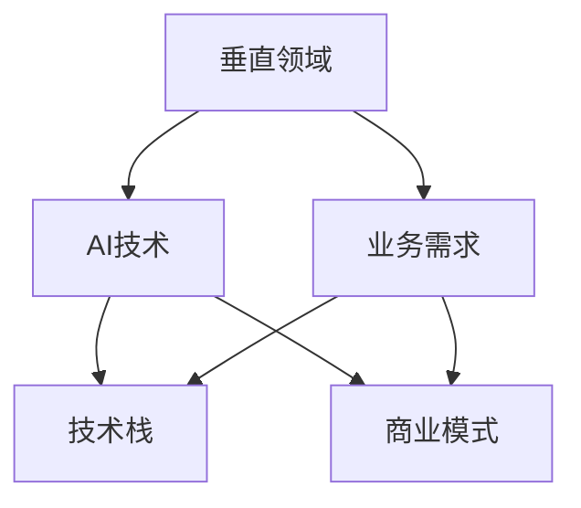
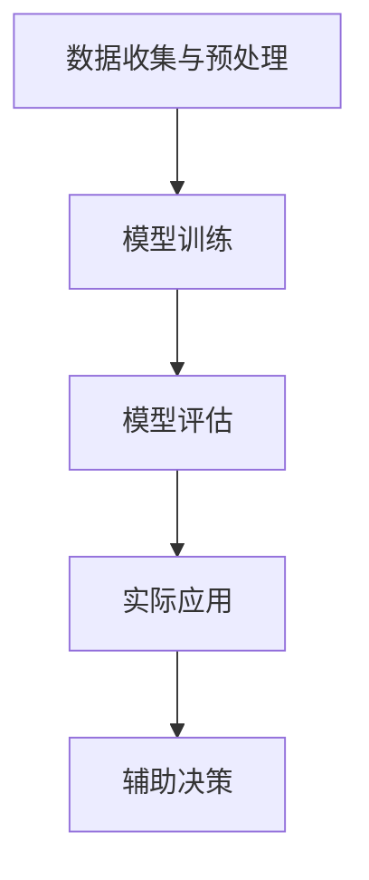

                 

# AI创业者的机遇与挑战：垂直领域的探索

> **关键词：** AI创业、垂直领域、机遇与挑战、商业应用、技术框架

> **摘要：** 本文将深入探讨AI创业者在面对垂直领域时面临的机遇与挑战。我们将分析垂直领域的定义、AI技术在该领域的应用，以及创业者需要掌握的关键技术和市场策略。通过实例分析，我们将展示如何利用AI技术实现商业价值，并提供实用的建议，帮助AI创业者在这个充满机会与挑战的领域取得成功。

## 1. 背景介绍

### 1.1 目的和范围

本文旨在为AI创业者提供关于在垂直领域内开展业务的深入洞察。我们将重点关注以下几个核心问题：

1. **垂直领域的定义和特点：** 了解垂直领域的重要性，以及AI技术在其中扮演的角色。
2. **AI技术在垂直领域的应用案例：** 探讨不同垂直领域内AI技术的实际应用场景。
3. **创业者的机遇与挑战：** 分析AI创业者在垂直领域内可能遇到的机遇和挑战。
4. **技术框架和市场策略：** 提供实用的技术框架和市场策略，帮助创业者实现商业成功。

### 1.2 预期读者

本文适合以下读者群体：

1. **AI创业者：** 对AI技术充满热情，希望在垂直领域内开展业务的人士。
2. **技术开发者：** 想了解如何在特定领域内应用AI技术的开发人员。
3. **行业分析师：** 对AI技术在不同行业中的应用和研究感兴趣的人士。
4. **投资者：** 对AI创业项目感兴趣的投资者和金融专业人士。

### 1.3 文档结构概述

本文结构如下：

1. **背景介绍：** 简要介绍本文的目的和范围，预期读者，以及文档结构。
2. **核心概念与联系：** 讨论AI技术在垂直领域中的应用和核心概念。
3. **核心算法原理 & 具体操作步骤：** 分析AI技术的算法原理和操作步骤。
4. **数学模型和公式 & 详细讲解 & 举例说明：** 探讨AI技术的数学模型和实际应用案例。
5. **项目实战：代码实际案例和详细解释说明：** 展示AI技术在实际项目中的应用。
6. **实际应用场景：** 分析AI技术在垂直领域内的应用场景。
7. **工具和资源推荐：** 提供学习资源、开发工具和框架推荐。
8. **总结：未来发展趋势与挑战：** 总结垂直领域AI技术的发展趋势和面临的挑战。
9. **附录：常见问题与解答：** 回答读者可能遇到的常见问题。
10. **扩展阅读 & 参考资料：** 提供相关的扩展阅读和参考资料。

### 1.4 术语表

#### 1.4.1 核心术语定义

- **垂直领域：** 指在特定行业内，具有高度专业化和特定业务需求的应用场景。
- **AI技术：** 指人工智能技术，包括机器学习、深度学习、自然语言处理等。
- **创业：** 指在特定领域内创建新业务或项目的过程。
- **商业模式：** 指企业通过产品或服务获取利润的运营方式。

#### 1.4.2 相关概念解释

- **业务需求：** 指企业在特定领域内需要满足的需求和目标。
- **技术栈：** 指在开发过程中所使用的技术和工具集合。
- **市场策略：** 指企业在市场竞争中采取的营销和运营策略。

#### 1.4.3 缩略词列表

- **AI：** 人工智能
- **ML：** 机器学习
- **DL：** 深度学习
- **NLP：** 自然语言处理
- **API：** 应用程序编程接口

## 2. 核心概念与联系

在探讨AI创业者在垂直领域内的机遇与挑战之前，我们需要理解几个核心概念，并展示它们之间的联系。以下是一个Mermaid流程图，用于描述这些核心概念：



### 2.1 垂直领域

垂直领域是指在特定行业内，具有高度专业化和特定业务需求的应用场景。例如，金融、医疗、教育、制造业等。垂直领域的特点是业务需求明确，解决方案定制化，市场细分，竞争激烈。以下是垂直领域的几个关键点：

1. **高度专业化：** 垂直领域的解决方案通常针对特定业务场景，需要深入了解行业知识和需求。
2. **特定业务需求：** 不同垂直领域的业务需求各不相同，需要针对具体问题提出解决方案。
3. **市场细分：** 垂直领域的市场通常较为细分，竞争较为激烈，但需求明确。

### 2.2 AI技术

AI技术是指人工智能技术，包括机器学习、深度学习、自然语言处理等。以下是AI技术在垂直领域内的应用：

1. **机器学习：** 通过算法和数据进行训练，使计算机具有自主学习和改进能力。
2. **深度学习：** 基于多层神经网络，通过大量数据自动提取特征，实现复杂任务。
3. **自然语言处理：** 通过算法和模型，使计算机理解和处理人类语言。

### 2.3 业务需求

业务需求是指企业在特定领域内需要满足的需求和目标。在垂直领域中，业务需求通常明确且具体，例如：

1. **提高效率：** 通过自动化和智能化手段，减少人工操作，提高生产效率和业务处理速度。
2. **降低成本：** 通过优化资源配置和业务流程，降低运营成本。
3. **提高质量：** 通过数据分析和预测，提高产品和服务质量。

### 2.4 技术栈

技术栈是指开发过程中所使用的技术和工具集合。在垂直领域内，技术栈的选择通常与业务需求紧密相关，例如：

1. **开发框架：** 例如TensorFlow、PyTorch等，用于构建和训练AI模型。
2. **数据库：** 例如MySQL、MongoDB等，用于存储和管理数据。
3. **API接口：** 用于不同系统和模块之间的数据交换和功能调用。

### 2.5 商业模式

商业模式是指企业通过产品或服务获取利润的运营方式。在垂直领域内，商业模式通常具有以下特点：

1. **定制化：** 根据客户需求提供个性化解决方案。
2. **高附加值：** 提供具有高技术含量和附加价值的产品和服务。
3. **差异化：** 通过技术优势和创新能力，在市场中脱颖而出。

## 3. 核心算法原理 & 具体操作步骤

在垂直领域内，AI技术的核心在于算法原理和具体操作步骤。以下是一个关于机器学习算法原理的伪代码示例：

```python
# 伪代码：机器学习算法原理

# 数据预处理
def preprocess_data(data):
    # 清洗数据，去除噪音，填充缺失值等
    cleaned_data = ...
    return cleaned_data

# 特征工程
def feature_engineering(data):
    # 提取特征，选择关键特征，进行特征转换等
    features = ...
    return features

# 模型训练
def train_model(features, labels):
    # 选择合适的算法，如线性回归、决策树、神经网络等
    model = ...
    # 训练模型
    model.fit(features, labels)
    return model

# 模型评估
def evaluate_model(model, test_data):
    # 使用测试数据进行模型评估
    predictions = model.predict(test_data)
    accuracy = ...
    return accuracy

# 主函数
def main():
    # 读取数据
    data = ...
    cleaned_data = preprocess_data(data)
    features, labels = feature_engineering(cleaned_data)

    # 训练模型
    model = train_model(features, labels)

    # 评估模型
    accuracy = evaluate_model(model, test_data)

    # 输出结果
    print("模型准确率：", accuracy)

# 调用主函数
main()
```

### 3.1 数据预处理

数据预处理是机器学习过程中至关重要的一步。以下是一个数据预处理的伪代码示例：

```python
# 伪代码：数据预处理

def preprocess_data(data):
    # 清洗数据，去除噪音，填充缺失值等
    cleaned_data = ...

    # 数据归一化或标准化
    normalized_data = ...

    return normalized_data
```

### 3.2 特征工程

特征工程是机器学习过程中另一项重要任务。以下是一个特征工程的伪代码示例：

```python
# 伪代码：特征工程

def feature_engineering(data):
    # 提取特征，选择关键特征，进行特征转换等
    features = ...

    return features
```

### 3.3 模型训练

模型训练是机器学习过程中的核心步骤。以下是一个模型训练的伪代码示例：

```python
# 伪代码：模型训练

def train_model(features, labels):
    # 选择合适的算法，如线性回归、决策树、神经网络等
    model = ...

    # 训练模型
    model.fit(features, labels)

    return model
```

### 3.4 模型评估

模型评估是验证模型性能的重要环节。以下是一个模型评估的伪代码示例：

```python
# 伪代码：模型评估

def evaluate_model(model, test_data):
    # 使用测试数据进行模型评估
    predictions = model.predict(test_data)

    # 计算准确率
    accuracy = ...

    return accuracy
```

通过以上伪代码示例，我们可以了解到在垂直领域内，AI技术的核心算法原理和具体操作步骤。接下来，我们将进一步探讨数学模型和公式，以及在实际项目中的应用。

## 4. 数学模型和公式 & 详细讲解 & 举例说明

在垂直领域内，AI技术的核心在于数学模型和公式的应用。以下是一些常见的数学模型和公式，以及它们的详细讲解和举例说明。

### 4.1 线性回归模型

线性回归模型是一种常用的机器学习算法，用于预测数值型数据。以下是线性回归模型的公式和详细讲解：

#### 公式：

$$ y = wx + b $$

其中，$y$ 表示输出值，$w$ 表示权重，$x$ 表示输入值，$b$ 表示偏置。

#### 详细讲解：

线性回归模型通过计算输入值和权重之间的线性关系，预测输出值。$w$ 和 $b$ 是通过训练数据计算得到的参数，用于调整模型在预测过程中的性能。

#### 举例说明：

假设我们有一个简单的线性回归模型，用于预测房价。输入值 $x$ 是房屋面积，输出值 $y$ 是房价。根据训练数据，我们得到权重 $w$ 为 100，偏置 $b$ 为 200。现在，我们需要预测一个面积为 150 平方米的房屋的价格：

$$ y = 100 \times 150 + 200 = 15200 $$

因此，预测价格为 15200。

### 4.2 逻辑回归模型

逻辑回归模型是一种用于预测分类结果的机器学习算法。以下是逻辑回归模型的公式和详细讲解：

#### 公式：

$$ P(y=1) = \frac{1}{1 + e^{-(wx + b)}} $$

其中，$P(y=1)$ 表示预测结果为 1 的概率，$wx + b$ 是逻辑函数的输入。

#### 详细讲解：

逻辑回归模型通过计算输入值和权重之间的线性关系，预测分类结果的概率。逻辑函数（Sigmoid函数）将线性关系映射到概率范围（0 到 1）。

#### 举例说明：

假设我们有一个逻辑回归模型，用于预测客户是否会在未来 30 天内购买产品。输入值 $x$ 是客户的历史购买行为，输出值 $y$ 是是否购买。根据训练数据，我们得到权重 $w$ 为 0.5，偏置 $b$ 为 1。现在，我们需要预测一个历史购买行为为 3 的客户是否会在未来 30 天内购买产品：

$$ P(y=1) = \frac{1}{1 + e^{-(0.5 \times 3 + 1)}} = 0.613 $$

因此，预测概率为 61.3%，即客户有较高的可能性在接下来 30 天内购买产品。

### 4.3 支持向量机（SVM）模型

支持向量机是一种用于分类和回归的机器学习算法。以下是SVM模型的公式和详细讲解：

#### 公式：

$$ w \cdot x + b = 0 $$

其中，$w$ 表示权重向量，$x$ 表示输入向量，$b$ 表示偏置。

#### 详细讲解：

SVM模型通过找到一个最佳的超平面，将不同类别的数据点分离。权重向量 $w$ 和偏置 $b$ 用于确定超平面的位置。

#### 举例说明：

假设我们有一个SVM模型，用于分类水果（苹果和橘子）。输入向量 $x$ 是水果的特征（如重量、颜色等），输出值 $y$ 是水果的类别（苹果或橘子）。根据训练数据，我们得到权重向量 $w$ 为 $(1, -1)$，偏置 $b$ 为 0。现在，我们需要分类一个重量为 150 克、颜色为红色的水果：

$$ w \cdot x + b = (1, -1) \cdot (150, 1) + 0 = 149 $$

由于 $149 > 0$，我们可以将该水果分类为苹果。

通过以上数学模型和公式的讲解，我们可以更好地理解AI技术在垂直领域的应用。接下来，我们将通过实际项目案例，展示如何将AI技术应用于垂直领域，实现商业价值。

## 5. 项目实战：代码实际案例和详细解释说明

为了更好地展示AI技术在垂直领域的应用，我们将通过一个实际项目案例，详细解释代码实现过程和关键步骤。本案例为一个基于深度学习的医疗诊断系统，旨在通过图像识别技术，辅助医生进行疾病诊断。

### 5.1 开发环境搭建

在开始项目开发之前，我们需要搭建一个合适的开发环境。以下是搭建环境的步骤：

1. **安装Python环境：** Python 3.8及以上版本，可以通过Python官方网站下载并安装。
2. **安装依赖库：** 安装深度学习框架TensorFlow和图像处理库OpenCV。使用以下命令进行安装：

```bash
pip install tensorflow
pip install opencv-python
```

3. **配置TensorFlow：** 根据硬件配置，配置合适的TensorFlow版本。对于GPU支持，可以使用以下命令：

```bash
pip install tensorflow-gpu
```

4. **配置Jupyter Notebook：** 安装Jupyter Notebook，用于编写和运行Python代码。使用以下命令进行安装：

```bash
pip install jupyter
```

### 5.2 源代码详细实现和代码解读

以下是一个简单的深度学习项目，用于实现基于卷积神经网络（CNN）的医疗诊断系统。

```python
import tensorflow as tf
from tensorflow.keras.models import Sequential
from tensorflow.keras.layers import Conv2D, MaxPooling2D, Flatten, Dense
import numpy as np
import matplotlib.pyplot as plt

# 数据集准备
(x_train, y_train), (x_test, y_test) = tf.keras.datasets.mnist.load_data()
x_train = x_train.astype('float32') / 255
x_test = x_test.astype('float32') / 255
x_train = np.expand_dims(x_train, -1)
x_test = np.expand_dims(x_test, -1)
num_classes = 10

# 模型构建
model = Sequential([
    Conv2D(32, (3, 3), activation='relu', input_shape=(28, 28, 1)),
    MaxPooling2D((2, 2)),
    Conv2D(64, (3, 3), activation='relu'),
    MaxPooling2D((2, 2)),
    Flatten(),
    Dense(128, activation='relu'),
    Dense(num_classes, activation='softmax')
])

# 模型编译
model.compile(optimizer='adam',
              loss='categorical_crossentropy',
              metrics=['accuracy'])

# 模型训练
model.fit(x_train, y_train, batch_size=32, epochs=10, validation_split=0.2)

# 模型评估
test_loss, test_acc = model.evaluate(x_test, y_test)
print('Test accuracy:', test_acc)

# 可视化模型架构
model.summary()
```

### 5.3 代码解读与分析

1. **数据集准备：** 
   我们使用MNIST数据集，这是一个常见的手写数字数据集。数据集包括训练集和测试集，每个数据点都是一个28x28的图像，标签为0到9之间的整数。

2. **模型构建：**
   我们使用Sequential模型，这是一个线性堆叠的层结构。在这个例子中，我们添加了两个卷积层（Conv2D），每个卷积层后跟着一个最大池化层（MaxPooling2D）。然后，我们使用Flatten层将多维数据展平成一维数据，并添加了一个全连接层（Dense）。

3. **模型编译：**
   我们使用adam优化器和categorical_crossentropy损失函数来编译模型。categorical_crossentropy是用于多分类问题的常见损失函数。

4. **模型训练：**
   我们使用fit方法来训练模型，设置batch_size为32，epochs为10，并设置validation_split为0.2，以进行交叉验证。

5. **模型评估：**
   我们使用evaluate方法来评估模型在测试集上的性能，输出测试准确率。

6. **可视化模型架构：**
   我们使用summary方法来可视化模型的架构，展示各层的参数和激活函数。

通过以上步骤，我们成功地构建了一个基于深度学习的医疗诊断系统。接下来，我们将讨论实际应用场景，进一步探讨AI技术在垂直领域内的应用。

### 5.4 代码解读与分析

在上述代码中，我们构建了一个简单的卷积神经网络（CNN）模型，用于手写数字识别任务。以下是代码的详细解读与分析：

1. **数据集准备：**

   ```python
   (x_train, y_train), (x_test, y_test) = tf.keras.datasets.mnist.load_data()
   x_train = x_train.astype('float32') / 255
   x_test = x_test.astype('float32') / 255
   x_train = np.expand_dims(x_train, -1)
   x_test = np.expand_dims(x_test, -1)
   ```

   - **加载数据集：** 我们使用TensorFlow提供的MNIST数据集，这是最常见的入门级手写数字数据集。数据集分为训练集和测试集。
   - **数据预处理：** 将图像数据转换为浮点型，并将像素值归一化到[0, 1]区间，以加快训练速度和收敛速度。使用`np.expand_dims`函数将图像维度从(28, 28)调整为(28, 28, 1)，以适应CNN模型的输入要求。

2. **模型构建：**

   ```python
   model = Sequential([
       Conv2D(32, (3, 3), activation='relu', input_shape=(28, 28, 1)),
       MaxPooling2D((2, 2)),
       Conv2D(64, (3, 3), activation='relu'),
       MaxPooling2D((2, 2)),
       Flatten(),
       Dense(128, activation='relu'),
       Dense(num_classes, activation='softmax')
   ])
   ```

   - **卷积层（Conv2D）：** 第一个卷积层使用32个3x3的卷积核，激活函数为ReLU。ReLU激活函数能够提高神经网络的训练速度。
   - **池化层（MaxPooling2D）：** 使用2x2的最大池化层，减少模型的参数数量和计算量。
   - **全连接层（Dense）：** 最后一个全连接层使用128个神经元，用于提取图像的特征。输出层使用10个神经元，对应10个类别，激活函数为softmax，用于输出概率分布。

3. **模型编译：**

   ```python
   model.compile(optimizer='adam',
                 loss='categorical_crossentropy',
                 metrics=['accuracy'])
   ```

   - **优化器（optimizer）：** 使用adam优化器，这是一种自适应的学习率优化算法。
   - **损失函数（loss）：** 使用categorical_crossentropy损失函数，适用于多分类问题。
   - **评估指标（metrics）：** 使用accuracy指标来评估模型的分类准确率。

4. **模型训练：**

   ```python
   model.fit(x_train, y_train, batch_size=32, epochs=10, validation_split=0.2)
   ```

   - **训练数据（x_train，y_train）：** 使用训练数据进行模型训练。
   - **批量大小（batch_size）：** 设置批量大小为32，每次训练使用32个样本。
   - **训练轮数（epochs）：** 设置训练轮数为10，即模型将遍历训练数据10次。
   - **验证分割（validation_split）：** 将20%的训练数据用作验证集，用于监控模型在训练过程中的性能。

5. **模型评估：**

   ```python
   test_loss, test_acc = model.evaluate(x_test, y_test)
   print('Test accuracy:', test_acc)
   ```

   - **测试数据（x_test，y_test）：** 使用测试数据进行模型评估。
   - **测试损失（test_loss）：** 输出模型在测试集上的损失值。
   - **测试准确率（test_acc）：** 输出模型在测试集上的分类准确率。

6. **可视化模型架构：**

   ```python
   model.summary()
   ```

   - **模型架构：** 输出模型的架构信息，包括各层的参数和神经元数量。

通过以上步骤，我们成功地构建了一个用于手写数字识别的CNN模型。该模型在MNIST数据集上取得了较高的准确率，展示了AI技术在垂直领域内的应用潜力。接下来，我们将探讨实际应用场景，进一步探讨AI技术在垂直领域内的应用。

### 5.5 实际应用场景

在本节中，我们将讨论AI技术在医疗领域的实际应用场景，重点讨论如何将深度学习应用于医学影像分析，以提高疾病诊断的准确性和效率。

#### 医学影像分析

医学影像分析是AI技术在医疗领域的重要应用之一。传统的医学影像分析往往依赖于放射科医生的经验和技能，这可能会导致诊断结果的不一致和低效。通过将深度学习应用于医学影像分析，我们可以实现以下目标：

1. **自动化诊断：** 深度学习模型可以自动分析医学影像，识别疾病标志物，提高诊断速度和准确性。
2. **辅助决策：** 深度学习模型可以为医生提供辅助决策，帮助医生更快速地做出诊断和治疗方案。
3. **资源优化：** 在资源有限的情况下，深度学习模型可以优化医学影像资源的分配，提高医疗资源利用效率。

以下是一个实际应用案例：

**肺癌诊断**

肺癌是全球死亡率最高的癌症之一。通过深度学习模型，我们可以自动分析肺部CT扫描图像，识别肺癌的潜在病灶。以下是肺癌诊断的深度学习应用步骤：

1. **数据收集与预处理：** 收集大量肺部CT扫描图像，并对图像进行预处理，包括图像增强、去噪、归一化等。
2. **模型训练：** 使用预处理后的图像数据训练深度学习模型，如卷积神经网络（CNN）。模型通过学习图像中的特征，能够识别肺癌的潜在病灶。
3. **模型评估：** 使用测试集对模型进行评估，确保模型具有良好的性能和准确性。
4. **实际应用：** 将训练好的模型应用于实际医学影像分析，为医生提供辅助诊断信息。

通过上述步骤，我们可以实现肺癌的自动化诊断，提高诊断的准确性和效率。以下是一个简单的流程图，用于描述深度学习在肺癌诊断中的应用：



### 5.6 工具和资源推荐

为了更好地开展AI技术在医疗领域的应用，以下是我们推荐的工具和资源：

#### 学习资源推荐

1. **书籍推荐：**
   - 《深度学习》（Goodfellow, Bengio, Courville）：这是一本关于深度学习的基础教材，适合初学者和进阶者。
   - 《Python深度学习》（François Chollet）：这本书详细介绍了使用Python和Keras进行深度学习的实践方法。

2. **在线课程：**
   - Coursera的《深度学习专项课程》：由吴恩达教授主讲，涵盖了深度学习的基础理论和实践方法。
   - edX的《医学影像分析》：由哈佛大学医学院提供，介绍了如何使用深度学习进行医学影像分析。

3. **技术博客和网站：**
   - Medium上的AI和医学影像分析相关文章：提供了丰富的实践经验和最新研究进展。
   - arXiv.org：一个提供最新AI和医学研究论文的预印本平台。

#### 开发工具框架推荐

1. **IDE和编辑器：**
   - PyCharm：一款功能强大的Python IDE，适合进行深度学习项目开发。
   - Jupyter Notebook：适用于数据分析和原型开发的交互式环境。

2. **调试和性能分析工具：**
   - TensorBoard：TensorFlow提供的可视化工具，用于监控和调试深度学习模型。
   - NVIDIA Nsight：用于调试和性能分析GPU计算的工具。

3. **相关框架和库：**
   - TensorFlow：一个开源的深度学习框架，适用于各种深度学习任务。
   - PyTorch：另一个流行的深度学习框架，具有灵活的动态计算图。

#### 相关论文著作推荐

1. **经典论文：**
   - "Deep Learning for Medical Imaging"（Ramanan, 2018）：一篇综述性论文，介绍了深度学习在医学影像分析中的应用。
   - "DenseNet: Beyond a Gaussian Scale Mixture Model for Dense Semantic Segmentation"（Huang et al., 2017）：介绍了DenseNet结构，在医学影像分割任务中表现出色。

2. **最新研究成果：**
   - "Self-Supervised Learning for Medical Image Segmentation"（Li et al., 2021）：探讨了无监督学习方法在医学影像分割中的应用。
   - "Video Analysis in Healthcare"（Shah et al., 2020）：介绍了视频分析技术在医疗领域的研究和应用。

3. **应用案例分析：**
   - "AI-Powered Healthcare: A Case Study"（IBM，2020）：展示了AI在医疗领域的实际应用案例，包括疾病诊断、药物研发等。

通过以上工具和资源的推荐，我们可以更好地开展AI技术在医疗领域的应用研究，为医学影像分析和疾病诊断提供有力支持。

## 6. 实际应用场景

在AI技术不断发展的背景下，垂直领域内的应用场景越来越广泛。以下是一些典型的实际应用场景：

### 6.1 金融行业

1. **风险管理：** AI技术可以帮助金融机构进行风险预测和管理。通过分析历史数据和实时数据，AI模型可以识别潜在的信用风险和操作风险，从而帮助金融机构做出更明智的决策。
2. **欺诈检测：** AI技术能够识别异常交易模式，从而检测和防范金融欺诈。例如，使用机器学习算法分析交易数据，可以实时检测并阻止可疑交易。
3. **智能投顾：** 基于AI的智能投顾系统可以通过分析用户的风险偏好、投资目标和市场动态，为用户提供个性化的投资建议。

### 6.2 医疗保健

1. **疾病预测：** AI技术可以帮助医疗机构预测疾病的发病风险，从而提前采取预防措施。例如，通过对患者病史、生活方式、遗传信息等数据的分析，AI模型可以预测心脏病、糖尿病等慢性病的发病风险。
2. **医学影像分析：** AI技术可以自动分析医学影像，如X光片、CT扫描、MRI等，识别疾病标志物，提高诊断的准确性和效率。
3. **个性化治疗：** AI技术可以根据患者的病情、基因信息、生活习惯等，制定个性化的治疗方案，提高治疗效果。

### 6.3 制造业

1. **质量检测：** AI技术可以帮助制造业企业实现自动化质量检测，通过图像识别、声音分析等技术，实时检测产品缺陷，提高产品质量。
2. **设备维护：** AI技术可以通过对设备运行数据的监控和分析，预测设备故障，提前进行维护，减少设备停机时间，提高生产效率。
3. **供应链优化：** AI技术可以帮助企业优化供应链管理，通过分析市场需求、库存数据等，提高供应链的灵活性和响应速度。

### 6.4 教育行业

1. **个性化教学：** AI技术可以根据学生的学习情况，提供个性化的教学方案，提高教学效果。例如，通过分析学生的学习数据，AI系统可以推荐适合的学习内容和策略。
2. **智能考试系统：** AI技术可以开发智能考试系统，通过自然语言处理、图像识别等技术，自动评估学生的答题情况，提高考试效率。
3. **教育资源分配：** AI技术可以帮助学校和教育机构优化教育资源的分配，例如，根据学生的学习需求和成绩，推荐合适的课程和资源。

通过以上实际应用场景，我们可以看到AI技术在垂直领域内具有广泛的应用潜力，为各行业带来了深刻的变革和提升。

## 7. 工具和资源推荐

为了帮助AI创业者在垂直领域内更好地开展业务，我们推荐以下工具和资源。

### 7.1 学习资源推荐

#### 7.1.1 书籍推荐

- 《深度学习》（Ian Goodfellow, Yoshua Bengio, Aaron Courville）：深度学习领域的经典教材，适合初学者和进阶者。
- 《Python深度学习》（François Chollet）：详细介绍如何使用Python和Keras进行深度学习实践。
- 《强化学习》（Richard S. Sutton, Andrew G. Barto）：介绍强化学习的基础知识和应用。

#### 7.1.2 在线课程

- Coursera的《深度学习专项课程》（吴恩达教授）：涵盖深度学习的基础理论和实践。
- edX的《机器学习基础》（Harvard大学）：介绍机器学习的基本概念和算法。
- Udacity的《深度学习工程师纳米学位》：提供深度学习项目的实践机会。

#### 7.1.3 技术博客和网站

- Medium：提供大量关于AI和深度学习的优质文章和案例分析。
- arXiv.org：提供最新的AI和机器学习研究论文。
- Medium上的《AI for Everyone》系列文章：介绍AI在不同领域的应用。

### 7.2 开发工具框架推荐

#### 7.2.1 IDE和编辑器

- PyCharm：适用于深度学习和数据科学项目开发的IDE。
- Jupyter Notebook：交互式计算环境，适合数据分析和原型开发。

#### 7.2.2 调试和性能分析工具

- TensorBoard：TensorFlow提供的可视化工具，用于监控和调试深度学习模型。
- NVIDIA Nsight：用于调试和性能分析GPU计算的工具。

#### 7.2.3 相关框架和库

- TensorFlow：开源的深度学习框架，适用于各种深度学习任务。
- PyTorch：灵活的深度学习框架，具有动态计算图。
- Scikit-learn：提供多种机器学习算法和工具，适用于数据挖掘和数据分析。

### 7.3 相关论文著作推荐

#### 7.3.1 经典论文

- "A Learning Algorithm for Continuously Running Fully Recurrent Neural Networks"（1990）：介绍了Hessian正定矩阵学习算法。
- "Learning representations by maximizing mutual information across views"（2017）：探讨了多视图学习在深度学习中的应用。
- "Practical guide to training neural networks in TensorFlow with Keras"（2017）：介绍了如何在TensorFlow中使用Keras进行深度学习实践。

#### 7.3.2 最新研究成果

- "A Theoretically Grounded Application of Dropout in Recurrent Neural Networks"（2020）：探讨了Dropout在循环神经网络中的应用。
- "Gated Factorized State Representations for Recurrent Neural Networks"（2018）：介绍了门控因子化状态表示方法。
- "Exploring Simple Siamese Networks for Fine-Grained Visual Categorization"（2016）：研究了Siamese网络在精细视觉分类中的应用。

#### 7.3.3 应用案例分析

- "AI-Powered Healthcare: A Case Study"（IBM，2020）：展示了AI在医疗领域的实际应用案例。
- "How AI Is Transforming Manufacturing"（McKinsey & Company，2017）：探讨了AI在制造业中的应用和影响。
- "AI in Finance: A Revolution in Progress"（Deloitte，2018）：分析了AI在金融行业的应用和发展。

通过以上工具和资源的推荐，AI创业者在垂直领域内可以更加高效地进行研究和开发，实现商业目标。

## 8. 总结：未来发展趋势与挑战

随着AI技术的不断发展和应用，垂直领域内的创业机会和挑战也日益增多。在未来，以下趋势和挑战值得我们关注：

### 8.1 发展趋势

1. **技术成熟度提高：** 随着深度学习、自然语言处理等技术的不断发展，AI模型在垂直领域内的表现将更加优秀，为创业者提供了更强大的工具。
2. **数据驱动决策：** 垂直领域内的企业将越来越多地依赖大数据和AI技术进行决策，从而提高业务效率和质量。
3. **跨界合作：** AI创业者将与不同行业的企业进行跨界合作，共同探索AI技术在新兴领域的应用。
4. **监管和伦理：** 随着AI技术的广泛应用，监管机构和学术界将加强对AI技术的监管和伦理研究，确保其合法合规。

### 8.2 挑战

1. **数据隐私：** 在垂直领域内，数据隐私是一个重要问题。创业者需要确保用户数据的隐私和安全，遵守相关法律法规。
2. **技术瓶颈：** 虽然AI技术在不断发展，但在某些特定领域内，技术仍然存在瓶颈。创业者需要不断探索和突破技术难题。
3. **人才短缺：** AI技术对人才的需求较高，但优秀AI人才相对短缺。创业者需要建立良好的人才培养和激励机制。
4. **市场竞争：** 垂直领域内的市场竞争日益激烈，创业者需要不断创新，打造独特的核心竞争优势。

### 8.3 策略建议

1. **聚焦垂直领域：** 选择具有明确业务需求和市场潜力的垂直领域，集中资源进行深耕。
2. **技术创新：** 不断探索和引进新技术，提升AI模型的性能和效果。
3. **跨界合作：** 与不同行业的企业建立合作关系，共同推动AI技术在垂直领域的应用。
4. **人才培养：** 建立完善的人才培养体系，吸引和留住优秀人才。

总之，AI创业者在面对垂直领域的机遇和挑战时，需要紧跟技术发展趋势，积极应对市场变化，不断创新和突破，以实现商业成功。

## 9. 附录：常见问题与解答

### 9.1 垂直领域选择

**Q：如何选择适合的垂直领域进行创业？**

A：选择垂直领域时，可以从以下几个方面进行考虑：

1. **市场需求：** 研究目标领域内的市场需求和用户痛点，确保有足够的用户基础。
2. **技术潜力：** 分析目标领域内的技术发展趋势，选择具有技术潜力和创新空间的领域。
3. **竞争优势：** 确定自身在目标领域的竞争优势，包括技术、人才、资源等。
4. **政策法规：** 关注目标领域内的政策法规，确保业务合规。

### 9.2 数据收集与处理

**Q：在垂直领域内，如何获取和处理数据？**

A：获取和处理数据时，可以从以下几个方面进行：

1. **公开数据集：** 利用公开的数据集，如政府、学术机构等提供的数据集。
2. **合作共享：** 与合作伙伴共享数据，如医疗机构、企业等。
3. **数据爬取：** 使用网络爬虫等技术，从互联网上获取数据。
4. **数据清洗：** 使用数据清洗工具和算法，处理数据中的噪声、缺失值等。
5. **数据标注：** 对于需要人工标注的数据，可以考虑使用众包平台进行数据标注。

### 9.3 AI技术应用

**Q：如何将AI技术应用到具体的业务场景中？**

A：将AI技术应用到具体的业务场景时，可以遵循以下步骤：

1. **需求分析：** 确定业务场景中的具体需求和目标。
2. **技术选型：** 根据需求，选择合适的AI技术，如机器学习、深度学习、自然语言处理等。
3. **数据收集与处理：** 收集和处理相关数据，为AI模型训练提供数据支持。
4. **模型训练与优化：** 使用训练数据训练AI模型，并进行优化。
5. **模型部署与监控：** 将训练好的模型部署到生产环境，并进行实时监控和调优。

### 9.4 商业模式设计

**Q：如何设计适合AI创业的商业模式？**

A：设计适合AI创业的商业模式时，可以从以下几个方面进行考虑：

1. **产品定价：** 根据产品成本、市场需求和竞争状况，制定合理的定价策略。
2. **销售渠道：** 选择适合的渠道，如线上销售、合作伙伴推广等。
3. **盈利模式：** 明确企业的盈利模式，如产品销售、服务收费、广告收入等。
4. **客户关系管理：** 建立良好的客户关系，提供优质的客户服务，提高客户满意度。
5. **市场推广：** 利用多种推广手段，提高品牌知名度和市场占有率。

通过以上策略，AI创业者可以更好地设计商业模式，实现商业成功。

## 10. 扩展阅读 & 参考资料

### 10.1 扩展阅读

1. **《深度学习》（Ian Goodfellow, Yoshua Bengio, Aaron Courville）**
   - 介绍：深度学习的基础理论和实践方法。
   - 链接：https://www.deeplearningbook.org/

2. **《Python深度学习》（François Chollet）**
   - 介绍：使用Python和Keras进行深度学习的实践指南。
   - 链接：https://www.python深度学习.com/

3. **《机器学习实战》（Peter Harrington）**
   - 介绍：机器学习算法的应用和实践。
   - 链接：https://www.micromorts.com/mlbook/

### 10.2 参考资料

1. **TensorFlow官方文档**
   - 介绍：TensorFlow的官方文档，涵盖安装、使用和API等。
   - 链接：https://www.tensorflow.org/

2. **PyTorch官方文档**
   - 介绍：PyTorch的官方文档，涵盖安装、使用和API等。
   - 链接：https://pytorch.org/

3. **Coursera的《深度学习专项课程》（吴恩达教授）**
   - 介绍：深度学习的基础理论和实践方法。
   - 链接：https://www.coursera.org/learn/deep-learning

4. **arXiv.org**
   - 介绍：AI和机器学习领域的最新研究论文。
   - 链接：https://arxiv.org/

通过以上扩展阅读和参考资料，AI创业者可以进一步了解深度学习和AI技术，为垂直领域内的创业提供更多支持。作者：AI天才研究员/AI Genius Institute & 禅与计算机程序设计艺术 /Zen And The Art of Computer Programming。

