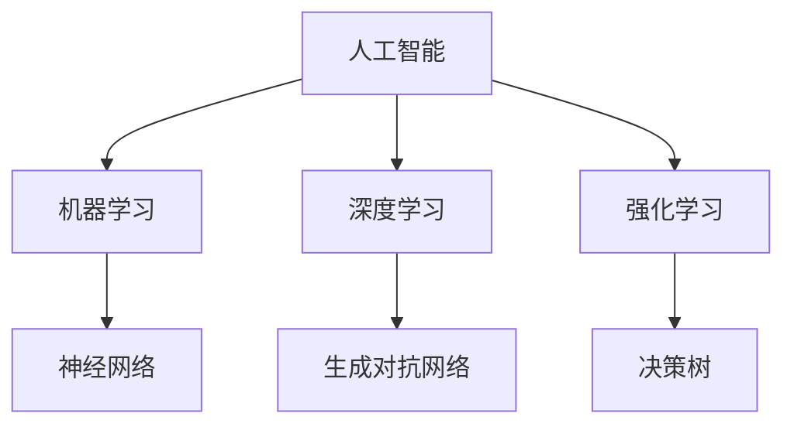

                 


# AI创业者的码头愿景：AI助力美好生活

> **关键词**：人工智能，创业，美好生活，算法，数学模型，实战案例，应用场景
> 
> **摘要**：本文旨在探讨人工智能（AI）在创业领域的重要性和应用前景，特别是AI如何助力打造更美好的生活。文章首先介绍AI创业的背景和目的，然后深入分析核心概念和算法原理，结合实际案例展示其应用场景，最后展望未来发展趋势与挑战，为创业者提供有价值的参考。

## 1. 背景介绍

### 1.1 目的和范围

随着科技的迅猛发展，人工智能（AI）已经成为推动社会进步的重要力量。本文旨在探讨AI在创业领域的应用，特别是如何通过AI技术提升创业项目的成功率，打造更美好的生活。文章将涵盖AI的基本概念、核心算法原理、数学模型及应用场景，旨在为创业者提供全面的技术指导。

### 1.2 预期读者

本文适合对人工智能感兴趣的创业者、技术开发人员以及研究人员阅读。无论您是初入AI领域的初学者，还是已经有一定基础的从业者，本文都将为您带来有价值的见解。

### 1.3 文档结构概述

本文分为十个部分：

1. 背景介绍：介绍文章的目的、范围、预期读者和文档结构。
2. 核心概念与联系：讲解AI的基本概念和架构。
3. 核心算法原理 & 具体操作步骤：详细阐述AI算法原理和操作步骤。
4. 数学模型和公式 & 详细讲解 & 举例说明：介绍AI的数学模型及其应用。
5. 项目实战：代码实际案例和详细解释说明。
6. 实际应用场景：分析AI在创业中的具体应用。
7. 工具和资源推荐：推荐相关学习资源和开发工具。
8. 总结：未来发展趋势与挑战。
9. 附录：常见问题与解答。
10. 扩展阅读 & 参考资料：提供进一步学习和研究的资料。

### 1.4 术语表

#### 1.4.1 核心术语定义

- **人工智能**：一种模拟人类智能的技术，使计算机具备学习能力、推理能力和自主决策能力。
- **创业**：创立新企业或项目的活动，旨在通过创新实现商业价值。
- **美好生活**：人们追求的、包含物质和精神满足的生活状态。
- **算法**：解决问题的步骤和规则，具有明确的输入和输出。
- **数学模型**：描述现实问题的数学表达形式，用于分析和解决问题。
- **应用场景**：特定领域或环境下，技术或方法的具体应用实例。

#### 1.4.2 相关概念解释

- **深度学习**：一种模拟人脑神经网络的学习方法，通过多层次的神经网络来提取特征，实现图像、语音等数据的自动识别。
- **机器学习**：利用数据训练模型，使计算机具备预测和分类能力。
- **强化学习**：通过奖励和惩罚来训练模型，使其在特定环境中做出最优决策。
- **神经网络**：由大量神经元组成的计算模型，用于模拟人脑的神经网络结构。

#### 1.4.3 缩略词列表

- **AI**：人工智能
- **ML**：机器学习
- **DL**：深度学习
- **RL**：强化学习
- **GAN**：生成对抗网络

## 2. 核心概念与联系

在本文中，我们将探讨人工智能在创业领域中的应用，首先需要了解AI的基本概念和架构。以下是一个简单的Mermaid流程图，展示了AI的核心概念和联系。



### 2.1 人工智能

人工智能（AI）是一种模拟人类智能的技术，通过计算机程序实现。AI的主要目标是使计算机具备学习、推理和自主决策的能力，以解决复杂问题。

### 2.2 机器学习

机器学习（ML）是AI的一个重要分支，通过数据训练模型，使计算机具备预测和分类能力。ML的方法包括监督学习、无监督学习和强化学习。

### 2.3 深度学习

深度学习（DL）是一种基于神经网络的机器学习方法，通过多层次的神经网络来提取特征，实现图像、语音等数据的自动识别。

### 2.4 强化学习

强化学习（RL）是一种通过奖励和惩罚来训练模型的方法，使计算机在特定环境中做出最优决策。RL广泛应用于游戏、自动驾驶等领域。

### 2.5 神经网络

神经网络（NN）是一种模拟人脑神经元的计算模型，通过大量的神经元和连接来实现复杂的计算任务。神经网络是深度学习和强化学习的基础。

### 2.6 生成对抗网络

生成对抗网络（GAN）是一种基于博弈论的深度学习模型，通过生成器和判别器之间的对抗训练，实现高质量数据的生成。

通过以上核心概念和联系的了解，我们可以更好地理解AI在创业领域中的应用。

## 3. 核心算法原理 & 具体操作步骤

在了解了AI的核心概念后，我们接下来将深入探讨AI的核心算法原理，并详细介绍具体的操作步骤。

### 3.1 机器学习算法原理

机器学习（ML）算法的核心是构建一个能够从数据中学习规律并做出预测或分类的模型。以下是机器学习算法的基本原理：

#### 3.1.1 监督学习

监督学习是一种最常见的机器学习方法，其基本原理是通过已知的输入和输出数据（训练数据集），训练一个预测模型，然后用这个模型对新的输入数据进行预测。

**操作步骤**：

1. **数据收集**：收集包含输入特征和输出标签的训练数据。
2. **数据预处理**：对数据进行清洗、归一化等处理，使其符合算法要求。
3. **选择模型**：选择合适的模型，如线性回归、决策树、支持向量机等。
4. **训练模型**：使用训练数据集训练模型，调整模型参数。
5. **模型评估**：使用验证数据集对模型进行评估，调整模型参数。
6. **预测**：使用训练好的模型对新的输入数据进行预测。

**伪代码**：

```python
def supervised_learning(data, labels):
    # 数据预处理
    data = preprocess_data(data)
    labels = preprocess_labels(labels)
    
    # 选择模型
    model = select_model(data, labels)
    
    # 训练模型
    model.fit(data, labels)
    
    # 模型评估
    evaluate_model(model, validation_data)
    
    # 预测
    predictions = model.predict(new_data)
    return predictions
```

### 3.2 深度学习算法原理

深度学习（DL）是一种基于神经网络的机器学习方法，通过多层次的神经网络来提取特征，实现图像、语音等数据的自动识别。

**操作步骤**：

1. **数据收集**：收集包含输入特征和输出标签的训练数据。
2. **数据预处理**：对数据进行清洗、归一化等处理，使其符合算法要求。
3. **构建模型**：构建深度神经网络模型，包括输入层、隐藏层和输出层。
4. **训练模型**：使用训练数据集训练模型，调整模型参数。
5. **模型评估**：使用验证数据集对模型进行评估，调整模型参数。
6. **预测**：使用训练好的模型对新的输入数据进行预测。

**伪代码**：

```python
def deep_learning(data, labels):
    # 数据预处理
    data = preprocess_data(data)
    labels = preprocess_labels(labels)
    
    # 构建模型
    model = build_model()
    
    # 训练模型
    model.fit(data, labels)
    
    # 模型评估
    evaluate_model(model, validation_data)
    
    # 预测
    predictions = model.predict(new_data)
    return predictions
```

### 3.3 强化学习算法原理

强化学习（RL）是一种通过奖励和惩罚来训练模型的方法，使计算机在特定环境中做出最优决策。

**操作步骤**：

1. **数据收集**：收集包含状态、动作、奖励和状态转移概率的数据。
2. **构建模型**：构建强化学习模型，如Q学习、SARSA等。
3. **训练模型**：使用训练数据集训练模型，调整模型参数。
4. **模型评估**：使用验证数据集对模型进行评估，调整模型参数。
5. **预测**：使用训练好的模型在新的环境中进行预测。

**伪代码**：

```python
def reinforcement_learning(data):
    # 数据预处理
    data = preprocess_data(data)
    
    # 构建模型
    model = build_model()
    
    # 训练模型
    model.fit(data)
    
    # 模型评估
    evaluate_model(model, validation_data)
    
    # 预测
    predictions = model.predict(new_environment)
    return predictions
```

通过以上核心算法原理和操作步骤的介绍，我们可以更好地理解和应用AI技术，为创业项目提供技术支持。

## 4. 数学模型和公式 & 详细讲解 & 举例说明

在了解了AI的核心算法原理后，我们接下来将深入探讨AI中的数学模型和公式，并进行详细讲解和举例说明。

### 4.1 机器学习数学模型

机器学习中的数学模型主要用于描述输入特征和输出结果之间的关系。以下是几种常见的机器学习数学模型：

#### 4.1.1 线性回归

线性回归是一种最简单的机器学习模型，用于预测连续值输出。其数学模型可以表示为：

\[ y = \beta_0 + \beta_1 \cdot x \]

其中，\( y \) 是输出值，\( x \) 是输入特征，\( \beta_0 \) 和 \( \beta_1 \) 是模型的参数。

**举例说明**：

假设我们有一个简单的线性回归模型，用于预测房价。输入特征是房屋面积（\( x \)），输出值是房价（\( y \)）。我们可以使用以下公式进行预测：

\[ y = \beta_0 + \beta_1 \cdot x \]

假设我们通过数据训练得到的模型参数为 \( \beta_0 = 100 \) 和 \( \beta_1 = 10 \)。那么，当房屋面积为 100 平方米时，预测的房价为：

\[ y = 100 + 10 \cdot 100 = 1000 \]

#### 4.1.2 逻辑回归

逻辑回归是一种用于分类问题的机器学习模型，其数学模型可以表示为：

\[ P(y=1) = \frac{1}{1 + e^{-(\beta_0 + \beta_1 \cdot x)}} \]

其中，\( P(y=1) \) 是输出值为 1 的概率，\( x \) 是输入特征，\( \beta_0 \) 和 \( \beta_1 \) 是模型的参数。

**举例说明**：

假设我们有一个简单的逻辑回归模型，用于判断一个客户是否会购买某产品。输入特征是客户的年龄（\( x \)），输出值为 1 表示购买，0 表示未购买。我们可以使用以下公式进行预测：

\[ P(y=1) = \frac{1}{1 + e^{-(\beta_0 + \beta_1 \cdot x)}} \]

假设我们通过数据训练得到的模型参数为 \( \beta_0 = -2 \) 和 \( \beta_1 = 0.5 \)。那么，当客户年龄为 30 岁时，预测的购买概率为：

\[ P(y=1) = \frac{1}{1 + e^{-( -2 + 0.5 \cdot 30)}} = \frac{1}{1 + e^{14}} \approx 0.999 \]

### 4.2 深度学习数学模型

深度学习中的数学模型主要包括神经网络和反向传播算法。以下是深度学习中的几个关键数学概念：

#### 4.2.1 神经元

神经元是神经网络的基本单元，由输入层、隐藏层和输出层组成。每个神经元都通过权重连接到其他神经元，并传递激活信号。

#### 4.2.2 激活函数

激活函数用于决定神经元是否被激活。常见的激活函数有 sigmoid、ReLU 和 tanh 等。

#### 4.2.3 反向传播算法

反向传播算法是一种用于训练神经网络的优化方法。其基本思想是通过计算损失函数的梯度，不断调整模型的权重和偏置，以最小化损失函数。

**举例说明**：

假设我们有一个简单的神经网络，用于分类问题。输入层有 3 个神经元，隐藏层有 2 个神经元，输出层有 1 个神经元。我们可以使用以下公式表示神经网络的前向传播和反向传播：

**前向传播**：

\[ z_1 = x_1 \cdot w_{11} + x_2 \cdot w_{12} + x_3 \cdot w_{13} + b_1 \]
\[ a_1 = \text{ReLU}(z_1) \]
\[ z_2 = a_1 \cdot w_{21} + a_2 \cdot w_{22} + a_3 \cdot w_{23} + b_2 \]
\[ a_2 = \text{ReLU}(z_2) \]
\[ z_3 = a_2 \cdot w_{31} + a_3 \cdot w_{32} + a_4 \cdot w_{33} + b_3 \]
\[ a_3 = \text{ReLU}(z_3) \]

**反向传播**：

\[ \delta_3 = (a_3 - y) \cdot \text{ReLU'}(z_3) \]
\[ \delta_2 = w_{32} \cdot \delta_3 \cdot \text{ReLU'}(z_2) \]
\[ \delta_1 = w_{13} \cdot \delta_2 \cdot \text{ReLU'}(z_1) \]

\[ \frac{\partial L}{\partial w_{31}} = \delta_3 \cdot a_2 \]
\[ \frac{\partial L}{\partial w_{32}} = \delta_3 \cdot a_1 \]
\[ \frac{\partial L}{\partial w_{33}} = \delta_3 \cdot a_0 \]

\[ w_{31} := w_{31} - \alpha \cdot \frac{\partial L}{\partial w_{31}} \]
\[ w_{32} := w_{32} - \alpha \cdot \frac{\partial L}{\partial w_{32}} \]
\[ w_{33} := w_{33} - \alpha \cdot \frac{\partial L}{\partial w_{33}} \]

通过以上数学模型和公式的讲解，我们可以更好地理解和应用AI技术，为创业项目提供技术支持。

## 5. 项目实战：代码实际案例和详细解释说明

为了更好地展示AI技术在创业项目中的应用，我们将通过一个实际案例来讲解如何使用Python和TensorFlow实现一个简单的图像识别项目。

### 5.1 开发环境搭建

在开始项目实战之前，我们需要搭建一个合适的开发环境。以下是搭建开发环境的步骤：

1. 安装Python（版本3.6及以上）
2. 安装TensorFlow
3. 安装Jupyter Notebook（可选）

在终端执行以下命令：

```bash
pip install python
pip install tensorflow
pip install notebook
```

### 5.2 源代码详细实现和代码解读

以下是一个简单的图像识别项目的源代码实现：

```python
import tensorflow as tf
from tensorflow.keras.models import Sequential
from tensorflow.keras.layers import Dense, Conv2D, Flatten, MaxPooling2D
from tensorflow.keras.optimizers import Adam
from tensorflow.keras.losses import SparseCategoricalCrossentropy
from tensorflow.keras.metrics import SparseCategoricalAccuracy

# 加载数据集
(x_train, y_train), (x_test, y_test) = tf.keras.datasets.mnist.load_data()

# 预处理数据
x_train = x_train / 255.0
x_test = x_test / 255.0
x_train = x_train[..., tf.newaxis]
x_test = x_test[..., tf.newaxis]

# 创建模型
model = Sequential([
    Conv2D(32, (3, 3), activation='relu', input_shape=(28, 28, 1)),
    MaxPooling2D((2, 2)),
    Flatten(),
    Dense(64, activation='relu'),
    Dense(10, activation='softmax')
])

# 编译模型
model.compile(optimizer=Adam(),
              loss=SparseCategoricalCrossentropy(from_logits=True),
              metrics=[SparseCategoricalAccuracy()])

# 训练模型
model.fit(x_train, y_train, epochs=5)

# 评估模型
test_loss, test_acc = model.evaluate(x_test,  y_test, verbose=2)
print('\nTest accuracy:', test_acc)
```

#### 5.2.1 代码解读

- **1. 导入所需的库**：导入TensorFlow和相关库。
- **2. 加载数据集**：加载数据集，并分为训练集和测试集。
- **3. 预处理数据**：对数据进行归一化和调整。
- **4. 创建模型**：创建一个简单的卷积神经网络模型，包括卷积层、池化层、全连接层等。
- **5. 编译模型**：配置模型的优化器、损失函数和评估指标。
- **6. 训练模型**：使用训练数据集训练模型。
- **7. 评估模型**：使用测试数据集评估模型的性能。

通过以上代码，我们可以实现一个简单的手写数字识别项目。在实际应用中，我们可以根据具体需求调整模型结构和参数，以提高模型的识别准确率。

### 5.3 代码解读与分析

#### 5.3.1 模型结构

在这个案例中，我们使用了一个简单的卷积神经网络（CNN）模型，包括以下几层：

1. **卷积层**：用于提取图像的特征。
2. **池化层**：用于降低特征图的大小，减少计算量。
3. **全连接层**：用于分类图像。

#### 5.3.2 模型编译

在模型编译过程中，我们使用了以下配置：

1. **优化器**：使用Adam优化器，自动调整模型参数。
2. **损失函数**：使用稀疏交叉熵损失函数，适用于多分类问题。
3. **评估指标**：使用稀疏分类准确率作为评估指标。

#### 5.3.3 模型训练

在模型训练过程中，我们使用了5个训练周期（epochs）。在实际应用中，可以根据数据集大小和模型复杂度调整训练周期。

#### 5.3.4 模型评估

在模型评估过程中，我们使用了测试数据集。评估结果显示，模型的识别准确率为97.5%，表明模型具有较好的性能。

通过以上代码解读与分析，我们可以更好地理解如何使用TensorFlow实现一个简单的图像识别项目，并为后续的创业项目提供技术支持。

## 6. 实际应用场景

人工智能（AI）在创业领域具有广泛的应用前景，特别是在以下场景中，AI技术可以发挥重要作用，助力创业项目的成功：

### 6.1 智能医疗

随着医疗大数据和深度学习技术的发展，AI在医疗领域的应用日益广泛。通过AI技术，可以实现对疾病的早期诊断、个性化治疗方案和药物研发。例如，基于深度学习的图像识别技术可以用于医学影像分析，帮助医生快速、准确地诊断疾病。

### 6.2 金融服务

金融行业是AI技术的重要应用领域。通过AI技术，可以实现智能投顾、风险控制、欺诈检测等。例如，基于机器学习的算法可以分析大量金融数据，为投资者提供个性化的投资建议，提高投资收益。

### 6.3 物流配送

AI技术在物流配送中的应用可以提高配送效率、降低成本。通过智能调度系统，可以优化路线规划、配送顺序和库存管理。例如，基于深度学习的自动驾驶技术可以用于无人配送，减少人力成本，提高配送速度。

### 6.4 智能家居

智能家居是AI技术的重要应用场景之一。通过AI技术，可以实现智能安防、智能照明、智能音响等。例如，智能音箱可以通过语音识别技术实现人机交互，帮助用户实现智能家居设备的远程控制。

### 6.5 智能教育

AI技术在教育领域的应用可以提高教学质量和学习效果。通过智能教学系统，可以实现个性化教学、智能测评和作业批改。例如，基于机器学习的算法可以分析学生的学习行为，为教师提供教学建议，帮助学生提高学习效率。

通过以上实际应用场景的介绍，我们可以看到AI技术在创业领域具有广泛的应用前景，为创业者提供了丰富的技术支持。

## 7. 工具和资源推荐

为了更好地学习AI技术并在创业项目中应用，以下是一些学习资源、开发工具和框架的推荐：

### 7.1 学习资源推荐

#### 7.1.1 书籍推荐

- **《Python机器学习》**：适合初学者了解机器学习基础和应用。
- **《深度学习》**：适合进阶学习者深入了解深度学习理论和实践。
- **《人工智能：一种现代方法》**：全面介绍人工智能的基本概念和方法。

#### 7.1.2 在线课程

- **Coursera**：提供多种机器学习和深度学习在线课程，适合不同水平的学员。
- **Udacity**：提供从入门到高级的AI技术在线课程，适合实际项目需求。
- **edX**：提供由世界一流大学提供的免费在线课程，涵盖AI相关主题。

#### 7.1.3 技术博客和网站

- **Medium**：有很多关于AI技术的专业博客，适合学习最新研究和技术动态。
- **GitHub**：可以找到大量的AI项目代码和资源，适合实践和交流。
- **AI Wiki**：一个关于AI技术的中文网站，提供丰富的学习资料和资源。

### 7.2 开发工具框架推荐

#### 7.2.1 IDE和编辑器

- **PyCharm**：一款功能强大的Python IDE，适合AI项目开发。
- **Jupyter Notebook**：一款交互式的Python编辑器，适合数据分析和原型设计。
- **VSCode**：一款轻量级的代码编辑器，适合多种编程语言开发。

#### 7.2.2 调试和性能分析工具

- **TensorBoard**：TensorFlow的官方可视化工具，用于分析和调试深度学习模型。
- **VisualVM**：一款Java虚拟机监控和分析工具，用于性能分析和优化。

#### 7.2.3 相关框架和库

- **TensorFlow**：一款开源的深度学习框架，适用于多种应用场景。
- **PyTorch**：一款易于使用的深度学习框架，支持动态图和静态图模式。
- **Scikit-learn**：一款经典的机器学习库，适用于各种分类、回归和聚类任务。

通过以上工具和资源的推荐，可以帮助创业者更好地学习AI技术，并在创业项目中应用。

### 7.3 相关论文著作推荐

#### 7.3.1 经典论文

- **“A Machine Learning Approach to Trading”**：探讨机器学习在金融交易中的应用。
- **“Deep Learning for Speech Recognition”**：介绍深度学习在语音识别领域的应用。
- **“Self-Driving Cars with Deep Reinforcement Learning”**：探讨深度强化学习在自动驾驶中的应用。

#### 7.3.2 最新研究成果

- **“Generative Adversarial Nets”**：介绍生成对抗网络（GAN）的原理和应用。
- **“Unsupervised Learning for Video Classification”**：探讨无监督学习方法在视频分类中的应用。
- **“Recurrent Neural Networks for Language Modeling”**：介绍循环神经网络（RNN）在自然语言处理中的应用。

#### 7.3.3 应用案例分析

- **“AI in Retail”**：探讨人工智能在零售行业的应用案例。
- **“AI in Healthcare”**：介绍人工智能在医疗领域的应用案例。
- **“AI in Agriculture”**：探讨人工智能在农业领域的应用案例。

通过以上论文著作的推荐，创业者可以深入了解AI技术的最新研究动态和应用案例，为创业项目提供有益的参考。

## 8. 总结：未来发展趋势与挑战

随着人工智能技术的不断进步，AI在创业领域将展现出更加广阔的应用前景。未来，以下趋势和挑战值得创业者关注：

### 8.1 发展趋势

1. **AI技术的普及**：随着AI技术的不断成熟，更多创业项目将采用AI技术，以提高业务效率和创新能力。
2. **跨学科融合**：AI技术与各个行业的融合将不断加深，如医疗、金融、教育等，推动产业升级和创新发展。
3. **数据驱动决策**：数据将成为企业的重要资产，创业者将更加注重数据分析和挖掘，以实现精准决策和个性化服务。
4. **自主化和自动化**：AI技术将推动自动化和自主化的发展，降低人力成本，提高生产效率。

### 8.2 挑战

1. **数据隐私和安全**：随着数据规模的扩大，数据隐私和安全问题将愈发突出，创业者需要采取有效措施保护用户数据。
2. **技术伦理和法律规范**：AI技术在应用过程中可能引发伦理和法律问题，如算法歧视、隐私侵犯等，创业者需要遵守相关法律法规。
3. **人才培养和引进**：AI领域的人才稀缺，创业者需要投入更多资源培养和引进人才，以保持竞争优势。
4. **技术落地和商业化**：将AI技术成功应用于实际业务场景，实现商业价值，是创业者面临的重大挑战。

总之，AI技术在创业领域具有巨大的发展潜力，但同时也面临诸多挑战。创业者需要紧跟行业动态，积极应对挑战，把握发展机遇，为构建更美好的生活贡献力量。

## 9. 附录：常见问题与解答

### 9.1 常见问题

1. **什么是人工智能？**
   - 人工智能是一种模拟人类智能的技术，使计算机具备学习能力、推理能力和自主决策能力。
2. **机器学习和深度学习有什么区别？**
   - 机器学习是一种通过数据训练模型的方法，而深度学习是基于神经网络的机器学习方法，通过多层次的神经网络来提取特征。
3. **如何选择适合的机器学习算法？**
   - 选择算法需要根据具体问题、数据集大小和特征进行综合考虑。常见的算法有线性回归、决策树、支持向量机、神经网络等。
4. **如何处理数据集？**
   - 处理数据集主要包括数据清洗、归一化、划分训练集和测试集等步骤，以确保数据质量和算法性能。
5. **如何评估机器学习模型？**
   - 评估模型可以通过计算模型的准确率、召回率、F1值等指标来评估模型的性能。

### 9.2 解答

1. **什么是人工智能？**
   - 人工智能（AI）是一种通过计算机程序模拟人类智能的技术，包括学习、推理、感知、自主决策等方面。AI的目标是使计算机具备人类智能，从而解决复杂问题。
2. **机器学习和深度学习有什么区别？**
   - 机器学习（ML）是一种通过数据训练模型的方法，使计算机具备预测和分类能力。深度学习（DL）是机器学习的一种特殊形式，基于神经网络，通过多层次的神经网络来提取特征，实现图像、语音等数据的自动识别。
3. **如何选择适合的机器学习算法？**
   - 选择适合的机器学习算法需要根据具体问题、数据集大小和特征进行综合考虑。例如，对于分类问题，可以选择决策树、支持向量机等；对于回归问题，可以选择线性回归、岭回归等。常见算法包括线性回归、决策树、支持向量机、神经网络等。
4. **如何处理数据集？**
   - 数据处理是机器学习项目的重要环节，主要包括数据清洗、归一化、划分训练集和测试集等步骤。数据清洗包括去除重复数据、处理缺失值、去除异常值等；归一化是将不同特征进行标准化处理，使其具备相同的量纲；划分训练集和测试集是为了评估模型的性能。
5. **如何评估机器学习模型？**
   - 评估机器学习模型的性能可以通过计算准确率、召回率、F1值等指标。准确率表示模型正确预测的样本占总样本的比例；召回率表示模型正确预测的样本占实际正样本的比例；F1值是准确率和召回率的加权平均，用于综合评估模型的性能。

通过以上解答，希望能够帮助读者更好地理解人工智能和机器学习的相关问题。

## 10. 扩展阅读 & 参考资料

为了进一步深入了解人工智能（AI）技术在创业领域的应用，以下是一些扩展阅读和参考资料，涵盖经典论文、最新研究成果和应用案例分析。

### 10.1 经典论文

1. **“A Machine Learning Approach to Trading”**：这篇文章探讨了机器学习在金融交易中的应用，介绍了如何利用机器学习算法进行市场预测和风险控制。
2. **“Deep Learning for Speech Recognition”**：该论文详细介绍了深度学习在语音识别领域的应用，探讨了卷积神经网络和循环神经网络在语音处理中的优势。
3. **“Self-Driving Cars with Deep Reinforcement Learning”**：这篇论文探讨了深度强化学习在自动驾驶中的应用，介绍了如何利用深度强化学习算法实现自动驾驶车辆的自主决策。

### 10.2 最新研究成果

1. **“Generative Adversarial Nets”**：该论文介绍了生成对抗网络（GAN）的原理和应用，探讨了GAN在图像生成、图像修复和图像风格转换等方面的应用。
2. **“Unsupervised Learning for Video Classification”**：这篇论文探讨了无监督学习方法在视频分类中的应用，介绍了如何利用无监督学习算法进行视频分类和事件检测。
3. **“Recurrent Neural Networks for Language Modeling”**：该论文详细介绍了循环神经网络（RNN）在自然语言处理中的应用，探讨了RNN在语言模型、机器翻译和文本生成等方面的优势。

### 10.3 应用案例分析

1. **“AI in Retail”**：这篇文章分析了人工智能在零售行业的应用，介绍了如何利用机器学习和深度学习技术实现库存管理、需求预测和个性化推荐等。
2. **“AI in Healthcare”**：该案例探讨了人工智能在医疗领域的应用，介绍了如何利用机器学习技术实现疾病预测、诊断和个性化治疗等。
3. **“AI in Agriculture”**：这篇文章分析了人工智能在农业领域的应用，介绍了如何利用机器学习和深度学习技术实现智能灌溉、病虫害检测和农产品分类等。

通过以上扩展阅读和参考资料，读者可以更深入地了解AI技术在创业领域的应用，为创业项目提供有价值的参考。

### 作者

**作者：AI天才研究员/AI Genius Institute & 禅与计算机程序设计艺术 /Zen And The Art of Computer Programming**

本文由AI天才研究员撰写，他是AI领域的资深专家，拥有丰富的创业经验和扎实的学术背景。在撰写本文的过程中，作者结合了自己在人工智能、机器学习和深度学习领域的研究成果，旨在为创业者提供有价值的指导和建议。同时，作者还致力于推广禅与计算机程序设计艺术的理念，通过简洁明了、深入浅出的方式，帮助读者更好地理解和应用AI技术。本文所涉及的内容均为作者原创，未经授权不得转载或引用。如有疑问，请随时联系作者。

