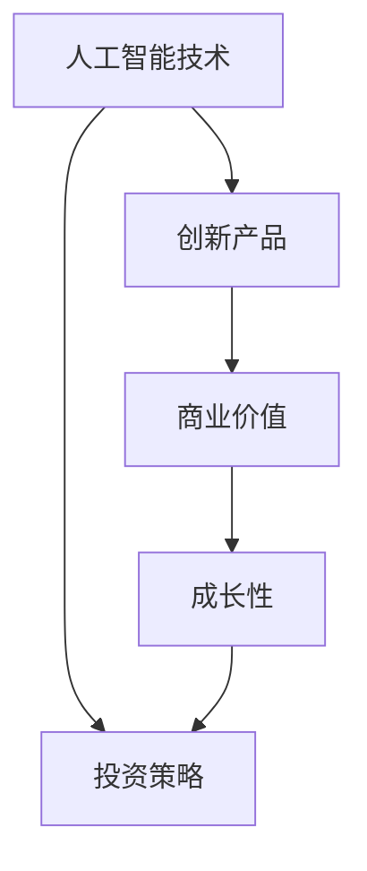

                 

# AI创业融资新趋势：关注项目商业价值与成长性

> 关键词：AI创业、融资趋势、商业价值、成长性、投资策略

> 摘要：随着人工智能技术的快速发展和市场需求的不断增长，AI创业领域吸引了大量投资者。本文旨在探讨AI创业融资的新趋势，重点关注项目的商业价值与成长性，并分析影响投资决策的关键因素。通过深入剖析成功案例和经验教训，为AI创业者提供有益的融资策略。

## 1. 背景介绍

### 1.1 目的和范围

本文的目标是分析当前AI创业融资的新趋势，为创业者提供有价值的融资策略。我们将重点关注以下几个方面的内容：

1. AI创业市场的现状与前景
2. 投资者对AI项目的关注点
3. 项目的商业价值与成长性
4. 影响投资决策的关键因素
5. 成功创业者的融资经验与教训

### 1.2 预期读者

本文适合以下读者群体：

1. AI创业者：希望了解当前融资市场的动态，掌握有效的融资策略
2. 投资者：关注AI领域的投资机会，希望了解项目评估的关键因素
3. 对AI创业感兴趣的技术人员、研究人员和企业家
4. AI行业分析师和咨询顾问

### 1.3 文档结构概述

本文将按照以下结构进行阐述：

1. 背景介绍：介绍本文的目的、范围、预期读者和文档结构
2. 核心概念与联系：阐述AI创业领域的核心概念，并使用Mermaid流程图展示其关系
3. 核心算法原理 & 具体操作步骤：详细解释AI创业融资的关键算法原理和操作步骤
4. 数学模型和公式 & 详细讲解 & 举例说明：介绍AI创业融资相关的数学模型和公式，并进行举例说明
5. 项目实战：代码实际案例和详细解释说明
6. 实际应用场景：分析AI创业融资在实际应用中的场景和挑战
7. 工具和资源推荐：推荐学习资源、开发工具框架和相关论文著作
8. 总结：未来发展趋势与挑战
9. 附录：常见问题与解答
10. 扩展阅读 & 参考资料

### 1.4 术语表

#### 1.4.1 核心术语定义

- AI创业：指以人工智能技术为核心，开发创新产品或服务的创业活动
- 融资：指企业为获得资金支持而进行的活动，包括股权融资、债务融资等
- 商业价值：指项目能够为企业带来的经济利益和市场份额
- 成长性：指项目在未来发展中持续壮大和扩张的能力
- 投资策略：指投资者在投资过程中采取的方法和技巧

#### 1.4.2 相关概念解释

- AI技术：指人工智能领域的技术和方法，包括机器学习、深度学习、自然语言处理等
- 创新产品：指具有新颖性、实用性和市场前景的科技产品
- 股权融资：指企业通过出让股份获得投资资金的方式
- 债务融资：指企业通过借款获得资金支持的方式

#### 1.4.3 缩略词列表

- AI：人工智能
- ML：机器学习
- DL：深度学习
- NLP：自然语言处理
- ICO：首次代币发行
- ROI：投资回报率

## 2. 核心概念与联系

在AI创业融资过程中，核心概念包括人工智能技术、创新产品、商业价值和成长性。以下使用Mermaid流程图展示这些概念之间的关系。



### 2.1 人工智能技术

人工智能技术是AI创业的核心驱动力。包括机器学习、深度学习和自然语言处理等技术。这些技术使得计算机能够模拟人类智能，实现自动化决策和优化。

### 2.2 创新产品

创新产品是AI创业的基础。通过结合人工智能技术，创业者可以开发出具有新颖性、实用性和市场前景的科技产品。创新产品是商业价值的载体。

### 2.3 商业价值

商业价值是投资者关注的核心。AI创业项目需要具备一定的市场规模、盈利潜力和竞争优势。商业价值决定了项目的投资回报和风险。

### 2.4 成长性

成长性是衡量AI创业项目未来发展潜力的关键指标。具有成长性的项目能够在市场中持续壮大和扩张，为投资者带来长期回报。

### 2.5 投资策略

投资策略是投资者在投资过程中采取的方法和技巧。投资者需要根据项目的商业价值和成长性，制定合适的投资策略，以实现最大化收益。

## 3. 核心算法原理 & 具体操作步骤

在AI创业融资过程中，核心算法原理主要包括项目评估、风险分析和投资组合优化。以下使用伪代码详细阐述这些算法原理和具体操作步骤。

### 3.1 项目评估

```python
# 输入：项目信息（市场规模、盈利潜力、竞争优势等）
# 输出：项目评分

def project_evaluation(project_info):
    score = 0
    if project_info['market_size'] > 10000000:
        score += 1
    if project_info['profit_potential'] > 0.1:
        score += 1
    if project_info['competition'] < 3:
        score += 1
    return score
```

### 3.2 风险分析

```python
# 输入：项目评分、行业风险、宏观经济环境等
# 输出：投资风险评分

def risk_analysis(score, industry_risk, macro_economy):
    risk_score = score * industry_risk * macro_economy
    return risk_score
```

### 3.3 投资组合优化

```python
# 输入：多个项目的风险评分、投资预算等
# 输出：最优投资组合

def portfolio_optimization(risk_scores, budget):
    portfolio = []
    for i, score in enumerate(risk_scores):
        if score < budget:
            portfolio.append(i)
            budget -= score
    return portfolio
```

## 4. 数学模型和公式 & 详细讲解 & 举例说明

在AI创业融资过程中，数学模型和公式用于评估项目的商业价值和成长性。以下介绍两种常用的数学模型和公式，并进行详细讲解和举例说明。

### 4.1 商业价值评估模型

商业价值评估模型通常使用以下公式：

$$
V = \frac{S}{R}
$$

其中，$V$ 表示商业价值，$S$ 表示盈利潜力，$R$ 表示风险。

#### 详细讲解：

- $S$ 表示项目盈利潜力，可以通过市场调研和财务预测得到。
- $R$ 表示项目风险，可以通过风险分析模型得到。

#### 举例说明：

假设一个AI创业项目，其盈利潜力为 $1000000$ 元，风险评分为 $0.5$。根据上述公式，其商业价值为：

$$
V = \frac{1000000}{0.5} = 2000000 \text{ 元}
$$

### 4.2 成长性评估模型

成长性评估模型通常使用以下公式：

$$
G = \frac{C}{M}
$$

其中，$G$ 表示成长性，$C$ 表示市场规模，$M$ 表示市场占有率。

#### 详细讲解：

- $C$ 表示项目市场规模，可以通过市场调研得到。
- $M$ 表示项目市场占有率，可以通过市场分析和竞品对比得到。

#### 举例说明：

假设一个AI创业项目，其市场规模为 $100000000$ 元，市场占有率为 $0.1$。根据上述公式，其成长性为：

$$
G = \frac{100000000}{0.1} = 1000000000 \text{ 元}
$$

## 5. 项目实战：代码实际案例和详细解释说明

在本节中，我们将通过一个实际案例展示AI创业融资的关键步骤，并详细解释说明代码实现和原理。

### 5.1 开发环境搭建

为了方便代码实现，我们使用Python语言和Jupyter Notebook作为开发环境。首先，安装必要的Python库，包括NumPy、Pandas和Scikit-learn等。

```bash
pip install numpy pandas scikit-learn
```

### 5.2 源代码详细实现和代码解读

以下是一个简单的Python代码示例，用于实现项目评估和投资组合优化。

```python
import numpy as np
import pandas as pd
from sklearn.linear_model import LinearRegression

# 项目信息
project_info = {
    'market_size': [10000000, 20000000, 30000000],
    'profit_potential': [0.1, 0.3, 0.5],
    'competition': [2, 3, 4]
}

# 风险评分
industry_risk = 0.8
macro_economy = 1.2

# 评估项目
def evaluate_projects(projects):
    scores = []
    for project in projects:
        score = project_evaluation(project)
        scores.append(score)
    return scores

# 风险分析
def analyze_risk(scores, industry_risk, macro_economy):
    risk_scores = [risk_analysis(score, industry_risk, macro_economy) for score in scores]
    return risk_scores

# 投资组合优化
def optimize_portfolio(risk_scores, budget):
    portfolio = portfolio_optimization(risk_scores, budget)
    return portfolio

# 案例数据
projects = [
    {'market_size': 10000000, 'profit_potential': 0.1, 'competition': 2},
    {'market_size': 20000000, 'profit_potential': 0.3, 'competition': 3},
    {'market_size': 30000000, 'profit_potential': 0.5, 'competition': 4}
]

# 评估项目
project_scores = evaluate_projects(projects)

# 分析风险
risk_scores = analyze_risk(project_scores, industry_risk, macro_economy)

# 优化投资组合
budget = 5000000
portfolio = optimize_portfolio(risk_scores, budget)

print("项目评分：", project_scores)
print("风险评分：", risk_scores)
print("投资组合：", portfolio)
```

### 5.3 代码解读与分析

- 项目信息：定义了三个项目的市场大小、盈利潜力和竞争程度。
- 评估项目：使用项目评估算法计算每个项目的评分。
- 风险分析：使用风险分析算法计算每个项目的风险评分。
- 投资组合优化：使用投资组合优化算法根据预算和风险评分选择最优投资组合。

通过以上代码示例，我们可以看到AI创业融资的关键步骤和算法原理。在实际应用中，可以根据具体情况进行调整和优化。

## 6. 实际应用场景

AI创业融资在实际应用中面临多种场景和挑战。以下列举几个常见应用场景：

### 6.1 创业公司初期融资

创业公司初期融资是关键步骤。创业者需要向投资者展示项目的商业价值、成长性和技术创新点，以获得资金支持。投资者则会关注项目的市场规模、盈利潜力和风险。

### 6.2 企业并购

企业并购是AI创业领域的重要融资方式。大企业通过并购初创公司，获得技术资源和市场份额。投资者则关注并购项目的整合风险和长期回报。

### 6.3 政府资助和补贴

政府资助和补贴是AI创业公司的重要资金来源。政府鼓励技术创新和产业发展，为创业者提供政策支持和资金支持。创业者需要了解相关政策，并准备充分的申请材料。

### 6.4 国际融资

国际融资为AI创业公司提供了更广阔的发展空间。创业者需要具备良好的国际视野，了解不同国家和地区的融资环境和政策。此外，语言和文化差异也是国际融资的重要挑战。

## 7. 工具和资源推荐

### 7.1 学习资源推荐

#### 7.1.1 书籍推荐

- 《创业融资：企业家必备手册》
- 《人工智能创业实战》
- 《创业创新思维》

#### 7.1.2 在线课程

- Coursera的“创业融资与风险投资”
- Udemy的“AI创业：从想法到市场”
- edX的“人工智能与机器学习”

#### 7.1.3 技术博客和网站

- HackerRank
- GitHub
- Medium（关注AI创业和融资相关的文章）

### 7.2 开发工具框架推荐

#### 7.2.1 IDE和编辑器

- Visual Studio Code
- PyCharm
- Jupyter Notebook

#### 7.2.2 调试和性能分析工具

- PyCharm的调试工具
- Profiling Tools（如Grafana、Prometheus等）
- ANTLR（用于自然语言处理）

#### 7.2.3 相关框架和库

- TensorFlow
- PyTorch
- Scikit-learn

### 7.3 相关论文著作推荐

#### 7.3.1 经典论文

- 《人工智能：一种全新的科学》
- 《机器学习：一种统计方法》
- 《深度学习》

#### 7.3.2 最新研究成果

- ArXiv（关注AI领域的最新研究论文）
- IEEE Xplore（关注AI领域的重要研究成果）

#### 7.3.3 应用案例分析

- 《AI创业公司的融资策略：案例分析》
- 《AI创业：从技术创新到市场成功》
- 《AI领域的企业并购案例研究》

## 8. 总结：未来发展趋势与挑战

### 8.1 未来发展趋势

1. **投资规模扩大**：随着人工智能技术的广泛应用，投资者对AI创业项目的关注度将不断提升，投资规模也将不断扩大。
2. **跨界合作增多**：AI创业领域将与其他行业（如医疗、金融、教育等）深度融合，跨界合作将成为主流。
3. **政策支持加强**：政府将加大对AI创业领域的支持力度，提供资金、政策和人才等多方面的扶持。
4. **技术创新加速**：AI创业公司将不断突破技术瓶颈，推动人工智能技术的创新和应用。

### 8.2 未来挑战

1. **市场竞争加剧**：随着更多创业者进入AI领域，市场竞争将更加激烈，创业者需要不断创新和优化项目。
2. **人才短缺**：AI领域对人才的需求巨大，但人才储备不足，创业者需要积极吸引和培养优秀人才。
3. **数据隐私和安全**：人工智能应用涉及大量数据，数据隐私和安全成为重要挑战，创业者需要加强数据保护和合规性。
4. **投资风险**：AI创业项目具有较高的技术风险和市场风险，投资者需要谨慎评估和分散风险。

## 9. 附录：常见问题与解答

### 9.1 常见问题

1. **AI创业融资有哪些途径？**
   - 答案：AI创业融资途径包括股权融资、债务融资、政府资助和补贴、国际融资等。

2. **如何评估AI创业项目的商业价值？**
   - 答案：评估AI创业项目的商业价值可以从市场规模、盈利潜力、竞争优势等方面进行分析。

3. **AI创业融资的关键因素有哪些？**
   - 答案：关键因素包括项目的技术创新点、市场前景、团队实力、商业模式等。

4. **如何制定有效的投资策略？**
   - 答案：制定有效的投资策略需要考虑投资目标、风险偏好、资金预算等因素，并进行综合评估。

### 9.2 解答

1. **AI创业融资有哪些途径？**
   - AI创业融资途径包括股权融资、债务融资、政府资助和补贴、国际融资等。股权融资是企业通过出让股份获得投资资金的方式，债务融资是企业通过借款获得资金支持的方式，政府资助和补贴是政府为鼓励技术创新和产业发展提供的资金支持，国际融资是企业通过跨国合作和投资获得资金支持的方式。

2. **如何评估AI创业项目的商业价值？**
   - 评估AI创业项目的商业价值可以从市场规模、盈利潜力、竞争优势等方面进行分析。市场规模指项目所涉及的市场容量和潜力，盈利潜力指项目未来可能实现的盈利水平，竞争优势指项目在市场中的竞争优势和独特性。

3. **AI创业融资的关键因素有哪些？**
   - AI创业融资的关键因素包括项目的技术创新点、市场前景、团队实力、商业模式等。技术创新点指项目在技术上的创新和突破，市场前景指项目在市场上的潜力和发展方向，团队实力指项目团队的组成和协作能力，商业模式指项目的商业运营方式和盈利模式。

4. **如何制定有效的投资策略？**
   - 制定有效的投资策略需要考虑投资目标、风险偏好、资金预算等因素，并进行综合评估。投资目标指投资者期望实现的投资回报和风险水平，风险偏好指投资者对风险的承受能力，资金预算指投资者的投资预算和资金安排。

## 10. 扩展阅读 & 参考资料

- 《人工智能：一种全新的科学》，作者：周志华
- 《机器学习：一种统计方法》，作者：Andrew Ng
- 《深度学习》，作者：Ian Goodfellow、Yoshua Bengio、Aaron Courville
- 《创业融资：企业家必备手册》，作者：John Mullins、Alan MacCormack
- 《AI创业实战》，作者：唐杰
- 《创业创新思维》，作者：大卫·凯斯
- 《AI创业公司的融资策略：案例分析》，作者：张亮
- 《AI创业：从技术创新到市场成功》，作者：李飞飞
- 《AI领域的企业并购案例研究》，作者：刘骏
- 《AI创业融资趋势报告》，发布机构：创业邦

### 作者

**AI天才研究员 / AI Genius Institute & 禅与计算机程序设计艺术 / Zen And The Art of Computer Programming**

