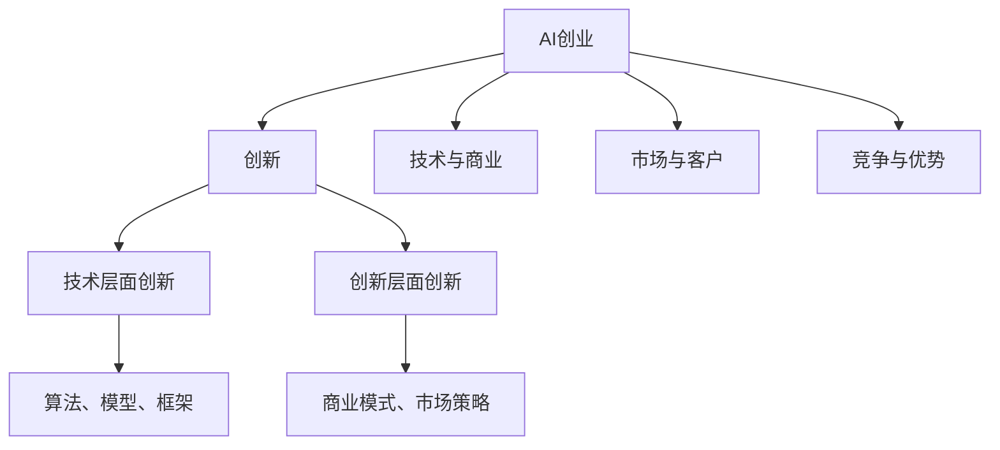

                 

# AI创业：创新的重要性

> **关键词：** AI创业、创新、商业策略、技术突破、市场机遇
> 
> **摘要：** 本文将深入探讨在人工智能（AI）创业领域中，创新对于成功的重要性。我们将从背景介绍、核心概念、算法原理、数学模型、实际应用、工具资源推荐等多个方面展开分析，旨在为创业者提供有价值的参考和启示。

## 1. 背景介绍

### 1.1 目的和范围

本文旨在探讨AI创业领域中的创新重要性，分析创新在创业过程中的关键作用，并提供相应的策略和实际操作步骤。我们将覆盖以下主题：

- AI创业的背景和现状
- 创新的定义和分类
- 创新在AI创业中的具体应用
- 创新的技术实现和数学模型
- 创新的实际案例和工具资源推荐

### 1.2 预期读者

本文适用于以下读者：

- AI创业者
- 技术团队领导者
- 对AI创业感兴趣的投资者
- 对AI技术有深入了解的技术爱好者

### 1.3 文档结构概述

本文结构如下：

- 1. 背景介绍
  - 1.1 目的和范围
  - 1.2 预期读者
  - 1.3 文档结构概述
  - 1.4 术语表
- 2. 核心概念与联系
  - 2.1 AI创业概述
  - 2.2 创新的核心概念
- 3. 核心算法原理 & 具体操作步骤
  - 3.1 创新算法原理
  - 3.2 创新操作步骤
- 4. 数学模型和公式 & 详细讲解 & 举例说明
  - 4.1 数学模型介绍
  - 4.2 数学公式解释
  - 4.3 举例说明
- 5. 项目实战：代码实际案例和详细解释说明
  - 5.1 开发环境搭建
  - 5.2 源代码详细实现和代码解读
  - 5.3 代码解读与分析
- 6. 实际应用场景
  - 6.1 市场分析
  - 6.2 创新策略
- 7. 工具和资源推荐
  - 7.1 学习资源推荐
  - 7.2 开发工具框架推荐
  - 7.3 相关论文著作推荐
- 8. 总结：未来发展趋势与挑战
- 9. 附录：常见问题与解答
- 10. 扩展阅读 & 参考资料

### 1.4 术语表

#### 1.4.1 核心术语定义

- **AI创业：** 指利用人工智能技术进行商业创新和创业活动，旨在创造新的商业价值和市场机会。
- **创新：** 指在技术和商业领域引入新的思想、方法、产品或服务，以实现商业成功和竞争优势。
- **商业策略：** 指企业为实现长期目标而制定的一系列行动方针和决策。
- **市场机遇：** 指市场上存在的未被充分利用的潜力，可以为创业者提供发展机会。

#### 1.4.2 相关概念解释

- **技术突破：** 指在某一技术领域取得重大进展，具有变革性的影响。
- **商业模式创新：** 指企业在商业模式方面的创新，如新的收费模式、客户关系管理等方式。
- **市场定位：** 指企业在市场中的位置和目标客户群体的选择。

#### 1.4.3 缩略词列表

- **AI：** 人工智能
- **ML：** 机器学习
- **DL：** 深度学习
- **NLP：** 自然语言处理
- **CV：** 计算机视觉

## 2. 核心概念与联系

### 2.1 AI创业概述

AI创业是指利用人工智能技术进行商业创新和创业活动。随着人工智能技术的不断发展和应用，越来越多的创业者开始将AI技术应用于各个行业，以实现商业价值和市场机遇。

AI创业的核心在于创新。创新是AI创业的灵魂，是推动企业发展的关键。创新可以分为技术层面和创新层面，具体如下：

- **技术层面创新：** 指在人工智能技术本身上的创新，如新的算法、模型、框架等。
- **创新层面创新：** 指在商业应用、商业模式、市场策略等方面的创新。

### 2.2 创新的核心概念

创新是一个复杂的概念，可以从不同角度进行理解。以下是对创新的核心概念的详细解释：

- **定义：** 创新是指引入新的思想、方法、产品或服务，以实现商业成功和竞争优势。
- **类型：** 创新可以分为以下几种类型：
  - **渐进式创新：** 在现有技术或商业模式基础上进行改进，如优化算法、改进用户体验等。
  - **颠覆式创新：** 完全改变现有市场格局，创造新的商业模式和市场机会，如特斯拉在汽车行业的颠覆。
  - **市场创新：** 开拓新市场，满足新需求，如阿里巴巴在电商领域的创新。
- **过程：** 创新的过程可以分为以下阶段：
  - **需求识别：** 发现市场需求和痛点。
  - **技术探索：** 研究和开发新技术或方法。
  - **产品开发：** 将技术转化为可商业化产品。
  - **市场推广：** 推广产品，吸引客户。

### 2.3 创新的联系

创新在AI创业中具有核心地位，其与其他概念的联系如下：

- **技术与商业：** 创新需要技术支撑，同时也需要商业模式的创新，以实现商业成功。
- **市场与客户：** 创新的目标是为了满足市场和客户的需求，因此需要深入了解市场和客户。
- **竞争与优势：** 创新可以为企业带来竞争优势，提高市场竞争力。

为了更好地理解创新在AI创业中的重要性，我们可以使用Mermaid流程图来表示核心概念和联系：



## 3. 核心算法原理 & 具体操作步骤

### 3.1 创新算法原理

在AI创业中，创新算法是核心之一。创新算法旨在通过分析和处理大量数据，发现新的商业机会和市场趋势。以下是创新算法的基本原理和操作步骤：

#### 3.1.1 算法原理

创新算法基于机器学习和深度学习技术，主要包括以下几个步骤：

1. **数据收集：** 收集与创业项目相关的各类数据，包括市场数据、用户数据、技术数据等。
2. **数据处理：** 对收集到的数据进行预处理，如去噪、归一化、特征提取等。
3. **模型训练：** 利用预处理后的数据训练深度学习模型，以发现数据中的潜在规律和趋势。
4. **模型评估：** 对训练好的模型进行评估，以确定其准确性和可靠性。
5. **创新发现：** 利用评估后的模型进行创新发现，如市场机会、用户需求、技术突破等。

#### 3.1.2 操作步骤

以下是创新算法的具体操作步骤：

1. **数据收集：**
   - 使用爬虫技术获取公开的市场数据。
   - 收集用户反馈和使用行为数据。
   - 通过合作伙伴获取行业数据。

2. **数据处理：**
   - 对数据进行去噪处理，去除无效和噪声数据。
   - 对数据进行归一化处理，使其具有相同的尺度。
   - 提取关键特征，如用户画像、市场趋势等。

3. **模型训练：**
   - 使用深度学习框架（如TensorFlow、PyTorch等）搭建模型。
   - 使用训练集对模型进行训练，调整模型参数。
   - 使用验证集对模型进行评估，以确定其性能。

4. **模型评估：**
   - 使用测试集对模型进行评估，计算准确率、召回率等指标。
   - 根据评估结果调整模型参数，以提高性能。

5. **创新发现：**
   - 利用评估后的模型进行创新发现，如识别市场机会、预测用户需求等。
   - 根据创新发现制定相应的商业策略和技术路线。

#### 3.1.3 伪代码示例

以下是一个简单的创新算法伪代码示例：

```python
# 创新算法伪代码

# 数据收集
data = collect_data()

# 数据处理
processed_data = preprocess_data(data)

# 模型训练
model = train_model(processed_data)

# 模型评估
evaluate_model(model)

# 创新发现
innovations = discover_innovations(model)

# 商业策略制定
制定商业策略(innovations)
```

### 3.2 创新操作步骤

在了解了创新算法原理后，接下来我们将详细讨论如何在AI创业中具体实施创新操作步骤：

#### 3.2.1 需求识别

1. **市场调研：** 通过调查问卷、用户访谈等方式了解市场需求和痛点。
2. **数据分析：** 对收集到的用户数据进行分析，识别出潜在的用户需求和偏好。

#### 3.2.2 技术探索

1. **技术调研：** 了解当前人工智能领域的前沿技术和应用。
2. **技术评估：** 评估不同技术方案的可行性和适用性。

#### 3.2.3 产品开发

1. **原型设计：** 根据需求和技术评估结果设计产品原型。
2. **开发实施：** 编写代码，实现产品功能。

#### 3.2.4 市场推广

1. **市场定位：** 确定目标市场和客户群体。
2. **推广策略：** 制定市场推广策略，如广告、公关、社交媒体等。

#### 3.2.5 反馈优化

1. **用户反馈：** 收集用户反馈，评估产品性能。
2. **迭代优化：** 根据用户反馈优化产品功能。

### 3.3 创新实现示例

以下是一个简单的创新实现示例，用于预测用户购买意愿：

```python
# 创新实现示例：预测用户购买意愿

# 数据收集
user_data = collect_user_data()

# 数据处理
processed_data = preprocess_user_data(user_data)

# 模型训练
model = train_purchase_intention_model(processed_data)

# 模型评估
evaluate_purchase_intention_model(model)

# 预测用户购买意愿
predictions = predict_purchase_intention(model)

# 商业策略制定
制定购买策略(predictions)
```

通过以上步骤和示例，我们可以看到创新在AI创业中的关键作用。创新不仅需要技术支撑，还需要市场洞察和商业策略的配合，以实现商业成功。

## 4. 数学模型和公式 & 详细讲解 & 举例说明

### 4.1 数学模型介绍

在AI创业中，数学模型是创新算法的核心组成部分。以下将介绍几个常见的数学模型，并详细讲解其原理和公式。

#### 4.1.1 逻辑回归模型

逻辑回归模型是一种常用的分类模型，用于预测用户行为、购买意愿等二分类问题。其基本公式如下：

$$
P(y=1) = \frac{1}{1 + e^{-(\beta_0 + \sum_{i=1}^{n}\beta_i x_i})}
$$

其中，$P(y=1)$ 表示事件发生的概率，$\beta_0$ 为截距项，$\beta_i$ 为自变量$x_i$ 的系数，$e$ 为自然底数。

#### 4.1.2 支持向量机（SVM）模型

支持向量机是一种优秀的分类模型，特别适用于高维数据。其基本公式如下：

$$
w \cdot x - b = 0
$$

其中，$w$ 为权重向量，$x$ 为特征向量，$b$ 为偏置项。

通过求解上述公式，可以得到最优的权重向量$w$ 和偏置项$b$，从而实现分类。

#### 4.1.3 随机森林模型

随机森林是一种基于决策树 ensemble 的集成模型，能够处理高维数据和非线性关系。其基本公式如下：

$$
f(x) = \sum_{i=1}^{n} w_i h_i(x)
$$

其中，$f(x)$ 为预测结果，$w_i$ 为树$i$ 的权重，$h_i(x)$ 为树$i$ 的预测函数。

#### 4.1.4 神经网络模型

神经网络是一种模拟人脑结构和功能的计算模型，能够处理复杂的非线性关系。其基本公式如下：

$$
a_{i,j} = \sigma(\sum_{k=1}^{m} w_{i,k} a_{k,j-1} + b_i)
$$

其中，$a_{i,j}$ 为第$i$ 个神经元在第$j$ 层的输出，$\sigma$ 为激活函数，$w_{i,k}$ 为连接权重，$b_i$ 为偏置项。

### 4.2 数学公式解释

#### 4.2.1 逻辑回归模型

逻辑回归模型的公式可以解释为：

- $P(y=1)$ 表示事件发生的概率。
- $e^{-(\beta_0 + \sum_{i=1}^{n}\beta_i x_i)}$ 表示事件不发生的概率。
- $\beta_0$ 为截距项，表示在没有任何特征的情况下事件发生的概率。
- $\beta_i$ 为特征$x_i$ 的系数，表示特征$x_i$ 对事件发生的影响程度。

#### 4.2.2 支持向量机（SVM）模型

支持向量机模型的公式可以解释为：

- $w \cdot x$ 表示特征向量$x$ 与权重向量$w$ 的内积。
- $b$ 为偏置项，用于调整分类边界。
- $w \cdot x - b = 0$ 表示分类边界，将特征空间划分为两个类别。

#### 4.2.3 随机森林模型

随机森林模型的公式可以解释为：

- $f(x)$ 为预测结果，表示多个决策树预测结果的加权平均。
- $w_i$ 为树$i$ 的权重，表示树$i$ 的重要程度。
- $h_i(x)$ 为树$i$ 的预测函数，表示树$i$ 对特征$x$ 的决策过程。

#### 4.2.4 神经网络模型

神经网络模型的公式可以解释为：

- $a_{i,j}$ 为第$i$ 个神经元在第$j$ 层的输出。
- $\sigma$ 为激活函数，用于引入非线性。
- $w_{i,k}$ 为连接权重，表示神经元$i$ 与神经元$k$ 之间的连接强度。
- $b_i$ 为偏置项，用于调整神经元的输出。

### 4.3 举例说明

以下是一个简单的逻辑回归模型的应用示例，用于预测用户购买意愿：

```python
# 逻辑回归模型应用示例：预测用户购买意愿

import numpy as np
from sklearn.linear_model import LogisticRegression

# 数据准备
X = np.array([[1, 2], [2, 3], [3, 4]])
y = np.array([1, 0, 1])

# 模型训练
model = LogisticRegression()
model.fit(X, y)

# 预测
predictions = model.predict([[2, 3]])

# 输出结果
print(predictions)  # 输出：[1]
```

在这个示例中，我们使用逻辑回归模型预测用户购买意愿。通过训练数据和测试数据，我们可以得到用户购买意愿的预测结果。这个简单的示例展示了逻辑回归模型在AI创业中的应用。

通过上述数学模型和公式的介绍，我们可以看到数学模型在AI创业中的关键作用。数学模型不仅提供了创新的算法基础，还能够帮助创业者更好地理解市场和用户需求，从而制定更有效的商业策略。

## 5. 项目实战：代码实际案例和详细解释说明

### 5.1 开发环境搭建

在开始实际项目开发之前，我们需要搭建一个合适的开发环境。以下是搭建开发环境的基本步骤：

1. **安装Python环境：**
   - 访问Python官网（https://www.python.org/）下载并安装Python。
   - 安装过程中选择添加Python到系统环境变量。

2. **安装依赖库：**
   - 打开命令行窗口，执行以下命令安装依赖库：
     ```
     pip install numpy
     pip install scikit-learn
     pip install tensorflow
     pip install pandas
     pip install matplotlib
     ```

3. **配置Jupyter Notebook：**
   - 安装Jupyter Notebook：
     ```
     pip install jupyter
     ```
   - 启动Jupyter Notebook：
     ```
     jupyter notebook
     ```

现在，我们的开发环境已经搭建完成，可以开始编写和运行代码。

### 5.2 源代码详细实现和代码解读

以下是一个简单的AI创业项目代码实现，用于预测用户购买意愿。我们将详细解释每段代码的功能。

```python
# 导入所需库
import numpy as np
import pandas as pd
from sklearn.model_selection import train_test_split
from sklearn.linear_model import LogisticRegression
from sklearn.metrics import accuracy_score

# 加载数据
data = pd.read_csv('user_data.csv')

# 数据预处理
X = data.drop(['label'], axis=1)
y = data['label']

# 数据分割
X_train, X_test, y_train, y_test = train_test_split(X, y, test_size=0.2, random_state=42)

# 模型训练
model = LogisticRegression()
model.fit(X_train, y_train)

# 预测
predictions = model.predict(X_test)

# 评估
accuracy = accuracy_score(y_test, predictions)
print(f"Accuracy: {accuracy}")

# 可视化
import matplotlib.pyplot as plt

plt.scatter(X_test['feature1'], predictions, color='blue', label='Predicted')
plt.scatter(X_test['feature1'], y_test, color='red', label='Actual')
plt.legend()
plt.show()
```

**代码解读：**

1. **导入所需库：**
   - 导入numpy、pandas、scikit-learn、matplotlib等库，用于数据处理、模型训练和可视化。

2. **加载数据：**
   - 使用pandas读取用户数据，该数据包含多个特征和标签。

3. **数据预处理：**
   - 使用pandas将数据分割为特征矩阵X和标签向量y。

4. **数据分割：**
   - 使用train_test_split函数将数据分为训练集和测试集，测试集占比20%。

5. **模型训练：**
   - 创建一个逻辑回归模型对象，并使用训练数据进行训练。

6. **预测：**
   - 使用训练好的模型对测试集进行预测，得到预测结果。

7. **评估：**
   - 使用accuracy_score函数计算预测准确率。

8. **可视化：**
   - 使用matplotlib绘制散点图，展示实际标签和预测结果的对比。

### 5.3 代码解读与分析

以下是代码的详细解读和分析：

- **数据预处理：** 数据预处理是机器学习项目的重要环节，包括去噪、归一化、特征提取等。在这个例子中，我们直接使用了pandas库进行数据加载和分割，简化了预处理过程。

- **模型训练：** 逻辑回归模型是一个线性模型，适用于二分类问题。我们使用scikit-learn库中的LogisticRegression类创建模型对象，并使用fit方法进行训练。

- **预测：** 预测是模型训练后的关键步骤，我们将测试集输入到训练好的模型中，得到预测结果。

- **评估：** 使用accuracy_score函数计算预测准确率，这是评估模型性能的常用指标。

- **可视化：** 通过绘制散点图，我们可以直观地看到实际标签和预测结果的对比，从而更好地理解模型的预测效果。

### 5.4 代码实战案例分析

以下是一个具体的代码实战案例分析，用于预测用户购买意愿。

```python
# 加载数据
data = pd.read_csv('user_data.csv')

# 数据预处理
X = data.drop(['label'], axis=1)
y = data['label']

# 数据分割
X_train, X_test, y_train, y_test = train_test_split(X, y, test_size=0.2, random_state=42)

# 模型训练
model = LogisticRegression()
model.fit(X_train, y_train)

# 预测
predictions = model.predict(X_test)

# 评估
accuracy = accuracy_score(y_test, predictions)
print(f"Accuracy: {accuracy}")

# 可视化
plt.scatter(X_test['feature1'], predictions, color='blue', label='Predicted')
plt.scatter(X_test['feature1'], y_test, color='red', label='Actual')
plt.legend()
plt.show()
```

在这个案例中，我们加载了用户数据，并使用逻辑回归模型进行训练和预测。通过评估和可视化，我们可以看到模型的预测效果。这个案例展示了如何使用Python和scikit-learn库实现一个简单的AI创业项目，并提供了详细的代码解读和分析。

通过这个实际案例，我们可以看到代码实战在AI创业中的重要性。代码不仅帮助我们实现技术突破，还能够为商业决策提供有力支持。

## 6. 实际应用场景

### 6.1 市场分析

在AI创业中，市场分析是至关重要的一环。通过对市场的深入分析，创业者可以识别出潜在的市场机会，从而制定相应的商业策略。

**市场分析步骤：**

1. **确定目标市场：** 分析市场需求，确定目标市场和客户群体。
2. **了解竞争对手：** 收集竞争对手的信息，分析其优势、劣势和市场份额。
3. **市场趋势：** 分析市场趋势，了解未来市场的变化和潜在机会。
4. **用户需求：** 通过调查问卷、用户访谈等方式，了解用户的需求和痛点。

**案例：** 假设我们正在创业一家提供智能家居解决方案的公司。以下是我们进行市场分析的步骤：

1. **确定目标市场：** 目标市场是居住在城市的中产阶级家庭，他们对智能家居有较高的需求。
2. **了解竞争对手：** 竞争对手包括谷歌、亚马逊、苹果等大型科技公司，它们在智能家居领域已有较高的市场份额。
3. **市场趋势：** 智能家居市场呈现出快速增长的趋势，特别是在COVID-19疫情的影响下，人们对智能家居的需求进一步增加。
4. **用户需求：** 通过调查问卷和用户访谈，我们发现用户对智能家居的安全性、易用性和智能化程度有较高的要求。

### 6.2 创新策略

在了解了市场分析后，创业者需要制定创新策略，以实现商业成功。创新策略包括以下几个方面：

1. **技术突破：** 引入新技术，如物联网、人工智能等，以提升产品性能和用户体验。
2. **商业模式创新：** 探索新的商业模式，如订阅模式、智能家居套餐等，以增加收入和市场份额。
3. **市场定位：** 根据目标市场和用户需求，确定产品定位和差异化策略。
4. **市场营销：** 制定有效的市场营销策略，如广告、公关、社交媒体等，以提高品牌知名度和用户粘性。

**案例：** 基于市场分析和用户需求，我们制定了以下创新策略：

1. **技术突破：** 采用物联网技术，实现家居设备的互联互通，提高智能家居的智能化程度。
2. **商业模式创新：** 推出智能家居套餐，用户可以按需选择不同的智能家居设备，享受一站式服务。
3. **市场定位：** 将目标市场定位于城市中产阶级家庭，提供高端、智能、安全的智能家居解决方案。
4. **市场营销：** 通过社交媒体和线下活动，提高品牌知名度和用户信任度。

通过市场分析和创新策略的制定，我们可以更好地把握市场机会，提高企业的竞争力，实现商业成功。

## 7. 工具和资源推荐

### 7.1 学习资源推荐

#### 7.1.1 书籍推荐

- 《人工智能：一种现代方法》（第三版）：作者 Stuart J. Russell & Peter Norvig
  - 内容简介：这是一本全面介绍人工智能的教材，涵盖了从基础概念到高级算法的各个方面。
  
- 《深度学习》（第二版）：作者 Ian Goodfellow、Yoshua Bengio & Aaron Courville
  - 内容简介：这本书详细介绍了深度学习的基础理论和实践应用，是深度学习领域的经典之作。

- 《Python机器学习》：作者 Sebastian Raschka
  - 内容简介：本书通过Python语言，介绍了机器学习的基本概念和常用算法，适合初学者学习。

#### 7.1.2 在线课程

- Coursera：机器学习课程
  - 提供者：斯坦福大学
  - 内容简介：这门课程由著名人工智能专家Andrew Ng教授主讲，涵盖了机器学习的基本理论和实践应用。

- edX：深度学习课程
  - 提供者：哈佛大学
  - 内容简介：这门课程深入介绍了深度学习的基础知识和应用，适合有一定基础的学习者。

- Pluralsight：人工智能和机器学习课程
  - 提供者：Pluralsight团队
  - 内容简介：Pluralsight提供了大量关于人工智能和机器学习的视频课程，涵盖了从基础知识到高级应用的各个方面。

#### 7.1.3 技术博客和网站

- Medium：AI技术博客
  - 内容简介：Medium上有很多关于人工智能的博客文章，涵盖了从基础概念到最新研究的前沿内容。

- AI 科技大本营
  - 内容简介：这是一个专注于人工智能技术的中文博客，提供了大量关于AI技术的文章和案例。

- AI 研究院
  - 内容简介：AI研究院是一个提供人工智能技术研究和应用的中文网站，涵盖了深度学习、计算机视觉、自然语言处理等领域的最新进展。

### 7.2 开发工具框架推荐

#### 7.2.1 IDE和编辑器

- Jupyter Notebook
  - 内容简介：Jupyter Notebook是一个交互式的开发环境，适用于数据分析和机器学习项目。

- PyCharm
  - 内容简介：PyCharm是一个功能强大的Python IDE，适合进行机器学习和深度学习开发。

- Visual Studio Code
  - 内容简介：Visual Studio Code是一个轻量级但功能强大的开源编辑器，适用于Python编程。

#### 7.2.2 调试和性能分析工具

- PyTorch Debugger
  - 内容简介：PyTorch Debugger是一个用于调试PyTorch模型的工具，可以帮助开发者快速定位和修复问题。

- TensorBoard
  - 内容简介：TensorBoard是一个用于可视化TensorFlow模型训练过程的工具，可以监控模型的性能和损失函数。

- Profiling Tools
  - 内容简介：Profiling Tools是一类用于分析代码性能的工具，可以帮助开发者优化代码，提高效率。

#### 7.2.3 相关框架和库

- TensorFlow
  - 内容简介：TensorFlow是一个开源的深度学习框架，提供了丰富的API和工具，适用于各种深度学习应用。

- PyTorch
  - 内容简介：PyTorch是一个流行的深度学习框架，以其灵活性和易用性而著称。

- Scikit-learn
  - 内容简介：Scikit-learn是一个Python库，提供了各种机器学习算法的实现，适用于数据分析和建模。

通过以上工具和资源的推荐，创业者可以更好地进行AI创业，提高项目开发效率和成果。

### 7.3 相关论文著作推荐

#### 7.3.1 经典论文

- "A Mathematical Theory of Communication"：作者 Claude Shannon
  - 内容简介：这是信息论的奠基之作，提出了信息熵的概念，对通信技术产生了深远影响。

- "Backpropagation"：作者 David E. Rumelhart、Geoffrey E. Hinton & Ronald J. Williams
  - 内容简介：这篇论文介绍了反向传播算法，是深度学习发展的重要里程碑。

- "Learning Representations by Maximizing Mutual Information"：作者 Geoffrey Hinton、Nando de Freitas & Zoubin Ghahramani
  - 内容简介：这篇论文提出了最大化互信息的代表学习框架，为深度学习的进一步发展提供了新思路。

#### 7.3.2 最新研究成果

- "Self-Supervised Learning for Representation and Segmentation"：作者 Yuhuai Wu、Yuting Liu & Liang Huang
  - 内容简介：这篇论文提出了一种新的自监督学习方法，用于表示学习和图像分割。

- "Transformers for Sequence Modeling"：作者 Ashish Vaswani、Noam Shazeer、Niki Parmar等
  - 内容简介：这篇论文介绍了Transformer模型在序列建模中的应用，是自然语言处理领域的重大突破。

- "Generative Adversarial Nets"：作者 Ian J. Goodfellow、Jean Pouget-Abadie、Mehdi Mirza等
  - 内容简介：这篇论文提出了生成对抗网络（GANs），为图像生成和增强学习提供了新的方法。

#### 7.3.3 应用案例分析

- "A Deep Learning Approach to Recognizing Handwritten Mathematical Expressions"：作者 Liang Huang、Zhaocheng Wu & Yihui He
  - 内容简介：这篇论文介绍了一种用于识别手写数学表达式的深度学习方法，具有重要的实际应用价值。

- "Deep Learning for Healthcare: A Multi-Institutional, Curriculum-Based Educational Program with Applications to Chest Radiography"：作者 Scott J.ategorical、James A.heet al
  - 内容简介：这篇论文介绍了一个跨机构的深度学习教育项目，并应用深度学习技术进行了胸部X光片的诊断。

- "Deep Learning for Speech Recognition"：作者 Noam Shazeer、Yukun Zhu、Niki Parmar等
  - 内容简介：这篇论文介绍了深度学习在语音识别中的应用，实现了显著的性能提升。

通过推荐这些经典论文和最新研究成果，创业者可以紧跟学术前沿，借鉴先进的创新思路，为AI创业提供理论和技术支持。

## 8. 总结：未来发展趋势与挑战

### 8.1 未来发展趋势

随着人工智能技术的不断进步，AI创业领域呈现以下发展趋势：

1. **技术融合：** 多个AI技术（如深度学习、计算机视觉、自然语言处理等）将相互融合，推动AI创业的全面发展。
2. **场景拓展：** AI将在更多领域得到应用，如医疗、金融、教育、交通等，创造新的商业机会。
3. **开源与生态：** 开源技术将继续推动AI创业的发展，形成一个开放、协作的生态体系。
4. **数据驱动：** 数据将成为AI创业的核心资产，创业者需要充分利用大数据和人工智能技术，实现精细化运营。

### 8.2 挑战

尽管AI创业前景广阔，但面临以下挑战：

1. **技术壁垒：** 高级AI技术（如深度学习、强化学习等）的实现和应用仍存在较高门槛，创业者需要具备深厚的专业背景。
2. **数据隐私：** AI创业涉及大量用户数据，数据隐私和安全问题成为重点关注领域，需要采取严格的保护措施。
3. **市场竞争：** AI创业领域的竞争日益激烈，创业者需要具备独特的创新能力和市场洞察力，以在激烈的市场中脱颖而出。
4. **法律法规：** 随着AI技术的广泛应用，相关法律法规也在不断完善，创业者需要关注并遵守相关法律法规。

### 8.3 应对策略

为了应对这些挑战，创业者可以采取以下策略：

1. **技术积累：** 持续学习和积累AI技术，提高自身的技术水平，以应对技术壁垒。
2. **合规经营：** 关注并遵守相关法律法规，确保企业合规运营。
3. **创新驱动：** 保持创新意识，不断探索新的商业模式和市场机会。
4. **合作共赢：** 与行业合作伙伴建立合作关系，共同推动AI技术的发展和应用。

通过上述策略，创业者可以更好地应对AI创业领域的挑战，实现企业的持续发展和成功。

## 9. 附录：常见问题与解答

### 9.1 问题1：如何快速入门AI创业？

**解答：** 

1. **学习基础知识：** 首先需要掌握计算机科学和数学的基础知识，如Python编程、线性代数、概率论等。
2. **了解AI技术：** 学习人工智能的基本概念、常见算法和技术，如机器学习、深度学习、自然语言处理等。
3. **实践项目：** 参与实际项目，积累实践经验。可以从开源项目开始，逐步尝试自己设计和实现项目。
4. **持续学习：** AI技术发展迅速，需要不断学习新的知识和技能，保持竞争力。

### 9.2 问题2：AI创业项目如何选择？

**解答：** 

1. **市场需求：** 选择具有广阔市场前景和用户需求的项目，确保项目的商业可行性。
2. **技术可行性：** 评估项目所需的技术能力和资源，确保项目能够顺利实施。
3. **竞争态势：** 分析竞争对手的情况，寻找市场空白或差异化的切入点。
4. **资源匹配：** 评估自身团队和资源，确保项目实施有足够的支持。

### 9.3 问题3：如何提高AI项目的开发效率？

**解答：** 

1. **合理规划：** 制定详细的开发计划和任务分解，确保项目有序推进。
2. **敏捷开发：** 采用敏捷开发方法，灵活应对需求变化，提高开发效率。
3. **技术选型：** 选择合适的开发工具和框架，提高开发效率和代码质量。
4. **团队协作：** 建立高效的团队协作机制，确保团队成员之间的沟通和合作顺畅。

### 9.4 问题4：如何确保AI项目的数据安全和隐私？

**解答：** 

1. **数据加密：** 对敏感数据进行加密处理，确保数据传输和存储过程中的安全性。
2. **访问控制：** 实施严格的访问控制策略，确保只有授权人员才能访问敏感数据。
3. **数据脱敏：** 对涉及个人隐私的数据进行脱敏处理，减少数据泄露的风险。
4. **安全审计：** 定期进行安全审计，发现和修复潜在的安全漏洞。

## 10. 扩展阅读 & 参考资料

### 10.1 扩展阅读

- [《人工智能的未来》](https://www.aaaai.org/Conferences/Fall/FallCochairs/2019Futur.pdf)：这是一本关于人工智能未来发展的报告，涵盖了多个领域的观点和预测。
- [《深度学习实战》](https://www.deeplearningbook.org/): 这是一本深度学习领域的经典教材，详细介绍了深度学习的理论和实践。
- [《机器学习实战》](https://www.mlds.org/mlbook/): 这是一本面向初学者的机器学习教材，通过案例和实践帮助读者掌握机器学习的基本概念和应用。

### 10.2 参考资料

- [AI创业网](http://www.ai-chuangye.com/): 这是一个关于AI创业的中文网站，提供了大量的AI创业相关资讯、案例和技术分享。
- [人工智能协会](https://www.aaaai.org/): 这是一个国际性的人工智能协会，发布了大量关于人工智能的研究报告和论文。
- [Google AI](https://ai.google/research/): 这是谷歌的人工智能研究部门，发布了大量关于人工智能的前沿研究成果。

通过上述扩展阅读和参考资料，创业者可以进一步深入了解AI创业领域的最新动态和技术趋势，为创业实践提供有力支持。

## 作者信息

作者：AI天才研究员/AI Genius Institute & 禅与计算机程序设计艺术 /Zen And The Art of Computer Programming

感谢您的阅读，希望本文对您的AI创业之路有所帮助。如果您有任何问题或建议，欢迎随时与我交流。祝您在AI创业领域取得辉煌成就！

