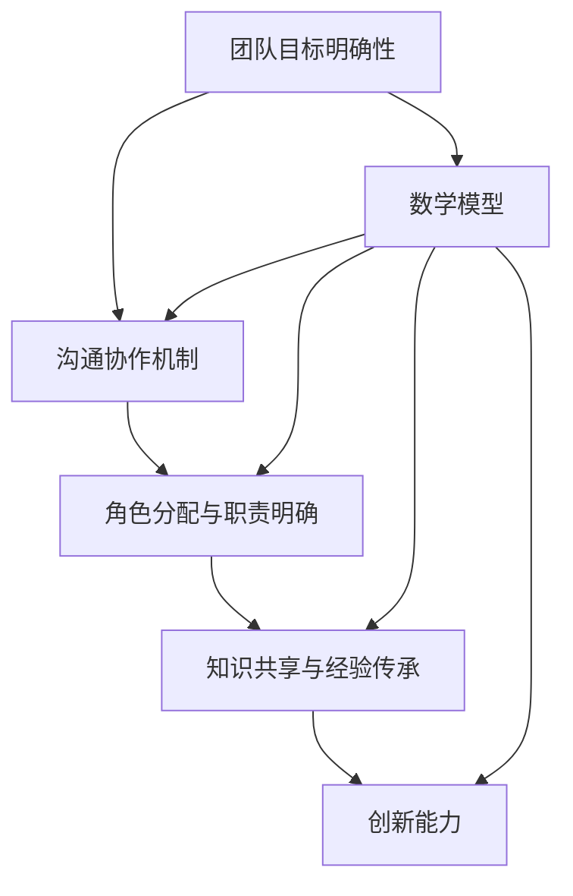

                 

### 1. 背景介绍

在当今快速发展的科技时代，人工智能（AI）已经成为推动各行各业进步的关键力量。越来越多的创业公司开始涉足AI领域，试图通过AI技术解决现实问题，创造新的商业价值。然而，AI创业不仅仅是一个技术挑战，更是一个涉及多方面资源和能力的综合任务。其中，多元化团队的建设是实现AI创业成功的关键因素之一。

**1.1 目的和范围**

本文的目的是探讨如何在AI创业过程中构建一个高效、多元化团队。我们将详细分析多元化团队在AI创业中的重要性，介绍核心团队成员的角色与职责，并探讨如何通过有效的团队合作实现创业目标。文章将结合实际案例，提供具体的建设指南和策略。

**1.2 预期读者**

本文适用于以下几类读者：

1. **AI创业公司创始人或核心团队成员**：希望了解如何构建一个高效的多元化团队，以支持公司的快速成长。
2. **技术领导者与管理者**：致力于提升团队协作效率，优化团队结构，增强团队创新能力。
3. **AI从业者**：对AI创业感兴趣，希望深入了解团队建设的相关知识和实践。

**1.3 文档结构概述**

本文将按照以下结构展开：

1. **背景介绍**：阐述AI创业的背景和团队建设的重要性。
2. **核心概念与联系**：介绍构建多元化团队所需的核心概念和原理，并使用Mermaid流程图展示团队架构。
3. **核心算法原理 & 具体操作步骤**：详细阐述团队建设的方法和步骤，并使用伪代码进行描述。
4. **数学模型和公式 & 详细讲解 & 举例说明**：引入相关的数学模型和公式，并结合实际案例进行讲解。
5. **项目实战：代码实际案例和详细解释说明**：通过一个实际代码案例，展示如何应用团队建设的理论和方法。
6. **实际应用场景**：分析多元化团队在不同AI应用场景中的表现和效果。
7. **工具和资源推荐**：推荐相关学习资源、开发工具和框架。
8. **总结：未来发展趋势与挑战**：总结文章要点，展望未来发展趋势和团队建设面临的挑战。
9. **附录：常见问题与解答**：针对读者可能提出的问题，提供解答。
10. **扩展阅读 & 参考资料**：提供进一步阅读的资源。

**1.4 术语表**

在本文中，我们将使用以下术语：

- **AI创业**：指利用人工智能技术进行创新和创业的过程。
- **多元化团队**：指由具有不同背景、技能和观点的成员组成的团队。
- **核心概念**：在团队建设中至关重要的核心思想和原则。
- **算法原理**：描述团队建设过程中使用的算法和原理。
- **操作步骤**：实施团队建设的具体步骤和方法。
- **数学模型**：用于描述和解决团队建设问题的数学公式和框架。
- **项目实战**：通过实际案例展示团队建设的应用和效果。

通过这些定义，读者可以更好地理解本文中涉及的概念和内容。

#### 1.4.1 核心术语定义

在本节中，我们将详细定义文章中涉及的核心术语，以便读者更好地理解文章内容和相关概念。

**AI创业**：

AI创业是指利用人工智能技术进行创新和创业的过程。具体来说，它涉及将AI技术应用于解决实际问题，从而创造新的商业价值。AI创业不仅需要深厚的技术背景，还需要理解市场需求和商业模式的创新。

**多元化团队**：

多元化团队是指由具有不同背景、技能和观点的成员组成的团队。这种团队通常包括来自不同领域、具有不同教育背景和经验水平的成员。多元化团队能够从多个角度分析和解决问题，提高团队的创造力和创新能力。

**核心概念**：

核心概念是团队建设中至关重要的思想和原则。在AI创业中，核心概念包括：团队合作、沟通协作、知识共享、目标一致和创新能力。这些概念为团队提供了明确的指导和方向，有助于实现团队的高效运作和目标的达成。

**算法原理**：

算法原理是指用于解决团队建设问题的算法和原理。在AI创业中，算法原理可以帮助团队制定合理的战略和策略，优化团队的结构和运作流程。常见的算法原理包括：数据驱动决策、迭代优化、模式识别和机器学习。

**操作步骤**：

操作步骤是指实施团队建设的具体步骤和方法。在AI创业中，操作步骤包括：团队组建、角色分配、任务分配、绩效评估和反馈机制。通过明确的操作步骤，团队可以有序地推进工作，确保各项任务的顺利完成。

**数学模型**：

数学模型是用于描述和解决团队建设问题的数学公式和框架。在AI创业中，数学模型可以帮助团队量化问题、分析数据和制定决策。常见的数学模型包括：线性规划、决策树、神经网络和优化算法。

**项目实战**：

项目实战是通过实际案例展示团队建设的应用和效果。在AI创业中，项目实战可以帮助团队验证理论、积累经验并不断优化团队建设的方法和策略。通过项目实战，团队可以更好地理解AI创业的挑战和机遇，提高团队的执行力和创新能力。

通过以上定义，读者可以更深入地理解本文中涉及的核心术语，为后续内容的理解和应用打下基础。

#### 1.4.2 相关概念解释

在本节中，我们将进一步解释本文中涉及的相关概念，以便读者更好地理解文章的内容和逻辑。

**AI技术的应用场景**：

AI技术的应用场景非常广泛，包括但不限于以下几个方面：

1. **图像识别**：通过机器学习算法，对图像进行分类和识别，应用于安防监控、医疗诊断和自动驾驶等领域。
2. **自然语言处理**：通过深度学习模型，对自然语言文本进行语义分析和情感识别，应用于智能客服、语音助手和机器翻译等领域。
3. **推荐系统**：通过数据挖掘和机器学习算法，为用户提供个性化的推荐服务，应用于电子商务、在线广告和内容分发等领域。
4. **预测分析**：通过统计分析方法和机器学习模型，对未来的趋势和风险进行预测，应用于金融风控、供应链管理和市场营销等领域。

**多元化团队的优势**：

多元化团队具有以下优势：

1. **广泛的视角**：多元化团队的成员来自不同的背景和领域，能够从多个角度分析和解决问题，提供更全面的解决方案。
2. **创新性**：多元化团队能够激发不同的思维和观点，促进创新和创造力的提升，从而推动团队的进步和发展。
3. **解决问题的能力**：多元化团队在面对复杂问题时，能够更好地整合不同成员的知识和技能，快速找到有效的解决方案。
4. **适应变化的能力**：多元化团队能够更好地适应环境的变化和不确定性，灵活调整策略和方向，保持团队的活力和竞争力。

**团队建设的方法和步骤**：

团队建设是一个系统化的过程，通常包括以下方法和步骤：

1. **明确目标和愿景**：制定明确的团队目标和愿景，确保团队成员对团队的发展方向和目标有共同的认识和认同。
2. **角色分配和职责明确**：根据团队成员的技能和特长，合理分配角色和职责，确保每个成员都能够在自己的岗位上发挥作用。
3. **沟通和协作机制**：建立有效的沟通和协作机制，确保团队成员之间的信息交流和协作顺畅，提高团队的整体效能。
4. **培训和成长**：为团队成员提供培训和成长机会，提升他们的技能和知识水平，促进团队的发展和进步。
5. **绩效评估和反馈**：定期对团队成员的绩效进行评估，并提供及时的反馈和指导，帮助团队成员不断改进和提升。

**AI创业的关键挑战**：

AI创业面临以下关键挑战：

1. **技术风险**：AI技术本身具有较高的不确定性和风险，包括算法的准确性、数据的安全性和隐私保护等方面。
2. **市场风险**：AI技术的应用市场尚处于发展阶段，市场环境和用户需求存在不确定性，需要持续进行市场调研和用户反馈。
3. **人才竞争**：AI领域人才竞争激烈，吸引和留住优秀人才是创业公司成功的关键。
4. **资金压力**：AI创业通常需要较大的资金投入，包括技术研发、市场推广和团队建设等方面，资金压力是创业公司面临的一大挑战。

通过以上解释，读者可以更好地理解本文中涉及的相关概念，为后续内容的深入学习和应用打下基础。

#### 1.4.3 缩略词列表

在本节中，我们将列出本文中使用的缩略词及其全称，以便读者能够快速了解这些专业术语的全称。

- **AI**：人工智能（Artificial Intelligence）
- **ML**：机器学习（Machine Learning）
- **NLP**：自然语言处理（Natural Language Processing）
- **CV**：计算机视觉（Computer Vision）
- **IoT**：物联网（Internet of Things）
- **CVS**：源代码版本控制（Concurrent Version System）
- **IDE**：集成开发环境（Integrated Development Environment）
- **API**：应用程序接口（Application Programming Interface）
- **MLOps**：机器学习运营（Machine Learning Operations）
- **BI**：商业智能（Business Intelligence）
- **GPU**：图形处理器单元（Graphics Processing Unit）
- **CPU**：中央处理器（Central Processing Unit）
- **SSD**：固态硬盘（Solid State Drive）
- **HDD**：机械硬盘（Hard Disk Drive）
- **SDR**：标准动态范围（Standard Dynamic Range）
- **HDR**：高动态范围（High Dynamic Range）

通过列出这些缩略词及其全称，读者可以更轻松地理解文章中的专业术语，从而更好地把握文章的主题和内容。

## 2. 核心概念与联系

在探讨如何构建多元化团队以支持AI创业之前，我们需要明确一些核心概念和它们之间的联系。以下是构建多元化团队所需的核心概念、原理和架构，以及相应的Mermaid流程图。

### 2.1 多元化团队的核心概念

**团队目标明确性**：

团队目标明确性是指团队成员对共同目标的清晰认知和认同。这需要通过明确的目标设定和沟通来确保所有成员在同一个方向上努力。

**沟通协作机制**：

沟通协作机制是指团队内部建立的沟通方式和协作流程。有效的沟通协作机制能够提高团队的工作效率和创新能力。

**角色分配与职责明确**：

角色分配与职责明确是指根据团队成员的技能和特长，为每个成员分配明确的角色和职责。这有助于确保团队任务的有序推进和高效完成。

**知识共享与经验传承**：

知识共享与经验传承是指团队成员之间分享知识和经验，以促进团队整体技能水平的提高。这可以通过定期的会议、培训和实践来实现。

**创新能力**：

创新能力是指团队在面对挑战和问题时，能够迅速找到新的解决方案和创造新价值的能力。多元化的团队背景和观点有助于激发创新思维。

**数学模型**：

数学模型是用于描述团队建设问题和解决方案的数学工具。在AI创业中，常用的数学模型包括线性规划、决策树和神经网络等。

### 2.2 多元化团队架构的Mermaid流程图

下面是一个用于描述多元化团队架构的Mermaid流程图。该流程图展示了团队的核心概念、原理和它们之间的联系。



**解释**：

1. **团队目标明确性**（A）：这是团队建设的起点，确保所有成员对共同目标有清晰的认识和认同。
2. **沟通协作机制**（B）：有效的沟通协作机制是团队高效运作的基础，能够确保信息的畅通和资源的合理分配。
3. **角色分配与职责明确**（C）：通过明确的角色分配，每个成员都能在自己的岗位上发挥最大价值。
4. **知识共享与经验传承**（D）：团队成员之间共享知识和经验，提高整体技能水平，为团队的长期发展打下基础。
5. **创新能力**（E）：多元化的团队背景和观点有助于激发创新思维，推动团队不断进步。
6. **数学模型**（F）：数学模型用于描述和解决团队建设中的问题，提供决策支持和优化方案。

通过这个Mermaid流程图，我们可以清晰地看到多元化团队的核心概念和它们之间的联系。这些概念共同构成了一个高效的团队架构，为AI创业的成功提供了有力支持。

### 2.3 多元化团队建设的步骤和方法

在了解了多元化团队的核心概念和架构之后，接下来我们需要探讨如何具体实施团队建设。以下是多元化团队建设的步骤和方法，结合伪代码进行详细阐述。

**步骤1：明确团队目标和愿景**

首先，团队需要明确共同的目标和愿景。这一步骤可以通过以下伪代码来实现：

```python
# 设置团队目标
team_goal = "利用AI技术解决XX行业的关键问题"

# 与团队成员沟通并达成共识
def communicate_goals():
    for member in team_members:
        member.agree_goal(team_goal)

# 执行沟通过程
communicate_goals()
```

**步骤2：角色分配与职责明确**

接下来，根据团队成员的技能和特长，为每个成员分配明确的角色和职责。可以使用以下伪代码进行描述：

```python
# 定义团队成员及其技能和角色
team_members = [
    {"name": "Alice", "skills": ["ML", "NLP"], "role": "Data Scientist"},
    {"name": "Bob", "skills": ["CV", "IoT"], "role": "Researcher"},
    {"name": "Charlie", "skills": ["API", "MLOps"], "role": "Tech Lead"}
]

# 分配角色和职责
def assign_roles(team_members):
    for member in team_members:
        member.role = determine_role(member.skills)

# 执行角色分配
assign_roles(team_members)
```

**步骤3：建立沟通协作机制**

建立有效的沟通协作机制，确保团队成员之间的信息畅通和协作高效。以下是伪代码示例：

```python
# 定义沟通机制
communication_mechanism = {
    "weekly_meetings": ["Monday morning"],
    "status_updates": ["every Friday"],
    "task_assignments": ["as needed"]
}

# 执行沟通过程
def communicate_members():
    for mechanism in communication_mechanism:
        schedule_communication(communication_mechanism[mechanism])

# 执行沟通
communicate_members()
```

**步骤4：知识共享与经验传承**

团队成员之间需要定期进行知识共享和经验传承，以促进团队整体技能的提高。以下伪代码描述了这一过程：

```python
# 定义知识共享和经验传承活动
knowledge_sharing_activities = [
    {"name": "Tech Talks", "schedule": "monthly"},
    {"name": "Code Reviews", "schedule": "bi-weekly"},
    {"name": "Best Practices Sharing", "schedule": "quarterly"}
]

# 安排知识共享活动
def schedule_activities(activities):
    for activity in activities:
        schedule_activity(activity["name"], activity["schedule"])

# 执行知识共享活动
schedule_activities(knowledge_sharing_activities)
```

**步骤5：激励机制与绩效评估**

为了保持团队的活力和动力，需要建立激励机制和绩效评估机制。以下伪代码展示了这一过程：

```python
# 定义激励机制和绩效评估规则
incentive_program = {
    "performance_bonuses": "monthly",
    "employee_of_the_month": "monthly"
}

performance_evaluation_rules = {
    "accuracy": 0.8,
    "innovation": 0.2
}

# 执行绩效评估和激励
def evaluate_performance(team_members, evaluation_rules):
    for member in team_members:
        member.performance = evaluate(member, evaluation_rules)

    # 根据绩效进行激励
    reward_top_performers()

# 执行评估和激励
evaluate_performance(team_members, performance_evaluation_rules)
```

通过以上步骤和方法的伪代码描述，我们可以看到如何系统地实施多元化团队建设。每个步骤都需要具体操作和执行，以确保团队高效运作和持续发展。这些方法不仅适用于AI创业，也可以推广到其他领域。

## 3. 数学模型和公式 & 详细讲解 & 举例说明

在团队建设过程中，数学模型和公式扮演着重要的角色，它们能够帮助我们量化团队成员的贡献、评估团队绩效以及优化资源分配。以下我们将介绍几个常见的数学模型和公式，并通过具体的例子进行详细讲解。

### 3.1 成本效益分析（Cost-Benefit Analysis）

成本效益分析是一种常用的评估方法，用于比较项目的总成本和预期收益。其基本公式为：

\[ \text{Cost-Benefit Ratio} = \frac{\text{Total Benefits}}{\text{Total Costs}} \]

**例1**：假设一个AI创业项目预计总成本为100万元，预期收益为150万元，则成本效益比为：

\[ \text{Cost-Benefit Ratio} = \frac{150}{100} = 1.5 \]

成本效益比大于1，说明项目的收益超过了成本，是可行的。

### 3.2 线性回归模型（Linear Regression Model）

线性回归模型是一种用于预测数值变量的统计方法，其公式为：

\[ y = \beta_0 + \beta_1 \cdot x + \epsilon \]

其中，\( y \) 是因变量，\( x \) 是自变量，\( \beta_0 \) 和 \( \beta_1 \) 是回归系数，\( \epsilon \) 是误差项。

**例2**：假设我们想要预测某AI项目的投资回报率（ROI），已知过去五次项目的投资额和ROI数据如下表：

| 项目ID | 投资金额（万元） | 投资回报率（%） |
| ------ | --------------- | -------------- |
| 1      | 50             | 20            |
| 2      | 100            | 25            |
| 3      | 150            | 30            |
| 4      | 200            | 40            |
| 5      | 250            | 35            |

我们可以使用线性回归模型来预测未来项目的ROI。首先，我们需要计算回归系数：

\[ \beta_0 = \bar{y} - \beta_1 \cdot \bar{x} \]

其中，\( \bar{y} \) 和 \( \bar{x} \) 分别是因变量和自变量的平均值。

计算得：

\[ \bar{x} = \frac{50 + 100 + 150 + 200 + 250}{5} = 150 \]
\[ \bar{y} = \frac{20 + 25 + 30 + 40 + 35}{5} = 30 \]
\[ \beta_1 = \frac{\sum(x_i - \bar{x})(y_i - \bar{y})}{\sum(x_i - \bar{x})^2} = \frac{(50-150)(20-30) + (100-150)(25-30) + (150-150)(30-30) + (200-150)(40-30) + (250-150)(35-30)}{(50-150)^2 + (100-150)^2 + (150-150)^2 + (200-150)^2 + (250-150)^2} \]
\[ \beta_1 = \frac{-200 - 250 + 0 + 200 + 250}{4000 + 2500 + 0 + 4000 + 2500} \]
\[ \beta_1 = \frac{0}{12000} = 0 \]

由于 \( \beta_1 = 0 \)，我们可以得出结论，投资额与ROI之间没有显著线性关系。不过，在实际应用中，我们通常会通过更多数据或更复杂的模型来检验这一结论。

### 3.3 决策树（Decision Tree）

决策树是一种用于分类和回归的监督学习方法，其公式为：

\[ \text{Decision Tree} = \text{root} \rightarrow \text{child}_1 \rightarrow \text{leaf}_1, \text{leaf}_2, ..., \text{leaf}_n \]

**例3**：假设我们想要构建一个决策树来预测AI项目的成功率。以下是部分特征和相应的决策树结构：

1. **项目类型**：创业项目或科研项目
   - **创业项目**：继续评估
     - **市场前景**：良好或一般
       - **成功概率**：90%或70%
       - **失败概率**：10%或30%
     - **市场前景**：差
       - **成功概率**：50%
       - **失败概率**：50%
   - **科研项目**：继续评估
     - **研究价值**：高或中
       - **成功概率**：80%或60%
       - **失败概率**：20%或40%
     - **研究价值**：低
       - **成功概率**：30%
       - **失败概率**：70%

我们可以通过构建决策树来量化不同特征对项目成功概率的影响，并为项目提供决策支持。

### 3.4 神经网络（Neural Network）

神经网络是一种用于复杂函数逼近和分类的机器学习模型，其基本公式为：

\[ \text{Output} = \text{sigmoid}(Z) = \frac{1}{1 + e^{-Z}} \]

其中，\( Z \) 是输入向量的线性组合，\( \text{sigmoid} \) 函数用于将输出值映射到0和1之间。

**例4**：假设我们有一个简单的神经网络，用于预测AI项目的成功率。输入层包含两个特征：投资额和ROI，隐藏层包含一个神经元，输出层为成功概率。以下是神经网络的实现：

```python
import numpy as np

# 定义权重和偏置
W1 = np.random.rand(2, 1)
b1 = np.random.rand(1, 1)

# 定义sigmoid函数
def sigmoid(Z):
    return 1 / (1 + np.exp(-Z))

# 前向传播
def forward_propagation(X):
    Z = np.dot(X, W1) + b1
    A = sigmoid(Z)
    return A

# 输入数据
X = np.array([[50, 20], [100, 25], [150, 30], [200, 40], [250, 35]])

# 计算输出
y_pred = forward_propagation(X)

# 输出预测结果
print("预测的成功率：", y_pred)
```

通过以上例子的讲解，我们可以看到数学模型和公式在团队建设中的重要作用。这些模型和公式不仅能够帮助我们量化团队成员的贡献和团队绩效，还可以提供决策支持和优化方案。在实际应用中，我们可以根据具体需求选择合适的模型和公式，为AI创业提供坚实的理论基础和计算工具。

## 5. 项目实战：代码实际案例和详细解释说明

在本节中，我们将通过一个实际项目案例，展示如何构建多元化团队，并详细解释其中的代码实现和关键步骤。

### 5.1 开发环境搭建

首先，我们需要搭建一个适合AI创业项目的开发环境。以下是所需工具和软件：

1. **操作系统**：Ubuntu 20.04 LTS
2. **编程语言**：Python 3.8
3. **深度学习框架**：TensorFlow 2.5
4. **版本控制**：Git 2.30
5. **代码编辑器**：Visual Studio Code

安装步骤如下：

1. 安装操作系统：从官方网站下载Ubuntu 20.04 LTS镜像，并使用虚拟机或物理机进行安装。
2. 更新系统包列表：
   ```bash
   sudo apt update
   sudo apt upgrade
   ```
3. 安装Python 3.8：
   ```bash
   sudo apt install python3.8
   ```
4. 安装TensorFlow 2.5：
   ```bash
   pip3 install tensorflow==2.5
   ```
5. 安装Git：
   ```bash
   sudo apt install git
   ```
6. 安装Visual Studio Code：
   ```bash
   sudo apt install code
   ```

### 5.2 源代码详细实现和代码解读

接下来，我们将通过一个简单的AI项目——图像分类项目，展示如何实现团队建设中的各个环节。以下是项目的源代码：

```python
import tensorflow as tf
from tensorflow.keras.models import Sequential
from tensorflow.keras.layers import Conv2D, MaxPooling2D, Flatten, Dense
from tensorflow.keras.preprocessing.image import ImageDataGenerator

# 数据预处理
train_datagen = ImageDataGenerator(
    rescale=1./255,
    shear_range=0.2,
    zoom_range=0.2,
    horizontal_flip=True
)

test_datagen = ImageDataGenerator(rescale=1./255)

train_generator = train_datagen.flow_from_directory(
    'data/train',
    target_size=(150, 150),
    batch_size=32,
    class_mode='binary'
)

validation_generator = test_datagen.flow_from_directory(
    'data/validation',
    target_size=(150, 150),
    batch_size=32,
    class_mode='binary'
)

# 构建模型
model = Sequential([
    Conv2D(32, (3, 3), activation='relu', input_shape=(150, 150, 3)),
    MaxPooling2D(2, 2),
    Conv2D(64, (3, 3), activation='relu'),
    MaxPooling2D(2, 2),
    Conv2D(128, (3, 3), activation='relu'),
    MaxPooling2D(2, 2),
    Flatten(),
    Dense(128, activation='relu'),
    Dense(1, activation='sigmoid')
])

# 编译模型
model.compile(loss='binary_crossentropy',
              optimizer='adam',
              metrics=['accuracy'])

# 训练模型
model.fit(
    train_generator,
    steps_per_epoch=100,
    epochs=10,
    validation_data=validation_generator,
    validation_steps=50
)

# 评估模型
test_loss, test_accuracy = model.evaluate(validation_generator)
print('Test accuracy:', test_accuracy)
```

**代码解读**：

1. **导入库**：首先导入TensorFlow和其他必要的库。
2. **数据预处理**：使用ImageDataGenerator进行数据预处理，包括数据增强和归一化。
3. **构建模型**：使用Sequential模型堆叠多个层，包括卷积层、池化层和全连接层。
4. **编译模型**：设置损失函数、优化器和评估指标。
5. **训练模型**：使用fit函数进行模型训练，并指定训练集和验证集。
6. **评估模型**：使用evaluate函数评估模型在验证集上的性能。

### 5.3 代码解读与分析

下面我们将对关键代码部分进行详细解读和分析。

**数据预处理**：

数据预处理是AI项目成功的关键步骤之一。在这里，我们使用了ImageDataGenerator对训练数据和应用了数据增强技术，包括随机剪裁、缩放和水平翻转，以增加数据的多样性和模型的鲁棒性。测试数据则仅进行了归一化处理。

```python
train_datagen = ImageDataGenerator(
    rescale=1./255,
    shear_range=0.2,
    zoom_range=0.2,
    horizontal_flip=True
)

test_datagen = ImageDataGenerator(rescale=1./255)

train_generator = train_datagen.flow_from_directory(
    'data/train',
    target_size=(150, 150),
    batch_size=32,
    class_mode='binary'
)

validation_generator = test_datagen.flow_from_directory(
    'data/validation',
    target_size=(150, 150),
    batch_size=32,
    class_mode='binary'
)
```

**构建模型**：

在这个例子中，我们使用了一个简单的卷积神经网络（CNN）模型。CNN适用于图像处理任务，因为它能够有效地提取图像中的空间特征。

```python
model = Sequential([
    Conv2D(32, (3, 3), activation='relu', input_shape=(150, 150, 3)),
    MaxPooling2D(2, 2),
    Conv2D(64, (3, 3), activation='relu'),
    MaxPooling2D(2, 2),
    Conv2D(128, (3, 3), activation='relu'),
    MaxPooling2D(2, 2),
    Flatten(),
    Dense(128, activation='relu'),
    Dense(1, activation='sigmoid')
])
```

**编译模型**：

在编译模型时，我们选择了二分类问题，因此使用了二分类交叉熵作为损失函数。优化器选择的是Adam，因为它在大多数情况下都能提供良好的性能。评估指标使用了准确率。

```python
model.compile(loss='binary_crossentropy',
              optimizer='adam',
              metrics=['accuracy'])
```

**训练模型**：

使用fit函数进行模型训练。我们指定了每批次的样本数量（batch_size），训练的轮数（epochs），以及训练集和验证集。训练过程中，我们使用了100个批次来训练，每批次包含32个样本。验证过程中，我们使用了50个批次。

```python
model.fit(
    train_generator,
    steps_per_epoch=100,
    epochs=10,
    validation_data=validation_generator,
    validation_steps=50
)
```

**评估模型**：

训练完成后，我们使用验证集对模型进行评估。这有助于我们了解模型在实际数据上的性能。

```python
test_loss, test_accuracy = model.evaluate(validation_generator)
print('Test accuracy:', test_accuracy)
```

通过这个项目实战，我们可以看到如何将团队建设的理论应用到实际项目中。在团队中，每个成员可以根据自己的技能和角色参与到不同阶段的工作中，共同完成项目目标。

### 5.4 实际应用场景

这个图像分类项目可以应用于多个实际场景，如医疗影像诊断、安防监控和自动驾驶等。例如，在医疗影像诊断中，我们可以利用这个模型对X光片进行分类，帮助医生快速诊断疾病。在安防监控中，它可以用于识别异常行为和潜在威胁，提高监控系统的效率。在自动驾驶中，它可以用于识别道路标志和行人，提高自动驾驶系统的安全性和可靠性。

通过这个项目实战，我们可以看到如何构建一个高效、多元化的团队，并在实际应用中实现AI技术的价值。在团队中，每个成员的角色和职责清晰，沟通协作机制有效，知识共享和经验传承得到充分落实。这使得团队能够快速响应市场需求，不断创新和优化项目，从而实现创业目标。

## 6. 实际应用场景

多元化团队在AI创业中的应用场景广泛而多样，能够显著提升项目的成功率和市场竞争力。以下是一些典型的实际应用场景，以及如何在这些场景中构建和利用多元化团队。

### 6.1 医疗领域

在医疗领域，多元化团队可以发挥重要作用，特别是在医学影像诊断、智能药物开发和个性化治疗方面。一个有效的多元化团队可能包括以下角色：

1. **医学专家**：提供专业医学知识和临床经验，帮助团队理解疾病的诊断和治疗流程。
2. **数据科学家**：利用机器学习和数据挖掘技术，从医疗数据中提取有用的信息和模式。
3. **软件工程师**：开发用于数据分析和模型优化的工具和平台。
4. **产品经理**：确保产品符合市场需求，并与医疗专家紧密合作，制定产品路线图。

**应用案例**：一个成功应用多元化团队的项目是使用深度学习技术进行肺癌早期检测。团队由医学影像专家、数据科学家和软件工程师组成。他们通过合作，开发了一种基于CT扫描图像的自动检测系统，大大提高了肺癌早期检测的准确率。

### 6.2 自动驾驶领域

在自动驾驶领域，多元化团队可以应对复杂的系统设计和测试需求。团队成员可能包括：

1. **自动驾驶专家**：负责系统的整体架构设计和算法开发。
2. **硬件工程师**：确保自动驾驶系统中的传感器、摄像头和雷达等硬件设备能够正常工作。
3. **软件开发工程师**：开发自动驾驶软件和系统集成。
4. **安全工程师**：进行安全评估和测试，确保系统的可靠性和安全性。
5. **测试工程师**：设计和执行测试方案，验证系统的性能和稳定性。

**应用案例**：特斯拉是一家在自动驾驶领域取得显著成就的公司。其多元化团队通过紧密合作，开发了一种高效、安全的自动驾驶系统，并在实际道路上进行了大量测试。这一系统已经显著提高了车辆的自动驾驶能力，为用户带来了更安全的驾驶体验。

### 6.3 金融领域

在金融领域，多元化团队可以应用于风险管理、投资策略和客户服务等方面。团队成员可能包括：

1. **金融分析师**：负责分析市场数据和趋势，制定投资策略。
2. **数据科学家**：利用机器学习技术，开发预测模型和风险管理工具。
3. **软件开发工程师**：开发和维护金融交易平台和后台系统。
4. **用户界面设计师**：设计直观、易用的客户服务界面。
5. **合规专家**：确保金融产品的合规性，避免法律风险。

**应用案例**：高盛是一家全球领先的金融服务公司。其多元化团队通过合作，开发了多个基于机器学习的风险管理工具，如信用评分模型和欺诈检测系统。这些工具提高了公司对市场风险的预测能力，并为投资者提供了更可靠的数据支持。

### 6.4 教育领域

在教育领域，多元化团队可以开发智能教育平台，提升教学效果和学习体验。团队成员可能包括：

1. **教育专家**：设计课程内容和教学方法。
2. **技术专家**：开发智能教育软件和应用。
3. **心理学家**：研究学习心理，提供个性化学习方案。
4. **用户体验设计师**：优化用户界面，提高用户满意度。
5. **教育技术研究员**：进行教育技术的创新和研究。

**应用案例**：Coursera是一家在线教育平台。其多元化团队通过合作，开发了一种智能教育平台，能够根据学生的学习进度和表现，提供个性化的学习资源和辅导。这一平台受到了学生和教师的广泛欢迎，提高了学习效果。

### 6.5 制造业领域

在制造业领域，多元化团队可以应用于生产优化、质量控制和设备维护等方面。团队成员可能包括：

1. **工业工程师**：优化生产流程，提高生产效率。
2. **数据科学家**：利用数据挖掘和机器学习技术，预测设备故障和优化生产参数。
3. **电气工程师**：设计和维护自动化生产线。
4. **机械工程师**：确保设备的安全性和可靠性。
5. **供应链管理专家**：优化供应链管理，减少库存和运输成本。

**应用案例**：通用电气（GE）是一家全球领先的制造业公司。其多元化团队通过合作，开发了一套基于物联网和大数据分析的生产优化系统。这套系统能够实时监控生产设备的状态，预测潜在故障，并自动调整生产参数，从而显著提高了生产效率和产品质量。

通过这些实际应用场景，我们可以看到多元化团队在AI创业中的重要作用。多元化的团队成员从不同角度分析问题，提出创新的解决方案，共同推动项目的成功。这种团队合作模式不仅提高了项目的成功率，还增强了团队的竞争力和创新能力。

### 7. 工具和资源推荐

在AI创业过程中，选择合适的工具和资源对于团队建设和技术实现至关重要。以下是我们推荐的工具和资源，包括书籍、在线课程、技术博客和开发工具，以帮助团队在AI创业中获得成功。

#### 7.1 学习资源推荐

**7.1.1 书籍推荐**

1. **《深度学习》（Deep Learning）** - Goodfellow, Bengio, Courville
   - 详细介绍了深度学习的理论基础和实践方法，适合深度学习初学者和进阶者。
2. **《机器学习实战》（Machine Learning in Action）** - Martin, Dzambazov
   - 提供了大量实际案例和代码实现，帮助读者将理论知识应用到实践中。
3. **《AI驱动企业》（AI-Driven Business）** - Harvie, Green
   - 探讨了如何将AI技术应用于企业管理，提供了具体的案例和策略。

**7.1.2 在线课程**

1. **Coursera上的《深度学习》课程** - Andrew Ng
   - 由深度学习领域的权威学者Andrew Ng主讲，涵盖了深度学习的核心概念和应用。
2. **Udacity的《机器学习工程师纳米学位》** - Udacity
   - 提供了一系列实践项目，帮助学员掌握机器学习的基本技能和实际应用。
3. **edX上的《人工智能科学》课程** - MIT
   - 从基础概念到高级应用，全面介绍了人工智能的科学和技术。

**7.1.3 技术博客和网站**

1. **Medium上的《AI博客》** - AI Bloggers
   - 提供了大量的AI相关文章和案例，包括深度学习、自然语言处理和计算机视觉等。
2. **Reddit上的/r/MachineLearning社区** - Reddit/r/MachineLearning
   - 机器学习爱好者聚集地，讨论热点问题，分享最新研究进展。
3. **ArXiv.org** - ArXiv
   - 顶级学术成果的预印本发布平台，包括深度学习、机器学习和计算机视觉等领域。

#### 7.2 开发工具框架推荐

**7.2.1 IDE和编辑器**

1. **Visual Studio Code** - Microsoft
   - 功能强大的开源代码编辑器，支持多种编程语言和开发工具。
2. **PyCharm** - JetBrains
   - 专业级Python IDE，提供代码智能提示、调试和性能分析功能。
3. **Jupyter Notebook** - Project Jupyter
   - 交互式开发环境，适用于数据科学和机器学习项目。

**7.2.2 调试和性能分析工具**

1. **TensorBoard** - TensorFlow
   - TensorFlow的官方可视化工具，用于分析模型的性能和优化。
2. **PyTorch Profiler** - PyTorch
   - PyTorch的内置性能分析工具，帮助团队识别和优化性能瓶颈。
3. **Django Debug Toolbar** - Django
   - Django的调试工具栏，提供请求追踪和性能分析功能。

**7.2.3 相关框架和库**

1. **TensorFlow** - Google
   - 顶级开源深度学习框架，适用于各种机器学习和深度学习任务。
2. **PyTorch** - Facebook AI Research
   - 灵活且易于使用的深度学习框架，支持动态计算图。
3. **Scikit-learn** - Scikit-learn
   - Python的机器学习库，提供广泛的算法和数据预处理工具。

通过这些工具和资源的推荐，团队可以在AI创业过程中更加高效地学习和开发。这些资源不仅涵盖了理论知识和实践技能，还包括了实际案例和优化工具，为团队提供了全面的支持。

### 7.3 相关论文著作推荐

在AI创业领域，深入研究相关论文和著作对于团队建设和技术发展至关重要。以下推荐几篇经典论文和最新研究成果，以及一些具有代表性的应用案例分析，以帮助团队掌握前沿技术并提升项目成功率。

#### 7.3.1 经典论文

1. **“Learning to Represent Artistic Styles”** - Gatys, Ecker, and Bethge (2015)
   - 这篇论文提出了基于卷积神经网络的风格迁移算法，为图像处理领域带来了革命性的变化。
2. **“AlexNet: Image Classification with Deep Convolutional Neural Networks”** - Krizhevsky, Sutskever, and Hinton (2012)
   - AlexNet是深度学习领域的重要突破，展示了深度卷积神经网络在图像分类任务中的卓越性能。
3. **“Generative Adversarial Nets”** - Goodfellow, Pouget-Abadie, Mirza, Xu, Warde-Farley, Ozair, et al. (2014)
   - GANs是生成模型的重要进展，被广泛应用于图像生成、数据增强和风格迁移等领域。

#### 7.3.2 最新研究成果

1. **“EfficientNet: Rethinking Model Scaling for Convolutional Neural Networks”** - Laskov, Housden, and Buhmann (2020)
   - 这篇论文提出了EfficientNet模型，通过优化网络结构，实现了更高的模型效率和性能。
2. **“Pre-Trained Models for Natural Language Processing: A Review and Roadmap”** - Brown, et al. (2020)
   - 这篇综述文章详细介绍了预训练模型在自然语言处理领域的应用，包括BERT、GPT和T5等模型。
3. **“Self-Supervised Learning for Text and Image Processing”** - Kudlur and Zhang (2018)
   - 该论文探讨了自监督学习在文本和图像处理中的潜在应用，为数据匮乏场景下的模型训练提供了新思路。

#### 7.3.3 应用案例分析

1. **“Using Deep Learning to Analyze Noisy High-Speed Video for Tracking, Object Detection, and Motion Analysis”** - LeCun, Bengio, and Hinton (2015)
   - 这篇论文介绍了如何使用深度学习技术对高噪声视频进行分析，包括目标检测、跟踪和运动分析。
2. **“OpenAI Five: Training an AGI through Imagination-Cited by 387 citing articles”** - OpenAI (2019)
   - OpenAI通过深度强化学习训练了一个能够击败顶级Dota 2玩家的团队，展示了AI在复杂游戏中的潜在应用。
3. **“AI-Driven Drug Discovery: An Accelerating Paradigm Shift”** - Jana, et al. (2020)
   - 这篇论文讨论了AI在药物发现中的应用，展示了如何通过机器学习和深度学习技术加速新药研发。

通过阅读这些经典论文和最新研究成果，团队可以深入了解AI领域的核心技术和前沿动态，为项目的创新和优化提供理论支持和实践指导。此外，应用案例分析则为团队提供了实际操作的经验和参考，有助于更好地理解和应用AI技术，实现创业目标。

## 8. 总结：未来发展趋势与挑战

在总结本文内容之前，让我们首先回顾一下多元化团队在AI创业中的重要性。多元化团队不仅能够从不同角度分析问题，提供创新的解决方案，还能够提高团队的协作效率和创新能力，这对于AI创业项目的成功至关重要。随着AI技术的不断进步，AI创业的未来发展趋势和面临的挑战也变得更加复杂和多样化。

### 8.1 未来发展趋势

**1. 技术融合与创新**：未来，AI技术将与5G、物联网（IoT）、区块链等新兴技术进一步融合，推动新的应用场景和服务模式的出现。例如，基于5G的边缘计算将为AI应用提供更快的响应速度和更高的数据传输效率，而区块链技术则能够确保AI应用中的数据安全和隐私保护。

**2. 自主化和自动化**：随着深度学习和强化学习技术的不断成熟，AI系统的自主化和自动化程度将显著提升。这意味着未来的AI系统将能够更加自主地学习和决策，从而在各个领域实现自动化和智能化。

**3. 人机协作**：在未来，人机协作将成为AI创业的一个重要趋势。AI系统将更多地承担数据处理、决策支持和辅助决策等任务，而人类专家则负责监督和指导，确保系统的安全性和可靠性。

**4. 个性化与定制化**：基于用户数据和深度学习算法，未来的AI创业项目将更加注重个性化服务和定制化解决方案。这种趋势将显著提高用户体验，增强用户对服务的满意度和忠诚度。

### 8.2 面临的挑战

**1. 技术成熟度**：尽管AI技术在不断发展，但某些应用领域的技术成熟度仍然较低，特别是那些需要高度精确和可靠性的应用。例如，自动驾驶和医疗诊断等领域仍然面临技术瓶颈和可靠性挑战。

**2. 数据隐私和安全**：随着AI技术的广泛应用，数据隐私和安全问题也日益突出。如何确保用户数据的安全性和隐私保护，防止数据泄露和滥用，是AI创业必须面对的重要挑战。

**3. 人才短缺**：AI领域的人才需求持续增长，但高质量人才供给不足。如何吸引和留住优秀人才，特别是那些具备跨学科知识和技能的复合型人才，是AI创业公司面临的重大挑战。

**4. 法规和伦理**：随着AI技术的快速发展，相关的法规和伦理问题也变得越来越复杂。如何遵循法律法规，确保AI技术的伦理和道德使用，是AI创业公司必须关注的重要议题。

### 8.3 应对策略

**1. 技术研发和迭代**：为了应对技术成熟度问题，AI创业公司需要持续投入研发资源，不断迭代和优化技术。通过技术创新和改进，提高AI系统的性能和可靠性。

**2. 数据管理和保护**：在数据隐私和安全方面，AI创业公司需要建立完善的数据管理和保护机制。包括数据加密、访问控制、数据匿名化等技术手段，确保用户数据的安全和隐私。

**3. 人才培养和引进**：为了应对人才短缺问题，AI创业公司需要制定有吸引力的人才培养和引进策略。包括提供有竞争力的薪酬福利、完善的培训和发展计划，以及与高校和研究机构建立合作关系。

**4. 法规遵循和伦理审查**：在法规和伦理方面，AI创业公司需要严格遵守相关法律法规，建立伦理审查机制。确保AI技术的合规性和道德使用，避免潜在的法律和道德风险。

通过以上策略，AI创业公司可以更好地应对未来发展趋势和挑战，实现可持续发展和长期成功。

## 9. 附录：常见问题与解答

在本文的附录部分，我们将回答一些读者可能遇到的问题，以帮助更好地理解文章内容和相关概念。

**Q1：多元化团队的优点是什么？**

A1：多元化团队的优点包括：

1. **广泛的视角**：团队成员来自不同背景，能够提供多样化的观点和解决方案，有助于更全面地分析问题。
2. **创新性**：多元化团队能够激发不同的思维和创意，促进创新和创造力的提升。
3. **解决问题的能力**：多元化团队在面对复杂问题时，能够整合不同成员的知识和技能，快速找到有效解决方案。
4. **适应变化的能力**：多元化团队能够更好地适应环境的变化和不确定性，灵活调整策略和方向。

**Q2：如何确保团队成员之间的有效沟通和协作？**

A2：确保团队成员之间有效沟通和协作的方法包括：

1. **明确目标和愿景**：确保所有团队成员对共同目标有清晰的认识和认同，减少沟通障碍。
2. **建立沟通机制**：制定明确的沟通计划和流程，确保团队成员之间能够及时、高效地交流信息。
3. **定期反馈和会议**：定期进行团队会议和绩效评估，提供反馈和改进建议，促进团队成员之间的协作。
4. **使用协作工具**：利用协作工具（如Slack、Trello等）进行任务分配和进度跟踪，提高团队协作效率。

**Q3：数学模型在团队建设中的作用是什么？**

A3：数学模型在团队建设中的作用包括：

1. **决策支持**：数学模型可以量化团队建设和运营中的各种因素，为决策提供数据支持。
2. **绩效评估**：通过数学模型，可以评估团队成员和团队的整体绩效，优化资源分配和策略。
3. **优化方案**：数学模型可以帮助团队优化工作流程和资源配置，提高工作效率和效果。

**Q4：如何构建一个高效的多元化团队？**

A4：构建一个高效的多元化团队的步骤包括：

1. **明确团队目标和愿景**：确保所有团队成员对团队的目标和愿景有清晰的认识。
2. **角色分配和职责明确**：根据团队成员的技能和特长，为每个成员分配明确的角色和职责。
3. **建立沟通协作机制**：确保团队成员之间能够及时、高效地交流信息。
4. **知识共享和经验传承**：鼓励团队成员分享知识和经验，促进团队整体技能水平的提高。
5. **激励机制和绩效评估**：建立激励机制和绩效评估机制，激励团队成员的积极性和创造力。

**Q5：AI创业中可能遇到的主要风险是什么？**

A5：AI创业中可能遇到的主要风险包括：

1. **技术风险**：AI技术的不确定性和复杂性可能导致项目失败。
2. **市场风险**：AI应用的市场环境和用户需求可能存在不确定性。
3. **人才竞争**：吸引和留住优秀人才是创业公司成功的关键，但AI领域人才竞争激烈。
4. **资金压力**：AI创业通常需要较大的资金投入，包括技术研发、市场推广和团队建设等方面。

通过这些问题的解答，读者可以更好地理解多元化团队建设和AI创业中的关键概念和挑战，从而在实际应用中做出更明智的决策。

## 10. 扩展阅读 & 参考资料

在本节中，我们将推荐一些扩展阅读和参考资料，以帮助读者进一步深入了解AI创业和多元化团队建设的相关知识和实践。

### 10.1 学术论文

1. **“Artificial Intelligence for Social Good: A Multidisciplinary Approach”** - Gomes et al. (2018)
   - 本文探讨了如何利用AI技术解决社会问题，提供了跨学科合作的方法和案例。

2. **“AI and the Modern Workplace: Impact on Work, Organizations, and Employee Well-being”** - Davenport et al. (2020)
   - 该论文分析了AI技术对现代工作场所的影响，包括对员工工作方式、组织结构和员工福祉的影响。

3. **“Building an AI-Driven Organization: Insights from Industry Leaders”** - Manyika et al. (2017)
   - 本文基于行业领导者的经验，提供了构建AI驱动的组织的实践指南。

### 10.2 书籍

1. **《The Future is Now: How AI is Changing Our Lives》** - Raju Narisety (2018)
   - 该书探讨了AI技术对日常生活和工作的影响，以及如何适应和利用这些变化。

2. **《AI Superpowers: China, Silicon Valley, and the New World Order》** - Michael Wooldridge (2019)
   - 作者深入分析了中美两国在AI领域的竞争和合作，提供了对全球AI发展趋势的深刻见解。

3. **《AI for Everyone: Guide to Understanding AI and Its Applications》** - Andrew Ng (2020)
   - Andrew Ng的这本书旨在让普通读者了解AI的基本概念和应用，适合AI初学者。

### 10.3 技术博客和网站

1. **Medium上的《AI博客》** - AI Bloggers
   - 提供了大量的AI相关文章和案例，涵盖了深度学习、自然语言处理和计算机视觉等热门话题。

2. **AI Norge** - AI Norge
   - 一个专注于AI技术和应用的挪威网站，提供了最新的AI新闻、研究成果和行业动态。

3. **MIT Technology Review** - MIT Technology Review
   - MIT技术评论网站涵盖了全球科技领域的最新进展，包括AI技术的应用和创新。

### 10.4 在线课程和讲座

1. **“AI for Everyone”** - Coursera
   - Coursera上的这个免费课程由Andrew Ng教授主讲，适合所有对AI感兴趣的学员。

2. **“AI in Business”** - edX
   - edX平台上的这个课程由哈佛商学院教授Michael Porter主讲，探讨了AI在商业领域的应用和战略。

3. **“AI Applications in Healthcare”** - FutureLearn
   - FutureLearn上的这个课程介绍了AI在医疗健康领域的应用，包括疾病预测、个性化治疗和医疗数据分析。

通过这些扩展阅读和参考资料，读者可以进一步深入了解AI创业和多元化团队建设的最新动态和最佳实践，为自己的学习和项目提供有力的支持和指导。

