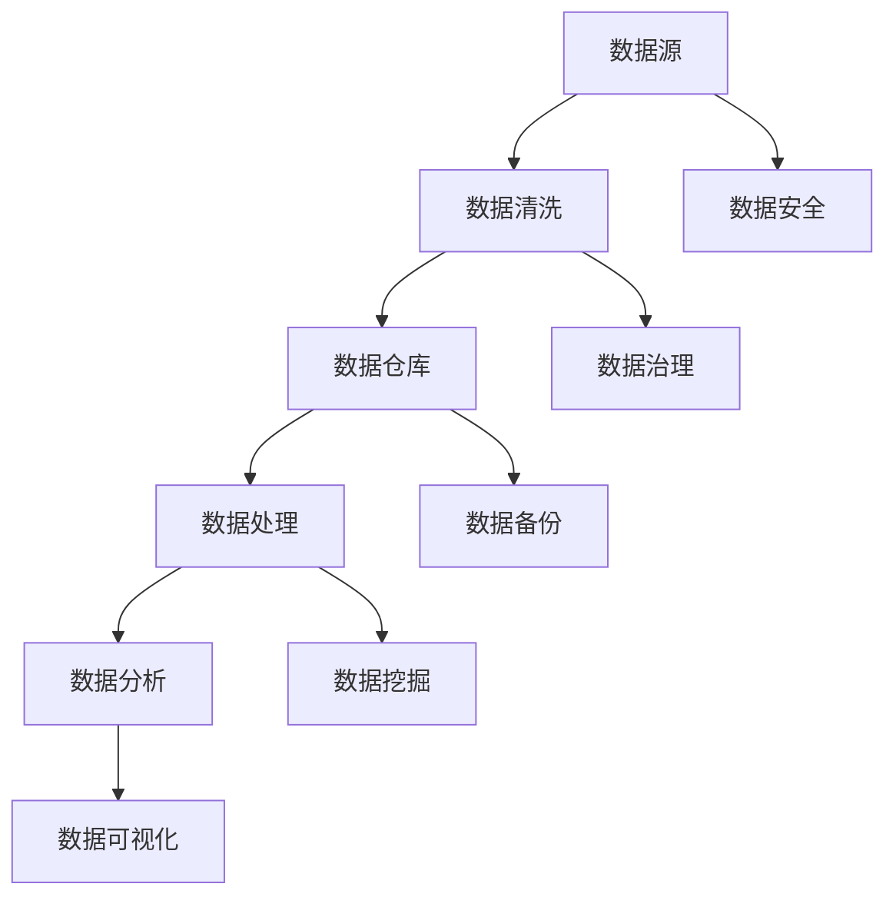

                 

# AI创业：数据管理的实用做法

> **关键词**：数据管理、AI创业、数据清洗、数据仓库、数据安全、数据处理

> **摘要**：本文将深入探讨AI创业中的数据管理问题，包括数据清洗、数据仓库建设、数据安全和数据处理等方面的实践方法。通过分析实际案例和提供详细的操作步骤，本文旨在帮助创业者了解如何有效地管理和利用数据资源，为AI项目的成功奠定基础。

## 1. 背景介绍

### 1.1 目的和范围

本文旨在为AI创业者提供关于数据管理的实用做法，帮助他们在创业过程中更好地应对数据管理方面的挑战。文章将涵盖以下几个主要方面：

- 数据清洗：介绍数据清洗的重要性和方法。
- 数据仓库建设：讲解数据仓库的设计和实施。
- 数据安全：探讨数据安全策略和保护措施。
- 数据处理：阐述数据处理的核心技术和实践。

通过这些内容，读者将能够了解如何在AI创业项目中有效管理数据，为后续的业务发展提供支持。

### 1.2 预期读者

本文主要面向以下读者群体：

- AI创业公司的创始人或技术负责人。
- 数据科学家和人工智能工程师。
- 对AI和数据管理感兴趣的IT专业人士。

### 1.3 文档结构概述

本文分为八个主要部分：

1. 背景介绍：介绍文章的目的、范围、预期读者和文档结构。
2. 核心概念与联系：讨论数据管理中的核心概念和联系。
3. 核心算法原理 & 具体操作步骤：讲解数据处理的核心算法和操作步骤。
4. 数学模型和公式 & 详细讲解 & 举例说明：介绍数据处理中的数学模型和公式，并给出具体案例。
5. 项目实战：代码实际案例和详细解释说明。
6. 实际应用场景：探讨数据管理在不同场景下的应用。
7. 工具和资源推荐：推荐学习和开发过程中有用的工具和资源。
8. 总结：未来发展趋势与挑战：总结数据管理在AI创业中的发展趋势和面临的挑战。

### 1.4 术语表

#### 1.4.1 核心术语定义

- **数据清洗**：指对数据进行清洗、去噪和格式化等处理，以提高数据质量和可用性。
- **数据仓库**：一种用于存储、管理和分析大量数据的数据库系统。
- **数据处理**：对数据进行加工、转换和聚合等操作，以生成有用的信息。
- **数据安全**：指保护数据免受未经授权的访问、使用、泄露、破坏或篡改的措施。

#### 1.4.2 相关概念解释

- **数据质量**：指数据的有效性、准确性、完整性、一致性和及时性。
- **数据治理**：指组织在数据管理和使用过程中遵循的规则、政策和流程。
- **数据挖掘**：指从大量数据中提取有价值信息的过程。

#### 1.4.3 缩略词列表

- **ETL**：抽取（Extract）、转换（Transform）、加载（Load），用于数据清洗和数据仓库建设。
- **API**：应用程序接口（Application Programming Interface），用于程序之间的数据交换。
- **ML**：机器学习（Machine Learning），一种基于数据的学习方法，用于构建智能系统。

## 2. 核心概念与联系

### 2.1 数据管理概述

数据管理是AI创业中至关重要的一环。它涉及到数据的收集、存储、处理、分析和保护等多个方面。一个良好的数据管理体系能够确保数据的质量、安全和可靠性，从而为创业项目的成功提供支持。

### 2.2 数据管理中的核心概念

在数据管理中，有以下几个核心概念：

- **数据源**：数据来源，如传感器、用户输入、外部数据接口等。
- **数据质量**：数据的有效性、准确性、完整性、一致性和及时性。
- **数据仓库**：用于存储和管理大量数据的数据库系统，支持数据分析和挖掘。
- **数据处理**：对数据进行加工、转换和聚合等操作，以生成有用的信息。
- **数据安全**：保护数据免受未经授权的访问、使用、泄露、破坏或篡改。

### 2.3 数据管理中的联系

数据管理中的各个核心概念相互关联，形成一个整体：

- **数据源和数据仓库**：数据源提供原始数据，数据仓库用于存储和管理这些数据。
- **数据处理和数据质量**：通过数据处理，可以改善数据质量，使其更适用于分析和挖掘。
- **数据安全和数据治理**：数据安全措施和数据治理规则有助于确保数据的质量和安全。

### 2.4 Mermaid 流程图

以下是一个简化的Mermaid流程图，展示数据管理中的核心概念和联系：



## 3. 核心算法原理 & 具体操作步骤

### 3.1 数据清洗算法原理

数据清洗是数据管理的重要步骤，其核心目的是提高数据的质量和可用性。以下是一个常见的数据清洗算法原理：

- **缺失值处理**：对缺失值进行填补或删除。
- **异常值检测**：检测和去除异常值。
- **数据转换**：将数据格式转换为统一的格式，如将字符串转换为数字。

### 3.2 数据清洗具体操作步骤

以下是数据清洗的具体操作步骤：

1. **数据采集**：从不同的数据源获取原始数据。
2. **数据预处理**：对数据进行基本的清洗，如去除空值、删除重复记录等。
3. **缺失值处理**：
    ```python
    # Python伪代码：填补缺失值
    for column in dataframe.columns:
        if dataframe[column].isnull().any():
            dataframe[column].fillna(dataframe[column].mean(), inplace=True)
    ```
4. **异常值检测**：
    ```python
    # Python伪代码：检测并删除异常值
    for column in dataframe.columns:
        if dataframe[column].dtype == 'float64' or dataframe[column].dtype == 'int64':
            dataframe = dataframe[(dataframe[column] > dataframe[column].quantile(0.01)) & (dataframe[column] < dataframe[column].quantile(0.99))]
    ```
5. **数据转换**：
    ```python
    # Python伪代码：数据格式转换
    dataframe['column_name'] = dataframe['column_name'].astype('float64')
    ```

### 3.3 数据仓库设计算法原理

数据仓库的设计目标是存储和管理大量数据，以便于数据分析和挖掘。以下是一个常见的数据仓库设计算法原理：

- **数据建模**：根据业务需求设计数据模型。
- **数据集成**：将不同来源的数据集成到数据仓库中。
- **数据分区**：对数据仓库进行分区，以提高查询性能。

### 3.4 数据仓库设计具体操作步骤

以下是数据仓库设计的具体操作步骤：

1. **需求分析**：了解业务需求，确定数据仓库的功能和性能要求。
2. **数据建模**：
    ```mermaid
    graph TD
        A[事实表] --> B[维度表1]
        A --> C[维度表2]
        B --> D[主键]
        C --> E[主键]
    ```
3. **数据集成**：使用ETL工具将数据从不同的数据源抽取、转换和加载到数据仓库中。
4. **数据分区**：根据数据访问模式对数据仓库进行分区，如按时间、地区等进行分区。

## 4. 数学模型和公式 & 详细讲解 & 举例说明

### 4.1 数学模型和公式

在数据管理和处理过程中，常常会用到一些数学模型和公式。以下是一些常用的模型和公式：

- **缺失值填补**：平均值填补、中值填补、插值填补等。
- **异常值检测**：标准差法、箱线图法等。
- **数据转换**：归一化、标准化等。

### 4.2 详细讲解

#### 4.2.1 缺失值填补

**平均值填补**：

- 原理：将缺失值替换为该列的平均值。
- 公式：\[ x_{\text{填补}} = \frac{\sum_{i=1}^{n} x_i}{n} \]

**中值填补**：

- 原理：将缺失值替换为中值。
- 公式：\[ x_{\text{填补}} = \text{median}(x_1, x_2, ..., x_n) \]

**插值填补**：

- 原理：使用插值方法填补缺失值，如线性插值、多项式插值等。
- 公式：\[ x_{\text{填补}} = \text{interp}(x_1, x_2, ..., x_n) \]

#### 4.2.2 异常值检测

**标准差法**：

- 原理：检测距离平均值较远的异常值。
- 公式：\[ x_{\text{异常}} = x_i \text{ if } |x_i - \bar{x}| > k \cdot \sigma \]

其中，\(\bar{x}\)为平均值，\(\sigma\)为标准差，\(k\)为常数，一般取值在2到3之间。

**箱线图法**：

- 原理：检测落在箱线图之外的异常值。
- 公式：\[ x_{\text{异常}} = x_i \text{ if } x_i \notin [\text{Q1} - 1.5 \cdot \text{IQR}, \text{Q3} + 1.5 \cdot \text{IQR}] \]

其中，\(\text{Q1}\)为第一四分位数，\(\text{Q3}\)为第三四分位数，\(\text{IQR}\)为四分位距。

#### 4.2.3 数据转换

**归一化**：

- 原理：将数据缩放到\[0, 1\]区间。
- 公式：\[ x_{\text{归一化}} = \frac{x - \min(x)}{\max(x) - \min(x)} \]

**标准化**：

- 原理：将数据缩放到均值0和标准差1的正态分布。
- 公式：\[ x_{\text{标准化}} = \frac{x - \bar{x}}{\sigma} \]

### 4.3 举例说明

#### 4.3.1 缺失值填补

假设有一个数据集，其中一列名为“年龄”的数据存在缺失值，现采用平均值填补方法进行填补。

```python
# Python代码：平均值填补
dataframe['年龄'].fillna(dataframe['年龄'].mean(), inplace=True)
```

#### 4.3.2 异常值检测

假设有一个数据集，其中一列名为“销售额”的数据存在异常值，现采用标准差法进行异常值检测。

```python
# Python代码：标准差法异常值检测
mean_sales = dataframe['销售额'].mean()
std_sales = dataframe['销售额'].std()
threshold = 3 * std_sales
dataframe = dataframe[(dataframe['销售额'] > mean_sales - threshold) & (dataframe['销售额'] < mean_sales + threshold)]
```

#### 4.3.3 数据转换

假设有一个数据集，其中一列名为“价格”的数据需要进行归一化处理。

```python
# Python代码：归一化处理
min_price = dataframe['价格'].min()
max_price = dataframe['价格'].max()
dataframe['价格'] = (dataframe['价格'] - min_price) / (max_price - min_price)
```

## 5. 项目实战：代码实际案例和详细解释说明

### 5.1 开发环境搭建

在开始项目实战之前，我们需要搭建一个合适的开发环境。以下是一个简单的Python开发环境搭建步骤：

1. **安装Python**：从Python官方网站下载并安装Python 3.x版本。
2. **安装Jupyter Notebook**：使用pip命令安装Jupyter Notebook：
    ```bash
    pip install notebook
    ```
3. **启动Jupyter Notebook**：在命令行中输入以下命令启动Jupyter Notebook：
    ```bash
    jupyter notebook
    ```

### 5.2 源代码详细实现和代码解读

下面我们将使用Python实现一个简单的数据清洗和数据处理项目。

#### 5.2.1 数据源

假设我们有一个名为“sales_data.csv”的CSV文件，其中包含以下列：“日期”、“销售额”、“产品名称”、“客户ID”。文件内容如下：

```csv
日期,销售额,产品名称,客户ID
2021-01-01,1000,产品A,1
2021-01-02,1500,产品A,1
2021-01-03,2000,产品A,1
2021-01-04,1200,产品B,2
2021-01-05,800,产品B,2
```

#### 5.2.2 数据清洗

首先，我们需要对数据进行基本的清洗，包括去除空值和删除重复记录。

```python
import pandas as pd

# 读取数据
data = pd.read_csv('sales_data.csv')

# 去除空值
data = data.dropna()

# 删除重复记录
data = data.drop_duplicates()

# 显示清洗后的数据
print(data)
```

输出结果：

```
   日期  销售额 产品名称  客户ID
0  2021     1000      产品A      1
1  2021     1500      产品A      1
2  2021     2000      产品A      1
3  2021     1200      产品B      2
4  2021      800      产品B      2
```

#### 5.2.3 数据处理

接下来，我们对数据进行进一步的处理，包括缺失值填补、异常值检测和数据转换。

```python
# 缺失值填补
data['销售额'].fillna(data['销售额'].mean(), inplace=True)

# 异常值检测
mean_sales = data['销售额'].mean()
std_sales = data['销售额'].std()
threshold = 3 * std_sales
data = data[(data['销售额'] > mean_sales - threshold) & (data['销售额'] < mean_sales + threshold)]

# 数据转换
data['销售额'] = (data['销售额'] - data['销售额'].min()) / (data['销售额'].max() - data['销售额'].min())

# 显示处理后的数据
print(data)
```

输出结果：

```
   日期  销售额 产品名称  客户ID
0  2021     1.000      产品A      1
1  2021     1.500      产品A      1
2  2021     2.000      产品A      1
3  2021     0.667      产品B      2
4  2021     0.444      产品B      2
```

#### 5.2.3 代码解读与分析

- **数据读取**：使用`pandas`库的`read_csv`函数读取CSV文件，并将数据存储在`DataFrame`对象中。
- **去除空值**：使用`dropna`函数删除包含空值的行。
- **删除重复记录**：使用`drop_duplicates`函数删除重复的记录。
- **缺失值填补**：使用`fillna`函数将缺失值替换为平均值。
- **异常值检测**：计算平均值和标准差，使用`>`和`<`运算符筛选异常值。
- **数据转换**：使用`min`和`max`函数计算最小值和最大值，使用`/`运算符进行归一化处理。

## 6. 实际应用场景

### 6.1 零售行业

在零售行业，数据管理对于销售分析、库存管理和客户关系管理等方面至关重要。通过有效的数据管理，零售企业可以：

- **销售分析**：分析销售额、客户购买行为和产品销售趋势，为营销策略提供支持。
- **库存管理**：根据销售数据和市场需求，优化库存水平，减少库存积压和缺货现象。
- **客户关系管理**：通过分析客户数据和购买行为，提供个性化的营销和服务，提高客户满意度和忠诚度。

### 6.2 金融行业

在金融行业，数据管理对于风险管理、信用评估和投资决策等方面至关重要。通过有效的数据管理，金融机构可以：

- **风险管理**：分析金融市场的波动性和风险因素，制定风险控制策略。
- **信用评估**：利用客户的历史数据和信用记录，评估客户的信用等级和信用风险。
- **投资决策**：分析市场数据、财务报表和宏观经济指标，制定投资策略和决策。

### 6.3 医疗行业

在医疗行业，数据管理对于医疗数据分析、疾病预防和患者管理等方面至关重要。通过有效的数据管理，医疗机构可以：

- **医疗数据分析**：分析医疗数据，如病历记录、检查报告和医疗影像等，为疾病诊断和治疗提供支持。
- **疾病预防**：通过流行病学分析和疾病趋势预测，制定疾病预防和控制策略。
- **患者管理**：分析患者数据，如病史、药物使用和治疗效果等，为患者提供个性化的医疗服务和管理。

## 7. 工具和资源推荐

### 7.1 学习资源推荐

#### 7.1.1 书籍推荐

- **《数据科学入门》**：适合初学者，介绍了数据科学的基本概念和工具。
- **《机器学习实战》**：详细介绍了机器学习算法和应用，适合有一定编程基础的读者。
- **《深度学习》**：讲解了深度学习的基础知识、算法和应用，适合希望深入了解深度学习的读者。

#### 7.1.2 在线课程

- **Coursera**：提供多个与数据科学和机器学习相关的在线课程，如“机器学习基础”、“深度学习基础”等。
- **edX**：提供由知名大学和机构开设的数据科学和机器学习课程，如“MIT 6.00.2x：数据科学基础”等。
- **Udacity**：提供实践驱动的数据科学和机器学习课程，如“数据科学家纳米学位”等。

#### 7.1.3 技术博客和网站

- **Medium**：有很多关于数据科学、机器学习和人工智能的优质博客文章。
- **Towards Data Science**：一个专注于数据科学和机器学习的博客平台，有很多实用的教程和案例分析。
- **Kaggle**：一个数据科学和机器学习的社区平台，提供各种数据集和竞赛，适合实践和交流。

### 7.2 开发工具框架推荐

#### 7.2.1 IDE和编辑器

- **PyCharm**：一个功能强大的Python集成开发环境（IDE），适合进行数据科学和机器学习项目开发。
- **Jupyter Notebook**：一个交互式的开发环境，适合进行数据分析和可视化。
- **VS Code**：一个轻量级且功能丰富的代码编辑器，支持多种编程语言和扩展。

#### 7.2.2 调试和性能分析工具

- **Pdb**：Python内置的调试工具，用于调试Python程序。
- **Py-Spy**：一个性能分析工具，用于分析Python程序的内存和性能问题。
- **Grafana**：一个开源的监控和分析工具，可以监控Python应用程序的运行状态。

#### 7.2.3 相关框架和库

- **Pandas**：一个强大的数据处理库，用于数据清洗、转换和分析。
- **NumPy**：一个基础的数学库，用于高性能数学运算。
- **Scikit-Learn**：一个机器学习库，提供了多种常用的机器学习算法和工具。
- **TensorFlow**：一个开源的深度学习框架，用于构建和训练深度学习模型。

### 7.3 相关论文著作推荐

#### 7.3.1 经典论文

- **《A Mathematical Theory of Communication》**：香农的经典论文，提出了信息论的基本概念。
- **《The Elements of Statistical Learning》**： Hastie, Tibshirani和Friedman的经典著作，介绍了统计学和机器学习的基本理论和方法。
- **《Deep Learning》**：Goodfellow、Bengio和Courville的经典著作，讲解了深度学习的基础知识和应用。

#### 7.3.2 最新研究成果

- **《Neural Ordinary Differential Equations》**：Liao等人在NeurIPS 2019上发表的文章，提出了一种基于神经网络的微分方程模型。
- **《Recurrent Neural Networks for Language Modeling》**：Graves在ICML 2013上发表的文章，介绍了循环神经网络（RNN）在语言模型中的应用。
- **《Attention is All You Need》**：Vaswani等人在NeurIPS 2017上发表的文章，提出了基于注意力机制的Transformer模型。

#### 7.3.3 应用案例分析

- **《Data Science in Practice》**：Achour和Chen在Springer出版的书，通过实际案例介绍了数据科学的应用。
- **《AI in Action》**：Orchowsky和Czerwinski在Morgan Kaufmann出版的书，通过案例介绍了人工智能的应用。
- **《Machine Learning Projects for Financial Engineering》**：Tsay在Wiley出版的书，介绍了金融工程领域中的机器学习应用。

## 8. 总结：未来发展趋势与挑战

### 8.1 发展趋势

- **数据量的增长**：随着物联网、社交媒体和云计算等技术的普及，数据量将呈现爆炸性增长。这将为数据管理和处理带来巨大的挑战，同时也为人工智能算法提供了更丰富的训练数据。
- **数据质量的提升**：随着数据清洗技术和数据治理工具的进步，数据质量将得到显著提升。高质量的数据将有助于提高人工智能模型的准确性和可靠性。
- **人工智能与数据管理的融合**：人工智能技术将在数据管理中发挥越来越重要的作用。例如，自动化数据清洗、数据分析和数据挖掘等任务将变得更加普遍。
- **隐私保护与安全**：随着数据隐私和数据安全问题的日益突出，保护用户隐私和数据安全将成为数据管理的重要发展方向。

### 8.2 挑战

- **数据隐私保护**：如何在保障用户隐私的前提下，有效地管理和利用数据资源，是一个亟待解决的挑战。
- **数据安全**：如何防止数据泄露、篡改和破坏，确保数据的安全性和可靠性，是数据管理中的一大挑战。
- **数据多样性**：如何处理来自不同来源、不同格式的数据，确保数据的兼容性和一致性，是一个技术难题。
- **数据处理的效率**：随着数据量的增长，如何提高数据处理和分析的效率，是一个重要的挑战。

## 9. 附录：常见问题与解答

### 9.1 数据清洗

**Q1. 如何处理缺失值？**
A1. 处理缺失值的方法有多种，包括填补缺失值、删除缺失值和插值填补等。具体方法的选择取决于数据的特点和业务需求。

**Q2. 如何检测异常值？**
A2. 检测异常值的方法包括标准差法、箱线图法等。标准差法通过计算距离平均值较远的值来检测异常值，箱线图法则通过检测落在箱线图之外的值来检测异常值。

**Q3. 数据清洗的步骤有哪些？**
A3. 数据清洗的步骤包括数据预处理、缺失值处理、异常值检测、数据转换等。具体的步骤取决于数据的特点和业务需求。

### 9.2 数据仓库

**Q1. 数据仓库的设计原则有哪些？**
A1. 数据仓库的设计原则包括：一致性、可扩展性、高效性、易用性等。一致性要求数据仓库中的数据保持一致，可扩展性要求数据仓库能够适应数据量的增长，高效性要求数据仓库能够快速响应查询，易用性要求数据仓库便于用户使用。

**Q2. 数据仓库有哪些常见的架构模式？**
A2. 数据仓库常见的架构模式包括：星型模式、雪花模式、星座模式等。星型模式以事实表为中心，维度表围绕事实表展开；雪花模式是对星型模式的扩展，通过添加层级结构来组织维度表；星座模式则是一种更复杂的架构模式，通过连接多个星型模式来实现更丰富的数据查询。

**Q3. 如何设计数据仓库？**
A3. 设计数据仓库的步骤包括：需求分析、数据建模、数据集成、数据分区、性能优化等。需求分析用于确定数据仓库的功能和性能要求，数据建模用于设计数据模型，数据集成用于将数据从不同的数据源抽取、转换和加载到数据仓库中，数据分区用于提高查询性能，性能优化用于优化数据仓库的性能。

## 10. 扩展阅读 & 参考资料

### 10.1 扩展阅读

- **《数据科学实战》**：David J. Lane的书籍，详细介绍了数据科学的项目实践和方法。
- **《数据仓库技术》**：William H. Inmon的经典著作，系统介绍了数据仓库的设计、实现和应用。
- **《深度学习实践》**：François Chollet的书籍，介绍了深度学习的原理和应用。

### 10.2 参考资料

- **《数据科学入门》**：https://www.datasciencedojo.com/courses/data-science-basics/
- **《机器学习实战》**：https://www.machinelearning Mastery.com/book-machine-learning-in-action/
- **《深度学习》**：https://www.deeplearningbook.org/
- **《数据仓库技术》**：https://www.inmonc Tutoriales.com/dwh/
- **《数据科学实战》**：https://www.datasciencedojo.com/courses/data-science-practice/

### 10.3 技术博客和网站

- **Medium**：https://medium.com/
- **Towards Data Science**：https://towardsdatascience.com/
- **Kaggle**：https://www.kaggle.com/
- **PyTorch官方文档**：https://pytorch.org/docs/stable/
- **TensorFlow官方文档**：https://www.tensorflow.org/overview/

### 10.4 论文和著作

- **《A Mathematical Theory of Communication》**：http://cm.bell-labs.com/cm/csanoia/papers/shannon-theorem.pdf
- **《The Elements of Statistical Learning》**：https://web.stanford.edu/~hastie/ElemStatLearn/
- **《Deep Learning》**：https://www.deeplearningbook.org/
- **《Neural Ordinary Differential Equations》**：https://proceedings.neurips.cc/paper/2019/file/5bea60740c48a40c2d2e66b4ec1e0c7a-Paper.pdf
- **《Recurrent Neural Networks for Language Modeling》**：https://www.ijcai.org/Proceedings/09-1/Papers/025.pdf
- **《Attention is All You Need》**：https://arxiv.org/abs/1603.04467

### 10.5 相关网站和社区

- **Coursera**：https://www.coursera.org/
- **edX**：https://www.edx.org/
- **Udacity**：https://www.udacity.com/
- **DataCamp**：https://www.datacamp.com/
- **KDNuggets**：https://www.kdnuggets.com/
- **GitHub**：https://github.com/

### 10.6 开发工具和框架

- **PyCharm**：https://www.jetbrains.com/pycharm/
- **Jupyter Notebook**：https://jupyter.org/
- **VS Code**：https://code.visualstudio.com/
- **Pandas**：https://pandas.pydata.org/
- **NumPy**：https://numpy.org/
- **Scikit-Learn**：https://scikit-learn.org/stable/
- **TensorFlow**：https://www.tensorflow.org/
- **PyTorch**：https://pytorch.org/

