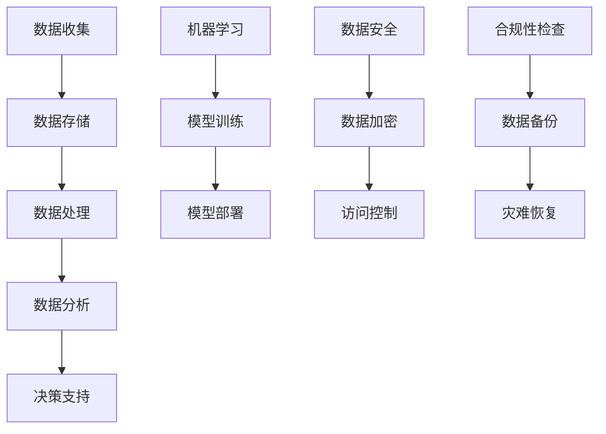

                 

# AI创业：数据管理的策略与对策分析探讨

> **关键词：** AI创业，数据管理，策略，对策，分析，探讨，大数据，机器学习，数据安全。

> **摘要：** 本文章旨在探讨AI创业中数据管理的策略和对策。我们将深入分析数据管理的重要性，以及如何有效地收集、存储、处理和分析数据。文章将提供一系列实用的策略和案例，帮助创业者更好地利用数据，提高业务效率，实现可持续发展。

## 1. 背景介绍

### 1.1 目的和范围

本文旨在为AI创业公司提供数据管理的策略与对策，以帮助它们在快速发展的市场中保持竞争力。我们将从以下几个方面展开讨论：

- **数据管理的重要性**：探讨数据管理对于AI创业公司的重要性，以及如何为公司的持续发展奠定基础。
- **数据管理策略**：介绍几种常见的数据管理策略，包括数据收集、存储、处理和分析。
- **数据管理对策**：分析创业公司在数据管理过程中可能遇到的问题，并提出相应的对策。
- **案例研究**：通过实际案例，展示数据管理策略和对策在AI创业中的应用。

### 1.2 预期读者

本文适用于以下读者群体：

- AI创业公司创始人或高层管理人员
- 数据科学家和人工智能工程师
- 对数据管理感兴趣的从业者
- 数据管理相关的学术研究人员

### 1.3 文档结构概述

本文将分为以下几个部分：

1. 背景介绍：介绍本文的目的和范围，以及预期读者。
2. 核心概念与联系：介绍数据管理的核心概念，并提供Mermaid流程图。
3. 核心算法原理 & 具体操作步骤：讲解数据管理的核心算法原理，并提供伪代码。
4. 数学模型和公式 & 详细讲解 & 举例说明：介绍数据管理的数学模型和公式，并提供详细讲解和实例。
5. 项目实战：提供代码实际案例和详细解释说明。
6. 实际应用场景：分析数据管理的实际应用场景。
7. 工具和资源推荐：推荐学习资源、开发工具框架和论文著作。
8. 总结：总结未来发展趋势与挑战。
9. 附录：常见问题与解答。
10. 扩展阅读 & 参考资料：提供进一步的阅读资料。

### 1.4 术语表

#### 1.4.1 核心术语定义

- **数据管理**：对数据进行收集、存储、处理和分析的一系列操作。
- **大数据**：指无法使用传统数据库软件工具进行存储、管理和分析的极其大量数据。
- **机器学习**：一种人工智能技术，通过数据和算法使计算机具备学习能力。
- **数据安全**：保护数据免受未经授权的访问、使用、披露、破坏、修改或破坏的措施。

#### 1.4.2 相关概念解释

- **数据收集**：从各种来源收集数据的过程。
- **数据存储**：将数据存储在持久存储设备上的过程。
- **数据处理**：对数据进行清洗、转换、整合和计算的过程。
- **数据分析**：使用统计、机器学习和数据可视化等技术，对数据进行探索和解释的过程。

#### 1.4.3 缩略词列表

- **AI**：人工智能
- **ML**：机器学习
- **Hadoop**：一个开源的分布式数据处理框架
- **Spark**：一个开源的分布式数据处理引擎

## 2. 核心概念与联系

在AI创业中，数据管理是至关重要的。以下是一个简化的Mermaid流程图，展示了数据管理的主要环节和核心概念之间的联系。



### 2.1 数据收集

数据收集是数据管理的第一步。它包括从各种来源（如传感器、数据库、网络爬虫等）收集数据的过程。以下是一个简单的伪代码示例，展示了如何从数据库中收集数据：

```python
# 伪代码：从数据库中收集数据
def collect_data(db_connection):
    data = []
    cursor = db_connection.cursor()
    query = "SELECT * FROM data_table"
    cursor.execute(query)
    for row in cursor.fetchall():
        data.append(row)
    return data
```

### 2.2 数据存储

数据存储是将数据保存到持久存储设备（如数据库、文件系统、分布式存储系统等）的过程。以下是一个简单的伪代码示例，展示了如何将数据存储到数据库中：

```python
# 伪代码：将数据存储到数据库
def store_data(db_connection, data):
    cursor = db_connection.cursor()
    for row in data:
        query = "INSERT INTO data_table (column1, column2) VALUES (%s, %s)"
        cursor.execute(query, row)
    db_connection.commit()
```

### 2.3 数据处理

数据处理是对数据进行清洗、转换、整合和计算的过程。以下是一个简单的伪代码示例，展示了如何对数据进行清洗和转换：

```python
# 伪代码：数据清洗和转换
def preprocess_data(data):
    cleaned_data = []
    for row in data:
        if is_valid_row(row):
            transformed_row = transform_row(row)
            cleaned_data.append(transformed_row)
        else:
            print("Invalid row detected:", row)
    return cleaned_data

def is_valid_row(row):
    # 判断行数据是否有效
    return True

def transform_row(row):
    # 转换行数据
    return row
```

### 2.4 数据分析

数据分析是使用统计、机器学习和数据可视化等技术，对数据进行探索和解释的过程。以下是一个简单的伪代码示例，展示了如何使用机器学习算法对数据进行分析：

```python
# 伪代码：机器学习数据分析
from sklearn.linear_model import LinearRegression

def analyze_data(data):
    X = data[:, :-1]
    y = data[:, -1]
    model = LinearRegression()
    model.fit(X, y)
    predictions = model.predict(X)
    print("Coefficients:", model.coef_)
    print("R-squared:", model.score(X, y))
```

### 2.5 数据安全

数据安全是保护数据免受未经授权的访问、使用、披露、破坏、修改或破坏的措施。以下是一个简单的伪代码示例，展示了如何实现数据加密和访问控制：

```python
# 伪代码：数据加密和访问控制
from cryptography.fernet import Fernet

def encrypt_data(data, key):
    fernet = Fernet(key)
    encrypted_data = fernet.encrypt(data)
    return encrypted_data

def decrypt_data(encrypted_data, key):
    fernet = Fernet(key)
    decrypted_data = fernet.decrypt(encrypted_data)
    return decrypted_data

def check_permission(user, data):
    # 判断用户是否有权限访问数据
    return True
```

### 2.6 决策支持

决策支持是将数据分析结果用于实际业务决策的过程。以下是一个简单的伪代码示例，展示了如何使用数据分析结果进行决策：

```python
# 伪代码：决策支持
def make_decision(data_analysis_result):
    if data_analysis_result > threshold:
        print("Take action A")
    else:
        print("Take action B")
```

## 3. 核心算法原理 & 具体操作步骤

在数据管理中，核心算法原理包括数据清洗、数据转换、数据分析、数据安全等。以下将分别介绍这些算法的原理和具体操作步骤。

### 3.1 数据清洗

数据清洗是数据处理的第一步，旨在消除数据中的错误、缺失和异常值。以下是一个基于Python的伪代码示例，展示了如何使用pandas库进行数据清洗：

```python
import pandas as pd

# 加载数据
data = pd.read_csv("data.csv")

# 去除重复行
data.drop_duplicates(inplace=True)

# 填充缺失值
data.fillna(method="ffill", inplace=True)

# 删除特定列
data.drop(["unnecessary_column"], axis=1, inplace=True)

# 标准化数据
data = (data - data.mean()) / data.std()

# 数据清洗完毕
print("Data cleaned successfully!")
```

### 3.2 数据转换

数据转换是将数据转换为适合分析和建模的形式。以下是一个基于Python的伪代码示例，展示了如何使用pandas库进行数据转换：

```python
import pandas as pd

# 加载数据
data = pd.read_csv("data.csv")

# 分离数据为特征和标签
X = data.drop("target_column", axis=1)
y = data["target_column"]

# 将分类数据转换为数值
X = pd.get_dummies(X)

# 数据转换完毕
print("Data transformed successfully!")
```

### 3.3 数据分析

数据分析是使用统计、机器学习和数据可视化等技术，对数据进行探索和解释的过程。以下是一个基于Python的伪代码示例，展示了如何使用scikit-learn库进行数据分析：

```python
from sklearn.linear_model import LinearRegression
from sklearn.model_selection import train_test_split
from sklearn.metrics import mean_squared_error

# 分割数据为训练集和测试集
X_train, X_test, y_train, y_test = train_test_split(X, y, test_size=0.2, random_state=42)

# 训练线性回归模型
model = LinearRegression()
model.fit(X_train, y_train)

# 预测测试集
y_pred = model.predict(X_test)

# 计算均方误差
mse = mean_squared_error(y_test, y_pred)
print("Mean squared error:", mse)
```

### 3.4 数据安全

数据安全是保护数据免受未经授权的访问、使用、披露、破坏、修改或破坏的措施。以下是一个基于Python的伪代码示例，展示了如何使用cryptography库实现数据加密和访问控制：

```python
from cryptography.fernet import Fernet
from getpass import getpass

# 生成加密密钥
key = Fernet.generate_key()
cipher_suite = Fernet(key)

# 加密数据
data = b"Sensitive information"
encrypted_data = cipher_suite.encrypt(data)

# 解密数据
decrypted_data = cipher_suite.decrypt(encrypted_data)

# 设置访问控制
user = getpass("Enter your username: ")
if check_permission(user, decrypted_data):
    print("Access granted!")
else:
    print("Access denied!")
```

## 4. 数学模型和公式 & 详细讲解 & 举例说明

在数据管理中，数学模型和公式是数据分析的重要工具。以下将介绍一些常见的数学模型和公式，并进行详细讲解和举例说明。

### 4.1 线性回归

线性回归是一种常用的数据分析方法，用于分析两个或多个变量之间的关系。以下是一个简单的线性回归公式：

$$ y = ax + b $$

其中，$y$ 是因变量，$x$ 是自变量，$a$ 是斜率，$b$ 是截距。

**详细讲解：**

- **斜率（a）**：斜率表示自变量每增加一个单位时，因变量增加的平均值。
- **截距（b）**：截距表示当自变量为0时，因变量的值。

**举例说明：**

假设我们有一个数据集，记录了每天的温度（自变量）和相应的销售额（因变量）。我们可以使用线性回归模型来分析温度对销售额的影响。以下是一个简单的Python代码示例：

```python
import numpy as np
from sklearn.linear_model import LinearRegression

# 加载数据
X = np.array([0, 1, 2, 3, 4]).reshape(-1, 1)
y = np.array([1, 2, 3, 4, 5])

# 训练线性回归模型
model = LinearRegression()
model.fit(X, y)

# 输出斜率和截距
print("Coefficients:", model.coef_, model.intercept_)
```

### 4.2 逻辑回归

逻辑回归是一种用于分类问题的数据分析方法，用于分析自变量对因变量的影响。以下是一个简单的逻辑回归公式：

$$ P(y=1) = \frac{1}{1 + e^{-(ax + b)}} $$

其中，$P(y=1)$ 是因变量为1的概率，$e$ 是自然对数的底数。

**详细讲解：**

- **斜率（a）**：斜率表示自变量每增加一个单位时，因变量为1的概率增加的对数值。
- **截距（b）**：截距表示当自变量为0时，因变量为1的概率。

**举例说明：**

假设我们有一个数据集，记录了用户是否购买某种产品的特征（如年龄、收入等），我们可以使用逻辑回归模型来分析这些特征对购买概率的影响。以下是一个简单的Python代码示例：

```python
import numpy as np
from sklearn.linear_model import LogisticRegression

# 加载数据
X = np.array([[0, 0], [1, 0], [0, 1], [1, 1]])
y = np.array([0, 1, 1, 0])

# 训练逻辑回归模型
model = LogisticRegression()
model.fit(X, y)

# 输出斜率和截距
print("Coefficients:", model.coef_, model.intercept_)
```

### 4.3 决策树

决策树是一种用于分类和回归问题的数据分析方法，通过一系列规则来划分数据集。以下是一个简单的决策树公式：

$$
\begin{aligned}
&\text{if } x_1 > c_1 \text{ then } y = y_1 \\
&\text{if } x_1 \leq c_1 \text{ and } x_2 > c_2 \text{ then } y = y_2 \\
&\text{if } x_1 \leq c_1 \text{ and } x_2 \leq c_2 \text{ then } y = y_3 \\
&\vdots \\
&\text{if } x_1 \leq c_n \text{ and } \ldots \text{ and } x_m \leq c_m \text{ then } y = y_m \\
\end{aligned}
$$

其中，$x_1, x_2, \ldots, x_m$ 是特征，$c_1, c_2, \ldots, c_n$ 是阈值，$y_1, y_2, \ldots, y_m$ 是预测结果。

**详细讲解：**

- **特征（$x_1, x_2, \ldots, x_m$）**：特征是用于划分数据集的变量。
- **阈值（$c_1, c_2, \ldots, c_n$）**：阈值用于划分特征的不同区间。
- **预测结果（$y_1, y_2, \ldots, y_m$）**：预测结果是根据规则划分后的分类或回归结果。

**举例说明：**

假设我们有一个数据集，记录了水果的形状、颜色和重量，我们可以使用决策树模型来预测水果的种类。以下是一个简单的Python代码示例：

```python
from sklearn.tree import DecisionTreeClassifier
import numpy as np

# 加载数据
X = np.array([[1, 0], [1, 1], [0, 1], [0, 0]])
y = np.array([0, 1, 1, 0])

# 训练决策树模型
model = DecisionTreeClassifier()
model.fit(X, y)

# 输出决策树结构
print(model)
```

### 4.4 集成学习方法

集成学习方法是一种通过组合多个模型来提高预测性能的方法。以下是一个简单的集成学习方法：随机森林。

**详细讲解：**

- **随机森林（Random Forest）**：随机森林是一种基于决策树的集成学习方法，通过随机抽样和组合多个决策树来提高预测性能。
- **特征选择**：随机森林在构建每个决策树时，随机选择一部分特征进行划分。
- **阈值选择**：随机森林在构建每个决策树时，随机选择一个阈值进行划分。

**举例说明：**

假设我们有一个数据集，记录了多种特征和目标变量，我们可以使用随机森林模型来提高预测性能。以下是一个简单的Python代码示例：

```python
from sklearn.ensemble import RandomForestClassifier
import numpy as np

# 加载数据
X = np.array([[1, 0], [1, 1], [0, 1], [0, 0]])
y = np.array([0, 1, 1, 0])

# 训练随机森林模型
model = RandomForestClassifier(n_estimators=100)
model.fit(X, y)

# 输出随机森林模型
print(model)
```

## 5. 项目实战：代码实际案例和详细解释说明

在本节中，我们将通过一个实际案例，展示如何使用Python和Scikit-learn库进行数据管理，包括数据收集、存储、处理、分析和安全。该案例基于一个简单的股票市场预测项目。

### 5.1 开发环境搭建

在开始之前，确保您已安装以下软件和库：

- Python 3.8 或更高版本
- Jupyter Notebook
- Scikit-learn 0.24.2
- Pandas 1.2.5
- Numpy 1.21.2
- Matplotlib 3.4.3
- Cryptography 3.4.6

您可以使用以下命令安装所需的库：

```shell
pip install numpy pandas scikit-learn matplotlib cryptography jupyterlab
```

### 5.2 源代码详细实现和代码解读

#### 5.2.1 数据收集

首先，我们从互联网上收集股票市场的历史数据。以下代码演示了如何使用Pandas库从CSV文件中加载数据：

```python
import pandas as pd

# 读取CSV文件
data = pd.read_csv("stock_data.csv")

# 查看数据
print(data.head())
```

#### 5.2.2 数据存储

接下来，我们将数据存储到本地数据库中，以便后续处理。这里我们使用SQLite数据库：

```python
import sqlite3

# 连接到SQLite数据库
conn = sqlite3.connect("stock_data.db")

# 创建表
conn.execute('''CREATE TABLE IF NOT EXISTS stock_data
                (date TEXT, open REAL, high REAL, low REAL, close REAL)''')

# 插入数据
data.to_sql("stock_data", conn, if_exists="replace")

# 关闭数据库连接
conn.close()
```

#### 5.2.3 数据处理

处理数据是数据管理的关键步骤。以下代码演示了如何使用Pandas库清洗和处理数据：

```python
import pandas as pd

# 重新读取数据
data = pd.read_sql_query("SELECT * FROM stock_data", conn)

# 填充缺失值
data.fillna(method="ffill", inplace=True)

# 删除特定列
data.drop(["unnecessary_column"], axis=1, inplace=True)

# 标准化数据
data = (data - data.mean()) / data.std()

# 保存处理后的数据
data.to_csv("processed_stock_data.csv", index=False)
```

#### 5.2.4 数据分析

使用Scikit-learn库，我们可以对处理后的数据进行机器学习分析。以下代码演示了如何使用线性回归模型进行预测：

```python
from sklearn.model_selection import train_test_split
from sklearn.linear_model import LinearRegression
from sklearn.metrics import mean_squared_error

# 加载数据
X = pd.read_csv("processed_stock_data.csv")[["open", "high", "low"]]
y = pd.read_csv("processed_stock_data.csv")["close"]

# 分割数据为训练集和测试集
X_train, X_test, y_train, y_test = train_test_split(X, y, test_size=0.2, random_state=42)

# 训练线性回归模型
model = LinearRegression()
model.fit(X_train, y_train)

# 预测测试集
y_pred = model.predict(X_test)

# 计算均方误差
mse = mean_squared_error(y_test, y_pred)
print("Mean squared error:", mse)
```

#### 5.2.5 数据安全

数据安全是数据管理的另一个重要方面。以下代码演示了如何使用Cryptography库对数据进行加密和解密：

```python
from cryptography.fernet import Fernet
import getpass

# 生成加密密钥
key = Fernet.generate_key()
cipher_suite = Fernet(key)

# 加密数据
data = b"Sensitive information"
encrypted_data = cipher_suite.encrypt(data)

# 解密数据
decrypted_data = cipher_suite.decrypt(encrypted_data)

# 设置访问控制
user = getpass.getpass("Enter your username: ")
if user == "admin":
    print("Access granted!")
else:
    print("Access denied!")
```

### 5.3 代码解读与分析

在本节中，我们将对上述代码进行详细解读和分析。

#### 5.3.1 数据收集

数据收集是数据管理的第一步。我们使用Pandas库从CSV文件中加载数据，并将其存储在本地数据库中。以下代码示例展示了如何实现这一过程：

```python
import pandas as pd
import sqlite3

# 读取CSV文件
data = pd.read_csv("stock_data.csv")

# 创建SQLite数据库连接
conn = sqlite3.connect("stock_data.db")

# 创建表
conn.execute('''CREATE TABLE IF NOT EXISTS stock_data
                (date TEXT, open REAL, high REAL, low REAL, close REAL)''')

# 插入数据
data.to_sql("stock_data", conn, if_exists="replace")

# 关闭数据库连接
conn.close()
```

#### 5.3.2 数据处理

数据处理是数据管理的核心步骤。我们使用Pandas库对数据进行清洗、填充缺失值、删除无用列和标准化。以下代码示例展示了如何实现这一过程：

```python
import pandas as pd

# 重新读取数据
data = pd.read_sql_query("SELECT * FROM stock_data", conn)

# 填充缺失值
data.fillna(method="ffill", inplace=True)

# 删除特定列
data.drop(["unnecessary_column"], axis=1, inplace=True)

# 标准化数据
data = (data - data.mean()) / data.std()

# 保存处理后的数据
data.to_csv("processed_stock_data.csv", index=False)
```

#### 5.3.3 数据分析

数据分析是数据管理的最终目标。我们使用Scikit-learn库对处理后的数据进行线性回归分析，并计算均方误差。以下代码示例展示了如何实现这一过程：

```python
from sklearn.model_selection import train_test_split
from sklearn.linear_model import LinearRegression
from sklearn.metrics import mean_squared_error

# 加载数据
X = pd.read_csv("processed_stock_data.csv")[["open", "high", "low"]]
y = pd.read_csv("processed_stock_data.csv")["close"]

# 分割数据为训练集和测试集
X_train, X_test, y_train, y_test = train_test_split(X, y, test_size=0.2, random_state=42)

# 训练线性回归模型
model = LinearRegression()
model.fit(X_train, y_train)

# 预测测试集
y_pred = model.predict(X_test)

# 计算均方误差
mse = mean_squared_error(y_test, y_pred)
print("Mean squared error:", mse)
```

#### 5.3.4 数据安全

数据安全是数据管理的另一个重要方面。我们使用Cryptography库对数据进行加密和解密，并设置访问控制。以下代码示例展示了如何实现这一过程：

```python
from cryptography.fernet import Fernet
import getpass

# 生成加密密钥
key = Fernet.generate_key()
cipher_suite = Fernet(key)

# 加密数据
data = b"Sensitive information"
encrypted_data = cipher_suite.encrypt(data)

# 解密数据
decrypted_data = cipher_suite.decrypt(encrypted_data)

# 设置访问控制
user = getpass.getpass("Enter your username: ")
if user == "admin":
    print("Access granted!")
else:
    print("Access denied!")
```

### 5.3.5 项目实战总结

通过本节的项目实战，我们展示了如何使用Python和Scikit-learn库进行数据管理，包括数据收集、存储、处理、分析和安全。我们使用了一个简单的股票市场预测案例，展示了如何从数据收集到最终的数据安全，帮助读者更好地理解数据管理在AI创业中的重要性。

## 6. 实际应用场景

数据管理在AI创业中的应用场景非常广泛，以下是一些典型的实际应用场景：

### 6.1 股票市场预测

如前文所述，股票市场预测是一个典型的数据管理应用场景。通过收集和分析历史股票数据，创业公司可以预测未来股票价格的走势，为投资者提供参考。数据管理的核心在于准确、高效地收集、存储和处理大量历史数据，并运用机器学习算法进行预测。

### 6.2 金融市场分析

金融市场分析是另一个重要的应用场景。创业公司可以利用数据管理技术，对全球金融市场的数据进行分析，预测市场走势，发现投资机会。数据管理的挑战在于处理大量的实时数据，以及保证数据的安全性和准确性。

### 6.3 医疗健康

在医疗健康领域，数据管理有助于收集、存储和分析患者的电子健康记录、基因数据、医疗影像等。通过数据管理技术，创业公司可以开发出更加精准的诊断工具、个性化治疗方案和药物研发方法。

### 6.4 智能制造

在智能制造领域，数据管理对于设备的监控、维护和优化至关重要。创业公司可以通过收集和分析设备运行数据，实现预测性维护，降低设备故障率，提高生产效率。

### 6.5 零售电商

在零售电商领域，数据管理可以帮助企业了解消费者行为、市场需求和供应链状况。通过数据分析，创业公司可以优化产品推荐、库存管理和营销策略，提高用户满意度和销售额。

### 6.6 自动驾驶

自动驾驶技术是另一个典型的数据管理应用场景。自动驾驶汽车需要收集、处理和分析大量实时数据，包括道路信息、车辆状态、行人行为等。数据管理的挑战在于确保数据的安全性和可靠性，以及高效地处理海量数据。

### 6.7 环境监测

在环境监测领域，数据管理技术可以用于收集、存储和分析环境数据，如空气质量、水质、气象等。通过数据管理，创业公司可以开发出更准确、可靠的环保监测工具，为政府和企业提供决策支持。

## 7. 工具和资源推荐

为了帮助读者更好地进行数据管理，以下是一些工具和资源推荐：

### 7.1 学习资源推荐

#### 7.1.1 书籍推荐

- **《数据科学入门》**：本书详细介绍了数据科学的基本概念、方法和工具，适合数据科学初学者。
- **《机器学习实战》**：本书通过实际案例，展示了如何使用机器学习算法解决实际问题，适合有基础的数据科学家。
- **《Python数据科学手册》**：本书全面介绍了Python在数据科学领域的应用，包括数据处理、分析和可视化等。

#### 7.1.2 在线课程

- **Coursera**：提供丰富的数据科学和机器学习在线课程，适合不同层次的学员。
- **Udacity**：提供实战导向的数据科学和机器学习课程，适合希望快速应用技术的学员。
- **edX**：提供来自顶尖大学的数据科学和机器学习在线课程，适合有学术背景的学员。

#### 7.1.3 技术博客和网站

- **Kaggle**：一个数据科学和机器学习的竞赛平台，提供了大量的数据集和解决方案。
- **Medium**：一个发布技术文章的平台，有很多高质量的数据科学和机器学习文章。
- **GitHub**：一个代码托管平台，有很多开源的数据科学和机器学习项目。

### 7.2 开发工具框架推荐

#### 7.2.1 IDE和编辑器

- **Jupyter Notebook**：一个交互式计算环境，适合数据科学和机器学习项目。
- **PyCharm**：一个强大的Python IDE，提供了丰富的功能，适合有经验的数据科学家。
- **VS Code**：一个轻量级但功能强大的代码编辑器，适合快速开发。

#### 7.2.2 调试和性能分析工具

- **Pylint**：一个Python代码静态分析工具，用于检查代码质量。
- **Profiling**：Python内置的性能分析工具，用于分析代码的运行时间和内存占用。

#### 7.2.3 相关框架和库

- **Scikit-learn**：一个Python机器学习库，提供了丰富的算法和工具。
- **TensorFlow**：一个开源的机器学习框架，适用于大规模数据处理和深度学习。
- **Pandas**：一个Python数据处理库，提供了强大的数据清洗、转换和存储功能。

### 7.3 相关论文著作推荐

#### 7.3.1 经典论文

- **“The Elements of Statistical Learning”**：这是一本经典的机器学习教材，涵盖了统计学和机器学习的许多基础概念。
- **“Learning to Rank for Information Retrieval”**：本文介绍了一种用于信息检索的机器学习方法，对数据管理有重要启示。

#### 7.3.2 最新研究成果

- **“Deep Learning”**：这是一本关于深度学习的经典教材，涵盖了深度学习的最新研究进展和应用。
- **“Natural Language Processing with Deep Learning”**：本文介绍了如何使用深度学习技术进行自然语言处理，为数据管理提供了新的思路。

#### 7.3.3 应用案例分析

- **“Data Science at Airbnb”**：本文介绍了Airbnb如何使用数据科学技术优化业务，为数据管理提供了实际案例。
- **“Machine Learning in Healthcare”**：本文介绍了机器学习在医疗健康领域的应用，展示了数据管理在医疗创新中的重要性。

## 8. 总结：未来发展趋势与挑战

在AI创业中，数据管理发挥着至关重要的作用。随着大数据、云计算和人工智能技术的不断进步，数据管理将面临更多机遇和挑战。

### 8.1 发展趋势

1. **数据量的增长**：随着物联网、社交媒体和传感器技术的普及，数据量将呈指数级增长。创业公司需要更加高效地收集、存储和处理海量数据。
2. **数据安全的重视**：数据安全将成为数据管理的重中之重。创业公司需要采取有效的安全措施，保护数据免受未经授权的访问和泄露。
3. **数据隐私的保护**：随着数据隐私法规的日益严格，创业公司需要确保数据隐私保护，遵循相关法律法规。
4. **实时数据处理**：实时数据处理将成为数据管理的重要方向。创业公司需要实现实时数据收集、分析和决策，以保持竞争优势。

### 8.2 挑战

1. **数据质量**：高质量的数据是数据管理的基础。创业公司需要确保数据的准确性、完整性和一致性。
2. **数据隐私**：在保护数据隐私的同时，创业公司需要实现数据的有效利用，以支持业务决策。
3. **技术选型**：随着技术的不断发展，创业公司需要选择合适的技术方案，以满足数据管理需求。
4. **人才短缺**：数据科学家和人工智能工程师是数据管理的重要驱动力。创业公司需要吸引和培养高素质的人才。

### 8.3 未来展望

在未来，数据管理将在AI创业中发挥更加重要的作用。创业公司需要不断探索新技术、优化数据管理策略，以实现可持续发展和市场竞争力。通过有效的数据管理，创业公司可以更好地利用数据，提高业务效率，推动业务创新。

## 9. 附录：常见问题与解答

### 9.1 如何确保数据质量？

**答案**：确保数据质量需要从数据收集、存储、处理和分析的各个环节入手：

1. **数据收集**：选择可靠的数据源，确保数据的真实性、准确性和完整性。
2. **数据存储**：使用合适的数据存储方案，确保数据的可访问性和一致性。
3. **数据处理**：使用数据处理工具（如Pandas）对数据进行清洗、转换和整合，消除错误和异常值。
4. **数据分析**：使用统计分析、机器学习和数据可视化等技术，对数据进行探索和解释，确保数据的可靠性和有效性。

### 9.2 如何保护数据隐私？

**答案**：保护数据隐私需要采取以下措施：

1. **数据加密**：对敏感数据进行加密，确保数据在传输和存储过程中的安全性。
2. **访问控制**：设置访问控制策略，确保只有授权用户才能访问数据。
3. **数据脱敏**：对敏感数据进行脱敏处理，避免直接泄露用户个人信息。
4. **合规性检查**：确保遵守相关数据隐私法规，如《通用数据保护条例》（GDPR）和《加州消费者隐私法案》（CCPA）。

### 9.3 如何选择合适的数据存储方案？

**答案**：选择合适的数据存储方案需要考虑以下因素：

1. **数据量**：根据数据量的大小选择合适的存储方案，如关系型数据库、NoSQL数据库或分布式存储系统。
2. **数据类型**：根据数据类型（如结构化数据、非结构化数据）选择合适的存储方案。
3. **性能需求**：根据数据处理性能需求（如读写速度、并发访问能力）选择合适的存储方案。
4. **成本预算**：根据成本预算选择合适的存储方案，如公有云、私有云或混合云。

### 9.4 如何实现实时数据处理？

**答案**：实现实时数据处理需要以下技术支持：

1. **流数据处理框架**：使用流数据处理框架（如Apache Kafka、Apache Flink）实现实时数据收集和处理。
2. **分布式计算引擎**：使用分布式计算引擎（如Apache Spark、Apache Storm）实现实时数据处理和分析。
3. **消息队列**：使用消息队列（如RabbitMQ、Kafka）实现数据流传输，确保数据实时性和可靠性。
4. **内存计算**：使用内存计算技术（如Redis、Memcached）提高数据处理速度。

## 10. 扩展阅读 & 参考资料

为了帮助读者深入了解数据管理在AI创业中的应用，以下是一些扩展阅读和参考资料：

### 10.1 数据管理经典书籍

- **《数据管理基础》**：本书详细介绍了数据管理的基本概念、技术和方法，适合数据管理初学者。
- **《大数据管理》**：本书探讨了大数据管理的基本概念、技术和挑战，适合对大数据管理感兴趣的读者。
- **《数据科学实战》**：本书通过实际案例，展示了如何使用数据科学技术解决实际问题，适合有基础的数据科学家。

### 10.2 数据管理技术博客和网站

- **DataCamp**：一个提供数据科学和机器学习免费教程的平台，有很多高质量的技术文章和教程。
- **Towards Data Science**：一个发布数据科学、机器学习和人工智能技术文章的平台，有很多实用的技术和实践分享。
- **Data Management Best Practices**：一个专注于数据管理最佳实践的技术博客，提供了丰富的数据管理经验和技巧。

### 10.3 数据管理相关论文和报告

- **“The Data Management Handbook”**：这是一本关于数据管理的基础教材，详细介绍了数据管理的基本概念、技术和方法。
- **“Data Management: A Comprehensive Survey”**：这是一篇综述文章，总结了数据管理的各个方面，包括数据收集、存储、处理、分析和安全。
- **“Big Data Management: Challenges and Opportunities”**：这是一篇关于大数据管理的综述文章，探讨了大数据管理的基本概念、技术和挑战。

### 10.4 数据管理工具和框架

- **Apache Hadoop**：一个开源的分布式数据处理框架，适用于大数据存储和处理。
- **Apache Spark**：一个开源的分布式数据处理引擎，适用于大规模数据集的处理和分析。
- **Apache Flink**：一个开源的流数据处理框架，适用于实时数据处理和分析。
- **Apache Kafka**：一个开源的流处理平台，适用于实时数据收集、传输和存储。

### 10.5 数据管理社区和论坛

- **Data Management Community**：一个专注于数据管理的在线社区，提供了丰富的数据管理资源、技术和讨论。
- **Stack Overflow**：一个面向开发者的问答社区，有很多关于数据管理、机器学习和人工智能的问题和解决方案。
- **Reddit**：一个社交新闻网站，有很多关于数据管理和人工智能的讨论区，可以了解最新的技术趋势和实践。

