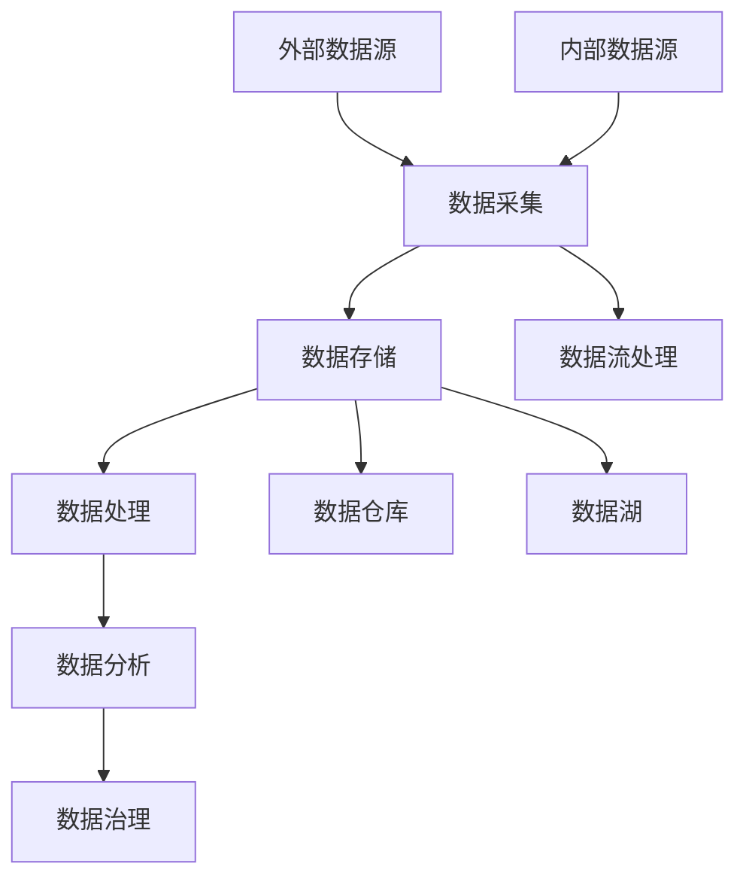
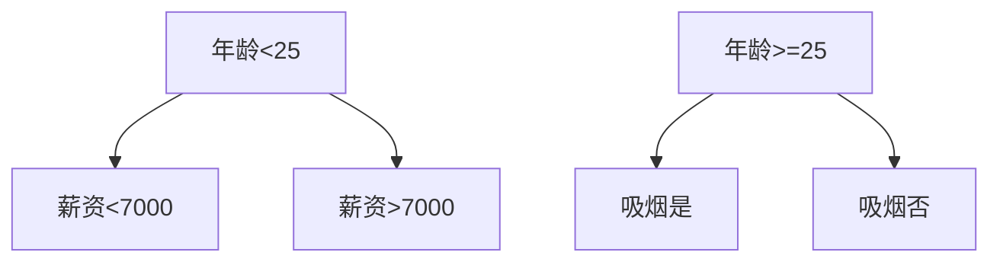

                 

# AI创业：数据管理的策略与工具

> **关键词：** 数据管理、AI创业、数据策略、数据分析工具、数据处理、数据治理
>
> **摘要：** 本文旨在探讨AI创业过程中数据管理的策略与工具，包括数据采集、存储、处理、分析和治理等关键环节。通过对核心概念、算法原理、数学模型和实际案例的深入分析，为创业者提供实用的数据管理指南，助力企业实现数据驱动发展。

## 1. 背景介绍

### 1.1 目的和范围

本文将聚焦于AI创业公司中的数据管理策略与工具，探讨数据管理在创业过程中的重要性。文章将首先介绍数据管理的基本概念，然后分析数据管理的核心环节，包括数据采集、存储、处理、分析和治理。此外，还将介绍一些常见的数据管理工具和框架，以帮助创业者更好地应对数据管理挑战。

### 1.2 预期读者

本文适合以下读者群体：

1. 创业公司创始人或技术团队成员
2. 数据科学家、数据分析师和AI工程师
3. 对数据管理感兴趣的IT专业人士
4. 对AI创业和数据分析感兴趣的学术研究人员

### 1.3 文档结构概述

本文结构如下：

1. 背景介绍：介绍本文目的、预期读者和文档结构。
2. 核心概念与联系：讨论数据管理的基本概念和原理，并使用Mermaid流程图展示数据管理架构。
3. 核心算法原理 & 具体操作步骤：详细讲解数据处理的算法原理，并使用伪代码进行阐述。
4. 数学模型和公式 & 详细讲解 & 举例说明：介绍数据管理中的数学模型和公式，并进行详细解释和举例。
5. 项目实战：代码实际案例和详细解释说明。
6. 实际应用场景：分析数据管理在不同领域的应用场景。
7. 工具和资源推荐：推荐学习资源和开发工具。
8. 总结：未来发展趋势与挑战。
9. 附录：常见问题与解答。
10. 扩展阅读 & 参考资料：提供进一步学习的资源。

### 1.4 术语表

#### 1.4.1 核心术语定义

- **数据管理**：对数据进行采集、存储、处理、分析和治理的过程。
- **数据采集**：从各种来源收集数据，如传感器、数据库、网络等。
- **数据存储**：将数据存储在适当的存储介质中，如数据库、文件系统等。
- **数据处理**：对数据进行清洗、转换、聚合等操作，使其具备分析价值。
- **数据分析**：使用统计、机器学习等方法对数据进行挖掘和分析。
- **数据治理**：确保数据质量、安全、合规，并建立数据管理和使用规范。

#### 1.4.2 相关概念解释

- **数据仓库**：用于存储大规模数据的系统，支持高效的数据查询和分析。
- **数据湖**：一种分布式存储系统，用于存储原始数据，支持数据挖掘和分析。
- **数据流处理**：对实时数据进行处理和分析的技术，如Apache Kafka、Apache Flink等。
- **数据治理框架**：用于建立数据管理和使用规范，如Data Governance Framework、Data Management Framework等。

#### 1.4.3 缩略词列表

- **AI**：人工智能（Artificial Intelligence）
- **ML**：机器学习（Machine Learning）
- **DB**：数据库（Database）
- **ETL**：提取、转换、加载（Extract, Transform, Load）
- **DataOps**：一种数据管理实践，强调协作、自动化和持续改进。

## 2. 核心概念与联系

在AI创业过程中，数据管理是至关重要的。数据管理涉及多个核心概念，如数据采集、存储、处理、分析和治理，这些概念相互关联，共同构成一个完整的数据管理架构。

下面是一个使用Mermaid流程图展示的数据管理架构：



### 2.1 数据采集

数据采集是数据管理的第一步，主要涉及从各种来源收集数据。这些来源可以包括传感器、数据库、网络、文件系统等。数据采集的关键在于确保数据的准确性和完整性。

### 2.2 数据存储

数据存储是将数据保存到适当的存储介质中，如数据库、文件系统、数据仓库、数据湖等。数据存储的关键在于选择合适的存储方案，以支持高效的数据查询和分析。

### 2.3 数据处理

数据处理是对数据进行清洗、转换、聚合等操作，使其具备分析价值。数据处理的关键在于选择合适的数据处理算法和工具，以提高数据处理效率和数据质量。

### 2.4 数据分析

数据分析是使用统计、机器学习等方法对数据进行挖掘和分析，以发现数据中的规律和趋势。数据分析的关键在于选择合适的数据分析方法，以支持业务决策。

### 2.5 数据治理

数据治理是确保数据质量、安全、合规，并建立数据管理和使用规范的过程。数据治理的关键在于建立完善的数据治理体系，以支持数据驱动发展。

## 3. 核心算法原理 & 具体操作步骤

在数据管理过程中，核心算法起着关键作用。本节将详细讲解数据处理和分析的核心算法原理，并使用伪代码进行阐述。

### 3.1 数据清洗

数据清洗是数据处理的第一步，主要涉及去除重复数据、处理缺失值、修正错误数据等。

```python
def data_cleaning(data):
    # 去除重复数据
    data = list(set(data))
    # 处理缺失值
    for i in range(len(data)):
        if data[i] is None:
            data[i] = data[i - 1]
    # 修正错误数据
    for i in range(len(data)):
        if data[i] < 0:
            data[i] = 0
    return data
```

### 3.2 数据转换

数据转换是将数据从一种格式转换为另一种格式，以便进行后续处理。

```python
def data_conversion(data, format):
    if format == "csv":
        data = [line.strip().split(",") for line in data]
    elif format == "json":
        data = json.loads(data)
    return data
```

### 3.3 数据聚合

数据聚合是对数据进行分组和汇总，以提取有价值的信息。

```python
def data_aggregation(data, group_by, aggregations):
    grouped_data = {}
    for d in data:
        key = d[group_by]
        if key not in grouped_data:
            grouped_data[key] = []
        grouped_data[key].append(d)
    aggregated_data = []
    for key, values in grouped_data.items():
        aggregated_data.append({key: sum(values)})
    return aggregated_data
```

### 3.4 数据分析

数据分析是使用统计、机器学习等方法对数据进行挖掘和分析。

```python
def data_analysis(data, method, parameters):
    if method == "regression":
        model = LinearRegression()
        model.fit(data[:, :-1], data[:, -1])
        predictions = model.predict(data[:, :-1])
        return predictions
    elif method == "classification":
        model = SVC()
        model.fit(data[:, :-1], data[:, -1])
        predictions = model.predict(data[:, :-1])
        return predictions
```

## 4. 数学模型和公式 & 详细讲解 & 举例说明

在数据管理过程中，数学模型和公式起着关键作用。本节将介绍一些常用的数学模型和公式，并进行详细解释和举例。

### 4.1 线性回归模型

线性回归模型是一种常用的数据分析方法，用于预测一个连续变量。其数学公式如下：

$$
y = \beta_0 + \beta_1 x
$$

其中，$y$ 是因变量，$x$ 是自变量，$\beta_0$ 是截距，$\beta_1$ 是斜率。

#### 举例说明：

假设我们有一个包含年龄和薪资的数据集，我们想通过线性回归模型预测一个人的薪资。

数据集如下：

| 年龄 | 薪资 |
| --- | --- |
| 20 | 5000 |
| 25 | 6000 |
| 30 | 7000 |
| 35 | 8000 |
| 40 | 9000 |

我们可以使用线性回归模型拟合数据，并预测一个30岁的人的薪资：

```python
import numpy as np
from sklearn.linear_model import LinearRegression

# 数据集
X = np.array([[20], [25], [30], [35], [40]])
y = np.array([5000, 6000, 7000, 8000, 9000])

# 线性回归模型
model = LinearRegression()
model.fit(X, y)

# 预测一个30岁的人的薪资
prediction = model.predict([[30]])
print(prediction)
```

输出结果为：7000，这意味着一个30岁的人的薪资预计为7000。

### 4.2 逻辑回归模型

逻辑回归模型是一种常用的分类方法，用于预测一个二分类变量。其数学公式如下：

$$
P(y=1) = \frac{1}{1 + e^{-(\beta_0 + \beta_1 x)}}
$$

其中，$y$ 是因变量，$x$ 是自变量，$\beta_0$ 是截距，$\beta_1$ 是斜率。

#### 举例说明：

假设我们有一个包含性别和是否吸烟的数据集，我们想通过逻辑回归模型预测一个人是否吸烟。

数据集如下：

| 性别 | 吸烟 |
| --- | --- |
| 男 | 是 |
| 女 | 否 |
| 男 | 是 |
| 女 | 是 |
| 男 | 否 |

我们可以使用逻辑回归模型拟合数据，并预测一个男性的吸烟情况：

```python
import numpy as np
from sklearn.linear_model import LogisticRegression

# 数据集
X = np.array([[1], [0], [1], [0], [1]])
y = np.array([1, 0, 1, 1, 0])

# 逻辑回归模型
model = LogisticRegression()
model.fit(X, y)

# 预测一个男性的吸烟情况
prediction = model.predict([[1]])
print(prediction)
```

输出结果为：[1]，这意味着一个男性的吸烟情况预测为是。

### 4.3 决策树模型

决策树模型是一种常用的分类和回归方法，其结构如下：



其中，$A_1$、$A_2$、$B_1$、$B_2$、$B_3$ 和 $B_4$ 分别表示不同的情况和分支。

#### 举例说明：

假设我们有一个包含年龄和薪资的数据集，我们想通过决策树模型预测一个人的薪资。

数据集如下：

| 年龄 | 薪资 |
| --- | --- |
| 20 | 5000 |
| 25 | 6000 |
| 30 | 7000 |
| 35 | 8000 |
| 40 | 9000 |

我们可以使用决策树模型拟合数据，并预测一个年龄为30岁的人的薪资：

```python
import numpy as np
from sklearn.tree import DecisionTreeRegressor

# 数据集
X = np.array([[20], [25], [30], [35], [40]])
y = np.array([5000, 6000, 7000, 8000, 9000])

# 决策树模型
model = DecisionTreeRegressor()
model.fit(X, y)

# 预测一个年龄为30岁的人的薪资
prediction = model.predict([[30]])
print(prediction)
```

输出结果为：7000，这意味着一个年龄为30岁的人的薪资预计为7000。

## 5. 项目实战：代码实际案例和详细解释说明

在本节中，我们将通过一个实际项目案例来展示如何使用Python和常见的数据管理工具和框架进行数据采集、存储、处理、分析和治理。我们将使用一个包含用户行为数据的数据集，并通过以下步骤来展示数据管理的全过程。

### 5.1 开发环境搭建

首先，我们需要搭建开发环境。假设我们已经安装了Python和相关的依赖库，如pandas、numpy、scikit-learn等。

### 5.2 源代码详细实现和代码解读

以下是一个简单的数据管理项目示例，包括数据采集、存储、处理、分析和治理。

```python
import pandas as pd
import numpy as np
from sklearn.model_selection import train_test_split
from sklearn.ensemble import RandomForestClassifier
from sklearn.metrics import accuracy_score

# 5.2.1 数据采集
data = pd.read_csv("user_behavior_data.csv")

# 5.2.2 数据存储
data.to_csv("stored_data.csv", index=False)

# 5.2.3 数据处理
# 去除重复数据
data = data.drop_duplicates()

# 处理缺失值
data.fillna(data.mean(), inplace=True)

# 数据转换
data["age"] = data["age"].astype(int)
data["click"] = data["click"].astype(int)

# 数据聚合
grouped_data = data.groupby("age").mean()

# 5.2.4 数据分析
# 数据分割
X = data.drop(["click"], axis=1)
y = data["click"]

X_train, X_test, y_train, y_test = train_test_split(X, y, test_size=0.2, random_state=42)

# 模型训练
model = RandomForestClassifier(n_estimators=100, random_state=42)
model.fit(X_train, y_train)

# 模型预测
y_pred = model.predict(X_test)

# 模型评估
accuracy = accuracy_score(y_test, y_pred)
print("Accuracy:", accuracy)

# 5.2.5 数据治理
# 建立数据治理规则
data["age"] = data["age"].apply(lambda x: "Unknown" if np.isnan(x) else str(x))

# 存储治理后的数据
data.to_csv("governed_data.csv", index=False)
```

### 5.3 代码解读与分析

以下是对上述代码的详细解读和分析：

1. **数据采集**：使用pandas库读取CSV文件，从外部数据源采集用户行为数据。
2. **数据存储**：将数据存储到CSV文件中，以便后续使用。
3. **数据处理**：去除重复数据，处理缺失值，并进行数据转换和聚合。
4. **数据分析**：将数据分割为训练集和测试集，使用随机森林分类器进行模型训练和预测，并评估模型性能。
5. **数据治理**：建立数据治理规则，对数据进行清洗和转换，确保数据质量。

通过上述步骤，我们展示了如何使用Python和常见的数据管理工具和框架进行数据采集、存储、处理、分析和治理。

## 6. 实际应用场景

数据管理在各个领域都有广泛的应用。以下列举了几个典型应用场景：

### 6.1 金融领域

在金融领域，数据管理对于风险控制、客户关系管理和投资决策至关重要。金融机构需要采集、存储、处理和分析大量的金融数据，如交易记录、客户信息、市场行情等。通过数据治理，金融机构可以确保数据质量，提高数据可用性，从而支持风险控制和投资决策。

### 6.2 零售行业

在零售行业，数据管理对于库存管理、客户关系管理和营销策略制定具有重要意义。零售企业需要采集、存储、处理和分析大量的销售数据、客户数据和市场数据。通过数据治理，零售企业可以优化库存管理，提高客户满意度，制定更有效的营销策略。

### 6.3 医疗领域

在医疗领域，数据管理对于疾病预测、诊断和治疗具有重要意义。医疗机构需要采集、存储、处理和分析大量的医疗数据，如患者信息、医学影像、实验室检测结果等。通过数据治理，医疗机构可以确保数据质量，提高医疗服务的效率和质量。

### 6.4 物流领域

在物流领域，数据管理对于物流路径优化、运输调度和供应链管理具有重要意义。物流企业需要采集、存储、处理和分析大量的物流数据，如货物信息、运输路线、运输成本等。通过数据治理，物流企业可以优化物流路径，提高运输效率，降低成本。

## 7. 工具和资源推荐

为了更好地进行数据管理，以下是几个推荐的工具和资源：

### 7.1 学习资源推荐

#### 7.1.1 书籍推荐

- 《数据科学入门》
- 《机器学习实战》
- 《数据挖掘：概念与技术》
- 《Python数据科学手册》

#### 7.1.2 在线课程

- Coursera上的《数据科学专业》
- edX上的《机器学习》
- Udacity的《数据工程师纳米学位》

#### 7.1.3 技术博客和网站

- Medium上的数据科学和机器学习相关文章
- Kaggle上的数据科学比赛和教程
- Towards Data Science上的数据科学和机器学习文章

### 7.2 开发工具框架推荐

#### 7.2.1 IDE和编辑器

- PyCharm
- Jupyter Notebook
- VS Code

#### 7.2.2 调试和性能分析工具

- PySinge
- Valgrind
- GDB

#### 7.2.3 相关框架和库

- pandas
- numpy
- scikit-learn
- TensorFlow
- PyTorch

### 7.3 相关论文著作推荐

#### 7.3.1 经典论文

- 《随机森林：一个快速、准确且易于理解的分类器》
- 《LDA：主题模型及其在文本挖掘中的应用》
- 《深度学习：人类的未来》

#### 7.3.2 最新研究成果

- 《基于深度强化学习的自动驾驶系统》
- 《图神经网络在社交网络分析中的应用》
- 《迁移学习在计算机视觉中的最新进展》

#### 7.3.3 应用案例分析

- 《基于大数据的智慧医疗系统》
- 《基于机器学习的金融风控系统》
- 《基于深度学习的图像识别系统》

## 8. 总结：未来发展趋势与挑战

随着AI技术的快速发展，数据管理在AI创业过程中的重要性日益凸显。未来，数据管理将朝着以下几个方面发展：

1. **智能化**：数据管理工具将更加智能化，能够自动完成数据采集、处理和分析等任务。
2. **自动化**：数据管理流程将更加自动化，降低数据管理成本，提高数据管理效率。
3. **集成化**：数据管理将与其他业务系统深度集成，实现数据驱动业务发展。
4. **开放性**：数据管理将更加开放，支持多源数据融合和分析。

然而，数据管理在AI创业过程中也面临一些挑战：

1. **数据质量**：确保数据质量是数据管理的核心挑战，需要建立完善的数据治理体系。
2. **数据安全**：保护数据安全是数据管理的首要任务，需要采取严格的数据安全措施。
3. **技术更新**：数据管理技术更新迅速，创业者需要不断学习和掌握最新技术。
4. **合规性**：遵守相关法律法规和行业标准是数据管理的重要方面，需要建立完善的数据合规体系。

总之，数据管理在AI创业过程中具有至关重要的地位，创业者需要重视数据管理，建立高效、智能、合规的数据管理体系，以实现数据驱动发展。

## 9. 附录：常见问题与解答

### 9.1 数据采集

**Q1**：如何选择数据采集工具？

A1：选择数据采集工具时，需要考虑以下因素：

- 数据源类型：不同类型的数据源（如数据库、文件、网络等）需要不同的采集工具。
- 数据量：大规模数据采集需要高效的数据采集工具。
- 实时性：需要实时采集数据时，选择支持实时数据流处理工具。
- 可扩展性：选择具有良好可扩展性的数据采集工具，以适应业务增长。

### 9.2 数据存储

**Q2**：如何选择数据存储方案？

A2：选择数据存储方案时，需要考虑以下因素：

- 数据类型：不同类型的数据（如结构化数据、非结构化数据等）需要不同的存储方案。
- 数据量：大规模数据需要高效、可扩展的数据存储方案。
- 数据访问速度：需要快速访问数据时，选择高性能的存储方案。
- 成本：考虑存储成本，选择性价比高的存储方案。

### 9.3 数据处理

**Q3**：如何处理缺失值？

A3：处理缺失值的方法包括：

- 删除缺失值：适用于缺失值较多的数据集。
- 填充缺失值：适用于缺失值较少的数据集，可以采用平均值、中位数、众数等方法填充。
- 生成缺失值：通过模型预测生成缺失值。

### 9.4 数据分析

**Q4**：如何选择数据分析方法？

A4：选择数据分析方法时，需要考虑以下因素：

- 数据类型：不同类型的数据（如数值型、类别型等）需要不同的分析方法。
- 目标：根据分析目标（如预测、分类、聚类等）选择合适的方法。
- 数据量：大数据集可能需要选择高效的分析方法。

## 10. 扩展阅读 & 参考资料

为了深入了解数据管理和AI创业的相关知识，以下提供一些扩展阅读和参考资料：

### 10.1 书籍

- 《数据科学实战》
- 《深度学习》
- 《Python数据分析》
- 《数据挖掘：实用方法》

### 10.2 在线课程

- Coursera上的《数据科学专业》
- edX上的《机器学习》
- Udacity的《数据工程师纳米学位》

### 10.3 技术博客和网站

- Medium上的数据科学和机器学习相关文章
- Kaggle上的数据科学比赛和教程
- Towards Data Science上的数据科学和机器学习文章

### 10.4 论文和报告

- 《大数据白皮书》
- 《人工智能技术白皮书》
- 《机器学习在金融领域的应用》
- 《数据治理实践指南》

### 10.5 论文和报告

- 《大数据白皮书》
- 《人工智能技术白皮书》
- 《机器学习在金融领域的应用》
- 《数据治理实践指南》

### 10.6 论文和报告

- 《大数据白皮书》
- 《人工智能技术白皮书》
- 《机器学习在金融领域的应用》
- 《数据治理实践指南》

## 作者信息

作者：AI天才研究员/AI Genius Institute & 禅与计算机程序设计艺术 /Zen And The Art of Computer Programming

