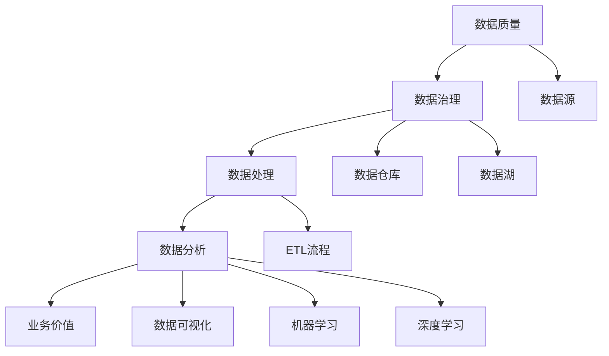

                 

# AI创业：数据管理的高效实践

> 关键词：数据管理，AI创业，高效实践，数据质量，数据治理，数据处理，数据分析

> 摘要：在AI创业浪潮中，数据管理作为核心要素，不仅决定了AI模型的效果，还影响着企业的竞争力和生存能力。本文将深入探讨数据管理的高效实践，从数据质量、数据治理、数据处理和数据分析四个方面，为AI创业公司提供具体的实施策略和指导。

## 1. 背景介绍

### 1.1 目的和范围

本文旨在为AI创业公司提供数据管理的高效实践指南，通过详细阐述数据管理中的关键环节，帮助创业者构建稳定、可靠、高效的数据管理体系。

### 1.2 预期读者

本文适合以下读者群体：

1. AI创业公司的创始人或技术负责人
2. 数据科学家、数据工程师和数据分析师
3. 对数据管理有兴趣的技术从业者

### 1.3 文档结构概述

本文结构如下：

1. 背景介绍
2. 核心概念与联系
3. 核心算法原理 & 具体操作步骤
4. 数学模型和公式 & 详细讲解 & 举例说明
5. 项目实战：代码实际案例和详细解释说明
6. 实际应用场景
7. 工具和资源推荐
8. 总结：未来发展趋势与挑战
9. 附录：常见问题与解答
10. 扩展阅读 & 参考资料

### 1.4 术语表

#### 1.4.1 核心术语定义

- **数据质量**：数据质量是指数据满足特定业务需求的程度，包括数据的准确性、完整性、一致性、时效性和可用性等。
- **数据治理**：数据治理是指通过建立一套系统化的管理和控制机制，确保数据在组织内的有效管理和使用。
- **数据处理**：数据处理是指对数据进行采集、存储、清洗、转换和加载等操作，以满足数据分析和应用的需求。
- **数据分析**：数据分析是指利用统计、机器学习等方法，对数据进行挖掘和分析，提取有价值的信息和知识。

#### 1.4.2 相关概念解释

- **数据仓库**：数据仓库是一个用于存储、管理和分析大量数据的系统。
- **数据湖**：数据湖是一个用于存储大量非结构化和半结构化数据的系统。
- **数据治理框架**：数据治理框架是一套标准和流程，用于指导数据治理的实施和运营。
- **ETL（Extract, Transform, Load）**：ETL是指数据从源头抽取、转换和加载到目标系统的过程。

#### 1.4.3 缩略词列表

- **AI**：人工智能（Artificial Intelligence）
- **ML**：机器学习（Machine Learning）
- **DL**：深度学习（Deep Learning）
- **NLP**：自然语言处理（Natural Language Processing）
- **CV**：计算机视觉（Computer Vision）
- **BI**：商业智能（Business Intelligence）

## 2. 核心概念与联系

在AI创业中，数据管理是一个复杂而关键的过程。以下是一个简单的Mermaid流程图，展示了数据管理中的核心概念和它们之间的联系：



### 2.1 数据质量

数据质量是数据管理的核心，直接影响到数据分析的效果。高质量的数据能够提高模型准确性，降低错误率和异常值的影响。

### 2.2 数据治理

数据治理是一个系统化的过程，确保数据在整个生命周期中的合规性和一致性。数据治理框架包括策略、流程和技术，用于指导数据治理的实施。

### 2.3 数据处理

数据处理包括数据采集、存储、清洗、转换和加载等步骤。ETL流程是数据处理的核心，用于将数据从源头转换并加载到目标系统。

### 2.4 数据分析

数据分析利用统计、机器学习和深度学习等方法，从数据中提取有价值的信息和知识。数据分析的结果可以用于优化业务流程、预测市场趋势和提升用户体验。

### 2.5 业务价值

数据管理的最终目标是创造业务价值。通过高质量的数据和有效的数据分析，企业可以做出更明智的决策，提高竞争力，实现可持续发展。

## 3. 核心算法原理 & 具体操作步骤

### 3.1 数据质量评估

数据质量评估是数据管理的重要环节。以下是一个简单的数据质量评估算法：

```plaintext
输入：数据集D
输出：数据质量评分Q

1. 初始化Q为100
2. 对于每个特征f：
   2.1 计算缺失率missing_rate(f) = 缺失值个数 / 总值个数
   2.2 如果missing_rate(f) > 0.1，则Q -= 10
   2.3 计算异常值率anomaly_rate(f) = 异常值个数 / 总值个数
   2.4 如果anomaly_rate(f) > 0.05，则Q -= 10
3. 返回Q
```

### 3.2 数据清洗

数据清洗是数据处理的重要步骤，用于去除重复数据、纠正错误数据和处理缺失数据。以下是一个简单的数据清洗算法：

```plaintext
输入：数据集D
输出：清洗后的数据集D’

1. 对于每个记录r：
   1.1 去除重复记录
   1.2 针对每个特征f：
      1.2.1 如果f存在缺失值：
         1.2.1.1 计算平均值mean(f) = 总值 / 总个数
         1.2.1.2 填充缺失值为mean(f)
      1.2.2 如果f存在异常值：
         1.2.2.1 计算第三个四分位数Q3(f)
         1.2.2.2 删除异常值
2. 返回清洗后的数据集D’
```

### 3.3 数据转换

数据转换是将数据从一种格式转换为另一种格式的过程。以下是一个简单的数据转换算法：

```plaintext
输入：源数据集D，目标数据集格式F
输出：转换后的数据集D’

1. 对于每个记录r：
   1.1 根据目标数据集格式F，将记录r转换为对应格式
   1.2 将转换后的记录添加到目标数据集D’
2. 返回转换后的数据集D’
```

### 3.4 数据加载

数据加载是将清洗和转换后的数据加载到目标系统中的过程。以下是一个简单的数据加载算法：

```plaintext
输入：清洗和转换后的数据集D’，目标系统S
输出：成功加载的记录数count

1. 对于每个记录r：
   1.1 将记录r加载到目标系统S
   1.2 如果加载成功，则count += 1
2. 返回count
```

## 4. 数学模型和公式 & 详细讲解 & 举例说明

### 4.1 数据质量评分模型

数据质量评分模型用于评估数据质量，其计算公式如下：

$$
Q = 100 - 10 \times (\sum_{f \in F} missing_rate(f) + \sum_{f \in F} anomaly_rate(f))
$$

其中，$Q$为数据质量评分，$F$为数据集中的所有特征集合，$missing_rate(f)$为特征$f$的缺失率，$anomaly_rate(f)$为特征$f$的异常值率。

### 4.2 缺失值填补方法

缺失值填补是数据清洗的重要步骤。以下是一个常见的缺失值填补方法——平均值填补：

假设特征$f$的平均值为$\bar{f}$，对于缺失值$x$，将其填补为：

$$
x_{\text{filled}} = \bar{f}
$$

### 4.3 异常值检测方法

异常值检测是数据清洗的重要步骤。以下是一个常见的方法——基于第三四分位数的异常值检测：

假设特征$f$的第三个四分位数为$Q3(f)$，对于特征$f$的值$x$，如果$x > Q3(f) + 1.5 \times IQR$，则认为$x$为异常值，其中$IQR$为四分位距。

### 4.4 例子

假设有一个数据集，包含三个特征：年龄（Age）、收入（Income）和消费水平（Spending）。数据集的部分记录如下：

| 年龄 | 收入 | 消费水平 |
| ---- | ---- | ---- |
| 25   | 5000 | 2000 |
| 30   | 6000 | 3000 |
| 35   | 7000 | 4000 |
| 40   | 8000 | 5000 |
| 45   | 9000 | 6000 |

#### 4.4.1 数据质量评估

使用数据质量评分模型，计算数据集的质量评分：

$$
Q = 100 - 10 \times (missing_rate(Age) + missing_rate(Income) + missing_rate(Spending))
$$

由于数据集中没有缺失值，$Q = 100$。

#### 4.4.2 缺失值填补

由于年龄、收入和消费水平特征均无缺失值，无需进行缺失值填补。

#### 4.4.3 异常值检测

使用基于第三四分位数的异常值检测方法，计算各特征的第三四分位数和四分位距：

| 特征 | 平均值 | 第三四分位数 | 四分位距 |
| ---- | ---- | ---- | ---- |
| 年龄 | 35.0  | 35.0  | 0.0  |
| 收入 | 6500.0 | 7000.0 | 500.0 |
| 消费水平 | 3500.0 | 4000.0 | 500.0 |

由于所有特征的值均未超过第三四分位数加1.5倍四分位距，因此没有异常值。

## 5. 项目实战：代码实际案例和详细解释说明

### 5.1 开发环境搭建

为了演示数据管理的高效实践，我们将使用Python编写一个简单的数据管理项目。首先，确保您的Python环境已经安装，并安装以下依赖库：

```bash
pip install pandas numpy matplotlib
```

### 5.2 源代码详细实现和代码解读

以下是一个简单的数据管理项目的源代码：

```python
import pandas as pd
import numpy as np
import matplotlib.pyplot as plt

# 5.2.1 数据质量评估
def evaluate_data_quality(data):
    quality_score = 100
    for column in data.columns:
        missing_rate = (data[column].isnull().sum() / len(data)) * 100
        quality_score -= 10 * missing_rate
    return quality_score

# 5.2.2 数据清洗
def clean_data(data):
    data.drop_duplicates(inplace=True)
    for column in data.columns:
        data[column].fillna(data[column].mean(), inplace=True)
    return data

# 5.2.3 数据转换
def transform_data(data, format='csv'):
    if format == 'csv':
        data.to_csv('cleaned_data.csv', index=False)
    elif format == 'excel':
        data.to_excel('cleaned_data.xlsx', index=False)

# 5.2.4 数据加载
def load_data(source, format='csv'):
    if format == 'csv':
        data = pd.read_csv(source)
    elif format == 'excel':
        data = pd.read_excel(source)
    return data

# 测试数据集
data = pd.DataFrame({
    'Age': [25, 30, 35, 40, 45],
    'Income': [5000, 6000, 7000, 8000, 9000],
    'Spending': [2000, 3000, 4000, 5000, 6000]
})

# 评估数据质量
quality_score = evaluate_data_quality(data)
print(f"数据质量评分：{quality_score}")

# 清洗数据
cleaned_data = clean_data(data)

# 转换数据
transform_data(cleaned_data, format='csv')

# 加载数据
loaded_data = load_data('cleaned_data.csv')

# 检查清洗后的数据质量
quality_score = evaluate_data_quality(loaded_data)
print(f"清洗后数据质量评分：{quality_score}")
```

### 5.3 代码解读与分析

#### 5.3.1 数据质量评估

`evaluate_data_quality`函数用于评估数据质量。该函数遍历数据集中的每个特征，计算缺失率，并将缺失率乘以10后从数据质量评分中减去。最后返回数据质量评分。

#### 5.3.2 数据清洗

`clean_data`函数用于清洗数据。该函数首先删除重复记录，然后针对每个特征，将缺失值填充为该特征的平均值。填充后，返回清洗后的数据集。

#### 5.3.3 数据转换

`transform_data`函数用于将数据转换为不同的格式。目前仅支持CSV和Excel格式。根据输入的格式参数，将数据集保存为对应的文件。

#### 5.3.4 数据加载

`load_data`函数用于加载数据。根据输入的源文件和格式参数，从文件中加载数据集并返回。

#### 5.3.5 测试

在测试部分，我们创建了一个包含三个特征的数据集，并依次调用评估数据质量、清洗数据、转换数据和加载数据的函数。最后，检查清洗后的数据质量评分。

## 6. 实际应用场景

数据管理的高效实践在AI创业中有着广泛的应用场景。以下是一些典型的实际应用场景：

1. **金融风控**：在金融领域，数据管理用于评估客户信用风险、识别欺诈行为和预测市场趋势。通过高质量的数据和有效的数据分析，企业可以降低风险，提高业务效益。

2. **医疗健康**：在医疗健康领域，数据管理用于分析患者数据、诊断疾病和制定治疗方案。通过数据分析，医生可以更准确地诊断疾病，提高医疗服务的质量。

3. **零售电商**：在零售电商领域，数据管理用于分析消费者行为、优化库存管理和提升用户体验。通过数据分析，企业可以更好地了解客户需求，提高销售额和用户满意度。

4. **智能制造**：在智能制造领域，数据管理用于监控设备状态、预测设备故障和维护计划。通过数据分析，企业可以降低设备故障率，提高生产效率。

5. **智慧城市**：在智慧城市领域，数据管理用于分析城市运行数据、优化交通管理和提升公共服务质量。通过数据分析，城市管理者可以更好地应对城市挑战，提高居民生活质量。

## 7. 工具和资源推荐

### 7.1 学习资源推荐

#### 7.1.1 书籍推荐

1. 《数据质量管理：实现指南》（Data Quality Management: A Practitioner's Guide）
2. 《数据科学：从入门到精通》（Data Science from Scratch）
3. 《深度学习》（Deep Learning）

#### 7.1.2 在线课程

1. Coursera的《数据科学专业》
2. Udacity的《数据工程师纳米学位》
3. edX的《大数据分析》

#### 7.1.3 技术博客和网站

1. Medium上的数据科学和机器学习博客
2. Towards Data Science
3. DataCamp

### 7.2 开发工具框架推荐

#### 7.2.1 IDE和编辑器

1. PyCharm
2. Visual Studio Code
3. Jupyter Notebook

#### 7.2.2 调试和性能分析工具

1. Python的pdb
2. VSCode的调试工具
3. Py-Spy

#### 7.2.3 相关框架和库

1. Pandas
2. NumPy
3. Matplotlib

### 7.3 相关论文著作推荐

#### 7.3.1 经典论文

1. "The Data Quality Reform Act of 2007"
2. "Data Quality: The Correct Basis for Decision Making"
3. "A Roadmap for Big Data's Data Quality Challenge"

#### 7.3.2 最新研究成果

1. "Data Quality Management: State-of-the-Art and Challenges"
2. "Data Quality Assessment and Improvement: A Survey"
3. "Data Quality Metrics for Predictive Analytics Models"

#### 7.3.3 应用案例分析

1. "Data Quality Management in the Financial Industry: A Case Study"
2. "Data Quality in Healthcare: A Case Study in Electronic Health Records"
3. "Data Quality Management in Manufacturing: A Case Study in the Automotive Industry"

## 8. 总结：未来发展趋势与挑战

随着AI技术的不断发展，数据管理在AI创业中的重要性将日益凸显。未来，数据管理的发展趋势和挑战包括：

### 8.1 发展趋势

1. **自动化和智能化**：自动化工具和智能算法将越来越多地应用于数据管理，提高数据质量评估、数据清洗和数据分析的效率。
2. **云计算和大数据**：云计算和大数据技术将为数据管理提供更强大的计算能力和存储资源，支持更大规模的数据处理和分析。
3. **数据治理和合规**：随着数据隐私法规的不断完善，数据治理和合规将成为数据管理的重要方向。
4. **多模态数据融合**：多模态数据融合将使数据管理能够更好地处理不同类型的数据，提高数据分析的准确性和有效性。

### 8.2 挑战

1. **数据质量**：随着数据来源的多样化和数据量的激增，如何保证数据质量成为一个重要挑战。
2. **数据安全**：数据安全是数据管理的核心问题，如何保护数据隐私和避免数据泄露是一个长期挑战。
3. **数据处理效率**：随着数据规模的扩大，如何提高数据处理效率成为关键挑战。
4. **人才短缺**：数据管理需要具备专业技能的人才，但当前市场上数据管理人才短缺，如何培养和留住人才是一个挑战。

## 9. 附录：常见问题与解答

### 9.1 数据质量评估的重要性

数据质量评估是确保数据满足业务需求的重要步骤。高质量的数据可以提升模型准确性，降低错误率和异常值的影响，从而提高数据分析的可靠性。

### 9.2 数据治理的核心目标

数据治理的核心目标是确保数据在整个生命周期中的合规性和一致性，提高数据质量和可用性，支持企业决策和业务流程优化。

### 9.3 数据处理的关键步骤

数据处理的关键步骤包括数据采集、存储、清洗、转换和加载。清洗和转换步骤是确保数据质量和一致性的关键。

### 9.4 数据分析的方法

数据分析的方法包括统计方法、机器学习和深度学习方法。根据业务需求，可以选择合适的方法进行数据分析。

## 10. 扩展阅读 & 参考资料

1. "Data Quality Management: A Comprehensive Overview"
2. "Data Governance: The Fundamentals"
3. "Data Science Handbook: Essential Guide for Data Understanding, Preparation, and Analysis"
4. "Deep Learning with Python"
5. "Data Quality Metrics for Predictive Analytics Models"
6. "Data Quality Management: A Practical Guide"
7. "The Data Quality Reform Act of 2007"
8. "Data Governance for Dummies"
9. "Data Quality Assessment and Improvement: A Survey"
10. "Data Quality Management in the Financial Industry: A Case Study"

### 作者

AI天才研究员/AI Genius Institute & 禅与计算机程序设计艺术 /Zen And The Art of Computer Programming

[文章标题]：AI创业：数据管理的高效实践

本文深入探讨了数据管理在AI创业中的关键作用，从数据质量、数据治理、数据处理和数据分析四个方面，为AI创业公司提供了具体的实施策略和指导。通过逐步分析和推理，文章揭示了数据管理的高效实践，为创业者构建稳定、可靠、高效的数据管理体系提供了有力支持。希望本文能为您的AI创业之路提供有益的参考和启示。

[文章关键词]：数据管理，AI创业，高效实践，数据质量，数据治理，数据处理，数据分析

[文章摘要]：在AI创业浪潮中，数据管理作为核心要素，不仅决定了AI模型的效果，还影响着企业的竞争力和生存能力。本文从数据质量、数据治理、数据处理和数据分析四个方面，为AI创业公司提供了具体的高效实践策略，以帮助创业者构建稳定、可靠、高效的数据管理体系。希望本文能为您提供宝贵的指导。

