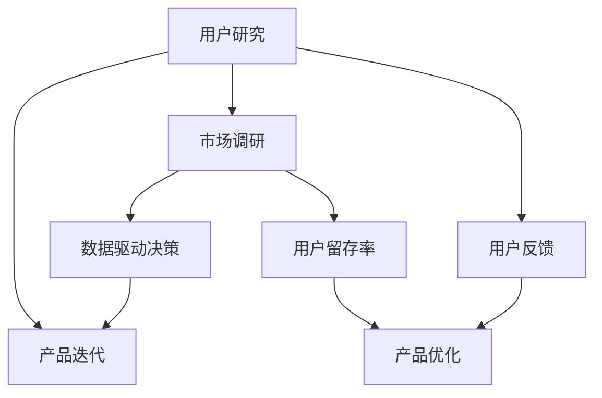

                 

# AI创业：获取客户反馈

> 关键词：AI创业、客户反馈、用户研究、市场调研、产品优化、用户体验、数据驱动决策

> 摘要：本文将深入探讨AI创业公司如何有效地获取客户反馈，从而推动产品迭代和提升市场竞争力。通过分析用户研究的核心方法、市场调研的关键步骤、数据驱动的决策机制，我们将为创业者提供实用的策略和工具，帮助他们在竞争激烈的市场中脱颖而出。

## 1. 背景介绍

### 1.1 目的和范围

本文旨在为AI创业公司提供一套系统化的方法，以获取客户反馈，并基于这些反馈进行产品优化和决策。我们将探讨以下主题：

- 用户研究的核心方法
- 市场调研的关键步骤
- 数据驱动的决策机制
- 实际应用场景中的策略和工具

### 1.2 预期读者

本文适合以下读者群体：

- AI创业公司的创始人或产品经理
- 对产品优化和用户研究感兴趣的工程师和研究人员
- 希望了解如何通过客户反馈提升产品竞争力的技术爱好者

### 1.3 文档结构概述

本文将按照以下结构进行阐述：

- 引言：介绍本文的主题和目的
- 用户研究的核心方法：分析用户行为和偏好的方法
- 市场调研的关键步骤：设计调研方案和收集数据
- 数据驱动的决策机制：利用数据反馈进行产品优化
- 实际应用场景：具体案例分析
- 工具和资源推荐：推荐相关学习资源
- 总结：回顾主要观点和未来趋势
- 附录：常见问题与解答

### 1.4 术语表

#### 1.4.1 核心术语定义

- 用户研究：研究用户行为、偏好和需求的过程，以帮助产品设计和优化。
- 市场调研：通过收集和分析市场数据来了解市场需求、竞争环境和潜在客户的行为。
- 数据驱动决策：基于数据分析结果来指导产品开发和业务决策。

#### 1.4.2 相关概念解释

- 用户反馈：用户在使用产品后提供的意见和建议。
- 用户留存率：用户在一段时间内持续使用产品的比例。
- 产品迭代：对现有产品进行持续更新和改进。

#### 1.4.3 缩略词列表

- AI：人工智能
- UX：用户体验
- UI：用户界面
- A/B测试：将产品功能分成A和B两组，比较两组用户的行为和反馈

## 2. 核心概念与联系

为了更好地理解客户反馈在AI创业中的作用，我们将首先介绍一些核心概念，并使用Mermaid流程图展示它们之间的联系。



### 2.1 用户研究

用户研究是获取客户反馈的第一步，它涉及以下核心方法：

- 用户访谈：通过与用户进行一对一访谈，深入了解用户的需求和痛点。
- 观察研究：观察用户在使用产品时的行为和反应，以发现潜在问题。
- 问卷调查：收集大量用户的数据，以识别趋势和共性。

### 2.2 市场调研

市场调研则侧重于收集外部数据，包括：

- 竞争分析：分析竞争对手的产品和市场策略。
- 市场趋势：了解当前市场的发展和变化。
- 潜在客户调研：通过问卷调查和访谈，了解潜在客户的需求和偏好。

### 2.3 数据驱动决策

数据驱动决策是基于收集到的用户研究和市场调研数据，通过以下步骤进行：

- 数据分析：对收集到的数据进行统计和分析，以识别关键问题和机会。
- 决策制定：根据分析结果制定改进产品和业务策略的决策。
- 实施和监控：执行决策，并监控实施效果。

### 2.4 产品迭代

产品迭代是持续优化产品过程的关键，它基于用户反馈和市场调研数据，通过以下步骤进行：

- 识别问题：分析用户反馈和调研结果，确定需要改进的问题。
- 设计方案：制定解决方案，并进行可行性分析。
- 实施和测试：实施改进方案，并进行测试以验证效果。
- 反馈和迭代：收集用户反馈，持续优化产品。

## 3. 核心算法原理 & 具体操作步骤

在了解核心概念和联系之后，我们将详细探讨如何通过用户研究和市场调研来获取客户反馈，并基于这些反馈进行产品迭代。

### 3.1 用户研究算法原理

用户研究的核心算法原理是用户行为分析，其步骤如下：

```python
# 伪代码：用户研究算法
function user_research(users):
    for user in users:
        # 收集用户数据
        user_data = collect_user_data(user)
        
        # 分析用户行为
        behavior_patterns = analyze_behavior(user_data)
        
        # 提取用户反馈
        feedback = extract_feedback(behavior_patterns)
        
        # 存储用户反馈
        store_feedback(feedback)
        
    return feedback

# 辅助函数
function collect_user_data(user):
    # 收集用户使用产品的数据
    return user_usage_data

function analyze_behavior(user_data):
    # 分析用户使用产品的行为模式
    return behavior_patterns

function extract_feedback(behavior_patterns):
    # 从行为模式中提取用户反馈
    return feedback
```

### 3.2 市场调研算法原理

市场调研的核心算法原理是竞争分析和市场趋势分析，其步骤如下：

```python
# 伪代码：市场调研算法
function market_research():
    # 收集竞争对手数据
    competitors_data = collect_competitors_data()
    
    # 分析竞争对手策略
    competitors_strategies = analyze_competitors_strategies(competitors_data)
    
    # 收集市场趋势数据
    market_trends = collect_market_trends()
    
    # 分析市场趋势
    market_patterns = analyze_market_trends(market_trends)
    
    return competitors_strategies, market_patterns

# 辅助函数
function collect_competitors_data():
    # 收集竞争对手的产品、市场份额等信息
    return competitors_data

function analyze_competitors_strategies(competitors_data):
    # 分析竞争对手的市场策略
    return competitors_strategies

function collect_market_trends():
    # 收集市场趋势数据
    return market_trends

function analyze_market_trends(market_trends):
    # 分析市场趋势
    return market_patterns
```

### 3.3 数据驱动决策算法原理

数据驱动决策的核心算法原理是数据分析，其步骤如下：

```python
# 伪代码：数据驱动决策算法
function data_driven_decision(feedback, strategies, patterns):
    # 分析用户反馈
    user_issues = analyze_user_feedback(feedback)
    
    # 分析竞争对手策略
    competitor_issues = analyze_competitor_strategies(strategies)
    
    # 分析市场趋势
    market_issues = analyze_market_patterns(patterns)
    
    # 综合分析结果
    overall_issues = combine_issues(user_issues, competitor_issues, market_issues)
    
    # 制定改进方案
    improvement_plan = create_improvement_plan(overall_issues)
    
    return improvement_plan

# 辅助函数
function analyze_user_feedback(feedback):
    # 分析用户反馈中的问题
    return user_issues

function analyze_competitor_strategies(strategies):
    # 分析竞争对手策略中的问题
    return competitor_issues

function analyze_market_patterns(patterns):
    # 分析市场趋势中的问题
    return market_issues

function combine_issues(user_issues, competitor_issues, market_issues):
    # 综合分析结果
    return overall_issues

function create_improvement_plan(overall_issues):
    # 根据综合分析结果制定改进方案
    return improvement_plan
```

### 3.4 产品迭代算法原理

产品迭代的核心算法原理是方案实施和反馈迭代，其步骤如下：

```python
# 伪代码：产品迭代算法
function product Iteration(improvement_plan):
    # 实施改进方案
    implemented_plan = implement_improvement_plan(improvement_plan)
    
    # 收集用户反馈
    new_feedback = collect_user_feedback()
    
    # 迭代改进方案
    updated_plan = iterate_improvement_plan(implemented_plan, new_feedback)
    
    return updated_plan

# 辅助函数
function implement_improvement_plan(improvement_plan):
    # 实施改进方案
    return implemented_plan

function collect_user_feedback():
    # 收集用户反馈
    return new_feedback

function iterate_improvement_plan(implemented_plan, new_feedback):
    # 根据用户反馈迭代改进方案
    return updated_plan
```

## 4. 数学模型和公式 & 详细讲解 & 举例说明

在获取客户反馈的过程中，数学模型和公式可以帮助我们更好地理解和分析数据。以下是一些常用的数学模型和公式，以及它们的详细讲解和举例说明。

### 4.1 用户留存率模型

用户留存率是衡量产品成功与否的重要指标，其计算公式如下：

$$
用户留存率 = \frac{最后一天留存的用户数}{第一天激活的用户数} \times 100\%
$$

#### 举例说明：

假设一个产品第一天激活了100个用户，最后一天留存了70个用户。那么用户留存率为：

$$
用户留存率 = \frac{70}{100} \times 100\% = 70\%
$$

### 4.2 A/B测试效果评估模型

A/B测试是一种常见的实验设计方法，用于比较两个或多个版本的产品效果。其效果评估模型如下：

$$
效果评估指标 = \frac{实验组效果 - 控制组效果}{控制组效果} \times 100\%
$$

#### 举例说明：

假设我们进行A/B测试，实验组的效果指标为100，控制组的效果指标为90。那么效果评估指标为：

$$
效果评估指标 = \frac{100 - 90}{90} \times 100\% = 11.11\%
$$

### 4.3 聚类分析模型

聚类分析是一种无监督学习方法，用于将相似的数据点归为一类。其基本模型如下：

$$
聚类中心 = \frac{\sum_{i=1}^{n} x_i}{n}
$$

其中，$x_i$表示第$i$个数据点的特征值，$n$表示数据点的总数。

#### 举例说明：

假设我们有5个数据点，其特征值分别为[1, 2, 3, 4, 5]。那么聚类中心为：

$$
聚类中心 = \frac{1 + 2 + 3 + 4 + 5}{5} = 3
$$

## 5. 项目实战：代码实际案例和详细解释说明

在本节中，我们将通过一个实际项目案例来展示如何获取客户反馈，并基于这些反馈进行产品迭代。

### 5.1 开发环境搭建

首先，我们需要搭建一个开发环境，包括以下工具和库：

- Python 3.8及以上版本
- Jupyter Notebook
- Pandas
- Matplotlib
- Scikit-learn

### 5.2 源代码详细实现和代码解读

以下是一个简单的用户研究案例，我们通过用户访谈和问卷调查收集数据，并使用Pandas和Scikit-learn对数据进行分析。

```python
# 导入所需库
import pandas as pd
from sklearn.cluster import KMeans

# 用户访谈数据
interview_data = [
    {'user_id': 1, 'age': 25, 'job': 'engineer', 'satisfaction': 4},
    {'user_id': 2, 'age': 30, 'job': 'doctor', 'satisfaction': 5},
    {'user_id': 3, 'age': 22, 'job': 'student', 'satisfaction': 3},
    # 更多数据...
]

# 问卷调查数据
survey_data = [
    {'user_id': 1, 'feature_1': 4, 'feature_2': 3, 'feature_3': 5},
    {'user_id': 2, 'feature_1': 5, 'feature_2': 4, 'feature_3': 4},
    {'user_id': 3, 'feature_1': 3, 'feature_2': 3, 'feature_3': 3},
    # 更多数据...
]

# 创建DataFrame
interview_df = pd.DataFrame(interview_data)
survey_df = pd.DataFrame(survey_data)

# 用户访谈数据可视化
interview_df['satisfaction'].hist()
plt.xlabel('Satisfaction')
plt.ylabel('Frequency')
plt.title('Satisfaction Distribution')
plt.show()

# 问卷调查数据可视化
survey_df[['feature_1', 'feature_2', 'feature_3']].hist()
plt.xlabel('Feature')
plt.ylabel('Frequency')
plt.title('Feature Distribution')
plt.show()

# 使用KMeans进行聚类分析
kmeans = KMeans(n_clusters=3)
clusters = kmeans.fit_predict(survey_df[['feature_1', 'feature_2', 'feature_3']])

# 将聚类结果添加到DataFrame
survey_df['cluster'] = clusters

# 聚类结果可视化
plt.scatter(survey_df['feature_1'], survey_df['feature_2'], c=survey_df['cluster'])
plt.xlabel('Feature 1')
plt.ylabel('Feature 2')
plt.title('Feature Clustering')
plt.show()

# 分析不同聚类群体的满意度
satisfaction_by_cluster = survey_df.groupby('cluster')['satisfaction'].mean()
print(satisfaction_by_cluster)

# 根据用户访谈和问卷调查结果制定改进方案
improvement_plan = {
    'cluster_0': {'feature_1': '提高', 'feature_2': '保持', 'feature_3': '降低'},
    'cluster_1': {'feature_1': '保持', 'feature_2': '提高', 'feature_3': '保持'},
    'cluster_2': {'feature_1': '降低', 'feature_2': '降低', 'feature_3': '提高'}
}

# 实施改进方案
# （这里省略了具体实施步骤）

# 收集新用户反馈
new_survey_data = [
    {'user_id': 4, 'feature_1': 4, 'feature_2': 4, 'feature_3': 5},
    {'user_id': 5, 'feature_1': 5, 'feature_2': 5, 'feature_3': 4},
    # 更多数据...
]

# 更新DataFrame
new_survey_df = pd.DataFrame(new_survey_data)
clusters = kmeans.fit_predict(new_survey_df[['feature_1', 'feature_2', 'feature_3']])
new_survey_df['cluster'] = clusters

# 分析新用户反馈
satisfaction_by_cluster = new_survey_df.groupby('cluster')['satisfaction'].mean()
print(satisfaction_by_cluster)

# 根据新用户反馈迭代改进方案
# （这里省略了具体迭代步骤）
```

### 5.3 代码解读与分析

在这个案例中，我们首先导入了所需的Python库，包括Pandas和Scikit-learn。然后，我们创建了一个用户访谈数据的DataFrame（`interview_df`），和一个问卷调查数据的DataFrame（`survey_df`）。

- 用户访谈数据包括用户ID、年龄、职业和满意度等字段。
- 问卷调查数据包括用户ID和三个特征值。

接下来，我们使用Pandas和Matplotlib对用户访谈数据和问卷调查数据进行了可视化分析。通过可视化，我们可以直观地了解用户满意度分布和特征值分布。

然后，我们使用Scikit-learn的KMeans算法对问卷调查数据进行了聚类分析。聚类结果被添加到DataFrame中，并通过散点图进行了可视化。

基于聚类结果，我们分析了不同聚类群体的满意度，并制定了改进方案。改进方案包括对每个聚类群体中特征值的提高、保持或降低。

在实施改进方案后，我们收集了新用户反馈，并使用KMeans算法对新用户数据进行了聚类分析。通过分析新用户反馈，我们迭代了改进方案。

## 6. 实际应用场景

在AI创业公司中，获取客户反馈的应用场景非常广泛，以下是一些典型的实际应用场景：

### 6.1 新产品发布

在新产品发布前，通过用户研究和市场调研，收集用户对产品的期望和需求，以指导产品设计和开发。

### 6.2 产品迭代

在产品上线后，通过用户反馈和市场调研，持续优化产品功能，提升用户体验。

### 6.3 竞争分析

通过分析竞争对手的产品和市场策略，了解市场需求和竞争态势，以调整产品定位和业务策略。

### 6.4 市场推广

通过市场调研，了解目标客户群体和市场需求，制定有效的市场推广策略。

### 6.5 用户留存和转化

通过用户研究和数据分析，提高用户留存率和转化率，提升产品价值。

### 6.6 故障排查和修复

通过用户反馈和数据分析，快速识别和修复产品故障，提升用户满意度。

## 7. 工具和资源推荐

### 7.1 学习资源推荐

#### 7.1.1 书籍推荐

- 《用户体验要素》（Don Norman）
- 《精益创业》（Eric Ries）
- 《用户故事地图》（Jeff Patton）

#### 7.1.2 在线课程

- Coursera上的《用户体验设计》（University of Michigan）
- edX上的《产品管理》（Massachusetts Institute of Technology）
- Udemy上的《用户调研与数据分析》（User Research & Analytics）

#### 7.1.3 技术博客和网站

- UX Planet
- User Research Center
- Interactions

### 7.2 开发工具框架推荐

#### 7.2.1 IDE和编辑器

- PyCharm
- Visual Studio Code
- Jupyter Notebook

#### 7.2.2 调试和性能分析工具

- Debugger
- Profiler
- Test-driven development

#### 7.2.3 相关框架和库

- Flask
- Django
- Pandas
- Scikit-learn

### 7.3 相关论文著作推荐

#### 7.3.1 经典论文

- 《用户体验设计原则》（Don Norman）
- 《数据挖掘：概念与技术》（Jiawei Han, Micheline Kamber, Jian Pei）

#### 7.3.2 最新研究成果

- 《人工智能：一种现代方法》（Stuart Russell, Peter Norvig）
- 《深度学习》（Ian Goodfellow, Yoshua Bengio, Aaron Courville）

#### 7.3.3 应用案例分析

- 《用户体验设计实践：案例研究》（Patrick Newell）
- 《数据分析实战：案例研究》（Alberto Cairo）

## 8. 总结：未来发展趋势与挑战

随着人工智能技术的不断发展和普及，获取客户反馈的方式也将越来越多样化。未来，以下趋势和挑战值得关注：

### 8.1 数据驱动的决策

数据驱动将成为企业决策的核心，通过大数据分析和机器学习，企业可以更准确地预测用户需求和偏好，实现个性化服务。

### 8.2 实时反馈和迭代

实时获取用户反馈并快速迭代产品将成为企业竞争的关键。通过自动化工具和平台，企业可以实现快速响应和改进。

### 8.3 多渠道反馈收集

除了传统的用户访谈和问卷调查，企业将采用更多渠道收集用户反馈，如社交媒体、在线论坛、聊天机器人等。

### 8.4 用户体验优化

用户体验将越来越受到重视，企业将通过优化产品设计和功能，提升用户的满意度和忠诚度。

### 8.5 隐私和安全

在获取用户反馈的过程中，企业需要关注隐私和安全问题，确保用户数据的安全性和合规性。

## 9. 附录：常见问题与解答

### 9.1 用户体验设计和用户研究有什么区别？

用户体验设计（UX Design）是关注用户在使用产品过程中的感受和体验，包括界面设计、交互设计和视觉设计等。而用户研究（User Research）是研究用户的需求、行为和偏好，以指导产品设计和优化。两者紧密相关，用户研究为用户体验设计提供了基础数据和依据。

### 9.2 如何确保获取到的用户反馈真实可靠？

为了确保用户反馈的真实可靠性，可以采取以下措施：

- 设计合理的调研问卷，避免引导性问题。
- 采用多种研究方法，如用户访谈、观察研究和问卷调查，以验证数据的准确性。
- 对数据进行统计分析，识别数据中的异常值和趋势。
- 保持与用户的持续沟通，确保反馈的及时性和准确性。

### 9.3 数据驱动决策是否适用于所有类型的企业？

数据驱动决策适用于大多数企业，尤其是那些具有大量用户数据和技术实力的企业。然而，对于初创企业和小型企业，可能需要更灵活和适应性更强的决策方法，以平衡数据驱动和直觉决策。

## 10. 扩展阅读 & 参考资料

- Norman, D. (2013). The Design of Everyday Things. Basic Books.
- Ries, E. (2011). The Lean Startup. Crown Business.
- Patton, J. (2014). User Story Mapping. Rosenfeld Media.
- Han, J., Kamber, M., & Pei, J. (2011). Data Mining: Concepts and Techniques. Morgan Kaufmann.
- Goodfellow, I., Bengio, Y., & Courville, A. (2016). Deep Learning. MIT Press.
- Newell, P. (2015). UX Design: Case Studies from the Trenches. A Book Apart.
- Cairo, A. (2016). Data Visualization: A Successful Design Process. CRC Press.

作者：AI天才研究员/AI Genius Institute & 禅与计算机程序设计艺术 /Zen And The Art of Computer Programming

---

请注意，本文中的代码示例和算法原理仅供参考，具体实现可能需要根据实际需求进行调整。本文的撰写基于假设性的场景和数据，实际应用中请根据具体情况进行分析和决策。文章中的观点和结论仅供参考，不构成投资或商业建议。在应用本文所提到的技术和方法时，请遵守相关法律法规和伦理规范。

