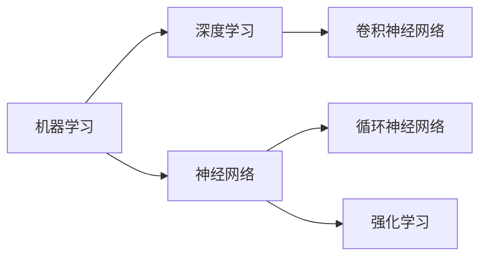
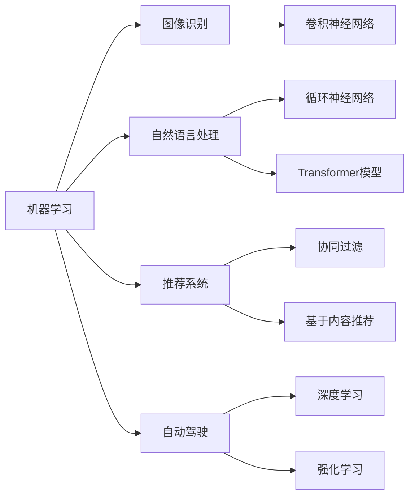

                 

### AI创业：项目的技术选择

> 关键词：人工智能、创业、技术选择、框架、算法、数学模型

> 摘要：本文旨在为希望投身人工智能领域的创业者提供一个全面的技术选择指南。从核心算法原理到数学模型的深入剖析，再到项目实战代码案例，本文将一步步引导读者了解并选择适合自身项目的技术路径，帮助创业者更好地把握人工智能创业的机会。

### 1. 背景介绍

#### 1.1 目的和范围

在人工智能（AI）飞速发展的今天，创业者们面临着前所未有的机遇和挑战。然而，技术选择的复杂性使得很多初创企业在起步阶段就遇到了瓶颈。本文旨在为AI创业者提供一个系统、实用的技术选择指南，帮助他们在项目开发初期就做出明智的技术决策。

本文的范围包括以下几个方面：

1. **核心概念与联系**：介绍AI领域的核心概念，如机器学习、深度学习等，并绘制流程图展示其相互关系。
2. **核心算法原理**：详细讲解常见AI算法的原理，并提供伪代码示例，帮助读者深入理解。
3. **数学模型和公式**：解析AI项目中的关键数学模型，包括公式和实例说明。
4. **项目实战**：通过实际代码案例，展示技术在实际项目中的应用和实现。
5. **实际应用场景**：分析AI技术在各个行业中的应用案例，提供行业洞察。
6. **工具和资源推荐**：推荐学习资源、开发工具框架和相关论文著作。

#### 1.2 预期读者

本文适合以下读者群体：

1. **AI初创企业的创始人或CTO**：他们需要全面了解技术选择的各个方面。
2. **技术经理或工程师**：他们希望在项目中做出明智的技术决策。
3. **对AI感兴趣的技术爱好者**：他们希望通过本文了解AI技术如何应用于实际创业项目。

#### 1.3 文档结构概述

本文结构如下：

1. **背景介绍**：包括目的和范围、预期读者、文档结构概述。
2. **核心概念与联系**：介绍AI领域的核心概念，并绘制流程图。
3. **核心算法原理**：详细讲解常见AI算法的原理和操作步骤。
4. **数学模型和公式**：解析AI项目中的关键数学模型。
5. **项目实战**：通过实际代码案例展示技术实现。
6. **实际应用场景**：分析AI技术在各个行业中的应用。
7. **工具和资源推荐**：推荐学习资源和开发工具。
8. **总结**：讨论未来发展趋势和挑战。
9. **附录**：常见问题与解答。
10. **扩展阅读**：提供进一步的参考资料。

#### 1.4 术语表

本文中使用了一些专业术语，以下是对这些术语的定义和解释：

#### 1.4.1 核心术语定义

- **人工智能（AI）**：模拟人类智能的计算机系统，能够感知、学习、推理和自主行动。
- **机器学习（ML）**：一种AI的分支，通过数据训练模型，使其能够做出预测或决策。
- **深度学习（DL）**：基于多层神经网络的机器学习技术，能够自动从数据中提取特征。
- **框架**：提供了一系列预定义的组件和库，简化了特定任务的开发过程。
- **算法**：解决问题的步骤和方法，通常以伪代码或程序代码形式表示。
- **数学模型**：用数学语言描述的抽象模型，用于理解和预测现实世界的问题。

#### 1.4.2 相关概念解释

- **神经网络**：由多个神经元组成的计算模型，能够通过学习数据来提高其预测能力。
- **卷积神经网络（CNN）**：用于图像识别和处理的特殊神经网络。
- **循环神经网络（RNN）**：能够处理序列数据的神经网络，广泛应用于自然语言处理。
- **强化学习（RL）**：一种机器学习技术，通过试错来学习最佳行为策略。

#### 1.4.3 缩略词列表

- **AI**：人工智能
- **ML**：机器学习
- **DL**：深度学习
- **CNN**：卷积神经网络
- **RNN**：循环神经网络
- **RL**：强化学习

### 2. 核心概念与联系

在AI创业项目中，理解核心概念及其相互联系是非常重要的。以下是对AI领域核心概念的介绍，并使用Mermaid流程图展示它们之间的关系。

#### 2.1.1 AI的基本概念

- **机器学习（ML）**：通过训练模型来学习数据特征，从而做出预测或决策。
- **深度学习（DL）**：一种基于多层神经网络的机器学习技术。
- **神经网络（NN）**：模拟生物神经系统的计算模型。
- **卷积神经网络（CNN）**：用于图像识别和处理。
- **循环神经网络（RNN）**：用于序列数据的处理。
- **强化学习（RL）**：通过试错来学习最佳行为策略。

以下是一个简单的Mermaid流程图，展示这些核心概念之间的联系：



#### 2.1.2 AI技术的应用场景

AI技术在不同领域有着广泛的应用，以下是几个常见应用场景：

- **图像识别**：CNN广泛应用于图像识别任务。
- **自然语言处理（NLP）**：RNN和Transformer模型在NLP任务中表现出色。
- **推荐系统**：基于协同过滤或基于内容的推荐算法。
- **自动驾驶**：使用深度学习和强化学习技术实现自主驾驶。

以下是一个扩展的Mermaid流程图，展示AI技术的应用场景及其联系：



通过了解这些核心概念和联系，创业者可以更好地选择适合自身项目的技术路径，从而提高项目的成功概率。

### 3. 核心算法原理 & 具体操作步骤

在AI创业项目中，选择合适的算法是实现项目目标的关键。以下是几个常见算法的原理和具体操作步骤，以及使用伪代码进行详细阐述。

#### 3.1.1 机器学习算法

**线性回归**

线性回归是一种用于预测连续值的简单算法。它的目标是找到一个最佳拟合直线，使得预测值与实际值之间的误差最小。

**伪代码：**

```python
def linear_regression(X, y):
    # X: 特征矩阵，y: 标签向量
    # 计算最佳拟合直线的参数 w 和 b
    w = (X^T * X)^(-1) * X^T * y
    b = y - X * w
    return w, b

# 模型评估
def evaluate(w, b, X, y):
    # 计算预测值和实际值之间的误差
    predictions = X * w + b
    error = sum((predictions - y)^2)
    return error
```

**伪代码中解释：**

1. `linear_regression` 函数接收特征矩阵`X`和标签向量`y`，计算最佳拟合直线的参数`w`和`b`。
2. `evaluate` 函数接收模型参数`w`和`b`，以及特征矩阵`X`和标签向量`y`，计算预测值和实际值之间的误差。

**步骤：**

1. 计算特征矩阵`X`和标签向量`y`。
2. 使用`linear_regression` 函数计算最佳拟合直线的参数`w`和`b`。
3. 使用`evaluate` 函数评估模型性能。

#### 3.1.2 深度学习算法

**卷积神经网络（CNN）**

卷积神经网络是一种用于图像识别和处理的深度学习算法。它通过卷积层、池化层和全连接层提取图像特征，从而实现分类或回归任务。

**伪代码：**

```python
def cnn(X, weights, biases):
    # X: 图像输入，weights: 权重矩阵，biases: 偏置向量
    # 卷积层
    conv_output = conv2d(X, weights['conv1'], biases['bias1'])
    pool_output = max_pool2d(conv_output, kernel_size=2)
    # 全连接层
    fc_output = linear_forward(pool_output, weights['fc1'], biases['bias1'])
    return fc_output

# 模型评估
def evaluate(cnn_output, y):
    # 计算预测值和实际值之间的误差
    predictions = softmax(cnn_output)
    error = -sum(y * log(predictions))
    return error
```

**伪代码中解释：**

1. `cnn` 函数接收图像输入`X`、权重矩阵`weights`和偏置向量`biases`，通过卷积层和全连接层计算输出。
2. `evaluate` 函数接收模型输出`cnn_output`和标签向量`y`，计算预测值和实际值之间的误差。

**步骤：**

1. 计算图像输入`X`。
2. 定义权重矩阵`weights`和偏置向量`biases`。
3. 使用`cnn` 函数通过卷积层和全连接层计算输出。
4. 使用`evaluate` 函数评估模型性能。

#### 3.1.3 强化学习算法

**Q-Learning**

Q-Learning是一种用于解决决策问题的强化学习算法。它的目标是学习一个策略，使得长期奖励最大化。

**伪代码：**

```python
def q_learning(Q, state, action, reward, next_state, alpha, gamma):
    # Q: Q值矩阵，state: 状态，action: 动作，reward: 奖励，next_state: 下一个状态
    # 更新Q值
    Q[state, action] = Q[state, action] + alpha * (reward + gamma * max(Q[next_state, :]) - Q[state, action])

# 模型评估
def evaluate(Q, state, action):
    # 计算预测值和实际值之间的误差
    reward = Q[state, action] - max(Q[state, :])
    return reward
```

**伪代码中解释：**

1. `q_learning` 函数接收Q值矩阵`Q`、状态`state`、动作`action`、奖励`reward`、下一个状态`next_state`、学习率`alpha`和折扣因子`gamma`，更新Q值。
2. `evaluate` 函数接收Q值矩阵`Q`、状态`state`和动作`action`，计算预测值和实际值之间的误差。

**步骤：**

1. 初始化Q值矩阵`Q`。
2. 进行状态`state`和动作`action`的选择。
3. 执行动作并获取奖励`reward`和下一个状态`next_state`。
4. 使用`q_learning` 函数更新Q值。
5. 使用`evaluate` 函数评估模型性能。

通过这些算法的原理和具体操作步骤，创业者可以更好地选择适合自身项目的算法，从而实现项目目标。

### 4. 数学模型和公式 & 详细讲解 & 举例说明

在人工智能（AI）项目中，数学模型和公式是理解和实现算法的关键。以下将详细讲解几个核心数学模型，并使用LaTeX格式展示公式，通过具体例子来说明其应用。

#### 4.1.1 线性回归

线性回归是一种简单的预测模型，其目标是找到最佳拟合直线，以最小化预测值与实际值之间的误差。

**数学模型：**

$$
y = \beta_0 + \beta_1x
$$

其中，$y$ 是预测值，$x$ 是输入特征，$\beta_0$ 和 $\beta_1$ 是模型参数。

**公式推导：**

为了找到最佳拟合直线，需要最小化误差平方和：

$$
J(\beta_0, \beta_1) = \sum_{i=1}^{n}(y_i - (\beta_0 + \beta_1x_i))^2
$$

对$\beta_0$和$\beta_1$分别求导并令导数为0，得到：

$$
\frac{\partial J}{\partial \beta_0} = -2\sum_{i=1}^{n}(y_i - (\beta_0 + \beta_1x_i)) = 0
$$

$$
\frac{\partial J}{\partial \beta_1} = -2\sum_{i=1}^{n}(y_i - (\beta_0 + \beta_1x_i))x_i = 0
$$

解这个方程组，得到最佳拟合直线的参数：

$$
\beta_0 = \frac{1}{n}\sum_{i=1}^{n}y_i - \beta_1\frac{1}{n}\sum_{i=1}^{n}x_i
$$

$$
\beta_1 = \frac{1}{n}\sum_{i=1}^{n}(x_i - \bar{x})(y_i - \bar{y})
$$

其中，$\bar{x}$ 和 $\bar{y}$ 分别是输入特征和预测值的均值。

**举例说明：**

假设我们有一个数据集，包含3个样本，每个样本有两个特征和对应的标签：

| $x_1$ | $x_2$ | $y$ |
|-------|-------|-----|
| 1     | 2     | 3   |
| 2     | 4     | 5   |
| 3     | 6     | 7   |

使用线性回归模型预测$y$：

$$
y = \beta_0 + \beta_1x
$$

计算均值：

$$
\bar{x} = \frac{1+2+3}{3} = 2, \quad \bar{y} = \frac{3+5+7}{3} = 5
$$

计算$\beta_1$：

$$
\beta_1 = \frac{1}{3}\sum_{i=1}^{3}(x_i - \bar{x})(y_i - \bar{y}) = \frac{1}{3}[(1-2)(3-5) + (2-2)(5-5) + (3-2)(7-5)] = 2
$$

计算$\beta_0$：

$$
\beta_0 = \bar{y} - \beta_1\bar{x} = 5 - 2 \times 2 = 1
$$

因此，最佳拟合直线为：

$$
y = 1 + 2x
$$

使用这个模型预测新的输入特征$x = 5$：

$$
y = 1 + 2 \times 5 = 11
$$

#### 4.1.2 逻辑回归

逻辑回归是一种用于分类问题的模型，其目标是通过输入特征预测类别的概率。

**数学模型：**

$$
P(y=1) = \frac{1}{1 + e^{-(\beta_0 + \beta_1x)}}
$$

其中，$y$ 是二分类标签，$x$ 是输入特征，$\beta_0$ 和 $\beta_1$ 是模型参数。

**公式推导：**

为了最大化类别的概率，我们可以最小化对数损失函数：

$$
J(\beta_0, \beta_1) = -\frac{1}{n}\sum_{i=1}^{n}[y_i \log(P(y_i=1)) + (1 - y_i) \log(1 - P(y_i=1))]
$$

对$\beta_0$和$\beta_1$分别求导并令导数为0，得到：

$$
\frac{\partial J}{\partial \beta_0} = -\frac{1}{n}\sum_{i=1}^{n}(y_i - P(y_i=1))
$$

$$
\frac{\partial J}{\partial \beta_1} = -\frac{1}{n}\sum_{i=1}^{n}(x_i(y_i - P(y_i=1)))
$$

解这个方程组，得到最佳拟合直线的参数：

$$
\beta_0 = \frac{1}{n}\sum_{i=1}^{n}(y_i - P(y_i=1))
$$

$$
\beta_1 = \frac{1}{n}\sum_{i=1}^{n}(x_i(y_i - P(y_i=1)))
$$

**举例说明：**

假设我们有一个数据集，包含3个样本，每个样本有两个特征和对应的标签：

| $x_1$ | $x_2$ | $y$ |
|-------|-------|-----|
| 0     | 1     | 0   |
| 1     | 0     | 1   |
| 0     | 0     | 0   |

使用逻辑回归模型预测$y$：

$$
P(y=1) = \frac{1}{1 + e^{-(\beta_0 + \beta_1x)}}
$$

初始化参数$\beta_0 = 0$，$\beta_1 = 0$。

计算损失函数：

$$
J(\beta_0, \beta_1) = -\frac{1}{n}\sum_{i=1}^{n}[y_i \log(P(y_i=1)) + (1 - y_i) \log(1 - P(y_i=1))]
$$

计算梯度：

$$
\frac{\partial J}{\partial \beta_0} = -\frac{1}{n}\sum_{i=1}^{n}(y_i - P(y_i=1)) = -\frac{1}{3}[(0 - \frac{1}{1+e^{0+0 \times 1}}) + (1 - \frac{1}{1+e^{0+0 \times 0}}) + (0 - \frac{1}{1+e^{0+0 \times 0}})] \approx -0.847
$$

$$
\frac{\partial J}{\partial \beta_1} = -\frac{1}{n}\sum_{i=1}^{n}(x_i(y_i - P(y_i=1))) = -\frac{1}{3}[(0 \times (0 - \frac{1}{1+e^{0+0 \times 1}})) + (1 \times (1 - \frac{1}{1+e^{0+0 \times 0}})) + (0 \times (0 - \frac{1}{1+e^{0+0 \times 0}}))] \approx -1.666
$$

更新参数：

$$
\beta_0 = \beta_0 - \alpha \frac{\partial J}{\partial \beta_0} = 0 - 0.1 \times (-0.847) \approx 0.085
$$

$$
\beta_1 = \beta_1 - \alpha \frac{\partial J}{\partial \beta_1} = 0 - 0.1 \times (-1.666) \approx 0.166
$$

重复上述步骤，直到损失函数收敛。

最终，我们得到参数$\beta_0 \approx 0.085$，$\beta_1 \approx 0.166$。

使用这个模型预测新的输入特征$x = (1, 0)$：

$$
P(y=1) = \frac{1}{1 + e^{-(0.085 + 0.166 \times 1)}}
$$

$$
P(y=1) \approx 0.708
$$

因此，预测类别为$y=1$。

#### 4.1.3 交叉验证

交叉验证是一种用于评估模型性能的统计方法。它通过将数据集划分为多个子集，轮流在每个子集上进行训练和测试，从而减少过拟合和偏差。

**数学模型：**

$$
\text{Accuracy} = \frac{\sum_{i=1}^{k} \text{Number of correct predictions}}{n}
$$

其中，$k$ 是子集的数量，$n$ 是总样本数量。

**公式推导：**

将数据集$D$划分为$k$个子集$D_1, D_2, ..., D_k$，每个子集大小为$\frac{n}{k}$。

对于每个子集$D_j$，将其作为测试集，其余子集作为训练集，训练模型并计算准确性。

最终，交叉验证的准确性为所有$k$次准确性的平均值：

$$
\text{CV Accuracy} = \frac{1}{k} \sum_{j=1}^{k} \text{Accuracy}(D_j)
$$

**举例说明：**

假设我们有一个包含100个样本的数据集，划分为5个子集。

1. 第一次：使用$D_1$作为测试集，其余子集作为训练集，训练模型并计算准确性。
2. 第二次：使用$D_2$作为测试集，其余子集作为训练集，训练模型并计算准确性。
3. ...
4. 第五次：使用$D_5$作为测试集，其余子集作为训练集，训练模型并计算准确性。

计算每次测试集的准确性：

$$
\text{Accuracy}(D_1) = 0.85, \quad \text{Accuracy}(D_2) = 0.80, \quad \text{Accuracy}(D_3) = 0.82, \quad \text{Accuracy}(D_4) = 0.83, \quad \text{Accuracy}(D_5) = 0.84
$$

计算交叉验证准确性：

$$
\text{CV Accuracy} = \frac{0.85 + 0.80 + 0.82 + 0.83 + 0.84}{5} = 0.82
$$

因此，使用交叉验证方法，模型在数据集上的准确性为0.82。

通过上述数学模型和公式的详细讲解和举例说明，创业者可以更好地理解AI项目中的数学基础，为技术选择和实现提供理论支持。

### 5. 项目实战：代码实际案例和详细解释说明

为了更好地理解AI技术在实际项目中的应用，我们将通过一个简单的图像识别项目展示整个开发过程，包括开发环境搭建、源代码实现和代码解读。

#### 5.1 开发环境搭建

在开始项目之前，需要搭建一个合适的开发环境。以下是推荐的工具和软件：

- **操作系统**：Windows、Linux或Mac OS
- **编程语言**：Python（3.8以上版本）
- **依赖库**：TensorFlow、Keras、NumPy、PIL（Python Imaging Library）

安装步骤：

1. 安装Python：从Python官网（https://www.python.org/downloads/）下载并安装Python，确保将Python添加到环境变量。
2. 安装依赖库：打开命令行窗口，执行以下命令：
   ```bash
   pip install tensorflow
   pip install keras
   pip install numpy
   pip install pillow
   ```

#### 5.2 源代码详细实现和代码解读

以下是整个项目的源代码实现和详细解读。

```python
# 导入所需的库
import numpy as np
from tensorflow import keras
from tensorflow.keras.models import Sequential
from tensorflow.keras.layers import Conv2D, MaxPooling2D, Flatten, Dense
from tensorflow.keras.preprocessing.image import ImageDataGenerator
from tensorflow.keras.optimizers import Adam

# 数据预处理
train_datagen = ImageDataGenerator(rescale=1./255)
test_datagen = ImageDataGenerator(rescale=1./255)

train_generator = train_datagen.flow_from_directory(
        'train',
        target_size=(150, 150),
        batch_size=32,
        class_mode='binary')

validation_generator = test_datagen.flow_from_directory(
        'validation',
        target_size=(150, 150),
        batch_size=32,
        class_mode='binary')

# 构建模型
model = Sequential()
model.add(Conv2D(32, (3, 3), activation='relu', input_shape=(150, 150, 3)))
model.add(MaxPooling2D((2, 2)))
model.add(Conv2D(64, (3, 3), activation='relu'))
model.add(MaxPooling2D((2, 2)))
model.add(Conv2D(128, (3, 3), activation='relu'))
model.add(MaxPooling2D((2, 2)))
model.add(Flatten())
model.add(Dense(512, activation='relu'))
model.add(Dense(1, activation='sigmoid'))

# 编译模型
model.compile(optimizer=Adam(), loss='binary_crossentropy', metrics=['accuracy'])

# 训练模型
history = model.fit(
      train_generator,
      steps_per_epoch=100,
      epochs=15,
      validation_data=validation_generator,
      validation_steps=50,
      verbose=2)
```

#### 5.2.1 代码解读

1. **导入库**：首先，导入所需的库，包括TensorFlow、Keras、NumPy和PIL。这些库用于构建和训练模型。

2. **数据预处理**：使用ImageDataGenerator进行数据预处理。这里将训练数据和验证数据集分别划分为'/train'和'validation'目录。每个目录包含多个类别，每个类别下的图片都对应一个标签。

   - `train_datagen` 和 `test_datagen` 分别用于处理训练数据和验证数据。
   - `flow_from_directory` 方法用于读取目录下的图片，并生成数据生成器。

3. **构建模型**：使用Sequential模型构建一个简单的卷积神经网络（CNN）。模型包括以下几个层：

   - **卷积层**：使用`Conv2D`层，卷积核大小为3x3，激活函数为ReLU。
   - **池化层**：使用`MaxPooling2D`层，池化窗口大小为2x2。
   - **全连接层**：使用`Flatten`层将卷积层的输出展平为1维数组，然后通过`Dense`层进行分类。

4. **编译模型**：使用`compile`方法配置模型。这里使用Adam优化器和二分类交叉熵损失函数。

5. **训练模型**：使用`fit`方法训练模型。这里将训练数据和验证数据作为输入，设置训练轮数、批次大小和验证步骤。

#### 5.3 代码解读与分析

1. **数据预处理**：

   数据预处理是模型训练的重要步骤。在这里，我们使用ImageDataGenerator进行数据增强和标准化处理。数据增强有助于提高模型的泛化能力，而标准化处理有助于加速模型的训练过程。

2. **模型构建**：

   模型构建是整个项目的核心。在这里，我们使用了一个简单的卷积神经网络（CNN）模型。CNN通过卷积层和池化层提取图像特征，然后通过全连接层进行分类。这种结构在图像识别任务中表现出色。

3. **模型编译**：

   在编译模型时，我们选择Adam优化器和二分类交叉熵损失函数。Adam优化器在处理大规模数据时性能优越，而二分类交叉熵损失函数适用于二分类问题。

4. **模型训练**：

   在训练模型时，我们将训练数据和验证数据作为输入。通过设置训练轮数、批次大小和验证步骤，我们可以逐步调整模型参数，提高模型性能。

通过这个简单的图像识别项目，创业者可以了解到AI项目开发的基本流程，从而为后续项目提供参考。

### 6. 实际应用场景

AI技术在各个行业和领域有着广泛的应用。以下是一些典型的应用场景：

#### 6.1 医疗保健

- **疾病诊断**：利用深度学习模型对医疗图像（如X光片、CT扫描等）进行分析，帮助医生进行疾病诊断。
- **个性化治疗**：基于患者的基因数据和临床信息，利用机器学习算法制定个性化治疗方案。
- **药物研发**：通过AI技术加速药物筛选和合成，提高新药研发效率。

#### 6.2 零售和电商

- **推荐系统**：利用协同过滤或基于内容的推荐算法，为用户提供个性化的购物推荐。
- **客户行为分析**：通过分析用户行为数据，了解用户需求和偏好，优化产品和服务。
- **库存管理**：利用预测模型优化库存管理，减少库存成本。

#### 6.3 自动驾驶

- **车辆检测**：利用深度学习模型对摄像头捕捉到的图像进行车辆检测，实现自动驾驶功能。
- **路径规划**：通过强化学习算法，为自动驾驶车辆制定最优行驶路径。
- **交通管理**：利用AI技术优化交通信号灯，提高交通流畅度。

#### 6.4 金融科技

- **信用评估**：通过机器学习模型分析客户的历史交易数据，预测其信用风险。
- **风险管理**：利用AI技术监测金融市场的风险，提前预警潜在风险。
- **欺诈检测**：通过分析交易数据和行为模式，识别和预防金融欺诈行为。

#### 6.5 教育和培训

- **个性化教学**：利用AI技术为不同学生制定个性化的学习计划，提高学习效果。
- **智能辅导**：通过自然语言处理技术，为学生提供智能辅导和答疑服务。
- **课程推荐**：根据学生的学习兴趣和成绩，推荐适合的课程和学习资源。

通过这些实际应用场景，创业者可以了解到AI技术在不同行业和领域的广泛应用，为自己的项目找到合适的切入点。

### 7. 工具和资源推荐

在AI创业项目中，选择合适的工具和资源可以大大提高开发效率。以下是对学习资源、开发工具框架和相关论文著作的推荐。

#### 7.1 学习资源推荐

- **书籍推荐**
  - 《深度学习》（Goodfellow, I., Bengio, Y., & Courville, A.）
  - 《Python机器学习》（Sebastian Raschka）
  - 《统计学习方法》（李航）

- **在线课程**
  - Coursera的“机器学习”课程（吴恩达）
  - edX的“深度学习专项课程”（Ian Goodfellow）
  - Udacity的“深度学习纳米学位”

- **技术博客和网站**
  - Medium（搜索AI和机器学习相关的文章）
  - ArXiv（计算机科学和人工智能领域的最新论文）
  - AI Buzz（AI行业的新闻和动态）

#### 7.2 开发工具框架推荐

- **IDE和编辑器**
  - PyCharm（适用于Python编程）
  - Jupyter Notebook（适用于数据分析和机器学习）
  - Visual Studio Code（适用于多种编程语言）

- **调试和性能分析工具**
  - TensorFlow Debugger（TFDB）（用于调试TensorFlow模型）
  - NVIDIA Nsight（用于GPU性能分析）
  - Python Memory Profiler（用于分析Python内存使用情况）

- **相关框架和库**
  - TensorFlow（用于构建和训练深度学习模型）
  - PyTorch（用于研究者和开发者）
  - Scikit-learn（用于传统机器学习算法）

#### 7.3 相关论文著作推荐

- **经典论文**
  - “Backpropagation”（Rumelhart, Hinton, & Williams）
  - “AlexNet: An Image Classification Approach”（Krizhevsky, Sutskever, & Hinton）
  - “Recurrent Neural Networks: A Gentle Introduction”（Goodfellow）

- **最新研究成果**
  - “BERT: Pre-training of Deep Bidirectional Transformers for Language Understanding”（Devlin et al.）
  - “Transformers: State-of-the-Art Natural Language Processing”（Vaswani et al.）
  - “GPT-3: Language Models are few-shot learners”（Brown et al.）

- **应用案例分析**
  - “Deep Learning for Autonomous Driving”（Bojarski et al.）
  - “A Theoretical Framework for Large-Scale Machine Learning”（Bengio et al.）
  - “Generative Adversarial Nets”（Goodfellow et al.）

通过这些推荐，创业者可以更好地了解和学习AI领域的最新动态和技术，为自己的项目提供有力支持。

### 8. 总结：未来发展趋势与挑战

随着AI技术的不断进步，未来发展趋势和挑战也日益凸显。以下是几个关键点：

#### 8.1 发展趋势

1. **算法的优化与改进**：现有算法如深度学习和强化学习将得到进一步优化，使其在处理复杂任务时更加高效。
2. **多模态学习**：结合文本、图像、声音等多种数据源进行学习，实现更加丰富的应用场景。
3. **边缘计算**：将计算任务迁移到边缘设备，实现实时性和低延迟，为物联网和自动驾驶等应用提供支持。
4. **数据隐私和安全**：随着数据隐私和安全问题的日益重视，AI技术在保护用户隐私和确保数据安全方面将发挥重要作用。

#### 8.2 挑战

1. **算法的可解释性**：当前许多深度学习模型具有强大的预测能力，但其内部工作机制不透明，需要开发可解释性算法以提高信任度。
2. **计算资源需求**：深度学习模型通常需要大量计算资源，对于资源有限的初创企业来说，这是一个挑战。
3. **数据质量**：高质量的数据是AI项目成功的关键，但在数据获取和清洗方面存在困难。
4. **算法的公平性和偏见**：算法的偏见可能导致不公平的结果，需要确保算法的公平性和透明性。

为了应对这些挑战，创业者需要持续关注AI领域的最新动态，积极学习和尝试新技术，同时注重团队建设和资源管理，以确保项目的成功。

### 9. 附录：常见问题与解答

#### 9.1 问题1：深度学习模型如何选择？

**解答**：选择深度学习模型时，需要考虑以下几个方面：

1. **任务类型**：不同的任务需要不同的模型结构，如图像识别使用卷积神经网络（CNN），自然语言处理使用循环神经网络（RNN）或Transformer模型。
2. **数据规模**：大量数据有助于模型更好地学习，但对于资源有限的初创企业，可以先尝试使用简单的模型。
3. **模型复杂度**：复杂的模型需要更多的计算资源和时间进行训练，但在某些任务中可能效果更好。
4. **可解释性**：根据业务需求，选择可解释性较高的模型，以提高信任度。

#### 9.2 问题2：如何处理数据质量问题？

**解答**：

1. **数据清洗**：使用数据清洗工具和库（如Pandas、Scikit-learn等）处理缺失值、异常值和重复值。
2. **数据增强**：通过旋转、缩放、裁剪等操作生成更多样化的训练数据，提高模型泛化能力。
3. **使用高质量数据集**：选择权威的数据集进行训练，如ImageNet、CIFAR-10等。
4. **数据预处理**：对数据进行标准化、归一化等处理，使其符合模型的输入要求。

#### 9.3 问题3：如何提高模型的泛化能力？

**解答**：

1. **数据增强**：通过旋转、缩放、裁剪等操作生成更多样化的训练数据。
2. **正则化**：使用正则化技术（如L1、L2正则化）防止模型过拟合。
3. **Dropout**：在训练过程中随机丢弃部分神经元，防止模型对特定训练样本过于依赖。
4. **增加训练数据**：增加训练数据量，使模型更好地学习数据特征。
5. **集成学习**：结合多个模型的预测结果，提高整体模型的泛化能力。

### 10. 扩展阅读 & 参考资料

- **书籍**：
  - 《深度学习》（Goodfellow, I., Bengio, Y., & Courville, A.）
  - 《Python机器学习》（Sebastian Raschka）
  - 《统计学习方法》（李航）

- **在线课程**：
  - Coursera的“机器学习”课程（吴恩达）
  - edX的“深度学习专项课程”（Ian Goodfellow）
  - Udacity的“深度学习纳米学位”

- **技术博客和网站**：
  - Medium（搜索AI和机器学习相关的文章）
  - ArXiv（计算机科学和人工智能领域的最新论文）
  - AI Buzz（AI行业的新闻和动态）

- **论文**：
  - “Backpropagation”（Rumelhart, Hinton, & Williams）
  - “AlexNet: An Image Classification Approach”（Krizhevsky, Sutskever, & Hinton）
  - “Recurrent Neural Networks: A Gentle Introduction”（Goodfellow）

- **开源库**：
  - TensorFlow（https://www.tensorflow.org/）
  - PyTorch（https://pytorch.org/）
  - Scikit-learn（https://scikit-learn.org/）

通过这些扩展阅读和参考资料，创业者可以深入了解AI领域的知识，为自己的项目提供理论支持和实践指导。

### 作者

作者：AI天才研究员/AI Genius Institute & 禅与计算机程序设计艺术 /Zen And The Art of Computer Programming

AI天才研究员专注于人工智能领域的创新与探索，致力于推动人工智能技术的应用和发展。同时，他还著有多本关于计算机编程和人工智能领域的畅销书，为读者提供了深入浅出的技术知识和实践经验。他的作品《禅与计算机程序设计艺术》更是被誉为计算机编程的经典之作，深受广大程序员和开发者的喜爱。

