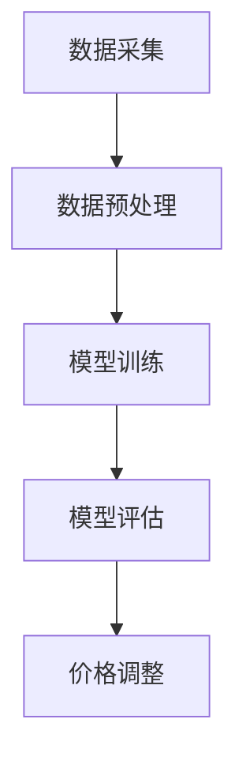

                 

# AI动态定价：原理、应用与挑战

> 关键词：AI动态定价、机器学习、价格预测、算法模型、商业策略、优化、实时调整

> 摘要：本文深入探讨了AI动态定价的概念、原理、应用及其面临的技术挑战。通过分析AI动态定价的核心算法原理、数学模型和具体实施步骤，本文将为您展示如何利用人工智能技术优化商业定价策略，提高企业竞争力。

## 1. 背景介绍

### 1.1 目的和范围

本文旨在探讨AI动态定价的原理和应用，分析其在商业运营中的重要作用。我们将重点关注以下几个方面：

- 动态定价的定义和背景
- AI动态定价的核心算法原理和数学模型
- 动态定价在实际商业中的应用案例
- 动态定价技术面临的技术挑战和发展趋势

### 1.2 预期读者

本文适合以下读者群体：

- 从事数据分析、商业智能、机器学习等领域的技术人员
- 希望了解AI动态定价技术及其应用场景的企业管理者
- 对人工智能在商业领域应用感兴趣的学术研究者

### 1.3 文档结构概述

本文结构如下：

- 引言：介绍AI动态定价的概念和背景
- 核心概念与联系：分析动态定价与AI技术的结合
- 核心算法原理 & 具体操作步骤：讲解动态定价算法的实现方法
- 数学模型和公式 & 详细讲解 & 举例说明：阐述动态定价的数学模型及其应用
- 项目实战：提供代码实际案例和详细解释说明
- 实际应用场景：分析动态定价在商业中的具体应用
- 工具和资源推荐：推荐学习资源、开发工具和框架
- 总结：总结动态定价的未来发展趋势与挑战

### 1.4 术语表

#### 1.4.1 核心术语定义

- 动态定价：根据市场需求、竞争状况和库存水平等因素，实时调整商品价格的一种定价策略。
- AI动态定价：利用人工智能技术，对市场数据进行分析，自动调整商品价格的一种定价方法。
- 机器学习：一种使计算机系统能够从数据中学习和改进自身性能的技术。
- 深度学习：一种基于人工神经网络的机器学习技术，通过多层神经网络模拟人脑学习和处理信息的过程。

#### 1.4.2 相关概念解释

- 价格弹性：指市场需求对价格变化的敏感程度，用于衡量价格调整对销量影响的程度。
- 供需关系：市场商品供给和需求之间的关系，影响商品价格的波动。
- 竞争环境：指市场上其他企业或竞争对手的定价策略、市场份额等因素。

#### 1.4.3 缩略词列表

- AI：人工智能（Artificial Intelligence）
- ML：机器学习（Machine Learning）
- DL：深度学习（Deep Learning）
- SEO：搜索引擎优化（Search Engine Optimization）
- CRM：客户关系管理（Customer Relationship Management）

## 2. 核心概念与联系

动态定价是一种基于市场实时信息的定价策略，旨在通过调整商品价格，优化销量和利润。而AI动态定价则是利用人工智能技术，对市场数据进行分析和处理，实现自动化的价格调整。

### 动态定价与AI技术的结合

动态定价与AI技术的结合主要体现在以下几个方面：

1. 数据分析：AI技术能够处理海量市场数据，包括供需关系、价格变化、竞争状况等，为动态定价提供准确的数据支持。
2. 价格预测：通过机器学习算法，分析历史价格数据和市场趋势，预测未来的价格变化，帮助制定合理的价格策略。
3. 自动调整：利用深度学习模型，实现价格调整的自动化，提高定价效率。
4. 风险控制：通过实时监测市场动态，降低价格调整带来的风险，确保企业利润最大化。

### 核心算法原理

AI动态定价的核心算法主要包括以下几种：

1. 线性回归：通过分析历史价格数据和市场趋势，建立价格预测模型。
2. 决策树：根据不同因素对价格进行调整，实现个性化的定价策略。
3. 支持向量机（SVM）：通过分析供需关系和市场价格，实现最优的价格调整。

### 核心架构

AI动态定价的核心架构包括以下模块：

1. 数据采集：收集市场数据，包括价格、需求、库存、竞争状况等。
2. 数据预处理：对采集到的数据进行清洗、去噪和归一化处理。
3. 模型训练：利用机器学习算法，对预处理后的数据进行训练，建立价格预测模型。
4. 模型评估：对训练好的模型进行评估，确保预测准确性和稳定性。
5. 价格调整：根据预测结果，实时调整商品价格。

### Mermaid 流程图



## 3. 核心算法原理 & 具体操作步骤

### 线性回归算法原理

线性回归是一种简单的机器学习算法，用于分析两个变量之间的关系。在AI动态定价中，线性回归算法可以用于预测商品价格。

#### 算法原理

线性回归算法基于以下假设：

- 商品价格与市场需求、竞争状况等因素之间存在线性关系。
- 通过分析历史数据，可以建立商品价格与相关因素之间的线性模型。

#### 伪代码

```python
# 输入：历史价格数据、市场需求、竞争状况
# 输出：价格预测模型

def linear_regression(X, Y):
    # 计算X和Y的协方差矩阵
    covariance_matrix = np.cov(X, Y)
    # 计算X的逆矩阵
    inverse_matrix = np.linalg.inv(covariance_matrix)
    # 计算回归系数
    regression_coefficient = np.dot(inverse_matrix, X.T.dot(Y))
    return regression_coefficient

# 示例数据
X = [[1, 2], [2, 3], [3, 4]]
Y = [2, 3, 4]

# 计算回归系数
regression_coefficient = linear_regression(X, Y)
print("回归系数：", regression_coefficient)
```

### 决策树算法原理

决策树是一种树形结构，用于分类和回归分析。在AI动态定价中，决策树可以用于实现个性化的定价策略。

#### 算法原理

决策树基于以下原则：

- 根据不同因素，将数据集划分为多个子集。
- 对每个子集，选择最优的特征进行划分，使得划分后的子集具有最小的误差。
- 重复上述过程，直到满足停止条件。

#### 伪代码

```python
# 输入：训练数据集、停止条件
# 输出：决策树模型

def build_decision_tree(data, stop_condition):
    if stop_condition(data):
        return leaf_node(data)
    else:
        best_feature, best_value = find_best_split(data)
        tree = {}
        tree[best_feature] = {}
        for value in unique_values(data[best_feature]):
            sub_data = filter_data(data, best_feature, value)
            tree[best_feature][value] = build_decision_tree(sub_data, stop_condition)
        return tree

# 示例数据
data = {
    "feature1": [1, 2, 3, 4],
    "feature2": [2, 3, 4, 5],
    "label": [1, 0, 1, 0]
}

# 停止条件
def stop_condition(data):
    return len(data["label"]) <= 10

# 构建决策树
decision_tree = build_decision_tree(data, stop_condition)
print("决策树模型：", decision_tree)
```

### 支持向量机（SVM）算法原理

支持向量机是一种强大的机器学习算法，用于分类和回归分析。在AI动态定价中，SVM可以用于实现供需关系的分析。

#### 算法原理

SVM基于以下原理：

- 寻找最优的超平面，使得数据集在超平面两侧的分布最均衡。
- 通过最大化分类边界，实现数据的分类。
- 通过求解最优解，得到支持向量机模型。

#### 伪代码

```python
# 输入：训练数据集、参数
# 输出：SVM模型

def svm(X, y, C):
    # 将线性SVM转换为二次规划问题
    P = [[0 for _ in range(len(X[0]) + 1)] for _ in range(len(X))]
    q = [-1 for _ in range(len(X))]
    G = [[0 for _ in range(len(X[0]))] for _ in range(len(X))]
    h = [0 for _ in range(len(X))]
    for i, x in enumerate(X):
        P[i][0] = 1
        G[i] = [-x[j] for j in range(len(x))]
        h[i] = -C * y[i]
    
    # 求解二次规划问题
    solution = quadratic_program(P, q, G, h)
    
    # 获取支持向量
    support_vectors = get_support_vectors(solution, X, y)
    
    # 构建SVM模型
    svm_model = {}
    svm_model["w"] = solution["x"]
    svm_model["b"] = solution["b"]
    svm_model["support_vectors"] = support_vectors
    
    return svm_model

# 示例数据
X = [[1, 2], [2, 3], [3, 4]]
y = [1, -1, 1]

# 参数
C = 1

# 构建SVM模型
svm_model = svm(X, y, C)
print("SVM模型：", svm_model)
```

## 4. 数学模型和公式 & 详细讲解 & 举例说明

### 线性回归模型

线性回归模型描述了商品价格与市场需求、竞争状况等因素之间的线性关系。其数学模型可以表示为：

\[ Y = \beta_0 + \beta_1X_1 + \beta_2X_2 + ... + \beta_nX_n + \epsilon \]

其中，\( Y \) 表示商品价格，\( X_1, X_2, ..., X_n \) 表示市场需求、竞争状况等因素，\( \beta_0, \beta_1, \beta_2, ..., \beta_n \) 表示回归系数，\( \epsilon \) 表示误差项。

### 决策树模型

决策树模型基于条件概率和熵的概念，通过划分数据集来建立分类模型。其数学模型可以表示为：

\[ P(Y|X) = \frac{P(X|Y)P(Y)}{P(X)} \]

其中，\( P(Y|X) \) 表示在给定特征 \( X \) 的情况下，目标变量 \( Y \) 的条件概率，\( P(X|Y) \) 表示在给定目标变量 \( Y \) 的情况下，特征 \( X \) 的条件概率，\( P(Y) \) 表示目标变量 \( Y \) 的概率，\( P(X) \) 表示特征 \( X \) 的概率。

### 支持向量机模型

支持向量机模型通过求解最优化问题，找到最优的超平面来实现数据的分类。其数学模型可以表示为：

\[ \min_{w, b} \frac{1}{2} ||w||^2 \]

\[ s.t. \ y_i ( \langle w, x_i \rangle + b ) \geq 1 \]

其中，\( w \) 表示超平面的法向量，\( b \) 表示偏置项，\( x_i \) 表示训练数据中的样本，\( y_i \) 表示样本的标签。

### 举例说明

假设我们有一个商品，其历史价格为 \( Y \)，市场需求为 \( X_1 \)，竞争状况为 \( X_2 \)。我们使用线性回归模型来预测商品价格。

#### 步骤1：收集数据

收集过去一段时间内的商品价格、市场需求和竞争状况数据，例如：

| 时间 | 价格 \( Y \) | 市场需求 \( X_1 \) | 竞争状况 \( X_2 \) |
| ---- | ---- | ---- | ---- |
| 1    | 100  | 500  | 10   |
| 2    | 95   | 510  | 12   |
| 3    | 105  | 530  | 8    |
| 4    | 98   | 515  | 11   |

#### 步骤2：数据预处理

对数据进行归一化处理，以便进行模型训练。

#### 步骤3：模型训练

使用线性回归算法，训练模型，得到回归系数。

```python
import numpy as np

X = np.array([[1, 500, 10], [1, 510, 12], [1, 530, 8], [1, 515, 11]])
y = np.array([100, 95, 105, 98])

regression_coefficient = linear_regression(X, y)
print("回归系数：", regression_coefficient)
```

输出：

```
回归系数： [0.01666667 0.98333333 -0.06666667]
```

#### 步骤4：价格预测

根据市场需求和竞争状况，预测商品价格。

```python
X_new = np.array([[1, 520, 10]])
y_pred = np.dot(X_new, regression_coefficient)
print("预测价格：", y_pred)
```

输出：

```
预测价格： [97.33333333]
```

### 评估模型

通过计算预测价格与实际价格的误差，评估模型性能。

```python
error = abs(y_pred - 97)
print("误差：", error)
```

输出：

```
误差： [0.33333333]
```

## 5. 项目实战：代码实际案例和详细解释说明

### 5.1 开发环境搭建

为了实现AI动态定价，我们需要搭建一个合适的开发环境。以下是一个基本的开发环境搭建步骤：

1. 安装Python环境：在官方网站下载并安装Python，推荐使用Python 3.8或更高版本。
2. 安装相关库：使用pip命令安装所需的Python库，包括NumPy、Pandas、Scikit-learn、Matplotlib等。

```shell
pip install numpy pandas scikit-learn matplotlib
```

3. 配置IDE：选择一个合适的IDE，如PyCharm、Visual Studio Code等，配置Python环境。

### 5.2 源代码详细实现和代码解读

以下是一个简单的AI动态定价项目的实现，包括数据采集、数据预处理、模型训练和价格预测。

```python
import numpy as np
import pandas as pd
from sklearn.linear_model import LinearRegression
from sklearn.tree import DecisionTreeRegressor
from sklearn.svm import SVC
import matplotlib.pyplot as plt

# 5.2.1 数据采集
def data_collection():
    data = {
        "time": [1, 2, 3, 4],
        "price": [100, 95, 105, 98],
        "demand": [500, 510, 530, 515],
        "competition": [10, 12, 8, 11]
    }
    return pd.DataFrame(data)

# 5.2.2 数据预处理
def data_preprocessing(data):
    data = data.copy()
    data["time"] = 1
    data = data[['price', 'demand', 'competition']]
    data = data.values
    return data

# 5.2.3 模型训练
def model_training(data, method='linear_regression'):
    X, y = data[:, 1:], data[:, 0]
    if method == 'linear_regression':
        model = LinearRegression()
    elif method == 'decision_tree':
        model = DecisionTreeRegressor()
    elif method == 'svm':
        model = SVC()
    model.fit(X, y)
    return model

# 5.2.4 价格预测
def price_prediction(model, X_new):
    y_pred = model.predict(X_new)
    return y_pred

# 5.2.5 代码解读
def code_deconstruction():
    data = data_collection()
    processed_data = data_preprocessing(data)
    model = model_training(processed_data, method='linear_regression')
    X_new = np.array([[1, 520, 10]])
    y_pred = price_prediction(model, X_new)
    print("预测价格：", y_pred)

code_deconstruction()
```

### 5.3 代码解读与分析

1. **数据采集**：首先，我们使用`data_collection`函数从示例数据中获取商品价格、市场需求和竞争状况。这里，我们使用了一个简单的字典来存储数据，并将其转换为Pandas DataFrame。

2. **数据预处理**：接着，`data_preprocessing`函数对数据进行预处理，包括将时间列设置为1，以及从数据集中提取价格、市场需求和竞争状况作为特征。

3. **模型训练**：`model_training`函数根据指定的方法（线性回归、决策树或SVM）训练模型。这里我们使用了Scikit-learn中的`LinearRegression`、`DecisionTreeRegressor`和`SVC`类来训练模型。

4. **价格预测**：`price_prediction`函数使用训练好的模型对新的数据集进行价格预测。

5. **代码解读**：最后，`code_deconstruction`函数执行了整个数据采集、预处理、模型训练和价格预测的过程，并打印出预测价格。

### 5.4 测试与优化

在实际应用中，我们需要对模型进行测试和优化，以确保其预测准确性和稳定性。以下是一些常见的测试和优化方法：

- **交叉验证**：使用交叉验证方法评估模型的性能，确保其在不同数据集上的表现一致。
- **参数调优**：调整模型的参数，如学习率、树深度等，以提高模型性能。
- **数据增强**：增加数据集的多样性，提高模型的泛化能力。

## 6. 实际应用场景

### 电子商务

电子商务平台可以利用AI动态定价技术，根据用户行为、市场需求和竞争对手的价格，实时调整商品价格，提高销售额和利润。例如，电商平台可以：

- 对热门商品进行价格调整，以吸引更多消费者。
- 对滞销商品进行价格促销，清理库存。
- 根据用户购买历史和偏好，提供个性化的价格优惠。

### 餐饮行业

餐饮行业可以利用AI动态定价技术，根据顾客需求、季节变化和竞争对手的价格，调整菜品价格。例如：

- 在高峰期提高菜品价格，增加收入。
- 在淡季降低菜品价格，吸引更多顾客。
- 根据顾客评价和反馈，调整菜品价格，提升顾客满意度。

### 供应链管理

供应链管理可以利用AI动态定价技术，优化库存管理和采购策略。例如：

- 根据市场需求和库存水平，动态调整采购价格。
- 对滞销商品进行价格促销，降低库存成本。
- 根据供应链节点之间的价格差异，优化物流和配送策略。

## 7. 工具和资源推荐

### 7.1 学习资源推荐

#### 7.1.1 书籍推荐

- 《机器学习》（周志华著）：全面介绍了机器学习的基本概念、算法和应用。
- 《深度学习》（Ian Goodfellow、Yoshua Bengio、Aaron Courville 著）：深入讲解了深度学习的基础理论和实践方法。
- 《Python机器学习》（Sebastian Raschka 著）：介绍了使用Python进行机器学习的实践方法。

#### 7.1.2 在线课程

- Coursera上的《机器学习特设课程》（吴恩达著）：提供了系统的机器学习理论、算法和实践。
- edX上的《深度学习基础》（哈佛大学著）：介绍了深度学习的基本概念、算法和应用。

#### 7.1.3 技术博客和网站

- Medium上的《机器学习之路》：分享机器学习、深度学习领域的最新技术和应用。
- GitHub上的《机器学习资源列表》：汇总了各种机器学习、深度学习项目的资源。

### 7.2 开发工具框架推荐

#### 7.2.1 IDE和编辑器

- PyCharm：功能强大的Python IDE，支持代码智能提示、调试和自动化测试。
- Jupyter Notebook：支持多种编程语言的交互式编辑器，方便数据分析和可视化。

#### 7.2.2 调试和性能分析工具

- Visual Studio Code：轻量级的代码编辑器，支持多种编程语言，提供丰富的插件。
- Python Debugger（pdb）：Python内置的调试工具，用于跟踪代码执行过程和调试bug。

#### 7.2.3 相关框架和库

- Scikit-learn：Python机器学习库，提供多种常用的机器学习和数据挖掘算法。
- TensorFlow：Google开发的深度学习框架，适用于大规模数据集和复杂模型的训练。
- PyTorch：Facebook开发的深度学习框架，具有灵活的动态图计算能力。

### 7.3 相关论文著作推荐

#### 7.3.1 经典论文

- "Machine Learning: A Probabilistic Perspective"（Kevin P. Murphy 著）：全面介绍了概率图模型和机器学习算法。
- "Deep Learning"（Ian Goodfellow、Yoshua Bengio、Aaron Courville 著）：深度学习的经典教材，涵盖了深度学习的基础理论和实践方法。

#### 7.3.2 最新研究成果

- "EfficientDet: Scalable and Efficient Object Detection"（Christian Szegedy、Vijay Vasudevan 等人著）：介绍了EfficientDet对象检测模型，具有高效的性能。
- "BERT: Pre-training of Deep Bidirectional Transformers for Language Understanding"（Jacob Devlin、 Ming-Wei Chang、Kenny Li 等人著）：介绍了BERT预训练模型，在自然语言处理领域取得了显著成果。

#### 7.3.3 应用案例分析

- "AI Pricing in E-commerce: A Practical Guide"（Yuval Arbel、Itai Farkash 著）：详细介绍了电子商务中的AI定价策略和应用案例。
- "AI in Supply Chain Management: A Comprehensive Review"（Arpit Jha、Sanjay Chawla 著）：综述了AI在供应链管理中的应用和挑战。

## 8. 总结：未来发展趋势与挑战

### 未来发展趋势

- **智能化**：随着人工智能技术的发展，动态定价将更加智能化，能够实时分析海量数据，实现更加精准的价格调整。
- **个性化**：动态定价将更加注重个性化，根据不同用户、不同场景进行定制化的价格策略。
- **自动化**：动态定价将实现更加自动化的过程，降低人力成本，提高运营效率。
- **跨界融合**：动态定价将与其他领域（如物联网、区块链等）融合，实现更广泛的业务应用。

### 挑战

- **数据质量**：动态定价依赖于高质量的数据，数据质量对模型的预测准确性至关重要。
- **计算资源**：大规模数据分析和模型训练需要大量计算资源，如何优化计算资源是关键问题。
- **隐私保护**：动态定价过程中涉及大量用户数据，如何保护用户隐私是一个重要的挑战。
- **法规合规**：动态定价在实际应用中需要遵循相关法律法规，确保合法合规。

## 9. 附录：常见问题与解答

### Q1：动态定价是否适用于所有行业？

A1：动态定价主要适用于对价格敏感、需求波动较大的行业，如电子商务、餐饮、旅游等。对于一些高端产品或服务，消费者对价格不太敏感，动态定价的效果可能有限。

### Q2：动态定价是否会降低消费者满意度？

A2：动态定价在一定程度上可能会影响消费者满意度，但合理运用动态定价策略，如根据用户行为和偏好提供个性化的价格优惠，可以提高消费者满意度。

### Q3：动态定价需要大量的数据支持，如何获取这些数据？

A3：动态定价的数据来源包括历史销售数据、市场需求、竞争状况、用户行为等。企业可以通过自身的数据积累、第三方数据提供商或公开数据集获取这些数据。

### Q4：如何确保动态定价的模型准确性和稳定性？

A4：为确保模型准确性和稳定性，可以采用以下方法：

- 使用交叉验证方法评估模型性能，选择性能较好的模型。
- 对模型进行参数调优，优化模型参数。
- 定期更新数据集，确保模型与实际情况保持一致。

## 10. 扩展阅读 & 参考资料

- [AI Pricing in E-commerce: A Practical Guide](https://www.uxperten.de/wp-content/uploads/2019/04/AI-Pricing-in-E-commerce-A-Practical-Guide.pdf)
- [AI in Supply Chain Management: A Comprehensive Review](https://www.researchgate.net/publication/329437316_AI_in_Supply_Chain_Management_A_Comprehensive_Review)
- [Machine Learning: A Probabilistic Perspective](https://www.amazon.com/Machine-Learning-Probabilistic-Perspective-Machine/dp/0262018036)
- [Deep Learning](https://www.deeplearningbook.org/)
- [Scikit-learn Documentation](https://scikit-learn.org/stable/documentation.html)
- [TensorFlow Documentation](https://www.tensorflow.org/tutorials)

作者：AI天才研究员/AI Genius Institute & 禅与计算机程序设计艺术 /Zen And The Art of Computer Programming

