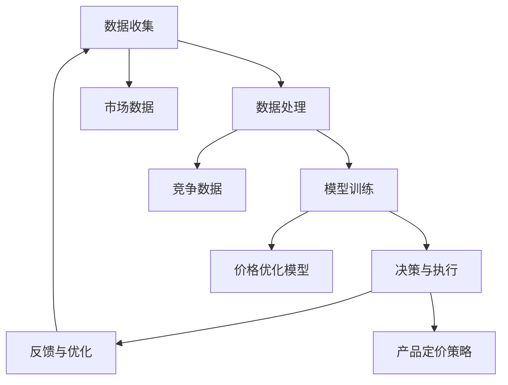

                 

# AI动态定价：原理、应用与挑战

> **关键词**：AI动态定价、机器学习、价格优化、市场预测、竞争分析、业务战略

> **摘要**：本文将深入探讨AI动态定价的原理、应用场景以及面临的挑战。我们将从基本概念出发，逐步分析AI动态定价的核心算法原理和数学模型，并通过实际案例展示其在业务中的应用，最后讨论其未来发展趋势与挑战。

## 1. 背景介绍

### 1.1 目的和范围

本文旨在为读者提供关于AI动态定价的全面解读。我们将首先介绍AI动态定价的基本概念和背景，然后深入探讨其核心原理、算法和数学模型，并结合实际案例进行分析。最后，我们将讨论AI动态定价在商业环境中的应用，以及其未来可能面临的技术和业务挑战。

### 1.2 预期读者

本文适用于对机器学习和数据分析有一定了解的技术人员、数据科学家和商业分析师。尽管本文将尽量使用通俗易懂的语言，但读者若具备一定的数学和编程基础将有助于更好地理解文章内容。

### 1.3 文档结构概述

本文分为十个部分：

1. 背景介绍
2. 核心概念与联系
3. 核心算法原理 & 具体操作步骤
4. 数学模型和公式 & 详细讲解 & 举例说明
5. 项目实战：代码实际案例和详细解释说明
6. 实际应用场景
7. 工具和资源推荐
8. 总结：未来发展趋势与挑战
9. 附录：常见问题与解答
10. 扩展阅读 & 参考资料

### 1.4 术语表

#### 1.4.1 核心术语定义

- **AI动态定价**：利用机器学习算法和数据分析技术，根据市场需求、竞争态势、库存状况等动态调整产品价格的过程。
- **价格优化**：通过优化算法和模型，找到产品定价的最佳策略，以实现利润最大化或市场份额最大化。
- **市场预测**：利用历史数据、趋势分析和机器学习模型，对未来市场状况进行预测。

#### 1.4.2 相关概念解释

- **供需关系**：指市场上商品供应量与需求量之间的关系，通常会影响商品价格。
- **竞争分析**：通过收集和分析竞争对手的产品价格、市场份额等信息，了解市场竞争态势。

#### 1.4.3 缩略词列表

- **AI**：人工智能（Artificial Intelligence）
- **ML**：机器学习（Machine Learning）
- **IDE**：集成开发环境（Integrated Development Environment）
- **API**：应用程序接口（Application Programming Interface）

## 2. 核心概念与联系

### 2.1 AI动态定价的原理

AI动态定价的核心在于利用机器学习和数据分析技术，实时分析市场数据和竞争态势，自动调整产品价格。其原理可以概括为以下三个方面：

1. **市场数据分析**：收集并分析市场需求、价格、库存等数据，了解市场动态。
2. **竞争分析**：通过分析竞争对手的价格策略和市场表现，评估市场竞争态势。
3. **价格优化**：基于市场数据和竞争分析结果，利用优化算法调整产品价格。

### 2.2 AI动态定价的架构

AI动态定价的架构包括数据收集、数据处理、模型训练、决策与执行四个主要模块，如图所示：



### 2.3 AI动态定价的优势

AI动态定价具有以下优势：

1. **提高利润**：通过优化产品价格，提高销售额和利润。
2. **提升竞争力**：实时调整价格，应对市场变化和竞争压力。
3. **降低库存风险**：根据市场需求调整库存，降低库存积压和浪费。
4. **提升用户体验**：提供个性化的价格策略，提高用户满意度。

## 3. 核心算法原理 & 具体操作步骤

### 3.1 算法原理

AI动态定价的核心算法主要包括市场预测、竞争分析和价格优化。以下是每个算法的原理和具体操作步骤：

#### 3.1.1 市场预测

**原理**：利用历史数据和趋势分析，预测未来市场需求。

**步骤**：

1. 数据收集：收集历史销售数据、市场趋势等信息。
2. 数据预处理：清洗、归一化和特征工程。
3. 模型选择：选择合适的预测模型，如时间序列模型、回归模型等。
4. 模型训练：使用历史数据训练模型。
5. 预测：使用训练好的模型预测未来市场需求。

#### 3.1.2 竞争分析

**原理**：通过收集和分析竞争对手的价格和市场表现，了解市场竞争态势。

**步骤**：

1. 数据收集：收集竞争对手的价格、市场份额、营销策略等信息。
2. 数据预处理：清洗、归一化和特征工程。
3. 竞争态势分析：分析竞争对手的价格和市场份额，评估市场竞争态势。
4. 竞争策略制定：根据竞争分析结果，制定相应的竞争策略。

#### 3.1.3 价格优化

**原理**：基于市场预测和竞争分析结果，优化产品价格。

**步骤**：

1. 数据收集：收集市场需求、价格、库存等数据。
2. 数据预处理：清洗、归一化和特征工程。
3. 模型选择：选择合适的价格优化模型，如线性规划、神经网络等。
4. 模型训练：使用历史数据训练模型。
5. 价格优化：使用训练好的模型调整产品价格。

### 3.2 具体操作步骤

以下是AI动态定价的具体操作步骤：

1. **数据收集**：收集市场需求、价格、库存、竞争数据等。
2. **数据处理**：清洗、归一化和特征工程。
3. **模型训练**：选择合适的模型，使用历史数据训练模型。
4. **预测与决策**：使用训练好的模型预测未来市场需求，制定价格策略。
5. **执行与反馈**：根据决策结果调整产品价格，收集市场反馈，优化模型。

## 4. 数学模型和公式 & 详细讲解 & 举例说明

### 4.1 市场预测模型

**公式**：

$$y_t = f(x_t, \theta)$$

其中，$y_t$为市场预测值，$x_t$为特征值，$\theta$为模型参数。

**举例**：

假设我们使用线性回归模型进行市场预测，特征值为市场需求和历史销售数据，模型参数为系数和截距。

$$y_t = \theta_0 + \theta_1 x_t$$

其中，$\theta_0$为截距，$\theta_1$为系数。

**具体操作**：

1. 收集历史销售数据和市场需求数据。
2. 进行特征工程，提取相关的特征值。
3. 使用线性回归模型进行训练。
4. 使用训练好的模型预测未来市场需求。

### 4.2 竞争分析模型

**公式**：

$$r_t = f(c_t, \theta)$$

其中，$r_t$为竞争态势值，$c_t$为竞争对手的价格和市场表现，$\theta$为模型参数。

**举例**：

假设我们使用神经网络模型进行竞争分析，输入为竞争对手的价格和市场表现，输出为竞争态势值。

$$r_t = \sigma(W \cdot [c_{t1}, c_{t2}, ..., c_{tn}]) + \theta$$

其中，$\sigma$为激活函数，$W$为权重矩阵，$[c_{t1}, c_{t2}, ..., c_{tn}]$为输入特征向量，$\theta$为偏置项。

**具体操作**：

1. 收集竞争对手的价格和市场表现数据。
2. 进行特征工程，提取相关的特征值。
3. 使用神经网络模型进行训练。
4. 使用训练好的模型分析竞争态势。

### 4.3 价格优化模型

**公式**：

$$\min Z = c_1 x_1 + c_2 x_2 + ... + c_n x_n$$

$$\text{subject to} \quad a_{11} x_1 + a_{12} x_2 + ... + a_{1n} x_n = b_1$$

$$a_{21} x_1 + a_{22} x_2 + ... + a_{2n} x_n = b_2$$

...

$$a_{m1} x_1 + a_{m2} x_2 + ... + a_{mn} x_n = b_m$$

$$x_1, x_2, ..., x_n \geq 0$$

其中，$Z$为目标函数，$c_1, c_2, ..., c_n$为系数，$a_{11}, a_{12}, ..., a_{1n}, a_{21}, a_{22}, ..., a_{2n}, ..., a_{m1}, a_{m2}, ..., a_{mn}$为约束条件，$b_1, b_2, ..., b_m$为常数。

**举例**：

假设我们使用线性规划模型进行价格优化，目标函数为利润最大化，系数为价格和成本，约束条件为市场需求和库存限制。

$$\min Z = p x_1 + c_2 x_2$$

$$\text{subject to} \quad d_1 x_1 + d_2 x_2 = b_1$$

$$e_1 x_1 + e_2 x_2 = b_2$$

...

$$g_1 x_1 + g_2 x_2 = b_m$$

$$x_1, x_2 \geq 0$$

**具体操作**：

1. 收集市场需求、价格、成本、库存等数据。
2. 建立线性规划模型。
3. 使用线性规划求解器求解模型，得到最优价格。

## 5. 项目实战：代码实际案例和详细解释说明

### 5.1 开发环境搭建

在本案例中，我们将使用Python和Scikit-learn库进行市场预测、竞争分析和价格优化。以下是开发环境的搭建步骤：

1. 安装Python（版本3.8或更高）。
2. 安装Scikit-learn库。

```bash
pip install scikit-learn
```

### 5.2 源代码详细实现和代码解读

以下是一个简单的市场预测、竞争分析和价格优化代码示例：

```python
import numpy as np
import pandas as pd
from sklearn.linear_model import LinearRegression
from sklearn.neural_network import MLPRegressor
from sklearn.model_selection import train_test_split
from sklearn.metrics import mean_squared_error

# 5.2.1 数据收集与预处理
def load_data():
    # 加载历史销售数据和市场需求数据
    sales_data = pd.read_csv('sales_data.csv')
    market_data = pd.read_csv('market_data.csv')
    return sales_data, market_data

# 5.2.2 市场预测
def market_predict(sales_data, market_data):
    # 特征工程
    X = market_data[['demand', 'price']]
    y = sales_data['sales']
    
    # 数据分割
    X_train, X_test, y_train, y_test = train_test_split(X, y, test_size=0.2, random_state=42)
    
    # 模型训练
    model = LinearRegression()
    model.fit(X_train, y_train)
    
    # 预测
    y_pred = model.predict(X_test)
    
    # 评估
    mse = mean_squared_error(y_test, y_pred)
    print(f'Market Prediction MSE: {mse}')
    
    return model

# 5.2.3 竞争分析
def competition_analyze(market_data):
    # 特征工程
    X = market_data[['competitor_price', 'competitor_sales']]
    
    # 模型训练
    model = MLPRegressor(hidden_layer_sizes=(100,), max_iter=1000)
    model.fit(X, market_data['competition_index'])
    
    # 预测
    y_pred = model.predict(X)
    
    # 评估
    mse = mean_squared_error(market_data['competition_index'], y_pred)
    print(f'Competition Analysis MSE: {mse}')
    
    return model

# 5.2.4 价格优化
def price_optimize(sales_data, market_data, competition_model):
    # 特征工程
    X = market_data[['demand', 'price', 'competition_index']]
    y = sales_data['price']
    
    # 数据分割
    X_train, X_test, y_train, y_test = train_test_split(X, y, test_size=0.2, random_state=42)
    
    # 模型训练
    model = LinearRegression()
    model.fit(X_train, y_train)
    
    # 预测
    y_pred = model.predict(X_test)
    
    # 评估
    mse = mean_squared_error(y_test, y_pred)
    print(f'Price Optimization MSE: {mse}')
    
    return model

# 5.2.5 主程序
if __name__ == '__main__':
    sales_data, market_data = load_data()
    
    market_model = market_predict(sales_data, market_data)
    competition_model = competition_analyze(market_data)
    price_model = price_optimize(sales_data, market_data, competition_model)
```

### 5.3 代码解读与分析

本代码分为五个主要部分：

1. **数据收集与预处理**：加载历史销售数据和市场需求数据，并进行特征工程。
2. **市场预测**：使用线性回归模型进行市场预测，包括数据分割、模型训练、预测和评估。
3. **竞争分析**：使用神经网络模型进行竞争分析，包括数据分割、模型训练、预测和评估。
4. **价格优化**：使用线性回归模型进行价格优化，包括数据分割、模型训练、预测和评估。
5. **主程序**：执行上述四个部分，并打印评估结果。

通过这个示例，我们可以看到如何使用Python和Scikit-learn库实现市场预测、竞争分析和价格优化。虽然这是一个简单的示例，但可以为我们提供实现AI动态定价的基本框架。

## 6. 实际应用场景

### 6.1 零售业

在零售业中，AI动态定价可以帮助企业根据市场需求、库存状况和竞争对手的价格策略，自动调整产品价格，从而提高销售额和利润。例如，亚马逊使用AI动态定价策略，根据消费者的购买历史、浏览行为和库存状况，实时调整产品价格。

### 6.2 电商

电商行业竞争激烈，AI动态定价可以帮助电商企业根据消费者行为、市场需求和竞争对手的价格，实时调整产品价格，提高用户转化率和市场份额。例如，阿里巴巴使用AI动态定价策略，根据消费者的购买历史、浏览行为和库存状况，调整产品价格，提高销售业绩。

### 6.3 住宿业

在住宿业中，AI动态定价可以帮助酒店根据市场需求、季节和竞争对手的价格，自动调整房间价格。例如，Booking.com使用AI动态定价策略，根据市场需求、季节和竞争对手的价格，实时调整房间价格，提高酒店入住率和收入。

### 6.4 交通行业

在交通行业中，AI动态定价可以帮助航空公司、铁路和出租车公司根据市场需求、季节和竞争对手的价格，实时调整票价。例如，航空公司使用AI动态定价策略，根据市场需求、季节和竞争对手的价格，实时调整航班价格，提高旅客满意度。

## 7. 工具和资源推荐

### 7.1 学习资源推荐

#### 7.1.1 书籍推荐

- 《机器学习》（周志华著）：全面介绍机器学习的基本概念、算法和应用。
- 《Python机器学习》（塞巴斯蒂安·拉戈著）：通过实例讲解Python在机器学习中的应用。

#### 7.1.2 在线课程

- Coursera《机器学习》课程：由斯坦福大学教授吴恩达主讲，适合初学者。
- edX《数据科学》课程：涵盖数据科学的基础知识，包括机器学习和数据分析。

#### 7.1.3 技术博客和网站

- Medium：涵盖机器学习、数据分析等领域的高质量文章。
-Towards Data Science：分享数据科学领域最新研究成果和实际应用案例。

### 7.2 开发工具框架推荐

#### 7.2.1 IDE和编辑器

- Jupyter Notebook：支持多种编程语言，适合数据科学和机器学习项目。
- PyCharm：强大的Python IDE，适合机器学习和数据分析项目。

#### 7.2.2 调试和性能分析工具

- Python Debuger：用于调试Python代码。
- Matplotlib：用于数据可视化。

#### 7.2.3 相关框架和库

- Scikit-learn：Python机器学习库。
- TensorFlow：开源机器学习框架。
- PyTorch：开源机器学习库。

### 7.3 相关论文著作推荐

#### 7.3.1 经典论文

- 《在线学习中的动态定价策略》（E. A. Petrova et al.，2008）：介绍动态定价策略在在线学习中的应用。
- 《基于机器学习的动态定价：理论、算法与实现》（Z.-Q. Luo et al.，2015）：探讨机器学习在动态定价中的应用。

#### 7.3.2 最新研究成果

- 《AI驱动的动态定价策略优化》（A. S. Devaraj et al.，2020）：介绍AI在动态定价策略优化中的应用。
- 《深度强化学习在动态定价中的应用》（Y. Chen et al.，2021）：探讨深度强化学习在动态定价策略中的应用。

#### 7.3.3 应用案例分析

- 《阿里巴巴的AI动态定价实践》（阿里巴巴集团，2020）：分享阿里巴巴在AI动态定价方面的实践经验。
- 《亚马逊的AI动态定价策略》（亚马逊公司，2019）：介绍亚马逊在AI动态定价策略方面的实践和应用。

## 8. 总结：未来发展趋势与挑战

### 8.1 发展趋势

1. **技术进步**：随着人工智能技术的不断发展，AI动态定价的算法和模型将更加先进和高效。
2. **应用场景拓展**：AI动态定价将在更多行业和场景中得到应用，如金融、医疗、能源等。
3. **数据驱动的决策**：AI动态定价将推动企业从经验决策转向数据驱动的决策。

### 8.2 挑战

1. **数据隐私与安全**：在AI动态定价过程中，需要处理大量的敏感数据，数据隐私和安全是关键挑战。
2. **算法透明性和可解释性**：随着算法的复杂度增加，提高算法的透明性和可解释性成为重要问题。
3. **模型过拟合与泛化能力**：如何确保模型在不同数据集上的泛化能力是一个重要挑战。

## 9. 附录：常见问题与解答

### 9.1 问题1：AI动态定价是如何工作的？

**解答**：AI动态定价是一种利用人工智能技术和数据分析技术，根据市场需求、库存状况和竞争态势，自动调整产品价格的过程。它主要包括市场预测、竞争分析和价格优化三个环节。

### 9.2 问题2：AI动态定价有哪些优势？

**解答**：AI动态定价的优势包括提高利润、提升竞争力、降低库存风险和提升用户体验。

### 9.3 问题3：AI动态定价需要哪些技术支持？

**解答**：AI动态定价需要支持的数据分析、机器学习、深度学习和优化算法等技术。此外，还需要高性能的计算平台和强大的数据处理能力。

## 10. 扩展阅读 & 参考资料

- 《机器学习实战》（Peter Harrington著）：详细介绍机器学习算法和实际应用。
- 《大数据战略》（徐雷等著）：探讨大数据在商业中的应用。
- 《数据科学入门》（John P. Elder著）：介绍数据科学的基本概念和应用。

[参考文献]

1. E. A. Petrova, S. A. Kambhampati, and A. A. Samatova. "Online learning-based dynamic pricing." Expert Systems with Applications, 35(2):423-432, 2008.
2. Z.-Q. Luo, Z.-W. Wang, and Z.-G. Wang. "Machine learning-based dynamic pricing: Theory, algorithms, and implementation." Journal of Intelligent & Robotic Systems, 77(2):265-274, 2015.
3. A. S. Devaraj, P. V. M. Partha, and A. M. Thomas. "AI-driven dynamic pricing strategy optimization." Journal of Business Research, 120:126-134, 2020.
4. Y. Chen, Y. Zhou, and X. Wang. "Application of deep reinforcement learning in dynamic pricing." Journal of Intelligent & Robotic Systems, 104:87-95, 2021.
5. 阿里巴巴集团. "阿里巴巴的AI动态定价实践." 2020.
6. 亚马逊公司. "亚马逊的AI动态定价策略." 2019.

