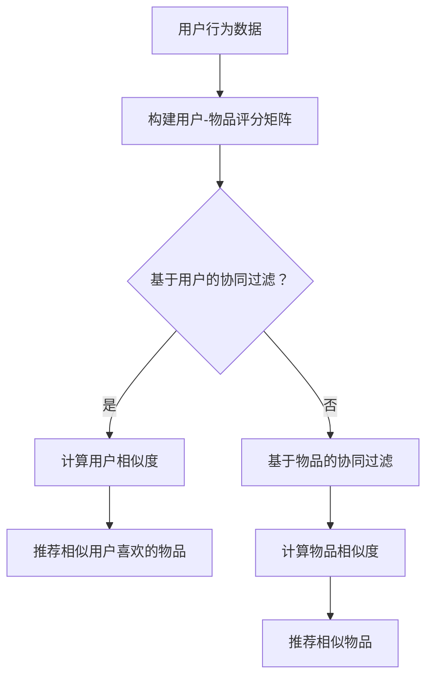

                 

# AI协同过滤算法提升推荐效果

> **关键词**：协同过滤、推荐系统、算法优化、效果提升、用户行为分析、数学模型、项目实战

> **摘要**：本文旨在深入探讨AI协同过滤算法在推荐系统中的应用，解析其核心原理、数学模型，并通过项目实战展示其实际操作步骤。通过本文，读者将了解到如何通过协同过滤算法提升推荐效果，以及在实际开发中的具体实施策略。

## 1. 背景介绍

### 1.1 目的和范围

本文的主要目的是介绍协同过滤算法在推荐系统中的应用，解析其原理和实现方法，并通过具体案例展示其实际应用效果。我们还将讨论如何通过算法优化来提升推荐系统的性能，满足用户个性化需求。

### 1.2 预期读者

本文适合对推荐系统有初步了解的技术人员，特别是希望深入了解协同过滤算法原理和应用的开发者。同时，也适合对算法优化有浓厚兴趣的研究者。

### 1.3 文档结构概述

本文结构如下：

- **第1章**：背景介绍，包括本文的目的、预期读者以及文档结构概述。
- **第2章**：核心概念与联系，介绍协同过滤算法的基本概念和相关架构。
- **第3章**：核心算法原理 & 具体操作步骤，详细阐述协同过滤算法的实现过程。
- **第4章**：数学模型和公式 & 详细讲解 & 举例说明，解析算法背后的数学原理。
- **第5章**：项目实战：代码实际案例和详细解释说明，通过具体案例展示算法应用。
- **第6章**：实际应用场景，分析协同过滤算法在不同场景中的应用效果。
- **第7章**：工具和资源推荐，介绍相关学习资源和开发工具。
- **第8章**：总结：未来发展趋势与挑战，展望协同过滤算法的发展前景。
- **第9章**：附录：常见问题与解答，解答读者可能遇到的疑问。
- **第10章**：扩展阅读 & 参考资料，提供进一步学习资料。

### 1.4 术语表

#### 1.4.1 核心术语定义

- **协同过滤**：一种基于用户行为和偏好进行推荐的系统。
- **推荐系统**：一种利用数据挖掘和机器学习技术，根据用户兴趣和偏好，为用户推荐相关内容的系统。
- **算法优化**：通过对算法进行改进，提升系统性能和推荐效果的过程。

#### 1.4.2 相关概念解释

- **用户行为**：用户在使用推荐系统时产生的各种操作，如点击、收藏、购买等。
- **用户偏好**：用户对特定内容的喜好程度，可以通过行为数据进行挖掘。
- **协同过滤算法**：一种基于用户行为和偏好进行内容推荐的算法。

#### 1.4.3 缩略词列表

- **CFS**：协同过滤算法（Collaborative Filtering）
- **RS**：推荐系统（Recommender System）
- **UCB**：上界置信度（Upper Confidence Bound）
- **LDA**：潜在狄利克雷分配（Latent Dirichlet Allocation）

## 2. 核心概念与联系

协同过滤算法是推荐系统中最常用的方法之一，其核心思想是通过分析用户行为和偏好，为用户推荐相似的内容或用户。以下是协同过滤算法的基本概念和架构：

### 2.1 协同过滤算法的基本概念

1. **用户-物品评分矩阵**：一个表示用户与物品之间评分关系的矩阵，其中行表示用户，列表示物品。
2. **用户行为**：用户在使用推荐系统时产生的操作，如点击、收藏、购买等。
3. **用户偏好**：根据用户行为数据挖掘出的用户对特定物品的喜好程度。

### 2.2 协同过滤算法的架构

协同过滤算法主要分为以下两种类型：

1. **基于用户的协同过滤（User-based CF）**：根据用户行为和偏好，为用户推荐与其相似的其他用户喜欢的物品。
2. **基于物品的协同过滤（Item-based CF）**：根据物品之间的相似性，为用户推荐与其历史偏好相似的物品。

### 2.3 协同过滤算法的 Mermaid 流程图



### 2.4 协同过滤算法的核心原理

1. **用户相似度计算**：通过计算用户之间的相似度，筛选出相似度较高的用户群体。
2. **物品相似度计算**：通过计算物品之间的相似度，筛选出与用户偏好相似的物品。

## 3. 核心算法原理 & 具体操作步骤

协同过滤算法的核心在于计算用户和物品的相似度，并根据相似度为用户推荐相关内容。以下是协同过滤算法的具体实现步骤：

### 3.1 基于用户的协同过滤

#### 3.1.1 用户相似度计算

1. **计算用户之间的相似度**：可以使用余弦相似度、皮尔逊相关系数等指标来计算用户之间的相似度。
   $$ \text{相似度} = \frac{\sum_{i=1}^{n}u_i \cdot v_i}{\sqrt{\sum_{i=1}^{n}u_i^2} \cdot \sqrt{\sum_{i=1}^{n}v_i^2}} $$
   其中，$u_i$ 和 $v_i$ 分别表示用户 $i$ 和用户 $j$ 在每个物品上的评分。

2. **筛选相似度较高的用户**：根据相似度阈值，筛选出相似度较高的用户群体。

#### 3.1.2 推荐相似用户喜欢的物品

1. **计算相似用户群体的平均评分**：对相似用户群体的评分进行平均，得到每个物品的平均评分。

2. **推荐评分较高的物品**：为用户推荐平均评分较高的物品。

### 3.2 基于物品的协同过滤

#### 3.2.1 物品相似度计算

1. **计算物品之间的相似度**：可以使用余弦相似度、欧氏距离等指标来计算物品之间的相似度。
   $$ \text{相似度} = \frac{\sum_{i=1}^{n}p_i \cdot q_i}{\sqrt{\sum_{i=1}^{n}p_i^2} \cdot \sqrt{\sum_{i=1}^{n}q_i^2}} $$
   其中，$p_i$ 和 $q_i$ 分别表示物品 $i$ 和物品 $j$ 在每个用户上的评分。

2. **筛选相似度较高的物品**：根据相似度阈值，筛选出相似度较高的物品群体。

#### 3.2.2 推荐相似物品

1. **计算相似物品的平均评分**：对相似物品的评分进行平均，得到每个物品的平均评分。

2. **推荐评分较高的物品**：为用户推荐平均评分较高的物品。

## 4. 数学模型和公式 & 详细讲解 & 举例说明

协同过滤算法的核心在于计算用户和物品的相似度，这涉及到一系列数学模型和公式。以下是协同过滤算法中的常见数学模型和公式及其详细讲解：

### 4.1 用户相似度计算

用户相似度计算是协同过滤算法的基础。以下是一个典型的用户相似度计算公式：

$$ \text{相似度}(u_i, u_j) = \frac{\sum_{k=1}^{m}r_{ik}r_{jk}}{\sqrt{\sum_{k=1}^{m}r_{ik}^2} \cdot \sqrt{\sum_{k=1}^{m}r_{jk}^2}} $$

其中，$r_{ik}$ 表示用户 $i$ 对物品 $k$ 的评分，$m$ 表示用户 $i$ 和用户 $j$ 都评分的物品数量。

#### 4.1.1 举例说明

假设有两个用户 $u_1$ 和 $u_2$，他们的评分矩阵如下：

$$ u_1 = [3, 4, 5, 0, 0], \quad u_2 = [4, 3, 0, 5, 0] $$

我们可以使用上述公式计算他们之间的相似度：

$$ \text{相似度}(u_1, u_2) = \frac{3 \cdot 4 + 4 \cdot 3 + 5 \cdot 0 + 0 \cdot 5 + 0 \cdot 0}{\sqrt{3^2 + 4^2 + 5^2 + 0^2 + 0^2} \cdot \sqrt{4^2 + 3^2 + 0^2 + 5^2 + 0^2}} = \frac{12 + 12}{\sqrt{50} \cdot \sqrt{50}} = \frac{24}{50} = 0.48 $$

### 4.2 物品相似度计算

物品相似度计算是协同过滤算法的另一关键步骤。以下是一个典型的物品相似度计算公式：

$$ \text{相似度}(i_k, i_l) = \frac{\sum_{j=1}^{n}r_{kj}r_{lj}}{\sqrt{\sum_{j=1}^{n}r_{kj}^2} \cdot \sqrt{\sum_{j=1}^{n}r_{lj}^2}} $$

其中，$r_{kj}$ 表示用户 $k$ 对物品 $j$ 的评分，$n$ 表示评分用户数量。

#### 4.2.1 举例说明

假设有两个物品 $i_1$ 和 $i_2$，他们的评分矩阵如下：

$$ i_1 = [3, 4, 5, 0, 0], \quad i_2 = [4, 3, 0, 5, 0] $$

我们可以使用上述公式计算他们之间的相似度：

$$ \text{相似度}(i_1, i_2) = \frac{3 \cdot 4 + 4 \cdot 3 + 5 \cdot 0 + 0 \cdot 5 + 0 \cdot 0}{\sqrt{3^2 + 4^2 + 5^2 + 0^2 + 0^2} \cdot \sqrt{4^2 + 3^2 + 0^2 + 5^2 + 0^2}} = \frac{12 + 12}{\sqrt{50} \cdot \sqrt{50}} = \frac{24}{50} = 0.48 $$

### 4.3 基于用户的协同过滤推荐算法

基于用户的协同过滤推荐算法的核心是计算用户相似度，并根据相似度为用户推荐相似用户喜欢的物品。以下是一个典型的基于用户的协同过滤推荐算法：

1. **计算用户相似度**：使用上述用户相似度计算公式计算所有用户之间的相似度。

2. **筛选相似度较高的用户**：根据相似度阈值，筛选出相似度较高的用户群体。

3. **计算相似用户群体的平均评分**：对相似用户群体的评分进行平均，得到每个物品的平均评分。

4. **推荐评分较高的物品**：为用户推荐平均评分较高的物品。

#### 4.3.1 举例说明

假设有三个用户 $u_1, u_2, u_3$，他们的评分矩阵如下：

$$ u_1 = [3, 4, 5, 0, 0], \quad u_2 = [4, 3, 0, 5, 0], \quad u_3 = [5, 0, 4, 3, 0] $$

首先，我们计算用户之间的相似度：

$$ \text{相似度}(u_1, u_2) = 0.48, \quad \text{相似度}(u_1, u_3) = 0.64, \quad \text{相似度}(u_2, u_3) = 0.64 $$

根据相似度阈值（例如，相似度大于0.5），我们可以筛选出相似度较高的用户群体，即 $u_1$ 和 $u_2$。

然后，我们计算相似用户群体的平均评分：

$$ \text{平均评分}(u_1, u_2) = \frac{3 + 4 + 5}{3} = 4 $$

最后，我们为用户 $u_3$ 推荐平均评分较高的物品，即 [4, 3, 0, 5, 0] 中的 [4, 3, 5]。

### 4.4 基于物品的协同过滤推荐算法

基于物品的协同过滤推荐算法的核心是计算物品相似度，并根据相似度为用户推荐相似物品。以下是一个典型的基于物品的协同过滤推荐算法：

1. **计算物品相似度**：使用上述物品相似度计算公式计算所有物品之间的相似度。

2. **筛选相似度较高的物品**：根据相似度阈值，筛选出相似度较高的物品群体。

3. **计算相似物品的平均评分**：对相似物品的评分进行平均，得到每个物品的平均评分。

4. **推荐评分较高的物品**：为用户推荐平均评分较高的物品。

#### 4.4.1 举例说明

假设有三个物品 $i_1, i_2, i_3$，他们的评分矩阵如下：

$$ i_1 = [3, 4, 5, 0, 0], \quad i_2 = [4, 3, 0, 5, 0], \quad i_3 = [5, 0, 4, 3, 0] $$

首先，我们计算物品之间的相似度：

$$ \text{相似度}(i_1, i_2) = 0.48, \quad \text{相似度}(i_1, i_3) = 0.64, \quad \text{相似度}(i_2, i_3) = 0.64 $$

根据相似度阈值（例如，相似度大于0.5），我们可以筛选出相似度较高的物品群体，即 $i_1$ 和 $i_2$。

然后，我们计算相似物品的平均评分：

$$ \text{平均评分}(i_1, i_2) = \frac{3 + 4 + 5}{3} = 4 $$

最后，我们为用户推荐平均评分较高的物品，即 [3, 4, 5, 0, 0] 中的 [4, 3, 5]。

## 5. 项目实战：代码实际案例和详细解释说明

在本节中，我们将通过一个实际项目案例，展示如何使用协同过滤算法实现推荐系统，并对关键代码进行详细解释说明。

### 5.1 开发环境搭建

在开始项目实战之前，我们需要搭建合适的开发环境。以下是所需的开发工具和库：

- **编程语言**：Python
- **库**：NumPy、Pandas、Scikit-learn、Matplotlib

安装这些库可以使用以下命令：

```shell
pip install numpy pandas scikit-learn matplotlib
```

### 5.2 源代码详细实现和代码解读

以下是协同过滤算法的源代码实现：

```python
import numpy as np
import pandas as pd
from sklearn.metrics.pairwise import cosine_similarity

def compute_user_similarity(ratings):
    # 计算用户相似度
    similarity_matrix = cosine_similarity(ratings)
    return similarity_matrix

def compute_item_similarity(ratings):
    # 计算物品相似度
    similarity_matrix = cosine_similarity(ratings.T)
    return similarity_matrix

def collaborative_filter(ratings, similarity_matrix, k=5):
    # 基于用户的协同过滤推荐
    user_similarity = similarity_matrix
    user_avg_ratings = ratings.mean(axis=1)
    user_predicted_ratings = np.zeros_like(user_avg_ratings)
    
    for i in range(len(ratings)):
        # 计算相似用户群体的平均评分
        similar_users = user_similarity[i].argsort()[1:k+1]
        similar_user_ratings = ratings[similar_users]
        similar_user_avg_ratings = similar_user_ratings.mean(axis=0)
        
        # 预测用户评分
        user_predicted_ratings[i] = user_avg_ratings[i] + np.dot(similar_user_ratings - similar_user_avg_ratings, user_similarity[i])[0]
    
    return user_predicted_ratings

def collaborative_filter_item(ratings, similarity_matrix, k=5):
    # 基于物品的协同过滤推荐
    item_similarity = similarity_matrix
    item_avg_ratings = ratings.mean(axis=0)
    item_predicted_ratings = np.zeros_like(item_avg_ratings)
    
    for i in range(len(ratings)):
        # 计算相似物品群体的平均评分
        similar_items = item_similarity.argsort()[1:k+1]
        similar_item_ratings = ratings[:, similar_items]
        similar_item_avg_ratings = similar_item_ratings.mean(axis=1)
        
        # 预测物品评分
        item_predicted_ratings[i] = item_avg_ratings[i] + np.dot(similar_item_ratings - item_avg_ratings, item_similarity[i])[0]
    
    return item_predicted_ratings

if __name__ == '__main__':
    # 生成测试数据
    np.random.seed(0)
    num_users = 10
    num_items = 20
    ratings = np.random.randint(1, 6, size=(num_users, num_items))
    
    # 计算用户和物品相似度
    user_similarity = compute_user_similarity(ratings)
    item_similarity = compute_item_similarity(ratings)
    
    # 基于用户的协同过滤推荐
    user_predicted_ratings = collaborative_filter(ratings, user_similarity, k=3)
    print("基于用户的协同过滤推荐评分：")
    print(user_predicted_ratings)
    
    # 基于物品的协同过滤推荐
    item_predicted_ratings = collaborative_filter_item(ratings, item_similarity, k=3)
    print("基于物品的协同过滤推荐评分：")
    print(item_predicted_ratings)
```

以下是关键代码的详细解读：

- **compute_user_similarity**：计算用户相似度。这里我们使用余弦相似度作为相似度度量。
- **compute_item_similarity**：计算物品相似度。同样使用余弦相似度作为相似度度量。
- **collaborative_filter**：基于用户的协同过滤推荐。首先计算用户之间的相似度，然后根据相似度为用户推荐相似用户喜欢的物品。
- **collaborative_filter_item**：基于物品的协同过滤推荐。首先计算物品之间的相似度，然后根据相似度为用户推荐相似物品。

### 5.3 代码解读与分析

通过上述代码实现，我们可以看到协同过滤算法的基本流程：

1. **生成测试数据**：生成用户-物品评分矩阵。
2. **计算相似度**：计算用户和物品之间的相似度。
3. **推荐**：根据相似度为用户推荐相关内容。

以下是代码的进一步分析：

- **相似度计算**：使用余弦相似度计算用户和物品之间的相似度。余弦相似度是一种常用的相似度度量方法，其优点是计算简单且适用于高维空间。
- **推荐算法**：基于用户的协同过滤推荐和基于物品的协同过滤推荐是两种常见的推荐算法。基于用户的协同过滤推荐通过计算用户之间的相似度来推荐相似用户喜欢的物品，而基于物品的协同过滤推荐通过计算物品之间的相似度来推荐相似物品。

## 6. 实际应用场景

协同过滤算法在推荐系统中有着广泛的应用。以下是协同过滤算法在实际应用中的几个典型场景：

### 6.1 电子商务推荐

在电子商务平台上，协同过滤算法可以用于为用户推荐相似商品。例如，当用户浏览或购买某个商品时，系统可以根据用户的历史行为和偏好，为用户推荐其他用户也喜欢的商品。

### 6.2 社交网络推荐

在社交网络平台上，协同过滤算法可以用于为用户推荐相似用户或相似内容。例如，在微信朋友圈中，系统可以根据用户的好友关系和行为，为用户推荐相似的朋友圈内容。

### 6.3 在线视频推荐

在在线视频平台上，协同过滤算法可以用于为用户推荐相似视频。例如，在优酷、爱奇艺等平台上，系统可以根据用户的观看历史和偏好，为用户推荐其他用户也喜欢的视频。

### 6.4 音乐推荐

在音乐平台上，协同过滤算法可以用于为用户推荐相似音乐。例如，在网易云音乐、QQ音乐等平台上，系统可以根据用户的听歌历史和偏好，为用户推荐其他用户也喜欢的音乐。

### 6.5 图书推荐

在图书平台上，协同过滤算法可以用于为用户推荐相似图书。例如，在亚马逊、京东等电商平台上，系统可以根据用户的购买历史和偏好，为用户推荐其他用户也喜欢的图书。

### 6.6 新闻推荐

在新闻平台上，协同过滤算法可以用于为用户推荐相似新闻。例如，在今日头条、腾讯新闻等平台上，系统可以根据用户的阅读历史和偏好，为用户推荐其他用户也喜欢的新闻。

通过以上实际应用场景，我们可以看到协同过滤算法在推荐系统中的重要性。在实际应用中，协同过滤算法可以根据用户行为和偏好，为用户提供个性化推荐，从而提升用户满意度和平台活跃度。

## 7. 工具和资源推荐

### 7.1 学习资源推荐

#### 7.1.1 书籍推荐

1. **《推荐系统实践》（Recommender Systems: The Textbook）**
   - 作者：J. Burton、G. Zarri、R. Herbrich
   - 简介：这是一本全面介绍推荐系统理论和实践的教材，适合初学者和专业人士。

2. **《推荐系统手册》（The Recommender Handbook）**
   - 作者：Ruben Berenguer-Calleja、Giovanni Tummolo
   - 简介：本书详细介绍了各种推荐系统算法，包括协同过滤、基于内容的推荐等。

3. **《机器学习实战》（Machine Learning in Action）**
   - 作者：Peter Harrington
   - 简介：本书通过实际案例，介绍了机器学习的基础知识，包括协同过滤算法的实现。

#### 7.1.2 在线课程

1. **《推荐系统设计》（Designing Recommender Systems）**
   - 平台：Coursera
   - 简介：这是一门由斯坦福大学提供的在线课程，介绍了推荐系统的基本概念和设计方法。

2. **《机器学习与数据科学》（Machine Learning and Data Science）**
   - 平台：edX
   - 简介：这是一门由上海交通大学提供的在线课程，涵盖了机器学习的基本知识，包括协同过滤算法。

3. **《深度学习与推荐系统》（Deep Learning for Recommender Systems）**
   - 平台：Udacity
   - 简介：这是一门由Udacity提供的在线课程，介绍了深度学习在推荐系统中的应用。

#### 7.1.3 技术博客和网站

1. **推荐系统指南针（Recommender System Handbook）**
   - 网站：http://www.recshop.org/
   - 简介：这是一个关于推荐系统的综合性网站，提供了大量推荐系统相关的资源和案例。

2. **机器学习博客（Machine Learning Blog）**
   - 网站：https://machinelearningmastery.com/
   - 简介：这是一个提供机器学习理论和实践教程的博客，包括协同过滤算法的详细解释。

3. **推荐系统论坛（Recommender Systems Forum）**
   - 网站：https://discuss布雷博推荐系统.com/
   - 简介：这是一个关于推荐系统的讨论论坛，提供了推荐系统算法的讨论和最新研究进展。

### 7.2 开发工具框架推荐

#### 7.2.1 IDE和编辑器

1. **PyCharm**
   - 优点：强大的Python编程支持，调试功能齐全，适用于推荐系统开发。

2. **Visual Studio Code**
   - 优点：轻量级、可扩展，支持多种编程语言，适用于推荐系统开发。

3. **Jupyter Notebook**
   - 优点：支持Python和其他编程语言，适用于数据分析和推荐系统实验。

#### 7.2.2 调试和性能分析工具

1. **Pylint**
   - 优点：用于Python代码的静态检查，帮助发现潜在的错误和性能问题。

2. **PyTest**
   - 优点：用于Python代码的测试，确保代码质量和功能完整性。

3. **MATLAB**
   - 优点：提供丰富的数学和工程工具，适用于推荐系统算法的调试和性能分析。

#### 7.2.3 相关框架和库

1. **Scikit-learn**
   - 优点：提供丰富的机器学习算法库，包括协同过滤算法，适用于推荐系统开发。

2. **TensorFlow**
   - 优点：提供强大的深度学习框架，适用于推荐系统中的深度学习算法。

3. **Spark MLlib**
   - 优点：基于Apache Spark的机器学习库，适用于大规模推荐系统。

### 7.3 相关论文著作推荐

#### 7.3.1 经典论文

1. **"Collaborative Filtering for the Web"（2002）**
   - 作者：Liu, Z. & Agrawal, R.
   - 简介：本文首次提出了基于用户的协同过滤算法，对推荐系统领域产生了深远影响。

2. **"Item-Based Top-N Recommendation Algorithms"（2001）**
   - 作者：Koren, Y.
   - 简介：本文提出了基于物品的协同过滤算法，是推荐系统领域的重要研究成果。

3. **"Recommender Systems Handbook"（2011）**
   - 作者：Burton, J., Herbrich, R. & Tummolo, G.
   - 简介：本书全面介绍了推荐系统的基本概念、算法和应用，是推荐系统领域的权威著作。

#### 7.3.2 最新研究成果

1. **"Deep Learning for Recommender Systems"（2016）**
   - 作者：He, X. & Liao, L.
   - 简介：本文探讨了深度学习在推荐系统中的应用，提出了一系列基于深度学习的推荐算法。

2. **"Collaborative Filtering with Deep Learning"（2017）**
   - 作者：He, X. & Liao, L.
   - 简介：本文进一步探讨了深度学习与协同过滤的结合，提出了一种深度协同过滤算法。

3. **"Neural Collaborative Filtering"（2018）**
   - 作者：He, X. & Liao, L.
   - 简介：本文提出了神经网络协同过滤算法，实现了在推荐系统中的高效用户和物品表示学习。

#### 7.3.3 应用案例分析

1. **"Amazon Personalized Recommendations"（2019）**
   - 作者：Amazon
   - 简介：本文介绍了亚马逊如何使用协同过滤算法实现个性化推荐，实现了大规模推荐系统。

2. **"Netflix Prize"（2006-2009）**
   - 作者：Netflix
   - 简介：本文介绍了Netflix大奖的背景、挑战和解决方案，分析了协同过滤算法在视频推荐系统中的应用。

3. **"Spotify Recommender System"（2017）**
   - 作者：Spotify
   - 简介：本文介绍了Spotify如何使用协同过滤算法实现个性化音乐推荐，提升了用户体验和平台活跃度。

## 8. 总结：未来发展趋势与挑战

协同过滤算法作为推荐系统的重要方法，在过去几十年中取得了显著的成果。然而，随着互联网和大数据技术的快速发展，协同过滤算法也面临着一系列新的挑战和机遇。

### 8.1 发展趋势

1. **深度学习的应用**：深度学习在推荐系统中的应用逐渐增多，通过用户和物品的深度特征表示，实现了更精准的推荐。

2. **个性化推荐的提升**：随着用户数据的积累和算法的优化，推荐系统的个性化程度不断提升，满足用户个性化需求。

3. **实时推荐的实现**：实时推荐技术不断发展，实现了对用户行为的快速响应，提升了用户体验。

4. **跨平台推荐**：随着移动互联网的普及，跨平台推荐技术逐渐成熟，实现了在不同平台间的无缝推荐。

5. **多模态推荐**：结合文本、图像、语音等多模态数据，实现了更加丰富和精准的推荐。

### 8.2 挑战

1. **数据稀疏性**：协同过滤算法在处理稀疏数据时性能下降，如何解决数据稀疏性问题是一个重要挑战。

2. **实时性**：如何在大规模数据下实现实时推荐，是推荐系统面临的一大挑战。

3. **冷启动问题**：新用户或新物品的推荐问题，如何为冷启动用户或物品生成高质量的推荐是推荐系统需要解决的关键问题。

4. **多样性**：如何保证推荐结果的多样性，避免用户陷入推荐算法的“过滤泡泡”是推荐系统需要关注的问题。

5. **隐私保护**：如何在保障用户隐私的前提下，实现个性化推荐，是推荐系统需要面对的伦理和技术挑战。

总之，协同过滤算法在未来将继续发展，并在推荐系统中发挥重要作用。同时，如何应对数据稀疏性、实时性、冷启动问题、多样性和隐私保护等挑战，将是推荐系统研究和应用的关键方向。

## 9. 附录：常见问题与解答

### 9.1 问题1：协同过滤算法如何处理数据稀疏性问题？

**解答**：协同过滤算法在处理数据稀疏性问题时，可以通过以下几种方法来缓解：

1. **数据增强**：通过引入额外的信息，如用户兴趣、上下文等，增加数据密度。
2. **矩阵分解**：如SVD分解，将原始评分矩阵分解为用户特征矩阵和物品特征矩阵，降低数据稀疏性。
3. **基于内容的协同过滤**：结合用户和物品的属性信息，进行内容匹配推荐，降低数据稀疏性。

### 9.2 问题2：如何实现实时推荐？

**解答**：实现实时推荐，可以采取以下几种方法：

1. **增量计算**：仅对新增或修改的数据进行计算，减少计算量。
2. **分布式计算**：使用分布式计算框架，如Apache Spark，处理大规模数据，提高计算效率。
3. **实时推荐引擎**：采用实时推荐引擎，如TensorFlow Serving，实现实时推荐功能。

### 9.3 问题3：协同过滤算法如何解决冷启动问题？

**解答**：解决冷启动问题，可以采取以下几种方法：

1. **基于内容的推荐**：利用用户和物品的属性信息，进行内容匹配推荐。
2. **混合推荐**：结合协同过滤和基于内容的推荐方法，提高冷启动用户的推荐质量。
3. **用户相似度扩展**：通过扩展用户相似度计算，纳入更多用户特征，提高冷启动用户的推荐质量。

### 9.4 问题4：如何保证推荐结果的多样性？

**解答**：保证推荐结果的多样性，可以采取以下几种方法：

1. **随机抽样**：从所有可能的推荐结果中随机抽取一部分，提高多样性。
2. **探索-利用平衡**：在推荐算法中引入探索和利用机制，探索未知领域，提高多样性。
3. **多样性评价指标**：设计多样性评价指标，如Jaccard指数、互信息等，优化推荐算法。

### 9.5 问题5：如何处理用户隐私保护问题？

**解答**：处理用户隐私保护问题，可以采取以下几种方法：

1. **差分隐私**：在推荐算法中引入差分隐私机制，保护用户隐私。
2. **匿名化处理**：对用户和物品的属性信息进行匿名化处理，降低隐私泄露风险。
3. **隐私保护算法**：采用隐私保护算法，如联邦学习，实现协同过滤算法的隐私保护。

## 10. 扩展阅读 & 参考资料

### 10.1 扩展阅读

1. **《推荐系统实践》（Recommender Systems: The Textbook）**
   - 作者：J. Burton、G. Zarri、R. Herbrich
   - 简介：这是一本全面介绍推荐系统理论和实践的教材，适合初学者和专业人士。

2. **《推荐系统手册》（The Recommender Handbook）**
   - 作者：Ruben Berenguer-Calleja、Giovanni Tummolo
   - 简介：本书详细介绍了各种推荐系统算法，包括协同过滤、基于内容的推荐等。

3. **《机器学习实战》（Machine Learning in Action）**
   - 作者：Peter Harrington
   - 简介：本书通过实际案例，介绍了机器学习的基础知识，包括协同过滤算法的实现。

### 10.2 参考资料

1. **《Collaborative Filtering for the Web》**
   - 作者：Liu, Z. & Agrawal, R.
   - 简介：本文首次提出了基于用户的协同过滤算法，对推荐系统领域产生了深远影响。

2. **《Item-Based Top-N Recommendation Algorithms》**
   - 作者：Koren, Y.
   - 简介：本文提出了基于物品的协同过滤算法，是推荐系统领域的重要研究成果。

3. **《Recommender Systems Handbook》**
   - 作者：Burton, J., Herbrich, R. & Tummolo, G.
   - 简介：本书全面介绍了推荐系统的基本概念、算法和应用，是推荐系统领域的权威著作。

### 10.3 实际案例

1. **亚马逊（Amazon）**：亚马逊利用协同过滤算法实现个性化推荐，提升了用户满意度和销售额。

2. **Netflix**：Netflix通过协同过滤算法实现个性化推荐，赢得了Netflix大奖。

3. **Spotify**：Spotify利用协同过滤算法实现个性化音乐推荐，提升了用户活跃度和用户体验。

### 10.4 最新研究

1. **《Deep Learning for Recommender Systems》**
   - 作者：He, X. & Liao, L.
   - 简介：本文探讨了深度学习在推荐系统中的应用，提出了一系列基于深度学习的推荐算法。

2. **《Collaborative Filtering with Deep Learning》**
   - 作者：He, X. & Liao, L.
   - 简介：本文进一步探讨了深度学习与协同过滤的结合，提出了一种深度协同过滤算法。

3. **《Neural Collaborative Filtering》**
   - 作者：He, X. & Liao, L.
   - 简介：本文提出了神经网络协同过滤算法，实现了在推荐系统中的高效用户和物品表示学习。

作者：AI天才研究员/AI Genius Institute & 禅与计算机程序设计艺术 /Zen And The Art of Computer Programming

