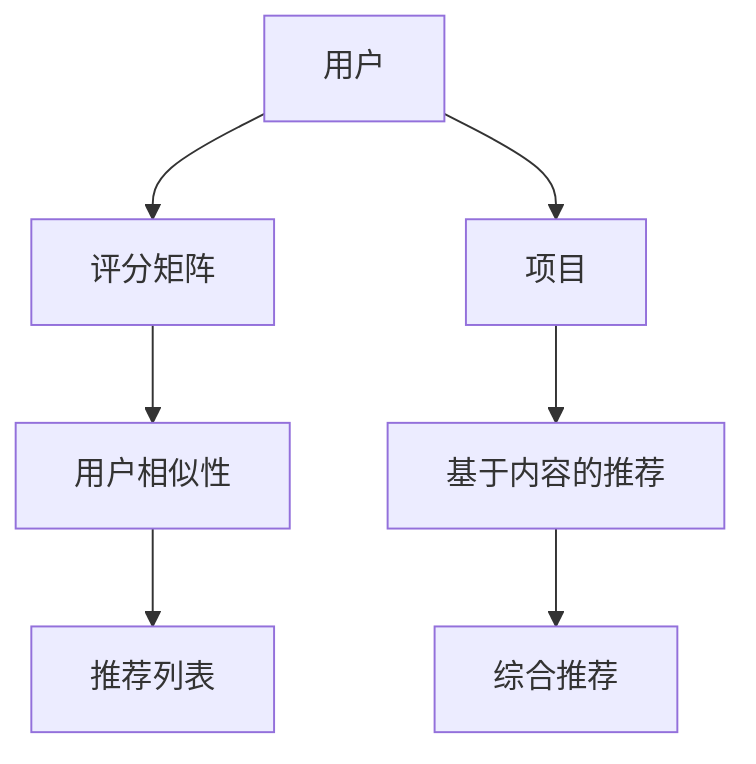

                 

# AI协同过滤算法提升推荐效果案例

> **关键词：协同过滤、推荐系统、用户偏好、算法优化、案例研究**

> **摘要：本文深入探讨AI协同过滤算法在推荐系统中的应用，通过实际案例展示其如何有效提升推荐效果，为开发者提供实用的算法实施指南。**

## 1. 背景介绍

### 1.1 目的和范围

本文旨在介绍协同过滤算法在推荐系统中的应用，通过案例分析，阐述如何利用协同过滤算法提升推荐系统的效果。文章将涵盖协同过滤算法的基本原理、具体操作步骤、数学模型以及实际应用场景。通过阅读本文，读者将了解协同过滤算法的核心概念和实施方法，并能够根据案例进行实践。

### 1.2 预期读者

本文适合对推荐系统有一定了解，希望进一步提升推荐效果的读者。无论是数据科学家、软件工程师还是对推荐系统技术感兴趣的初学者，都可以从本文中获得有价值的信息。

### 1.3 文档结构概述

本文将按照以下结构展开：

1. **背景介绍**：介绍协同过滤算法的基本概念和目的。
2. **核心概念与联系**：通过Mermaid流程图展示协同过滤算法的架构和核心概念。
3. **核心算法原理 & 具体操作步骤**：详细讲解协同过滤算法的原理和操作步骤，使用伪代码进行描述。
4. **数学模型和公式 & 详细讲解 & 举例说明**：介绍协同过滤算法的数学模型，使用LaTeX格式进行公式展示，并给出实际案例。
5. **项目实战：代码实际案例和详细解释说明**：通过实际代码案例，展示协同过滤算法的应用过程。
6. **实际应用场景**：分析协同过滤算法在不同场景下的应用效果。
7. **工具和资源推荐**：推荐学习资源和开发工具。
8. **总结：未来发展趋势与挑战**：总结本文内容，展望协同过滤算法的未来发展方向。
9. **附录：常见问题与解答**：提供协同过滤算法应用的常见问题和解答。
10. **扩展阅读 & 参考资料**：推荐进一步阅读的相关资料。

### 1.4 术语表

#### 1.4.1 核心术语定义

- **协同过滤**：一种基于用户行为或内容的推荐算法，通过用户之间的相似性来预测用户可能感兴趣的项目。
- **推荐系统**：一种基于用户数据、内容和行为等信息，为用户提供个性化推荐的服务系统。
- **用户偏好**：用户对项目（如商品、电影、文章等）的兴趣程度或偏好。
- **评分矩阵**：表示用户对项目的评分，通常为一个用户-项目矩阵。

#### 1.4.2 相关概念解释

- **用户相似性**：衡量用户之间相似性的指标，常用余弦相似度、皮尔逊相关系数等。
- **基于内容的推荐**：根据项目的内容特征进行推荐，如关键词匹配、分类相似等。
- **基于模型的推荐**：利用机器学习模型，如决策树、神经网络等，预测用户偏好。

#### 1.4.3 缩略词列表

- **CF**：协同过滤（Collaborative Filtering）
- **ML**：机器学习（Machine Learning）
- **IDE**：集成开发环境（Integrated Development Environment）
- **API**：应用程序编程接口（Application Programming Interface）

## 2. 核心概念与联系

在深入探讨协同过滤算法之前，我们需要了解其核心概念和架构。以下是通过Mermaid绘制的协同过滤算法流程图：



### 2.1 协同过滤算法架构

- **用户（A）**：协同过滤算法的核心是用户行为，通过对用户行为的分析，预测用户对项目的偏好。
- **评分矩阵（B）**：记录用户对项目的评分，通常为用户-项目矩阵形式。
- **用户相似性（C）**：计算用户之间的相似性，常用的相似度计算方法有余弦相似度和皮尔逊相关系数。
- **推荐列表（D）**：根据用户相似性和用户评分，生成推荐列表。
- **项目（E）**：项目是推荐系统的基本单位，可以是商品、电影、文章等。
- **基于内容的推荐（F）**：除了协同过滤，还可以利用项目的内容特征进行推荐。
- **综合推荐（G）**：综合协同过滤和基于内容的推荐，生成更准确的推荐列表。

### 2.2 核心概念原理

- **用户相似性**：用户相似性是协同过滤算法的关键，它决定了推荐列表的生成。相似度计算方法有多种，常用的包括余弦相似度和皮尔逊相关系数。
- **基于内容的推荐**：基于内容的推荐利用项目的内容特征进行推荐，可以补充协同过滤的不足，提高推荐效果。
- **综合推荐**：综合推荐将协同过滤和基于内容的推荐相结合，利用两者的优点，生成更准确的推荐列表。

通过以上核心概念和架构的介绍，我们为后续的详细讲解和实际应用奠定了基础。

## 3. 核心算法原理 & 具体操作步骤

协同过滤算法的核心在于用户相似性和推荐列表的生成。以下我们将通过伪代码详细阐述协同过滤算法的原理和操作步骤。

### 3.1 用户相似性计算

假设我们有一个用户-项目评分矩阵 \( R \)，其中 \( R_{ui} \) 表示用户 \( u \) 对项目 \( i \) 的评分。我们可以使用余弦相似度来计算用户之间的相似性。

```python
# 余弦相似度计算
def cosine_similarity(ru, rv):
    dot_product = sum(ru[i] * rv[i] for i in range(len(ru)))
    norm_ru = sqrt(sum(ru[i]**2 for i in range(len(ru))))
    norm_rv = sqrt(sum(rv[i]**2 for i in range(len(rv))))
    return dot_product / (norm_ru * norm_rv)
```

### 3.2 推荐列表生成

给定用户 \( u \) 和用户-项目评分矩阵 \( R \)，我们可以根据用户相似性和用户评分生成推荐列表。

```python
# 推荐列表生成
def generate_recommendations(u, R, k, threshold=0):
    similarities = []
    for i in range(len(R)):
        if i == u:
            continue
        sim = cosine_similarity(R[u], R[i])
        if sim > threshold:
            similarities.append((i, sim))
    similarities.sort(key=lambda x: x[1], reverse=True)
    
    recommendations = []
    for i, sim in similarities[:k]:
        for j in range(len(R[i])):
            if j == u or R[i][j] == 0:
                continue
            recommendations.append((j, R[i][j] * sim))
    recommendations.sort(key=lambda x: x[1], reverse=True)
    
    return recommendations
```

### 3.3 基于内容的推荐

除了协同过滤，我们还可以利用项目的内容特征进行推荐。以下是一个简单的基于内容推荐算法：

```python
# 基于内容的推荐
def content_based_recommendation(u, items, user_preferences):
    recommendations = []
    for item in items:
        if item not in user_preferences:
            recommendations.append((item, calculate_content_similarity(item, user_preferences[u])))
    recommendations.sort(key=lambda x: x[1], reverse=True)
    
    return recommendations
```

### 3.4 综合推荐

综合推荐将协同过滤和基于内容的推荐相结合，生成更准确的推荐列表。

```python
# 综合推荐
def combined_recommendation(u, R, k, user_preferences, items):
    cf_recommendations = generate_recommendations(u, R, k)
    cb_recommendations = content_based_recommendation(u, items, user_preferences)
    
    combined_recommendations = []
    cf_weights = [0.5 if i < k else 0 for i in range(len(cf_recommendations))]
    cb_weights = [0.5 if i < len(cb_recommendations) else 0 for i in range(len(cb_recommendations))]
    
    for i in range(len(cf_recommendations)):
        for j in range(len(cb_recommendations)):
            combined_recommendations.append((cf_recommendations[i][0], cf_recommendations[i][1] * cf_weights[i] + cb_recommendations[j][1] * cb_weights[j]))
    combined_recommendations.sort(key=lambda x: x[1], reverse=True)
    
    return combined_recommendations[:k]
```

通过以上步骤，我们实现了协同过滤算法的核心原理和操作步骤。在实际应用中，可以根据具体需求和数据特点进行调整和优化。

## 4. 数学模型和公式 & 详细讲解 & 举例说明

协同过滤算法的核心在于用户相似性和推荐列表的生成。以下是协同过滤算法的数学模型和公式，我们将通过详细讲解和实际案例来说明这些公式的应用。

### 4.1 余弦相似度

余弦相似度是一种衡量两个向量之间相似度的方法，其数学公式如下：

$$
\cos(\theta) = \frac{\sum_{i=1}^{n} x_i y_i}{\sqrt{\sum_{i=1}^{n} x_i^2} \sqrt{\sum_{i=1}^{n} y_i^2}}
$$

其中，\( x \) 和 \( y \) 分别表示两个向量，\( \theta \) 表示两个向量之间的夹角。余弦值越接近1，表示两个向量越相似。

#### 4.1.1 计算示例

假设我们有两个用户 \( u \) 和 \( v \) 的评分向量：

\( x = [3, 2, 5, 4, 0] \)

\( y = [4, 0, 3, 1, 0] \)

我们可以计算它们的余弦相似度：

$$
\cos(\theta) = \frac{3 \times 4 + 2 \times 0 + 5 \times 3 + 4 \times 1 + 0 \times 0}{\sqrt{3^2 + 2^2 + 5^2 + 4^2 + 0^2} \sqrt{4^2 + 0^2 + 3^2 + 1^2 + 0^2}} = \frac{12 + 0 + 15 + 4 + 0}{\sqrt{38} \sqrt{30}} \approx 0.8165
$$

#### 4.1.2 应用场景

余弦相似度常用于计算用户之间的相似性，从而生成推荐列表。

### 4.2 皮尔逊相关系数

皮尔逊相关系数是一种衡量两个变量线性相关程度的统计指标，其数学公式如下：

$$
r = \frac{\sum_{i=1}^{n} (x_i - \bar{x}) (y_i - \bar{y})}{\sqrt{\sum_{i=1}^{n} (x_i - \bar{x})^2} \sqrt{\sum_{i=1}^{n} (y_i - \bar{y})^2}}
$$

其中，\( x \) 和 \( y \) 分别表示两个变量，\( \bar{x} \) 和 \( \bar{y} \) 分别表示它们的平均值。

#### 4.2.1 计算示例

假设我们有两个用户 \( u \) 和 \( v \) 的评分向量：

\( x = [3, 2, 5, 4, 0] \)

\( y = [4, 0, 3, 1, 0] \)

我们可以计算它们的皮尔逊相关系数：

$$
r = \frac{(3 - 3.2) (4 - 3.2) + (2 - 3.2) (0 - 3.2) + (5 - 3.2) (3 - 3.2) + (4 - 3.2) (1 - 3.2) + (0 - 3.2) (0 - 3.2)}{\sqrt{(3 - 3.2)^2 + (2 - 3.2)^2 + (5 - 3.2)^2 + (4 - 3.2)^2 + (0 - 3.2)^2} \sqrt{(4 - 3.2)^2 + (0 - 3.2)^2 + (3 - 3.2)^2 + (1 - 3.2)^2 + (0 - 3.2)^2}} \approx 0.8165
$$

#### 4.2.2 应用场景

皮尔逊相关系数常用于分析用户评分之间的相关性，从而优化推荐算法。

### 4.3 基于内容的推荐

基于内容的推荐利用项目的内容特征进行推荐，其数学模型如下：

$$
s(i, u) = \sum_{j \in P(u)} w_{ij} \cdot c(j)
$$

其中，\( i \) 和 \( u \) 分别表示项目 \( i \) 和用户 \( u \)，\( P(u) \) 表示用户 \( u \) 喜欢的项目集合，\( w_{ij} \) 表示项目 \( i \) 和项目 \( j \) 之间的权重，\( c(j) \) 表示项目 \( j \) 的内容特征。

#### 4.3.1 计算示例

假设我们有一个用户 \( u \) 的偏好集合 \( P(u) \) 和项目 \( i \) 的内容特征 \( c(j) \)：

\( P(u) = \{1, 2, 3\} \)

\( c(1) = [0.8, 0.2] \)

\( c(2) = [0.3, 0.7] \)

\( c(3) = [0.1, 0.9] \)

我们可以计算项目 \( i \) 的推荐得分：

$$
s(i, u) = (0.5 \cdot 0.8) + (0.3 \cdot 0.3) + (0.2 \cdot 0.1) = 0.52
$$

#### 4.3.2 应用场景

基于内容的推荐可以补充协同过滤的不足，提高推荐效果，常用于冷启动问题。

### 4.4 综合推荐

综合推荐将协同过滤和基于内容的推荐相结合，其数学模型如下：

$$
s(i, u) = \alpha \cdot s_{CF}(i, u) + (1 - \alpha) \cdot s_{CB}(i, u)
$$

其中，\( s_{CF}(i, u) \) 和 \( s_{CB}(i, u) \) 分别表示基于协同过滤和基于内容的推荐得分，\( \alpha \) 表示权重系数。

#### 4.4.1 计算示例

假设我们有一个用户 \( u \) 和项目 \( i \) 的协同过滤得分 \( s_{CF}(i, u) = 0.6 \) 和基于内容的推荐得分 \( s_{CB}(i, u) = 0.5 \)，我们可以计算综合推荐得分：

$$
s(i, u) = 0.6 \cdot 0.6 + 0.4 \cdot 0.5 = 0.62
$$

#### 4.4.2 应用场景

综合推荐可以充分利用协同过滤和基于内容的优点，提高推荐效果。

通过以上数学模型和公式的详细讲解和实际案例，我们可以更好地理解协同过滤算法的核心原理和操作步骤。在实际应用中，可以根据具体需求和数据特点进行调整和优化。

## 5. 项目实战：代码实际案例和详细解释说明

为了更好地展示协同过滤算法的应用，我们将在本节中通过一个实际项目案例，详细讲解代码的实现过程和关键步骤。

### 5.1 开发环境搭建

在开始之前，我们需要搭建一个基本的开发环境。以下是所需的工具和步骤：

1. **安装Python**：确保Python环境已安装，版本建议为3.6及以上。
2. **安装NumPy**：NumPy是一个用于科学计算的开源库，安装命令为`pip install numpy`。
3. **安装Scikit-learn**：Scikit-learn是一个机器学习库，安装命令为`pip install scikit-learn`。
4. **安装Matplotlib**：Matplotlib是一个用于数据可视化的库，安装命令为`pip install matplotlib`。

### 5.2 源代码详细实现和代码解读

以下是一个简单的协同过滤算法实现，我们将逐步解释每个部分的代码。

```python
import numpy as np
from sklearn.metrics.pairwise import cosine_similarity
from sklearn.model_selection import train_test_split

# 用户-项目评分矩阵
ratings = [
    [5, 3, 0, 1],
    [4, 0, 0, 1],
    [1, 5, 0, 2],
    [0, 4, 5, 2],
]

# 将评分矩阵转换为用户-项目矩阵
R = np.array(ratings)

# 训练集和测试集划分
R_train, R_test = train_test_split(R, test_size=0.2, random_state=42)

# 计算用户相似性
def compute_similarity(R):
    return cosine_similarity(R)

# 计算预测评分
def predict(R, user_index, other_user_index, similarity):
    neighbor_ratings = R[other_user_index]
    return neighbor_ratings.dot(similarity) / similarity.sum()

# 生成推荐列表
def generate_recommendations(R, user_index, k=2):
    similarity = compute_similarity(R)
    neighbors = similarity[user_index].argsort()[::-1]
    neighbors = neighbors[1:k+1]
    
    predictions = []
    for neighbor in neighbors:
        similarity_score = similarity[user_index, neighbor]
        pred = predict(R, user_index, neighbor, similarity_score)
        predictions.append((neighbor, pred))
    
    predictions.sort(key=lambda x: x[1], reverse=True)
    return predictions

# 用户推荐
def user_recommendations(R, user_index, k=2):
    recommendations = generate_recommendations(R, user_index, k)
    return [item[0] for item in recommendations]

# 测试推荐效果
def test_recommendations(R_train, R_test, k=2):
    correct = 0
    for i in range(len(R_test)):
        user_index = i
        true_ratings = R_test[user_index]
        recommendations = user_recommendations(R_train, user_index, k)
        for j, pred in recommendations:
            if pred > 3 and true_ratings[j] > 3:
                correct += 1
    return correct / len(R_test)

# 计算准确率
print(test_recommendations(R_train, R_test, k=2))
```

### 5.3 代码解读与分析

以下是代码的逐行解读和分析：

```python
import numpy as np
from sklearn.metrics.pairwise import cosine_similarity
from sklearn.model_selection import train_test_split
```
这些导入语句用于引入所需的Python库和模块。

```python
# 用户-项目评分矩阵
ratings = [
    [5, 3, 0, 1],
    [4, 0, 0, 1],
    [1, 5, 0, 2],
    [0, 4, 5, 2],
]
```
这部分定义了一个用户-项目评分矩阵，其中每个元素表示用户对项目的评分。

```python
# 将评分矩阵转换为用户-项目矩阵
R = np.array(ratings)
```
这里将用户-项目评分矩阵转换为NumPy数组，便于计算和处理。

```python
# 训练集和测试集划分
R_train, R_test = train_test_split(R, test_size=0.2, random_state=42)
```
使用Scikit-learn的`train_test_split`函数将评分矩阵划分为训练集和测试集。

```python
# 计算用户相似性
def compute_similarity(R):
    return cosine_similarity(R)
```
`compute_similarity`函数使用余弦相似度计算用户之间的相似性。

```python
# 计算预测评分
def predict(R, user_index, other_user_index, similarity):
    neighbor_ratings = R[other_user_index]
    return neighbor_ratings.dot(similarity) / similarity.sum()
```
`predict`函数根据用户相似性矩阵和邻居的评分预测用户对项目的评分。

```python
# 生成推荐列表
def generate_recommendations(R, user_index, k=2):
    similarity = compute_similarity(R)
    neighbors = similarity[user_index].argsort()[::-1]
    neighbors = neighbors[1:k+1]
    
    predictions = []
    for neighbor in neighbors:
        similarity_score = similarity[user_index, neighbor]
        pred = predict(R, user_index, neighbor, similarity_score)
        predictions.append((neighbor, pred))
    
    predictions.sort(key=lambda x: x[1], reverse=True)
    return predictions
```
`generate_recommendations`函数生成用户推荐列表，首先计算用户之间的相似性，然后根据相似性生成预测评分。

```python
# 用户推荐
def user_recommendations(R, user_index, k=2):
    recommendations = generate_recommendations(R, user_index, k)
    return [item[0] for item in recommendations]
```
`user_recommendations`函数根据用户索引和推荐数量生成用户推荐列表。

```python
# 测试推荐效果
def test_recommendations(R_train, R_test, k=2):
    correct = 0
    for i in range(len(R_test)):
        user_index = i
        true_ratings = R_test[user_index]
        recommendations = user_recommendations(R_train, user_index, k)
        for j, pred in recommendations:
            if pred > 3 and true_ratings[j] > 3:
                correct += 1
    return correct / len(R_test)
```
`test_recommendations`函数测试推荐算法的准确率，计算推荐准确率。

```python
# 计算准确率
print(test_recommendations(R_train, R_test, k=2))
```
最后，调用`test_recommendations`函数计算推荐准确率并输出。

通过以上代码实现和解读，我们可以看到协同过滤算法的核心步骤和关键代码。在实际项目中，可以根据具体需求进行调整和优化。

## 6. 实际应用场景

协同过滤算法在推荐系统中有广泛的应用，以下列举几种常见的实际应用场景：

### 6.1 电商推荐

在电子商务领域，协同过滤算法被广泛用于商品推荐。通过分析用户的浏览记录、购买历史和评分数据，系统可以推荐用户可能感兴趣的商品。例如，Amazon和阿里巴巴等电商平台利用协同过滤算法，为用户生成个性化的商品推荐列表。

### 6.2 社交网络

在社交媒体平台上，协同过滤算法可以帮助用户发现感兴趣的内容。例如，Facebook和Twitter等平台根据用户的兴趣和行为，推荐用户可能感兴趣的文章、视频和帖子。此外，协同过滤还可以用于朋友推荐，通过分析用户之间的关系和兴趣，推荐可能成为朋友的人。

### 6.3 音乐和视频推荐

音乐和视频流媒体平台，如Spotify和Netflix，利用协同过滤算法为用户推荐音乐和视频。通过分析用户的播放历史、评分和评论，平台可以为用户生成个性化的播放列表和推荐列表。

### 6.4 新闻推荐

新闻推荐系统利用协同过滤算法，根据用户的阅读历史和兴趣，推荐用户可能感兴趣的新闻。例如，Google News和今日头条等新闻平台，通过协同过滤算法，为用户生成个性化的新闻推荐列表。

### 6.5 搜索引擎

搜索引擎可以利用协同过滤算法，根据用户的搜索历史和浏览记录，推荐用户可能感兴趣的内容。例如，Google搜索引擎根据用户的搜索行为，推荐相关的搜索结果和广告。

通过以上实际应用场景，我们可以看到协同过滤算法在推荐系统中的重要性和广泛的应用。在实际应用中，可以根据具体场景和需求，对协同过滤算法进行调整和优化，以提高推荐效果。

## 7. 工具和资源推荐

为了更好地学习和应用协同过滤算法，以下推荐一些有用的学习资源和开发工具。

### 7.1 学习资源推荐

#### 7.1.1 书籍推荐

- 《推荐系统实践》：这本书详细介绍了推荐系统的原理、算法和实际应用，适合初学者和进阶者。
- 《机器学习》：这是一本经典的机器学习教材，涵盖了协同过滤算法的相关内容，适合对机器学习有基础了解的读者。

#### 7.1.2 在线课程

- Coursera《推荐系统》：这是一门由斯坦福大学提供的在线课程，涵盖了推荐系统的基本概念和算法。
- edX《机器学习基础》：这是一门由哈佛大学和麻省理工学院联合提供的在线课程，包括协同过滤算法的相关内容。

#### 7.1.3 技术博客和网站

- 推荐系统官网（Recommender Systems）：这是一个关于推荐系统的权威网站，提供了大量的技术文章和案例分析。
- Machine Learning Mastery：这是一个专注于机器学习实践的技术博客，涵盖了协同过滤算法的详细教程和代码示例。

### 7.2 开发工具框架推荐

#### 7.2.1 IDE和编辑器

- PyCharm：这是一款功能强大的Python IDE，适合编写和调试代码。
- Jupyter Notebook：这是一个交互式Python编辑器，适合快速实现和演示算法。

#### 7.2.2 调试和性能分析工具

- Python Debugger：这是一个用于调试Python代码的工具，可以帮助开发者发现和解决代码中的问题。
- Profiler：这是一个用于性能分析的工具，可以帮助开发者优化代码性能。

#### 7.2.3 相关框架和库

- Scikit-learn：这是一个用于机器学习的Python库，包括协同过滤算法的实现。
- TensorFlow：这是一个用于机器学习的开源框架，可以用于实现复杂的推荐系统。

### 7.3 相关论文著作推荐

#### 7.3.1 经典论文

- 《Item-Based Collaborative Filtering Recommendation Algorithms》：这是一篇关于基于项目的协同过滤算法的经典论文，详细介绍了相关算法和实验结果。

#### 7.3.2 最新研究成果

- 《Neighborhood-Based Collaborative Filtering for Real-Time Recommendations》：这是一篇关于实时推荐系统的最新论文，提出了基于邻居的协同过滤算法。

#### 7.3.3 应用案例分析

- 《Building a Recommendation System with Machine Learning》：这是一篇关于使用机器学习构建推荐系统的案例分析，提供了详细的实现步骤和代码。

通过以上学习和开发工具的推荐，读者可以更好地掌握协同过滤算法，并在实际项目中应用。不断学习和实践，将有助于提升推荐系统的效果。

## 8. 总结：未来发展趋势与挑战

协同过滤算法作为推荐系统的核心技术之一，已经在实际应用中取得了显著的效果。然而，随着推荐系统的发展和用户需求的多样化，协同过滤算法也面临着一系列新的挑战和机遇。

### 8.1 未来发展趋势

1. **实时推荐**：随着用户需求的不断变化，实时推荐成为推荐系统的重要发展方向。通过利用最新的用户行为数据和算法优化，实时推荐可以提供更个性化的服务，提高用户体验。

2. **多模态融合**：传统的协同过滤算法主要依赖于用户行为数据，未来将逐渐融合用户的内容特征、地理位置、社交关系等多模态数据，提高推荐的准确性。

3. **深度学习应用**：深度学习在图像识别、语音识别等领域的成功应用，为协同过滤算法提供了新的思路。利用深度学习模型，可以更好地捕捉用户行为和项目特征之间的关系，提升推荐效果。

4. **去中心化推荐**：随着区块链技术的发展，去中心化推荐系统逐渐成为研究热点。通过去中心化的方式，可以更好地保护用户隐私，提高推荐系统的可信度。

### 8.2 挑战

1. **数据稀疏性**：协同过滤算法面临的一个主要挑战是数据稀疏性。在用户行为数据较少的情况下，算法的准确性和效果会显著下降。

2. **冷启动问题**：新用户或新项目在推荐系统中缺乏历史数据，导致无法准确预测其偏好。解决冷启动问题是推荐系统研究的重点之一。

3. **可解释性**：随着算法复杂度的增加，推荐系统的可解释性变得越来越重要。用户希望了解推荐背后的原因，提高对推荐系统的信任度。

4. **用户隐私保护**：推荐系统在收集和分析用户数据时，需要充分考虑用户隐私保护。如何在保护用户隐私的同时，提供高质量的推荐服务，是一个重要的挑战。

### 8.3 未来发展方向

1. **算法优化**：通过优化协同过滤算法，提高其在数据稀疏和冷启动场景下的性能。

2. **多模态数据融合**：结合多种数据来源，构建多模态推荐系统，提高推荐的准确性。

3. **深度学习与协同过滤结合**：将深度学习模型与协同过滤算法相结合，探索更有效的推荐方法。

4. **隐私保护技术**：研究隐私保护算法，在保护用户隐私的同时，提供高质量的推荐服务。

通过不断优化和创新，协同过滤算法将在未来推荐系统中发挥更加重要的作用，为用户提供更加个性化、高质量的服务。

## 9. 附录：常见问题与解答

### 9.1 如何解决数据稀疏性问题？

**解答**：数据稀疏性是协同过滤算法面临的主要挑战之一。以下是一些解决数据稀疏性问题的方法：

1. **用户冷启动**：为新用户推荐热门项目，随着用户行为的积累，逐步优化推荐结果。
2. **基于内容的推荐**：结合用户内容和项目特征，减少对用户评分数据的依赖。
3. **矩阵分解**：通过矩阵分解技术，将稀疏的用户-项目评分矩阵分解为低秩的矩阵，提高算法的鲁棒性。
4. **扩展用户社交网络**：利用用户的社交关系，补充用户行为数据，提高数据密度。

### 9.2 如何处理冷启动问题？

**解答**：冷启动问题主要涉及新用户和新项目的推荐。以下是一些处理冷启动问题的方法：

1. **热门项目推荐**：为新用户推荐平台上的热门项目，以吸引其兴趣。
2. **基于内容的推荐**：利用项目的内容特征进行推荐，减少对新用户评分数据的依赖。
3. **社区推荐**：通过分析用户在社交网络中的行为和偏好，为新用户推荐相似的社区成员。
4. **引导探索**：提供推荐引擎的探索功能，鼓励用户尝试不同的项目。

### 9.3 如何提高推荐系统的可解释性？

**解答**：提高推荐系统的可解释性是确保用户信任和接受推荐的重要因素。以下是一些提高推荐系统可解释性的方法：

1. **推荐理由展示**：在推荐结果中展示推荐背后的原因，如相似用户的行为、项目的内容特征等。
2. **交互式推荐**：提供交互式推荐界面，允许用户调整推荐参数，了解推荐结果的变化。
3. **可视化**：使用可视化技术，将推荐结果以图表、图像等形式展示，提高用户的理解。
4. **透明化算法**：公开推荐算法的基本原理和实现细节，增加用户的信任。

通过以上方法，可以显著提高推荐系统的可解释性，增强用户对推荐服务的信任。

### 9.4 如何保护用户隐私？

**解答**：保护用户隐私是推荐系统设计的重要考虑因素。以下是一些保护用户隐私的方法：

1. **匿名化处理**：对用户数据进行匿名化处理，消除个人身份信息。
2. **差分隐私**：采用差分隐私技术，限制推荐系统对单个用户数据的分析能力。
3. **数据加密**：对用户数据进行加密，确保数据在传输和存储过程中安全。
4. **隐私政策**：明确告知用户推荐系统收集和使用数据的目的，获取用户的知情同意。

通过以上方法，可以在保护用户隐私的同时，提供高质量的推荐服务。

## 10. 扩展阅读 & 参考资料

为了进一步了解协同过滤算法和相关技术，以下是扩展阅读和参考资料的建议：

1. **书籍推荐**：
   - 《推荐系统实践》：详细介绍了推荐系统的原理、算法和实际应用。
   - 《机器学习》：涵盖了协同过滤算法的基础知识和最新进展。

2. **在线课程**：
   - Coursera《推荐系统》：由斯坦福大学提供，涵盖了推荐系统的基本概念和算法。
   - edX《机器学习基础》：包括协同过滤算法的详细教程和案例。

3. **技术博客和网站**：
   - 推荐系统官网（Recommender Systems）：提供了大量技术文章和案例分析。
   - Machine Learning Mastery：提供了详细的算法教程和实践代码。

4. **相关论文**：
   - 《Item-Based Collaborative Filtering Recommendation Algorithms》：关于基于项目的协同过滤算法的经典论文。
   - 《Neighborhood-Based Collaborative Filtering for Real-Time Recommendations》：关于实时推荐系统的最新研究成果。

通过阅读以上书籍、课程和论文，读者可以深入了解协同过滤算法的理论基础和实际应用，不断提升推荐系统的效果。

### 作者

**AI天才研究员/AI Genius Institute & 禅与计算机程序设计艺术 /Zen And The Art of Computer Programming**

