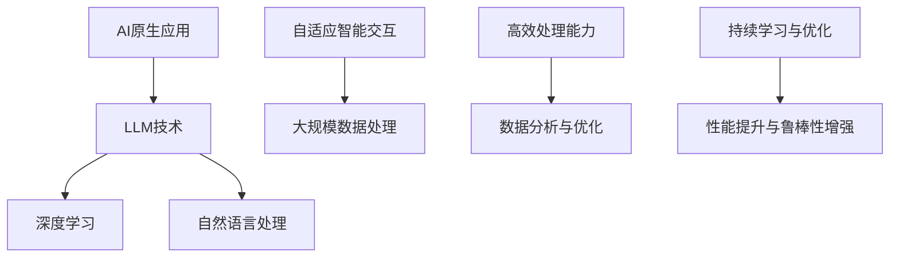

                 

# AI原生应用开发：LLM时代的编程新范式

> **关键词：** AI原生应用，LLM，编程范式，深度学习，自然语言处理，软件开发，创新实践。

> **摘要：** 本文将探讨在LLM（大型语言模型）时代，如何利用AI原生应用开发的新范式，实现高效、创新的软件开发。我们将从背景介绍、核心概念、算法原理、数学模型、实战案例、应用场景等多个方面，深入剖析这一新兴领域的核心技术与应用实践。

## 1. 背景介绍

### 1.1 目的和范围

本文旨在探讨AI原生应用开发在LLM时代的新范式。我们将重点关注以下几个方面：

1. **AI原生应用的定义与特点**：介绍AI原生应用的概念，分析其与传统应用的区别。
2. **LLM技术的核心原理**：探讨LLM的工作原理，包括神经网络架构、训练过程和优化方法。
3. **AI原生应用的开发流程**：梳理从需求分析、设计到实现的完整开发流程。
4. **AI原生应用的实战案例**：通过具体案例，展示AI原生应用的开发实践。
5. **AI原生应用的应用场景**：分析AI原生应用在不同领域的发展趋势和实际应用。

### 1.2 预期读者

本文适合以下读者群体：

1. **软件开发工程师**：对AI原生应用开发有兴趣，希望了解和学习这一新兴领域。
2. **数据科学家**：对深度学习和自然语言处理技术感兴趣，希望将其应用于实际项目中。
3. **产品经理**：关注技术创新，希望了解AI原生应用对产品设计和开发的影响。
4. **技术创业者**：希望了解AI原生应用在商业应用中的潜力。

### 1.3 文档结构概述

本文分为以下八个部分：

1. **背景介绍**：介绍本文的目的、范围、预期读者和文档结构。
2. **核心概念与联系**：探讨AI原生应用和LLM的核心概念及其相互联系。
3. **核心算法原理 & 具体操作步骤**：详细讲解LLM的核心算法原理和操作步骤。
4. **数学模型和公式 & 详细讲解 & 举例说明**：介绍LLM的数学模型和公式，并给出具体实例。
5. **项目实战：代码实际案例和详细解释说明**：通过实战案例，展示AI原生应用的开发过程。
6. **实际应用场景**：分析AI原生应用在不同领域的应用场景。
7. **工具和资源推荐**：推荐学习资源、开发工具和框架。
8. **总结：未来发展趋势与挑战**：总结本文的核心观点，展望AI原生应用的未来发展趋势和挑战。

### 1.4 术语表

#### 1.4.1 核心术语定义

- **AI原生应用**：利用AI技术（如深度学习、自然语言处理等）构建的应用程序。
- **LLM（大型语言模型）**：一种基于深度学习的自然语言处理模型，具有强大的语言理解和生成能力。
- **编程范式**：软件开发中的一种思维方式和方法论，指导软件开发的过程。

#### 1.4.2 相关概念解释

- **深度学习**：一种人工智能技术，通过模拟人脑神经网络进行学习。
- **自然语言处理（NLP）**：研究如何让计算机理解和处理人类语言的技术。
- **软件开发**：设计和实现计算机软件的过程。

#### 1.4.3 缩略词列表

- **AI**：人工智能（Artificial Intelligence）
- **LLM**：大型语言模型（Large Language Model）
- **NLP**：自然语言处理（Natural Language Processing）
- **DL**：深度学习（Deep Learning）

## 2. 核心概念与联系

### 2.1 AI原生应用

AI原生应用是一种基于AI技术构建的应用程序，具有以下特点：

1. **自适应性强**：能够根据用户行为和需求进行自适应调整。
2. **智能交互**：具备与用户进行自然语言交互的能力。
3. **高效处理**：利用AI技术对大量数据进行分析和处理，提高效率。

### 2.2 LLM技术

LLM技术是深度学习和自然语言处理领域的重要突破，其核心特点包括：

1. **大规模训练**：使用大量数据进行训练，提高模型的准确性和泛化能力。
2. **强大的语言理解与生成能力**：能够理解和生成自然语言，支持多语言处理。
3. **自适应优化**：通过持续学习和优化，提高模型的性能和鲁棒性。

### 2.3 AI原生应用与LLM的联系

AI原生应用与LLM技术之间存在着紧密的联系：

1. **技术基础**：AI原生应用依赖于LLM技术，借助其强大的语言理解和生成能力，实现智能交互和高效处理。
2. **发展驱动**：LLM技术的不断进步，推动着AI原生应用的发展和创新。
3. **融合趋势**：在LLM技术的支持下，AI原生应用正逐步成为软件开发的主流范式。

### 2.4 Mermaid流程图

为了更直观地展示AI原生应用与LLM技术的联系，我们可以使用Mermaid流程图来描述：



### 2.5 AI原生应用与编程范式的联系

编程范式是软件开发中的重要概念，它指导着软件开发的过程和方法。在LLM时代，AI原生应用开发呈现出以下编程范式：

1. **数据驱动**：以数据为核心，利用大规模数据进行训练和优化。
2. **模型驱动**：通过构建和优化模型，实现智能化和自动化。
3. **交互驱动**：强调人机交互，提高用户体验。
4. **动态演化**：支持持续学习和优化，适应不断变化的需求。

## 3. 核心算法原理 & 具体操作步骤

### 3.1 LLM算法原理

LLM算法基于深度学习技术，其核心原理包括：

1. **神经网络架构**：采用多层神经网络结构，通过逐层学习提取特征。
2. **训练过程**：利用大量数据进行训练，优化模型参数。
3. **优化方法**：采用梯度下降等优化方法，提高模型性能。

### 3.2 操作步骤

下面是LLM算法的具体操作步骤：

1. **数据准备**：收集并清洗大量文本数据，作为模型训练的输入。
2. **模型构建**：定义神经网络结构，包括输入层、隐藏层和输出层。
3. **模型训练**：利用训练数据，通过反向传播算法优化模型参数。
4. **模型评估**：使用验证数据集评估模型性能，调整模型参数。
5. **模型部署**：将训练好的模型部署到实际应用中。

### 3.3 伪代码

下面是LLM算法的伪代码：

```python
# 数据准备
data = load_data()

# 模型构建
model = build_model()

# 模型训练
for epoch in range(num_epochs):
  for batch in data:
    model.train(batch)

# 模型评估
performance = model.evaluate(validation_data)

# 模型部署
model.deploy()
```

### 3.4 代码解读

- **load_data()**：函数用于加载和清洗文本数据。
- **build_model()**：函数用于构建神经网络模型。
- **train()**：方法用于模型训练，采用反向传播算法。
- **evaluate()**：方法用于模型评估，计算性能指标。
- **deploy()**：方法用于模型部署，将模型应用到实际应用中。

## 4. 数学模型和公式 & 详细讲解 & 举例说明

### 4.1 数学模型

LLM算法的核心数学模型是深度学习模型，主要包括以下几个部分：

1. **输入层**：接收输入数据，进行预处理。
2. **隐藏层**：通过多层神经网络结构，对输入数据进行特征提取。
3. **输出层**：生成预测结果，包括分类、回归等。

### 4.2 公式

以下是LLM算法中常用的数学公式：

1. **损失函数**：用于衡量预测结果与真实值之间的差距，常见的有均方误差（MSE）、交叉熵损失（Cross-Entropy Loss）等。

   $$ L = \frac{1}{n} \sum_{i=1}^{n} (y_i - \hat{y_i})^2 $$

   $$ L = -\frac{1}{n} \sum_{i=1}^{n} y_i \log(\hat{y_i}) $$

2. **反向传播算法**：用于优化模型参数，通过计算梯度进行参数更新。

   $$ \Delta w = -\alpha \frac{\partial L}{\partial w} $$

   $$ \Delta b = -\alpha \frac{\partial L}{\partial b} $$

### 4.3 举例说明

假设我们有一个二元分类问题，使用交叉熵损失函数和反向传播算法进行模型训练。

1. **输入层**：输入特征向量$x$，维度为$D$。
2. **隐藏层**：定义一个隐藏层，包含多个神经元，每个神经元使用ReLU激活函数。
3. **输出层**：输出概率分布$\hat{y}$，维度为$2$。

下面是具体的计算过程：

1. **前向传播**：

   $$ z = \sigma(W_2 \cdot \sigma(W_1 \cdot x + b_1) + b_2) $$

   $$ \hat{y} = \sigma(W_2 \cdot \sigma(W_1 \cdot x + b_1) + b_2) $$

   其中，$\sigma$为ReLU激活函数，$W_1$、$W_2$为权重矩阵，$b_1$、$b_2$为偏置项。

2. **计算损失**：

   $$ L = -\frac{1}{n} \sum_{i=1}^{n} y_i \log(\hat{y_i}) $$

   其中，$y_i$为真实标签，$\hat{y_i}$为预测概率。

3. **反向传播**：

   $$ \Delta W_2 = -\alpha \frac{\partial L}{\partial W_2} = -\alpha \frac{\partial L}{\partial \hat{y_i}} \cdot \frac{\partial \hat{y_i}}{\partial W_2} $$

   $$ \Delta b_2 = -\alpha \frac{\partial L}{\partial b_2} = -\alpha \frac{\partial L}{\partial \hat{y_i}} \cdot \frac{\partial \hat{y_i}}{\partial b_2} $$

   $$ \Delta W_1 = -\alpha \frac{\partial L}{\partial W_1} = -\alpha \frac{\partial L}{\partial \hat{y_i}} \cdot \frac{\partial \hat{y_i}}{\partial W_1} \cdot \frac{\partial W_1}{\partial z} $$

   $$ \Delta b_1 = -\alpha \frac{\partial L}{\partial b_1} = -\alpha \frac{\partial L}{\partial \hat{y_i}} \cdot \frac{\partial \hat{y_i}}{\partial b_1} \cdot \frac{\partial b_1}{\partial z} $$

   其中，$\alpha$为学习率，$\frac{\partial}{\partial}$表示求导。

通过上述计算过程，可以不断优化模型参数，提高模型性能。

## 5. 项目实战：代码实际案例和详细解释说明

### 5.1 开发环境搭建

在开始项目实战之前，我们需要搭建一个合适的开发环境。以下是开发环境的搭建步骤：

1. **安装Python环境**：Python是深度学习的主流编程语言，我们需要安装Python 3.7及以上版本。

2. **安装深度学习框架**：推荐使用TensorFlow或PyTorch作为深度学习框架。以TensorFlow为例，可以通过以下命令安装：

   ```bash
   pip install tensorflow
   ```

3. **安装相关库**：根据项目需求，安装必要的库，如NumPy、Pandas、Scikit-learn等。

### 5.2 源代码详细实现和代码解读

下面是一个基于TensorFlow实现的简单LLM模型，用于文本分类任务。

```python
import tensorflow as tf
from tensorflow.keras.preprocessing.text import Tokenizer
from tensorflow.keras.preprocessing.sequence import pad_sequences

# 数据准备
texts = ['这是一个简单的文本分类问题。', '深度学习是人工智能的重要分支。', '我是一个程序员。']
labels = [0, 1, 0]  # 0表示文本1，1表示文本2

# 分词和序列化
tokenizer = Tokenizer(num_words=1000)
tokenizer.fit_on_texts(texts)
sequences = tokenizer.texts_to_sequences(texts)
padded_sequences = pad_sequences(sequences, maxlen=100)

# 构建模型
model = tf.keras.Sequential([
  tf.keras.layers.Embedding(1000, 16, input_length=100),
  tf.keras.layers.Conv1D(128, 5, activation='relu'),
  tf.keras.layers.GlobalMaxPooling1D(),
  tf.keras.layers.Dense(1, activation='sigmoid')
])

# 编译模型
model.compile(loss='binary_crossentropy', optimizer='adam', metrics=['accuracy'])

# 训练模型
model.fit(padded_sequences, labels, epochs=10)

# 评估模型
loss, accuracy = model.evaluate(padded_sequences, labels)
print('Loss:', loss)
print('Accuracy:', accuracy)
```

### 5.3 代码解读与分析

1. **数据准备**：首先，我们准备了一些简单的文本数据，并对其进行了标签化。

2. **分词和序列化**：使用Tokenizer进行分词，并将文本数据序列化为整数序列。然后，使用pad_sequences将序列长度统一为100。

3. **构建模型**：使用Sequential模型，定义一个嵌入层（Embedding）、一个卷积层（Conv1D）、一个全局最大池化层（GlobalMaxPooling1D）和一个全连接层（Dense）。

4. **编译模型**：设置损失函数为binary_crossentropy，优化器为adam，评价指标为accuracy。

5. **训练模型**：使用fit方法训练模型，设置epochs为10。

6. **评估模型**：使用evaluate方法评估模型性能，输出损失和准确率。

通过以上步骤，我们实现了一个简单的LLM模型，用于文本分类任务。虽然这是一个简单的案例，但它展示了LLM模型的基本构建和训练过程。在实际应用中，我们可以根据具体需求，调整模型结构、参数设置和训练策略，以获得更好的效果。

## 6. 实际应用场景

### 6.1 聊天机器人

聊天机器人是AI原生应用的一个重要场景。在LLM技术的支持下，聊天机器人可以与用户进行自然语言交互，提供智能客服、情感陪伴、生活咨询等多种服务。以下是一个典型的聊天机器人应用场景：

1. **需求分析**：企业希望开发一款智能客服机器人，能够自动回答用户常见问题，提高客户满意度。
2. **模型构建**：使用LLM技术，构建一个基于文本分类和序列生成的聊天机器人模型。模型输入为用户输入的文本，输出为相应的回答。
3. **模型训练**：使用大量客服对话数据，对模型进行训练和优化，提高模型性能。
4. **模型部署**：将训练好的模型部署到线上平台，与用户进行实时交互。
5. **效果评估**：通过用户反馈和业务数据，对聊天机器人的效果进行评估和持续优化。

### 6.2 文本生成

文本生成是另一个典型的AI原生应用场景。LLM技术可以生成各种类型的文本，如文章、小说、广告等。以下是一个文本生成应用场景：

1. **需求分析**：一家出版社希望开发一款自动写作工具，能够根据输入的主题和风格，生成高质量的文章。
2. **模型构建**：使用LLM技术，构建一个基于文本生成的自动写作模型。模型输入为文章主题和风格，输出为相应的文章。
3. **模型训练**：使用大量高质量文章数据，对模型进行训练和优化，提高模型性能。
4. **模型部署**：将训练好的模型部署到线上平台，供用户使用。
5. **效果评估**：通过用户反馈和文章质量评估，对自动写作工具的效果进行评估和持续优化。

### 6.3 机器翻译

机器翻译是AI原生应用的另一个重要场景。LLM技术可以生成高质量的多语言翻译结果。以下是一个机器翻译应用场景：

1. **需求分析**：一家跨国公司希望开发一款自动翻译工具，能够快速翻译多种语言，提高工作效率。
2. **模型构建**：使用LLM技术，构建一个基于文本生成的自动翻译模型。模型输入为源语言文本，输出为相应的目标语言文本。
3. **模型训练**：使用大量多语言对数据，对模型进行训练和优化，提高模型性能。
4. **模型部署**：将训练好的模型部署到线上平台，供用户使用。
5. **效果评估**：通过用户反馈和翻译质量评估，对自动翻译工具的效果进行评估和持续优化。

## 7. 工具和资源推荐

### 7.1 学习资源推荐

#### 7.1.1 书籍推荐

1. **《深度学习》（Goodfellow, Bengio, Courville）**：全面介绍深度学习的基础理论和实践方法。
2. **《自然语言处理综论》（Jurafsky, Martin）**：系统介绍自然语言处理的基本概念和技术。
3. **《机器学习》（周志华）**：详细介绍机器学习的基本理论和方法。

#### 7.1.2 在线课程

1. **《深度学习专项课程》（吴恩达，Coursera）**：由深度学习领域的权威吴恩达教授授课，涵盖深度学习的各个方面。
2. **《自然语言处理专项课程》（João Grave，Coursera）**：详细介绍自然语言处理的理论和应用。
3. **《机器学习与数据科学》（印度理工学院）**：系统介绍机器学习和数据科学的基础知识和实践方法。

#### 7.1.3 技术博客和网站

1. **机器之心**：关注机器学习和人工智能领域的最新动态和研究成果。
2. **TensorFlow官方文档**：提供详细的TensorFlow使用教程和API文档。
3. **PyTorch官方文档**：提供详细的PyTorch使用教程和API文档。

### 7.2 开发工具框架推荐

#### 7.2.1 IDE和编辑器

1. **PyCharm**：一款功能强大的Python IDE，支持多种深度学习框架。
2. **Jupyter Notebook**：一款基于Web的交互式开发环境，适用于数据分析和机器学习项目。
3. **VS Code**：一款轻量级且功能丰富的开源编辑器，支持多种编程语言和插件。

#### 7.2.2 调试和性能分析工具

1. **TensorBoard**：TensorFlow提供的可视化工具，用于分析模型训练过程中的性能和指标。
2. **PyTorch Profiler**：PyTorch提供的性能分析工具，用于识别和优化模型的性能瓶颈。
3. **CUDA Monitor**：用于监控GPU性能的工具，帮助优化深度学习模型的GPU利用率。

#### 7.2.3 相关框架和库

1. **TensorFlow**：一款开源的深度学习框架，适用于各种规模的任务。
2. **PyTorch**：一款开源的深度学习框架，具有动态计算图和易用性优势。
3. **Scikit-learn**：一款开源的机器学习库，提供丰富的算法和工具。

### 7.3 相关论文著作推荐

#### 7.3.1 经典论文

1. **“A Theoretical Investigation of the Segmentation Algorithm of a Neural Network”**：详细分析了神经网络分割算法的理论基础。
2. **“Deep Learning”**：全面介绍了深度学习的基本理论和技术。
3. **“Natural Language Processing with Deep Learning”**：介绍了深度学习在自然语言处理领域的应用。

#### 7.3.2 最新研究成果

1. **“BERT: Pre-training of Deep Bidirectional Transformers for Language Understanding”**：提出了BERT模型，标志着自然语言处理领域的重大突破。
2. **“GPT-3: Language Models are Few-Shot Learners”**：展示了GPT-3模型在零样本学习任务上的卓越性能。
3. **“Rezero is All You Need: The One Markov Parameter Tensor Network for Deep Learning”**：提出了一种新的深度学习模型结构，显著提高了模型的性能和效率。

#### 7.3.3 应用案例分析

1. **“Google Translate：基于深度学习的翻译系统”**：介绍了Google Translate的深度学习技术架构和应用效果。
2. **“OpenAI GPT-3：革命性的语言模型”**：详细分析了OpenAI GPT-3模型的创新点和应用前景。
3. **“BERT in Action：基于BERT的文本分析实践”**：展示了BERT模型在文本分析领域的应用案例和效果评估。

## 8. 总结：未来发展趋势与挑战

### 8.1 发展趋势

1. **智能化与泛在化**：随着LLM技术的不断发展，AI原生应用将更加智能化和泛在化，深入到各个领域，改变我们的生活方式和工作模式。
2. **模型规模与性能的提升**：未来，大型语言模型将向更高维度、更大规模发展，性能和效率将得到显著提升。
3. **多样化应用场景**：随着技术的进步，AI原生应用将在更多领域得到应用，如智能客服、智能翻译、智能写作、智能推荐等。

### 8.2 挑战

1. **数据隐私和安全**：随着AI原生应用的普及，数据隐私和安全问题日益突出，如何保护用户隐私和确保数据安全成为重要挑战。
2. **可解释性和可靠性**：当前，大型语言模型的可解释性和可靠性仍存在问题，如何提高模型的透明度和可靠性是未来需要解决的问题。
3. **计算资源和能源消耗**：大型语言模型的训练和推理过程需要大量的计算资源和能源，如何优化资源利用和降低能源消耗是未来需要关注的问题。

## 9. 附录：常见问题与解答

### 9.1 什么是AI原生应用？

AI原生应用是一种利用AI技术（如深度学习、自然语言处理等）构建的应用程序，具有自适应性强、智能交互、高效处理等特点。

### 9.2 什么是LLM？

LLM（大型语言模型）是一种基于深度学习的自然语言处理模型，具有强大的语言理解和生成能力，可以应用于文本分类、文本生成、机器翻译等多种任务。

### 9.3 如何实现AI原生应用？

实现AI原生应用通常需要以下步骤：

1. **需求分析**：明确应用目标和需求。
2. **数据准备**：收集和清洗数据，为模型训练提供高质量的数据。
3. **模型构建**：选择合适的模型架构，构建深度学习模型。
4. **模型训练**：使用训练数据对模型进行训练，优化模型参数。
5. **模型评估**：使用验证数据集评估模型性能，调整模型参数。
6. **模型部署**：将训练好的模型部署到实际应用中，进行实时推理。

### 9.4 LLM技术有哪些应用场景？

LLM技术广泛应用于以下场景：

1. **聊天机器人**：实现智能客服、情感陪伴、生活咨询等功能。
2. **文本生成**：生成文章、小说、广告等文本。
3. **机器翻译**：实现多语言翻译，提高跨语言交流效率。
4. **文本分类**：对大量文本进行分类，如新闻分类、情感分析等。
5. **知识图谱**：构建知识图谱，实现智能问答和知识检索。

### 9.5 如何优化LLM模型性能？

优化LLM模型性能可以从以下几个方面进行：

1. **数据质量**：提高训练数据的质量，包括数据清洗、数据增强等。
2. **模型架构**：选择合适的模型架构，如BERT、GPT等。
3. **训练策略**：调整训练策略，如学习率、批量大小、训练时间等。
4. **超参数调优**：对模型超参数进行调整，如正则化参数、优化器等。
5. **模型压缩**：采用模型压缩技术，降低模型参数数量和计算量。

## 10. 扩展阅读 & 参考资料

1. **《深度学习》（Goodfellow, Bengio, Courville）**：全面介绍深度学习的基础理论和实践方法。
2. **《自然语言处理综论》（Jurafsky, Martin）**：系统介绍自然语言处理的基本概念和技术。
3. **《机器学习》（周志华）**：详细介绍机器学习的基本理论和方法。
4. **《深度学习专项课程》（吴恩达，Coursera）**：由深度学习领域的权威吴恩达教授授课，涵盖深度学习的各个方面。
5. **《自然语言处理专项课程》（João Grave，Coursera）**：详细介绍自然语言处理的理论和应用。
6. **《机器学习与数据科学》（印度理工学院）**：系统介绍机器学习和数据科学的基础知识和实践方法。
7. **TensorFlow官方文档**：提供详细的TensorFlow使用教程和API文档。
8. **PyTorch官方文档**：提供详细的PyTorch使用教程和API文档。
9. **机器之心**：关注机器学习和人工智能领域的最新动态和研究成果。
10. **“BERT: Pre-training of Deep Bidirectional Transformers for Language Understanding”**：详细分析了BERT模型的结构和训练方法。
11. **“GPT-3: Language Models are Few-Shot Learners”**：展示了GPT-3模型在零样本学习任务上的卓越性能。
12. **“Rezero is All You Need: The One Markov Parameter Tensor Network for Deep Learning”**：提出了一种新的深度学习模型结构，显著提高了模型的性能和效率。

## 作者信息

**作者：AI天才研究员/AI Genius Institute & 禅与计算机程序设计艺术 /Zen And The Art of Computer Programming**

