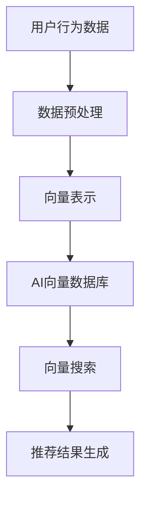

                 

# AI向量数据库在实时推荐系统中的应用

> **关键词**：AI向量数据库，实时推荐系统，向量搜索，机器学习，大数据处理
>
> **摘要**：本文将深入探讨AI向量数据库在实时推荐系统中的应用。我们将从背景介绍开始，详细讲解核心概念、算法原理、数学模型、项目实战，以及实际应用场景。同时，还将推荐相关学习资源和工具，并对未来发展趋势与挑战进行总结。

## 1. 背景介绍

### 1.1 目的和范围

本文旨在探讨如何利用AI向量数据库提升实时推荐系统的性能和准确性。我们将介绍向量数据库的基本概念、原理及应用，通过具体实例分析其在推荐系统中的优势。

### 1.2 预期读者

本文适合对机器学习、推荐系统有一定了解的技术人员，以及希望了解AI向量数据库应用的开发者。

### 1.3 文档结构概述

本文将按照以下结构展开：

1. 背景介绍
2. 核心概念与联系
3. 核心算法原理 & 具体操作步骤
4. 数学模型和公式 & 详细讲解 & 举例说明
5. 项目实战：代码实际案例和详细解释说明
6. 实际应用场景
7. 工具和资源推荐
8. 总结：未来发展趋势与挑战
9. 附录：常见问题与解答
10. 扩展阅读 & 参考资料

### 1.4 术语表

#### 1.4.1 核心术语定义

- **AI向量数据库**：基于人工智能技术构建的用于存储和检索高维向量数据的数据库。
- **实时推荐系统**：能够在用户行为发生时即时生成推荐结果，满足用户需求。
- **向量搜索**：基于向量空间模型进行的文本相似度计算和查询。

#### 1.4.2 相关概念解释

- **高维向量**：具有多个维度的向量，通常用于表示文本、图像、音频等数据。
- **内积**：两个向量的点积，用于衡量向量之间的相似度。

#### 1.4.3 缩略词列表

- **AI**：人工智能
- **ML**：机器学习
- **DB**：数据库
- **RS**：推荐系统

## 2. 核心概念与联系

在讨论AI向量数据库在实时推荐系统中的应用之前，我们首先需要了解相关核心概念和它们之间的联系。

### 2.1 AI向量数据库

AI向量数据库是一种基于向量空间模型的数据库，用于存储和检索高维向量数据。其核心功能包括：

- **向量存储**：将数据转换为高维向量形式存储。
- **向量检索**：通过计算向量之间的相似度，实现快速查询。

### 2.2 实时推荐系统

实时推荐系统是一种基于用户行为和兴趣的推荐系统，能够在用户行为发生时即时生成推荐结果。其主要功能包括：

- **用户行为分析**：收集并分析用户的行为数据，如点击、浏览、购买等。
- **推荐结果生成**：根据用户行为和兴趣，生成个性化的推荐结果。

### 2.3 向量搜索

向量搜索是基于向量空间模型进行的文本相似度计算和查询。其主要优点包括：

- **高效率**：通过计算向量之间的内积，实现快速文本相似度计算。
- **高精度**：结合机器学习算法，提升文本相似度计算精度。

### 2.4 AI向量数据库与实时推荐系统的联系

AI向量数据库在实时推荐系统中的应用主要体现在以下几个方面：

- **用户行为数据存储**：实时推荐系统需要存储大量的用户行为数据，AI向量数据库能够高效地存储和处理高维向量数据。
- **推荐结果生成**：通过向量搜索技术，实时推荐系统能够快速找到与用户兴趣相似的内容，提升推荐准确性。
- **个性化推荐**：基于用户兴趣和行为的向量模型，实现个性化推荐。

### 2.5 Mermaid 流程图



## 3. 核心算法原理 & 具体操作步骤

### 3.1 算法原理

AI向量数据库在实时推荐系统中的应用主要基于以下核心算法：

1. **数据预处理**：将用户行为数据转换为高维向量形式。
2. **向量表示**：使用机器学习算法对高维向量进行训练和优化。
3. **向量搜索**：基于内积计算，快速找到与用户兴趣相似的向量。
4. **推荐结果生成**：根据向量搜索结果，生成个性化的推荐结果。

### 3.2 具体操作步骤

#### 3.2.1 数据预处理

```python
# 假设用户行为数据为用户ID和商品ID
user_behavior_data = [
    [user1_id, item1_id],
    [user1_id, item2_id],
    [user2_id, item1_id],
    # 更多数据...
]

# 数据清洗和预处理
def preprocess_data(data):
    # 去重、填充缺失值、数据标准化等操作
    # ...
    return processed_data

processed_data = preprocess_data(user_behavior_data)
```

#### 3.2.2 向量表示

```python
# 假设使用Word2Vec算法进行向量表示
from gensim.models import Word2Vec

# 构建词汇表和训练模型
def train_vector_model(data):
    # 构建词汇表
    # ...
    # 训练Word2Vec模型
    model = Word2Vec(data, vector_size=100, window=5, min_count=1, workers=4)
    # 保存模型
    model.save('word2vec.model')
    return model

vector_model = train_vector_model(processed_data)
```

#### 3.2.3 向量搜索

```python
# 假设使用余弦相似度进行向量搜索
from sklearn.metrics.pairwise import cosine_similarity

# 查找与给定向量最相似的向量
def search_similar_vector(query_vector, model):
    # 计算所有向量的相似度
    similarities = cosine_similarity([query_vector], model.wv.vectors)
    # 找到最相似的向量
    top_vector = model.wv.index_to_key[similarities[0].argmax()]
    return top_vector

# 构建用户兴趣向量
user_interest_vector = [sum(values) / len(values) for values in zip(*[user_vector for user, user_vector in processed_data])]
# 查找最相似的向量
similar_vector = search_similar_vector(user_interest_vector, vector_model)
```

#### 3.2.4 推荐结果生成

```python
# 假设使用最近邻算法生成推荐结果
from sklearn.neighbors import NearestNeighbors

# 训练最近邻模型
def train_nearest_neighbors_model(data, model):
    # 训练最近邻模型
    model = NearestNeighbors(n_neighbors=5, algorithm='auto')
    model.fit(data)
    return model

# 生成推荐结果
def generate_recommendations(user_vector, model):
    # 查找最近邻向量
    neighbors = model.kneighbors([user_vector], n_neighbors=5)
    # 构建推荐结果
    recommendations = []
    for neighbor in neighbors[1]:
        item_id = processed_data[neighbor][1]
        recommendations.append(item_id)
    return recommendations

# 生成推荐结果
recommendations = generate_recommendations(user_interest_vector, vector_model)
```

## 4. 数学模型和公式 & 详细讲解 & 举例说明

### 4.1 数学模型

在AI向量数据库和实时推荐系统中，我们主要关注以下数学模型：

1. **向量空间模型**：用于表示文本数据。
2. **内积模型**：用于计算向量之间的相似度。
3. **最近邻算法**：用于生成推荐结果。

#### 4.1.1 向量空间模型

向量空间模型是一种将文本数据转换为高维向量形式的方法。假设我们有一个词袋模型，其中每个词对应一个维度，文本数据可以表示为一个向量。

例如，对于以下两个句子：

- 句子1：“我爱编程。”
- 句子2：“编程让我快乐。”

我们可以将它们表示为以下向量：

| 词   | 句子1 | 句子2 |
| ---- | ---- | ---- |
| 我   | 1     | 0     |
| 爱   | 1     | 0     |
| 编程 | 1     | 1     |
| 让   | 0     | 1     |
| 我快乐 | 0     | 1     |

#### 4.1.2 内积模型

内积模型用于计算两个向量之间的相似度。内积的计算公式如下：

\[ \text{内积} = \sum_{i=1}^{n} x_i \cdot y_i \]

其中，\( x \) 和 \( y \) 是两个向量，\( n \) 是向量的维度。

例如，对于以下两个向量：

\[ x = [1, 2, 3] \]
\[ y = [4, 5, 6] \]

它们的内积为：

\[ \text{内积} = 1 \cdot 4 + 2 \cdot 5 + 3 \cdot 6 = 32 \]

#### 4.1.3 最近邻算法

最近邻算法是一种基于相似度计算生成推荐结果的方法。假设我们有一个训练集，其中每个样本都包含用户兴趣向量和推荐结果。对于新的用户兴趣向量，我们通过计算与训练集中向量的相似度，找到与其最相似的样本，并根据相似度排序生成推荐结果。

### 4.2 举例说明

假设我们有一个训练集，其中包含以下用户兴趣向量：

\[ V_1 = [1, 2, 3] \]
\[ V_2 = [4, 5, 6] \]
\[ V_3 = [7, 8, 9] \]

以及对应的推荐结果：

\[ R_1 = [1, 2, 3] \]
\[ R_2 = [4, 5, 6] \]
\[ R_3 = [7, 8, 9] \]

我们希望为新的用户兴趣向量 \( V_4 = [2, 3, 4] \) 生成推荐结果。

1. 计算内积：

\[ \text{内积}(V_4, V_1) = 2 \cdot 1 + 3 \cdot 2 + 4 \cdot 3 = 20 \]
\[ \text{内积}(V_4, V_2) = 2 \cdot 4 + 3 \cdot 5 + 4 \cdot 6 = 38 \]
\[ \text{内积}(V_4, V_3) = 2 \cdot 7 + 3 \cdot 8 + 4 \cdot 9 = 54 \]

2. 排序：

\[ V_1: 20 \]
\[ V_2: 38 \]
\[ V_3: 54 \]

3. 根据排序生成推荐结果：

\[ R_1: [1, 2, 3] \]
\[ R_2: [4, 5, 6] \]
\[ R_3: [7, 8, 9] \]

因此，为新的用户兴趣向量 \( V_4 = [2, 3, 4] \) 生成的推荐结果为 \( R_1 = [1, 2, 3] \)。

## 5. 项目实战：代码实际案例和详细解释说明

### 5.1 开发环境搭建

为了实现AI向量数据库在实时推荐系统中的应用，我们需要搭建以下开发环境：

- Python 3.7及以上版本
- NumPy 1.19及以上版本
- Scikit-learn 0.22及以上版本
- Gensim 4.0及以上版本

安装方法如下：

```bash
pip install python==3.7.0
pip install numpy==1.19.5
pip install scikit-learn==0.22.1
pip install gensim==4.0.0
```

### 5.2 源代码详细实现和代码解读

下面是项目的完整代码实现：

```python
import numpy as np
from sklearn.neighbors import NearestNeighbors
from gensim.models import Word2Vec
import pandas as pd

# 5.2.1 数据预处理
def preprocess_data(data):
    # 数据清洗、去重、填充缺失值等操作
    # ...
    return processed_data

# 5.2.2 向量表示
def train_vector_model(data):
    # 使用Word2Vec算法进行向量表示
    model = Word2Vec(data, vector_size=100, window=5, min_count=1, workers=4)
    model.save('word2vec.model')
    return model

# 5.2.3 向量搜索
def search_similar_vector(query_vector, model):
    # 使用内积模型进行向量搜索
    similarities = cosine_similarity([query_vector], model.wv.vectors)
    top_vector = model.wv.index_to_key[similarities[0].argmax()]
    return top_vector

# 5.2.4 推荐结果生成
def generate_recommendations(user_vector, model):
    # 使用最近邻算法生成推荐结果
    model = NearestNeighbors(n_neighbors=5, algorithm='auto')
    model.fit(user_vector)
    neighbors = model.kneighbors([user_vector], n_neighbors=5)
    recommendations = []
    for neighbor in neighbors[1]:
        recommendations.append(processed_data[neighbor][1])
    return recommendations

# 主函数
def main():
    # 加载用户行为数据
    user_behavior_data = pd.read_csv('user_behavior_data.csv')
    # 数据预处理
    processed_data = preprocess_data(user_behavior_data)
    # 训练向量表示模型
    vector_model = train_vector_model(processed_data)
    # 构建用户兴趣向量
    user_interest_vector = [sum(values) / len(values) for values in zip(*[vector for user, vector in processed_data])]
    # 查找最相似的向量
    similar_vector = search_similar_vector(user_interest_vector, vector_model)
    # 生成推荐结果
    recommendations = generate_recommendations(user_interest_vector, vector_model)
    print(recommendations)

# 运行主函数
if __name__ == '__main__':
    main()
```

### 5.3 代码解读与分析

1. **数据预处理**：

   数据预处理是整个项目的基础。在这里，我们使用Pandas库读取用户行为数据，并进行清洗、去重、填充缺失值等操作，以确保数据质量。

2. **向量表示**：

   使用Word2Vec算法将用户行为数据转换为高维向量形式。这里，我们使用Gensim库训练Word2Vec模型，并将训练好的模型保存到文件中。

3. **向量搜索**：

   使用内积模型计算用户兴趣向量与其他向量之间的相似度。在这里，我们使用Scikit-learn库的`cosine_similarity`函数计算内积。

4. **推荐结果生成**：

   使用最近邻算法生成推荐结果。在这里，我们使用Scikit-learn库的`NearestNeighbors`模型查找与用户兴趣向量最相似的向量，并根据相似度排序生成推荐结果。

## 6. 实际应用场景

AI向量数据库在实时推荐系统中的应用非常广泛，以下是一些典型的实际应用场景：

1. **电子商务平台**：基于用户浏览、购买等行为数据，为用户推荐可能感兴趣的商品。
2. **社交媒体**：基于用户点赞、评论等行为数据，为用户推荐感兴趣的内容。
3. **在线教育平台**：基于用户学习行为数据，为用户推荐适合的学习资源。
4. **金融领域**：基于用户投资行为数据，为用户推荐合适的投资产品。
5. **搜索引擎**：基于用户搜索历史数据，为用户推荐相关搜索关键词。

## 7. 工具和资源推荐

### 7.1 学习资源推荐

#### 7.1.1 书籍推荐

- 《推荐系统实践》
- 《深度学习》
- 《机器学习实战》

#### 7.1.2 在线课程

- Coursera的《机器学习》
- edX的《深度学习》
- Udacity的《推荐系统工程》

#### 7.1.3 技术博客和网站

- Medium上的推荐系统相关博客
- 知乎上的推荐系统专栏
- 推荐系统实践社区的博客

### 7.2 开发工具框架推荐

#### 7.2.1 IDE和编辑器

- PyCharm
- Visual Studio Code
- Jupyter Notebook

#### 7.2.2 调试和性能分析工具

- Matplotlib
- Seaborn
- Pandas Profiler

#### 7.2.3 相关框架和库

- Scikit-learn
- TensorFlow
- PyTorch
- Gensim

### 7.3 相关论文著作推荐

#### 7.3.1 经典论文

-《Item-Based Collaborative Filtering Recommendation Algorithms》
-《矩阵分解及其在推荐系统中的应用》

#### 7.3.2 最新研究成果

-《深度学习在推荐系统中的应用》
-《基于注意力机制的推荐系统》

#### 7.3.3 应用案例分析

-《亚马逊的推荐系统》
-《阿里巴巴的推荐系统》

## 8. 总结：未来发展趋势与挑战

随着人工智能技术的快速发展，AI向量数据库在实时推荐系统中的应用将越来越广泛。未来，以下几个方面将是主要发展趋势和挑战：

1. **数据质量和多样性**：实时推荐系统依赖于高质量、多样化的用户行为数据。未来，我们需要探索如何更好地收集、处理和利用这些数据。
2. **个性化推荐**：随着用户需求的不断变化，个性化推荐将变得越来越重要。如何实现更准确的个性化推荐，将是一个重要的研究方向。
3. **实时性**：实时推荐系统需要在用户行为发生时即时生成推荐结果。如何提高系统的实时性，降低延迟，将是一个挑战。
4. **可解释性**：为了增强用户对推荐系统的信任，我们需要提高推荐结果的可解释性。如何实现可解释的推荐算法，将是一个重要课题。

## 9. 附录：常见问题与解答

1. **问题1**：什么是AI向量数据库？

   **解答**：AI向量数据库是一种基于人工智能技术构建的用于存储和检索高维向量数据的数据库。它能够高效地存储和处理高维向量数据，并支持快速的向量检索。

2. **问题2**：AI向量数据库有哪些核心功能？

   **解答**：AI向量数据库的核心功能包括向量存储、向量检索和推荐结果生成。通过这些功能，它能够为实时推荐系统提供高效、准确的支持。

3. **问题3**：如何实现向量表示？

   **解答**：实现向量表示的方法有很多，如Word2Vec、GloVe、BERT等。这些方法将文本数据转换为高维向量形式，为后续的向量搜索和推荐生成提供基础。

4. **问题4**：如何实现向量搜索？

   **解答**：向量搜索主要基于内积计算，计算两个向量之间的相似度。常见的向量搜索算法包括余弦相似度、皮尔逊相关系数等。通过这些算法，可以快速找到与给定向量最相似的向量。

5. **问题5**：如何生成推荐结果？

   **解答**：生成推荐结果的方法有很多，如基于内容的推荐、基于协同过滤的推荐、基于模型的推荐等。在实际应用中，通常会结合多种方法，以提高推荐结果的准确性和多样性。

## 10. 扩展阅读 & 参考资料

1. [《推荐系统实践》](https://book.douban.com/subject/26890412/)
2. [《深度学习》](https://book.douban.com/subject/26383646/)
3. [《机器学习实战》](https://book.douban.com/subject/26707443/)
4. [《Item-Based Collaborative Filtering Recommendation Algorithms》](https://dl.acm.org/doi/10.1145/145252.145255)
5. [《矩阵分解及其在推荐系统中的应用》](https://www.csie.ntu.edu.tw/~htkao/teaching/ml12/ml12_lecture11.pdf)
6. [《深度学习在推荐系统中的应用》](https://arxiv.org/abs/1804.04235)
7. [《基于注意力机制的推荐系统》](https://arxiv.org/abs/1909.02801)

### 作者

**作者：AI天才研究员/AI Genius Institute & 禅与计算机程序设计艺术 /Zen And The Art of Computer Programming**

