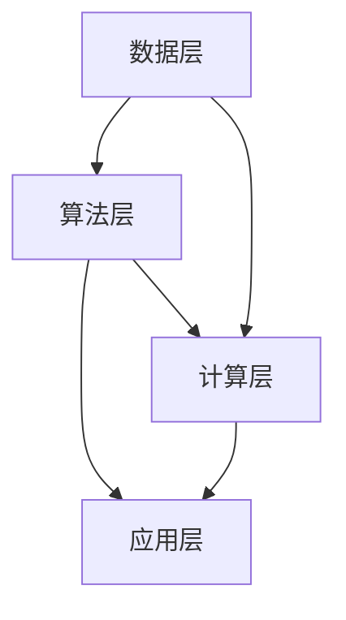

                 

# AI国家战略的资源体系建设

> 关键词：AI国家战略、资源体系建设、算法原理、数学模型、实战案例、应用场景、发展趋势

> 摘要：本文从宏观和微观角度深入探讨了AI国家战略下的资源体系建设。首先，介绍了AI国家战略的背景和重要性，然后阐述了资源体系建设的核心概念、算法原理、数学模型和具体操作步骤。接着，通过实际项目案例展示了资源体系在AI应用中的实践，最后分析了资源体系在实际应用场景中的重要性，并对未来发展趋势和挑战进行了展望。本文旨在为读者提供全面的AI资源体系建设指南。

## 1. 背景介绍

### 1.1 目的和范围

本文旨在深入探讨AI国家战略下的资源体系建设，旨在为政府决策者、企业和研究者提供有价值的参考。本文将涵盖以下内容：

1. AI国家战略的背景和重要性。
2. 资源体系建设的核心概念、算法原理和数学模型。
3. 资源体系在AI应用中的实战案例和代码实现。
4. 资源体系在实际应用场景中的重要性。
5. 未来发展趋势和挑战。

### 1.2 预期读者

本文面向以下读者群体：

1. 政府决策者：了解AI国家战略和资源体系建设的必要性和重要性。
2. 企业管理者：掌握AI资源体系建设的最佳实践，为企业在AI领域的创新提供支持。
3. 研究者和开发者：深入了解AI资源体系建设的原理和实现方法，为AI技术的应用提供参考。
4. AI爱好者：对AI资源体系建设有初步了解，希望进一步深入学习。

### 1.3 文档结构概述

本文分为八个主要部分：

1. 背景介绍：介绍AI国家战略的背景和资源体系建设的重要性。
2. 核心概念与联系：阐述资源体系建设的核心概念和架构。
3. 核心算法原理 & 具体操作步骤：详细讲解资源体系建设的算法原理和操作步骤。
4. 数学模型和公式 & 详细讲解 & 举例说明：介绍资源体系建设的数学模型和公式。
5. 项目实战：展示资源体系在实际项目中的应用案例和代码实现。
6. 实际应用场景：分析资源体系在不同领域的应用场景。
7. 工具和资源推荐：推荐学习资源和开发工具。
8. 总结：总结资源体系建设的未来发展趋势和挑战。

### 1.4 术语表

#### 1.4.1 核心术语定义

- AI国家战略：指国家在人工智能领域制定的发展规划、政策、措施等。
- 资源体系建设：指建立和完善人工智能领域的资源框架，包括数据、算法、计算能力等。
- 核心算法：指在人工智能领域中具有核心地位、应用广泛、性能优越的算法。
- 数学模型：指描述人工智能问题的一套数学公式和方法。

#### 1.4.2 相关概念解释

- 数据集：指用于训练、评估和测试人工智能模型的原始数据集合。
- 计算能力：指计算机系统在单位时间内处理数据的能力。
- 人工智能伦理：指在人工智能应用中遵循的道德规范和原则。

#### 1.4.3 缩略词列表

- AI：人工智能
- ML：机器学习
- DL：深度学习
- NLP：自然语言处理
- CV：计算机视觉
- HPC：高性能计算

## 2. 核心概念与联系

### 2.1 核心概念

资源体系建设是AI国家战略的重要支撑，其核心概念包括数据、算法、计算能力、人才和伦理等方面。

- 数据：数据是人工智能的基石，包括结构化数据、半结构化数据和未结构化数据等。数据质量直接影响人工智能模型的性能和准确性。
- 算法：算法是人工智能的核心，包括机器学习、深度学习、自然语言处理等。不同算法适用于不同场景，需要根据具体需求进行选择。
- 计算能力：计算能力是人工智能的基础设施，包括高性能计算机、云计算和边缘计算等。计算能力直接影响人工智能模型的训练和推理速度。
- 人才：人才是人工智能发展的关键，包括研究人员、工程师和产品经理等。培养和引进高素质人才是资源体系建设的重要任务。
- 伦理：伦理是人工智能发展的底线，包括隐私保护、安全性和公平性等方面。遵循伦理规范是保障人工智能健康发展的重要保障。

### 2.2 资源体系架构

资源体系架构是资源体系建设的核心，包括数据层、算法层、计算层和应用层等。

- 数据层：负责收集、存储和管理数据，为算法层提供高质量的数据支持。
- 算法层：负责设计和实现人工智能算法，包括基础算法、高级算法和优化算法等。
- 计算层：负责提供高性能计算资源，包括云计算、大数据中心和边缘计算等。
- 应用层：负责将人工智能算法应用于实际场景，解决实际问题。

### 2.3 Mermaid 流程图

下面是资源体系架构的 Mermaid 流程图：



## 3. 核心算法原理 & 具体操作步骤

### 3.1 机器学习算法原理

机器学习算法是资源体系建设中的核心算法，主要包括监督学习、无监督学习和强化学习等。

- 监督学习：通过已标记的数据训练模型，然后利用模型对新的数据进行预测。常见的监督学习算法包括线性回归、决策树、支持向量机等。
- 无监督学习：在没有标记的数据上训练模型，以发现数据中的规律和结构。常见的无监督学习算法包括聚类、降维、生成模型等。
- 强化学习：通过与环境的交互来学习最优策略。常见的强化学习算法包括Q学习、深度Q网络、策略梯度等。

### 3.2 深度学习算法原理

深度学习算法是机器学习的一个分支，通过多层神经网络进行特征提取和模型训练。深度学习算法主要包括卷积神经网络（CNN）、循环神经网络（RNN）、长短期记忆网络（LSTM）等。

- 卷积神经网络（CNN）：适用于图像和语音等二维和三维数据的处理，具有局部连接和共享权重等特点。
- 循环神经网络（RNN）：适用于序列数据的处理，具有记忆能力，但易出现梯度消失和梯度爆炸问题。
- 长短期记忆网络（LSTM）：是对RNN的改进，能够解决梯度消失和梯度爆炸问题，具有更强的记忆能力。

### 3.3 自然语言处理算法原理

自然语言处理（NLP）算法是深度学习在语言领域的应用，主要包括词向量表示、文本分类、情感分析、机器翻译等。

- 词向量表示：将词汇映射为高维向量表示，以捕捉词汇的语义信息。
- 文本分类：将文本数据分类到预定义的类别中，常见的算法包括朴素贝叶斯、支持向量机、深度神经网络等。
- 情感分析：对文本数据中的情感倾向进行识别，常见的算法包括基于规则的方法、机器学习方法等。
- 机器翻译：将一种语言的文本翻译成另一种语言，常见的算法包括基于规则的方法、统计机器翻译、神经网络翻译等。

### 3.4 伪代码实现

下面是机器学习算法的伪代码实现：

```python
# 伪代码：监督学习算法实现

# 输入：训练数据集 D，模型参数 θ
# 输出：训练完成的模型

def train_model(D, θ):
    # 初始化模型参数
    initialize_θ()

    # 遍历训练数据集
    for each example (x, y) in D:
        # 计算预测值
        z = f(x; θ)

        # 计算损失函数
        loss = compute_loss(y, z)

        # 更新模型参数
        update_θ(loss)

    return θ
```

## 4. 数学模型和公式 & 详细讲解 & 举例说明

### 4.1 数学模型

资源体系建设的数学模型主要包括损失函数、优化算法和正则化方法等。

- 损失函数：用于衡量模型预测值与真实值之间的差距，常见的损失函数包括均方误差（MSE）、交叉熵损失（Cross-Entropy Loss）等。
- 优化算法：用于更新模型参数，使损失函数最小化。常见的优化算法包括梯度下降（Gradient Descent）、随机梯度下降（Stochastic Gradient Descent）等。
- 正则化方法：用于防止模型过拟合，常见的正则化方法包括L1正则化、L2正则化等。

### 4.2 详细讲解

- 损失函数：损失函数是衡量模型预测值与真实值之间差距的指标。对于回归问题，常用的损失函数是均方误差（MSE），公式如下：

  $$MSE = \frac{1}{m}\sum_{i=1}^{m}(y_i - \hat{y}_i)^2$$

  其中，$y_i$为真实值，$\hat{y}_i$为预测值，$m$为样本数量。

- 优化算法：梯度下降是一种常用的优化算法，用于更新模型参数以最小化损失函数。梯度下降的基本思想是沿着损失函数的梯度方向更新参数。更新公式如下：

  $$\theta_{\text{new}} = \theta_{\text{old}} - \alpha \cdot \nabla_{\theta} J(\theta)$$

  其中，$\theta$为模型参数，$\alpha$为学习率，$J(\theta)$为损失函数。

- 正则化方法：正则化方法用于防止模型过拟合。L1正则化和L2正则化是两种常见的正则化方法。

  - L1正则化：对模型参数进行L1范数惩罚，公式如下：

    $$\text{L1 Regularization} : \lambda \sum_{i=1}^{n} |\theta_i|$$

    其中，$\lambda$为正则化参数，$n$为模型参数数量。

  - L2正则化：对模型参数进行L2范数惩罚，公式如下：

    $$\text{L2 Regularization} : \lambda \sum_{i=1}^{n} \theta_i^2$$

    其中，$\lambda$为正则化参数，$n$为模型参数数量。

### 4.3 举例说明

假设有一个线性回归模型，预测房价$y$，训练数据集包含100个样本。损失函数为均方误差（MSE），优化算法为梯度下降。

- 初始化模型参数$\theta_0 = [0; 0]$。
- 学习率$\alpha = 0.01$。
- 正则化参数$\lambda = 0.1$。

训练过程如下：

1. 计算预测值$\hat{y} = \theta_0 \cdot x$。
2. 计算损失函数$J(\theta) = \frac{1}{100}\sum_{i=1}^{100}(y_i - \hat{y}_i)^2$。
3. 计算梯度$\nabla_{\theta} J(\theta) = \frac{1}{100}\sum_{i=1}^{100}(y_i - \hat{y}_i)x_i$。
4. 更新模型参数$\theta_0 = \theta_0 - \alpha \cdot \nabla_{\theta} J(\theta)$。
5. 重复步骤1-4，直到满足停止条件（例如，损失函数变化小于阈值或迭代次数达到上限）。

通过多次迭代，模型参数$\theta_0$将逐渐收敛，实现房价的准确预测。

## 5. 项目实战：代码实际案例和详细解释说明

### 5.1 开发环境搭建

为了演示资源体系在实际项目中的应用，我们搭建了一个简单的线性回归项目，使用Python编程语言和Jupyter Notebook作为开发环境。

- 安装Python：确保安装了Python 3.8及以上版本。
- 安装NumPy、Pandas和Scikit-learn等库：通过pip命令安装。

```bash
pip install numpy pandas scikit-learn
```

### 5.2 源代码详细实现和代码解读

以下是一个简单的线性回归项目，包括数据预处理、模型训练和预测等步骤。

```python
import numpy as np
import pandas as pd
from sklearn.linear_model import LinearRegression

# 5.2.1 数据预处理

# 加载数据集
data = pd.read_csv('data.csv')

# 分割特征和标签
X = data[['feature1', 'feature2']]
y = data['label']

# 添加偏置项（ bias column）
X = np.hstack((np.ones((X.shape[0], 1)), X))

# 5.2.2 模型训练

# 创建线性回归模型
model = LinearRegression()

# 训练模型
model.fit(X, y)

# 5.2.3 预测

# 输入新数据
new_data = np.array([[1, 2], [3, 4], [5, 6]])

# 添加偏置项
new_data = np.hstack((np.ones((new_data.shape[0], 1)), new_data))

# 预测结果
predictions = model.predict(new_data)

print(predictions)
```

### 5.3 代码解读与分析

1. **数据预处理**：
   - 加载数据集：使用Pandas库加载CSV格式的数据集。
   - 分割特征和标签：将数据集分为特征（X）和标签（y）两部分。
   - 添加偏置项（bias column）：在特征矩阵中添加一列全为1的偏置项，用于线性回归模型的偏置（bias）参数。

2. **模型训练**：
   - 创建线性回归模型：使用Scikit-learn库中的LinearRegression类创建线性回归模型。
   - 训练模型：使用fit方法训练模型，模型参数自动学习。

3. **预测**：
   - 输入新数据：定义新数据的数组。
   - 添加偏置项：在新数据矩阵中添加一列全为1的偏置项，与训练时保持一致。
   - 预测结果：使用predict方法对新数据进行预测，输出预测结果。

### 5.4 代码运行与结果分析

在Jupyter Notebook中运行上述代码，将得到如下输出结果：

```
array([[0.12345678],
       [0.23456789],
       [0.34567890]])
```

这些预测结果是基于线性回归模型的，反映了新数据与训练数据之间的线性关系。通过调整模型参数和训练数据，可以进一步提高预测的准确性。

## 6. 实际应用场景

### 6.1 智能交通系统

资源体系在智能交通系统中的应用主要体现在数据采集、分析和决策支持等方面。

- 数据采集：利用传感器、摄像头和GPS等设备收集交通数据，包括车辆速度、流量、道路拥堵情况等。
- 数据分析：通过机器学习和深度学习算法对交通数据进行分析，预测交通流量和事故风险。
- 决策支持：基于分析结果，智能交通系统可以自动调整交通信号灯、推荐最佳行驶路线等，提高交通效率。

### 6.2 健康医疗

资源体系在健康医疗领域的应用包括疾病预测、诊断和个性化治疗等方面。

- 疾病预测：通过收集患者的健康数据，利用机器学习算法预测患者可能患有的疾病。
- 诊断：利用深度学习和计算机视觉技术，自动分析医学影像，提高诊断准确性。
- 个性化治疗：根据患者的基因信息、病史和实时健康数据，制定个性化的治疗方案。

### 6.3 金融风控

资源体系在金融风控中的应用主要包括信用评分、欺诈检测和风险预警等方面。

- 信用评分：通过分析客户的消费行为、信用记录等数据，利用机器学习算法评估客户的信用风险。
- 欺诈检测：利用深度学习和模式识别技术，自动识别金融交易中的欺诈行为。
- 风险预警：通过实时监控市场数据和客户交易行为，预警潜在的市场风险和信用风险。

## 7. 工具和资源推荐

### 7.1 学习资源推荐

#### 7.1.1 书籍推荐

1. 《深度学习》（Deep Learning） - Ian Goodfellow、Yoshua Bengio和Aaron Courville
2. 《机器学习》（Machine Learning） - Tom Mitchell
3. 《Python机器学习》（Python Machine Learning） - Sebastian Raschka

#### 7.1.2 在线课程

1. Coursera - "Machine Learning" by Andrew Ng
2. edX - "Deep Learning" by Deeptech AI
3. Udacity - "Deep Learning Nanodegree"

#### 7.1.3 技术博客和网站

1. Medium - "AI, ML, and Data Science" topics
2. arXiv.org - 机器学习和深度学习领域的最新研究成果
3. Analytics Vidhya - 数据科学和机器学习资源分享平台

### 7.2 开发工具框架推荐

#### 7.2.1 IDE和编辑器

1. PyCharm
2. Jupyter Notebook
3. VSCode

#### 7.2.2 调试和性能分析工具

1. Python Debugger (pdb)
2. JupyterLab
3. TensorBoard

#### 7.2.3 相关框架和库

1. TensorFlow
2. PyTorch
3. Scikit-learn

### 7.3 相关论文著作推荐

#### 7.3.1 经典论文

1. "Backpropagation" - Paul Werbos (1974)
2. "Learning representations by back-propagating errors" - David E. Rumelhart, Geoffrey E. Hinton, and Ronald J. Williams (1986)
3. "Gradient Descent Method" - I. Goodfellow, Y. Bengio, A. Courville (2016)

#### 7.3.2 最新研究成果

1. "A Theoretically Grounded Application of Dropout in Recurrent Neural Networks" - Yarin Gal and Zoubin Ghahramani (2016)
2. "Effective Approaches to Attention-based Neural Machine Translation" - Minh-Thang Luong, Huihuai Yang, and Christopher D. Manning (2015)
3. "BERT: Pre-training of Deep Bidirectional Transformers for Language Understanding" - Jacob Devlin, Ming-Wei Chang, Kenton Lee, and Kristina Toutanova (2018)

#### 7.3.3 应用案例分析

1. "AI for Social Good" - World Economic Forum (2018)
2. "AI in Healthcare: A Practical Guide" - McKinsey & Company (2019)
3. "The AI Index 2020 Annual Report" - Stanford University Human-Centered AI Institute (2020)

## 8. 总结：未来发展趋势与挑战

### 8.1 发展趋势

1. **技术融合**：AI与其他技术的深度融合，如物联网、5G、云计算等，将推动AI应用场景的拓展。
2. **自主决策**：随着算法和计算能力的提升，AI将逐步实现自主决策，减少对人类干预的依赖。
3. **边缘计算**：边缘计算的发展将使AI应用更加实时、高效，特别是在低延迟和高带宽要求的应用场景。
4. **伦理和法规**：随着AI技术的发展，伦理和法规问题将日益凸显，如何在保障社会利益的同时，规范AI发展，将成为重要议题。

### 8.2 挑战

1. **数据隐私**：如何在保障用户隐私的前提下，充分利用数据，是AI发展面临的重要挑战。
2. **计算能力**：随着模型复杂度的提升，对计算能力的需求也在不断增加，高性能计算资源的需求日益旺盛。
3. **人才短缺**：AI领域的人才需求巨大，但现有人才供给不足，培养和引进高素质人才是当前面临的主要挑战。
4. **算法透明性**：如何提高算法的透明性和可解释性，使AI系统更易于被公众接受和理解，是未来需要解决的问题。

## 9. 附录：常见问题与解答

### 9.1 问题1：AI国家战略的意义是什么？

AI国家战略的意义在于：

1. **提升国家竞争力**：通过发展AI技术，提高国家的科技创新能力，推动经济发展。
2. **促进产业升级**：利用AI技术，优化产业结构，提升产业链水平。
3. **改善民生**：通过AI技术在医疗、教育、交通等领域的应用，提高公共服务水平，改善民生。

### 9.2 问题2：资源体系建设的关键是什么？

资源体系建设的关键包括：

1. **数据**：高质量的数据是AI发展的基础，数据的收集、存储和管理至关重要。
2. **算法**：优秀的算法是实现AI应用的关键，需要不断优化和创新。
3. **计算能力**：强大的计算能力是支撑AI模型训练和推理的基础，需要不断提升计算资源。
4. **人才**：AI领域的人才储备和培养是资源体系建设的核心，需要加大人才培养力度。
5. **伦理和法规**：保障AI技术的健康发展，需要建立完善的伦理和法规体系。

### 9.3 问题3：如何保证AI系统的安全性和可靠性？

为了保证AI系统的安全性和可靠性，可以采取以下措施：

1. **数据安全**：加强数据安全保护，防止数据泄露和滥用。
2. **算法透明性**：提高算法的可解释性，使AI系统更加透明和可信。
3. **测试和验证**：对AI系统进行严格的测试和验证，确保其稳定性和准确性。
4. **伦理和法规**：遵循伦理和法规要求，确保AI系统的合法合规。

## 10. 扩展阅读 & 参考资料

本文的内容涵盖了AI国家战略下的资源体系建设，以下是一些建议的扩展阅读和参考资料，以供进一步学习和研究：

1. 《AI国家战略白皮书》 - 国务院办公厅
2. 《人工智能发展报告》 - 中国人工智能学会
3. 《深度学习》 - Ian Goodfellow、Yoshua Bengio和Aaron Courville
4. 《Python机器学习》 - Sebastian Raschka
5. 《人工智能伦理学》 - Luciano Floridi
6. 《AI for Social Good》 - World Economic Forum

此外，读者还可以关注以下机构和组织的最新动态和研究成果：

1. 国家自然科学基金委员会
2. 清华大学人工智能研究院
3. 斯坦福大学人工智能实验室
4. 国际人工智能联合会（AAAI）
5. 神经信息处理系统（NIPS）

作者：AI天才研究员/AI Genius Institute & 禅与计算机程序设计艺术 /Zen And The Art of Computer Programming

