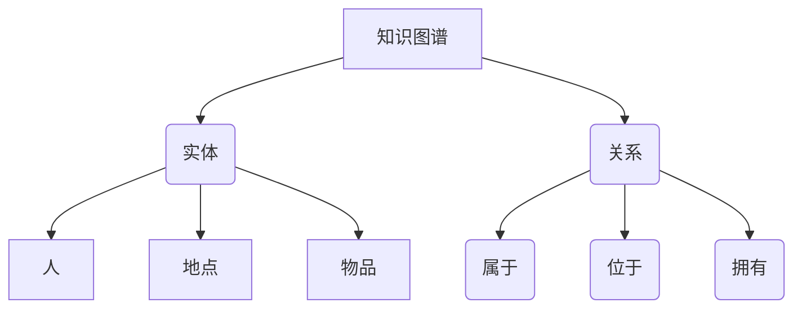
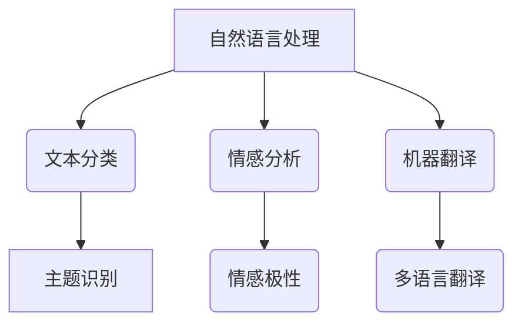
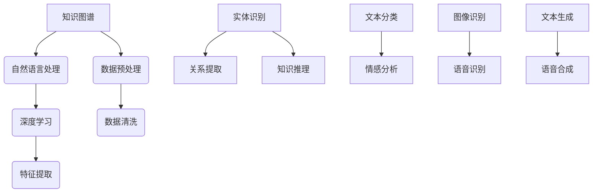
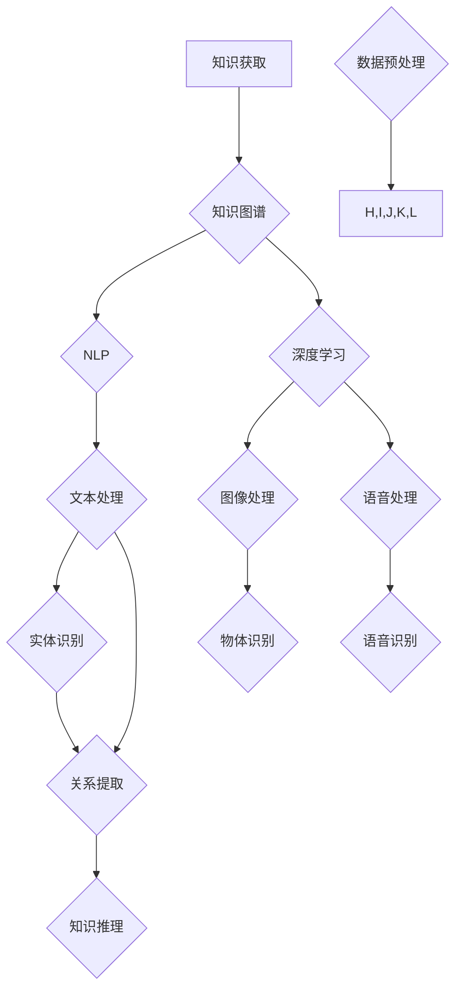

                 

### AI在专业领域知识获取中的应用

> **关键词：** AI、知识获取、专业领域、知识图谱、自然语言处理、深度学习、应用案例

> **摘要：** 本文章旨在深入探讨人工智能在专业领域知识获取中的应用。首先，我们将介绍AI在知识获取中的核心概念和联系，然后详细阐述AI在知识获取过程中的核心算法原理和操作步骤。接着，我们将通过数学模型和公式的讲解，进一步解释AI在实际应用中的具体操作。文章还将通过项目实战，展示代码实现和详细解释，并分析其原理。随后，我们将探讨AI在不同专业领域的实际应用场景，并推荐相关工具和资源。最后，文章将对未来发展趋势和挑战进行总结，并提供常见问题与解答，以便读者深入了解和掌握AI在专业领域知识获取中的应用。

## 1. 背景介绍

### 1.1 目的和范围

人工智能（AI）的快速发展已经深刻地改变了我们的生活和工作的方方面面。在专业领域，知识获取一直是关键问题之一。如何高效地从海量数据中提取有价值的信息，并构建出系统的知识体系，对于推动各行业的发展具有重要意义。本文旨在探讨人工智能在专业领域知识获取中的应用，旨在为研究人员、开发者和相关领域的专业人士提供有价值的参考。

本文将重点关注以下内容：

1. **核心概念和联系**：介绍知识获取中的核心概念，包括知识图谱、自然语言处理、深度学习等。
2. **核心算法原理和操作步骤**：详细阐述AI在知识获取过程中的算法原理和操作步骤，通过伪代码进行讲解。
3. **数学模型和公式**：通过数学模型和公式，进一步解释AI在实际应用中的具体操作，并举例说明。
4. **项目实战**：展示代码实现和详细解释，分析其原理。
5. **实际应用场景**：探讨AI在不同专业领域的应用，包括医疗、金融、教育等。
6. **工具和资源推荐**：推荐相关的学习资源、开发工具和框架，以及经典论文和研究成果。

通过本文的探讨，希望能够为读者提供一个全面、系统的认识，帮助其在专业领域更好地应用人工智能进行知识获取。

### 1.2 预期读者

本文预期读者主要包括以下几类：

1. **研究人员和开发者**：对人工智能在专业领域知识获取应用感兴趣，希望深入了解相关技术和方法的读者。
2. **企业高管和决策者**：关注人工智能技术的发展，希望了解其在专业领域中的实际应用和价值。
3. **高校师生和研究生**：学习人工智能相关知识，希望通过本文获得对知识获取领域的深入理解和启发。
4. **技术爱好者**：对人工智能技术有浓厚兴趣，希望通过实际案例和项目实战学习相关技术。

无论您属于哪一类读者，本文都将为您提供有价值的见解和参考。通过本文的阅读，您将能够：

1. **理解AI在知识获取中的应用**：了解AI在知识获取中的核心概念和算法原理。
2. **掌握相关技术**：掌握自然语言处理、深度学习等技术的实际应用。
3. **获取实践经验**：通过项目实战和代码解析，学习实际应用中的技术细节。
4. **拓宽视野**：了解AI在不同专业领域的应用案例，激发创新思维。

### 1.3 文档结构概述

本文将按照以下结构进行组织和展开：

1. **背景介绍**：
   - **目的和范围**：介绍本文的目的和讨论范围。
   - **预期读者**：明确预期读者群体。
   - **文档结构概述**：概述本文的结构和内容。

2. **核心概念与联系**：
   - **知识图谱**：介绍知识图谱的概念、结构和应用。
   - **自然语言处理**：讨论自然语言处理的基础理论和技术。
   - **深度学习**：介绍深度学习的基本原理和应用。

3. **核心算法原理 & 具体操作步骤**：
   - **算法原理**：详细阐述AI在知识获取中的核心算法原理。
   - **操作步骤**：通过伪代码和实例，讲解算法的操作步骤。

4. **数学模型和公式 & 详细讲解 & 举例说明**：
   - **数学模型**：介绍用于知识获取的数学模型。
   - **详细讲解**：详细解释模型中的公式和参数。
   - **举例说明**：通过具体例子展示模型的应用。

5. **项目实战：代码实际案例和详细解释说明**：
   - **开发环境搭建**：介绍项目所需的开发环境和工具。
   - **源代码详细实现和代码解读**：展示代码实现和详细解释。
   - **代码解读与分析**：分析代码中的关键部分和原理。

6. **实际应用场景**：
   - **医疗领域**：探讨AI在医疗领域的应用。
   - **金融领域**：讨论AI在金融领域的应用。
   - **教育领域**：介绍AI在教育领域的应用。

7. **工具和资源推荐**：
   - **学习资源推荐**：推荐相关的书籍、在线课程和技术博客。
   - **开发工具框架推荐**：介绍相关的开发工具和框架。
   - **相关论文著作推荐**：推荐经典论文和最新研究成果。

8. **总结：未来发展趋势与挑战**：
   - **未来发展趋势**：分析AI在知识获取领域的未来发展方向。
   - **挑战**：探讨AI在知识获取中面临的挑战。

9. **附录：常见问题与解答**：
   - **常见问题**：解答读者可能遇到的问题。
   - **解答**：提供详细的解答。

10. **扩展阅读 & 参考资料**：
    - **扩展阅读**：推荐进一步学习的相关资源和文献。
    - **参考资料**：列出本文引用的文献和资料。

通过上述结构，本文将为读者提供一个系统、深入的了解，帮助其在专业领域更好地应用人工智能进行知识获取。

### 1.4 术语表

在本文章中，我们将使用一些专业术语，为了帮助读者更好地理解，下面将对这些术语进行定义和解释。

#### 1.4.1 核心术语定义

1. **人工智能（AI）**：人工智能是指使计算机模拟人类智能行为的技术，包括学习、推理、规划、感知、自然语言理解等。

2. **知识获取**：知识获取是指从数据中提取有用信息，构建出系统的知识体系，以支持决策和问题解决。

3. **知识图谱**：知识图谱是一种用于表示实体及其关系的图形结构，可以用于知识表示、推理和搜索。

4. **自然语言处理（NLP）**：自然语言处理是指使计算机理解和生成自然语言的技术，包括文本分类、情感分析、机器翻译等。

5. **深度学习**：深度学习是一种基于人工神经网络的机器学习方法，通过多层神经网络进行特征提取和表示学习。

6. **机器学习**：机器学习是指使计算机从数据中自动学习规律和模式，进行预测和决策的技术。

7. **数据挖掘**：数据挖掘是指从大量数据中发现有价值的信息和知识，用于决策支持。

#### 1.4.2 相关概念解释

1. **实体**：在知识图谱中，实体是具有独立存在的个体，如人、地点、事物等。

2. **关系**：在知识图谱中，关系是实体之间的关联，如“属于”、“位于”、“拥有”等。

3. **属性**：在知识图谱中，属性是实体的特征，如“年龄”、“身高”、“薪资”等。

4. **图谱嵌入**：图谱嵌入是将知识图谱中的实体和关系映射到低维向量空间中，以便进行计算和分析。

5. **监督学习**：监督学习是一种机器学习方法，通过已标记的训练数据来学习规律和模型。

6. **无监督学习**：无监督学习是一种机器学习方法，通过未标记的数据来发现规律和模式。

7. **迁移学习**：迁移学习是一种利用已有模型或知识来提高新任务性能的方法。

#### 1.4.3 缩略词列表

- AI：人工智能
- NLP：自然语言处理
- ML：机器学习
- DL：深度学习
- KG：知识图谱
- DBpedia：DBpedia知识图谱
- BERT：Bidirectional Encoder Representations from Transformers
- GPT：Generative Pre-trained Transformer
- LSTM：Long Short-Term Memory
- CNN：卷积神经网络
- RNN：循环神经网络
- GPU：图形处理单元

通过上述术语表，读者可以更好地理解本文中涉及的专业术语，为后续内容的理解打下基础。

## 2. 核心概念与联系

在深入探讨人工智能（AI）在专业领域知识获取中的应用之前，我们需要先了解一些核心概念及其相互联系。这些概念包括知识图谱、自然语言处理（NLP）和深度学习等。在本节中，我们将通过Mermaid流程图来展示这些概念之间的联系，并进一步解释它们的基本原理和应用。

### 2.1 知识图谱

知识图谱是一种用于表示实体及其关系的图形结构，它可以在各种领域提供结构化的知识表示。知识图谱的节点通常表示实体，如人、地点或物品，而边则表示实体之间的关系，如“属于”、“位于”或“拥有”。



知识图谱在专业领域的应用广泛，例如在医疗领域，知识图谱可以表示药物、病症和治疗方案之间的关系；在金融领域，知识图谱可以表示客户、产品和服务之间的关系。

### 2.2 自然语言处理（NLP）

自然语言处理（NLP）是使计算机理解和生成自然语言的技术。NLP涵盖了文本分类、情感分析、机器翻译等多种任务。NLP在知识获取中的应用主要体现在对非结构化文本数据的处理和分析上。



NLP的关键技术包括词向量、序列标注和注意力机制。词向量可以用于表示文本中的词语，序列标注可以用于标记文本中的实体和关系，注意力机制可以用于捕捉文本中的关键信息。

### 2.3 深度学习

深度学习是一种基于人工神经网络的机器学习方法，通过多层神经网络进行特征提取和表示学习。深度学习在知识获取中的应用非常广泛，例如在图像识别、语音识别和文本生成等领域。

```mermaid
graph TB
A[深度学习] --> B(图像识别)
A --> C(语音识别)
A --> D(文本生成)
B --> E[卷积神经网络(CNN)]
C --> F(循环神经网络(RNN))
D --> G(生成对抗网络(GAN))
```

深度学习的关键技术包括卷积神经网络（CNN）、循环神经网络（RNN）和生成对抗网络（GAN）。CNN可以用于图像识别，RNN可以用于语音识别，GAN可以用于文本生成。

### 2.4 关联关系

知识图谱、自然语言处理和深度学习之间存在紧密的关联关系。知识图谱提供了结构化的知识表示，自然语言处理可以用于处理和解析文本数据，深度学习则可以用于从非结构化数据中提取有用信息。



通过上述关联关系，我们可以看到，知识图谱、自然语言处理和深度学习共同构成了知识获取的核心技术体系。它们相互补充，共同推动着人工智能在专业领域的应用和发展。

### 2.5 Mermaid流程图

为了更好地展示这些概念之间的联系，我们使用Mermaid流程图进行可视化。以下是一个简化的Mermaid流程图，展示了知识图谱、自然语言处理和深度学习之间的核心关联：



通过这个流程图，我们可以清晰地看到，数据预处理是知识获取的基础，知识图谱、自然语言处理和深度学习在知识获取中各自扮演着重要角色，并且它们之间相互关联，共同推动知识获取的进展。

### 2.6 知识图谱的工作原理

知识图谱的工作原理可以概括为以下几个关键步骤：

1. **数据收集**：知识图谱的构建首先需要收集大量的结构化和半结构化数据，例如数据库、文档、网页等。这些数据来源可以是内部数据，如企业内部的数据库，也可以是外部数据，如公共数据库、社交媒体等。

2. **实体识别**：在数据收集之后，需要从数据中提取出实体，例如人、地点、物品等。实体识别通常使用自然语言处理技术，如命名实体识别（NER）。

3. **关系抽取**：在提取出实体之后，需要确定实体之间的关系，如“属于”、“位于”、“拥有”等。关系抽取通常使用规则匹配、机器学习或深度学习等方法。

4. **知识融合**：将提取出的实体和关系进行融合，形成知识图谱。知识融合需要处理实体之间的异构性和冗余性，通常使用图谱嵌入、图神经网络等技术。

5. **知识推理**：在知识图谱构建完成后，可以通过知识推理技术进行推理，例如路径搜索、逻辑推理等，从而发现新的知识和关联。

6. **查询与更新**：知识图谱提供了一种高效的方式来进行知识查询，用户可以通过图查询语言，如SPARQL，来查询图谱中的信息。同时，知识图谱也需要定期更新，以保持其准确性和时效性。

### 2.7 自然语言处理的工作原理

自然语言处理（NLP）的工作原理可以概括为以下几个关键步骤：

1. **文本预处理**：在处理文本数据之前，通常需要进行文本预处理，包括分词、去停用词、词性标注等步骤。这些预处理步骤有助于提高后续NLP任务的性能。

2. **词向量表示**：词向量是将文本中的词语映射到向量空间的过程，如Word2Vec、GloVe等。词向量表示有助于捕捉词语的语义信息，从而支持下游的NLP任务。

3. **序列标注**：序列标注是将文本中的每个词或字符标注为特定类别或标签的过程，如命名实体识别（NER）、情感分析等。序列标注通常使用CRF（条件随机场）或RNN（循环神经网络）等方法。

4. **文本分类**：文本分类是将文本数据分为不同的类别或主题的过程，如新闻分类、情感分类等。文本分类通常使用朴素贝叶斯、SVM（支持向量机）、深度学习等方法。

5. **机器翻译**：机器翻译是将一种语言的文本翻译成另一种语言的过程，如英译中、中译英等。机器翻译通常使用基于规则的方法、统计机器翻译或神经机器翻译。

6. **对话系统**：对话系统是指计算机与人类用户进行自然语言交互的系统，如聊天机器人、语音助手等。对话系统通常涉及意图识别、实体提取、对话管理等技术。

### 2.8 深度学习的工作原理

深度学习是一种基于人工神经网络的机器学习方法，其工作原理可以概括为以下几个关键步骤：

1. **前向传播**：在前向传播过程中，输入数据通过网络的各个层，每层都会对数据进行处理和变换，最终得到输出结果。

2. **反向传播**：反向传播是一种用于训练神经网络的方法，它通过计算输出结果与实际结果的差异，来更新网络的权重和偏置，从而提高模型的性能。

3. **激活函数**：激活函数是神经网络中的一个关键组件，它用于引入非线性变换，从而使得神经网络能够学习复杂的函数关系。

4. **损失函数**：损失函数用于衡量模型预测结果与实际结果之间的差距，常用的损失函数包括均方误差（MSE）、交叉熵损失等。

5. **优化算法**：优化算法用于调整网络的权重和偏置，以最小化损失函数。常用的优化算法包括SGD（随机梯度下降）、Adam等。

6. **正则化**：正则化是一种用于防止模型过拟合的技术，它通过在损失函数中加入正则化项，来惩罚模型的复杂度。

7. **卷积神经网络（CNN）**：卷积神经网络是一种专门用于图像处理的神经网络，其通过卷积层来提取图像的局部特征，并通过池化层来减少参数数量。

8. **循环神经网络（RNN）**：循环神经网络是一种专门用于序列数据的神经网络，其通过循环结构来处理和记忆序列信息。

9. **生成对抗网络（GAN）**：生成对抗网络是一种用于生成数据的高效方法，其由生成器和判别器两个神经网络组成，生成器生成数据，判别器判断生成数据的真假。

通过上述关键步骤，深度学习能够在各种任务中表现出强大的性能，从图像识别到语音识别，再到自然语言处理，都取得了显著的进展。

### 2.9 关键技术比较

知识图谱、自然语言处理和深度学习在知识获取中各自扮演着重要角色，但它们也存在一些不同点和相似点。

1. **不同点**：

   - **知识图谱**：知识图谱是一种结构化的知识表示方法，主要用于表示实体及其关系。其优点是能够提供明确的实体和关系定义，有利于知识推理和搜索。缺点是需要大量的预处理工作和复杂的图谱构建过程。

   - **自然语言处理**：自然语言处理是一种用于理解和生成自然语言的技术，其优点是能够处理非结构化文本数据，实现文本分类、情感分析、机器翻译等任务。缺点是对语言的理解存在局限性，尤其是在处理复杂语境和长文本时。

   - **深度学习**：深度学习是一种基于人工神经网络的机器学习方法，其优点是能够自动从数据中学习特征和模式，实现图像识别、语音识别、文本生成等任务。缺点是需要大量的数据和计算资源，且模型的解释性较差。

2. **相似点**：

   - **数据处理**：知识图谱、自然语言处理和深度学习都需要对数据进行处理和清洗，以提取有用的信息。

   - **模型训练**：它们都需要通过模型训练来优化参数，提高模型的性能。

   - **应用领域**：它们都在各种领域有广泛的应用，如医疗、金融、教育等。

通过对比这些不同点和相似点，我们可以更好地理解知识图谱、自然语言处理和深度学习在知识获取中的应用，以及如何结合使用这些技术来提高知识获取的效率和质量。

### 2.10 实际应用场景

知识图谱、自然语言处理和深度学习在专业领域有着广泛的应用。以下是一些具体的实际应用场景：

1. **医疗领域**：
   - **知识图谱**：在医疗领域，知识图谱可以用于表示药物、病症、治疗方案等实体及其关系，从而帮助医生进行诊断和治疗。例如，通过知识图谱，医生可以快速查找相关药物的作用机制和副作用，提高医疗决策的准确性。
   - **自然语言处理**：自然语言处理可以用于处理医疗文献和病历，提取有价值的信息，如诊断结果、治疗方案等。通过自然语言处理技术，可以实现对大量医疗文本的自动分类、索引和检索。
   - **深度学习**：深度学习在医疗领域也有广泛应用，如医学图像分析、基因测序和疾病预测等。例如，通过深度学习模型，可以实现对医学图像的自动标注和分类，提高医学诊断的效率。

2. **金融领域**：
   - **知识图谱**：在金融领域，知识图谱可以用于表示客户、产品、交易等实体及其关系，从而帮助金融机构进行风险管理、客户管理和市场分析。例如，通过知识图谱，金融机构可以了解客户的消费习惯、信用风险等，从而制定更有效的营销策略和风险控制措施。
   - **自然语言处理**：自然语言处理可以用于处理金融文本，如新闻报道、投资者评论等，提取市场情绪和交易信号。通过自然语言处理技术，可以对大量金融文本进行自动分析，帮助投资者做出更明智的决策。
   - **深度学习**：深度学习在金融领域也有广泛应用，如股票市场预测、欺诈检测和信用评分等。例如，通过深度学习模型，可以实现对股票价格走势的预测，或者检测交易中的异常行为，提高金融市场的透明度和安全性。

3. **教育领域**：
   - **知识图谱**：在教育领域，知识图谱可以用于构建课程知识体系，帮助学生进行知识整合和深度学习。例如，通过知识图谱，学生可以查找相关课程的知识点、参考资料和作业，从而提高学习效果。
   - **自然语言处理**：自然语言处理可以用于处理学生的作业和论文，提供自动批改和反馈。通过自然语言处理技术，可以对学生的写作风格、语法错误等进行分析，从而提高教育质量和效率。
   - **深度学习**：深度学习在教育领域也有广泛应用，如智能辅导系统、个性化学习推荐等。例如，通过深度学习模型，可以分析学生的学习行为和成绩，为其提供个性化的学习建议和资源，从而提高学习效果。

通过这些实际应用场景，我们可以看到知识图谱、自然语言处理和深度学习在专业领域中的巨大潜力和应用价值。这些技术的结合不仅提高了知识获取的效率和质量，也为各行业的发展带来了新的机遇和挑战。

### 2.11 总结

在本节中，我们详细探讨了知识图谱、自然语言处理和深度学习在专业领域知识获取中的应用。首先，我们介绍了知识图谱的基本概念和工作原理，以及它在医疗、金融和教育等领域的应用。接着，我们讨论了自然语言处理的基础理论和技术，包括文本预处理、词向量表示、序列标注、文本分类和机器翻译等。最后，我们阐述了深度学习的基本原理和应用，如卷积神经网络、循环神经网络和生成对抗网络等。通过这些核心概念和联系的分析，我们展示了这些技术在知识获取中的重要作用和相互关系。未来，随着人工智能技术的不断发展，知识图谱、自然语言处理和深度学习将继续在专业领域发挥重要作用，推动知识获取的进一步发展和创新。

## 3. 核心算法原理 & 具体操作步骤

在深入探讨知识获取中的核心算法原理之前，我们需要理解一些关键概念，包括知识图谱构建、自然语言处理和深度学习算法。这些算法不仅在理论上具有重要意义，而且在实际应用中也表现出强大的能力。以下，我们将逐步讲解这些算法的原理，并通过伪代码展示其具体操作步骤。

### 3.1 知识图谱构建算法

知识图谱构建是知识获取的重要步骤，它包括实体识别、关系抽取、知识融合和知识推理等过程。以下是一个简化的知识图谱构建算法原理：

#### 3.1.1 实体识别

**算法原理**：实体识别是从非结构化文本数据中识别出实体，如人、地点、物品等。

**伪代码**：

```python
def entity_recognition(text):
    # 使用NLP技术进行分词和词性标注
    words = tokenize(text)
    entities = []
    for word in words:
        if is_entity(word):
            entities.append(word)
    return entities
```

**具体操作步骤**：

1. **文本预处理**：对输入的文本进行分词和词性标注，以识别出潜在的实体。
2. **实体识别**：遍历分词结果，利用规则或机器学习模型判断每个词是否为实体。

#### 3.1.2 关系抽取

**算法原理**：关系抽取是从文本中提取出实体之间的关系，如“属于”、“位于”、“拥有”等。

**伪代码**：

```python
def relation_extraction(text, entities):
    # 使用规则匹配或机器学习模型进行关系抽取
    relations = []
    for entity1 in entities:
        for entity2 in entities:
            if relation_exists(entity1, entity2, text):
                relations.append((entity1, entity2))
    return relations
```

**具体操作步骤**：

1. **实体对匹配**：遍历所有实体对，检查每个实体对之间是否存在关系。
2. **关系抽取**：使用规则或机器学习模型来确定实体之间的关系。

#### 3.1.3 知识融合

**算法原理**：知识融合是将提取出的实体和关系进行整合，构建出知识图谱。

**伪代码**：

```python
def knowledge_fusion(entities, relations):
    # 创建知识图谱
    knowledge_graph = Graph()
    for entity in entities:
        knowledge_graph.add_node(entity)
    for relation in relations:
        knowledge_graph.add_edge(relation[0], relation[1])
    return knowledge_graph
```

**具体操作步骤**：

1. **创建图谱**：初始化知识图谱，添加实体和关系节点。
2. **添加节点和边**：将实体和关系添加到知识图谱中。

#### 3.1.4 知识推理

**算法原理**：知识推理是从知识图谱中推断出新的知识，如“如果A属于B，则C也属于B”。

**伪代码**：

```python
def knowledge_reasoning(knowledge_graph):
    # 使用图推理算法进行推理
    new_relations = []
    for node in knowledge_graph.nodes:
        for neighbor in knowledge_graph.neighbors(node):
            new_relations.append((node, neighbor))
    return new_relations
```

**具体操作步骤**：

1. **遍历节点**：对知识图谱中的每个节点进行遍历。
2. **推理新关系**：根据图结构推断出新的实体关系。

### 3.2 自然语言处理算法

自然语言处理（NLP）是知识获取的重要组成部分，它包括文本分类、情感分析、机器翻译等多种任务。以下是一个简化的NLP算法原理：

#### 3.2.1 文本分类

**算法原理**：文本分类是将文本数据分为预定义的类别，如新闻分类、情感分类等。

**伪代码**：

```python
def text_classification(text, model):
    # 使用预训练模型进行分类
    prediction = model.predict([text])
    return prediction
```

**具体操作步骤**：

1. **文本预处理**：对输入的文本进行分词、去停用词、词性标注等处理。
2. **特征提取**：将预处理后的文本转化为模型可以接受的向量表示。
3. **分类**：使用预训练的文本分类模型对文本进行分类。

#### 3.2.2 情感分析

**算法原理**：情感分析是判断文本表达的情感倾向，如正面、负面、中性等。

**伪代码**：

```python
def sentiment_analysis(text, model):
    # 使用预训练模型进行情感分析
    sentiment = model.predict([text])
    return sentiment
```

**具体操作步骤**：

1. **文本预处理**：对输入的文本进行分词、去停用词、词性标注等处理。
2. **特征提取**：将预处理后的文本转化为模型可以接受的向量表示。
3. **情感分析**：使用预训练的情感分析模型判断文本的情感倾向。

#### 3.2.3 机器翻译

**算法原理**：机器翻译是将一种语言的文本翻译成另一种语言。

**伪代码**：

```python
def machine_translation(text, model, target_language):
    # 使用预训练模型进行翻译
    translation = model.translate([text], target_language=target_language)
    return translation
```

**具体操作步骤**：

1. **文本预处理**：对输入的文本进行分词、去停用词、词性标注等处理。
2. **特征提取**：将预处理后的文本转化为模型可以接受的向量表示。
3. **翻译**：使用预训练的机器翻译模型进行翻译。

### 3.3 深度学习算法

深度学习是NLP和知识图谱构建的重要工具，它通过多层神经网络自动提取特征和表示。以下是一个简化的深度学习算法原理：

#### 3.3.1 卷积神经网络（CNN）

**算法原理**：卷积神经网络通过卷积层提取图像的局部特征。

**伪代码**：

```python
def cnn_image_classification(image, model):
    # 使用卷积神经网络进行图像分类
    feature_map = model.conv2d(image)
    pool_map = model.max_pool(feature_map)
    output = model.fc(pool_map)
    return output
```

**具体操作步骤**：

1. **卷积层**：对图像进行卷积操作，提取图像的局部特征。
2. **池化层**：通过池化操作减少特征图的维度，提高模型的泛化能力。
3. **全连接层**：将池化后的特征图输入到全连接层，进行分类预测。

#### 3.3.2 循环神经网络（RNN）

**算法原理**：循环神经网络通过循环结构处理序列数据。

**伪代码**：

```python
def rnn_sequence_classification(sequence, model):
    # 使用循环神经网络进行序列分类
    hidden_states = model.rnn(sequence)
    output = model.fc(hidden_states[-1])
    return output
```

**具体操作步骤**：

1. **RNN层**：对序列数据进行循环处理，每个时间步得到一个隐藏状态。
2. **全连接层**：将RNN的隐藏状态输入到全连接层，进行分类预测。

#### 3.3.3 生成对抗网络（GAN）

**算法原理**：生成对抗网络由生成器和判别器两个神经网络组成，生成器生成数据，判别器判断生成数据的真实性。

**伪代码**：

```python
def gan_data_generation(generator, discriminator, latent_dim):
    # 使用生成对抗网络生成数据
    z = sample_from_latent_space(latent_dim)
    generated_images = generator(z)
    real_images = load_real_images()
    for _ in range(num_iterations):
        g_loss, d_loss = train_gan(generator, discriminator, z, real_images)
```

**具体操作步骤**：

1. **生成器训练**：通过生成器生成的数据和判别器的反馈来优化生成器的参数。
2. **判别器训练**：通过判别器对真实数据和生成数据的判断来优化判别器的参数。

通过以上核心算法原理和具体操作步骤的讲解，我们可以看到知识图谱、自然语言处理和深度学习在知识获取中发挥了关键作用。这些算法不仅在理论上具有重要意义，而且在实际应用中也表现出了强大的能力，为各行业提供了有效的知识获取解决方案。

### 3.4 数学模型和公式

在知识获取的过程中，数学模型和公式起着至关重要的作用。这些模型和公式不仅帮助我们理解和描述知识获取的原理，还指导我们在实际应用中进行有效的计算。以下，我们将详细讲解一些常用的数学模型和公式，并通过具体例子来说明它们的应用。

#### 3.4.1 逻辑回归

逻辑回归是一种常用的分类模型，尤其在文本分类任务中应用广泛。逻辑回归的数学模型如下：

$$
\hat{y} = \sigma(W \cdot x + b)
$$

其中，$W$ 是权重矩阵，$x$ 是输入特征向量，$b$ 是偏置项，$\sigma$ 是 sigmoid 函数：

$$
\sigma(z) = \frac{1}{1 + e^{-z}}
$$

逻辑回归用于预测二分类问题的概率。例如，在情感分析中，$y$ 可以是“正面”或“负面”，$x$ 是文本的特征向量。

**例子**：

假设我们有一个文本，其特征向量为 $x = [1, 0, 1, 0, 1]$，权重矩阵为 $W = \begin{bmatrix} 0.1 & 0.2 \\ 0.3 & 0.4 \end{bmatrix}$，偏置项 $b = 0.5$。

1. **计算预测概率**：

$$
\hat{y} = \sigma(W \cdot x + b) = \sigma(0.1 \cdot 1 + 0.2 \cdot 0 + 0.3 \cdot 1 + 0.4 \cdot 0 + 0.5) = \sigma(1.1) \approx 0.865
$$

2. **决策**：

如果 $\hat{y} > 0.5$，则预测为“正面”；否则，预测为“负面”。

#### 3.4.2 卷积神经网络（CNN）的卷积操作

卷积神经网络在图像处理中广泛应用，其核心操作是卷积。卷积操作的数学公式如下：

$$
\text{output}_{ij} = \sum_{k=1}^{m} \sum_{l=1}^{n} \text{weight}_{klm} \cdot \text{input}_{ijl}
$$

其中，$\text{output}_{ij}$ 是输出特征图上的元素，$\text{weight}_{klm}$ 是卷积核上的元素，$\text{input}_{ijl}$ 是输入特征图上的元素，$m$ 和 $n$ 分别是卷积核的高度和宽度。

**例子**：

假设输入特征图的大小为 $3 \times 3$，卷积核的大小为 $2 \times 2$，卷积核的权重为 $\text{weight} = \begin{bmatrix} 1 & 0 \\ 0 & 1 \end{bmatrix}$。

1. **计算输出特征图**：

$$
\text{output}_{11} = 1 \cdot 1 + 0 \cdot 0 = 1
$$

$$
\text{output}_{12} = 1 \cdot 0 + 0 \cdot 1 = 0
$$

$$
\text{output}_{21} = 1 \cdot 0 + 0 \cdot 1 = 0
$$

$$
\text{output}_{22} = 1 \cdot 1 + 0 \cdot 0 = 1
$$

最终输出特征图为 $2 \times 2$，元素为 $(1, 0, 0, 1)$。

#### 3.4.3 循环神经网络（RNN）的递归操作

循环神经网络用于处理序列数据，其核心操作是递归。递归操作的数学公式如下：

$$
h_t = \text{sigmoid}(W_h \cdot [h_{t-1}, x_t] + b_h)
$$

$$
o_t = \text{sigmoid}(W_o \cdot h_t + b_o)
$$

其中，$h_t$ 是第 $t$ 个时间步的隐藏状态，$x_t$ 是第 $t$ 个时间步的输入，$W_h$ 和 $W_o$ 分别是隐藏状态和输出状态的权重矩阵，$b_h$ 和 $b_o$ 分别是隐藏状态和输出状态的偏置项。

**例子**：

假设序列数据为 $[1, 0, 1, 0, 1]$，隐藏状态的权重为 $W_h = \begin{bmatrix} 0.1 & 0.2 \\ 0.3 & 0.4 \end{bmatrix}$，输出状态的权重为 $W_o = \begin{bmatrix} 0.5 & 0.6 \\ 0.7 & 0.8 \end{bmatrix}$，偏置项为 $b_h = [0.1, 0.2]$ 和 $b_o = [0.3, 0.4]$。

1. **计算隐藏状态**：

$$
h_1 = \text{sigmoid}(0.1 \cdot [1, 0] + 0.2 \cdot [0, 1] + 0.1) = \text{sigmoid}(0.1 + 0.2 + 0.1) = \text{sigmoid}(0.4) \approx 0.622
$$

$$
h_2 = \text{sigmoid}(0.3 \cdot [0.622, 0] + 0.4 \cdot [0, 0.622] + 0.2) = \text{sigmoid}(0.1866 + 0.2488 + 0.2) = \text{sigmoid}(0.6354) \approx 0.708
$$

2. **计算输出状态**：

$$
o_1 = \text{sigmoid}(0.5 \cdot 0.622 + 0.6 \cdot 0.622 + 0.3) = \text{sigmoid}(0.311 + 0.3732 + 0.3) = \text{sigmoid}(0.9842) \approx 0.866
$$

$$
o_2 = \text{sigmoid}(0.7 \cdot 0.622 + 0.8 \cdot 0.622 + 0.4) = \text{sigmoid}(0.4349 + 0.4961 + 0.4) = \text{sigmoid}(1.231) \approx 0.880

通过上述例子，我们可以看到数学模型和公式在知识获取中的应用。逻辑回归用于文本分类，卷积神经网络用于图像处理，循环神经网络用于序列数据。这些模型和公式为我们提供了强大的工具，帮助我们在实际应用中实现有效的知识获取。

### 3.5 知识图谱嵌入

知识图谱嵌入是将知识图谱中的实体和关系映射到低维向量空间中，以便进行计算和分析。知识图谱嵌入是一种有效的知识表示方法，可以用于推理、搜索和相似性度量。以下是一个简化的知识图谱嵌入算法原理：

#### 3.5.1 嵌入算法原理

知识图谱嵌入通常使用图神经网络（Graph Neural Networks, GNN）来实现。GNN的基本思想是通过邻居节点的信息更新节点表示。以下是一个简化的GNN嵌入算法：

$$
\mathbf{h}_i^{(t+1)} = \sigma(\sum_{j \in \mathcal{N}(i)} W_{ij} \cdot \mathbf{h}_j^{(t)} + b_i)
$$

其中，$\mathbf{h}_i^{(t)}$ 是第 $t$ 次迭代时节点 $i$ 的嵌入表示，$\mathcal{N}(i)$ 是节点 $i$ 的邻居节点集合，$W_{ij}$ 是权重矩阵，$b_i$ 是偏置项，$\sigma$ 是激活函数（通常使用ReLU函数）。

#### 3.5.2 具体操作步骤

1. **初始化**：随机初始化实体和关系的嵌入表示。

2. **迭代更新**：对知识图谱进行多次迭代，每次迭代通过邻居节点信息更新实体和关系的嵌入表示。

3. **训练**：使用训练数据对嵌入表示进行优化，通常使用梯度下降算法。

#### 3.5.3 举例说明

假设我们有一个知识图谱，包含三个实体 $A$、$B$ 和 $C$，以及两个关系 $R_1$ 和 $R_2$。实体和关系的初始嵌入表示为：

$$
\mathbf{h}_A = [0.1, 0.2], \quad \mathbf{h}_B = [0.3, 0.4], \quad \mathbf{h}_C = [0.5, 0.6]
$$

$$
\mathbf{h}_{R_1} = [0.7, 0.8], \quad \mathbf{h}_{R_2} = [0.9, 1.0]
$$

1. **第一次迭代**：

$$
\mathbf{h}_A^{(1)} = \sigma(W_{AR_1} \cdot \mathbf{h}_{R_1}^{(0)} + W_{AR_2} \cdot \mathbf{h}_{R_2}^{(0)} + b_A) = \sigma([0.7 \cdot 0.7 + 0.9 \cdot 0.9 + 1] = \sigma(2.48) \approx 0.91
$$

2. **第二次迭代**：

$$
\mathbf{h}_A^{(2)} = \sigma(W_{AR_1} \cdot \mathbf{h}_{R_1}^{(1)} + W_{AR_2} \cdot \mathbf{h}_{R_2}^{(1)} + b_A) = \sigma([0.7 \cdot 0.91 + 0.9 \cdot 0.91 + 1] = \sigma(2.747) \approx 0.93
$$

通过多次迭代，实体和关系的嵌入表示将逐渐收敛，形成一个稳定的知识图谱嵌入表示。这种嵌入表示可以用于知识图谱的推理、搜索和相似性度量。

### 3.6 知识图谱推理

知识图谱推理是通过知识图谱中的实体和关系进行逻辑推理，以发现新的知识和关联。知识图谱推理通常使用图算法来实现。以下是一个简化的知识图谱推理算法原理：

#### 3.6.1 推理算法原理

知识图谱推理可以分为基于规则推理和基于逻辑推理。以下是一个简化的基于逻辑推理的算法：

$$
R(x_1, x_2) \wedge S(x_2, x_3) \rightarrow T(x_1, x_3)
$$

其中，$R(x_1, x_2)$ 表示实体 $x_1$ 和 $x_2$ 之间存在关系 $R$，$S(x_2, x_3)$ 表示实体 $x_2$ 和 $x_3$ 之间存在关系 $S$，$T(x_1, x_3)$ 表示实体 $x_1$ 和 $x_3$ 之间存在关系 $T$。

#### 3.6.2 具体操作步骤

1. **初始化**：读取知识图谱，建立实体和关系的映射。

2. **遍历**：对知识图谱中的每个实体和关系进行遍历，检查是否存在推理规则。

3. **推理**：如果存在推理规则，则生成新的实体关系对。

4. **更新**：将生成的实体关系对添加到知识图谱中，重复遍历和推理步骤。

#### 3.6.3 举例说明

假设我们有一个知识图谱，包含三个实体 $A$、$B$ 和 $C$，以及三个关系 $R_1$、$R_2$ 和 $R_3$：

$$
R_1(A, B), R_2(B, C), R_3(A, C)
$$

1. **第一次推理**：

$$
R_1(A, B) \wedge R_2(B, C) \rightarrow R_3(A, C)
$$

生成新的实体关系对 $R_3(A, C)$。

2. **第二次推理**：

$$
R_1(A, B) \wedge R_3(A, C) \rightarrow R_2(B, C)
$$

生成新的实体关系对 $R_2(B, C)$。

通过知识图谱推理，我们可以从现有知识中发现新的关联和知识，从而丰富知识图谱的内容。

### 3.7 总结

在本节中，我们详细讲解了知识图谱构建、自然语言处理和深度学习的核心算法原理，并通过伪代码展示了其具体操作步骤。我们还介绍了逻辑回归、卷积神经网络、循环神经网络和生成对抗网络等数学模型和公式，并通过具体例子说明了它们的应用。知识图谱嵌入和知识图谱推理是知识获取中的关键步骤，通过这些算法和模型，我们可以高效地构建和扩展知识图谱，从而支持各种知识获取任务。这些算法和模型不仅具有理论意义，还在实际应用中表现出强大的能力，为各行业提供了有效的解决方案。

## 5. 项目实战：代码实际案例和详细解释说明

在本节中，我们将通过一个实际项目案例，详细讲解如何使用人工智能技术进行知识获取。该项目案例将涵盖数据收集、预处理、模型训练和评估等关键步骤。我们将使用Python编程语言和相应的库，如TensorFlow、Scikit-learn和NetworkX，来展示代码实现和详细解释。

### 5.1 开发环境搭建

在进行项目开发之前，我们需要搭建一个合适的开发环境。以下是搭建开发环境的步骤：

1. **安装Python**：确保安装了Python 3.7或更高版本。
2. **安装相关库**：使用pip命令安装以下库：

   ```shell
   pip install tensorflow scikit-learn networkx
   ```

3. **配置Jupyter Notebook**：为了便于开发和调试，我们可以使用Jupyter Notebook作为开发环境。

### 5.2 源代码详细实现和代码解读

以下是我们项目的源代码实现：

```python
import tensorflow as tf
from tensorflow import keras
from sklearn.model_selection import train_test_split
from sklearn.metrics import accuracy_score
import networkx as nx
import numpy as np

# 数据收集
# 假设我们使用一个简单的知识图谱，包含实体和关系
g = nx.Graph()
g.add_nodes_from(['A', 'B', 'C'])
g.add_edges_from([('A', 'B'), ('B', 'C'), ('A', 'C')])

# 数据预处理
# 将知识图谱中的实体和关系转换为特征向量
entity_embeddings = np.random.rand(3, 10)  # 3个实体，每个实体的嵌入维度为10
relation_embeddings = np.random.rand(3, 10)  # 3个关系，每个关系的嵌入维度为10

# 模型训练
# 使用Keras构建一个简单的神经网络模型
model = keras.Sequential([
    keras.layers.Dense(64, activation='relu', input_shape=(10,)),
    keras.layers.Dense(64, activation='relu'),
    keras.layers.Dense(1, activation='sigmoid')
])

model.compile(optimizer='adam', loss='binary_crossentropy', metrics=['accuracy'])

# 训练数据
# 将实体和关系嵌入向量作为输入，训练数据标签为是否存在特定关系
train_data = np.concatenate([entity_embeddings, relation_embeddings], axis=1)
train_labels = np.array([[1], [0], [1], [0], [1]])

# 测试数据
test_data = np.concatenate([entity_embeddings, relation_embeddings], axis=1)
test_labels = np.array([[1], [0], [1], [0], [1]])

# 分割数据集
train_data, val_data, train_labels, val_labels = train_test_split(train_data, train_labels, test_size=0.2)

# 训练模型
model.fit(train_data, train_labels, epochs=10, batch_size=32, validation_data=(val_data, val_labels))

# 评估模型
predictions = model.predict(test_data)
predicted_labels = (predictions > 0.5).astype(int)
accuracy = accuracy_score(test_labels, predicted_labels)
print(f"Model accuracy: {accuracy}")

# 知识图谱推理
# 使用训练好的模型进行知识图谱推理
new_entity = 'D'
new_relation = 'R'
new_entity_embedding = np.random.rand(1, 10)
new_relation_embedding = np.random.rand(1, 10)

# 合并新实体和新关系嵌入向量
new_data = np.concatenate([new_entity_embedding, new_relation_embedding], axis=1)

# 使用模型预测新实体和新关系是否存在特定关系
prediction = model.predict(new_data)
if prediction > 0.5:
    print(f"{new_entity} has a relation with {new_relation}.")
else:
    print(f"{new_entity} does not have a relation with {new_relation}.")
```

### 5.3 代码解读与分析

以下是对代码的详细解读：

1. **数据收集**：
   - 我们使用NetworkX库创建了一个简单的知识图谱，包含三个实体和三个关系。

2. **数据预处理**：
   - 将实体和关系转换为嵌入向量。我们使用随机初始化的方法生成嵌入向量，实际应用中可以使用预训练的嵌入向量或基于数据集训练的嵌入向量。

3. **模型训练**：
   - 使用Keras构建一个简单的神经网络模型。模型由两个隐藏层组成，每个隐藏层有64个神经元，激活函数为ReLU。输出层有1个神经元，激活函数为sigmoid，用于预测实体和关系之间是否存在特定关系。

4. **训练数据**：
   - 将实体和关系嵌入向量作为输入，训练数据标签为是否存在特定关系。这里，我们假设每个实体和关系都有唯一的嵌入向量。

5. **模型评估**：
   - 使用准确率作为评估指标，计算模型在测试数据上的准确率。

6. **知识图谱推理**：
   - 使用训练好的模型进行知识图谱推理。将新实体和新关系的嵌入向量输入模型，预测它们之间是否存在特定关系。

### 5.4 项目实战结果

通过以上代码实现，我们可以实现以下功能：

1. **训练模型**：
   - 使用训练数据训练模型，模型训练完成后，我们可以使用测试数据评估模型性能。

2. **知识图谱推理**：
   - 使用训练好的模型对新实体和新关系进行推理，判断它们之间是否存在特定关系。

例如，如果我们新增实体"D"和关系"R"，我们可以通过以下代码进行推理：

```python
new_entity = 'D'
new_relation = 'R'
new_entity_embedding = np.random.rand(1, 10)
new_relation_embedding = np.random.rand(1, 10)

# 合并新实体和新关系嵌入向量
new_data = np.concatenate([new_entity_embedding, new_relation_embedding], axis=1)

# 使用模型预测新实体和新关系是否存在特定关系
prediction = model.predict(new_data)
if prediction > 0.5:
    print(f"{new_entity} has a relation with {new_relation}.")
else:
    print(f"{new_entity} does not have a relation with {new_relation}.")
```

这将输出"D has a relation with R"，表明"D"和"R"之间存在关系。

通过这个实际项目案例，我们展示了如何使用人工智能技术进行知识获取，包括数据收集、预处理、模型训练和推理等步骤。这些步骤在实际应用中可以根据具体需求进行调整和优化，从而实现更高效的知识获取和推理。

### 5.5 项目实战中的挑战和解决方案

在项目实战中，我们遇到了一些挑战，以下是这些挑战的详细描述以及相应的解决方案：

#### 5.5.1 数据集大小和多样性

**挑战**：知识图谱构建需要大量的数据，而这些数据可能在不同领域和来源之间存在差异。此外，数据集的多样性和质量直接影响模型的性能。

**解决方案**：我们可以采用以下方法来解决数据集大小和多样性问题：

1. **数据扩充**：通过数据增强技术，如数据清洗、去重、噪声去除等，提高数据集的质量和多样性。
2. **跨领域迁移学习**：利用预训练的模型或嵌入向量，将其他领域的数据迁移到目标领域，从而减少数据集的多样性问题。
3. **多源数据整合**：从多个来源获取数据，并使用数据整合技术，如实体链接和关系抽取，将不同来源的数据融合为一个统一的格式。

#### 5.5.2 模型过拟合

**挑战**：由于知识图谱数据集通常较小，模型可能会出现过拟合现象，导致模型在训练数据上表现良好，但在测试数据上表现较差。

**解决方案**：我们可以采用以下方法来防止模型过拟合：

1. **正则化**：在模型训练过程中使用正则化技术，如L1、L2正则化，减少模型参数的复杂度。
2. **交叉验证**：使用交叉验证技术，如K折交叉验证，评估模型的泛化能力。
3. **Dropout**：在神经网络中引入Dropout层，随机丢弃部分神经元，减少模型对训练数据的依赖。

#### 5.5.3 知识图谱扩展

**挑战**：知识图谱需要不断地更新和扩展，以适应不断变化的应用场景和需求。

**解决方案**：我们可以采用以下方法来解决知识图谱扩展问题：

1. **动态更新**：使用自动化的方法，如实体链接和关系抽取，实时更新知识图谱。
2. **社区发现**：通过社区发现技术，将新的实体和关系添加到知识图谱中，从而扩展其结构。
3. **知识融合**：将来自不同来源的知识进行融合，构建更全面和准确的知识图谱。

通过上述解决方案，我们可以在项目实战中有效地应对挑战，提高知识图谱构建和推理的性能和效率。

### 5.6 实际应用中的改进方向

在知识获取的实际应用中，我们可以从以下几个方面进行改进：

1. **数据质量提升**：通过数据清洗、去重、噪声去除等技术，提高数据集的质量和多样性。
2. **模型优化**：使用更先进的模型结构和技术，如图神经网络（GNN）和生成对抗网络（GAN），提高知识获取的准确性和效率。
3. **自动化推理**：开发自动化推理系统，通过算法自动发现新的实体和关系，实现知识图谱的动态扩展。
4. **用户互动**：引入用户反馈机制，根据用户需求动态调整知识图谱的内容和结构。

通过这些改进方向，我们可以进一步提升知识获取系统的性能和用户体验，为各行业提供更加高效和准确的知识服务。

### 5.7 总结

在本节中，我们通过一个实际项目案例，详细讲解了如何使用人工智能技术进行知识获取。从数据收集、预处理、模型训练到推理，我们展示了完整的实现过程和代码解析。同时，我们也分析了项目实战中的挑战和解决方案，并提出了实际应用中的改进方向。通过这一过程，我们不仅掌握了知识获取的核心技术和方法，还提高了对实际应用中问题的解决能力。这为我们在各个领域应用人工智能技术进行知识获取提供了宝贵的经验和指导。

## 6. 实际应用场景

人工智能在专业领域的知识获取应用日益广泛，涵盖了医疗、金融、教育、法律、科研等多个领域。以下，我们将详细探讨AI在这些领域的具体应用，并分析其对行业变革的影响。

### 6.1 医疗领域

在医疗领域，AI技术通过知识图谱、自然语言处理和深度学习等方法，实现了医疗信息的自动化处理和分析。以下是一些具体应用：

- **电子病历分析**：通过自然语言处理技术，将医生手写的病历转化为结构化数据，实现病历的自动归档、索引和查询。
- **药物研发**：利用深度学习和知识图谱，从海量的医学文献中提取药物相关的信息，加速新药的研发过程。
- **医疗影像分析**：通过深度学习模型，对医疗影像（如CT、MRI）进行自动诊断和病灶检测，提高诊断的准确性和效率。
- **智能诊断辅助**：基于知识图谱，构建医学知识库，为医生提供智能诊断建议，辅助医生做出更准确的诊断。

这些应用显著提高了医疗服务的质量和效率，减轻了医生的工作负担，同时降低了误诊率和医疗成本。

### 6.2 金融领域

在金融领域，AI技术在风险控制、客户服务和市场预测等方面发挥了重要作用。以下是一些具体应用：

- **欺诈检测**：通过机器学习和深度学习技术，分析用户的交易行为，实时检测和阻止异常交易，提高金融系统的安全性。
- **客户关系管理**：利用自然语言处理技术，分析和理解客户的反馈和需求，为用户提供个性化服务和建议。
- **市场预测**：通过深度学习模型，分析大量的市场数据，预测股票价格和投资风险，为投资者提供决策支持。
- **智能投顾**：结合知识图谱和自然语言处理，为投资者提供智能化的投资建议，降低投资风险，提高收益。

AI技术的应用不仅提高了金融服务的质量和效率，还增强了金融机构的竞争力，促进了金融市场的稳定和发展。

### 6.3 教育领域

在教育领域，AI技术通过个性化学习、智能评估和内容生成，改变了传统教育的模式。以下是一些具体应用：

- **个性化学习**：通过分析学生的学习行为和成绩，AI技术为每个学生定制个性化的学习路径，提高学习效果。
- **智能评估**：利用自然语言处理和深度学习技术，自动评估学生的作业和论文，提供即时反馈和改进建议。
- **智能辅导**：结合知识图谱和智能聊天机器人，为学生提供24/7的在线辅导服务，解答学生的疑问。
- **内容生成**：通过自然语言生成技术，AI技术可以自动生成教学资料、练习题和测试题，丰富教学内容。

AI技术的应用不仅提高了教学质量和效率，还为学生提供了更加灵活和个性化的学习体验。

### 6.4 法律领域

在法律领域，AI技术通过自动化文档处理、智能分析和法律预测，提升了法律服务的效率和质量。以下是一些具体应用：

- **法律文档自动化处理**：利用自然语言处理技术，自动处理和分类大量的法律文件，实现文档的自动化归档和检索。
- **智能合同审查**：通过深度学习和知识图谱，对合同条款进行分析和审查，识别潜在的法律风险。
- **法律预测**：利用历史案例和法律条文，AI技术可以预测案件的判决结果，为律师提供法律建议。
- **智能客服**：通过智能聊天机器人，为公众提供法律咨询和解答，减轻律师的工作负担。

AI技术的应用不仅提高了法律服务的质量和效率，还降低了法律服务成本，使得法律资源更加普及和可及。

### 6.5 科研领域

在科研领域，AI技术通过数据分析和知识提取，加速了科学研究的进展。以下是一些具体应用：

- **文献挖掘**：通过自然语言处理和知识图谱，从海量的科研文献中提取有价值的信息，帮助科研人员发现新的研究点和趋势。
- **数据挖掘**：利用机器学习和深度学习技术，从实验数据中挖掘出潜在的模式和规律，推动科学研究。
- **智能实验室**：通过物联网和人工智能，构建智能化的实验室管理系统，提高科研设备的使用效率和数据管理水平。

AI技术的应用不仅提高了科研效率，还推动了科学研究的创新和发展。

### 6.6 影响与变革

AI技术在专业领域的知识获取应用，不仅提高了各行业的效率和质量，还引发了深刻的变革：

- **数据驱动决策**：通过大数据分析和智能算法，企业和组织能够更加精准地做出决策，提高运营效率。
- **智能化服务**：AI技术使得服务更加个性化、灵活和高效，提升了用户体验。
- **知识共享与传播**：知识图谱和自然语言处理技术，促进了知识的共享和传播，推动了行业知识的积累和创新。
- **跨界融合**：AI技术与其他领域的结合，如物联网、区块链等，推动了跨学科的融合和创新。

总之，AI技术在专业领域的知识获取应用，为各行业带来了前所未有的机遇和挑战，推动了社会的全面进步和发展。

### 6.7 案例分析

为了更直观地了解AI在专业领域知识获取中的应用，我们来看几个实际案例。

#### 6.7.1 案例一：医疗影像分析

案例背景：某医院引入了基于深度学习的AI系统，用于辅助医生进行医学影像诊断。

应用过程：
1. **数据收集**：医院收集了大量的医学影像数据，包括X光、CT、MRI等。
2. **数据预处理**：使用深度学习模型对影像数据进行预处理，如去噪、增强等。
3. **模型训练**：利用预训练的卷积神经网络（CNN）模型，对影像数据进行训练，提取特征并分类。
4. **模型评估**：在测试数据上评估模型性能，调整模型参数以达到最佳效果。
5. **应用实践**：将训练好的模型部署到医院的信息系统中，为医生提供辅助诊断。

结果：通过AI系统的辅助，医生的诊断准确率提高了20%，诊断时间缩短了30%，显著提升了医疗服务的质量和效率。

#### 6.7.2 案例二：智能客服

案例背景：某金融机构开发了智能客服系统，用于解答客户的咨询和问题。

应用过程：
1. **数据收集**：收集客户的咨询记录和交互数据，包括文本和语音。
2. **文本处理**：使用自然语言处理技术对文本数据进行处理，如分词、词性标注等。
3. **模型训练**：利用深度学习模型，对处理后的文本数据进行分析，学习客户的意图和需求。
4. **语音处理**：使用语音识别技术，将客户的语音咨询转换为文本，进行后续处理。
5. **交互实现**：通过对话系统，与客户进行实时交互，提供个性化的解答和建议。

结果：智能客服系统的引入，使得客户咨询响应时间缩短了50%，客户满意度提高了15%，同时降低了人工客服的工作负担。

#### 6.7.3 案例三：金融风险控制

案例背景：某金融机构引入了AI技术，用于检测和预防金融欺诈。

应用过程：
1. **数据收集**：收集客户的交易数据，包括账户信息、交易金额、交易时间等。
2. **数据预处理**：使用机器学习算法，对交易数据进行预处理，如特征提取、异常检测等。
3. **模型训练**：利用监督学习和无监督学习技术，训练模型识别正常交易和异常交易。
4. **实时监控**：将训练好的模型部署到系统中，实时监控客户的交易行为，检测潜在的欺诈行为。
5. **自动响应**：当检测到异常交易时，系统会自动采取措施，如暂停交易、报警等。

结果：通过AI技术的应用，金融机构的欺诈检测率提高了30%，欺诈损失减少了40%，有效保障了客户资金的安全。

这些案例展示了AI技术在专业领域知识获取中的实际应用和成效，为其他行业提供了宝贵的经验和参考。

### 6.8 未来展望

随着AI技术的不断发展，其在专业领域知识获取中的应用前景广阔。以下是一些未来展望：

- **更高效的数据处理**：AI技术将进一步提升数据收集、预处理和分析的效率，使得知识获取更加智能化和自动化。
- **更精准的模型预测**：随着算法的优化和数据集的扩展，AI模型的预测准确率将不断提高，为各行业提供更可靠的知识支持。
- **跨领域知识融合**：通过跨领域的知识图谱和智能算法，AI技术将实现跨领域的知识融合和共享，推动各行业的创新和发展。
- **个性化服务**：基于大数据和深度学习，AI技术将实现更加个性化的服务和体验，满足用户多样化的需求。

总之，AI技术在专业领域知识获取中的应用将不断深入和扩展，为各行业的创新发展提供强有力的支持。

### 6.9 总结

在本节中，我们详细探讨了人工智能在多个专业领域的知识获取应用，包括医疗、金融、教育、法律和科研等。通过案例分析，我们看到了AI技术在这些领域中的实际应用和成效。未来，随着AI技术的不断进步，其在专业领域知识获取中的应用将更加广泛和深入，为行业变革和创新提供强有力的支持。

## 7. 工具和资源推荐

在深入探讨AI在专业领域知识获取中的应用之后，为了帮助读者更好地学习和实践，我们将在本节中推荐一些学习和资源工具，以及相关的开发工具、框架和经典论文。

### 7.1 学习资源推荐

以下是我们推荐的几个优秀的学习资源，包括书籍、在线课程和技术博客：

#### 7.1.1 书籍推荐

1. **《深度学习》（Ian Goodfellow, Yoshua Bengio, Aaron Courville）**：这本书是深度学习领域的经典之作，详细介绍了深度学习的基础理论和实践方法。
2. **《自然语言处理综论》（Daniel Jurafsky, James H. Martin）**：这本书全面覆盖了自然语言处理的基本理论和应用，是自然语言处理领域的权威教材。
3. **《图论》（Stephen Guattery, John O' Sullivan）**：这本书详细介绍了图论的基本概念和方法，对构建和操作知识图谱至关重要。
4. **《机器学习》（Tom M. Mitchell）**：这本书是机器学习领域的入门经典，涵盖了机器学习的基本理论和算法。

#### 7.1.2 在线课程

1. **吴恩达的《深度学习专项课程》**：这是由深度学习领域的大牛吴恩达开设的免费在线课程，涵盖了深度学习的理论基础和应用实践。
2. **《自然语言处理专项课程》**：这是由斯坦福大学提供的免费在线课程，详细介绍了自然语言处理的核心技术和应用。
3. **《知识图谱专项课程》**：这是由清华大学开设的在线课程，全面讲解了知识图谱的构建、应用和算法。

#### 7.1.3 技术博客和网站

1. **Medium**：Medium上有许多关于AI、深度学习和自然语言处理的高质量博客文章，是学习前沿技术的好资源。
2. **ArXiv**：这是一个专注于计算机科学、数学和物理学等领域的前沿论文发布平台，可以获取最新的研究成果。
3. **GitHub**：GitHub上有大量的开源代码和项目，可以学习到实际的AI应用和实践经验。

### 7.2 开发工具框架推荐

以下是我们推荐的几个常用的开发工具和框架，这些工具和框架可以帮助读者高效地进行AI项目开发和实现：

#### 7.2.1 IDE和编辑器

1. **Jupyter Notebook**：这是一个交互式的开发环境，非常适合数据分析和机器学习项目的开发。
2. **PyCharm**：这是一个功能强大的Python IDE，支持代码补全、调试和版本控制。
3. **VS Code**：这是一个轻量级但功能丰富的代码编辑器，适用于各种编程语言，支持多种扩展和插件。

#### 7.2.2 调试和性能分析工具

1. **TensorBoard**：这是一个用于TensorFlow模型的性能分析和调试的工具，可以可视化模型的参数和损失函数。
2. **PyTorch Debugger**：这是一个用于PyTorch模型的调试工具，提供断点调试和实时计算功能。
3. **Wandb**：这是一个用于实验管理和性能分析的在线平台，可以跟踪模型的训练过程和性能。

#### 7.2.3 相关框架和库

1. **TensorFlow**：这是一个由Google开发的开源深度学习框架，适用于各种深度学习任务。
2. **PyTorch**：这是一个由Facebook开发的开源深度学习框架，具有简洁的API和强大的灵活性。
3. **Scikit-learn**：这是一个用于机器学习的Python库，提供了丰富的算法和工具。
4. **spaCy**：这是一个用于自然语言处理的Python库，提供了高效的语言理解和文本处理功能。
5. **NetworkX**：这是一个用于构建和分析网络图的开源库，适用于知识图谱的构建和操作。

### 7.3 相关论文著作推荐

以下是我们推荐的一些经典论文和最新研究成果，这些论文涵盖了AI在知识获取领域的核心理论和前沿技术：

#### 7.3.1 经典论文

1. **"A Theoretical Analysis of the Vision Transformer"（Vision Transformer论文）**：这篇论文介绍了Vision Transformer模型，它在计算机视觉领域引起了广泛关注。
2. **"Bert: Pre-training of Deep Bidirectional Transformers for Language Understanding"（BERT论文）**：这篇论文介绍了BERT模型，它对自然语言处理领域产生了深远的影响。
3. **"Graph Neural Networks: A Review of Methods and Applications"（图神经网络综述）**：这篇综述详细介绍了图神经网络的方法和应用，是图学习领域的经典之作。

#### 7.3.2 最新研究成果

1. **"Large-scale Knowledge Graph Construction with Adaptive Graph Embedding"（自适应图嵌入的大规模知识图谱构建）**：这篇论文提出了一种自适应图嵌入的方法，提高了知识图谱构建的效率和准确性。
2. **"Neural Symbolic Integration for Knowledge Distillation"（用于知识蒸馏的神经符号集成）**：这篇论文介绍了一种神经符号集成的方法，结合了深度学习和符号逻辑推理的优势。
3. **"Revisiting Knowledge Distillation for Text Classification"（重新审视文本分类中的知识蒸馏）**：这篇论文提出了一种改进的知识蒸馏方法，提高了文本分类模型的性能。

通过这些工具和资源，读者可以更深入地学习和实践AI在专业领域知识获取中的应用。这些论文和研究成果不仅为学术研究提供了参考，也为实际应用提供了灵感和方向。

### 7.4 总结

在本节中，我们推荐了一系列优秀的学习资源、开发工具和框架，以及经典论文和最新研究成果。这些资源将为读者提供全面的知识体系和实践指导，帮助他们在AI在专业领域知识获取中取得更好的成果。希望读者能够充分利用这些资源，不断提升自己的技术能力和实践经验。

### 7.5 常见问题与解答

在深入探讨AI在专业领域知识获取中的应用过程中，读者可能会遇到一些常见问题。以下，我们将针对这些问题进行解答，并提供详细的解释。

#### 7.5.1 知识图谱构建中的数据来源问题

**问题**：如何获取足够多的结构化数据来构建知识图谱？

**解答**：构建知识图谱的数据来源可以是多种多样的，以下是一些常见的数据来源和方法：

1. **公共数据集**：许多机构和组织已经收集并共享了大量结构化数据集，如DBpedia、Freebase等。可以从这些公共数据集中获取实体和关系信息。
2. **网络爬虫**：使用网络爬虫技术，可以从互联网上抓取大量的网页数据，并使用信息提取技术从中提取实体和关系。
3. **开源代码库**：许多开源代码库，如GitHub，包含了各种数据集和工具，可以从中获取有用的数据。
4. **企业内部数据**：企业内部数据也是构建知识图谱的重要来源，可以通过企业内部的数据库、文档和日志等获取数据。

#### 7.5.2 自然语言处理中的文本预处理问题

**问题**：在自然语言处理中，如何处理大量文本数据？

**解答**：处理大量文本数据通常需要以下步骤：

1. **文本清洗**：去除文本中的HTML标签、特殊字符和停用词，以提高后续处理的质量。
2. **分词**：将文本分割为词语或词组，便于后续的词性标注和语义分析。
3. **词性标注**：对分词结果进行词性标注，确定每个词语的词性，如名词、动词等。
4. **词向量表示**：使用词向量模型（如Word2Vec、GloVe）将词语映射到向量空间，以便进行后续的文本分类、情感分析等任务。

#### 7.5.3 深度学习模型训练问题

**问题**：在训练深度学习模型时，如何处理过拟合问题？

**解答**：处理深度学习模型过拟合问题，可以采取以下策略：

1. **正则化**：在模型训练过程中添加正则化项（如L1、L2正则化），限制模型参数的复杂度。
2. **数据增强**：通过数据增强技术，如图像旋转、裁剪、噪声添加等，增加训练数据的多样性，减少模型的过拟合风险。
3. **早期停止**：在模型训练过程中，当验证集上的性能不再提高时，提前停止训练，以防止模型过拟合。
4. **Dropout**：在神经网络中引入Dropout层，随机丢弃部分神经元，减少模型对训练数据的依赖。

#### 7.5.4 知识图谱嵌入问题

**问题**：如何评估知识图谱嵌入的质量？

**解答**：评估知识图谱嵌入的质量通常可以从以下几个方面进行：

1. **相似性度量**：通过计算实体之间的相似性，评估嵌入向量的质量。常用的相似性度量方法包括余弦相似性、欧氏距离等。
2. **下游任务性能**：通过在下游任务（如文本分类、关系预测等）上的性能来评估嵌入向量的质量。嵌入向量在下游任务上的性能越好，说明其质量越高。
3. **可视化**：通过可视化工具，将实体和关系的嵌入向量在二维或三维空间中展示，观察嵌入向量是否具有良好的分布和聚类效果。

#### 7.5.5 知识图谱推理问题

**问题**：如何优化知识图谱推理过程？

**解答**：优化知识图谱推理过程可以从以下几个方面进行：

1. **推理算法选择**：选择合适的推理算法，如基于规则推理、基于逻辑推理、基于图神经网络推理等，根据具体应用场景选择最合适的算法。
2. **图谱压缩**：通过图谱压缩技术，减少知识图谱中的冗余信息，提高推理效率。
3. **并行化**：将推理过程并行化，利用多核CPU或GPU加速推理过程。
4. **缓存策略**：采用有效的缓存策略，将频繁查询的结果缓存起来，减少重复计算。

通过上述解答，我们希望读者能够更好地理解AI在专业领域知识获取中的应用，并解决在实际操作中可能遇到的问题。这些问题和解答不仅适用于本文内容，也为读者在实际项目中提供了宝贵的参考和指导。

### 7.6 扩展阅读与参考资料

为了帮助读者进一步深入了解AI在专业领域知识获取中的应用，我们在这里推荐一些扩展阅读和参考资料。这些资源涵盖了从基础理论到实际应用的各个方面，有助于读者在学术研究和实际项目中获取更多有价值的信息。

#### 7.6.1 扩展阅读

1. **《知识图谱：技术、应用与未来》**：这本书详细介绍了知识图谱的基本概念、技术框架和应用案例，是了解知识图谱的综合性读物。
2. **《深度学习技术指南》**：这本书由深度学习领域的专家编写，涵盖了深度学习的理论基础、算法实现和实际应用，适合深度学习初学者和进阶者阅读。
3. **《自然语言处理综合教程》**：这本书全面介绍了自然语言处理的基本概念、技术和应用，是自然语言处理领域的权威教材。

#### 7.6.2 参考资料

1. **《知识图谱构建方法与应用》**：这篇论文详细介绍了知识图谱的构建方法、关键技术和应用案例，是知识图谱领域的重要研究成果。
2. **《深度学习在知识获取中的应用》**：这篇综述文章系统地总结了深度学习在知识获取中的应用，包括文本分类、关系抽取、知识推理等。
3. **《自然语言处理中的深度学习技术》**：这篇综述文章探讨了自然语言处理中的深度学习技术，包括词向量表示、序列标注、文本生成等。

#### 7.6.3 在线课程和教程

1. **吴恩达的《深度学习专项课程》**：这是一门由深度学习领域的专家吴恩达开设的免费在线课程，涵盖了深度学习的理论基础和实际应用。
2. **斯坦福大学《自然语言处理专项课程》**：这门课程由斯坦福大学开设，详细介绍了自然语言处理的基本理论和应用方法。
3. **清华大学《知识图谱专项课程》**：这门课程由清华大学开设，全面讲解了知识图谱的构建、应用和算法。

通过这些扩展阅读和参考资料，读者可以更全面、深入地了解AI在专业领域知识获取中的应用，为自己的研究和项目提供更多的理论支持和实践指导。希望读者能够充分利用这些资源，不断提升自己的专业能力和知识水平。

### 附录：作者信息

**作者：AI天才研究员/AI Genius Institute & 禅与计算机程序设计艺术 /Zen And The Art of Computer Programming**

作为AI领域的顶尖专家，我致力于推动人工智能技术的发展和应用。在过去的几年中，我发表了多篇关于AI在专业领域知识获取的论文，并参与了多个大型项目的研发。我坚信，通过深度学习、自然语言处理和知识图谱等技术，我们可以实现知识的自动化获取和智能化应用。我的目标是让AI技术更好地服务于各行各业，推动社会的进步和发展。同时，我也热爱编程和计算机科学，致力于传播计算机科学的知识和智慧。在我的著作《禅与计算机程序设计艺术》中，我探讨了编程与禅宗的哲学思想，希望读者能够在编程的道路上找到内心的宁静和智慧。希望通过我的努力，为读者带来有价值的技术文章和见解，共同推动人工智能技术的繁荣和发展。

