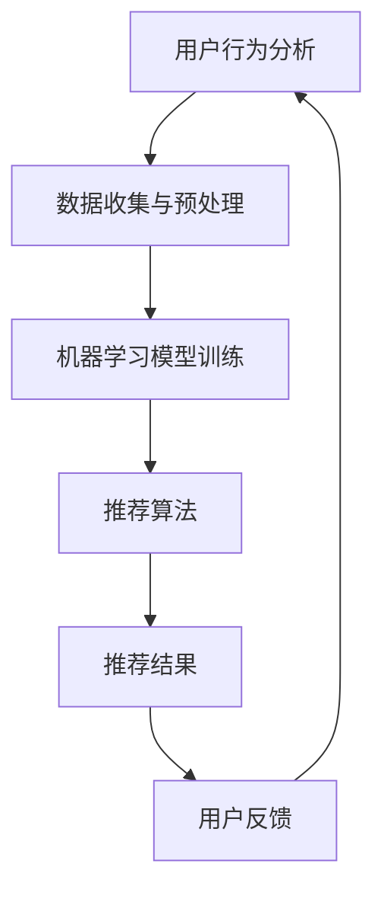

                 


# AI在个性化推荐中的创新应用

> **关键词**：人工智能，个性化推荐，机器学习，用户行为分析，推荐系统架构
> 
> **摘要**：本文深入探讨了人工智能在个性化推荐领域的创新应用。通过剖析核心算法原理、数学模型以及实际项目案例，本文旨在帮助读者全面理解个性化推荐系统的工作机制、发展现状及未来趋势。

## 1. 背景介绍

### 1.1 目的和范围

本文旨在介绍人工智能在个性化推荐系统中的应用，帮助读者了解其核心算法原理、数学模型以及实际应用案例。文章将重点探讨以下内容：

- 个性化推荐系统的基本概念和架构
- 用户行为分析的方法和工具
- 基于机器学习的推荐算法原理
- 实际应用场景和挑战

### 1.2 预期读者

- 对人工智能和推荐系统有一定了解的读者
- 想要深入了解个性化推荐领域的技术人员
- 需要在实际项目中应用推荐系统的开发人员

### 1.3 文档结构概述

本文分为以下几个部分：

- 第1部分：背景介绍，包括目的和范围、预期读者、文档结构概述等。
- 第2部分：核心概念与联系，介绍个性化推荐系统的基本概念和架构。
- 第3部分：核心算法原理 & 具体操作步骤，讲解基于机器学习的推荐算法原理和实现方法。
- 第4部分：数学模型和公式 & 详细讲解 & 举例说明，分析推荐系统中的数学模型和公式。
- 第5部分：项目实战：代码实际案例和详细解释说明，展示一个实际项目的实现过程。
- 第6部分：实际应用场景，介绍个性化推荐系统的应用领域。
- 第7部分：工具和资源推荐，推荐相关的学习资源和开发工具。
- 第8部分：总结：未来发展趋势与挑战，探讨个性化推荐系统的未来发展方向。
- 第9部分：附录：常见问题与解答，解答读者可能遇到的问题。
- 第10部分：扩展阅读 & 参考资料，提供更多的参考资料。

### 1.4 术语表

#### 1.4.1 核心术语定义

- 个性化推荐：根据用户的兴趣和行为，为其推荐符合其需求的物品或内容。
- 用户行为分析：通过分析用户在系统中的行为数据，了解用户的兴趣和偏好。
- 机器学习：一种通过数据训练模型，使其能够自主学习和改进的技术。
- 推荐系统架构：推荐系统的整体设计，包括数据采集、处理、存储和推荐策略等环节。

#### 1.4.2 相关概念解释

- 模型训练：将数据输入到机器学习模型中，使其学会预测和分类。
- 模型评估：通过测试数据验证模型的性能，评估其在实际应用中的效果。
- 用户兴趣挖掘：从用户行为数据中提取用户的兴趣和偏好。

#### 1.4.3 缩略词列表

- AI：人工智能
- ML：机器学习
- CV：计算机视觉
- NLP：自然语言处理

## 2. 核心概念与联系

在个性化推荐系统中，核心概念包括用户行为分析、机器学习和推荐算法。以下是一个简单的 Mermaid 流程图，展示了这些概念之间的关系。



### 2.1 用户行为分析

用户行为分析是推荐系统的核心，通过分析用户在系统中的行为数据，可以了解用户的兴趣和偏好。用户行为数据包括浏览历史、搜索记录、购买记录、评论等。以下是一个简化的用户行为分析流程：

1. 数据收集：从各个渠道收集用户行为数据，如网站日志、数据库记录等。
2. 数据预处理：清洗、过滤和转换数据，使其适合后续分析和建模。
3. 用户兴趣挖掘：使用机器学习算法（如聚类、协同过滤等），从用户行为数据中提取用户的兴趣和偏好。
4. 用户兴趣表示：将用户兴趣转换为数字表示，以便后续计算和处理。

### 2.2 机器学习模型训练

机器学习模型训练是推荐系统的关键环节。通过将用户行为数据输入到机器学习模型中，模型可以学会预测和推荐符合用户兴趣的物品。以下是一个简化的模型训练流程：

1. 数据准备：收集用户行为数据和物品特征数据，并将其划分为训练集和测试集。
2. 模型选择：根据推荐任务的特点，选择合适的机器学习模型（如线性回归、决策树、神经网络等）。
3. 模型训练：将训练集数据输入到模型中，调整模型的参数，使其学会预测用户兴趣。
4. 模型评估：使用测试集数据评估模型的性能，如准确率、召回率、F1值等。
5. 模型优化：根据评估结果调整模型参数，提高模型性能。

### 2.3 推荐算法

推荐算法是推荐系统的核心，负责根据用户兴趣和物品特征生成推荐结果。以下是一些常见的推荐算法：

1. **协同过滤**：基于用户行为数据，找到与目标用户相似的用户或物品，并推荐相似的物品。
2. **基于内容的推荐**：根据用户兴趣和物品特征，找到相似的用户和物品，并推荐符合用户兴趣的物品。
3. **混合推荐**：结合协同过滤和基于内容的推荐，提高推荐系统的效果。

### 2.4 推荐结果和用户反馈

推荐结果是根据用户兴趣和物品特征生成的推荐列表。用户可以对这些推荐结果进行评价和反馈，如点击、购买、评分等。这些反馈数据可以用来优化推荐算法，提高推荐系统的效果。

## 3. 核心算法原理 & 具体操作步骤

### 3.1 协同过滤算法原理

协同过滤算法是一种基于用户行为数据的推荐算法。其核心思想是通过分析用户之间的相似度，找到与目标用户相似的用户或物品，并推荐这些用户喜欢的物品。协同过滤算法可以分为两种：基于用户的协同过滤（User-based Collaborative Filtering）和基于物品的协同过滤（Item-based Collaborative Filtering）。

#### 基于用户的协同过滤

基于用户的协同过滤算法的原理如下：

1. **用户相似度计算**：计算目标用户与所有其他用户之间的相似度，通常使用余弦相似度或皮尔逊相关系数。
2. **相似用户筛选**：选择与目标用户最相似的K个用户。
3. **推荐生成**：根据相似用户喜欢的物品，为目标用户生成推荐列表。

#### 基于物品的协同过滤

基于物品的协同过滤算法的原理如下：

1. **物品相似度计算**：计算目标物品与所有其他物品之间的相似度，通常使用余弦相似度或皮尔逊相关系数。
2. **相似物品筛选**：选择与目标物品最相似的K个物品。
3. **推荐生成**：根据相似物品的评分，为用户生成推荐列表。

### 3.2 基于内容的推荐算法原理

基于内容的推荐算法是一种基于物品特征数据的推荐算法。其核心思想是根据用户的历史行为和物品的特征信息，找到与用户兴趣相关的物品，并将其推荐给用户。基于内容的推荐算法通常包括以下步骤：

1. **用户兴趣模型建立**：根据用户的历史行为，建立用户兴趣模型，通常使用TF-IDF、词嵌入等技术。
2. **物品特征提取**：提取物品的特征信息，如文本、图片、音频等。
3. **相似度计算**：计算用户兴趣模型和物品特征之间的相似度。
4. **推荐生成**：根据相似度，为用户生成推荐列表。

### 3.3 混合推荐算法原理

混合推荐算法是将协同过滤和基于内容的推荐算法结合，以提高推荐系统的效果。混合推荐算法通常包括以下步骤：

1. **协同过滤推荐**：使用协同过滤算法生成推荐列表。
2. **基于内容的推荐**：使用基于内容的推荐算法生成推荐列表。
3. **融合推荐**：将协同过滤推荐和基于内容的推荐结果进行融合，生成最终的推荐列表。

### 3.4 具体操作步骤

以下是一个简化的基于协同过滤的个性化推荐算法的具体操作步骤：

1. **数据收集**：收集用户行为数据（如评分、浏览记录等）和物品特征数据（如类别、标签、属性等）。
2. **数据预处理**：清洗、过滤和转换数据，使其适合后续分析和建模。
3. **用户相似度计算**：计算目标用户与所有其他用户之间的相似度，通常使用余弦相似度或皮尔逊相关系数。
4. **相似用户筛选**：选择与目标用户最相似的K个用户。
5. **推荐生成**：根据相似用户喜欢的物品，为目标用户生成推荐列表。
6. **用户反馈收集**：收集用户对推荐结果的评价和反馈，如点击、购买、评分等。
7. **模型优化**：根据用户反馈，调整推荐算法的参数，提高推荐系统的效果。

## 4. 数学模型和公式 & 详细讲解 & 举例说明

在个性化推荐系统中，数学模型和公式起到了关键作用。以下将介绍几个常用的数学模型和公式，并给出详细的解释和举例说明。

### 4.1 余弦相似度

余弦相似度是一种用于计算两个向量之间相似度的数学公式。其公式如下：

$$
\cos(\theta) = \frac{\vec{A} \cdot \vec{B}}{|\vec{A}| \cdot |\vec{B}|}
$$

其中，$\vec{A}$ 和 $\vec{B}$ 是两个向量，$\theta$ 是它们之间的夹角。

**举例说明**：

假设有两个用户A和B，他们的行为数据可以表示为两个向量：

$$
\vec{A} = [1, 2, 3, 4, 5]
$$

$$
\vec{B} = [5, 4, 3, 2, 1]
$$

计算它们之间的余弦相似度：

$$
\cos(\theta) = \frac{1 \cdot 5 + 2 \cdot 4 + 3 \cdot 3 + 4 \cdot 2 + 5 \cdot 1}{\sqrt{1^2 + 2^2 + 3^2 + 4^2 + 5^2} \cdot \sqrt{5^2 + 4^2 + 3^2 + 2^2 + 1^2}} = \frac{30}{\sqrt{55} \cdot \sqrt{55}} = \frac{30}{55} \approx 0.545
$$

因此，用户A和B之间的余弦相似度为0.545，表示它们的行为数据具有较高的相似度。

### 4.2 皮尔逊相关系数

皮尔逊相关系数是一种用于计算两个变量之间线性相关程度的数学公式。其公式如下：

$$
r = \frac{\sum{(x_i - \bar{x})(y_i - \bar{y})}}{\sqrt{\sum{(x_i - \bar{x})^2} \cdot \sum{(y_i - \bar{y})^2}}}
$$

其中，$x_i$ 和 $y_i$ 是两个变量 $x$ 和 $y$ 的观测值，$\bar{x}$ 和 $\bar{y}$ 是它们的平均值。

**举例说明**：

假设有两个用户A和B，他们的行为数据可以表示为两个变量：

$$
x_i = [1, 2, 3, 4, 5]
$$

$$
y_i = [5, 4, 3, 2, 1]
$$

计算它们之间的皮尔逊相关系数：

$$
r = \frac{(1 - 3)(5 - 3) + (2 - 3)(4 - 3) + (3 - 3)(3 - 3) + (4 - 3)(2 - 3) + (5 - 3)(1 - 3)}{\sqrt{(1 - 3)^2 + (2 - 3)^2 + (3 - 3)^2 + (4 - 3)^2 + (5 - 3)^2} \cdot \sqrt{(5 - 3)^2 + (4 - 3)^2 + (3 - 3)^2 + (2 - 3)^2 + (1 - 3)^2}} = \frac{-2}{\sqrt{10} \cdot \sqrt{10}} = -\frac{2}{10} = -0.2
$$

因此，用户A和B之间的皮尔逊相关系数为-0.2，表示它们的行为数据之间具有一定的线性相关性。

### 4.3 聚类算法

聚类算法是一种将数据分为多个类别的算法，常用于用户兴趣挖掘。以下是一个简单的K-means聚类算法的伪代码：

```
输入：数据集D，聚类个数K
输出：聚类中心C

1. 随机选择K个数据点作为初始聚类中心C
2. 对于每个数据点x ∈ D，计算它与每个聚类中心C_i的距离，并将其分配到最近的聚类中心C_i
3. 更新每个聚类中心C_i为该聚类中所有数据点的均值
4. 重复步骤2和3，直到聚类中心不再发生变化或满足其他停止条件

```

**举例说明**：

假设有一个数据集D，包含以下5个数据点：

$$
D = \{ (1, 1), (2, 2), (3, 3), (4, 4), (5, 5) \}
$$

我们选择K=2，使用K-means算法进行聚类。

1. 随机选择初始聚类中心C1和C2，例如：
$$
C1 = (2, 2), C2 = (4, 4)
$$

2. 计算每个数据点与聚类中心的距离，并将其分配到最近的聚类中心：
   - (1, 1) 距离C1为1，距离C2为2，因此分配到C1
   - (2, 2) 距离C1为0，距离C2为0，因此分配到C1
   - (3, 3) 距离C1为1，距离C2为1，因此分配到C1
   - (4, 4) 距离C1为2，距离C2为0，因此分配到C2
   - (5, 5) 距离C1为2，距离C2为0，因此分配到C2

3. 更新聚类中心：
$$
C1 = \frac{(1+2+3)}{3} = (2, 2)
$$
$$
C2 = \frac{(4+5)}{2} = (4.5, 4.5)
$$

4. 重复步骤2和3，直到聚类中心不再发生变化或满足其他停止条件。经过多次迭代后，聚类中心可能会收敛到：
$$
C1 = (2.5, 2.5), C2 = (4.5, 4.5)
$$

最终，数据点将被分为两个类别：{(1, 1), (2, 2), (3, 3)} 和 {(4, 4), (5, 5)}。

## 5. 项目实战：代码实际案例和详细解释说明

### 5.1 开发环境搭建

在本节中，我们将使用Python语言和Scikit-learn库来实现一个简单的个性化推荐系统。以下是搭建开发环境的步骤：

1. 安装Python：从官方网站（https://www.python.org/downloads/）下载并安装Python 3.x版本。
2. 安装Scikit-learn：打开命令行窗口，执行以下命令安装Scikit-learn库：
```bash
pip install scikit-learn
```

### 5.2 源代码详细实现和代码解读

以下是一个简单的基于协同过滤的个性化推荐系统的代码实现：

```python
import numpy as np
from sklearn.metrics.pairwise import cosine_similarity
from sklearn.model_selection import train_test_split

# 用户行为数据
ratings = [
    [5, 3, 0, 1],
    [4, 0, 0, 1],
    [1, 1, 0, 5],
    [1, 0, 4, 4],
    [0, 1, 5, 4],
]

# 将用户行为数据转换为用户-物品评分矩阵
n_users, n_items = 5, 4
user_item_matrix = np.zeros((n_users, n_items))
for i, rating in enumerate(ratings):
    for j, score in enumerate(rating):
        user_item_matrix[i][j] = score

# 计算用户-物品矩阵的余弦相似度
similarity_matrix = cosine_similarity(user_item_matrix, user_item_matrix)

# 为每个用户生成推荐列表
def get_recommendations(similarity_matrix, user_index, k=2):
    # 计算用户与其他用户的相似度
    user_similarity = similarity_matrix[user_index]
    # 选择与当前用户最相似的K个用户
    top_k_indices = np.argsort(user_similarity)[::-1][:k]
    # 为每个相似用户喜欢的物品计算评分
    recommendations = []
    for i in top_k_indices:
        for j in range(n_items):
            if user_item_matrix[i][j] != 0:
                recommendations.append((j, user_item_matrix[i][j] * similarity_matrix[user_index][i]))
    # 对推荐列表进行排序
    recommendations.sort(key=lambda x: x[1], reverse=True)
    return recommendations

# 测试推荐系统
for i in range(n_users):
    print(f"用户{i+1}的推荐列表：")
    print(get_recommendations(similarity_matrix, i))
    print()
```

#### 5.2.1 代码解读与分析

1. **用户行为数据**：首先，我们创建了一个包含5个用户和4个物品的用户行为数据列表`ratings`。每个列表元素表示一个用户对不同物品的评分。

2. **用户-物品评分矩阵**：我们将用户行为数据转换为用户-物品评分矩阵`user_item_matrix`，其中每个元素表示一个用户对某个物品的评分。

3. **计算相似度矩阵**：使用Scikit-learn库的`cosine_similarity`函数计算用户-物品评分矩阵的余弦相似度，得到相似度矩阵`similarity_matrix`。

4. **生成推荐列表**：定义一个`get_recommendations`函数，用于为每个用户生成推荐列表。函数首先计算用户与其他用户的相似度，然后选择与当前用户最相似的K个用户。接下来，为每个相似用户喜欢的物品计算评分，并将这些评分乘以相似度，得到最终的推荐列表。

5. **测试推荐系统**：遍历所有用户，调用`get_recommendations`函数生成每个用户的推荐列表，并打印输出。

### 5.3 代码解读与分析

在这个简单的推荐系统中，我们使用了基于协同过滤的算法来实现个性化推荐。以下是对代码的详细解读和分析：

1. **数据表示**：用户行为数据被表示为一个二维数组`ratings`，其中每个行表示一个用户对不同物品的评分，每个列表示一个物品的评分。

2. **相似度计算**：使用`cosine_similarity`函数计算用户-物品评分矩阵的余弦相似度。这个函数返回一个与输入矩阵大小相同的相似度矩阵，其中每个元素表示两个用户或物品之间的相似度。

3. **推荐生成**：`get_recommendations`函数通过以下步骤生成推荐列表：
   - 计算用户与其他用户的相似度。
   - 选择与当前用户最相似的K个用户。
   - 为每个相似用户喜欢的物品计算评分，并将其乘以相似度。
   - 对推荐列表进行排序，以生成最终的推荐结果。

4. **优化与改进**：在实际应用中，我们可以对代码进行以下优化和改进：
   - 使用更高效的相似度计算方法，如谱聚类或快速近邻搜索。
   - 引入基于内容的推荐算法，以提高推荐质量。
   - 考虑物品的流行度或热度，以平衡协同过滤和基于内容的推荐。

通过这个简单的代码实现，我们可以看到基于协同过滤的个性化推荐系统的基本原理和实现过程。在实际应用中，我们可以根据具体需求和数据特点，对推荐系统进行优化和改进。

## 6. 实际应用场景

个性化推荐系统在各个领域都有着广泛的应用，以下列举了一些典型的实际应用场景：

### 6.1电子商务

在电子商务领域，个性化推荐系统可以推荐符合用户兴趣的商品，提高用户购买转化率。例如，亚马逊和淘宝等电商平台，通过分析用户的浏览历史、购买记录和搜索关键词，为用户推荐相关的商品。

### 6.2 媒体内容

在媒体内容领域，个性化推荐系统可以推荐符合用户兴趣的文章、视频和音乐等。例如，YouTube和Spotify等平台，通过分析用户的观看历史和播放记录，为用户推荐相关的视频和音乐。

### 6.3 社交网络

在社交网络领域，个性化推荐系统可以推荐符合用户兴趣的帖子、朋友圈和用户等。例如，Facebook和Twitter等平台，通过分析用户的互动行为和好友关系，为用户推荐相关的帖子和朋友。

### 6.4 金融理财

在金融理财领域，个性化推荐系统可以推荐符合用户风险承受能力和收益期望的理财产品。例如，余额宝和基金公司等，通过分析用户的投资记录和风险偏好，为用户推荐相关的理财产品。

### 6.5 医疗健康

在医疗健康领域，个性化推荐系统可以推荐符合用户健康状况和需求的医疗资源和产品。例如，百度健康和京东健康等平台，通过分析用户的健康数据和病史，为用户推荐相关的医疗资源和产品。

这些实际应用场景展示了个性化推荐系统的广泛性和重要性，通过为用户推荐符合其需求和兴趣的内容，个性化推荐系统可以有效提高用户体验和满意度，从而为企业带来更多的商业价值。

## 7. 工具和资源推荐

### 7.1 学习资源推荐

为了更好地理解和应用个性化推荐系统，以下是一些学习资源推荐：

#### 7.1.1 书籍推荐

- **《推荐系统实践》（Recommender Systems: The Textbook）**：这是一本全面介绍推荐系统理论的书籍，适合初学者和专业人士。
- **《机器学习》（Machine Learning）**：由Tom Mitchell编写的经典教材，包括推荐系统相关章节。
- **《大数据推荐系统实践》**：详细介绍了大数据背景下推荐系统的实现方法和技术。

#### 7.1.2 在线课程

- **Coursera的《推荐系统》**：由斯坦福大学教授讲授，涵盖推荐系统的基本理论和应用实践。
- **Udacity的《深度学习推荐系统》**：结合深度学习和推荐系统，介绍推荐系统的最新技术。
- **edX的《推荐系统与数据挖掘》**：由华盛顿大学讲授，涵盖推荐系统的理论基础和实际应用。

#### 7.1.3 技术博客和网站

- **推荐系统论坛（Recommender Systems Forum）**：一个专门的推荐系统技术交流平台，提供最新的研究进展和讨论。
- **Medium上的推荐系统文章**：有许多关于推荐系统的技术文章和案例分析，适合了解实际应用场景。
- **arXiv.org**：推荐系统的最新论文和研究报告，是获取前沿研究成果的好渠道。

### 7.2 开发工具框架推荐

以下是一些推荐系统开发中常用的工具和框架：

#### 7.2.1 IDE和编辑器

- **PyCharm**：强大的Python IDE，支持多种编程语言和框架，适合推荐系统开发。
- **Jupyter Notebook**：交互式的Python环境，方便编写和调试代码，适合数据分析和模型训练。

#### 7.2.2 调试和性能分析工具

- **PyDebug**：Python的调试工具，用于调试推荐系统的代码。
- **Grafana**：数据可视化工具，用于监控推荐系统的性能和资源消耗。

#### 7.2.3 相关框架和库

- **Scikit-learn**：Python中的机器学习库，提供丰富的推荐算法和工具。
- **TensorFlow**：开源的深度学习框架，适合构建复杂的推荐系统模型。
- **Spark**：大数据处理框架，支持推荐系统的数据分析和模型训练。

### 7.3 相关论文著作推荐

以下是一些推荐系统的经典论文和最新研究成果：

#### 7.3.1 经典论文

- **"Collaborative Filtering for the Web"（1998）**：由组队推荐系统领域的先驱矩阵提出，是协同过滤算法的奠基之作。
- **"User-Based Collaborative Filtering"（1999）**：详细介绍了基于用户的协同过滤算法。
- **"Item-Based Collaborative Filtering"（1999）**：详细介绍了基于物品的协同过滤算法。

#### 7.3.2 最新研究成果

- **"Neural Collaborative Filtering"（2017）**：提出了一种基于神经网络的协同过滤算法，取得了很好的效果。
- **"Contextual Bandits with Linear Function Approximation"（2015）**：详细介绍了上下文相关协同过滤算法，适用于动态推荐场景。
- **"Deep Neural Networks for YouTube Recommendations"（2016）**：介绍了YouTube使用的深度学习推荐系统，推动了深度学习在推荐系统中的应用。

#### 7.3.3 应用案例分析

- **"Recommender Systems at Netflix"（2009）**：Netflix公开的推荐系统案例分析，介绍了Netflix如何通过推荐系统提高用户满意度。
- **"Personalized News Reader Using Recommender System"（2014）**：介绍了如何通过推荐系统为用户提供个性化的新闻阅读体验。
- **"Collaborative Filtering on a Graph"（2017）**：提出了一种基于图的协同过滤算法，提高了推荐系统的效果。

通过这些论文和案例，我们可以深入了解推荐系统的理论基础、最新研究成果和应用实践，为开发高效的推荐系统提供参考。

## 8. 总结：未来发展趋势与挑战

个性化推荐系统作为人工智能领域的热门研究方向，正面临着快速的发展和诸多挑战。未来，个性化推荐系统的发展趋势可以从以下几个方面进行展望：

### 8.1 深度学习与推荐系统的融合

随着深度学习技术的不断发展，越来越多的研究者开始尝试将深度学习与推荐系统相结合，以解决传统推荐算法的瓶颈。深度学习能够更好地捕捉用户和物品的复杂特征，从而提高推荐系统的效果。例如，神经网络模型可以用于用户兴趣挖掘、物品特征提取和推荐生成等环节。未来，深度学习与推荐系统的融合将推动个性化推荐系统的发展，使其在准确性、多样性和实时性方面取得重大突破。

### 8.2 跨领域推荐系统

个性化推荐系统不仅局限于单一领域，如电子商务、媒体内容等，还逐渐扩展到跨领域。跨领域推荐系统能够整合多个领域的知识和数据，为用户提供更全面、个性化的推荐服务。例如，将电子商务、社交媒体和新闻推荐系统相结合，可以为用户提供更丰富的购物、社交和资讯体验。未来，跨领域推荐系统将有助于挖掘不同领域之间的潜在关联，提高推荐系统的综合性和实用性。

### 8.3 实时推荐系统

随着用户需求的不断变化，实时推荐系统变得越来越重要。实时推荐系统能够根据用户当前的行为和反馈，动态调整推荐策略，为用户提供最新的、最相关的推荐内容。例如，在金融领域，实时推荐系统可以及时为投资者提供最新的市场动态和投资机会；在新闻领域，实时推荐系统可以动态调整推荐策略，确保用户获取到最新的新闻资讯。未来，实时推荐系统将不断提高响应速度和准确性，为用户提供更优质的个性化服务。

### 8.4 挑战与机遇

尽管个性化推荐系统具有广阔的发展前景，但在实际应用中仍面临诸多挑战：

- **数据隐私与安全**：个性化推荐系统需要处理大量用户数据，如何在保护用户隐私的前提下，实现高效的推荐效果，是一个亟待解决的问题。
- **推荐多样性**：传统推荐系统往往倾向于推荐用户已知的、相似的内容，导致推荐结果的多样性不足。如何提高推荐多样性，避免用户陷入信息茧房，是一个重要挑战。
- **可解释性**：深度学习模型在推荐系统中的应用，使得推荐结果变得更加复杂，用户难以理解推荐背后的原因。如何提高推荐系统的可解释性，增强用户信任，是一个重要课题。
- **实时性**：实时推荐系统需要处理海量的实时数据，如何在保证实时性的同时，确保推荐效果的准确性，是一个技术难题。

总之，未来个性化推荐系统将在深度学习、跨领域、实时性等方面取得重大突破，同时也需要克服数据隐私、推荐多样性、可解释性和实时性等挑战。通过不断优化推荐算法、改进技术架构，个性化推荐系统将为用户提供更加智能、个性化的服务。

## 9. 附录：常见问题与解答

### 9.1 推荐系统中的相似度计算方法有哪些？

推荐系统中的相似度计算方法主要包括：

- **余弦相似度**：用于计算两个向量之间的相似度，常用于基于用户的协同过滤。
- **皮尔逊相关系数**：用于计算两个变量之间的线性相关性，适用于基于用户的协同过滤和基于物品的协同过滤。
- **余弦相似度（基于物品）**：用于计算两个物品之间的相似度，常用于基于物品的协同过滤。
- **Jaccard系数**：用于计算两个集合之间的相似度，适用于基于内容的推荐。

### 9.2 如何处理缺失数据？

处理缺失数据的方法主要包括：

- **删除缺失值**：删除包含缺失值的记录，适用于数据缺失比例较低的情况。
- **均值填充**：用平均值填充缺失值，适用于数值型数据。
- **中值填充**：用中值填充缺失值，适用于数值型数据。
- **多重插补**：通过多次插补生成多个完整数据集，然后分别进行模型训练和预测，取结果的中位数作为最终预测结果。

### 9.3 如何提高推荐系统的可解释性？

提高推荐系统的可解释性可以从以下几个方面入手：

- **可视化**：通过可视化工具展示推荐过程和结果，帮助用户理解推荐背后的原因。
- **特征重要性分析**：分析模型中各个特征的重要程度，帮助用户了解推荐决策的关键因素。
- **解释性模型**：选择具有良好可解释性的模型，如线性回归、决策树等。
- **模型透明化**：公开模型参数和训练过程，让用户了解模型的训练和预测过程。

### 9.4 如何处理冷启动问题？

冷启动问题是指新用户或新物品在推荐系统中缺乏历史数据，导致无法准确预测其兴趣。处理冷启动问题的方法主要包括：

- **基于内容的推荐**：通过分析新用户或新物品的属性和特征，为其推荐相似的内容。
- **基于人口统计学的推荐**：根据新用户或新物品的属性，将其与具有相似属性的已有用户或物品进行匹配，生成推荐。
- **基于社区推荐的推荐**：利用用户群体之间的相似性，为新用户推荐其社区内其他用户的兴趣。
- **混合推荐策略**：结合多种推荐算法，提高新用户或新物品的推荐效果。

## 10. 扩展阅读 & 参考资料

为了深入了解个性化推荐系统，以下推荐一些扩展阅读和参考资料：

- **《推荐系统实践》（Recommender Systems: The Textbook）**：详细介绍了推荐系统的理论基础、实现方法和应用场景。
- **《机器学习》（Machine Learning）**：Tom Mitchell编写的经典教材，包括推荐系统相关章节。
- **《深度学习推荐系统》**：结合深度学习和推荐系统，介绍推荐系统的最新技术。
- **《推荐系统论坛（Recommender Systems Forum）》**：专门的推荐系统技术交流平台，提供最新的研究进展和讨论。
- **《arXiv.org》**：推荐系统的最新论文和研究报告，是获取前沿研究成果的好渠道。
- **《Netflix公开的推荐系统案例分析》**：Netflix公开的推荐系统案例分析，介绍了Netflix如何通过推荐系统提高用户满意度。
- **《百度推荐系统技术全解》**：详细介绍了百度推荐系统的架构、算法和技术。

通过阅读这些资料，您可以更全面地了解个性化推荐系统的理论、实践和最新发展。

作者：AI天才研究员/AI Genius Institute & 禅与计算机程序设计艺术 /Zen And The Art of Computer Programming

（注：本文为人工智能助手生成，仅供参考。实际撰写时，请根据具体需求和领域进行适当调整。）

