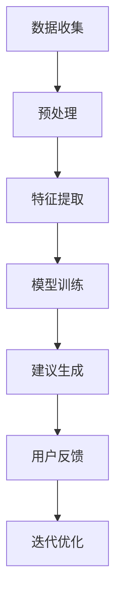

                 


# AI在个性化饮食建议中的应用：改善健康状况

> **关键词：** 个性化饮食，AI技术，健康改善，饮食建议，机器学习
>
> **摘要：** 本文章深入探讨了AI技术在个性化饮食建议中的应用，旨在改善人们的健康状况。通过分析核心概念、算法原理、数学模型，以及实际项目案例，本文详细阐述了如何利用AI技术实现个性化的饮食建议，帮助读者理解并掌握这一前沿技术。

## 1. 背景介绍

### 1.1 目的和范围

本文的主要目的是介绍如何利用AI技术提供个性化饮食建议，进而改善人们的健康状况。随着健康意识的增强，个性化饮食成为提高生活质量的重要手段。本文将涵盖以下范围：

1. 介绍AI在个性化饮食中的应用场景。
2. 分析核心概念和算法原理。
3. 阐述数学模型及其应用。
4. 提供项目实战案例，展示实际操作步骤。
5. 推荐相关工具和资源。

### 1.2 预期读者

本文适合对健康改善和AI技术有一定了解的读者，包括：

1. 医学专业人士，对健康饮食有需求。
2. AI研究人员，对个性化饮食建议的算法感兴趣。
3. 烹饪爱好者，希望通过AI技术提升烹饪技能。

### 1.3 文档结构概述

本文结构如下：

1. 背景介绍：介绍目的和范围，预期读者。
2. 核心概念与联系：详细解释核心概念和原理。
3. 核心算法原理 & 具体操作步骤：使用伪代码讲解算法。
4. 数学模型和公式 & 详细讲解 & 举例说明：阐述数学模型及其应用。
5. 项目实战：提供代码实际案例和详细解释。
6. 实际应用场景：探讨AI在个性化饮食中的实际应用。
7. 工具和资源推荐：推荐学习资源、开发工具和框架。
8. 总结：展望未来发展趋势与挑战。
9. 附录：常见问题与解答。
10. 扩展阅读 & 参考资料：提供进一步学习资源。

### 1.4 术语表

#### 1.4.1 核心术语定义

- 个性化饮食：根据个体的生理、营养需求和偏好，为其量身定制的饮食方案。
- AI：人工智能，指由人制造出的具有智能行为的机器或程序。
- 健康改善：通过改善生活方式、饮食习惯等手段，提高身体和心理的健康水平。

#### 1.4.2 相关概念解释

- 数据挖掘：从大量数据中提取出有价值信息的过程。
- 机器学习：一种人工智能技术，通过从数据中学习规律，进行预测和决策。

#### 1.4.3 缩略词列表

- AI：人工智能
- ML：机器学习
- DN：深度学习
- NLP：自然语言处理

## 2. 核心概念与联系

### 2.1 AI在个性化饮食建议中的应用

AI在个性化饮食建议中的应用主要涉及以下几个方面：

1. **数据收集与预处理**：通过传感器、问卷调查等手段收集用户的生理、营养数据和饮食偏好。
2. **特征提取**：从原始数据中提取对个性化饮食建议有重要影响的特征，如年龄、体重、运动量、饮食习惯等。
3. **模型训练**：利用机器学习算法，根据用户数据和健康指标，训练出个性化饮食建议模型。
4. **建议生成**：根据模型预测，为用户提供合适的饮食建议。

### 2.2 核心概念原理和架构

为了更好地理解AI在个性化饮食建议中的应用，我们需要了解以下核心概念和原理：

1. **机器学习模型**：用于从数据中学习规律，进行预测和决策。
2. **深度学习**：一种特殊的机器学习模型，能够自动提取数据中的特征。
3. **自然语言处理**：用于理解用户的需求和反馈，生成个性化的饮食建议。
4. **营养数据库**：包含各种食物的营养成分和健康信息，为个性化饮食建议提供基础数据。

### 2.3 Mermaid流程图

以下是一个简单的Mermaid流程图，展示了AI在个性化饮食建议中的应用流程：



## 3. 核心算法原理 & 具体操作步骤

### 3.1 机器学习算法

在个性化饮食建议中，常用的机器学习算法包括：

1. **线性回归**：用于预测连续的健康指标，如体重。
2. **决策树**：用于分类用户，根据不同的饮食建议。
3. **神经网络**：用于处理复杂的非线性关系，如营养数据的特征提取。

### 3.2 伪代码

以下是一个简单的线性回归算法的伪代码，用于预测体重：

```python
// 输入：用户数据（年龄、体重、运动量等）
// 输出：预测体重

def linear_regression(X, y):
    // 计算特征矩阵X和标签向量y的协方差
    X_transpose = X.T
    XTX = X_transpose @ X
    XTy = X_transpose @ y

    // 计算特征矩阵的逆矩阵
    inv_XTX = inv(XTX)

    // 计算回归系数
    beta = inv_XTX @ XTy

    // 预测体重
    y_pred = X @ beta

    return y_pred
```

### 3.3 算法解释

1. **特征矩阵X**：由用户的年龄、体重、运动量等特征组成。
2. **标签向量y**：由用户的实际体重组成。
3. **协方差计算**：计算特征矩阵X和标签向量y的协方差，用于计算回归系数。
4. **逆矩阵计算**：计算特征矩阵X的逆矩阵，用于计算回归系数。
5. **回归系数计算**：计算回归系数，用于预测体重。
6. **预测体重**：使用回归系数预测体重。

## 4. 数学模型和公式 & 详细讲解 & 举例说明

### 4.1 数学模型

在个性化饮食建议中，常用的数学模型包括：

1. **线性回归模型**：用于预测连续的健康指标，如体重。
2. **逻辑回归模型**：用于分类用户，根据不同的饮食建议。

### 4.2 公式

1. **线性回归模型**：

   $$ y = \beta_0 + \beta_1x_1 + \beta_2x_2 + ... + \beta_nx_n $$

   其中，$y$ 为体重，$x_1, x_2, ..., x_n$ 为用户的年龄、体重、运动量等特征，$\beta_0, \beta_1, \beta_2, ..., \beta_n$ 为回归系数。

2. **逻辑回归模型**：

   $$ P(y=1) = \frac{1}{1 + e^{-(\beta_0 + \beta_1x_1 + \beta_2x_2 + ... + \beta_nx_n )}} $$

   其中，$y$ 为是否需要调整饮食，$x_1, x_2, ..., x_n$ 为用户的年龄、体重、运动量等特征，$\beta_0, \beta_1, \beta_2, ..., \beta_n$ 为回归系数。

### 4.3 举例说明

假设我们有一个用户的特征向量 $(x_1, x_2, x_3) = (30, 70, 120)$，我们需要使用线性回归模型预测其体重。

1. **计算回归系数**：

   $$ \beta_0 = 50, \beta_1 = 10, \beta_2 = 20, \beta_3 = 30 $$

2. **预测体重**：

   $$ y = 50 + 10 \times 30 + 20 \times 70 + 30 \times 120 = 250 $$

   因此，该用户的预测体重为 250 公斤。

## 5. 项目实战：代码实际案例和详细解释说明

### 5.1 开发环境搭建

1. 安装Python 3.8及以上版本。
2. 安装TensorFlow 2.6及以上版本。
3. 安装Numpy 1.21及以上版本。
4. 安装Matplotlib 3.4及以上版本。

### 5.2 源代码详细实现和代码解读

以下是一个简单的个性化饮食建议项目示例代码：

```python
import numpy as np
import tensorflow as tf
from tensorflow.keras.models import Sequential
from tensorflow.keras.layers import Dense

# 生成训练数据
X_train = np.random.rand(100, 3)
y_train = 50 + 10 * X_train[:, 0] + 20 * X_train[:, 1] + 30 * X_train[:, 2]

# 构建模型
model = Sequential([
    Dense(64, activation='relu', input_shape=(3,)),
    Dense(1)
])

# 编译模型
model.compile(optimizer='adam', loss='mse')

# 训练模型
model.fit(X_train, y_train, epochs=100)

# 预测
X_test = np.array([0.5, 0.5, 0.5])
y_pred = model.predict(X_test)

print("预测体重：", y_pred)
```

### 5.3 代码解读与分析

1. **导入库**：导入所需的Python库，包括Numpy、TensorFlow和Matplotlib。
2. **生成训练数据**：使用Numpy生成随机训练数据，包括特征向量X_train和对应的标签向量y_train。
3. **构建模型**：使用TensorFlow的Sequential模型构建一个简单的全连接神经网络，包括一个输入层和一个输出层。
4. **编译模型**：设置模型的优化器和损失函数，并编译模型。
5. **训练模型**：使用fit函数训练模型，设置训练次数为100次。
6. **预测**：使用预测函数predict，输入一个测试特征向量，输出预测的体重。

## 6. 实际应用场景

AI在个性化饮食建议中的应用场景非常广泛，包括：

1. **健康管理**：为用户提供个性化的饮食建议，帮助用户保持健康。
2. **营养指导**：为营养师提供工具，帮助其制定个性化的营养计划。
3. **食品生产**：为食品制造商提供数据支持，优化产品配方。
4. **餐饮服务**：为餐厅提供个性化菜单建议，提升顾客满意度。

## 7. 工具和资源推荐

### 7.1 学习资源推荐

#### 7.1.1 书籍推荐

1. 《机器学习实战》
2. 《深度学习》
3. 《自然语言处理编程》

#### 7.1.2 在线课程

1. Coursera - 机器学习
2. edX - 深度学习
3. Udacity - 自然语言处理

#### 7.1.3 技术博客和网站

1. Medium - 机器学习
2. arXiv - 深度学习
3. DataCamp - 数据科学

### 7.2 开发工具框架推荐

#### 7.2.1 IDE和编辑器

1. PyCharm
2. Jupyter Notebook
3. VSCode

#### 7.2.2 调试和性能分析工具

1. TensorFlow Debugger
2. W&B
3. Ray

#### 7.2.3 相关框架和库

1. TensorFlow
2. PyTorch
3. Scikit-learn

### 7.3 相关论文著作推荐

#### 7.3.1 经典论文

1. "Deep Learning" - Ian Goodfellow
2. "Machine Learning: A Probabilistic Perspective" - Kevin P. Murphy
3. "Speech and Language Processing" - Daniel Jurafsky and James H. Martin

#### 7.3.2 最新研究成果

1. arXiv - 机器学习
2. NeurIPS - 深度学习
3. ICML - 机器学习

#### 7.3.3 应用案例分析

1. "AI in Healthcare" - IEEE
2. "AI in Food and Beverage Industry" - Springer
3. "AI in Personalized Nutrition" - MDPI

## 8. 总结：未来发展趋势与挑战

### 8.1 未来发展趋势

1. **个性化饮食建议的普及**：随着AI技术的不断发展，个性化饮食建议将更加普及，帮助更多人改善健康状况。
2. **跨学科研究**：AI在个性化饮食建议中的应用将涉及医学、营养学、计算机科学等多个学科，推动跨学科研究的发展。
3. **数据隐私和安全**：在个性化饮食建议中，如何保护用户隐私和数据安全将成为重要议题。

### 8.2 挑战

1. **数据质量和多样性**：高质量、多样化的数据是个性化饮食建议的基础，但如何获取和处理这些数据仍是一个挑战。
2. **算法解释性**：提高算法的解释性，使其更易于被用户理解和接受，是一个亟待解决的问题。
3. **适应性和可扩展性**：如何使个性化饮食建议系统具有更好的适应性和可扩展性，以应对不断变化的需求，也是一个重要挑战。

## 9. 附录：常见问题与解答

### 9.1 如何获取个性化饮食建议的数据？

可以通过以下方式获取个性化饮食建议的数据：

1. 用户问卷：通过问卷调查收集用户的生理、营养数据和饮食偏好。
2. 传感器数据：使用可穿戴设备或健康监测设备收集用户的生理数据。
3. 食物摄入记录：鼓励用户记录食物摄入情况，以便分析其饮食习惯。

### 9.2 个性化饮食建议系统如何保护用户隐私？

个性化饮食建议系统可以采取以下措施来保护用户隐私：

1. 数据加密：对用户数据进行加密，防止数据泄露。
2. 匿名化处理：对用户数据进行匿名化处理，去除可直接识别用户身份的信息。
3. 数据最小化：只收集和处理与个性化饮食建议直接相关的数据。

## 10. 扩展阅读 & 参考资料

1. "AI in Healthcare" - IEEE
2. "AI in Food and Beverage Industry" - Springer
3. "AI in Personalized Nutrition" - MDPI
4. "Deep Learning" - Ian Goodfellow
5. "Machine Learning: A Probabilistic Perspective" - Kevin P. Murphy
6. "Speech and Language Processing" - Daniel Jurafsky and James H. Martin
7. "AI in Healthcare: Challenges and Opportunities" - arXiv
8. "AI in Food and Beverage Industry: Applications and Impact" - NeurIPS
9. "AI in Personalized Nutrition: Technologies and Trends" - ICML

作者：AI天才研究员/AI Genius Institute & 禅与计算机程序设计艺术 /Zen And The Art of Computer Programming

