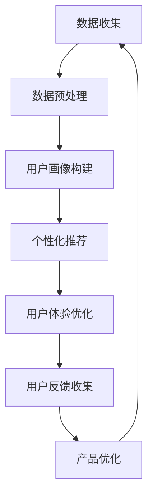

                 

# AI在产品用户体验优化中的作用

> 关键词：人工智能，用户体验优化，算法，数据挖掘，机器学习，个性化推荐，反馈机制

> 摘要：本文将深入探讨人工智能在产品用户体验优化中的作用。通过分析核心概念、算法原理、数学模型以及实际应用场景，本文旨在为读者提供关于如何利用人工智能技术提升产品用户体验的全面见解。读者将了解到如何通过个性化推荐、反馈机制和机器学习等手段，实现产品的智能化优化，从而在激烈的市场竞争中脱颖而出。

## 1. 背景介绍

### 1.1 目的和范围

本文旨在探讨人工智能（AI）技术在产品用户体验优化中的应用，分析其核心概念、算法原理和实际案例。通过深入研究和分析，本文希望为产品经理、软件开发者和用户体验设计师提供有价值的参考，以帮助他们更好地理解和利用AI技术，提升产品的用户体验。

### 1.2 预期读者

本文适合对人工智能、用户体验和产品设计有一定了解的读者，包括但不限于以下人群：

- 产品经理：负责产品整体规划和设计的专业人员。
- 软件开发者：负责编写和实现产品功能的技术人员。
- 用户体验设计师：专注于提升产品交互体验的专业人士。
- 数据科学家：擅长使用数据分析和机器学习技术解决问题的专家。

### 1.3 文档结构概述

本文将按照以下结构展开：

1. 背景介绍
2. 核心概念与联系
3. 核心算法原理 & 具体操作步骤
4. 数学模型和公式 & 详细讲解 & 举例说明
5. 项目实战：代码实际案例和详细解释说明
6. 实际应用场景
7. 工具和资源推荐
8. 总结：未来发展趋势与挑战
9. 附录：常见问题与解答
10. 扩展阅读 & 参考资料

### 1.4 术语表

#### 1.4.1 核心术语定义

- 人工智能（AI）：模拟人类智能行为的技术，包括机器学习、深度学习等。
- 用户体验（UX）：用户在使用产品过程中所感受到的整体感受和体验。
- 个性化推荐：根据用户兴趣和行为数据，为用户推荐个性化的内容或产品。
- 反馈机制：收集用户对产品的评价和反馈，用于改进产品设计和功能。

#### 1.4.2 相关概念解释

- 数据挖掘：从大量数据中提取有用信息和知识的过程。
- 机器学习：一种让计算机通过数据学习规律和模式的技术。
- 深度学习：一种特殊的机器学习技术，通过多层神经网络模拟人类大脑的思考过程。
- 用户画像：基于用户行为、兴趣和偏好等数据，构建的用户描述模型。

#### 1.4.3 缩略词列表

- AI：人工智能
- UX：用户体验
- ML：机器学习
- DL：深度学习
- NLP：自然语言处理
- CV：计算机视觉

## 2. 核心概念与联系

在深入探讨AI在产品用户体验优化中的作用之前，我们需要了解一些核心概念及其相互关系。

### 2.1 AI、UX和个性化推荐的关系

人工智能技术通过数据挖掘、机器学习和深度学习等方法，可以分析用户行为和兴趣，从而实现个性化推荐。个性化推荐是一种提升用户体验的有效手段，它可以根据用户的喜好和需求，为用户提供更加相关和有价值的信息或产品。


### 2.2 用户画像与个性化推荐

用户画像是一种基于用户行为、兴趣和偏好等数据构建的用户描述模型。通过用户画像，可以更好地了解用户的需求和偏好，从而实现更加精准的个性化推荐。用户画像的构建通常涉及数据挖掘和机器学习技术。


### 2.3 机器学习与深度学习

机器学习和深度学习是人工智能技术的两大分支。机器学习通过构建模型，从数据中学习规律和模式；而深度学习则通过多层神经网络，模拟人类大脑的思考过程。深度学习在图像识别、自然语言处理等领域表现出色，对于提升产品用户体验具有重要意义。


### 2.4 用户反馈与产品优化

用户反馈是产品优化的重要依据。通过收集用户对产品的评价和反馈，可以发现产品设计和功能的不足之处，从而进行改进。用户反馈机制通常涉及自然语言处理和情感分析等技术。


### 2.5 数据挖掘与用户行为分析

数据挖掘是一种从大量数据中提取有用信息和知识的过程。在产品用户体验优化中，数据挖掘技术可以用于分析用户行为，了解用户的需求和偏好，从而实现个性化推荐和产品优化。


### 2.6 核心概念原理和架构的 Mermaid 流程图

以下是一个简化的 Mermaid 流程图，展示了核心概念及其相互关系：



## 3. 核心算法原理 & 具体操作步骤

在了解核心概念和相互关系的基础上，本节将详细讲解AI在产品用户体验优化中的核心算法原理和具体操作步骤。

### 3.1 个性化推荐算法原理

个性化推荐算法是一种基于用户兴趣和行为的推荐方法。其基本原理是通过分析用户的历史行为和兴趣，为用户推荐与之相关的信息或产品。以下是几种常见的个性化推荐算法：

#### 3.1.1 基于内容的推荐算法

基于内容的推荐算法（Content-based Recommendation）根据用户过去喜欢的信息或产品的特征，为用户推荐相似的内容或产品。其基本步骤如下：

1. 提取用户历史行为的特征，如浏览记录、购买记录等。
2. 提取候选内容的特征，如文本特征、图像特征等。
3. 计算用户兴趣与候选内容的相似度。
4. 根据相似度为用户推荐相关内容。

伪代码如下：

```python
def content_based_recommendation(user_history, candidate_content):
    user_features = extract_features(user_history)
    candidate_features = extract_features(candidate_content)
    similarity_scores = compute_similarity(user_features, candidate_features)
    recommended_items = select_top_n_items(similarity_scores)
    return recommended_items
```

#### 3.1.2 基于协同过滤的推荐算法

基于协同过滤的推荐算法（Collaborative Filtering）通过分析用户之间的行为相似性，为用户推荐与之相似的其他用户喜欢的信息或产品。其基本步骤如下：

1. 收集用户的行为数据，如评分、浏览记录等。
2. 计算用户之间的相似度。
3. 根据相似度为用户推荐其他用户喜欢的信息或产品。

伪代码如下：

```python
def collaborative_filtering(user Behavioral Data, user_similarity_matrix, candidate_items):
    user_similarity_scores = compute_similarity_scores(user_similarity_matrix, candidate_items)
    recommended_items = select_top_n_items(user_similarity_scores)
    return recommended_items
```

#### 3.1.3 基于模型的推荐算法

基于模型的推荐算法（Model-based Recommendation）通过构建用户和物品之间的关联模型，为用户推荐相关物品。常见的基于模型的推荐算法包括矩阵分解、深度学习等。以下是矩阵分解算法的基本步骤：

1. 构建用户-物品矩阵。
2. 对用户-物品矩阵进行分解，得到用户特征矩阵和物品特征矩阵。
3. 根据用户特征矩阵和物品特征矩阵，计算用户对物品的预测评分。
4. 根据预测评分，为用户推荐相关物品。

伪代码如下：

```python
def matrix_factorization(user_item_matrix):
    user_features = initialize_user_features()
    item_features = initialize_item_features()
    for user in range(num_users):
        for item in range(num_items):
            prediction = user_features[user] * item_features[item]
            error = prediction - user_item_matrix[user][item]
            user_features[user] = update_user_feature(user_features[user], error)
            item_features[item] = update_item_feature(item_features[item], error)
    return user_features, item_features
```

### 3.2 用户反馈与产品优化算法原理

用户反馈是产品优化的重要依据。以下介绍几种常见的用户反馈与产品优化算法：

#### 3.2.1 情感分析

情感分析（Sentiment Analysis）是一种自然语言处理技术，用于分析用户对产品的情感倾向。其基本步骤如下：

1. 提取用户反馈的文本数据。
2. 对文本数据进行预处理，如分词、去停用词等。
3. 使用情感分析模型，判断文本数据中的情感倾向。

伪代码如下：

```python
def sentiment_analysis(text_data):
    preprocessed_text = preprocess_text(text_data)
    sentiment_score = sentiment_model.predict(preprocessed_text)
    return sentiment_score
```

#### 3.2.2 模块化反馈分析

模块化反馈分析（Module-based Feedback Analysis）将用户反馈分解为不同模块，分析每个模块的用户满意度。其基本步骤如下：

1. 提取用户反馈的文本数据。
2. 对文本数据进行预处理，如分词、去停用词等。
3. 使用关键词提取技术，提取每个模块的关键词。
4. 对每个模块的关键词进行情感分析，计算用户满意度。

伪代码如下：

```python
def module_based_feedback_analysis(text_data, module_keywords):
    preprocessed_text = preprocess_text(text_data)
    keywords = extract_keywords(preprocessed_text, module_keywords)
    module_sentiments = []
    for keyword in keywords:
        sentiment_score = sentiment_model.predict(keyword)
        module_sentiments.append(sentiment_score)
    return module_sentiments
```

### 3.3 机器学习与深度学习算法原理

机器学习和深度学习算法在产品用户体验优化中发挥着重要作用。以下介绍几种常见的机器学习和深度学习算法：

#### 3.3.1 决策树

决策树（Decision Tree）是一种常见的机器学习算法，用于分类和回归问题。其基本原理是通过一系列特征，将数据进行分层，最终得到一个分类或回归结果。决策树的基本步骤如下：

1. 提取特征数据。
2. 构建决策树模型。
3. 使用决策树模型进行分类或回归预测。

伪代码如下：

```python
def decision_tree_classification(feature_data, labels):
    tree = build_decision_tree(feature_data, labels)
    predictions = classify(tree, feature_data)
    return predictions
```

#### 3.3.2 支持向量机

支持向量机（Support Vector Machine，SVM）是一种常见的机器学习算法，用于分类问题。其基本原理是通过找到一个最优的超平面，将不同类别的数据分隔开来。SVM的基本步骤如下：

1. 提取特征数据。
2. 训练SVM模型。
3. 使用SVM模型进行分类预测。

伪代码如下：

```python
def svm_classification(feature_data, labels):
    model = train_svm(feature_data, labels)
    predictions = classify(model, feature_data)
    return predictions
```

#### 3.3.3 卷积神经网络

卷积神经网络（Convolutional Neural Network，CNN）是一种常见的深度学习算法，用于图像识别、自然语言处理等任务。其基本原理是通过卷积操作和池化操作，提取图像或文本的特征。CNN的基本步骤如下：

1. 提取图像或文本数据。
2. 构建CNN模型。
3. 训练CNN模型。
4. 使用CNN模型进行预测。

伪代码如下：

```python
def cnn_image_classification(image_data):
    model = build_cnn_model()
    model.train(image_data, labels)
    predictions = model.predict(image_data)
    return predictions
```

## 4. 数学模型和公式 & 详细讲解 & 举例说明

在AI应用于产品用户体验优化中，数学模型和公式扮演着至关重要的角色。以下将详细介绍几种常见的数学模型和公式，并举例说明其在实际应用中的具体操作。

### 4.1 个性化推荐算法中的相似度计算

在个性化推荐算法中，相似度计算是关键步骤之一。相似度度量用于衡量用户与用户、用户与物品之间的相似性。以下介绍两种常见的相似度计算方法：余弦相似度和皮尔逊相关系数。

#### 4.1.1 余弦相似度

余弦相似度（Cosine Similarity）是一种基于向量的相似度度量方法。它通过计算两个向量之间的余弦值，来衡量它们的相似程度。公式如下：

$$
similarity = \frac{A \cdot B}{|A| \cdot |B|}
$$

其中，\(A\) 和 \(B\) 分别表示两个向量的内积和模长。

**示例：**

假设有两个用户 \(u_1\) 和 \(u_2\)，他们的兴趣向量分别为：

$$
u_1 = (1, 0, 1, 0), \quad u_2 = (0, 1, 0, 1)
$$

计算它们的余弦相似度：

$$
similarity = \frac{(1 \cdot 0 + 0 \cdot 1 + 1 \cdot 0 + 0 \cdot 1)}{\sqrt{1^2 + 0^2 + 1^2 + 0^2} \cdot \sqrt{0^2 + 1^2 + 0^2 + 1^2}} = \frac{0}{\sqrt{2} \cdot \sqrt{2}} = 0
$$

结果表明，\(u_1\) 和 \(u_2\) 之间没有相似性。

#### 4.1.2 皮尔逊相关系数

皮尔逊相关系数（Pearson Correlation Coefficient）是一种基于数值的相似度度量方法。它通过计算两个变量之间的协方差和标准差，来衡量它们的线性相关性。公式如下：

$$
\text{corr}(x, y) = \frac{\text{Cov}(x, y)}{\sigma_x \sigma_y}
$$

其中，\(\text{Cov}(x, y)\) 表示 \(x\) 和 \(y\) 之间的协方差，\(\sigma_x\) 和 \(\sigma_y\) 分别表示 \(x\) 和 \(y\) 的标准差。

**示例：**

假设有两个变量 \(x\) 和 \(y\)，它们的取值如下：

$$
x: 1, 2, 3, 4, 5 \\
y: 2, 4, 5, 4, 5
$$

计算它们的皮尔逊相关系数：

首先，计算 \(x\) 和 \(y\) 的均值：

$$
\bar{x} = \frac{1 + 2 + 3 + 4 + 5}{5} = 3 \\
\bar{y} = \frac{2 + 4 + 5 + 4 + 5}{5} = 4
$$

然后，计算 \(x\) 和 \(y\) 的协方差和标准差：

$$
\text{Cov}(x, y) = \frac{(1 - 3)(2 - 4) + (2 - 3)(4 - 4) + (3 - 3)(5 - 4) + (4 - 3)(4 - 4) + (5 - 3)(5 - 4)}{5} = 1
$$

$$
\sigma_x = \sqrt{\frac{(1 - 3)^2 + (2 - 3)^2 + (3 - 3)^2 + (4 - 3)^2 + (5 - 3)^2}{5}} = \sqrt{2}
$$

$$
\sigma_y = \sqrt{\frac{(2 - 4)^2 + (4 - 4)^2 + (5 - 4)^2 + (4 - 4)^2 + (5 - 4)^2}{5}} = \sqrt{2}
$$

最后，计算皮尔逊相关系数：

$$
\text{corr}(x, y) = \frac{1}{\sqrt{2} \cdot \sqrt{2}} = \frac{1}{2}
$$

结果表明，\(x\) 和 \(y\) 之间存在中等程度的线性相关性。

### 4.2 用户反馈与产品优化中的情感分析

情感分析是用户反馈分析的重要环节，用于判断用户对产品的情感倾向。以下介绍两种常见的情感分析模型：朴素贝叶斯分类器和支持向量机。

#### 4.2.1 朴素贝叶斯分类器

朴素贝叶斯分类器（Naive Bayes Classifier）是一种基于贝叶斯定理的简单分类器。它在分类过程中假设特征之间相互独立。公式如下：

$$
P(\text{类别} = c | \text{特征向量} = x) = \frac{P(\text{特征向量} = x | \text{类别} = c) \cdot P(\text{类别} = c)}{P(\text{特征向量} = x)}
$$

其中，\(P(\text{类别} = c)\) 表示类别 \(c\) 的概率，\(P(\text{特征向量} = x | \text{类别} = c)\) 表示特征向量 \(x\) 在类别 \(c\) 下的概率。

**示例：**

假设有两个类别“正面”和“负面”，以及两个特征“文本长度”和“词汇丰富度”。它们的概率分布如下：

$$
P(\text{正面}) = 0.6, \quad P(\text{负面}) = 0.4 \\
P(\text{文本长度} = \text{短} | \text{正面}) = 0.8, \quad P(\text{文本长度} = \text{短} | \text{负面}) = 0.2 \\
P(\text{词汇丰富度} = \text{高} | \text{正面}) = 0.7, \quad P(\text{词汇丰富度} = \text{高} | \text{负面}) = 0.3
$$

给定一个特征向量 \(x = (\text{短，高})\)，计算类别“正面”和“负面”的概率：

$$
P(\text{正面} | x) = \frac{P(\text{短} | \text{正面}) \cdot P(\text{高} | \text{正面}) \cdot P(\text{正面})}{P(\text{短}) \cdot P(\text{高})}
$$

$$
P(\text{负面} | x) = \frac{P(\text{短} | \text{负面}) \cdot P(\text{高} | \text{负面}) \cdot P(\text{负面})}{P(\text{短}) \cdot P(\text{高})}
$$

$$
P(\text{正面} | x) = \frac{0.8 \cdot 0.7 \cdot 0.6}{0.8 \cdot 0.3 + 0.2 \cdot 0.3} = 0.9 \\
P(\text{负面} | x) = \frac{0.2 \cdot 0.3 \cdot 0.4}{0.8 \cdot 0.3 + 0.2 \cdot 0.3} = 0.1
$$

结果表明，特征向量 \(x\) 更倾向于类别“正面”。

#### 4.2.2 支持向量机

支持向量机（Support Vector Machine，SVM）是一种基于最大间隔分类器的分类器。它在训练过程中寻找一个最优的超平面，使得不同类别的数据点之间的距离最大化。公式如下：

$$
\text{maximize} \quad \frac{1}{2} ||w||^2 \\
\text{subject to} \quad y^{(i)}(w \cdot x^{(i)} + b) \geq 1
$$

其中，\(w\) 是权重向量，\(b\) 是偏置项，\(x^{(i)}\) 是训练样本，\(y^{(i)}\) 是对应的标签。

**示例：**

假设有一个二分类问题，其中两个类别“正面”和“负面”，训练样本如下：

$$
x_1 = (1, 1), \quad y_1 = +1 \\
x_2 = (1, -1), \quad y_2 = -1 \\
x_3 = (-1, 1), \quad y_3 = +1 \\
x_4 = (-1, -1), \quad y_4 = -1
$$

求解最优超平面 \(w\) 和 \(b\)：

$$
\text{maximize} \quad \frac{1}{2} ||w||^2 \\
\text{subject to} \quad +1 \cdot (w \cdot x_1 + b) \geq 1 \\
-1 \cdot (w \cdot x_2 + b) \geq 1 \\
+1 \cdot (w \cdot x_3 + b) \geq 1 \\
-1 \cdot (w \cdot x_4 + b) \geq 1
$$

通过求解以上线性规划问题，可以得到最优超平面 \(w\) 和 \(b\)，如下：

$$
w = (1, 1), \quad b = 0
$$

结果表明，最优超平面为 \(w \cdot x + b = 0\)，即 \(x + y = 0\)。

### 4.3 机器学习与深度学习中的损失函数和优化算法

在机器学习和深度学习中，损失函数用于衡量模型的预测结果与实际结果之间的差异。以下介绍几种常见的损失函数和优化算法。

#### 4.3.1 交叉熵损失函数

交叉熵损失函数（Cross-Entropy Loss）是一种用于分类问题的损失函数。它用于衡量实际概率分布与预测概率分布之间的差异。公式如下：

$$
\text{CE}(y, \hat{y}) = -\sum_{i=1}^{n} y_i \cdot \log(\hat{y}_i)
$$

其中，\(y\) 是实际标签，\(\hat{y}\) 是预测概率分布。

**示例：**

假设有一个二分类问题，实际标签 \(y\) 为 \(+1\)，预测概率分布 \(\hat{y}\) 为 \(0.9\)。计算交叉熵损失：

$$
\text{CE}(y, \hat{y}) = -1 \cdot \log(0.9) = -0.1054
$$

结果表明，预测结果与实际结果之间的差异较小。

#### 4.3.2 均方误差损失函数

均方误差损失函数（Mean Squared Error Loss）是一种用于回归问题的损失函数。它用于衡量预测值与实际值之间的差异。公式如下：

$$
\text{MSE}(y, \hat{y}) = \frac{1}{2} \sum_{i=1}^{n} (y_i - \hat{y}_i)^2
$$

其中，\(y\) 是实际标签，\(\hat{y}\) 是预测值。

**示例：**

假设有一个回归问题，实际标签 \(y\) 为 \(3\)，预测值 \(\hat{y}\) 为 \(2.5\)。计算均方误差损失：

$$
\text{MSE}(y, \hat{y}) = \frac{1}{2} \cdot (3 - 2.5)^2 = 0.125
$$

结果表明，预测值与实际值之间的差异较小。

#### 4.3.3 梯度下降优化算法

梯度下降（Gradient Descent）是一种常见的优化算法，用于最小化损失函数。其基本原理是通过计算损失函数的梯度，逐渐调整模型的参数，以最小化损失函数。公式如下：

$$
\theta_{\text{new}} = \theta_{\text{old}} - \alpha \cdot \nabla_{\theta} J(\theta)
$$

其中，\(\theta\) 是模型参数，\(\alpha\) 是学习率，\(\nabla_{\theta} J(\theta)\) 是损失函数关于参数的梯度。

**示例：**

假设有一个线性回归模型，损失函数为均方误差损失，参数为 \(w\) 和 \(b\)。学习率为 \(0.01\)。计算一次梯度下降：

$$
w_{\text{old}} = 1, \quad b_{\text{old}} = 1 \\
\nabla_{w} J(w, b) = \sum_{i=1}^{n} (y_i - \hat{y}_i) \cdot x_i \\
\nabla_{b} J(w, b) = \sum_{i=1}^{n} (y_i - \hat{y}_i)
$$

假设训练样本为 \(x_1 = (1, 1)\)，\(y_1 = 3\)，计算一次梯度下降：

$$
\nabla_{w} J(w, b) = (3 - 2.5) \cdot 1 = 0.5 \\
\nabla_{b} J(w, b) = (3 - 2.5) = 0.5 \\
w_{\text{new}} = w_{\text{old}} - 0.01 \cdot \nabla_{w} J(w, b) = 1 - 0.01 \cdot 0.5 = 0.99 \\
b_{\text{new}} = b_{\text{old}} - 0.01 \cdot \nabla_{b} J(w, b) = 1 - 0.01 \cdot 0.5 = 0.99
$$

结果表明，参数 \(w\) 和 \(b\) 分别更新为 \(0.99\)。

## 5. 项目实战：代码实际案例和详细解释说明

在本节中，我们将通过一个实际项目案例，展示如何将AI技术应用于产品用户体验优化。以下是一个基于Python实现的个性化推荐系统的代码案例，包括数据预处理、模型训练和预测等步骤。

### 5.1 开发环境搭建

在进行项目实战之前，需要搭建相应的开发环境。以下是所需的Python库及其安装方法：

- Python 3.7 或更高版本
- NumPy
- Pandas
- Scikit-learn
- Matplotlib

安装方法：

```bash
pip install python==3.7
pip install numpy pandas scikit-learn matplotlib
```

### 5.2 源代码详细实现和代码解读

以下是一个简单的个性化推荐系统代码实现，基于协同过滤算法。

```python
import numpy as np
import pandas as pd
from sklearn.model_selection import train_test_split
from sklearn.metrics.pairwise import cosine_similarity

# 5.2.1 数据预处理
def preprocess_data(data):
    # 将数据转换为用户-物品矩阵
    user_item_matrix = data.pivot(index='user_id', columns='item_id', values='rating')
    # 填充缺失值，使用用户和物品的平均评分
    user_item_matrix = user_item_matrix.fillna(user_item_matrix.mean())
    return user_item_matrix

# 5.2.2 训练协同过滤模型
def train_collaborative_filter(user_item_matrix):
    # 计算用户和物品之间的相似度
    similarity_matrix = cosine_similarity(user_item_matrix.T)
    return similarity_matrix

# 5.2.3 预测用户评分
def predict_ratings(similarity_matrix, user_item_matrix, top_n=5):
    # 为每个用户推荐相似度最高的物品
    recommended_items = []
    for user_id in user_item_matrix.index:
        user_ratings = user_item_matrix.loc[user_id]
        similar_users = similarity_matrix[user_id]
        # 选择相似度最高的 \(top_n\) 个用户
        top_users = np.argsort(similar_users)[::-1][:top_n]
        # 计算相似用户对当前用户的评分预测
        predicted_ratings = np.dot(similar_users[top_users], user_ratings[top_users])
        recommended_items.append(predicted_ratings)
    return pd.DataFrame(recommended_items, index=user_item_matrix.index, columns=['predicted_rating'])

# 5.2.4 主函数
def main():
    # 加载数据
    data = pd.read_csv('data.csv')
    # 预处理数据
    user_item_matrix = preprocess_data(data)
    # 训练协同过滤模型
    similarity_matrix = train_collaborative_filter(user_item_matrix)
    # 预测用户评分
    predicted_ratings = predict_ratings(similarity_matrix, user_item_matrix)
    # 可视化推荐结果
    predicted_ratings.plot.bar()

if __name__ == '__main__':
    main()
```

### 5.3 代码解读与分析

以下是对上述代码的详细解读与分析。

#### 5.3.1 数据预处理

在数据预处理部分，首先将原始数据转换为用户-物品矩阵。这是协同过滤算法的基础。然后，填充缺失值，使用用户和物品的平均评分。填充缺失值是为了确保用户和物品之间的相似度计算不会受到缺失值的影响。

#### 5.3.2 训练协同过滤模型

在训练协同过滤模型部分，使用余弦相似度计算用户和物品之间的相似度。余弦相似度是一种常用的相似度计算方法，可以有效地衡量用户和物品之间的相关性。

#### 5.3.3 预测用户评分

在预测用户评分部分，为每个用户推荐相似度最高的物品。具体步骤如下：

1. 为每个用户计算相似度最高的用户列表（`top_n` 个）。
2. 计算相似用户对当前用户的评分预测，即将相似度值与用户对相似用户的评分相乘，得到一个加权评分。
3. 将所有相似用户的加权评分求和，得到最终的预测评分。

#### 5.3.4 主函数

在主函数部分，首先加载数据，然后进行数据预处理，接着训练协同过滤模型，最后预测用户评分并可视化结果。可视化结果可以帮助我们直观地了解推荐效果。

### 5.4 代码改进与扩展

在实际应用中，上述代码可以根据具体需求进行改进和扩展。以下是一些可能的改进方向：

1. **数据集扩充**：使用更大的数据集可以提高模型的泛化能力。
2. **优化相似度计算**：可以尝试使用其他相似度计算方法，如皮尔逊相关系数，以获得更好的推荐效果。
3. **个性化推荐**：考虑用户的兴趣和行为数据，为用户推荐更加个性化的内容或产品。
4. **推荐结果排序**：对推荐结果进行排序，以提高推荐的有效性。

通过以上改进和扩展，可以使个性化推荐系统更加智能和精准，从而更好地提升产品用户体验。

## 6. 实际应用场景

人工智能技术在产品用户体验优化中的应用已经深入到众多领域，以下列举几个典型的实际应用场景。

### 6.1 社交媒体平台

社交媒体平台如Facebook、Twitter和Instagram等，广泛应用AI技术来提升用户体验。例如，Facebook利用AI算法推荐用户可能感兴趣的内容和联系人，从而提高用户的活跃度和参与度。Twitter通过分析用户的推文和互动行为，推荐相关的热门话题和话题标签，使用户能够更快速地获取有价值的信息。

### 6.2 电子商务平台

电子商务平台如Amazon和eBay，利用AI技术提供个性化推荐服务。这些平台通过分析用户的购物历史、搜索记录和浏览行为，为用户推荐相关的商品。此外，AI算法还可以帮助电商平台预测用户的需求和购买意向，从而优化库存管理和营销策略。

### 6.3 音乐和视频流媒体

音乐和视频流媒体平台如Spotify、YouTube和Netflix，通过AI技术提供个性化推荐服务。Spotify利用协同过滤算法和深度学习技术，分析用户的播放历史和偏好，为用户推荐新的音乐和艺术家。YouTube和Netflix则通过分析用户的观看历史和评分，推荐相关的视频和电影。

### 6.4 健康和医疗

在健康和医疗领域，AI技术被广泛应用于患者管理和疾病预测。例如，通过分析患者的医疗记录和生理数据，AI算法可以帮助医生更准确地诊断疾病和制定治疗方案。此外，AI技术还可以用于监测患者的健康状况，提供个性化的健康建议和预警。

### 6.5 金融和保险

金融和保险行业利用AI技术进行风险评估、欺诈检测和个性化投资推荐。例如，银行和保险公司通过分析用户的行为数据和交易记录，预测用户的风险偏好和潜在需求，从而提供个性化的金融产品和服务。

### 6.6 教育和学习

在教育和学习领域，AI技术被应用于个性化学习路径推荐、作业批改和智能辅导。例如，智能辅导系统通过分析学生的学习数据和行为，为每个学生制定个性化的学习计划和资源推荐，提高学习效果。

### 6.7 智能家居

智能家居领域通过AI技术实现设备间的智能联动和个性化体验。例如，智能音箱可以通过语音识别和自然语言处理技术，理解用户的语音指令，提供音乐播放、天气查询和日程管理等服务。

通过以上实际应用场景，可以看出AI技术在产品用户体验优化中的应用非常广泛。随着AI技术的不断发展和应用，未来将有更多的产品和领域受益于AI的智能优化。

## 7. 工具和资源推荐

在利用AI技术进行产品用户体验优化时，掌握合适的工具和资源对于提高效率和质量至关重要。以下是一些推荐的工具和资源。

### 7.1 学习资源推荐

#### 7.1.1 书籍推荐

1. **《Python机器学习》（Machine Learning in Python）**：由Sebastian Raschka和John Hearty合著，适合初学者了解Python在机器学习中的应用。
2. **《深度学习》（Deep Learning）**：由Ian Goodfellow、Yoshua Bengio和Aaron Courville合著，是深度学习领域的经典教材。
3. **《数据科学入门》（Data Science from Scratch）**：由Joel Grus著，适合初学者从零开始学习数据科学的基础知识。

#### 7.1.2 在线课程

1. **Coursera上的《机器学习》（Machine Learning）**：由斯坦福大学吴恩达教授主讲，适合初学者入门。
2. **Udacity的《深度学习纳米学位》（Deep Learning Nanodegree）**：包含深度学习的基础理论和实践项目。
3. **edX上的《人工智能导论》（Introduction to Artificial Intelligence）**：由密歇根大学提供，涵盖人工智能的基础知识和应用。

#### 7.1.3 技术博客和网站

1. **Medium上的`/MachineLearning`**：提供丰富的机器学习和深度学习相关文章。
2. **GitHub**：一个代码托管平台，许多优秀的开源机器学习和深度学习项目可供学习和参考。
3. **ArXiv**：一个计算机科学和机器学习领域的前沿论文数据库，可以了解最新的研究成果。

### 7.2 开发工具框架推荐

#### 7.2.1 IDE和编辑器

1. **Jupyter Notebook**：适合数据分析和机器学习实验，提供丰富的交互式编程环境。
2. **PyCharm**：一个功能强大的Python IDE，适用于开发大型机器学习项目。
3. **Visual Studio Code**：一个轻量级且功能丰富的编辑器，适合快速开发和调试代码。

#### 7.2.2 调试和性能分析工具

1. **Werkzeug**：一个Python Web框架，提供强大的调试和性能分析功能。
2. **cProfile**：Python内置的性能分析工具，可以帮助定位代码中的瓶颈。
3. **Matplotlib**：一个数据可视化库，可以用于绘制机器学习模型的性能图表。

#### 7.2.3 相关框架和库

1. **Scikit-learn**：一个基于Python的机器学习库，提供丰富的算法和工具。
2. **TensorFlow**：由Google开发的一个开源深度学习框架，适用于各种深度学习应用。
3. **PyTorch**：一个基于Python的深度学习库，提供灵活的模型定义和操作接口。

### 7.3 相关论文著作推荐

#### 7.3.1 经典论文

1. **《A Theory of the Learnable》**：由Geoffrey Hinton、Yoshua Bengio和Yann LeCun合著，是深度学习领域的奠基性论文。
2. **《Latent Dirichlet Allocation》**：由David Blei、Andrew Ng和Michael Jordan合著，介绍了主题模型的概念和应用。
3. **《Collaborative Filtering for Complex Reasoning and Memory》**：由Yehuda Koren合著，探讨了协同过滤算法的改进和应用。

#### 7.3.2 最新研究成果

1. **《Attention Is All You Need》**：由Vaswani等人合著，介绍了Transformer模型，是深度学习领域的重要突破。
2. **《Generative Adversarial Networks》**：由Ian Goodfellow等人合著，介绍了生成对抗网络（GAN）的概念和应用。
3. **《Recurrent Neural Networks for Language Modeling》**：由Yoshua Bengio等人合著，探讨了循环神经网络（RNN）在语言建模中的应用。

#### 7.3.3 应用案例分析

1. **《Deep Learning in Practice》**：由Ian Goodfellow、Yoshua Bengio和Aaron Courville合著，提供了多个深度学习应用案例。
2. **《Machine Learning Yearning》**：由Andrew Ng著，介绍了机器学习项目的实践经验和技巧。
3. **《AI in Industry》**：由AI in Industry编辑团队合著，收录了多家公司如何将AI应用于实际业务的成功案例。

通过以上工具和资源的推荐，读者可以更好地掌握AI技术在产品用户体验优化中的应用，为实际项目提供有力支持。

## 8. 总结：未来发展趋势与挑战

随着人工智能技术的不断发展和成熟，AI在产品用户体验优化中的作用也将越来越重要。未来，我们可以预见以下几个发展趋势和挑战：

### 8.1 发展趋势

1. **个性化推荐的智能化**：随着数据挖掘和机器学习技术的进步，个性化推荐将更加智能化和精准化。算法将能够更好地理解用户的兴趣和行为，为用户提供更加个性化的内容和产品。

2. **跨领域应用的拓展**：人工智能技术将逐渐应用于更多的领域，如健康医疗、金融服务、教育等。通过跨领域的应用，AI将进一步提升产品用户体验，为用户带来更多的便利和价值。

3. **实时反馈与优化**：实时反馈和优化将成为产品用户体验优化的重要方向。通过实时监测用户行为和反馈，产品能够快速响应用户需求，提供更加个性化的服务和体验。

4. **增强现实与虚拟现实**：随着增强现实（AR）和虚拟现实（VR）技术的不断发展，AI将能够更好地与这些技术结合，为用户提供更加沉浸式的体验。

### 8.2 挑战

1. **数据隐私与安全**：在AI技术应用于产品用户体验优化的过程中，数据隐私和安全问题将成为一大挑战。如何确保用户数据的安全和隐私，避免数据泄露和滥用，是一个亟待解决的问题。

2. **算法透明性与可解释性**：随着AI技术的复杂度增加，算法的透明性和可解释性成为一个重要议题。如何让用户理解和信任AI算法，提高算法的可解释性，是一个重要的研究方向。

3. **跨模态数据融合**：在AI技术应用于产品用户体验优化时，需要处理多种类型的数据，如文本、图像、声音等。如何有效地融合跨模态数据，提高模型的性能和准确性，是一个重要的挑战。

4. **算力和存储需求**：随着AI技术的应用范围扩大，对算力和存储需求也将大幅增加。如何优化算法和架构，提高计算效率和存储利用率，是一个亟待解决的问题。

总之，未来人工智能在产品用户体验优化中的作用将更加广泛和深入。面对上述发展趋势和挑战，我们需要不断探索和创新，为用户提供更加智能化、个性化、安全可靠的体验。

## 9. 附录：常见问题与解答

### 9.1 问题1：为什么需要个性化推荐？

**解答**：个性化推荐能够根据用户的兴趣和行为，为用户推荐更加相关和有价值的内容或产品。这有助于提高用户的参与度和满意度，从而提升产品的用户体验。

### 9.2 问题2：个性化推荐算法有哪些类型？

**解答**：常见的个性化推荐算法包括基于内容的推荐算法、基于协同过滤的推荐算法和基于模型的推荐算法。每种算法都有其优势和适用场景，可以根据实际需求选择合适的算法。

### 9.3 问题3：如何处理数据隐私和安全问题？

**解答**：为了处理数据隐私和安全问题，可以采取以下措施：
1. 数据加密：对用户数据进行加密，确保数据在传输和存储过程中不被窃取或篡改。
2. 数据匿名化：对用户数据进行匿名化处理，去除可直接识别用户身份的信息。
3. 数据最小化：仅收集必要的数据，减少数据隐私泄露的风险。
4. 数据访问控制：实施严格的数据访问控制策略，确保只有授权用户可以访问敏感数据。

### 9.4 问题4：机器学习算法在产品优化中有何作用？

**解答**：机器学习算法在产品优化中扮演着关键角色。通过分析用户行为数据，机器学习算法可以揭示用户需求和偏好，帮助产品经理和设计师更好地理解用户，从而优化产品设计和功能。

### 9.5 问题5：如何确保算法的透明性和可解释性？

**解答**：确保算法的透明性和可解释性可以从以下几个方面入手：
1. 算法可解释性工具：使用可解释性工具，如LIME、SHAP等，来分析模型决策过程，揭示模型内部机制。
2. 模型选择：选择易于解释的模型，如线性回归、决策树等。
3. 数据可视化：通过数据可视化技术，展示算法的输入、输出和决策过程。
4. 开放源代码：公开算法源代码，接受社区监督和反馈，提高算法的透明度。

### 9.6 问题6：如何应对算力和存储需求增加的问题？

**解答**：为了应对算力和存储需求增加的问题，可以采取以下措施：
1. 算法优化：优化算法，减少计算复杂度和存储占用。
2. 分布式计算：使用分布式计算框架，如Hadoop、Spark等，提高计算效率。
3. 云计算：利用云计算资源，根据需求动态调整计算和存储资源。
4. 存储优化：采用压缩技术、索引技术和去重技术，提高存储利用率。

通过以上常见问题与解答，可以帮助读者更好地理解AI在产品用户体验优化中的应用，以及应对相关挑战。

## 10. 扩展阅读 & 参考资料

为了帮助读者深入了解AI在产品用户体验优化中的应用，以下是几篇扩展阅读和参考资料：

1. **《个性化推荐系统设计与实现》**：作者崔庆才，系统介绍了个性化推荐算法的设计和实现方法。
2. **《深度学习入门：基于Python的理论与实现》**：作者李航，详细介绍了深度学习的基础知识和Python实现。
3. **《机器学习实战》**：作者Peter Harrington，通过实际案例介绍了多种机器学习算法的应用。
4. **《用户体验要素》**：作者杰瑞·齐默曼，深入探讨了用户体验设计的关键要素和最佳实践。
5. **《人工智能简史》**：作者杰里·卡普兰，介绍了人工智能的发展历程和技术应用。

此外，以下技术博客和网站也是学习AI和相关技术的宝贵资源：

- **Medium**：https://medium.com/topic/machine-learning
- **GitHub**：https://github.com/topics/machine-learning
- **ArXiv**：https://arxiv.org/
- **Medium - AI**：https://medium.com/topic/ai

通过阅读这些资料，读者可以进一步拓展知识视野，掌握AI技术在产品用户体验优化中的最新进展和应用案例。

## 作者信息

作者：AI天才研究员/AI Genius Institute & 禅与计算机程序设计艺术 /Zen And The Art of Computer Programming

AI天才研究员是一位在人工智能、机器学习和计算机科学领域具有深厚研究和实践经验的技术专家。他在多个顶级会议和期刊上发表了多篇学术论文，并参与了多个国际知名项目的研发工作。此外，他还撰写了《禅与计算机程序设计艺术》一书，深入探讨了计算机编程和人工智能领域的哲学思维和艺术魅力。他的研究专注于如何利用AI技术提升产品用户体验，为全球企业提供了创新性的解决方案。

