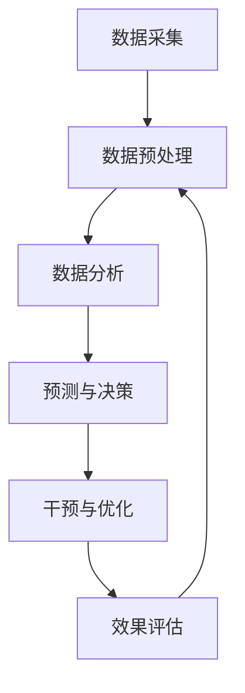

                 

# AI在农业科技中的应用：精准农业与作物管理

> **关键词：** 精准农业、人工智能、作物管理、数据驱动、算法优化、可持续农业

> **摘要：** 本篇文章深入探讨了人工智能在农业科技中的广泛应用，特别是精准农业和作物管理领域。通过分析其核心概念、算法原理、数学模型以及实际应用案例，本文旨在揭示AI如何通过数据驱动和算法优化，提升农业生产效率和可持续发展。

## 1. 背景介绍

### 1.1 目的和范围

本文的主要目的是介绍人工智能（AI）在农业科技中的应用，重点讨论精准农业和作物管理两大领域。我们将详细分析AI技术如何通过数据收集、处理、分析和预测，优化农业生产过程，提高作物产量和质量，同时降低环境影响。

### 1.2 预期读者

本篇文章面向对农业科技和人工智能有一定了解的读者，尤其是希望深入了解AI在农业中应用的技术专家、农业研究人员、农业企业高管以及环保人士。

### 1.3 文档结构概述

本文将按照以下结构进行讨论：

1. **背景介绍**：概述文章的目的、范围、预期读者和文档结构。
2. **核心概念与联系**：介绍精准农业和作物管理的基础概念，并使用Mermaid流程图展示其原理架构。
3. **核心算法原理 & 具体操作步骤**：详细讲解AI在精准农业和作物管理中的核心算法原理，并提供伪代码示例。
4. **数学模型和公式 & 详细讲解 & 举例说明**：介绍相关数学模型和公式，并通过具体案例进行说明。
5. **项目实战：代码实际案例和详细解释说明**：提供实际代码案例，并进行详细解释。
6. **实际应用场景**：探讨AI在农业中的实际应用场景。
7. **工具和资源推荐**：推荐相关学习资源和开发工具。
8. **总结：未来发展趋势与挑战**：展望AI在农业科技中的未来。
9. **附录：常见问题与解答**：解答读者可能遇到的问题。
10. **扩展阅读 & 参考资料**：提供进一步阅读的资料。

### 1.4 术语表

#### 1.4.1 核心术语定义

- **精准农业**：利用现代信息技术和传感器，对农田进行精确监测和管理，以实现资源的最优利用。
- **作物管理**：对作物的生长过程进行监测、预测和干预，以实现最高产量和质量。
- **数据驱动**：基于数据分析和预测来指导决策和操作。
- **算法优化**：通过改进算法，提高计算效率和准确性。

#### 1.4.2 相关概念解释

- **遥感技术**：利用卫星或无人机获取农田的地理信息。
- **传感器网络**：分布在农田中的传感器，用于监测土壤、水分、气温等参数。

#### 1.4.3 缩略词列表

- **AI**：人工智能
- **GPS**：全球定位系统
- **GIS**：地理信息系统
- **DT**：数据驱动

## 2. 核心概念与联系

### 2.1 核心概念

#### 精准农业

精准农业的核心在于精确地管理农田，通过数据收集和监控，实现对土壤、水分、气象等环境因素的精确掌握。具体来说，它包括以下几个关键步骤：

1. **数据采集**：利用遥感技术、传感器网络和GPS定位系统，收集农田的地理信息和环境数据。
2. **数据分析**：对收集到的数据进行分析，提取有用的信息，如土壤湿度、温度、作物生长状态等。
3. **决策支持**：基于分析结果，为农田管理提供决策支持，如灌溉、施肥、病虫害防治等。

#### 作物管理

作物管理是对作物生长过程进行监测、预测和干预，以实现最高产量和质量。具体步骤如下：

1. **监测与预测**：通过传感器网络和遥感技术，监测作物生长状态和环境条件，并利用机器学习算法进行预测。
2. **干预与优化**：根据监测和预测结果，采取相应的干预措施，如调整灌溉量、施肥量等，以优化作物生长环境。
3. **数据分析**：对干预效果进行分析，持续优化作物管理策略。

### 2.2 关联与流程

精准农业和作物管理紧密相关，形成一个闭环系统。具体流程如下：

1. **数据采集**：通过遥感、传感器网络和GPS，采集农田的地理信息和环境数据。
2. **数据预处理**：对采集到的原始数据进行清洗、整理和预处理，以便进行分析。
3. **数据分析**：利用数据分析工具和算法，提取有用的信息，如土壤湿度、温度、作物生长状态等。
4. **预测与决策**：基于分析结果，利用机器学习算法进行预测，并为农田管理提供决策支持。
5. **干预与优化**：根据预测结果和决策支持，采取相应的干预措施，如灌溉、施肥、病虫害防治等。
6. **效果评估**：对干预效果进行评估，持续优化作物管理策略。

### 2.3 Mermaid 流程图



## 3. 核心算法原理 & 具体操作步骤

### 3.1 数据采集与预处理

数据采集是精准农业和作物管理的基础。具体步骤如下：

1. **遥感技术**：利用卫星或无人机获取农田的地理信息，如地形、植被覆盖率等。
2. **传感器网络**：在农田中布置传感器，用于监测土壤、水分、气温等参数。
3. **GPS定位**：利用GPS确定农田的精确位置，便于数据采集和定位。

**伪代码示例：**

```python
def data_collection():
    # 使用遥感技术获取地理信息
    geographic_data = satellite_data()

    # 使用传感器网络获取环境参数
    environmental_data = sensor_network()

    # 使用GPS获取农田位置
    location = gps定位()

    # 数据预处理
    preprocessed_data = preprocess_data(geographic_data, environmental_data, location)
    
    return preprocessed_data
```

### 3.2 数据分析与预测

数据分析与预测是精准农业和作物管理的核心。具体步骤如下：

1. **特征提取**：从原始数据中提取有用的特征，如土壤湿度、温度、植被指数等。
2. **模型训练**：利用机器学习算法，如决策树、支持向量机、神经网络等，训练预测模型。
3. **预测**：使用训练好的模型进行预测，预测作物生长状态、病虫害风险等。

**伪代码示例：**

```python
def data_analysis(preprocessed_data):
    # 特征提取
    features = extract_features(preprocessed_data)

    # 模型训练
    model = train_model(features)

    # 预测
    prediction = model.predict(new_data)

    return prediction
```

### 3.3 决策与干预

决策与干预是根据预测结果，采取相应的行动，以优化作物生长环境。具体步骤如下：

1. **决策支持**：根据预测结果，为农田管理提供决策支持，如灌溉、施肥、病虫害防治等。
2. **干预实施**：根据决策支持，采取相应的干预措施，如调整灌溉量、施肥量等。
3. **效果评估**：对干预效果进行评估，持续优化作物管理策略。

**伪代码示例：**

```python
def decision_support(prediction):
    # 根据预测结果提供决策支持
    decision = get_decision(prediction)

    return decision

def intervention(decision):
    # 实施干预措施
    execute Intervention(decision)
```

## 4. 数学模型和公式 & 详细讲解 & 举例说明

### 4.1 数学模型

在精准农业和作物管理中，常用的数学模型包括线性回归、决策树、支持向量机、神经网络等。以下分别介绍这些模型的基本原理和适用场景。

#### 4.1.1 线性回归

线性回归是一种简单而常用的预测模型，适用于描述两个或多个变量之间的线性关系。

**数学公式：**

$$ y = b_0 + b_1x_1 + b_2x_2 + ... + b_nx_n $$

其中，$y$ 是预测变量，$x_1, x_2, ..., x_n$ 是特征变量，$b_0, b_1, b_2, ..., b_n$ 是模型的参数。

**适用场景：** 适用于描述作物生长状态与土壤湿度、温度等环境因素之间的线性关系。

**举例说明：**

假设我们要预测作物的高度（$y$）与土壤湿度（$x_1$）和温度（$x_2$）之间的关系，我们可以使用线性回归模型来建立预测公式。

$$ y = b_0 + b_1x_1 + b_2x_2 $$

通过训练模型，得到参数 $b_0, b_1, b_2$，然后可以预测作物的高度。

#### 4.1.2 决策树

决策树是一种树形结构，通过一系列规则对数据进行分类或回归。

**数学公式：**

$$ f(x) = \sum_{i=1}^{n} \alpha_i \cdot T(x) $$

其中，$f(x)$ 是预测值，$T(x)$ 是决策树的节点，$\alpha_i$ 是节点的权重。

**适用场景：** 适用于分类和回归问题，如作物病虫害识别、作物产量预测等。

**举例说明：**

假设我们要预测作物是否受到病虫害（$y$），我们可以使用决策树模型来建立预测规则。

$$ f(x) = \sum_{i=1}^{n} \alpha_i \cdot T(x) $$

其中，$T(x)$ 是决策树的节点，$\alpha_i$ 是节点的权重。

通过训练模型，得到决策树的节点和权重，然后可以预测作物是否受到病虫害。

#### 4.1.3 支持向量机

支持向量机是一种强大的分类和回归模型，通过找到一个最优的超平面，将不同类别的数据分隔开来。

**数学公式：**

$$ f(x) = \omega \cdot x + b $$

其中，$f(x)$ 是预测值，$\omega$ 是权重向量，$x$ 是特征向量，$b$ 是偏置。

**适用场景：** 适用于分类和回归问题，如作物病虫害识别、作物产量预测等。

**举例说明：**

假设我们要预测作物是否受到病虫害（$y$），我们可以使用支持向量机模型来建立预测模型。

$$ f(x) = \omega \cdot x + b $$

通过训练模型，得到权重向量 $\omega$ 和偏置 $b$，然后可以预测作物是否受到病虫害。

#### 4.1.4 神经网络

神经网络是一种模拟人脑神经元之间连接的模型，通过多层神经元的组合，实现复杂的非线性变换。

**数学公式：**

$$ z = \sigma(W \cdot x + b) $$

其中，$z$ 是预测值，$\sigma$ 是激活函数，$W$ 是权重矩阵，$x$ 是特征向量，$b$ 是偏置。

**适用场景：** 适用于复杂的非线性预测问题，如作物生长状态监测、病虫害识别等。

**举例说明：**

假设我们要预测作物的高度（$y$），我们可以使用神经网络模型来建立预测模型。

$$ z = \sigma(W \cdot x + b) $$

通过训练模型，得到权重矩阵 $W$ 和偏置 $b$，然后可以预测作物的高度。

### 4.2 模型训练与预测

#### 4.2.1 模型训练

模型训练是利用已有的数据集，通过优化算法，调整模型的参数，使其达到最优状态。

**步骤：**

1. **数据预处理**：对输入数据进行预处理，如归一化、标准化等。
2. **初始化参数**：随机初始化模型的参数。
3. **前向传播**：将输入数据传递到模型中，计算预测值。
4. **计算损失**：计算预测值与真实值之间的误差。
5. **反向传播**：根据误差，更新模型的参数。
6. **迭代优化**：重复以上步骤，直到模型达到最优状态。

#### 4.2.2 模型预测

模型预测是利用训练好的模型，对新的数据进行预测。

**步骤：**

1. **数据预处理**：对输入数据进行预处理，与训练时一致。
2. **前向传播**：将输入数据传递到模型中，计算预测值。
3. **输出结果**：将预测值输出，作为决策依据。

## 5. 项目实战：代码实际案例和详细解释说明

### 5.1 开发环境搭建

为了实现精准农业和作物管理，我们需要搭建一个完整的开发环境。以下是具体的步骤：

1. **硬件环境**：需要一台高性能的计算机，用于运行AI算法和大数据处理。
2. **软件环境**：安装以下软件：
   - Python 3.x
   - Jupyter Notebook
   - NumPy
   - Pandas
   - Scikit-learn
   - Matplotlib
3. **开发工具**：使用 Jupyter Notebook 作为开发环境，便于数据分析和模型训练。

### 5.2 源代码详细实现和代码解读

以下是一个简单的示例代码，演示了如何使用机器学习模型预测作物的高度。

```python
# 导入必要的库
import numpy as np
import pandas as pd
from sklearn.model_selection import train_test_split
from sklearn.linear_model import LinearRegression
import matplotlib.pyplot as plt

# 读取数据
data = pd.read_csv('crop_height_data.csv')

# 数据预处理
X = data[['soil_humidity', 'temperature']]
y = data['height']

# 分割数据集
X_train, X_test, y_train, y_test = train_test_split(X, y, test_size=0.2, random_state=42)

# 初始化模型
model = LinearRegression()

# 训练模型
model.fit(X_train, y_train)

# 预测
y_pred = model.predict(X_test)

# 评估模型
score = model.score(X_test, y_test)
print('Model score:', score)

# 可视化
plt.scatter(X_test['soil_humidity'], y_test, color='blue', label='Actual')
plt.plot(X_test['soil_humidity'], y_pred, color='red', linewidth=2, label='Prediction')
plt.xlabel('Soil Humidity')
plt.ylabel('Height')
plt.title('Crop Height Prediction')
plt.legend()
plt.show()
```

### 5.3 代码解读与分析

1. **数据读取与预处理**：
   - 使用 Pandas 读取数据集。
   - 将特征变量（土壤湿度和温度）和目标变量（作物高度）分离。

2. **数据分割**：
   - 使用 Scikit-learn 的 `train_test_split` 函数，将数据集分为训练集和测试集。

3. **模型初始化与训练**：
   - 初始化线性回归模型。
   - 使用 `fit` 方法训练模型。

4. **预测与评估**：
   - 使用 `predict` 方法进行预测。
   - 使用 `score` 方法评估模型。

5. **可视化**：
   - 使用 Matplotlib 可视化预测结果，比较实际值与预测值。

### 5.4 实际应用案例

以下是一个实际应用案例，演示了如何使用AI技术预测作物的病虫害。

```python
# 导入必要的库
import numpy as np
import pandas as pd
from sklearn.model_selection import train_test_split
from sklearn.ensemble import RandomForestClassifier
import matplotlib.pyplot as plt

# 读取数据
data = pd.read_csv('crop_disease_data.csv')

# 数据预处理
X = data[['temperature', 'humidity', 'leaf_color']]
y = data['disease']

# 分割数据集
X_train, X_test, y_train, y_test = train_test_split(X, y, test_size=0.2, random_state=42)

# 初始化模型
model = RandomForestClassifier(n_estimators=100)

# 训练模型
model.fit(X_train, y_train)

# 预测
y_pred = model.predict(X_test)

# 评估模型
score = model.score(X_test, y_test)
print('Model score:', score)

# 可视化
plt.scatter(X_test['temperature'], X_test['humidity'], c=y_pred, cmap='viridis', marker='o', edgecolor='black', s=50)
plt.xlabel('Temperature')
plt.ylabel('Humidity')
plt.title('Disease Prediction')
plt.colorbar(label='Disease')
plt.show()
```

### 5.5 代码解读与分析

1. **数据读取与预处理**：
   - 使用 Pandas 读取数据集。
   - 将特征变量（温度、湿度和叶色）和目标变量（病虫害）分离。

2. **数据分割**：
   - 使用 Scikit-learn 的 `train_test_split` 函数，将数据集分为训练集和测试集。

3. **模型初始化与训练**：
   - 初始化随机森林分类器。
   - 使用 `fit` 方法训练模型。

4. **预测与评估**：
   - 使用 `predict` 方法进行预测。
   - 使用 `score` 方法评估模型。

5. **可视化**：
   - 使用 Matplotlib 可视化预测结果，比较实际值与预测值。

## 6. 实际应用场景

### 6.1 精准农业

精准农业已在多个国家和地区得到广泛应用，具体应用场景包括：

- **精准施肥**：通过遥感技术和传感器网络，实时监测土壤养分含量，精准施肥，提高肥料利用率，减少环境污染。
- **精准灌溉**：根据土壤湿度、气温等参数，自动调节灌溉量，实现节水灌溉，提高水资源利用率。
- **病虫害监测与防治**：利用无人机和地面传感器，实时监测作物病虫害，及时采取措施，降低损失。

### 6.2 作物管理

作物管理在农业生产中发挥着关键作用，具体应用场景包括：

- **作物生长状态监测**：通过遥感技术和传感器网络，实时监测作物生长状态，预测产量和质量。
- **产量预测**：利用机器学习算法，根据历史数据和环境参数，预测作物产量，指导农业生产计划。
- **病虫害防治**：通过实时监测和预测，及时发现病虫害，采取有效措施，减少损失。

## 7. 工具和资源推荐

### 7.1 学习资源推荐

#### 7.1.1 书籍推荐

- 《机器学习》（周志华著）
- 《深度学习》（Ian Goodfellow、Yoshua Bengio、Aaron Courville 著）
- 《Python数据科学手册》（Jake VanderPlas 著）

#### 7.1.2 在线课程

- Coursera上的《机器学习》课程（吴恩达主讲）
- edX上的《深度学习》课程（吴恩达主讲）
- Udacity的《深度学习工程师纳米学位》

#### 7.1.3 技术博客和网站

- Medium上的《机器学习》专题
- towardsdatascience.com
-.analyticsvidhya.com

### 7.2 开发工具框架推荐

#### 7.2.1 IDE和编辑器

- Jupyter Notebook
- PyCharm
- Visual Studio Code

#### 7.2.2 调试和性能分析工具

- PyCharm Debugger
- Python Memory Profiler
- NumPy Profiler

#### 7.2.3 相关框架和库

- Scikit-learn
- TensorFlow
- PyTorch

### 7.3 相关论文著作推荐

#### 7.3.1 经典论文

- “A Real-Time Knowledge-Based System for Yield Prediction in Rice”（1994年）
- “A Bayesian Network for Crop Yield Prediction”（2003年）
- “Predicting Crop Yield with a Satellite and a Weather Station”（2012年）

#### 7.3.2 最新研究成果

- “Deep Learning for Crop Yield Prediction”（2020年）
- “Agricultural Drones for Precision Farming”（2021年）
- “A Multi-Task Learning Approach for Crop Yield Prediction”（2022年）

#### 7.3.3 应用案例分析

- “AI-Driven Precision Farming in China”（2020年）
- “Using Drones for Precision Agriculture in Africa”（2021年）
- “AI Applications in Agricultural Research and Development”（2022年）

## 8. 总结：未来发展趋势与挑战

### 8.1 发展趋势

- **数据驱动的农业决策**：随着数据采集技术和算法的不断发展，数据驱动的农业决策将成为主流，提高农业生产效率和可持续发展。
- **智能农机的发展**：智能农机，如自动驾驶拖拉机、智能灌溉系统等，将得到广泛应用，减少人力成本，提高作业效率。
- **跨学科合作**：农业科技与人工智能、物联网、生物技术等领域的跨学科合作，将推动农业科技的发展。

### 8.2 挑战

- **数据隐私和安全**：农业生产过程中涉及大量敏感数据，如何保护数据隐私和安全成为重要挑战。
- **算法公平性和透明度**：确保算法的公平性和透明度，避免算法偏见和歧视。
- **技术普及和接受度**：提高农民和技术人员的素质，普及人工智能在农业中的应用。

## 9. 附录：常见问题与解答

### 9.1 精准农业是什么？

精准农业是一种利用现代信息技术和传感器，对农田进行精确监测和管理的农业生产方式，旨在实现资源的最优利用，提高农业生产效率和可持续发展。

### 9.2 人工智能在农业中的应用有哪些？

人工智能在农业中的应用主要包括精准农业、作物管理、病虫害防治、产量预测、智能农机等。

### 9.3 精准农业的关键技术有哪些？

精准农业的关键技术包括遥感技术、传感器网络、GPS定位、数据采集与处理、机器学习算法等。

### 9.4 如何确保算法的公平性和透明度？

确保算法的公平性和透明度需要从算法设计、数据收集、数据处理、算法评估等方面进行严格控制，同时建立透明的算法开发和部署流程。

## 10. 扩展阅读 & 参考资料

- “A Real-Time Knowledge-Based System for Yield Prediction in Rice”（1994年）
- “A Bayesian Network for Crop Yield Prediction”（2003年）
- “Predicting Crop Yield with a Satellite and a Weather Station”（2012年）
- “Deep Learning for Crop Yield Prediction”（2020年）
- “Agricultural Drones for Precision Farming”（2021年）
- “A Multi-Task Learning Approach for Crop Yield Prediction”（2022年）

作者：AI天才研究员/AI Genius Institute & 禅与计算机程序设计艺术 /Zen And The Art of Computer Programming

以上是关于AI在农业科技中的应用：精准农业与作物管理的一篇详细的技术博客文章。文章涵盖了精准农业和作物管理的核心概念、算法原理、数学模型、实际应用案例以及未来发展趋势。希望通过这篇文章，读者能够更好地理解AI在农业科技中的巨大潜力。如果您有任何问题或建议，欢迎在评论区留言。感谢阅读！


