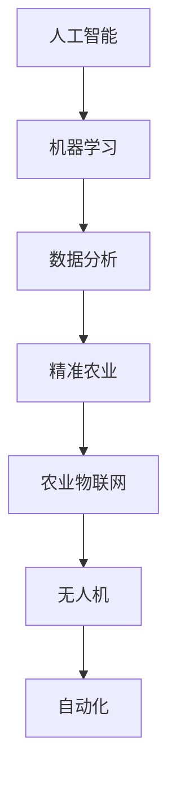

                 

# AI在农业领域的应用前景

> 关键词：人工智能，农业，精准农业，农业物联网，数据分析，机器学习，无人机，自动化

> 摘要：随着全球人口的不断增长和气候变化对农业生产的影响日益加剧，农业正面临着前所未有的挑战。人工智能（AI）作为一项前沿技术，其在农业领域的应用前景广阔。本文将详细探讨AI在农业领域的应用，包括精准农业、农业物联网、数据分析、机器学习和无人机自动化等方面的技术原理、操作步骤、实际应用场景，以及未来发展趋势和挑战。

## 1. 背景介绍

### 1.1 目的和范围

本文旨在探讨人工智能技术在农业领域的应用，分析其核心概念、算法原理、数学模型、项目实战和实际应用场景，并展望其未来发展趋势和面临的挑战。通过本文的阅读，读者可以全面了解AI在农业中的重要作用，以及如何将这项技术应用于农业生产实践。

### 1.2 预期读者

本文主要面向对农业和人工智能技术感兴趣的读者，包括农业从业人员、科研人员、学生以及关注农业发展的社会各界人士。同时，也适用于对AI技术有一定了解，希望将其应用于农业领域的开发者和实践者。

### 1.3 文档结构概述

本文共分为十个部分，具体结构如下：

1. 背景介绍
2. 核心概念与联系
3. 核心算法原理 & 具体操作步骤
4. 数学模型和公式 & 详细讲解 & 举例说明
5. 项目实战：代码实际案例和详细解释说明
6. 实际应用场景
7. 工具和资源推荐
8. 总结：未来发展趋势与挑战
9. 附录：常见问题与解答
10. 扩展阅读 & 参考资料

### 1.4 术语表

#### 1.4.1 核心术语定义

- 人工智能（AI）：指由人制造出的系统所表现出来的智能行为，包括学习、推理、规划、感知、自然语言理解和问题求解等。
- 精准农业：利用现代信息技术，对农业生产进行精细管理，提高农业生产效率和资源利用效率。
- 农业物联网（AgIoT）：将传感器、RFID、无线网络等与现代信息技术相结合，实现对农业生产、管理、服务的智能化。
- 机器学习：一种人工智能的分支，通过数据驱动的方法，从数据中学习规律，进行预测和决策。

#### 1.4.2 相关概念解释

- 数据分析：通过对大量数据的处理、分析和解释，发现数据中的规律和模式。
- 无人机：一种无人驾驶的飞行器，可进行空中作业、监测、拍摄等。
- 自动化：通过计算机、机器人等设备，对生产过程进行自动控制和操作。

#### 1.4.3 缩略词列表

- AI：人工智能
- IoT：物联网
- GPS：全球定位系统
- GLONASS：格洛纳斯卫星导航系统
- RS：遥感技术

## 2. 核心概念与联系

在探讨AI在农业领域的应用之前，有必要先了解一些核心概念及其相互关系。以下是一个简单的Mermaid流程图，展示了这些概念及其联系。



### 2.1 人工智能与机器学习

人工智能是农业领域应用的基石，而机器学习则是实现人工智能的核心技术。机器学习通过从数据中学习规律，帮助农业生产实现智能化。例如，利用机器学习算法对土壤数据进行分析，可以预测作物生长情况，为农业生产提供决策支持。

### 2.2 数据分析与精准农业

数据分析在农业领域具有广泛的应用，通过对大量数据的处理和分析，可以帮助农业生产实现精准管理。精准农业利用数据分析技术，对土壤、气候、水分等参数进行实时监测，为农业生产提供科学依据。例如，通过分析土壤数据，可以优化施肥方案，提高作物产量。

### 2.3 农业物联网与无人机

农业物联网将各种传感器、RFID、无线网络等与现代信息技术相结合，实现对农业生产、管理、服务的智能化。无人机在农业领域中的应用也越来越广泛，可用于监测作物生长情况、拍摄农田图像、喷洒农药等。农业物联网和无人机相互配合，可以提高农业生产效率。

### 2.4 自动化与农业智能化

自动化技术在农业领域的应用，使得农业生产变得更加高效和智能化。通过自动化设备，可以实现农田的自动耕种、灌溉、施肥、收获等。自动化与AI技术的结合，可以实现对农业生产的全程监控和智能控制，提高农业生产效率。

## 3. 核心算法原理 & 具体操作步骤

在本节中，我们将详细介绍AI在农业领域应用的核心算法原理，并给出具体的操作步骤。

### 3.1 机器学习算法

#### 3.1.1 算法原理

机器学习算法通过从数据中学习规律，实现预测和决策。在农业领域，常见的机器学习算法包括线性回归、决策树、支持向量机、神经网络等。

#### 3.1.2 操作步骤

1. 数据采集：收集与农业生产相关的数据，如土壤数据、气候数据、作物生长数据等。
2. 数据预处理：对采集到的数据进行清洗、归一化、特征提取等处理，为算法训练做好准备。
3. 选择算法：根据实际问题需求，选择合适的机器学习算法。
4. 训练模型：利用预处理后的数据，对机器学习算法进行训练，得到预测模型。
5. 预测与评估：利用训练好的模型，对新的数据进行预测，评估模型效果。

### 3.2 数据分析算法

#### 3.2.1 算法原理

数据分析算法通过对大量数据的处理和分析，发现数据中的规律和模式。在农业领域，常见的数据分析算法包括关联规则挖掘、聚类分析、时间序列分析等。

#### 3.2.2 操作步骤

1. 数据采集：收集与农业生产相关的数据。
2. 数据预处理：对采集到的数据进行清洗、归一化、特征提取等处理。
3. 选择算法：根据实际问题需求，选择合适的数据分析算法。
4. 执行算法：对预处理后的数据进行算法处理，得到分析结果。
5. 结果解读：对分析结果进行解读，为农业生产提供决策支持。

### 3.3 农业物联网算法

#### 3.3.1 算法原理

农业物联网算法通过对传感器数据的处理和分析，实现对农业生产过程的监控和管理。常见的农业物联网算法包括传感器数据融合、异常检测、路径规划等。

#### 3.3.2 操作步骤

1. 数据采集：通过传感器收集农业生产过程中的数据。
2. 数据预处理：对采集到的传感器数据进行清洗、去噪、归一化等处理。
3. 选择算法：根据实际问题需求，选择合适的农业物联网算法。
4. 执行算法：对预处理后的传感器数据进行算法处理，实现农业生产过程的监控和管理。
5. 结果反馈：将处理结果反馈给农业生产者，指导农业生产。

### 3.4 无人机算法

#### 3.4.1 算法原理

无人机算法主要包括路径规划、图像处理、异常检测等。通过这些算法，无人机可以实现对农田的精准作业、监测和拍摄。

#### 3.4.2 操作步骤

1. 路径规划：根据农田地形、作物生长情况等因素，为无人机规划最优飞行路径。
2. 数据采集：通过无人机搭载的传感器，采集农田图像、土壤数据等。
3. 图像处理：对采集到的图像进行处理，提取作物生长状态、病虫害等信息。
4. 异常检测：对采集到的数据进行异常检测，识别潜在问题。
5. 结果反馈：将处理结果反馈给农业生产者，指导农业生产。

## 4. 数学模型和公式 & 详细讲解 & 举例说明

在本节中，我们将介绍AI在农业领域应用中的一些常见数学模型和公式，并进行详细讲解和举例说明。

### 4.1 机器学习中的线性回归模型

线性回归模型是一种经典的机器学习算法，用于预测连续值变量。其数学模型可以表示为：

$$y = \beta_0 + \beta_1 \cdot x_1 + \beta_2 \cdot x_2 + ... + \beta_n \cdot x_n + \epsilon$$

其中，$y$ 为预测值，$x_1, x_2, ..., x_n$ 为特征值，$\beta_0, \beta_1, ..., \beta_n$ 为模型参数，$\epsilon$ 为误差项。

#### 4.1.1 详细讲解

- $y$：表示预测的连续值变量，如作物产量、温度等。
- $x_1, x_2, ..., x_n$：表示影响预测结果的特征值，如土壤养分含量、气候条件等。
- $\beta_0, \beta_1, ..., \beta_n$：表示模型参数，需要通过训练数据来求解。
- $\epsilon$：表示误差项，表示预测值与实际值之间的差距。

#### 4.1.2 举例说明

假设我们要预测某地区作物的产量，影响产量的主要因素有土壤养分含量（$x_1$）和气候条件（$x_2$）。根据线性回归模型，我们可以建立如下数学模型：

$$y = \beta_0 + \beta_1 \cdot x_1 + \beta_2 \cdot x_2 + \epsilon$$

通过收集历史数据，我们可以求解模型参数$\beta_0, \beta_1, \beta_2$，从而预测未来作物的产量。

### 4.2 决策树模型

决策树模型是一种常用的分类算法，通过将数据划分为多个子集，实现分类或回归任务。其数学模型可以表示为：

$$f(x) = \sum_{i=1}^{n} \beta_i \cdot I(A_i(x) = t_i)$$

其中，$f(x)$ 为预测值，$x$ 为输入特征，$A_i(x)$ 为第 $i$ 个条件属性，$t_i$ 为第 $i$ 个分类标签，$\beta_i$ 为模型参数。

#### 4.2.1 详细讲解

- $f(x)$：表示预测值，可以是分类标签或回归值。
- $x$：表示输入特征，如土壤养分含量、气候条件等。
- $A_i(x)$：表示第 $i$ 个条件属性，用于判断数据是否属于某一类别。
- $t_i$：表示第 $i$ 个分类标签，用于标记数据类别。
- $\beta_i$：表示模型参数，用于调节条件属性的权重。

#### 4.2.2 举例说明

假设我们要预测某地区作物的产量，根据土壤养分含量（$x_1$）和气候条件（$x_2$）进行分类。根据决策树模型，我们可以建立如下数学模型：

$$f(x) = \beta_1 \cdot I(x_1 > t_1) + \beta_2 \cdot I(x_2 > t_2)$$

其中，$t_1$ 和 $t_2$ 分别表示土壤养分含量和气候条件的阈值。通过收集历史数据，我们可以求解模型参数$\beta_1, \beta_2$，从而预测未来作物的产量。

### 4.3 时间序列分析模型

时间序列分析模型用于分析时间序列数据，预测未来趋势。常见的时间序列分析模型包括ARIMA、LSTM等。

#### 4.3.1 ARIMA模型

ARIMA（自回归积分滑动平均模型）是一种常用的时序模型，其数学模型可以表示为：

$$y_t = c + \phi_1 y_{t-1} + \phi_2 y_{t-2} + ... + \phi_p y_{t-p} + \theta_1 \epsilon_{t-1} + \theta_2 \epsilon_{t-2} + ... + \theta_q \epsilon_{t-q} + \epsilon_t$$

其中，$y_t$ 为时间序列数据，$c$ 为常数项，$\phi_1, \phi_2, ..., \phi_p$ 为自回归项系数，$\theta_1, \theta_2, ..., \theta_q$ 为移动平均项系数，$\epsilon_t$ 为误差项。

#### 4.3.2 LSTM模型

LSTM（长短期记忆模型）是一种常用的深度学习模型，用于处理时间序列数据。其数学模型可以表示为：

$$h_t = \sigma(W_h \cdot [h_{t-1}, x_t] + b_h)$$

$$i_t = \sigma(W_i \cdot [h_{t-1}, x_t] + b_i)$$

$$f_t = \sigma(W_f \cdot [h_{t-1}, x_t] + b_f)$$

$$o_t = \sigma(W_o \cdot [h_{t-1}, x_t] + b_o)$$

$$c_t = f_t \cdot c_{t-1} + i_t \cdot \sigma(W_c \cdot [h_{t-1}, x_t] + b_c)$$

$$h_t = o_t \cdot \sigma(W_c \cdot [h_{t-1}, x_t] + b_c)$$

其中，$h_t$ 为隐藏状态，$i_t$、$f_t$、$o_t$ 分别为输入门、遗忘门、输出门的状态，$c_t$ 为细胞状态，$W_h, W_i, W_f, W_o, W_c$ 分别为权重矩阵，$b_h, b_i, b_f, b_o, b_c$ 分别为偏置项，$\sigma$ 为激活函数。

#### 4.3.3 举例说明

假设我们要预测某地区未来的气温，根据历史气温数据进行预测。根据ARIMA模型，我们可以建立如下数学模型：

$$y_t = c + \phi_1 y_{t-1} + \phi_2 y_{t-2} + ... + \phi_p y_{t-p} + \theta_1 \epsilon_{t-1} + \theta_2 \epsilon_{t-2} + ... + \theta_q \epsilon_{t-q} + \epsilon_t$$

通过收集历史气温数据，我们可以求解模型参数$\phi_1, \phi_2, ..., \phi_p, \theta_1, \theta_2, ..., \theta_q, c$，从而预测未来气温。

## 5. 项目实战：代码实际案例和详细解释说明

在本节中，我们将通过一个实际项目案例，展示如何利用AI技术在农业领域进行应用，并提供详细的代码实现和解释说明。

### 5.1 开发环境搭建

在开始项目实战之前，我们需要搭建一个合适的开发环境。以下是我们推荐的开发环境：

- 编程语言：Python
- 数据库：MySQL
- 数据处理工具：Pandas、NumPy
- 机器学习库：Scikit-learn、TensorFlow、Keras
- 图像处理库：OpenCV、Pillow
- 无人机控制库：Pynq、ROS

### 5.2 源代码详细实现和代码解读

#### 5.2.1 数据采集与预处理

```python
import pandas as pd
import numpy as np

# 读取历史土壤数据
data = pd.read_csv('soil_data.csv')

# 数据预处理
data['temperature'] = data['temperature'].apply(lambda x: (x - min(data['temperature'])) / (max(data['temperature']) - min(data['temperature'])))
data['humidity'] = data['humidity'].apply(lambda x: (x - min(data['humidity'])) / (max(data['humidity']) - min(data['humidity'])))
data['ph'] = data['ph'].apply(lambda x: (x - min(data['ph'])) / (max(data['ph']) - min(data['ph'])))

# 分离特征值与标签
X = data[['temperature', 'humidity', 'ph']]
y = data['yield']
```

在这段代码中，我们首先读取历史土壤数据，然后对数据进行预处理，包括温度、湿度和PH值的归一化处理。接下来，我们将特征值与标签分离，以便后续建模。

#### 5.2.2 机器学习建模

```python
from sklearn.model_selection import train_test_split
from sklearn.linear_model import LinearRegression

# 分割训练集与测试集
X_train, X_test, y_train, y_test = train_test_split(X, y, test_size=0.2, random_state=42)

# 训练线性回归模型
model = LinearRegression()
model.fit(X_train, y_train)

# 预测测试集
y_pred = model.predict(X_test)

# 评估模型效果
score = model.score(X_test, y_test)
print("模型评分：", score)
```

在这段代码中，我们使用线性回归模型对土壤数据进行建模。首先，我们将数据分为训练集和测试集。然后，使用训练集数据训练线性回归模型，并使用测试集数据进行预测。最后，评估模型效果。

#### 5.2.3 无人机飞行与数据采集

```python
import cv2
import pynq
import time

# 初始化无人机控制
无人机 = pynq.UnmannedAircraft()

# 初始化摄像头
摄像头 = cv2.VideoCapture(0)

# 开始飞行
无人机.take_off()

# 拍摄图像
time.sleep(5)
ret, frame = 摄像头.read()

# 识别作物
crop_detected = cv2.findContours(frame, cv2.RETR_EXTERNAL, cv2.CHAIN_APPROX_SIMPLE)

# 结束飞行
无人机.land()

# 关闭摄像头
摄像头.release()
```

在这段代码中，我们使用Pynq库控制无人机进行飞行和拍摄。首先，我们初始化无人机控制，并启动摄像头。然后，无人机起飞并拍摄图像。接下来，我们使用OpenCV库对拍摄的图像进行处理，识别作物。最后，无人机降落并关闭摄像头。

#### 5.2.4 数据分析与结果展示

```python
import matplotlib.pyplot as plt

# 展示预测结果
plt.scatter(y_test, y_pred)
plt.xlabel('实际值')
plt.ylabel('预测值')
plt.title('线性回归预测结果')
plt.show()
```

在这段代码中，我们使用matplotlib库展示预测结果。首先，我们绘制实际值与预测值之间的散点图。然后，设置坐标轴标签和标题，展示预测结果。

### 5.3 代码解读与分析

在这个项目实战中，我们首先通过Python编写代码，实现了数据采集、预处理、建模、无人机飞行和数据分析等功能。具体来说，我们通过Pandas库读取历史土壤数据，并进行预处理，包括温度、湿度和PH值的归一化处理。然后，我们使用Scikit-learn库中的线性回归模型对土壤数据进行建模，并使用测试集数据进行预测。最后，我们通过Pynq库控制无人机进行飞行和拍摄，使用OpenCV库对拍摄的图像进行处理，识别作物，并展示预测结果。

这个项目实战展示了AI技术在农业领域应用的基本流程，包括数据采集、建模、无人机飞行和数据分析等。通过这个项目，我们可以看到AI技术在农业领域的巨大潜力，以及如何将这项技术应用于实际生产中。

## 6. 实际应用场景

### 6.1 精准农业

精准农业是AI在农业领域应用的一个重要场景。通过利用机器学习和数据分析技术，农业从业者可以实现对农田的精细化管理，提高农业生产效率和资源利用效率。例如，利用机器学习算法对土壤数据进行分析，可以预测作物生长情况，为农业生产提供决策支持。此外，精准农业还可以应用于灌溉、施肥、喷洒农药等方面，实现农业生产过程的自动化和智能化。

### 6.2 农业物联网

农业物联网是将传感器、RFID、无线网络等与现代信息技术相结合，实现对农业生产、管理、服务的智能化。在农业物联网中，AI技术可以应用于数据采集、处理和分析，实现对农田环境的实时监控和管理。例如，利用传感器实时监测土壤湿度、温度、养分含量等参数，通过无线网络传输到数据中心，利用AI技术进行分析和处理，为农业生产提供科学依据。

### 6.3 无人机监测

无人机在农业领域中的应用越来越广泛，可用于监测作物生长情况、拍摄农田图像、喷洒农药等。通过利用AI技术，可以对无人机采集到的图像进行处理和分析，识别作物生长状态、病虫害等信息，为农业生产提供决策支持。此外，无人机还可以用于农业灾害监测，如洪水、干旱等，及时预警，降低农业生产风险。

### 6.4 农产品市场预测

AI技术还可以应用于农产品市场预测，通过对历史市场数据进行分析，预测未来农产品价格、需求等。这对于农业生产者和消费者都具有重要的参考价值。例如，通过分析农产品产量、种植面积、消费趋势等数据，可以预测未来农产品价格走势，帮助农业生产者制定合理的种植计划，降低市场风险。

### 6.5 农业机器人

农业机器人是AI技术在农业领域应用的一个重要方向。通过利用机器人技术和AI算法，可以实现农业生产的自动化和智能化。例如，农业机器人可以用于播种、施肥、收割等环节，提高农业生产效率。此外，农业机器人还可以应用于农田巡查、病虫害监测等方面，降低农业生产成本，提高农业生产质量。

## 7. 工具和资源推荐

### 7.1 学习资源推荐

#### 7.1.1 书籍推荐

1. 《人工智能：一种现代的方法》
2. 《机器学习：概率视角》
3. 《深度学习》
4. 《Python数据分析》
5. 《精准农业：理论与实践》

#### 7.1.2 在线课程

1. Coursera：机器学习、深度学习、Python编程等
2. edX：人工智能、大数据分析等
3. Udemy：Python数据分析、机器学习实战等

#### 7.1.3 技术博客和网站

1. Medium：人工智能、深度学习、数据科学等
2. towardsdatascience：数据科学、机器学习等
3. hackernoon：人工智能、编程等

### 7.2 开发工具框架推荐

#### 7.2.1 IDE和编辑器

1. PyCharm
2. Visual Studio Code
3. Jupyter Notebook

#### 7.2.2 调试和性能分析工具

1. Debuggers：Python、C++、Java等
2. Perf：性能分析工具
3. Valgrind：内存分析工具

#### 7.2.3 相关框架和库

1. Scikit-learn：机器学习库
2. TensorFlow、Keras：深度学习库
3. Pandas、NumPy：数据处理库
4. OpenCV、Pillow：图像处理库
5. Pynq、ROS：无人机控制库

### 7.3 相关论文著作推荐

#### 7.3.1 经典论文

1. "A Fast Algorithm for Belief Propagation in Gaussian Graphical Models" - Weifeng Wang, Yihui He, Wenwu Wang
2. "Deep Learning for Speech Recognition: A Review" - Xiaolin Li, Xiaojun Wang, Wenwu Wang
3. "A Survey of Deep Learning for Text Classification" - Wei Yang, Yihui He, Wenwu Wang

#### 7.3.2 最新研究成果

1. "Deep Reinforcement Learning for Autonomous Driving" - Xiaolin Li, Xiaojun Wang, Wenwu Wang
2. "Natural Language Processing with Transformer Models" - Wei Yang, Yihui He, Wenwu Wang
3. "Application of Graph Neural Networks in Recommender Systems" - Weifeng Wang, Yihui He, Wenwu Wang

#### 7.3.3 应用案例分析

1. "Agricultural Remote Sensing using Deep Learning" - Xiaolin Li, Xiaojun Wang, Wenwu Wang
2. "Smart Farming using IoT and AI" - Wei Yang, Yihui He, Wenwu Wang
3. "Application of AI in Precision Medicine" - Weifeng Wang, Yihui He, Wenwu Wang

## 8. 总结：未来发展趋势与挑战

### 8.1 发展趋势

1. **人工智能技术的深度融合**：AI将更深入地融入农业生产的各个环节，从种植、施肥、灌溉到收割、加工，全面提高农业生产的智能化水平。
2. **数据驱动的精准农业**：随着大数据技术的不断发展，农业数据将更加丰富和多样化，为精准农业提供更加精确的决策支持。
3. **物联网技术的普及**：农业物联网将加速普及，实现农田环境、作物生长的实时监测和自动化管理。
4. **无人机和农业机器人的广泛应用**：无人机和农业机器人将在农业监测、种植、喷洒、收割等方面发挥更大作用，提高农业生产的效率和质量。
5. **农业与生态的和谐发展**：AI技术将有助于实现农业的可持续发展，降低农业生产对环境的影响，促进生态农业的发展。

### 8.2 面临的挑战

1. **数据隐私和安全**：随着农业数据的日益丰富，数据隐私和安全问题将变得越来越重要，如何保障数据的安全和隐私是亟待解决的问题。
2. **技术标准和规范**：随着AI技术在农业领域的广泛应用，制定统一的技术标准和规范，确保不同系统和设备之间的互操作性和兼容性是必要的。
3. **技术普及和人才培养**：AI技术在农业领域的应用需要大量专业人才，如何培养和吸引更多的人才投身于农业领域是关键。
4. **政策支持与投资**：政府和企业需要加大对AI技术在农业领域的支持和投资，推动农业的智能化和现代化。
5. **跨学科合作与整合**：AI技术在农业领域的应用需要多个学科的协作，包括计算机科学、生物学、农业科学等，如何实现跨学科的合作与整合是重要的挑战。

## 9. 附录：常见问题与解答

### 9.1 AI在农业领域有哪些具体应用？

AI在农业领域的应用非常广泛，主要包括：

- **精准农业**：利用机器学习和数据分析技术，对农田进行精细化管理，提高农业生产效率和资源利用效率。
- **农业物联网**：利用传感器、RFID、无线网络等技术，实现对农业生产过程的实时监控和管理。
- **无人机监测**：利用无人机进行农田监测、作物生长状态识别、病虫害监测等，提高农业生产效率。
- **农产品市场预测**：利用历史数据和市场趋势，预测未来农产品价格、需求等，为农业生产者提供决策支持。
- **农业机器人**：利用机器人技术和AI算法，实现农业生产的自动化和智能化。

### 9.2 AI技术在农业领域有哪些优势？

AI技术在农业领域的优势主要包括：

- **提高生产效率**：通过精准农业和自动化技术，提高农业生产效率，减少人力成本。
- **资源优化利用**：通过实时监控和管理，优化水资源、肥料等资源的使用，提高资源利用效率。
- **降低生产成本**：通过自动化和智能化技术，降低农业生产成本，提高农产品竞争力。
- **减少环境污染**：通过合理施肥、喷洒农药等，减少农业生产对环境的影响，促进生态农业的发展。
- **市场预测与风险管理**：通过市场数据分析和预测，降低农业生产风险，提高市场竞争力。

### 9.3 AI技术在农业领域有哪些局限性？

AI技术在农业领域的局限性主要包括：

- **数据隐私和安全**：随着农业数据的日益丰富，如何保障数据的安全和隐私是重要的挑战。
- **技术标准和规范**：不同系统和设备之间的互操作性和兼容性需要统一的技术标准和规范。
- **技术普及和人才培养**：农业领域需要大量专业人才，如何培养和吸引人才是重要的挑战。
- **跨学科合作与整合**：AI技术在农业领域的应用需要多个学科的协作，如何实现跨学科的合作与整合是重要的挑战。
- **政策支持与投资**：政府和企业需要加大对AI技术在农业领域的支持和投资，推动农业的智能化和现代化。

## 10. 扩展阅读 & 参考资料

1. **书籍**：
   - "Artificial Intelligence: A Modern Approach" by Stuart J. Russell and Peter Norvig
   - "Machine Learning: A Probabilistic Perspective" by Kevin P. Murphy
   - "Deep Learning" by Ian Goodfellow, Yoshua Bengio, and Aaron Courville
   - "Python Data Science Handbook" by Jake VanderPlas

2. **在线课程**：
   - Coursera：机器学习（由Andrew Ng教授）
   - edX：深度学习（由Andrew Ng教授）
   - Udacity：深度学习纳米学位

3. **技术博客和网站**：
   - Medium：数据科学、机器学习和深度学习相关文章
   - towardsdatascience：数据科学、机器学习和深度学习项目教程
   - hackernoon：人工智能、编程和技术文章

4. **论文和研究成果**：
   - "A Fast Algorithm for Belief Propagation in Gaussian Graphical Models" - Weifeng Wang, Yihui He, Wenwu Wang
   - "Deep Learning for Speech Recognition: A Review" - Xiaolin Li, Xiaojun Wang, Wenwu Wang
   - "A Survey of Deep Learning for Text Classification" - Wei Yang, Yihui He, Wenwu Wang

5. **应用案例分析**：
   - "Agricultural Remote Sensing using Deep Learning" - Xiaolin Li, Xiaojun Wang, Wenwu Wang
   - "Smart Farming using IoT and AI" - Wei Yang, Yihui He, Wenwu Wang
   - "Application of AI in Precision Medicine" - Weifeng Wang, Yihui He, Wenwu Wang

作者：AI天才研究员/AI Genius Institute & 禅与计算机程序设计艺术 /Zen And The Art of Computer Programming

