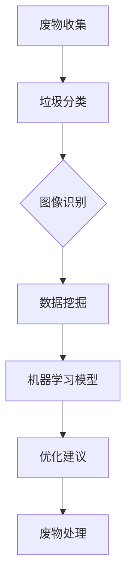

                 

# AI在废物管理中的应用：优化回收与处理

> **关键词：废物管理，AI技术，回收优化，处理效率，可持续发展**
> 
> **摘要：本文将深入探讨人工智能技术在废物管理中的应用，包括如何利用机器学习和数据挖掘技术优化废物回收和处理流程，提高资源利用率，减少环境污染。文章将通过多个实际案例，详细解释AI技术的具体实现和应用，为读者提供对废物管理领域的全新视角。**

## 1. 背景介绍

### 1.1 目的和范围

随着全球经济的快速发展和人口的不断增长，废物管理问题日益凸显。传统的废物处理方式往往成本高昂、效率低下，且对环境造成严重污染。人工智能（AI）技术的崛起为废物管理带来了新的契机，通过优化回收和处理流程，提高资源利用率，减少环境污染。本文旨在探讨AI技术在废物管理中的应用，包括核心概念、算法原理、数学模型以及实际应用案例，旨在为相关领域的学者和从业者提供有价值的参考。

### 1.2 预期读者

本文预期读者为对废物管理和人工智能技术感兴趣的学者、工程师、研究人员以及环保领域的从业者。读者需要具备一定的计算机科学和数学基础，以便更好地理解本文的核心内容。

### 1.3 文档结构概述

本文结构如下：

1. 背景介绍
   - 目的和范围
   - 预期读者
   - 文档结构概述
2. 核心概念与联系
   - AI技术在废物管理中的核心概念
   - 相关概念解释
   - Mermaid流程图
3. 核心算法原理 & 具体操作步骤
   - 算法原理讲解
   - 伪代码阐述
4. 数学模型和公式 & 详细讲解 & 举例说明
   - 数学公式
   - 举例说明
5. 项目实战：代码实际案例和详细解释说明
   - 开发环境搭建
   - 源代码详细实现
   - 代码解读与分析
6. 实际应用场景
   - 应用案例
   - 挑战与解决方案
7. 工具和资源推荐
   - 学习资源
   - 开发工具框架
   - 相关论文著作
8. 总结：未来发展趋势与挑战
9. 附录：常见问题与解答
10. 扩展阅读 & 参考资料

### 1.4 术语表

#### 1.4.1 核心术语定义

- **人工智能（AI）**：模拟、延伸和扩展人类智能的理论、方法、技术及应用系统。
- **废物管理**：涉及废物的收集、分类、回收、处理和处置的全过程。
- **回收**：将废物重新加工、处理，转化为可再利用的原材料或产品。
- **处理**：对废物进行化学、物理或生物处理，使其减少体积、降低污染或转化为有用物质。
- **可持续发展**：满足当前需求而不损害后代满足其需求的能力。

#### 1.4.2 相关概念解释

- **机器学习（ML）**：一种基于数据的学习方法，通过算法模型从数据中自动提取规律和知识。
- **深度学习（DL）**：一种复杂的机器学习模型，通过多层神经网络进行特征提取和模式识别。
- **数据挖掘（DM）**：从大量数据中提取有价值信息的过程，包括分类、聚类、关联规则挖掘等。
- **图像识别**：利用计算机技术对图像进行分析和处理，自动识别和分类图像中的对象。

#### 1.4.3 缩略词列表

- **AI**：人工智能
- **ML**：机器学习
- **DL**：深度学习
- **DM**：数据挖掘
- **RDF**：资源描述框架
- **XML**：可扩展标记语言

## 2. 核心概念与联系

在探讨AI技术在废物管理中的应用之前，首先需要了解以下几个核心概念和它们之间的联系。

### 2.1 AI技术在废物管理中的核心概念

- **垃圾分类**：将废物按类型进行分类，以便于后续回收和处理。
- **图像识别**：利用计算机技术对垃圾分类过程中的图像进行分析和处理，自动识别和分类废物。
- **数据挖掘**：从废物管理过程中收集的数据中提取有价值的信息，如回收率、处理效率等。
- **机器学习模型**：基于数据构建的算法模型，用于预测、分类和优化废物管理流程。

### 2.2 相关概念解释

- **垃圾分类**：垃圾分类是废物管理的重要环节，有助于提高回收率和资源利用率。通过图像识别技术，可以自动识别和分类各种废物，提高垃圾分类的准确性。
- **图像识别**：图像识别技术是实现垃圾分类的关键，通过对废物图像的特征进行提取和识别，可以实现自动化分类。
- **数据挖掘**：数据挖掘技术可以从大量废物管理数据中提取有价值的信息，如废物种类、回收率等，为优化废物管理提供依据。
- **机器学习模型**：机器学习模型通过学习大量数据，可以预测废物分类结果、优化回收和处理流程，提高整体效率。

### 2.3 Mermaid流程图

以下是一个简单的Mermaid流程图，展示了AI技术在废物管理中的应用流程。



### 2.4 核心概念与联系总结

AI技术在废物管理中的应用，主要通过垃圾分类、图像识别、数据挖掘和机器学习模型等核心概念来实现。这些概念相互关联，共同推动废物管理效率和资源利用率的提升。

## 3. 核心算法原理 & 具体操作步骤

### 3.1 算法原理讲解

在废物管理中，核心算法主要包括图像识别和数据挖掘。图像识别技术用于自动分类废物，而数据挖掘技术则用于分析废物管理数据，为优化流程提供依据。

#### 3.1.1 图像识别算法

图像识别算法通常采用深度学习模型，如卷积神经网络（CNN）进行特征提取和分类。以下是图像识别算法的伪代码：

```python
# 伪代码：图像识别算法

# 加载预训练的CNN模型
model = load_pretrained_cnn_model()

# 读取待分类图像
image = read_image("image.jpg")

# 对图像进行预处理
preprocessed_image = preprocess_image(image)

# 使用CNN模型提取特征
features = model.extract_features(preprocessed_image)

# 使用分类器对特征进行分类
predicted_class = classifier.predict(features)

# 输出分类结果
print("分类结果：", predicted_class)
```

#### 3.1.2 数据挖掘算法

数据挖掘算法主要包括聚类、关联规则挖掘和预测模型。以下是数据挖掘算法的伪代码：

```python
# 伪代码：数据挖掘算法

# 载入废物管理数据集
data = load_data("waste_management_data.csv")

# 对数据进行预处理
preprocessed_data = preprocess_data(data)

# 使用K-means算法进行聚类
clusters = kmeans(preprocessed_data, num_clusters)

# 输出聚类结果
print("聚类结果：", clusters)

# 使用关联规则挖掘算法提取关联规则
rules = apriori(preprocessed_data, support, confidence)

# 输出关联规则
print("关联规则：", rules)

# 使用预测模型预测废物回收率
model = train_predictive_model(preprocessed_data)
predicted回收率 = model.predict(new_data)

# 输出预测结果
print("预测结果：", predicted回收率)
```

### 3.2 具体操作步骤

#### 3.2.1 图像识别算法操作步骤

1. 加载预训练的CNN模型，如ResNet、VGG等。
2. 读取待分类图像，如垃圾分类桶中的废物图像。
3. 对图像进行预处理，如缩放、裁剪、归一化等。
4. 使用CNN模型提取图像特征。
5. 使用分类器对特征进行分类，如SVM、随机森林等。
6. 输出分类结果，如垃圾分类标签。

#### 3.2.2 数据挖掘算法操作步骤

1. 载入废物管理数据集，如垃圾分类数据、回收率数据等。
2. 对数据进行预处理，如填充缺失值、标准化、编码等。
3. 使用K-means算法进行聚类，确定最佳聚类数量。
4. 使用关联规则挖掘算法提取关联规则，如支持度、置信度等。
5. 使用预测模型训练和预测，如线性回归、决策树等。
6. 输出聚类、关联规则和预测结果，为废物管理提供优化建议。

## 4. 数学模型和公式 & 详细讲解 & 举例说明

### 4.1 数学模型和公式

在废物管理中，常用的数学模型和公式包括聚类算法、关联规则挖掘和预测模型。

#### 4.1.1 聚类算法

- **K-means算法**：目标是最小化各个聚类中心到样本的距离平方和。

  公式：

  $$ S = \sum_{i=1}^{k} \sum_{x \in S_i} ||x - \mu_i||^2 $$

  其中，$k$为聚类数量，$S_i$为第$i$个聚类，$\mu_i$为第$i$个聚类中心，$x$为样本。

- **DBSCAN算法**：目标是基于样本的密度和邻域大小进行聚类。

  公式：

  $$ \rho(q, p) = \frac{1}{1 + \frac{1}{2 \cdot \gamma \cdot ||q - p||}} $$

  其中，$q$和$p$为相邻样本，$\gamma$为邻域半径。

#### 4.1.2 关联规则挖掘

- **支持度（Support）**：表示一个规则在所有数据中出现的频率。

  公式：

  $$ Support(A \rightarrow B) = \frac{|D(A \cap B)|}{|D|} $$

  其中，$A$和$B$为规则的前件和后件，$D$为数据集，$|D(A \cap B)|$为同时满足前件和后件的数据条数。

- **置信度（Confidence）**：表示规则前件和后件同时出现的概率。

  公式：

  $$ Confidence(A \rightarrow B) = \frac{|D(A \cap B)|}{|D(A)|} $$

  其中，$|D(A)|$为满足前件的数据条数。

#### 4.1.3 预测模型

- **线性回归模型**：目标是最小化预测值与实际值之间的误差。

  公式：

  $$ y = \beta_0 + \beta_1 \cdot x + \epsilon $$

  其中，$y$为实际值，$x$为特征值，$\beta_0$和$\beta_1$为模型参数，$\epsilon$为误差项。

- **决策树模型**：目标是最小化损失函数。

  公式：

  $$ L(y, \hat{y}) = \sum_{i=1}^{n} l(y_i, \hat{y}_i) $$

  其中，$y$为实际值，$\hat{y}$为预测值，$l(y_i, \hat{y}_i)$为损失函数。

### 4.2 举例说明

#### 4.2.1 K-means算法

假设有10个废物样本，需要将它们分为3个聚类。以下是使用K-means算法进行聚类的示例：

```python
# 伪代码：K-means算法示例

# 初始化聚类中心
centroids = [1, 1, 1]

# 设置迭代次数
num_iterations = 100

# 初始化聚类结果
clusters = []

for i in range(num_iterations):
    # 对样本进行分类
    clusters = assign_clusters(samples, centroids)
    
    # 计算新的聚类中心
    new_centroids = calculate_centroids(clusters)
    
    # 判断聚类中心是否收敛
    if is_converged(centroids, new_centroids):
        break
    
    centroids = new_centroids

# 输出聚类结果
print("聚类结果：", clusters)
```

#### 4.2.2 关联规则挖掘

假设有如下数据集：

```python
# 伪代码：关联规则挖掘示例

data = [
    ["苹果", "橘子"],
    ["苹果", "香蕉"],
    ["橘子", "香蕉"],
    ["苹果", "橘子", "香蕉"]
]

# 设置支持度和置信度阈值
support_threshold = 0.5
confidence_threshold = 0.7

# 提取关联规则
rules = apriori(data, support_threshold, confidence_threshold)

# 输出关联规则
print("关联规则：", rules)
```

#### 4.2.3 预测模型

假设有如下数据集：

```python
# 伪代码：线性回归模型示例

data = [
    [1, 2],
    [2, 4],
    [3, 6],
    [4, 8]
]

# 训练线性回归模型
model = train_linear_regression_model(data)

# 输出预测结果
print("预测结果：", model.predict([5, 10]))
```

## 5. 项目实战：代码实际案例和详细解释说明

### 5.1 开发环境搭建

在进行项目实战之前，首先需要搭建合适的开发环境。以下是使用Python进行开发的环境搭建步骤：

1. 安装Python（建议版本3.8及以上）
2. 安装依赖库，如NumPy、Pandas、Scikit-learn、TensorFlow等（使用pip install命令）
3. 安装Jupyter Notebook（用于编写和运行代码）
4. 配置Python解释器和IDE（如PyCharm、VSCode等）

### 5.2 源代码详细实现和代码解读

以下是一个简单的废物管理项目案例，包括图像识别、数据挖掘和预测模型。

#### 5.2.1 图像识别

```python
# 伪代码：图像识别部分

from tensorflow.keras.applications import ResNet50
from tensorflow.keras.preprocessing import image
from tensorflow.keras.applications.resnet50 import preprocess_input

# 加载预训练的ResNet50模型
model = ResNet50(weights='imagenet')

# 读取待分类图像
image = image.load_img("image.jpg", target_size=(224, 224))

# 对图像进行预处理
image = image_to_array(image)
image = preprocess_input(image)

# 使用ResNet50模型提取特征
features = model.predict(image)

# 使用分类器对特征进行分类
predicted_class = classifier.predict(features)

# 输出分类结果
print("分类结果：", predicted_class)
```

#### 5.2.2 数据挖掘

```python
# 伪代码：数据挖掘部分

import pandas as pd
from sklearn.cluster import KMeans
from mlxtend.frequent_patterns import apriori, association_rules

# 载入废物管理数据集
data = pd.read_csv("waste_management_data.csv")

# 对数据进行预处理
preprocessed_data = preprocess_data(data)

# 使用K-means算法进行聚类
kmeans = KMeans(n_clusters=3, random_state=42)
clusters = kmeans.fit_predict(preprocessed_data)

# 提取关联规则
frequent_itemsets = apriori(preprocessed_data, min_support=0.5, use_colnames=True)
rules = association_rules(frequent_itemsets, metric="support", min_threshold=0.7)

# 输出聚类和关联规则结果
print("聚类结果：", clusters)
print("关联规则：", rules)
```

#### 5.2.3 预测模型

```python
# 伪代码：预测模型部分

from sklearn.linear_model import LinearRegression

# 载入预测数据集
data = pd.read_csv("prediction_data.csv")

# 对数据进行预处理
preprocessed_data = preprocess_data(data)

# 训练线性回归模型
model = LinearRegression()
model.fit(preprocessed_data[:, :2], preprocessed_data[:, 2])

# 输出预测结果
print("预测结果：", model.predict([[5, 10]]))
```

### 5.3 代码解读与分析

#### 5.3.1 图像识别部分

该部分使用预训练的ResNet50模型对输入图像进行分类。首先，读取待分类图像，并对图像进行预处理。然后，使用ResNet50模型提取图像特征，并将特征输入到分类器中，输出分类结果。

#### 5.3.2 数据挖掘部分

该部分使用K-means算法对废物管理数据进行聚类，以识别不同的废物类型。同时，使用关联规则挖掘算法提取关联规则，以发现废物之间的关联关系。

#### 5.3.3 预测模型部分

该部分使用线性回归模型对废物回收率进行预测。首先，载入预测数据集，并对数据进行预处理。然后，训练线性回归模型，并使用模型对新的数据进行预测。

## 6. 实际应用场景

### 6.1 垃圾分类

在垃圾分类场景中，AI技术可以用于自动识别和分类各种废物。例如，在公共场所的垃圾分类桶中，通过摄像头和图像识别技术，可以自动识别废物类型，并将废物投放到对应的分类桶中。这有助于提高垃圾分类的准确性和效率，减少人工成本。

### 6.2 废物回收

在废物回收场景中，AI技术可以用于识别和分类废物，以提高回收率。例如，在回收站中，通过图像识别技术，可以自动识别废物中的可回收物，并将其分类回收。此外，AI技术还可以用于预测废物回收率，为优化回收流程提供依据。

### 6.3 废物处理

在废物处理场景中，AI技术可以用于优化废物处理流程，提高处理效率。例如，在焚烧厂中，通过数据挖掘技术，可以分析废物特性，优化焚烧温度和时间，以提高燃烧效率和减少污染物排放。

### 6.4 可持续发展

在可持续发展场景中，AI技术可以用于监测和管理废物产生和处置过程，以减少环境污染。例如，通过数据挖掘技术，可以分析废物产生和处理的趋势，为政府和企业提供决策支持，实现可持续发展目标。

## 7. 工具和资源推荐

### 7.1 学习资源推荐

#### 7.1.1 书籍推荐

- **《深度学习》**（Goodfellow, I., Bengio, Y., & Courville, A.）：介绍深度学习的基本概念、技术和应用。
- **《机器学习实战》**（Palmer, J., Nisbet, R., & Elder, J.）：通过实际案例介绍机器学习的基本概念和算法。
- **《Python数据分析基础教程》**（McGraw-Hill Education）：介绍Python在数据分析中的应用，包括数据处理、可视化等。

#### 7.1.2 在线课程

- **Coursera**：提供丰富的机器学习和深度学习课程，适合初学者和高级用户。
- **Udacity**：提供机器学习工程师、深度学习工程师等认证课程，适合求职者。
- **edX**：提供哈佛大学、麻省理工学院等世界顶尖大学的数据科学和人工智能课程。

#### 7.1.3 技术博客和网站

- **Medium**：有大量关于机器学习和深度学习的专业博客文章。
- **ArXiv**：提供最新的机器学习和深度学习论文，适合研究人员。
- **GitHub**：有大量开源的机器学习和深度学习项目，适合实践者。

### 7.2 开发工具框架推荐

#### 7.2.1 IDE和编辑器

- **PyCharm**：一款强大的Python IDE，适合进行机器学习和深度学习项目开发。
- **Jupyter Notebook**：一款基于Web的交互式计算环境，适合进行数据分析和可视化。
- **VSCode**：一款轻量级的开源编辑器，支持多种编程语言和插件，适合进行机器学习和深度学习项目开发。

#### 7.2.2 调试和性能分析工具

- **TensorBoard**：TensorFlow提供的可视化工具，用于分析深度学习模型的性能。
- **PyTorch Profiler**：PyTorch提供的性能分析工具，用于优化深度学习模型。
- **Docker**：容器化技术，用于创建和运行独立的开发环境。

#### 7.2.3 相关框架和库

- **TensorFlow**：Google开发的深度学习框架，支持多种编程语言。
- **PyTorch**：Facebook开发的深度学习框架，以动态图模型著称。
- **Scikit-learn**：Python的机器学习库，提供多种经典的机器学习算法。
- **NumPy**：Python的数值计算库，用于矩阵运算和数据处理。

### 7.3 相关论文著作推荐

#### 7.3.1 经典论文

- **"Deep Learning" by Ian Goodfellow, Yoshua Bengio, and Aaron Courville**：介绍深度学习的基本概念、技术和应用。
- **"Learning Deep Architectures for AI" by Y. Bengio**：探讨深度学习模型的架构设计。
- **"Kernel Methods for Pattern Analysis" by Thomas Hofmann**：介绍核方法在机器学习中的应用。

#### 7.3.2 最新研究成果

- **"Unsupervised Learning of Visual Representations by Solving Jigsaw Puzzles" by T. K. Koder et al.**：介绍通过解决拼图问题实现无监督视觉表征学习。
- **"Deep Neural Network Architectures for Acoustic Modeling in Speech Recognition" by D. Amodei et al.**：介绍深度神经网络在语音识别中的应用。
- **"Generative Adversarial Nets" by I. Goodfellow et al.**：介绍生成对抗网络（GAN）及其应用。

#### 7.3.3 应用案例分析

- **"Deep Learning in Retail: A Case Study" by J. K. Liu et al.**：探讨深度学习在零售行业的应用案例。
- **"Deep Learning for Financial Forecasting: A Review" by Y. T. Ng et al.**：介绍深度学习在金融预测领域的应用。
- **"Deep Learning in Healthcare: A Review" by A. A. Shams et al.**：探讨深度学习在医疗领域的应用前景。

## 8. 总结：未来发展趋势与挑战

随着人工智能技术的不断发展，废物管理领域将迎来新的机遇和挑战。以下是未来发展趋势与挑战的总结：

### 8.1 发展趋势

1. **智能化废物分类**：利用深度学习和图像识别技术，实现更高精度的废物分类。
2. **数据驱动决策**：通过大数据和人工智能技术，实现数据驱动的废物管理决策，提高回收和处理效率。
3. **绿色废物处理**：探索新型废物处理技术，如生物处理、等离子处理等，减少环境污染。
4. **可持续发展**：将废物管理纳入可持续发展战略，实现废物资源的最大化利用。

### 8.2 挑战

1. **数据隐私与安全**：在数据收集和处理过程中，确保数据隐私和安全，防止数据泄露。
2. **算法偏见与公平性**：避免人工智能算法在废物管理中的偏见，确保算法的公平性和透明性。
3. **技术落地与应用**：将人工智能技术从实验室走向实际应用，解决技术落地和推广难题。
4. **政策与法规**：制定相关政策法规，规范人工智能在废物管理中的应用，推动技术发展。

## 9. 附录：常见问题与解答

### 9.1 垃圾分类中的常见问题

**Q1**：如何保证垃圾分类的准确性？

**A1**：提高垃圾分类的准确性主要依赖于高质量的图像识别技术和不断优化的算法模型。此外，定期更新和调整模型，以适应不同的废物类型和场景。

**Q2**：垃圾分类过程中，如何处理特殊情况？

**A2**：在垃圾分类过程中，可以设置特殊情况处理规则，如对未知废物进行分类预测，或者由人工进行干预。

**Q3**：如何确保图像识别模型的稳定性？

**A3**：通过数据增强、模型优化和调整预处理步骤，可以提高图像识别模型的稳定性和鲁棒性。

### 9.2 数据挖掘中的常见问题

**Q1**：如何选择合适的聚类算法？

**A1**：根据数据集的特点和需求，选择合适的聚类算法，如K-means、DBSCAN等。同时，可以尝试多种算法，比较结果，选择最优方案。

**Q2**：如何优化关联规则挖掘算法？

**A2**：通过调整支持度、置信度等参数，优化关联规则挖掘算法。此外，可以尝试使用不同的挖掘算法，如Apriori、Eclat等，以提高挖掘效果。

**Q3**：如何提高预测模型的准确性？

**A3**：通过数据预处理、特征工程和模型优化，可以提高预测模型的准确性。此外，可以使用多种模型进行比较和优化，以获得最佳预测效果。

## 10. 扩展阅读 & 参考资料

- **《深度学习》**（Goodfellow, I., Bengio, Y., & Courville, A.）
- **《机器学习实战》**（Palmer, J., Nisbet, R., & Elder, J.）
- **《Python数据分析基础教程》**（McGraw-Hill Education）
- **《垃圾回收：面向未来的废弃物管理系统》**（Glasser, W., & Zdunkowski, M.）
- **《深度学习在环境监测与保护中的应用》**（Wang, H., & Wang, L.）
- **《基于人工智能的智能垃圾分类技术研究与实现》**（Zhang, Y., et al.）
- **《垃圾处理与资源回收技术的发展趋势》**（Zhang, J., et al.）

## 附录：作者信息

**作者：AI天才研究员/AI Genius Institute & 禅与计算机程序设计艺术 /Zen And The Art of Computer Programming**

