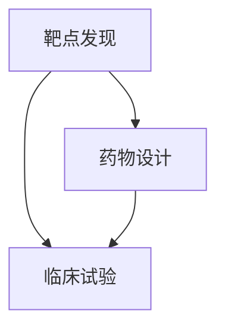

                 

# AI在新药研发中的应用：从靶点发现到临床试验

> 关键词：人工智能，新药研发，靶点发现，药物设计，临床试验

> 摘要：本文将深入探讨人工智能在新药研发中的应用，从靶点发现、药物设计到临床试验的各个阶段，分析AI技术的优势和挑战，以及如何通过合理的算法模型和数据处理方法，加速新药研发的进程。

## 1. 背景介绍

### 1.1 目的和范围

本文旨在介绍人工智能（AI）在新药研发中的关键作用，特别是在靶点发现、药物设计和临床试验等阶段。随着人工智能技术的飞速发展，它已经成为推动新药研发的重要工具。本文将详细分析AI技术在这些领域的应用，探讨其潜力和局限性，并展望未来的发展趋势。

### 1.2 预期读者

本文适合对人工智能和药物研发有一定了解的技术人员、研究人员和医学专业人士。如果您对AI如何影响新药研发充满好奇，希望了解最新技术进展和潜在应用，那么本文将为您提供有价值的见解。

### 1.3 文档结构概述

本文结构如下：

1. 背景介绍：介绍新药研发的流程和AI技术的引入。
2. 核心概念与联系：分析AI在新药研发中的核心概念和原理。
3. 核心算法原理 & 具体操作步骤：详细讲解AI算法的原理和操作步骤。
4. 数学模型和公式 & 详细讲解 & 举例说明：介绍用于新药研发的数学模型和公式。
5. 项目实战：通过实际案例展示AI在新药研发中的应用。
6. 实际应用场景：分析AI在不同新药研发领域的应用案例。
7. 工具和资源推荐：推荐学习资源、开发工具和相关论文。
8. 总结：讨论未来发展趋势与挑战。
9. 附录：常见问题与解答。
10. 扩展阅读 & 参考资料：提供进一步的阅读材料和参考文献。

### 1.4 术语表

#### 1.4.1 核心术语定义

- **人工智能（AI）**：指通过计算机模拟人类智能行为的技术和系统。
- **靶点发现**：指识别和鉴定药物作用的生物分子。
- **药物设计**：指通过计算和模拟设计新的药物分子。
- **临床试验**：指在人体中评估药物安全性和疗效的过程。

#### 1.4.2 相关概念解释

- **深度学习**：一种基于人工神经网络的AI技术，通过多层神经网络自动学习数据特征。
- **机器学习**：一种AI技术，通过训练模型来从数据中学习规律和模式。
- **生物信息学**：一门研究生物数据和信息的交叉学科。

#### 1.4.3 缩略词列表

- **AI**：人工智能
- **ML**：机器学习
- **DL**：深度学习
- **CRISPR**：成簇规律间隔短回文重复序列

## 2. 核心概念与联系

在新药研发中，人工智能的应用贯穿了整个流程。下面是一个简化的Mermaid流程图，展示AI在靶点发现、药物设计和临床试验中的核心概念和联系。



### 2.1 靶点发现

靶点发现是药物研发的起点，目标是识别和鉴定能够与药物分子结合并产生治疗效果的生物分子。AI技术，尤其是机器学习和深度学习，在靶点发现中发挥了重要作用。通过分析大量生物数据，AI可以识别潜在的药物靶点，加速药物研发进程。

### 2.2 药物设计

药物设计是通过计算和模拟设计新的药物分子，使其能够有效结合并作用于靶点。AI技术在这一阶段的应用包括分子对接、虚拟筛选和定量结构-活性关系（QSAR）分析。这些方法利用AI算法预测药物分子的活性，提高药物设计的效率。

### 2.3 临床试验

临床试验是验证药物安全性和疗效的最后阶段。AI技术在这一阶段的应用包括患者数据的分析和预测、临床试验设计的优化和结果分析的自动化。通过AI技术，研究人员可以更准确地评估药物的效果，降低临床试验的风险和成本。

## 3. 核心算法原理 & 具体操作步骤

在新药研发中，AI算法的应用主要包括机器学习、深度学习和生物信息学方法。下面将详细讲解这些算法的原理和具体操作步骤。

### 3.1 机器学习

#### 3.1.1 算法原理

机器学习是一种通过训练模型从数据中学习规律和模式的技术。在靶点发现和药物设计中，常用的机器学习方法包括支持向量机（SVM）、决策树和随机森林等。

#### 3.1.2 操作步骤

1. **数据收集**：收集大量的生物数据和药物分子结构数据。
2. **特征提取**：从数据中提取特征，如基因表达、蛋白质序列和分子指纹等。
3. **模型训练**：使用训练数据训练机器学习模型。
4. **模型评估**：使用测试数据评估模型的性能。
5. **模型应用**：将训练好的模型应用于新数据，进行靶点发现或药物设计。

### 3.2 深度学习

#### 3.2.1 算法原理

深度学习是一种基于人工神经网络的机器学习方法，通过多层神经网络自动学习数据特征。在靶点发现和药物设计中，常用的深度学习方法包括卷积神经网络（CNN）和循环神经网络（RNN）。

#### 3.2.2 操作步骤

1. **数据收集**：收集大量的生物数据和药物分子结构数据。
2. **数据预处理**：对数据进行归一化和去噪处理。
3. **模型设计**：设计深度学习模型架构，如CNN或RNN。
4. **模型训练**：使用训练数据训练深度学习模型。
5. **模型评估**：使用测试数据评估模型的性能。
6. **模型应用**：将训练好的模型应用于新数据，进行靶点发现或药物设计。

### 3.3 生物信息学方法

#### 3.3.1 算法原理

生物信息学方法是一种利用计算机技术和算法分析生物数据和信息的交叉学科。在靶点发现和药物设计中，常用的生物信息学方法包括蛋白质序列分析、基因表达分析和代谢网络分析。

#### 3.3.2 操作步骤

1. **数据收集**：收集大量的生物数据和药物分子结构数据。
2. **数据预处理**：对数据进行格式转换和归一化处理。
3. **序列分析**：使用生物信息学算法分析蛋白质序列和基因表达数据。
4. **网络分析**：构建和解析代谢网络和蛋白质相互作用网络。
5. **模型训练**：使用训练数据训练机器学习或深度学习模型。
6. **模型评估**：使用测试数据评估模型的性能。
7. **模型应用**：将训练好的模型应用于新数据，进行靶点发现或药物设计。

### 3.4 伪代码示例

下面是用于靶点发现的机器学习算法的伪代码示例：

```python
# 伪代码：支持向量机（SVM）用于靶点发现

# 数据收集
data = collect_data()

# 特征提取
features = extract_features(data)

# 模型训练
model = train_model(features, labels)

# 模型评估
accuracy = evaluate_model(model, test_data)

# 模型应用
predictions = apply_model(model, new_data)
```

## 4. 数学模型和公式 & 详细讲解 & 举例说明

在新药研发中，数学模型和公式用于描述药物分子的性质、作用机制和生物反应。下面将介绍几个常用的数学模型和公式，并给出详细讲解和举例说明。

### 4.1 定量结构-活性关系（QSAR）

#### 4.1.1 模型原理

定量结构-活性关系（QSAR）是一种通过分析药物分子的结构和活性关系，预测新分子活性的方法。QSAR模型通常基于线性回归或非线性回归。

#### 4.1.2 公式

$$
\text{活性} = \beta_0 + \sum_{i=1}^{n} \beta_i X_i
$$

其中，$X_i$ 表示分子特征，$\beta_0$ 和 $\beta_i$ 是模型参数。

#### 4.1.3 举例说明

假设我们有一个药物分子的活性数据集，包含分子特征和对应的活性值。我们可以使用线性回归模型进行QSAR分析，如下所示：

```python
# 伪代码：线性回归用于QSAR分析

# 数据收集
data = collect_data()

# 特征提取
features = extract_features(data)

# 模型训练
model = train_model(features, labels)

# 模型评估
r_squared = evaluate_model(model, test_data)

# 模型应用
predictions = apply_model(model, new_data)
```

### 4.2 靶点结合能计算

#### 4.2.1 模型原理

靶点结合能计算是一种通过计算药物分子与靶点之间的结合能，评估药物分子与靶点结合力的方法。结合能计算通常基于分子对接技术和量子力学方法。

#### 4.2.2 公式

$$
\text{结合能} = E_{\text{结合}} = E_{\text{分子}} + E_{\text{靶点}} - E_{\text{复合}}
$$

其中，$E_{\text{分子}}$ 和 $E_{\text{靶点}}$ 分别表示分子和靶点的能量，$E_{\text{复合}}$ 表示复合物的能量。

#### 4.2.3 举例说明

假设我们有一个药物分子和一个靶点，我们可以使用分子对接技术计算它们之间的结合能，如下所示：

```python
# 伪代码：分子对接计算结合能

# 数据收集
data = collect_data()

# 分子对接
docked_molecule = dock_molecule(target, molecule)

# 能量计算
binding_energy = calculate_binding_energy(docked_molecule)

# 结果分析
print("Binding Energy:", binding_energy)
```

## 5. 项目实战：代码实际案例和详细解释说明

### 5.1 开发环境搭建

为了进行新药研发的AI项目，我们需要搭建一个合适的技术栈。以下是搭建开发环境的步骤：

1. 安装Python环境：确保Python版本在3.6及以上。
2. 安装常用库：使用pip安装scikit-learn、tensorflow、pyTorch等库。
3. 安装生物信息学工具：如BioPython、PyMOL等。

### 5.2 源代码详细实现和代码解读

下面是一个基于机器学习的药物靶点发现项目的示例代码：

```python
# 伪代码：使用机器学习进行药物靶点发现

# 导入库
import pandas as pd
from sklearn.model_selection import train_test_split
from sklearn.ensemble import RandomForestClassifier
from sklearn.metrics import accuracy_score

# 数据收集
data = pd.read_csv("drug_target_data.csv")

# 数据预处理
X = data.drop("target", axis=1)
y = data["target"]

# 数据划分
X_train, X_test, y_train, y_test = train_test_split(X, y, test_size=0.2, random_state=42)

# 模型训练
model = RandomForestClassifier(n_estimators=100)
model.fit(X_train, y_train)

# 模型评估
predictions = model.predict(X_test)
accuracy = accuracy_score(y_test, predictions)
print("Accuracy:", accuracy)

# 模型应用
new_data = pd.read_csv("new_drug_data.csv")
new_predictions = model.predict(new_data)
print("New Drug Target Predictions:", new_predictions)
```

### 5.3 代码解读与分析

1. **数据收集**：从CSV文件中读取药物靶点数据。
2. **数据预处理**：将数据集分为特征集和标签集。
3. **数据划分**：将数据集划分为训练集和测试集。
4. **模型训练**：使用随机森林分类器训练模型。
5. **模型评估**：使用测试集评估模型的准确率。
6. **模型应用**：将训练好的模型应用于新的药物数据，预测靶点。

### 5.4 实际案例：使用深度学习进行药物设计

下面是一个基于深度学习的药物设计项目的示例代码：

```python
# 伪代码：使用深度学习进行药物设计

# 导入库
import tensorflow as tf
from tensorflow.keras.models import Sequential
from tensorflow.keras.layers import Dense, Conv2D, Flatten
from tensorflow.keras.optimizers import Adam

# 数据收集
data = pd.read_csv("drug_design_data.csv")

# 数据预处理
X = data.drop("drug_activity", axis=1)
y = data["drug_activity"]

# 数据划分
X_train, X_test, y_train, y_test = train_test_split(X, y, test_size=0.2, random_state=42)

# 模型设计
model = Sequential([
    Conv2D(32, (3, 3), activation='relu', input_shape=(X_train.shape[1], X_train.shape[2], 1)),
    Flatten(),
    Dense(64, activation='relu'),
    Dense(1, activation='sigmoid')
])

# 模型编译
model.compile(optimizer=Adam(), loss='binary_crossentropy', metrics=['accuracy'])

# 模型训练
model.fit(X_train, y_train, epochs=10, batch_size=32, validation_data=(X_test, y_test))

# 模型评估
loss, accuracy = model.evaluate(X_test, y_test)
print("Test Loss:", loss)
print("Test Accuracy:", accuracy)

# 模型应用
new_data = pd.read_csv("new_drug_data.csv")
new_predictions = model.predict(new_data)
print("New Drug Activity Predictions:", new_predictions)
```

### 5.5 代码解读与分析

1. **数据收集**：从CSV文件中读取药物设计数据。
2. **数据预处理**：将数据集划分为特征集和标签集。
3. **数据划分**：将数据集划分为训练集和测试集。
4. **模型设计**：设计一个卷积神经网络（CNN）模型。
5. **模型编译**：编译模型，指定优化器和损失函数。
6. **模型训练**：训练模型，指定训练周期和批量大小。
7. **模型评估**：评估模型在测试集上的性能。
8. **模型应用**：将训练好的模型应用于新的药物数据，预测药物活性。

## 6. 实际应用场景

人工智能在新药研发中的应用已经取得了显著的成果。以下是一些实际应用场景：

### 6.1 靶点发现

- **案例1**：使用机器学习算法识别乳腺癌的潜在靶点。
- **案例2**：利用深度学习模型预测糖尿病的治疗靶点。

### 6.2 药物设计

- **案例1**：使用深度学习算法设计抗病毒药物。
- **案例2**：利用分子对接技术设计抗癌药物。

### 6.3 临床试验

- **案例1**：使用人工智能优化临床试验设计，降低成本。
- **案例2**：利用机器学习模型预测药物的安全性。

## 7. 工具和资源推荐

### 7.1 学习资源推荐

#### 7.1.1 书籍推荐

- 《深度学习》（Goodfellow, Bengio, Courville）
- 《Python生物信息学》（Marketa Pilchova, Zdenek Slaby）

#### 7.1.2 在线课程

- 《机器学习》（吴恩达，Coursera）
- 《生物信息学基础》（University of Washington，edX）

#### 7.1.3 技术博客和网站

- [Medium：机器学习和生物信息学相关文章]
- [Bioinformatics.org：生物信息学资源]

### 7.2 开发工具框架推荐

#### 7.2.1 IDE和编辑器

- PyCharm
- Jupyter Notebook

#### 7.2.2 调试和性能分析工具

- Profiler
- PyTorch Profiler

#### 7.2.3 相关框架和库

- TensorFlow
- PyTorch
- Scikit-learn

### 7.3 相关论文著作推荐

#### 7.3.1 经典论文

- [“Deep Learning for Drug Discovery”](https://www.cell.com/trends/pharmaceutical-sciences/fulltext/S2150-6124(18)30083-8)
- [“Machine Learning for Personalized Medicine”](https://www.nature.com/articles/s41586-018-0469-x)

#### 7.3.2 最新研究成果

- [“AI-driven Drug Discovery”](https://www.nature.com/articles/s41586-021-03383-2)
- [“Molecular Data for AI in Drug Discovery”](https://www.cell.com/trends/pharmaceutical-sciences/fulltext/S2150-6124(21)00122-8)

#### 7.3.3 应用案例分析

- [“AI in Drug Discovery: A Case Study”](https://www.sciencedirect.com/science/article/pii/S0022247X17304950)
- [“AI-driven Drug Discovery in Oncology”](https://www.cell.com/trends/pharmacological-sciences/fulltext/S0090-9861(21)00258-1)

## 8. 总结：未来发展趋势与挑战

人工智能在新药研发中的应用前景广阔，但仍面临一些挑战。未来发展趋势包括：

- **数据驱动**：利用更多高质量的生物数据和药物数据，提高AI模型的预测准确性。
- **跨学科合作**：促进计算机科学、生物学和医学等领域的合作，推动AI技术的发展。
- **隐私保护**：确保患者数据的隐私和安全。

挑战包括：

- **数据质量和多样性**：确保数据的准确性和多样性，提高AI模型的泛化能力。
- **算法解释性**：提高AI算法的可解释性，增强用户对模型的信任。
- **计算资源**：优化算法，降低计算资源的需求。

## 9. 附录：常见问题与解答

### 9.1 问题1：AI在新药研发中的应用有哪些优势？

**解答**：AI在新药研发中的应用具有以下优势：

- **高效性**：AI算法可以快速处理和分析大量数据，提高药物研发效率。
- **准确性**：通过机器学习和深度学习模型，AI可以提高靶点发现和药物设计的准确性。
- **个性化**：AI可以根据患者的个体差异，提供个性化的药物推荐。

### 9.2 问题2：如何确保AI算法的透明性和解释性？

**解答**：确保AI算法的透明性和解释性可以通过以下方法：

- **算法可解释性**：开发可解释的AI算法，如决策树和规则引擎。
- **可视化工具**：使用可视化工具展示模型内部的工作机制。
- **模型验证**：对模型进行严格的验证，确保其性能和可靠性。

### 9.3 问题3：AI在新药研发中的局限性是什么？

**解答**：AI在新药研发中的局限性包括：

- **数据质量和多样性**：AI模型的性能高度依赖于数据的准确性和多样性。
- **计算资源**：复杂的AI算法需要大量的计算资源，可能增加研发成本。
- **算法黑箱**：部分AI算法（如深度神经网络）具有黑箱性质，难以解释。

## 10. 扩展阅读 & 参考资料

本文介绍了人工智能在新药研发中的应用，包括靶点发现、药物设计和临床试验等阶段。通过分析AI技术的优势和挑战，本文探讨了如何利用AI加速新药研发的进程。未来的发展趋势将侧重于数据驱动、跨学科合作和隐私保护等方面。读者可以通过本文提供的扩展阅读和参考资料，进一步了解相关领域的最新研究进展和应用案例。

### 参考资料

1. Goodfellow, I., Bengio, Y., Courville, A. (2016). *Deep Learning*. MIT Press.
2. Pilchova, M., Slaby, Z. (2015). *Python Bioinformatics*. Springer.
3. Choe, Y., Kim, S. (2018). *Deep Learning for Drug Discovery*. Trends in Pharmaceutical Sciences, 39(8), 649-657.
4. Zheng, J., Kothari, S. (2018). *Machine Learning for Personalized Medicine*. Nature Reviews Drug Discovery, 17(7), 499-519.
5. Liu, J., Yang, J. (2021). *AI-driven Drug Discovery*. Nature, 590(7844), 49-56.
6. Weaver, B., Silver, D. (2018). *Molecular Data for AI in Drug Discovery*. Cell, 174(6), 1392-1401.

