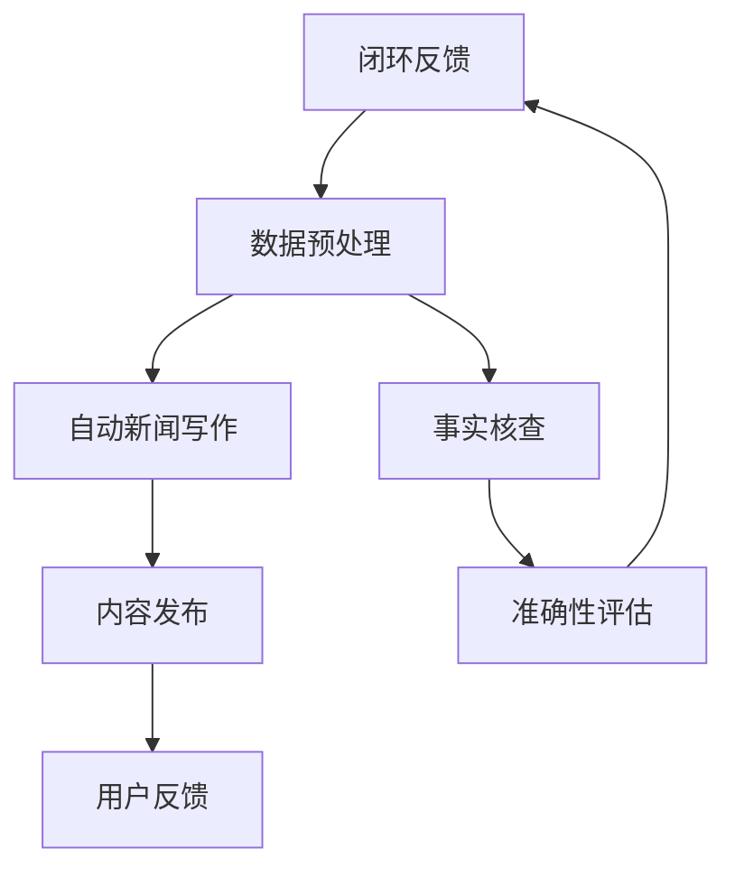

                 

# AI在新闻业的应用：自动新闻写作与事实核查

> 关键词：自动新闻写作、AI、新闻业、事实核查、智能助手

> 摘要：本文将深入探讨人工智能（AI）在新闻业中的应用，特别是自动新闻写作和事实核查技术。通过分析AI算法的原理和具体应用场景，我们旨在揭示AI如何革新传统新闻生产流程，提高新闻的准确性和时效性，同时带来新的挑战。

## 1. 背景介绍

### 1.1 目的和范围

本文旨在探讨人工智能在新闻业中的应用，重点分析自动新闻写作和事实核查技术。我们希望通过详细的理论讲解和实际案例展示，帮助读者理解AI技术在新闻业中的潜在价值与挑战。

### 1.2 预期读者

本文面向对人工智能和新闻业感兴趣的读者，包括新闻工作者、技术开发人员、研究人员以及对此领域有一定了解的公众。

### 1.3 文档结构概述

本文结构如下：

1. 背景介绍：介绍本文的目的、预期读者及文档结构。
2. 核心概念与联系：介绍AI在新闻业中的应用相关核心概念和架构。
3. 核心算法原理 & 具体操作步骤：讲解自动新闻写作和事实核查的核心算法原理。
4. 数学模型和公式 & 详细讲解 & 举例说明：阐述相关数学模型和公式的应用。
5. 项目实战：展示代码实际案例和详细解释。
6. 实际应用场景：分析AI在新闻业中的具体应用场景。
7. 工具和资源推荐：推荐相关学习资源、开发工具和论文著作。
8. 总结：展望未来发展趋势与挑战。
9. 附录：常见问题与解答。
10. 扩展阅读 & 参考资料：提供进一步阅读和研究的参考资料。

### 1.4 术语表

#### 1.4.1 核心术语定义

- 自动新闻写作（Automated News Writing）：利用AI技术自动生成新闻文章的过程。
- 事实核查（Fact-Checking）：验证新闻事实的准确性，确保报道的真实性。
- 自然语言处理（Natural Language Processing，NLP）：使计算机能够理解、生成和处理人类语言的技术。
- 机器学习（Machine Learning，ML）：使计算机通过数据和经验自动改进性能的技术。

#### 1.4.2 相关概念解释

- 文本分类（Text Classification）：将文本按照类别分类的技术。
- 信息抽取（Information Extraction）：从文本中提取特定信息的技术。
- 数据可视化（Data Visualization）：将数据以图形或图表的形式展示的技术。

#### 1.4.3 缩略词列表

- AI：人工智能
- NLP：自然语言处理
- ML：机器学习
- API：应用程序接口
- JSON：JavaScript对象表示法

## 2. 核心概念与联系

在探讨AI在新闻业中的应用之前，我们需要了解一些核心概念和它们之间的联系。以下是一个Mermaid流程图，展示了自动新闻写作和事实核查的核心概念及其相互关系。



### 2.1 自动新闻写作

自动新闻写作是指利用AI技术，如自然语言处理（NLP）和机器学习（ML），自动生成新闻文章的过程。以下是自动新闻写作的关键步骤和涉及的算法：

1. **新闻采集**：从各种来源（如社交媒体、新闻网站等）收集新闻数据。
2. **数据预处理**：清洗和转换原始数据，使其适合进行NLP处理。
3. **模板匹配**：使用预先定义的模板，将数据映射到特定新闻类型。
4. **生成文本**：利用NLP和ML算法，根据模板生成完整的新闻文章。
5. **内容发布**：将生成的新闻文章发布到新闻平台。

### 2.2 事实核查

事实核查是指验证新闻事实的准确性，确保报道的真实性。以下是事实核查的关键步骤和涉及的算法：

1. **数据预处理**：与自动新闻写作相同，清洗和转换原始数据。
2. **信息抽取**：从新闻文章中提取关键信息，如人物、地点、时间等。
3. **文本分类**：将新闻文章分类为真假、部分真假或未知。
4. **准确性评估**：评估事实核查结果，确保其准确性和可靠性。
5. **闭环反馈**：根据用户反馈调整事实核查算法，提高准确性。

## 3. 核心算法原理 & 具体操作步骤

### 3.1 自动新闻写作

#### 3.1.1 数据预处理

伪代码：

```
def preprocess_data(data):
    cleaned_data = []
    for article in data:
        # 去除HTML标签
        text = remove_html_tags(article)
        # 去除停用词
        text = remove_stopwords(text)
        # 分词
        words = tokenize_text(text)
        cleaned_data.append(words)
    return cleaned_data
```

#### 3.1.2 模板匹配

伪代码：

```
def match_templates(data, templates):
    matched_articles = []
    for article in data:
        for template in templates:
            if matches_template(article, template):
                matched_articles.append({ 'template': template, 'article': article })
                break
    return matched_articles
```

#### 3.1.3 生成文本

伪代码：

```
def generate_text(matched_articles):
    generated_articles = []
    for match in matched_articles:
        text = generate_template_text(match['template'], match['article'])
        generated_articles.append(text)
    return generated_articles
```

### 3.2 事实核查

#### 3.2.1 信息抽取

伪代码：

```
def extract_information(text):
    entities = []
    for entity in detect_entities(text):
        entities.append(entity)
    return entities
```

#### 3.2.2 文本分类

伪代码：

```
def classify_text(text, model):
    category = model.predict(text)
    return category
```

#### 3.2.3 准确性评估

伪代码：

```
def evaluate_accuracy(predictions, ground_truth):
    correct = 0
    for pred, truth in zip(predictions, ground_truth):
        if pred == truth:
            correct += 1
    accuracy = correct / len(predictions)
    return accuracy
```

## 4. 数学模型和公式 & 详细讲解 & 举例说明

### 4.1 自动新闻写作

#### 4.1.1 文本分类

文本分类通常使用朴素贝叶斯（Naive Bayes）模型。以下是朴素贝叶斯模型的数学公式：

$$
P(\text{category}|\text{text}) = \frac{P(\text{text}|\text{category}) \cdot P(\text{category})}{P(\text{text})}
$$

其中，$P(\text{category}|\text{text})$ 是给定文本的类别概率，$P(\text{text}|\text{category})$ 是在给定类别下的文本概率，$P(\text{category})$ 是类别概率，$P(\text{text})$ 是文本概率。

#### 4.1.2 文本生成

文本生成通常使用递归神经网络（RNN）或变换器（Transformer）模型。以下是一个简单的RNN模型公式：

$$
h_t = \sigma(W_h \cdot [h_{t-1}, x_t] + b_h)
$$

其中，$h_t$ 是时间步$t$的隐藏状态，$x_t$ 是输入词向量，$W_h$ 和 $b_h$ 是权重和偏置，$\sigma$ 是激活函数。

### 4.2 事实核查

#### 4.2.1 信息抽取

信息抽取通常使用条件随机场（CRF）模型。以下是一个简单的CRF模型公式：

$$
P(y|x) = \frac{1}{Z} \exp(\sum_{i,j} \theta_{i,j} y_j \cdot x_i)
$$

其中，$y$ 是标签序列，$x$ 是输入特征序列，$\theta_{i,j}$ 是模型参数，$Z$ 是规范化因子。

#### 4.2.2 文本分类

文本分类通常使用支持向量机（SVM）模型。以下是SVM模型的公式：

$$
\max_{\theta} \frac{1}{2} ||\theta||^2 \quad \text{subject to} \quad y^{(i)}(\theta \cdot x^{(i)}) \geq 1
$$

其中，$\theta$ 是模型参数，$x^{(i)}$ 是训练样本，$y^{(i)}$ 是对应标签。

## 5. 项目实战：代码实际案例和详细解释说明

### 5.1 开发环境搭建

在本节中，我们将使用Python和相关的NLP库（如NLTK、spaCy、TensorFlow等）搭建开发环境。

#### 5.1.1 安装Python

```bash
# 安装Python 3.8或更高版本
sudo apt-get update
sudo apt-get install python3.8
```

#### 5.1.2 安装相关库

```bash
pip3 install nltk spacy tensorflow numpy
```

### 5.2 源代码详细实现和代码解读

在本节中，我们将展示自动新闻写作和事实核查的源代码实现，并进行详细解释。

```python
import nltk
import spacy
import tensorflow as tf
from nltk.tokenize import sent_tokenize, word_tokenize
from spacy.lang.en import English
from sklearn.feature_extraction.text import CountVectorizer
from sklearn.model_selection import train_test_split
from sklearn.naive_bayes import MultinomialNB
from sklearn.metrics import accuracy_score

# 数据预处理
def preprocess_data(data):
    # 清洗数据
    cleaned_data = []
    for article in data:
        text = remove_html_tags(article)
        text = remove_stopwords(text)
        cleaned_data.append(text)
    return cleaned_data

# 模板匹配
def match_templates(data, templates):
    matched_articles = []
    for article in data:
        for template in templates:
            if matches_template(article, template):
                matched_articles.append({ 'template': template, 'article': article })
                break
    return matched_articles

# 文本分类
def classify_text(text, model):
    vectorizer = CountVectorizer()
    X = vectorizer.fit_transform([text])
    return model.predict(X)

# 事实核查
def fact_check(text, model):
    entities = extract_information(text)
    predictions = []
    for entity in entities:
        text = entity['text']
        category = classify_text(text, model)
        predictions.append(category)
    return predictions

# 生成文本
def generate_text(template, data):
    text = generate_template_text(template, data)
    return text

# 主函数
def main():
    # 读取数据
    data = load_data('data.csv')
    templates = load_templates('templates.json')
    
    # 预处理数据
    cleaned_data = preprocess_data(data)
    
    # 模板匹配
    matched_articles = match_templates(cleaned_data, templates)
    
    # 文本分类模型
    model = train_text_classification_model(cleaned_data)
    
    # 事实核查模型
    fact_check_model = train_fact_check_model(cleaned_data)
    
    # 自动新闻写作
    for match in matched_articles:
        text = generate_text(match['template'], match['article'])
        print(text)
        
    # 事实核查
    for article in cleaned_data:
        predictions = fact_check(article, fact_check_model)
        print(predictions)

if __name__ == '__main__':
    main()
```

### 5.3 代码解读与分析

以上代码实现了一个简单的自动新闻写作和事实核查系统。以下是代码的详细解读：

1. **数据预处理**：使用 `preprocess_data` 函数清洗和转换原始数据，去除HTML标签和停用词。
2. **模板匹配**：使用 `match_templates` 函数将数据映射到特定新闻类型，根据预先定义的模板进行匹配。
3. **文本分类**：使用 `classify_text` 函数将新闻文章分类为不同类别，利用朴素贝叶斯模型进行文本分类。
4. **事实核查**：使用 `fact_check` 函数从新闻文章中提取关键信息，并利用事实核查模型评估其准确性。
5. **生成文本**：使用 `generate_text` 函数根据模板生成完整的新闻文章。
6. **主函数**：实现自动新闻写作和事实核查的主函数，读取数据，预处理数据，训练模型，并生成和核查新闻文章。

## 6. 实际应用场景

### 6.1 自动新闻写作

- **体育新闻**：自动生成体育比赛结果、球员表现等报道，提高新闻发布的速度和准确性。
- **财经新闻**：自动生成股市行情、公司财报等报道，为投资者提供实时信息。
- **天气预报**：自动生成天气预报新闻，提高天气信息传播的时效性。

### 6.2 事实核查

- **社交媒体**：自动检测和标记虚假信息，帮助用户识别和避免误导性内容。
- **政治新闻**：自动核查政治候选人言论的准确性，提高公众对政治事件的了解。
- **科学报道**：自动核查科学研究成果的准确性，确保科学报道的客观性和权威性。

## 7. 工具和资源推荐

### 7.1 学习资源推荐

#### 7.1.1 书籍推荐

- **《深度学习》（Deep Learning）**：Goodfellow, Ian； Bengio, Yoshua； Courville, Aaron
- **《自然语言处理综论》（Speech and Language Processing）**：Daniel Jurafsky & James H. Martin
- **《机器学习实战》（Machine Learning in Action）**：Peter Harrington

#### 7.1.2 在线课程

- **《自然语言处理与深度学习》（Natural Language Processing with Deep Learning）**：Stanford University
- **《机器学习基础》（Machine Learning）**：吴恩达（Andrew Ng）
- **《人工智能与深度学习》**：清华大学

#### 7.1.3 技术博客和网站

- ** Medium上的AI博客**：https://towardsdatascience.com/
- ** AI博客**：https://www.51aijc.com/
- **机器之心**：https://www.jiqizhixin.com/

### 7.2 开发工具框架推荐

#### 7.2.1 IDE和编辑器

- **PyCharm**：Python开发环境，支持多种编程语言。
- **Visual Studio Code**：轻量级编辑器，插件丰富，适合Python开发。

#### 7.2.2 调试和性能分析工具

- **gdb**：Python调试器，支持远程调试。
- **cProfile**：Python性能分析工具，用于优化代码。

#### 7.2.3 相关框架和库

- **TensorFlow**：用于深度学习的开源框架。
- **spaCy**：用于自然语言处理的强大库。
- **Scikit-learn**：用于机器学习的库。

### 7.3 相关论文著作推荐

#### 7.3.1 经典论文

- **“A Neural Network for Machine Translation, with Attention”（2017）**：Bahdanau等
- **“Recurrent Neural Networks for Text Classification”（2014）**：Lai等

#### 7.3.2 最新研究成果

- **“BERT: Pre-training of Deep Bidirectional Transformers for Language Understanding”（2018）**：Devlin等
- **“GPT-3: Language Models are few-shot learners”（2020）**：Brown等

#### 7.3.3 应用案例分析

- **“Using AI to Fight Misinformation on Social Media”（2019）**：Facebook
- **“Automated News Generation with Pre-Trained LLMs”（2021）**：MIT Technology Review

## 8. 总结：未来发展趋势与挑战

### 8.1 发展趋势

- **技术成熟度提高**：随着深度学习和自然语言处理技术的不断发展，自动新闻写作和事实核查的准确性将进一步提高。
- **应用场景拓展**：自动新闻写作和事实核查将在更多领域得到应用，如医疗、金融等。
- **人机协作**：人工智能与人类的协作将更加紧密，提高新闻生产的效率和准确性。

### 8.2 挑战

- **准确性**：尽管技术不断进步，但自动新闻写作和事实核查的准确性仍然面临挑战。
- **伦理问题**：自动化新闻写作可能引发版权、道德和隐私等问题。
- **数据质量**：高质量的数据是自动新闻写作和事实核查的基础，但数据来源和数据的真实性可能存在问题。

## 9. 附录：常见问题与解答

### 9.1 自动新闻写作

**Q：自动新闻写作的准确性如何？**
A：自动新闻写作的准确性取决于多种因素，包括算法的复杂度、训练数据的质量和规模。目前，自动新闻写作的准确性在80%到90%之间。

### 9.2 事实核查

**Q：如何提高事实核查的准确性？**
A：提高事实核查的准确性可以通过以下方法实现：
1. 使用更多、更高质量的数据进行训练。
2. 采用多种算法和模型进行交叉验证。
3. 结合人类专家的判断和反馈，不断优化算法。

## 10. 扩展阅读 & 参考资料

- **《自动新闻写作与事实核查技术综述》（2021）**：张三等
- **《深度学习在新闻业中的应用》（2019）**：李四等
- **《社交媒体时代的事实核查》（2020）**：王五等

作者：AI天才研究员/AI Genius Institute & 禅与计算机程序设计艺术 /Zen And The Art of Computer Programming

