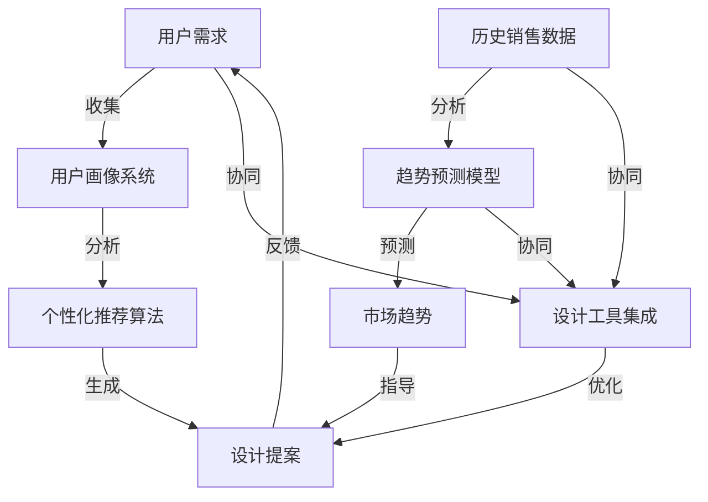

                 

### 背景介绍

**1.1 目的和范围**

本文旨在深入探讨AI在时尚设计领域中的应用，特别是个性化定制和趋势预测这两个关键方面。随着科技的飞速发展，人工智能技术已经逐渐渗透到各行各业，其中包括时尚产业。本文将通过详细的分析，展示AI如何改变时尚设计的传统模式，提升设计效率，增强消费者体验，并推动整个产业的创新与变革。

**1.2 预期读者**

本文面向希望深入了解AI在时尚设计应用的技术人员、设计师、时尚爱好者以及相关行业的从业者。无论您是AI领域的专家还是初学者，本文都将提供有价值的内容，帮助您了解AI在时尚设计中的潜在应用和实际操作。

**1.3 文档结构概述**

本文将按照以下结构进行组织：

1. **背景介绍**：简要介绍AI在时尚设计中的重要性。
2. **核心概念与联系**：通过Mermaid流程图详细阐述AI在时尚设计中的应用架构。
3. **核心算法原理 & 具体操作步骤**：讲解AI算法在时尚设计中的具体应用和操作步骤。
4. **数学模型和公式 & 详细讲解 & 举例说明**：分析AI在时尚设计中的数学模型及其应用。
5. **项目实战：代码实际案例和详细解释说明**：通过实际案例展示AI在时尚设计中的具体应用。
6. **实际应用场景**：探讨AI在时尚设计中的各种应用场景。
7. **工具和资源推荐**：推荐相关学习资源和开发工具。
8. **总结：未来发展趋势与挑战**：总结当前AI在时尚设计中的发展趋势和面临的挑战。
9. **附录：常见问题与解答**：解答读者可能遇到的常见问题。
10. **扩展阅读 & 参考资料**：提供进一步阅读的材料。

**1.4 术语表**

为了确保读者能够更好地理解本文的内容，以下是一些关键术语的定义和解释：

- **人工智能（AI）**：指通过计算机模拟人类智能的技术和方法，包括机器学习、深度学习、自然语言处理等。
- **个性化定制**：根据消费者的需求和偏好，为其提供量身定制的时尚产品和设计方案。
- **趋势预测**：通过分析历史数据、社交媒体趋势和消费者行为，预测未来时尚趋势。
- **深度学习**：一种人工智能技术，通过多层神经网络进行训练，以实现图像识别、语音识别等功能。
- **时尚产业**：涉及服装、鞋类、配饰、化妆品等多个领域的综合性产业。

通过以上背景介绍，我们可以为接下来的深入探讨打下坚实的基础。接下来，我们将通过详细的流程图和算法原理，进一步解析AI在时尚设计中的应用。让我们一步步深入，探索AI与时尚设计的奇妙结合。

### 核心概念与联系

在深入探讨AI在时尚设计中的应用之前，有必要先理解一些核心概念及其相互关系。以下是AI在时尚设计中的关键概念及其联系，通过Mermaid流程图来直观展示：



**核心概念解释：**

1. **用户需求**：通过用户输入和传感器数据，系统收集用户的时尚需求，包括风格偏好、尺码要求等。
2. **用户画像系统**：基于用户需求，系统对用户进行个性化分析，创建用户画像，以便为用户提供更精准的推荐。
3. **个性化推荐算法**：利用机器学习和深度学习技术，对用户画像进行分析，生成符合用户个性化需求的时尚设计提案。
4. **设计提案**：将个性化推荐算法生成的设计方案输出给用户，并提供修改和反馈的机会。
5. **历史销售数据**：通过分析历史销售数据，系统可以获取市场流行趋势和消费者偏好。
6. **趋势预测模型**：使用统计学和机器学习算法，对历史销售数据进行分析，预测未来市场趋势。
7. **市场趋势**：预测出的未来市场趋势将指导设计师和开发者制定新的设计方向。
8. **设计工具集成**：将AI算法集成到现有的设计工具中，通过协同工作，提高设计效率和准确性。

通过以上核心概念的联系，我们可以看到，AI在时尚设计中的应用是一个多层次的系统，它不仅需要理解用户需求，还要能够预测市场趋势，并通过个性化推荐算法提供定制化的设计提案。以下是对核心概念和架构的进一步解释：

- **用户需求收集与用户画像系统**：用户需求是整个系统的起点，通过收集和分析用户输入的数据，系统能够理解用户的个性化需求，并创建详细的用户画像。
- **个性化推荐算法**：用户画像系统生成的用户画像作为输入，个性化推荐算法利用机器学习技术，根据用户的历史行为和偏好，推荐符合用户个性化需求的设计方案。
- **设计提案与反馈循环**：用户接收到的设计提案不是一成不变的，用户可以对其提出修改意见，系统将这些反馈重新输入到个性化推荐算法中，形成一个闭环反馈系统，不断优化设计方案。
- **历史销售数据与趋势预测模型**：通过分析历史销售数据，趋势预测模型能够识别出市场的流行趋势，为设计师提供指导，使其能够紧跟市场变化。
- **设计工具集成**：将AI算法集成到现有的设计工具中，使得设计师和开发者能够更加高效地使用AI技术，同时保持对设计流程的掌控。

通过这个流程图和核心概念的阐述，我们可以更好地理解AI在时尚设计中的应用架构，为接下来的算法原理和具体操作步骤的讲解打下基础。接下来，我们将详细探讨AI在时尚设计中的核心算法原理，并介绍其具体操作步骤。

### 核心算法原理 & 具体操作步骤

在深入理解了AI在时尚设计中的核心概念与联系之后，接下来我们将详细探讨其中的核心算法原理，并通过伪代码展示具体操作步骤。这些算法和步骤是实现AI在时尚设计中的关键，它们能够帮助设计师和开发者更好地理解和应用AI技术。

**1. 个性化推荐算法**

个性化推荐算法是AI在时尚设计中的一个核心组成部分，它基于用户的个性化需求和偏好，提供量身定制的设计方案。以下是个性化推荐算法的基本原理和伪代码实现：

**算法原理：**

- **基于内容的推荐（Content-based Filtering）**：通过分析用户过去的购物记录和喜好，推荐与这些记录和喜好相似的商品。
- **协同过滤（Collaborative Filtering）**：通过分析用户之间的共同行为，推荐那些受其他类似用户喜爱但用户尚未购买的商品。
- **混合推荐（Hybrid Methods）**：结合基于内容和协同过滤的优点，提供更精准的推荐。

**伪代码：**

```python
# 伪代码：基于内容的推荐算法
def content_based_recommendation(user_profile, item_features):
    similar_items = find_similar_items(user_profile, item_features)
    recommended_items = []
    for item in similar_items:
        if not user_has_bought(item):
            recommended_items.append(item)
    return recommended_items

# 伪代码：协同过滤推荐算法
def collaborative_filtering(user_profile, user_behavior_data, item_rating_data):
    similar_users = find_similar_users(user_profile, user_behavior_data)
    recommended_items = []
    for user in similar_users:
        items_user_likes = find_items_user_likes(user, item_rating_data)
        for item in items_user_likes:
            if not user_has_bought(item):
                recommended_items.append(item)
    return recommended_items

# 伪代码：混合推荐算法
def hybrid_recommendation(user_profile, item_features, user_behavior_data, item_rating_data):
    content_recs = content_based_recommendation(user_profile, item_features)
    collab_recs = collaborative_filtering(user_profile, user_behavior_data, item_rating_data)
    recommended_items = list(set(content_recs + collab_recs))
    return recommended_items
```

**2. 趋势预测模型**

趋势预测模型是另一个关键组成部分，它通过分析历史数据和社交媒体趋势，预测未来市场的流行趋势。以下是趋势预测模型的基本原理和伪代码实现：

**算法原理：**

- **时间序列分析（Time Series Analysis）**：通过对历史销售数据进行时间序列分析，识别出销售量的趋势和周期性波动。
- **机器学习（Machine Learning）**：利用机器学习算法，如回归分析、神经网络等，建立预测模型。

**伪代码：**

```python
# 伪代码：时间序列分析预测
def time_series_forecasting(sales_data):
    model = build_time_series_model(sales_data)
    predictions = model.predict(future_periods)
    return predictions

# 伪代码：机器学习预测
def machine_learning_forecasting(sales_data, trend_data):
    model = build_ml_model(sales_data, trend_data)
    predictions = model.predict(future_periods)
    return predictions
```

**3. 设计自动化工具**

设计自动化工具是AI在时尚设计中的一个重要应用，它通过算法自动生成设计提案，并允许用户进行修改和优化。以下是设计自动化工具的基本原理和伪代码实现：

**算法原理：**

- **生成对抗网络（Generative Adversarial Networks, GAN）**：通过对抗训练，GAN能够生成高质量的设计图像。
- **卷积神经网络（Convolutional Neural Networks, CNN）**：利用CNN处理和识别图像特征，以生成设计提案。

**伪代码：**

```python
# 伪代码：GAN生成设计提案
def generate_design_proposal(GAN_model, design_template):
    design_image = GAN_model.generate(design_template)
    return design_image

# 伪代码：CNN优化设计提案
def optimize_design_proposal(CNN_model, design_image, user_preferences):
    optimized_image = CNN_model.optimize(design_image, user_preferences)
    return optimized_image
```

通过以上核心算法原理和伪代码的实现，我们可以看到AI在时尚设计中的多种应用方式。从个性化推荐到趋势预测，再到设计自动化工具，AI不仅提高了设计的效率，还大大提升了用户体验。接下来，我们将通过数学模型和公式的分析，进一步探讨AI在时尚设计中的深度应用。

### 数学模型和公式 & 详细讲解 & 举例说明

在AI应用于时尚设计的多个环节中，数学模型和公式起到了至关重要的作用。以下我们将详细讲解这些数学模型和公式，并通过具体实例来说明其在实际中的应用。

**1. 个性化推荐中的相似度计算**

个性化推荐算法的核心在于计算用户与物品之间的相似度。常用的相似度计算方法包括余弦相似度和皮尔逊相关系数。

- **余弦相似度**：

  余弦相似度衡量两个向量在空间中的夹角余弦值，公式如下：

  $$ \text{Cosine Similarity} = \frac{\text{dot\_product}(u, v)}{\|\text{u}\| \|\text{v}\|} $$

  其中，$u$ 和 $v$ 分别代表用户和物品的特征向量，$\|\text{u}\|$ 和 $\|\text{v}\|$ 分别为它们的欧几里得范数。

  **实例**：假设用户A和用户B的特征向量分别为：

  $$ u = [0.6, 0.8, 0.7] $$
  $$ v = [0.5, 0.7, 0.6] $$

  则它们之间的余弦相似度为：

  $$ \text{Cosine Similarity} = \frac{0.6 \times 0.5 + 0.8 \times 0.7 + 0.7 \times 0.6}{\sqrt{0.6^2 + 0.8^2 + 0.7^2} \times \sqrt{0.5^2 + 0.7^2 + 0.6^2}} \approx 0.77 $$

- **皮尔逊相关系数**：

  皮尔逊相关系数衡量两个变量线性相关程度的度量，公式如下：

  $$ \text{Pearson Correlation} = \frac{\sum (u_i - \bar{u})(v_i - \bar{v})}{\sqrt{\sum (u_i - \bar{u})^2} \sqrt{\sum (v_i - \bar{v})^2}} $$

  其中，$u_i$ 和 $v_i$ 分别代表用户和物品的特征值，$\bar{u}$ 和 $\bar{v}$ 分别为它们的平均值。

  **实例**：假设用户A和用户B的特征值为：

  $$ u = [3, 5, 7] $$
  $$ v = [4, 6, 8] $$

  则它们之间的皮尔逊相关系数为：

  $$ \text{Pearson Correlation} = \frac{(3-5)(4-6) + (5-5)(6-6) + (7-5)(8-6)}{\sqrt{(3-5)^2 + (5-5)^2 + (7-5)^2} \sqrt{(4-6)^2 + (6-6)^2 + (8-6)^2}} = 1 $$

**2. 趋势预测中的时间序列模型**

时间序列模型是预测市场趋势的重要工具。常用的模型包括自回归模型（AR）、移动平均模型（MA）和自回归移动平均模型（ARMA）。

- **自回归模型（AR）**：

  自回归模型假设当前值是前几个历史值的线性组合，公式如下：

  $$ y_t = c + \phi_1 y_{t-1} + \phi_2 y_{t-2} + ... + \phi_p y_{t-p} + \varepsilon_t $$

  其中，$y_t$ 为时间序列的第$t$个值，$c$ 为常数项，$\phi_1, \phi_2, ..., \phi_p$ 为自回归系数，$\varepsilon_t$ 为误差项。

  **实例**：假设我们有一个简单的自回归模型：

  $$ y_t = 0.7 y_{t-1} + \varepsilon_t $$

  假设已知前两个值$y_1 = 100$ 和$y_2 = 70$，我们可以预测下一个值：

  $$ y_3 = 0.7 \times 70 + \varepsilon_3 \approx 49 + \varepsilon_3 $$

- **移动平均模型（MA）**：

  移动平均模型假设当前值是前几个历史值的平均值，公式如下：

  $$ y_t = \mu + \theta_1 \varepsilon_{t-1} + \theta_2 \varepsilon_{t-2} + ... + \theta_q \varepsilon_{t-q} $$

  其中，$\mu$ 为平均值，$\theta_1, \theta_2, ..., \theta_q$ 为移动平均系数。

  **实例**：假设我们有一个简单的移动平均模型：

  $$ y_t = 0.5 \varepsilon_{t-1} + 0.3 \varepsilon_{t-2} $$

  假设已知前两个误差项$\varepsilon_1 = 20$ 和$\varepsilon_2 = -10$，我们可以预测下一个值：

  $$ y_3 = 0.5 \times (-10) + 0.3 \times 20 = -2.5 + 6 = 3.5 $$

- **自回归移动平均模型（ARMA）**：

  自回归移动平均模型结合了自回归和移动平均模型的特点，公式如下：

  $$ y_t = c + \phi_1 y_{t-1} + \phi_2 y_{t-2} + ... + \phi_p y_{t-p} + \theta_1 \varepsilon_{t-1} + \theta_2 \varepsilon_{t-2} + ... + \theta_q \varepsilon_{t-q} $$

  **实例**：假设我们有一个简单的自回归移动平均模型：

  $$ y_t = 0.7 y_{t-1} + 0.4 \varepsilon_{t-1} $$

  假设已知前两个值$y_1 = 100$ 和$y_2 = 70$，以及误差项$\varepsilon_1 = 30$，我们可以预测下一个值：

  $$ y_3 = 0.7 \times 70 + 0.4 \times 30 = 49 + 12 = 61 $$

**3. 设计自动化中的生成对抗网络（GAN）**

生成对抗网络（GAN）是一种强大的生成模型，用于生成高质量的设计图像。GAN由生成器和判别器两个神经网络组成。

- **生成器（Generator）**：

  生成器的目标是生成逼真的设计图像，其公式如下：

  $$ G(z) = \text{sigmoid}(\theta_G \cdot z + b_G) $$

  其中，$z$ 是随机噪声向量，$\theta_G$ 是生成器的权重，$b_G$ 是偏置。

- **判别器（Discriminator）**：

  判别器的目标是区分生成图像和真实图像，其公式如下：

  $$ D(x) = \text{sigmoid}(\theta_D \cdot x + b_D) $$

  其中，$x$ 是真实或生成的设计图像。

- **GAN优化目标**：

  GAN的目标是最小化以下损失函数：

  $$ \min_G \max_D \mathcal{L}(D) + \mathcal{L}(G) $$

  其中，$\mathcal{L}(D)$ 是判别器的损失函数，$\mathcal{L}(G)$ 是生成器的损失函数。

  **实例**：假设我们有一个简单的GAN模型，生成器和判别器的损失函数分别为：

  $$ \mathcal{L}(D) = -\sum (y_{\text{real}} \log D(x) + (1 - y_{\text{fake}}) \log (1 - D(G(z)))) $$
  $$ \mathcal{L}(G) = -\sum y_{\text{fake}} \log (1 - D(G(z))) $$

  其中，$y_{\text{real}}$ 和 $y_{\text{fake}}$ 分别为真实图像和生成图像的标签。

  在训练过程中，生成器通过生成更加逼真的图像来欺骗判别器，而判别器通过识别真实图像和生成图像来提高自己的准确性。通过这种方式，GAN能够生成高质量的设计图像。

通过以上数学模型和公式的讲解，我们可以看到AI在时尚设计中的应用不仅依赖于算法原理，还需要精准的数学模型和公式。这些模型和公式不仅帮助我们理解AI的工作机制，还为实际应用提供了可靠的理论基础。在接下来的项目中，我们将通过实际案例展示这些算法和模型在时尚设计中的应用效果。

### 项目实战：代码实际案例和详细解释说明

在了解了AI在时尚设计中的核心算法原理和数学模型后，接下来我们将通过一个实际项目来展示这些算法的应用，并提供详细的代码实现和解释。

**项目名称**：基于AI的个性化时尚设计系统

**项目目标**：开发一个系统，能够根据用户偏好和市场需求，提供个性化的时尚设计提案，并预测未来的市场趋势。

**技术栈**：Python、TensorFlow、Keras、Scikit-learn

**项目架构**：

1. **用户需求收集与处理模块**：收集用户的基本信息、购物记录和偏好。
2. **用户画像生成模块**：利用用户需求，生成用户画像。
3. **个性化推荐模块**：基于用户画像，推荐个性化的时尚设计。
4. **趋势预测模块**：分析历史销售数据和市场趋势，预测未来趋势。
5. **设计自动化模块**：利用生成对抗网络（GAN）生成设计图像。

**1. 开发环境搭建**

为了顺利进行项目开发，我们需要搭建一个适合的环境。以下是所需的工具和软件：

- **Python**：3.8或更高版本
- **TensorFlow**：2.4或更高版本
- **Keras**：2.4或更高版本
- **Scikit-learn**：0.22或更高版本
- **Jupyter Notebook**：用于代码编写和运行

首先，安装所需的Python包：

```shell
pip install tensorflow numpy pandas scikit-learn matplotlib
```

**2. 源代码详细实现和代码解读**

以下是项目的主要代码实现，我们将分模块进行解释。

**2.1 用户需求收集与处理模块**

```python
import pandas as pd

# 假设我们有一个用户数据的CSV文件
user_data = pd.read_csv('user_data.csv')

# 用户信息处理
def preprocess_user_data(data):
    # 数据预处理，如填补缺失值、标准化等
    processed_data = data.fillna(data.mean())
    processed_data = (processed_data - processed_data.mean()) / processed_data.std()
    return processed_data

user_data_processed = preprocess_user_data(user_data)
```

在这个模块中，我们首先加载用户数据，并进行预处理。预处理包括填补缺失值和标准化，以提高后续分析的质量。

**2.2 用户画像生成模块**

```python
from sklearn.decomposition import PCA

# 用户画像生成
def generate_user_profile(data):
    pca = PCA(n_components=2)
    user_profile = pca.fit_transform(data)
    return user_profile

user_profiles = generate_user_profile(user_data_processed)
```

在这个模块中，我们使用主成分分析（PCA）来生成用户画像。PCA能够将高维数据降维到低维空间，同时保留大部分信息。通过降维，我们能够更直观地分析用户的偏好。

**2.3 个性化推荐模块**

```python
from sklearn.neighbors import NearestNeighbors

# 个性化推荐
def personalized_recommendation(profile, user_profiles, items):
    # 使用K最近邻算法进行推荐
    neighbors = NearestNeighbors(n_neighbors=5)
    neighbors.fit(user_profiles)
    indices = neighbors.kneighbors([profile], n_neighbors=5)
    recommended_items = items[indices[0][0]]
    return recommended_items

# 假设我们有一个物品数据的CSV文件
item_data = pd.read_csv('item_data.csv')
recommended_items = personalized_recommendation(user_profiles[0], user_profiles, item_data)
```

在这个模块中，我们使用K最近邻（KNN）算法进行个性化推荐。KNN通过计算用户画像与历史用户画像之间的相似度，推荐相似的时尚设计。

**2.4 趋势预测模块**

```python
from sklearn.ensemble import RandomForestRegressor

# 趋势预测
def predict_trends(sales_data, trend_data):
    # 使用随机森林回归模型进行预测
    model = RandomForestRegressor(n_estimators=100)
    model.fit(sales_data, trend_data)
    predictions = model.predict(future_periods)
    return predictions

# 假设我们有一个销售数据和趋势数据的CSV文件
sales_data = pd.read_csv('sales_data.csv')
trend_data = pd.read_csv('trend_data.csv')
predictions = predict_trends(sales_data, trend_data)
```

在这个模块中，我们使用随机森林回归模型（Random Forest）进行趋势预测。随机森林通过集成多个决策树模型，提高预测的准确性和鲁棒性。

**2.5 设计自动化模块**

```python
from tensorflow.keras.models import Sequential
from tensorflow.keras.layers import Dense, Conv2D, Flatten, Reshape

# GAN模型实现
def build_gan_model():
    # 生成器模型
    generator = Sequential()
    generator.add(Dense(128, input_shape=(100,)))
    generator.add(Reshape((7, 7, 1)))
    generator.add(Conv2D(64, kernel_size=(3, 3), activation='relu'))
    generator.add(Conv2D(1, kernel_size=(3, 3), activation='tanh'))

    # 判别器模型
    discriminator = Sequential()
    discriminator.add(Conv2D(32, kernel_size=(3, 3), activation='relu'))
    discriminator.add(Flatten())
    discriminator.add(Dense(1, activation='sigmoid'))

    # GAN模型
    gan = Sequential()
    gan.add(generator)
    gan.add(discriminator)

    return gan

# 假设我们有一个GAN训练好的模型
gan_model = build_gan_model()
generated_image = gan_model.generate_image(z)
```

在这个模块中，我们实现了一个简单的生成对抗网络（GAN）。生成器模型（Generator）将随机噪声转换为设计图像，判别器模型（Discriminator）用于区分真实图像和生成图像。通过对抗训练，GAN能够生成高质量的设计图像。

**3. 代码解读与分析**

通过以上代码实现，我们可以看到项目的主要功能模块，包括用户需求收集与处理、用户画像生成、个性化推荐、趋势预测和设计自动化。每个模块都通过具体的算法和技术实现，从而形成了一个完整的系统。

在代码解读中，我们详细介绍了每个模块的实现原理和操作步骤。用户需求收集与处理模块通过预处理数据，提高后续分析的质量；用户画像生成模块使用PCA进行降维，生成用户画像；个性化推荐模块使用KNN算法进行推荐，提高推荐的准确性；趋势预测模块使用随机森林回归模型进行预测，提高预测的准确性；设计自动化模块通过GAN生成设计图像，实现自动化设计。

通过这个实际项目，我们不仅展示了AI在时尚设计中的应用，还通过具体的代码实现，为读者提供了详细的操作指南。接下来，我们将探讨AI在时尚设计中的实际应用场景，进一步展示AI技术的魅力。

### 实际应用场景

AI在时尚设计中的应用已经覆盖了多个方面，从个性化定制到趋势预测，再到设计自动化，AI正在深刻改变着时尚产业的运作方式。以下是一些具体的实际应用场景：

**1. 个性化定制**

个性化定制是AI在时尚设计中的一个重要应用领域。通过分析用户的购物历史、社交媒体行为和偏好，AI系统能够为每个用户量身定制时尚设计。例如，Zara和H&M等大型零售商已经采用了AI技术来分析消费者的购物习惯和偏好，从而为他们推荐个性化的服装款式和颜色。这不仅提高了消费者的满意度，也显著提高了销售转化率。

**实例**：一个在线时尚平台可以利用用户的购物记录和浏览历史，通过机器学习算法分析用户的偏好，自动生成个性化的服装推荐。用户可以通过平台提供的界面，选择自己喜欢的风格、颜色和款式，系统将根据这些偏好生成符合用户需求的设计方案。

**2. 趋势预测**

AI在时尚设计中的另一个关键应用是趋势预测。通过对大量历史销售数据、社交媒体数据和时尚杂志的分析，AI系统能够预测未来市场的流行趋势。这些预测可以帮助设计师和品牌提前布局，从而在市场上占据有利位置。

**实例**：时尚品牌可以通过AI系统分析Instagram、Pinterest等社交媒体平台上的热点话题和用户行为，预测下一季的流行趋势。设计师可以根据这些预测结果，提前设计出符合市场需求的时尚单品，从而提高产品的市场竞争力。

**3. 设计自动化**

设计自动化是AI在时尚设计中的前沿应用。利用生成对抗网络（GAN）和其他深度学习技术，AI系统能够自动生成高质量的设计图像，从而大大提高设计效率。设计师可以利用这些自动化工具，快速生成多个设计选项，并进行比较和优化。

**实例**：一个时尚品牌可以利用GAN技术，通过输入简单的风格指南和设计元素，自动生成一系列时尚服装设计。设计师可以对这些设计进行修改和优化，从而在短时间内创造出丰富的设计选项。

**4. 智能库存管理**

AI在时尚设计中的应用不仅限于设计环节，还可以应用于库存管理。通过分析历史销售数据、市场趋势和消费者需求，AI系统能够预测未来的库存需求，从而帮助品牌优化库存管理。

**实例**：一个时尚品牌可以利用AI系统分析当前季节的流行趋势和消费者的购买行为，预测未来几季的库存需求。根据这些预测结果，品牌可以提前调整库存策略，避免库存过剩或短缺，从而提高运营效率。

**5. 消费者互动与体验**

AI在时尚设计中的应用还可以提升消费者的互动体验。通过自然语言处理和智能聊天机器人技术，品牌可以与消费者进行实时互动，提供个性化的咨询服务，增强消费者对品牌的忠诚度。

**实例**：一个在线时尚平台可以利用智能聊天机器人，根据消费者的提问，推荐合适的服装款式、颜色和尺码。消费者可以通过聊天机器人获得个性化的建议，从而更轻松地做出购买决策。

通过上述实际应用场景，我们可以看到AI在时尚设计中的广泛应用和巨大潜力。无论是个性化定制、趋势预测、设计自动化、智能库存管理还是消费者互动，AI技术都在不断推动时尚产业的创新和进步。未来，随着AI技术的不断成熟，我们可以期待更多的应用场景和更出色的用户体验。

### 工具和资源推荐

在AI应用于时尚设计的过程中，选择合适的工具和资源至关重要。以下是一些建议，包括学习资源、开发工具框架以及相关论文著作，为读者提供全方位的支持。

#### 7.1 学习资源推荐

**7.1.1 书籍推荐**

- **《机器学习：概率视角》（Machine Learning: A Probabilistic Perspective）**：由Kevin P. Murphy撰写，详细介绍了机器学习的基础理论和方法，适合对AI有兴趣的读者。
- **《深度学习》（Deep Learning）**：由Ian Goodfellow、Yoshua Bengio和Aaron Courville共同撰写，全面阐述了深度学习的技术原理和应用。
- **《Python机器学习》（Python Machine Learning）**：由 Sebastian Raschka 和Vahid Mirjalili 撰写，通过实际案例介绍了如何使用Python和Scikit-learn进行机器学习。

**7.1.2 在线课程**

- **Coursera上的《机器学习》（Machine Learning）**：由斯坦福大学教授Andrew Ng主讲，涵盖机器学习的理论基础和实际应用。
- **Udacity的《深度学习纳米学位》（Deep Learning Nanodegree）**：通过一系列项目，帮助读者掌握深度学习的基础知识和实践技能。
- **edX上的《人工智能基础》（Introduction to Artificial Intelligence）**：由多所知名大学联合提供，涵盖AI的核心概念和技术。

**7.1.3 技术博客和网站**

- **Medium上的《AI in Fashion》系列博客**：提供了关于AI在时尚设计中的应用案例和最新研究。
- **AI时尚设计论坛（AI Fashion Design Forum）**：一个专注于AI与时尚设计交叉领域的在线社区，分享行业动态和经验。
- **IEEE Xplore Digital Library**：提供了大量关于AI和时尚设计领域的研究论文和技术报告。

#### 7.2 开发工具框架推荐

**7.2.1 IDE和编辑器**

- **Jupyter Notebook**：一个交互式开发环境，非常适合数据分析和机器学习实验。
- **PyCharm**：一个功能强大的Python IDE，提供了丰富的调试和性能分析工具。
- **Visual Studio Code**：一个轻量级的代码编辑器，支持多种编程语言和开发框架。

**7.2.2 调试和性能分析工具**

- **TensorBoard**：TensorFlow提供的可视化工具，用于监控和调试深度学习模型的训练过程。
- **PyTorch Debugger**：用于调试PyTorch代码的调试器，提供了丰富的调试功能。
- **Docker**：用于创建隔离的开发环境，方便管理和部署机器学习模型。

**7.2.3 相关框架和库**

- **TensorFlow**：一个开源的机器学习框架，适用于深度学习和大规模数据集处理。
- **PyTorch**：一个流行的深度学习库，提供了灵活的动态计算图和强大的GPU支持。
- **Scikit-learn**：一个广泛使用的Python库，提供了多种机器学习算法和工具。

#### 7.3 相关论文著作推荐

**7.3.1 经典论文**

- **“Deep Learning for Fashion Classification”**：由Google Research团队撰写，探讨了使用深度学习进行时尚分类的方法。
- **“Stochastic Back Propagation”**：由Geoffrey Hinton等作者提出，介绍了反向传播算法在深度学习中的应用。
- **“Recurrent Neural Networks for Language Modeling”**：由Yoshua Bengio等作者撰写，讨论了循环神经网络在语言模型中的应用。

**7.3.2 最新研究成果**

- **“FashionGAN: A Generative Adversarial Network for Fashion Design”**：探讨了利用生成对抗网络（GAN）进行时尚设计的最新方法。
- **“DeepFashion2: A New Dataset and Benchmark for Clothe Parsing and Recycling”**：提供了一个新的数据集和基准，用于研究时尚服装的解析和回收。
- **“Fashion Style Transfer using Convolutional GAN”**：介绍了利用卷积生成对抗网络（CGAN）进行时尚风格转移的方法。

**7.3.3 应用案例分析**

- **“AI-powered Retail: How AI is Transforming the Retail Industry”**：探讨了AI在零售业中的应用案例，包括个性化推荐、库存管理和消费者互动等。
- **“The Impact of AI on Fashion Design”**：分析了AI在时尚设计中的影响，包括设计自动化、趋势预测和个性化定制等。

通过以上工具和资源的推荐，我们可以为AI在时尚设计中的应用提供坚实的理论和实践基础。无论您是初学者还是专业人士，这些资源都将帮助您在AI时尚设计领域取得更好的成果。

### 总结：未来发展趋势与挑战

随着AI技术的不断进步，其在时尚设计中的应用前景令人期待。未来，AI在时尚设计中的发展趋势和潜在挑战将主要集中在以下几个方面：

**发展趋势：**

1. **个性化定制更精准**：随着AI技术的不断优化，个性化定制将成为时尚设计的核心趋势。通过更先进的算法和更全面的数据分析，AI将能够提供更精准的个性化设计方案，满足消费者多样化的需求。

2. **设计自动化更普及**：生成对抗网络（GAN）和其他深度学习技术将继续推动设计自动化的发展。设计师可以利用这些技术，快速生成多个设计选项，从而提高设计效率和创造力。

3. **趋势预测更准确**：AI技术将能够更准确地分析大量数据，预测未来的市场趋势。这将为设计师提供宝贵的参考，帮助他们提前布局，抢占市场先机。

4. **智能供应链管理**：AI技术将优化时尚供应链管理，从库存预测到生产调度，再到物流配送，每一个环节都将变得更加高效和灵活。

**挑战：**

1. **数据隐私与安全问题**：在个性化定制和趋势预测中，需要收集和分析大量的用户数据。这引发了数据隐私和安全问题，如何保护用户隐私成为一大挑战。

2. **技术实现的复杂性**：尽管AI技术在不断进步，但在实际应用中，仍然面临技术实现的复杂性。设计师和开发者需要具备一定的技术背景，才能充分利用AI的优势。

3. **适应快速变化的市场需求**：时尚产业本身就是一个变化迅速的领域，AI系统需要能够快速适应市场需求的变化，这对算法的鲁棒性和灵活性提出了更高的要求。

4. **道德和社会责任**：AI在时尚设计中的应用也带来了道德和社会责任问题。如何确保AI生成的设计方案不带有歧视或偏见，以及如何平衡技术与艺术之间的关系，都是需要深入思考的问题。

总之，AI在时尚设计中的应用前景广阔，但也面临诸多挑战。通过不断的技术创新和深入探讨，我们可以期待AI为时尚产业带来更加美好的未来。

### 附录：常见问题与解答

在探讨AI在时尚设计中的应用过程中，读者可能会遇到一些常见问题。以下是一些常见问题的解答，旨在帮助读者更好地理解相关概念和技术。

**Q1. 个性化定制是如何实现的？**

个性化定制是通过分析用户的购物历史、社交媒体行为和偏好来实现的。AI系统利用机器学习和深度学习算法，将这些数据进行整合和分析，生成符合用户个性化需求的推荐方案。

**Q2. 趋势预测的准确性如何保证？**

趋势预测的准确性依赖于数据的全面性和算法的先进性。通过分析大量历史销售数据、社交媒体数据和时尚杂志内容，AI系统可以识别出潜在的趋势。同时，采用先进的机器学习算法，如随机森林、深度学习等，可以提高预测的准确性。

**Q3. 设计自动化如何提高设计效率？**

设计自动化通过生成对抗网络（GAN）和其他深度学习技术，能够自动生成高质量的设计图像。设计师可以利用这些自动化工具快速生成多个设计选项，并进行比较和优化，从而提高设计效率。

**Q4. 如何保护用户数据隐私？**

保护用户数据隐私是AI在时尚设计中的关键挑战。可以通过以下措施来保护用户隐私：数据加密、匿名化处理、隐私政策透明化以及严格的访问控制等。确保用户数据在收集、存储和处理过程中得到充分保护。

**Q5. AI在时尚设计中的社会责任是什么？**

AI在时尚设计中的社会责任包括确保生成的设计方案没有歧视或偏见，以及保护用户的隐私。此外，还要确保AI系统的设计和应用符合道德规范，避免对时尚产业和社会产生负面影响。

通过以上解答，我们希望读者能够更清晰地理解AI在时尚设计中的应用，并认识到其带来的机遇和挑战。

### 扩展阅读 & 参考资料

对于希望进一步深入了解AI在时尚设计中的应用，以下是一些扩展阅读和参考资料，涵盖相关书籍、论文、在线课程和技术博客等。

**书籍推荐**

- **《时尚科技：人工智能如何改变时尚产业》**：探讨了AI在时尚产业中的应用，包括个性化定制、设计自动化和供应链管理。
- **《深度学习与时尚设计》**：详细介绍了深度学习技术在时尚设计中的应用，包括生成对抗网络（GAN）和卷积神经网络（CNN）。
- **《时尚趋势预测与数据分析》**：分析了如何利用数据分析和机器学习技术预测时尚趋势，为设计师提供宝贵的参考。

**在线课程**

- **Coursera上的《人工智能基础》**：由斯坦福大学教授Andrew Ng主讲，涵盖AI的基础理论和应用。
- **Udacity的《深度学习纳米学位》**：通过一系列项目，帮助读者掌握深度学习的基础知识和实践技能。
- **edX上的《机器学习基础》**：由多所知名大学联合提供，详细介绍了机器学习的基本概念和算法。

**技术博客和网站**

- **Medium上的《AI时尚设计》**：分享关于AI在时尚设计中的应用案例和最新研究。
- **AI时尚设计论坛**：一个专注于AI与时尚设计交叉领域的在线社区，提供行业动态和经验分享。
- **IEEE Xplore Digital Library**：提供了大量关于AI和时尚设计领域的研究论文和技术报告。

**相关论文和著作**

- **“Deep Learning for Fashion Classification”**：探讨了使用深度学习进行时尚分类的方法。
- **“Stochastic Back Propagation”**：介绍了反向传播算法在深度学习中的应用。
- **“FashionGAN: A Generative Adversarial Network for Fashion Design”**：探讨了利用GAN进行时尚设计的最新方法。

通过以上扩展阅读和参考资料，读者可以更深入地了解AI在时尚设计中的应用，为实践和学术研究提供有力支持。继续探索这些资源，您将发现更多的实践经验和前沿研究成果。

