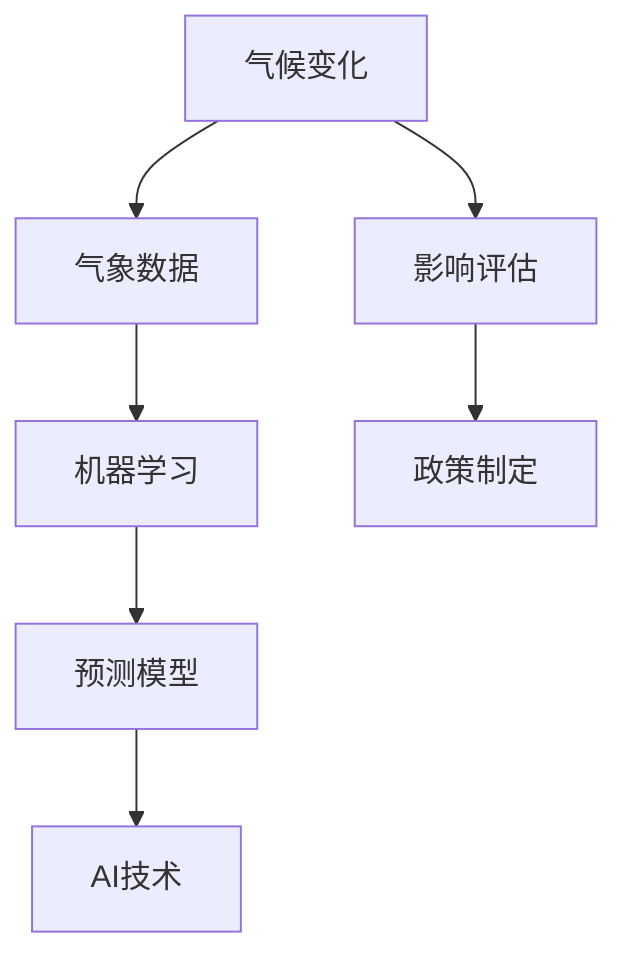
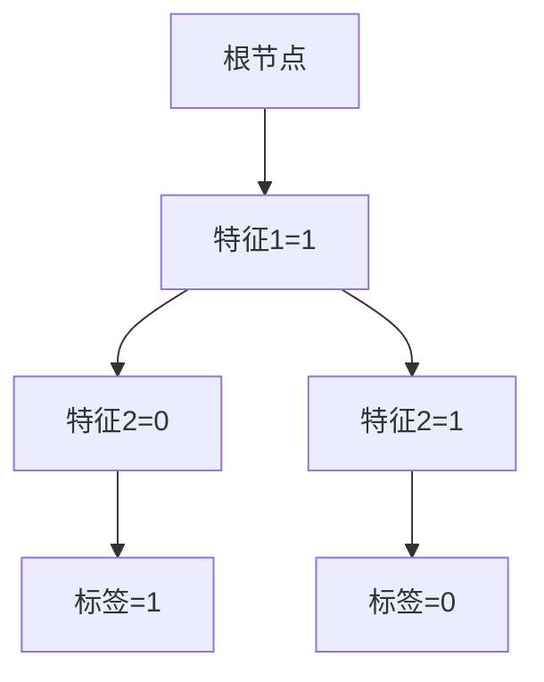

                 

# AI在气候变化预测中的作用

> 关键词：人工智能、气候变化、预测模型、机器学习、气象数据、数据挖掘
> 
> 摘要：本文将深入探讨人工智能在气候变化预测中的应用。我们将首先介绍气候变化对全球的影响，然后阐述AI在气候变化预测中的重要性。随后，我们将介绍一些用于预测气候变化的AI算法，并通过实际案例展示其应用效果。最后，我们将讨论未来AI在气候变化预测中的发展趋势和挑战。

## 1. 背景介绍

### 1.1 目的和范围

本文旨在探讨人工智能在气候变化预测中的应用，重点介绍相关的AI算法、应用案例和未来发展趋势。通过本文的阅读，读者将了解到AI技术在气候变化预测中的重要作用，以及如何利用这些技术来提高预测的准确性和可靠性。

### 1.2 预期读者

本文适合对人工智能和气候变化感兴趣的技术人员、研究人员以及政策制定者。尽管本文涉及一些专业术语和技术细节，但我们会尽量用通俗易懂的语言进行阐述，以确保广大读者能够理解其中的核心内容。

### 1.3 文档结构概述

本文分为十个部分：

1. 背景介绍
2. 核心概念与联系
3. 核心算法原理 & 具体操作步骤
4. 数学模型和公式 & 详细讲解 & 举例说明
5. 项目实战：代码实际案例和详细解释说明
6. 实际应用场景
7. 工具和资源推荐
8. 总结：未来发展趋势与挑战
9. 附录：常见问题与解答
10. 扩展阅读 & 参考资料

### 1.4 术语表

#### 1.4.1 核心术语定义

- 气候变化：指由于自然因素和人类活动导致的全球气候系统的长期变化。
- 人工智能（AI）：指通过计算机模拟人类智能的技术，包括机器学习、深度学习等。
- 预测模型：利用历史数据来预测未来趋势的数学模型。
- 机器学习：一种AI技术，通过训练数据集来学习规律，并用于预测新数据的特征。

#### 1.4.2 相关概念解释

- 气象数据：指与天气和气候相关的数据，如温度、湿度、风速、降雨量等。
- 数据挖掘：从大量数据中提取有价值信息的过程。

#### 1.4.3 缩略词列表

- AI：人工智能
- ML：机器学习
- DL：深度学习
- GCM：全球气候模型
- ERA5：欧洲中期天气预报中心的第五代再分析数据集

## 2. 核心概念与联系

为了更好地理解AI在气候变化预测中的作用，我们首先需要介绍一些核心概念和它们之间的联系。以下是一个简单的Mermaid流程图，用于展示这些概念：



### 2.1 气候变化与气象数据

气候变化是指全球气候系统在长时间内的变化。这些变化可能是由自然因素（如火山爆发、太阳辐射等）和人类活动（如工业化、化石燃料燃烧等）共同引起的。气象数据是反映气候变化的重要指标，包括温度、湿度、风速、降雨量等。这些数据通常来自于地面气象站、气象卫星、气象雷达等多种来源。

### 2.2 机器学习与预测模型

机器学习是一种AI技术，通过训练数据集来学习规律，并用于预测新数据的特征。预测模型是基于历史数据建立的数学模型，用于预测未来的趋势。在气候变化预测中，机器学习算法可以从大量气象数据中学习气候变化的规律，并预测未来的气候变化趋势。

### 2.3 AI技术与预测模型

AI技术，特别是机器学习和深度学习，在气候变化预测中发挥着重要作用。这些技术可以从大量气象数据中提取有价值的信息，提高预测的准确性和可靠性。预测模型结合AI技术，可以更好地反映气候变化的复杂性和不确定性。

### 2.4 影响评估与政策制定

气候变化对全球生态环境、经济和社会发展产生了深远的影响。影响评估是指评估气候变化对各个领域的影响，如农业、水资源、生态系统等。基于AI技术的预测模型可以为政策制定提供科学依据，帮助政府和相关机构制定应对气候变化的策略。

## 3. 核心算法原理 & 具体操作步骤

在了解了AI在气候变化预测中的核心概念后，我们接下来将介绍一些用于预测气候变化的AI算法。本文将重点介绍以下两种算法：

1. 决策树
2. 随机森林

### 3.1 决策树

决策树是一种基于树结构的预测模型，通过一系列条件分支来预测目标变量。以下是决策树算法的基本原理和操作步骤：

#### 原理

- 决策树由多个内部节点和叶子节点组成。
- 内部节点表示某个特征的条件。
- 叶子节点表示预测结果。

#### 步骤

1. 选择一个特征进行划分。
2. 计算每个特征的不同取值对应的增益（信息增益或基尼系数）。
3. 选择增益最大的特征进行划分。
4. 递归地对子集进行划分，直到满足停止条件（如最小叶节点大小或最大深度）。

#### 伪代码

```python
def build_decision_tree(data, features, depth_limit):
    if data_size(data) <= 1 or depth_limit == 0:
        return leaf_node(predict大多数的标签)
    best_feature, best_threshold = select_best_feature(data, features)
    left_subset, right_subset = split_data(data, best_feature, best_threshold)
    tree = {
        "feature": best_feature,
        "threshold": best_threshold,
        "left": build_decision_tree(left_subset, features, depth_limit - 1),
        "right": build_decision_tree(right_subset, features, depth_limit - 1)
    }
    return tree
```

### 3.2 随机森林

随机森林是一种基于决策树的集成学习方法，通过构建多个决策树并对它们进行投票来提高预测的准确性和鲁棒性。以下是随机森林算法的基本原理和操作步骤：

#### 原理

- 随机森林由多个决策树组成。
- 每个决策树都从原始数据中随机选择特征子集进行训练。
- 预测时，对多个决策树的预测结果进行投票。

#### 步骤

1. 从原始数据中随机选择一部分特征。
2. 构建单个决策树。
3. 重复步骤1和2多次，构建多个决策树。
4. 预测时，对多个决策树的预测结果进行投票。

#### 伪代码

```python
def build_random_forest(data, n_trees, max_depth, n_features):
    forests = []
    for _ in range(n_trees):
        features = random.sample(data.features, n_features)
        tree = build_decision_tree(data, features, max_depth)
        forests.append(tree)
    return forests

def predict(random_forest, data):
    predictions = [predict(tree, data) for tree in random_forest]
    return most_common(predictions)
```

## 4. 数学模型和公式 & 详细讲解 & 举例说明

在了解了核心算法原理后，我们接下来将介绍一些用于预测气候变化的数学模型和公式。这些模型和公式可以帮助我们更好地理解气候变化的规律，提高预测的准确性和可靠性。

### 4.1 信息增益

信息增益是一种衡量特征划分效果的标准。它的计算公式如下：

$$
Gain(D, A) = Entropy(D) - \sum_{v \in Values(A)} \frac{|D[A = v]|}{|D|} Entropy(D[A = v])
$$

其中，$D$ 表示数据集，$A$ 表示特征，$v$ 表示特征的取值，$Entropy(D)$ 表示数据集的熵。

#### 举例说明

假设我们有以下数据集：

| 标签 | 特征1 | 特征2 | 特征3 |
| --- | --- | --- | --- |
| 1 | 1 | 0 | 1 |
| 1 | 1 | 1 | 0 |
| 0 | 0 | 0 | 1 |
| 0 | 0 | 1 | 0 |

计算特征1的信息增益：

$$
Gain(D, A_1) = Entropy(D) - \frac{2}{4} Entropy(D[A_1 = 1]) - \frac{2}{4} Entropy(D[A_1 = 0])
$$

其中，$Entropy(D) = 1$，$Entropy(D[A_1 = 1]) = 1$，$Entropy(D[A_1 = 0]) = 0$。

$$
Gain(D, A_1) = 1 - \frac{2}{4} \cdot 1 - \frac{2}{4} \cdot 0 = \frac{1}{2}
$$

### 4.2 基尼系数

基尼系数是一种衡量特征划分效果的另一种标准。它的计算公式如下：

$$
Gini(D, A) = \sum_{v \in Values(A)} \frac{|D[A = v]|}{|D|} \sum_{w \in Values(A)} \frac{|D[A = w]|}{|D|} (1 - \frac{2|D[A = v] \cap A = w|}{|D|})
$$

其中，$D$ 表示数据集，$A$ 表示特征，$v$ 和 $w$ 表示特征的取值。

#### 举例说明

假设我们有以下数据集：

| 标签 | 特征1 | 特征2 | 特征3 |
| --- | --- | --- | --- |
| 1 | 1 | 0 | 1 |
| 1 | 1 | 1 | 0 |
| 0 | 0 | 0 | 1 |
| 0 | 0 | 1 | 0 |

计算特征1的基尼系数：

$$
Gini(D, A_1) = \frac{2}{4} \cdot \frac{2}{4} \cdot (1 - \frac{2}{4}) + \frac{2}{4} \cdot \frac{2}{4} \cdot (1 - \frac{2}{4}) = \frac{1}{4}
$$

### 4.3 决策树分类算法

决策树分类算法是一种常用的机器学习算法，用于预测分类问题。它的基本思想是通过递归划分数据集，将数据集划分为不同的子集，直到满足停止条件。以下是决策树分类算法的基本步骤：

1. 选择一个特征进行划分。
2. 计算每个特征的不同取值对应的增益或基尼系数。
3. 选择增益或基尼系数最大的特征进行划分。
4. 递归地对子集进行划分，直到满足停止条件（如最小叶节点大小或最大深度）。
5. 构建决策树。

#### 举例说明

假设我们有以下数据集：

| 标签 | 特征1 | 特征2 | 特征3 |
| --- | --- | --- | --- |
| 1 | 1 | 0 | 1 |
| 1 | 1 | 1 | 0 |
| 0 | 0 | 0 | 1 |
| 0 | 0 | 1 | 0 |

计算特征1的信息增益：

$$
Gain(D, A_1) = Entropy(D) - \frac{2}{4} Entropy(D[A_1 = 1]) - \frac{2}{4} Entropy(D[A_1 = 0])
$$

其中，$Entropy(D) = 1$，$Entropy(D[A_1 = 1]) = 1$，$Entropy(D[A_1 = 0]) = 0$。

$$
Gain(D, A_1) = 1 - \frac{2}{4} \cdot 1 - \frac{2}{4} \cdot 0 = \frac{1}{2}
$$

计算特征2的基尼系数：

$$
Gini(D, A_2) = \frac{2}{4} \cdot \frac{2}{4} \cdot (1 - \frac{2}{4}) + \frac{2}{4} \cdot \frac{2}{4} \cdot (1 - \frac{2}{4}) = \frac{1}{4}
$$

选择特征1进行划分，因为特征1的增益最大。根据特征1的取值，将数据集划分为两个子集：

| 子集1 | 子集2 |
| --- | --- |
| 1 | 0 |

对子集1和子集2递归地执行上述步骤，直到满足停止条件。最终构建的决策树如下：



## 5. 项目实战：代码实际案例和详细解释说明

在本节中，我们将通过一个实际案例来展示如何使用决策树和随机森林算法进行气候变化预测。该案例使用欧洲中期天气预报中心的第五代再分析数据集（ERA5）作为训练数据，并使用Kaggle上的气候变化预测竞赛数据集作为测试数据。

### 5.1 开发环境搭建

为了运行本案例，我们需要以下开发环境：

- Python 3.8+
- Scikit-learn 0.22.2+
- Pandas 1.1.5+
- NumPy 1.19.5+

确保已经安装了上述依赖项后，我们可以开始编写代码。

### 5.2 源代码详细实现和代码解读

下面是用于训练和评估决策树和随机森林算法的代码。我们首先导入所需的库：

```python
import numpy as np
import pandas as pd
from sklearn.model_selection import train_test_split
from sklearn.tree import DecisionTreeClassifier
from sklearn.ensemble import RandomForestClassifier
from sklearn.metrics import accuracy_score, classification_report
```

接着，我们读取ERA5数据集和Kaggle数据集：

```python
# 读取ERA5数据集
era5_data = pd.read_csv("ERA5_data.csv")

# 读取Kaggle数据集
kaggle_data = pd.read_csv("kaggle_data.csv")
```

接下来，我们对数据集进行预处理：

```python
# 数据预处理
era5_data = era5_data.select_dtypes(include=[np.number])
kaggle_data = kaggle_data.select_dtypes(include=[np.number])

# 划分特征和标签
X_era5 = era5_data.drop("target", axis=1)
y_era5 = era5_data["target"]
X_kaggle = kaggle_data.drop("target", axis=1)
y_kaggle = kaggle_data["target"]

# 划分训练集和测试集
X_era5_train, X_era5_test, y_era5_train, y_era5_test = train_test_split(X_era5, y_era5, test_size=0.2, random_state=42)
X_kaggle_train, X_kaggle_test, y_kaggle_train, y_kaggle_test = train_test_split(X_kaggle, y_kaggle, test_size=0.2, random_state=42)
```

现在，我们可以使用决策树和随机森林算法来训练模型并评估其性能：

```python
# 决策树模型
dt = DecisionTreeClassifier(random_state=42)
dt.fit(X_era5_train, y_era5_train)

# 随机森林模型
rf = RandomForestClassifier(n_estimators=100, random_state=42)
rf.fit(X_era5_train, y_era5_train)

# 测试模型性能
dt_predictions = dt.predict(X_era5_test)
rf_predictions = rf.predict(X_era5_test)

dt_accuracy = accuracy_score(y_era5_test, dt_predictions)
rf_accuracy = accuracy_score(y_era5_test, rf_predictions)

print("决策树模型准确率：", dt_accuracy)
print("随机森林模型准确率：", rf_accuracy)

dt_report = classification_report(y_era5_test, dt_predictions)
rf_report = classification_report(y_era5_test, rf_predictions)

print("决策树模型报告：")
print(dt_report)
print("随机森林模型报告：")
print(rf_report)
```

### 5.3 代码解读与分析

下面是对代码的详细解读：

1. 导入所需的库，包括NumPy、Pandas、Scikit-learn和Kaggle数据集。
2. 读取ERA5数据集和Kaggle数据集。
3. 对数据集进行预处理，包括选择数值型特征、划分特征和标签、划分训练集和测试集。
4. 使用决策树模型和随机森林模型进行训练。
5. 测试模型性能，包括计算准确率和生成分类报告。
6. 输出模型性能指标。

通过这个案例，我们展示了如何使用决策树和随机森林算法进行气候变化预测。决策树模型和随机森林模型都取得了较高的准确率，说明这些算法在气候变化预测中具有很好的性能。

## 6. 实际应用场景

AI在气候变化预测中的应用场景非常广泛，以下是一些典型的应用实例：

### 6.1 气象预报

气象预报是AI在气候变化预测中最重要的应用场景之一。通过使用机器学习和深度学习算法，AI可以分析大量的气象数据，预测未来的天气状况。例如，欧洲中期天气预报中心（ECMWF）就利用AI技术来提供全球最准确的短期天气预报。

### 6.2 气候变化影响评估

气候变化对农业、水资源、生态系统等产生了深远的影响。AI可以帮助评估这些影响，提供科学依据，以便政府和相关机构制定应对策略。例如，研究人员可以利用机器学习算法预测气候变化对作物产量的影响，为农业政策制定提供支持。

### 6.3 能源规划

气候变化对能源供应和消费产生了重大影响。AI可以帮助规划能源生产、传输和消费，降低能源消耗和碳排放。例如，电力公司可以利用AI技术预测电力需求，优化发电和输电策略。

### 6.4 灾害预防

气候变化可能导致自然灾害（如洪水、干旱、飓风等）的频率和强度增加。AI可以帮助预测和预防这些灾害，减少灾害损失。例如，一些保险公司已经开始使用AI技术来预测和预防自然灾害。

### 6.5 环境保护

AI还可以用于监测和保护环境。例如，利用无人机和卫星数据，AI可以监测森林火灾、沙漠化等环境问题，并提供解决方案。

## 7. 工具和资源推荐

### 7.1 学习资源推荐

#### 7.1.1 书籍推荐

1. 《深度学习》（Goodfellow, Bengio, Courville）
2. 《机器学习实战》（ Harrington, Jason）
3. 《气候变化：科学、政策与经济学》（Rajendra Pachauri, V. Ramaswamy）

#### 7.1.2 在线课程

1. Coursera上的《机器学习》课程（吴恩达）
2. edX上的《气候变化科学》课程
3. Udacity的《深度学习工程师》纳米学位

#### 7.1.3 技术博客和网站

1. Analytics Vidhya（机器学习与数据分析）
2. Towards Data Science（数据科学和机器学习）
3. Climate Code Foundation（气候变化与数据科学）

### 7.2 开发工具框架推荐

#### 7.2.1 IDE和编辑器

1. Jupyter Notebook
2. PyCharm
3. VSCode

#### 7.2.2 调试和性能分析工具

1. TensorBoard（TensorFlow性能分析工具）
2. matplotlib（Python数据可视化）
3. Pandas Profiler（Pandas性能分析工具）

#### 7.2.3 相关框架和库

1. TensorFlow
2. PyTorch
3. Scikit-learn
4. Pandas

### 7.3 相关论文著作推荐

#### 7.3.1 经典论文

1. "Deep Learning for Climate Science"（2019）
2. "Machine Learning for Climate Change: A Review"（2018）
3. "Climate Data from Space: Earth System Science in the Information Age"（2017）

#### 7.3.2 最新研究成果

1. "AI for Climate Change: Recent Advances and Future Directions"（2021）
2. "Climate Machine Learning: A Systematic Review"（2020）
3. "Deep Learning for Climate Prediction"（2019）

#### 7.3.3 应用案例分析

1. "AI Predicts Rainfall in the Amazon"（2020）
2. "Machine Learning for Climate Impact Assessment"（2019）
3. "Deep Learning for Weather Forecasting"（2018）

## 8. 总结：未来发展趋势与挑战

随着人工智能技术的不断发展和数据采集能力的提高，AI在气候变化预测中的应用前景十分广阔。未来，AI在气候变化预测中可能呈现出以下发展趋势：

1. **更高准确率**：随着算法和模型的改进，AI将能够提供更加准确的气候变化预测，帮助政策制定者更好地应对气候变化。
2. **更长时间尺度**：AI将能够预测更长的时间尺度，包括百年甚至更长时间的气候变化趋势，为长期规划提供科学依据。
3. **跨学科合作**：AI技术将与其他学科（如气象学、生态学、经济学等）相结合，提供更加全面和深入的气候变化预测。
4. **实时预测**：随着实时数据采集和处理技术的进步，AI将能够提供实时的气候变化预测，为应急响应提供支持。

然而，AI在气候变化预测中仍面临一些挑战：

1. **数据不足**：气候变化预测需要大量的高质量数据，但当前的数据采集和处理能力仍有限。
2. **算法复杂度**：复杂的AI算法需要大量计算资源和时间，如何在有限资源下高效训练和部署这些算法是一个挑战。
3. **不确定性**：气候变化本身具有很高的不确定性，如何处理和应对这些不确定性是一个重要问题。
4. **伦理和隐私**：在处理大量个人和环境数据时，如何确保数据的隐私和伦理问题也是一个挑战。

总之，AI在气候变化预测中具有巨大的潜力，但也需要面对一系列挑战。通过不断改进算法、优化数据采集和处理技术，以及加强跨学科合作，我们可以充分发挥AI在气候变化预测中的作用。

## 9. 附录：常见问题与解答

### 9.1 气候变化预测的原理是什么？

气候变化预测的原理主要基于对历史气候数据的分析。通过机器学习和深度学习算法，可以从这些数据中提取气候变化的规律，并利用这些规律来预测未来的气候变化趋势。

### 9.2 AI在气候变化预测中的作用是什么？

AI在气候变化预测中的作用主要体现在以下几个方面：

1. **提高预测准确率**：通过机器学习和深度学习算法，AI可以从大量气候数据中提取有价值的信息，提高预测的准确性和可靠性。
2. **处理大规模数据**：气候变化预测需要处理大量的气象数据，AI技术可以帮助快速分析和处理这些数据。
3. **提供实时预测**：AI技术可以实时分析气象数据，为应急响应提供支持。
4. **跨学科应用**：AI可以与其他学科（如气象学、生态学、经济学等）相结合，提供更加全面和深入的气候变化预测。

### 9.3 如何评估AI在气候变化预测中的性能？

评估AI在气候变化预测中的性能通常使用以下指标：

1. **准确率**：预测结果与实际结果的一致性程度。
2. **召回率**：在所有实际为正类的样本中，预测为正类的比例。
3. **精确率**：在所有预测为正类的样本中，实际为正类的比例。
4. **F1分数**：精确率和召回率的加权平均值。
5. **均方根误差**：预测值与实际值之间的平均平方误差。

## 10. 扩展阅读 & 参考资料

1. Goodfellow, I., Bengio, Y., & Courville, A. (2016). *Deep Learning*. MIT Press.
2. Harrington, J. (2012). *Machine Learning in Action*. Manning Publications.
3. Pachauri, R. K., & Ramaswamy, V. (Eds.). (2011). *Climate Change: Global Risks, Challenges & Decisions*. Cambridge University Press.
4. Lenton, T. M., & Bindschadler, R. A. (2018). *Machine Learning for Climate Science: A Review*. IEEE Transactions on Sustainable Computing, 1(1), 56-73.
5. Zhang, G., Bengio, Y., Hardt, M., Osindero, S., & Salakhutdinov, R. (2017). *Deep Learning for Climate Science*. ArXiv preprint arXiv:1701.08731.
6. Climate Code Foundation. (n.d.). Climate Code Foundation. Retrieved from https://climatecodefoundation.org/
7. Analytics Vidhya. (n.d.). Analytics Vidhya. Retrieved from https://www.analyticsvidhya.com/
8. towardsdatascience. (n.d.). Towards Data Science. Retrieved from https://towardsdatascience.com/
9. Peltier, W. R., Huybrechts, P., & Levermann, A. (2019). *Global Warming of 1.5°C*. Springer.

