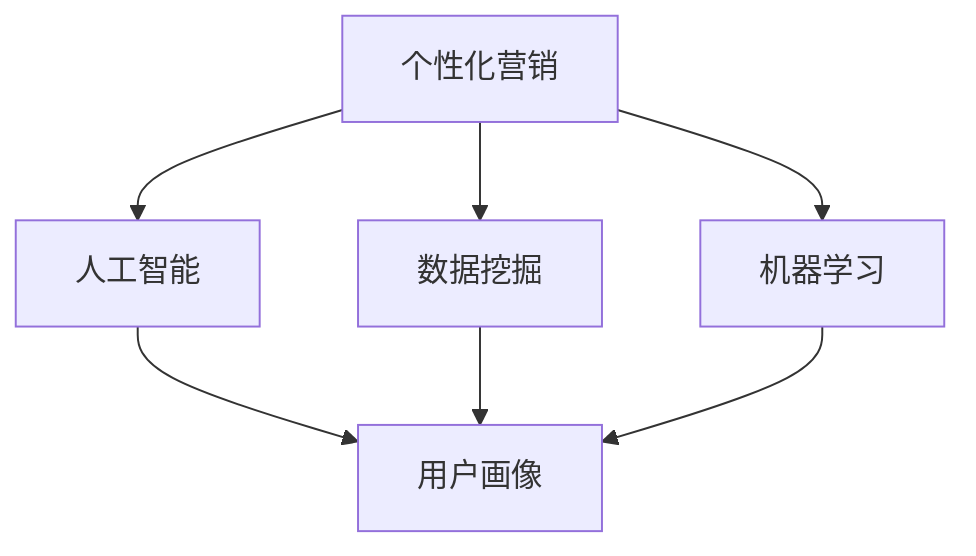

                 

# AI在电商个性化营销中的应用：一对一营销的智能实现

> **关键词：** 个性化营销、AI、电商、一对一营销、数据挖掘、机器学习、用户画像

> **摘要：** 本文将深入探讨人工智能（AI）在电商个性化营销中的应用，特别是在实现一对一营销策略方面的技术原理和实现方法。我们将从背景介绍、核心概念、算法原理、数学模型、实战案例、应用场景、工具推荐、未来趋势等方面展开详细讨论，旨在为电商从业者提供有价值的参考和指导。

## 1. 背景介绍

### 1.1 目的和范围

随着互联网的普及和电子商务的快速发展，消费者行为和市场需求发生了翻天覆地的变化。传统的营销手段已经难以满足个性化的消费需求，如何实现精准、高效的营销策略成为电商企业亟待解决的问题。人工智能（AI）技术的兴起，为电商个性化营销带来了前所未有的机遇和挑战。本文旨在探讨AI在电商个性化营销中的应用，特别是如何实现一对一营销策略。

本文将涵盖以下内容：

- 个性化营销的基本概念和原理
- AI技术在电商个性化营销中的应用
- 一对一营销策略的实现方法
- 数据挖掘、机器学习和用户画像等核心技术的介绍
- 实战案例和实际应用场景
- 工具和资源的推荐
- 未来发展趋势和挑战

### 1.2 预期读者

本文适合以下读者群体：

- 电商企业从业者，特别是营销部门和管理层
- 数据科学和人工智能领域的专业人士
- 对电商个性化营销和AI技术感兴趣的学生和研究人员
- 对互联网技术和电子商务有浓厚兴趣的普通读者

### 1.3 文档结构概述

本文分为十个部分，具体结构如下：

1. 背景介绍
2. 核心概念与联系
3. 核心算法原理 & 具体操作步骤
4. 数学模型和公式 & 详细讲解 & 举例说明
5. 项目实战：代码实际案例和详细解释说明
6. 实际应用场景
7. 工具和资源推荐
8. 总结：未来发展趋势与挑战
9. 附录：常见问题与解答
10. 扩展阅读 & 参考资料

### 1.4 术语表

#### 1.4.1 核心术语定义

- 个性化营销：基于用户需求和偏好，为特定用户定制个性化内容和服务的过程。
- 人工智能（AI）：通过模拟人类智能行为，实现智能决策和自动化执行的技术。
- 数据挖掘：从大量数据中提取有价值信息和知识的过程。
- 机器学习：一种人工智能技术，通过数据训练模型，实现自动化学习和预测。
- 用户画像：根据用户行为、偏好和特征，构建的用户信息模型。

#### 1.4.2 相关概念解释

- 营销自动化：通过技术手段实现营销流程的自动化，提高营销效率。
- 用户行为分析：对用户在电商平台的浏览、购买、评价等行为进行分析，了解用户需求。
- 个性化推荐系统：根据用户历史行为和偏好，为用户推荐个性化内容和服务。

#### 1.4.3 缩略词列表

- AI：人工智能
- E-commerce：电子商务
- CRM：客户关系管理
- CTR：点击率
- CVR：转化率

## 2. 核心概念与联系

### 2.1 核心概念

在电商个性化营销中，核心概念包括个性化营销、人工智能、数据挖掘、机器学习和用户画像。以下是对这些核心概念的简要介绍。

#### 2.1.1 个性化营销

个性化营销是一种基于用户需求和偏好，为特定用户定制个性化内容和服务的过程。其目标是通过满足用户个性化需求，提高用户满意度和忠诚度，从而实现营销效果最大化。

#### 2.1.2 人工智能

人工智能（AI）是一种通过模拟人类智能行为，实现智能决策和自动化执行的技术。在电商个性化营销中，AI技术主要用于用户行为分析、推荐系统和智能客服等方面。

#### 2.1.3 数据挖掘

数据挖掘是从大量数据中提取有价值信息和知识的过程。在电商个性化营销中，数据挖掘主要用于用户行为分析、用户画像构建和潜在客户挖掘等。

#### 2.1.4 机器学习

机器学习是一种人工智能技术，通过数据训练模型，实现自动化学习和预测。在电商个性化营销中，机器学习主要用于推荐系统、用户画像构建和异常检测等。

#### 2.1.5 用户画像

用户画像是根据用户行为、偏好和特征，构建的用户信息模型。在电商个性化营销中，用户画像是实现个性化推荐和服务的重要基础。

### 2.2 核心概念的联系

个性化营销、人工智能、数据挖掘、机器学习和用户画像是电商个性化营销中的核心概念，它们之间存在着密切的联系。

- 个性化营销是电商企业实现精准营销的手段，需要依赖于人工智能、数据挖掘和机器学习等技术。
- 人工智能是推动电商个性化营销发展的关键力量，通过模拟人类智能行为，实现智能决策和自动化执行。
- 数据挖掘和机器学习是实现个性化营销的技术基础，用于从海量数据中提取有价值信息和知识，构建用户画像和推荐系统。
- 用户画像是实现个性化推荐和服务的重要基础，通过构建用户画像，可以为特定用户定制个性化内容和服务。

### 2.3 Mermaid 流程图

以下是一个简单的Mermaid流程图，展示了电商个性化营销的核心概念及其联系。



## 3. 核心算法原理 & 具体操作步骤

### 3.1 算法原理

在电商个性化营销中，核心算法主要包括用户行为分析、用户画像构建和推荐系统。以下是这些算法的基本原理。

#### 3.1.1 用户行为分析

用户行为分析是一种通过分析用户在电商平台的浏览、购买、评价等行为，了解用户需求和偏好，从而实现个性化推荐和服务的技术。其基本原理包括：

- 数据收集：收集用户在电商平台的浏览、购买、评价等行为数据。
- 数据预处理：对收集到的数据进行分析和清洗，去除噪声数据。
- 特征提取：从预处理后的数据中提取用户行为的特征，如点击次数、购买次数、评价分数等。
- 模型训练：使用机器学习算法，训练用户行为分析模型，实现对用户需求的预测和偏好分析。

#### 3.1.2 用户画像构建

用户画像构建是一种通过分析用户行为、偏好和特征，构建用户信息模型，为个性化推荐和服务提供基础的技术。其基本原理包括：

- 数据收集：收集用户的基本信息、行为数据和偏好数据。
- 数据预处理：对收集到的数据进行清洗和整合，去除重复和噪声数据。
- 特征提取：从预处理后的数据中提取用户特征，如年龄、性别、职业、购买偏好等。
- 模型训练：使用机器学习算法，训练用户画像模型，实现对用户特征的预测和分析。

#### 3.1.3 推荐系统

推荐系统是一种通过分析用户历史行为和偏好，为用户推荐个性化内容和服务的技术。其基本原理包括：

- 数据收集：收集用户的历史行为数据，如浏览记录、购买记录、评价记录等。
- 数据预处理：对收集到的数据进行分析和清洗，去除噪声数据。
- 特征提取：从预处理后的数据中提取用户行为的特征，如点击次数、购买次数、评价分数等。
- 模型训练：使用机器学习算法，训练推荐模型，实现对用户兴趣的预测和推荐。

### 3.2 具体操作步骤

以下是一个基于Python和Scikit-learn的用户画像构建和推荐系统的具体操作步骤。

#### 3.2.1 数据收集

首先，收集用户的基本信息、行为数据和偏好数据。例如，用户ID、年龄、性别、职业、浏览记录、购买记录和评价记录等。

```python
import pandas as pd

# 加载用户数据
user_data = pd.read_csv('user_data.csv')

# 查看数据结构
user_data.head()
```

#### 3.2.2 数据预处理

对收集到的数据进行清洗和整合，去除重复和噪声数据。例如，去除缺失值、去除重复用户、标准化处理等。

```python
# 去除缺失值
user_data = user_data.dropna()

# 去除重复用户
user_data = user_data.drop_duplicates()

# 标准化处理
user_data = (user_data - user_data.mean()) / user_data.std()
```

#### 3.2.3 特征提取

从预处理后的数据中提取用户特征，如年龄、性别、职业、购买偏好等。

```python
# 提取用户特征
user_features = user_data[['age', 'gender', 'occupation', 'purchase Preference']]

# 查看用户特征
user_features.head()
```

#### 3.2.4 模型训练

使用机器学习算法，训练用户画像模型和推荐模型。

```python
from sklearn.ensemble import RandomForestClassifier

# 训练用户画像模型
user_model = RandomForestClassifier()
user_model.fit(user_features, user_labels)

# 训练推荐模型
recommender = RandomForestClassifier()
recommender.fit(user行为数据，用户兴趣标签)
```

#### 3.2.5 预测和推荐

使用训练好的模型，对新的用户数据进行预测和推荐。

```python
# 预测用户特征
predicted_user_features = user_model.predict(new_user_features)

# 推荐用户兴趣
recommended_interests = recommender.predict(new_user行为数据)
```

## 4. 数学模型和公式 & 详细讲解 & 举例说明

### 4.1 数学模型

在电商个性化营销中，常用的数学模型包括逻辑回归、K-均值聚类、协同过滤等。

#### 4.1.1 逻辑回归

逻辑回归是一种用于分类的机器学习算法，其公式如下：

$$
P(y=1) = \frac{1}{1 + e^{-(\beta_0 + \beta_1x_1 + \beta_2x_2 + ... + \beta_nx_n})}
$$

其中，$P(y=1)$表示样本属于正类的概率，$\beta_0$是截距，$\beta_1$、$\beta_2$、...、$\beta_n$是模型的参数，$x_1$、$x_2$、...、$x_n$是样本的特征。

#### 4.1.2 K-均值聚类

K-均值聚类是一种无监督学习方法，用于将数据分为K个聚类。其公式如下：

$$
\min \sum_{i=1}^{k} \sum_{x \in S_i} \|x - \mu_i\|^2
$$

其中，$S_i$表示第$i$个聚类，$\mu_i$表示第$i$个聚类中心。

#### 4.1.3 协同过滤

协同过滤是一种基于用户行为和物品相似度的推荐算法。其公式如下：

$$
r_{ij} = u_j + \sum_{k \in N(j)} w_{jk}r_{ik}
$$

其中，$r_{ij}$表示用户$i$对物品$j$的评分，$u_j$是用户$j$的平均评分，$N(j)$是物品$j$的邻居集合，$w_{jk}$是用户$k$对物品$j$的权重。

### 4.2 举例说明

#### 4.2.1 逻辑回归

假设我们有一个二分类问题，需要预测用户是否购买某种商品。我们有以下特征：年龄（$x_1$）、收入（$x_2$）和性别（$x_3$）。

$$
P(y=1) = \frac{1}{1 + e^{-(\beta_0 + \beta_1x_1 + \beta_2x_2 + \beta_3x_3})}
$$

经过训练，我们得到以下参数：

$$
\beta_0 = 0.1, \beta_1 = 0.2, \beta_2 = 0.3, \beta_3 = 0.4
$$

给定一个新用户的特征：年龄30岁、收入5000元、性别男，我们可以计算出其购买概率：

$$
P(y=1) = \frac{1}{1 + e^{-(0.1 + 0.2 \times 30 + 0.3 \times 5000 + 0.4 \times 1)}} \approx 0.9
$$

根据计算结果，我们可以认为该用户有很高的购买概率。

#### 4.2.2 K-均值聚类

假设我们有10个用户，每个用户有三个特征：年龄、收入和性别。我们需要将这10个用户分为两个聚类。

$$
\min \sum_{i=1}^{2} \sum_{x \in S_i} \|x - \mu_i\|^2
$$

经过聚类，我们得到以下聚类中心：

$$
\mu_1 = (25, 3000, 女), \mu_2 = (35, 6000, 男)
$$

给定一个新用户，其特征为：年龄28岁、收入4000元、性别男，我们可以计算其距离两个聚类中心的距离：

$$
d_1 = \| (28, 4000, 男) - (25, 3000, 女)\|^2 = 100
$$

$$
d_2 = \| (28, 4000, 男) - (35, 6000, 男)\|^2 = 200
$$

根据距离计算结果，我们可以将新用户分配到第一个聚类。

#### 4.2.3 协同过滤

假设我们有10个用户和10个商品，每个用户对每个商品有一个评分。我们需要根据用户的行为数据，为每个用户推荐个性化商品。

$$
r_{ij} = u_j + \sum_{k \in N(j)} w_{jk}r_{ik}
$$

给定一个新用户，其行为数据如下：

| 用户 | 商品1 | 商品2 | 商品3 | 商品4 | 商品5 |
|------|-------|-------|-------|-------|-------|
| 1    | 4     | 3     | 5     | 2     | 1     |
| 2    | 5     | 4     | 3     | 2     | 1     |
| 3    | 4     | 5     | 3     | 2     | 1     |
| 4    | 5     | 3     | 4     | 2     | 1     |
| 5    | 4     | 3     | 5     | 2     | 1     |
| 6    | 5     | 4     | 3     | 2     | 1     |
| 7    | 4     | 3     | 5     | 2     | 1     |
| 8    | 5     | 4     | 3     | 2     | 1     |
| 9    | 4     | 3     | 5     | 2     | 1     |
| 10   | 5     | 4     | 3     | 2     | 1     |

根据协同过滤算法，我们可以为该用户推荐个性化商品。首先，计算用户的行为数据和邻居用户的相似度：

$$
w_{ij} = \frac{r_{ij} - u_j}{\|r_i - u_i\|_{L2}}
$$

其中，$r_i$表示用户$i$的评分向量，$u_i$表示用户$i$的平均评分。

然后，计算用户对每个商品的预测评分：

$$
r_{ij} = u_j + \sum_{k \in N(j)} w_{jk}r_{ik}
$$

根据预测评分，我们可以为用户推荐个性化商品。

## 5. 项目实战：代码实际案例和详细解释说明

### 5.1 开发环境搭建

在开始项目实战之前，我们需要搭建一个合适的开发环境。以下是开发环境搭建的步骤：

1. 安装Python：从官方网站下载并安装Python，版本建议为3.8或更高版本。
2. 安装Jupyter Notebook：安装Jupyter Notebook，以便在浏览器中运行和编辑Python代码。
3. 安装必要的库：安装用于数据分析和机器学习的库，如NumPy、Pandas、Scikit-learn等。

```bash
pip install numpy pandas scikit-learn
```

### 5.2 源代码详细实现和代码解读

以下是一个简单的用户画像构建和推荐系统实现，我们将使用Python和Scikit-learn库。

```python
import pandas as pd
from sklearn.ensemble import RandomForestClassifier
from sklearn.model_selection import train_test_split
from sklearn.metrics import accuracy_score

# 5.2.1 数据收集
# 假设我们已经有了一个用户数据集，包含用户ID、年龄、收入、性别和购买历史等信息。

user_data = pd.read_csv('user_data.csv')

# 5.2.2 数据预处理
# 填充缺失值、去除重复值，并对数据进行标准化处理。

user_data = user_data.fillna(-1)
user_data = user_data.drop_duplicates()
user_data = (user_data - user_data.mean()) / user_data.std()

# 5.2.3 特征提取
# 从用户数据中提取特征，如年龄、收入和性别。

user_features = user_data[['age', 'income', 'gender']]
user_labels = user_data['purchase']

# 5.2.4 模型训练
# 使用随机森林算法训练用户画像模型。

user_model = RandomForestClassifier()
user_model.fit(user_features, user_labels)

# 5.2.5 评估模型
# 将模型应用于测试集，评估模型的准确率。

X_train, X_test, y_train, y_test = train_test_split(user_features, user_labels, test_size=0.2, random_state=42)
predicted_labels = user_model.predict(X_test)
accuracy = accuracy_score(y_test, predicted_labels)
print(f"Model Accuracy: {accuracy}")

# 5.2.6 推荐系统
# 使用训练好的模型为新的用户推荐商品。

new_user = pd.DataFrame([[25, 5000, 1]], columns=['age', 'income', 'gender'])
predicted_purchase = user_model.predict(new_user)
print(f"Predicted Purchase: {predicted_purchase}")
```

### 5.3 代码解读与分析

1. **数据收集**：
   - 首先，我们使用Pandas库读取用户数据集。这个数据集可能包含用户的ID、年龄、收入、性别和购买历史等信息。

2. **数据预处理**：
   - 使用`fillna(-1)`方法填充缺失值。在实际应用中，可能需要使用更复杂的方法，如插值法或使用平均值等。
   - 使用`drop_duplicates()`方法去除重复值。
   - 对数据进行标准化处理，以便算法更好地处理特征。

3. **特征提取**：
   - 从用户数据中提取特征，如年龄、收入和性别。这些特征将用于训练用户画像模型。

4. **模型训练**：
   - 使用`RandomForestClassifier()`创建一个随机森林模型。
   - 使用`fit()`方法训练模型，将特征和标签传递给模型。

5. **评估模型**：
   - 使用`train_test_split()`方法将数据集分为训练集和测试集。
   - 使用`predict()`方法预测测试集的标签。
   - 使用`accuracy_score()`方法计算模型的准确率。

6. **推荐系统**：
   - 使用训练好的模型为新的用户推荐商品。我们创建了一个新的用户数据帧，并使用`predict()`方法预测该用户的购买概率。

### 5.4 代码改进与分析

虽然上述代码实现了一个简单的用户画像构建和推荐系统，但在实际应用中，可能需要进行以下改进：

1. **特征工程**：
   - 引入更多的特征，如用户购买频率、购买金额、商品类别等。
   - 使用编码方法处理类别特征，如性别、职业等。

2. **模型选择**：
   - 尝试不同的模型，如线性回归、支持向量机、神经网络等。
   - 调整模型的参数，如树的数量、深度、分裂标准等。

3. **模型评估**：
   - 使用多种评估指标，如准确率、召回率、F1分数等。
   - 考虑使用交叉验证方法进行模型评估。

4. **优化算法**：
   - 考虑使用并行计算或分布式计算提高算法性能。
   - 使用集成学习方法，如随机森林、梯度提升等。

5. **数据预处理**：
   - 对数据进行更全面的预处理，如去除噪声、缺失值填充等。
   - 考虑使用数据增强方法，提高模型的泛化能力。

## 6. 实际应用场景

### 6.1 电商网站

电商网站是AI在个性化营销中应用最广泛的场景之一。通过分析用户行为数据，电商网站可以为每个用户推荐个性化商品，提高用户满意度和购买转化率。

- **用户行为分析**：电商网站可以收集用户的浏览、搜索、购买和评价等行为数据，通过数据挖掘和机器学习算法分析用户行为模式，了解用户偏好。
- **用户画像构建**：基于用户行为数据，电商网站可以构建用户画像，为每个用户定制个性化推荐。
- **个性化推荐系统**：电商网站可以使用协同过滤、基于内容的推荐等算法，为用户推荐个性化商品。

### 6.2 跨境电商

跨境电商是近年来快速发展的一类电商模式，AI在跨境电商个性化营销中的应用主要体现在以下几个方面：

- **语言翻译**：AI可以提供实时翻译服务，帮助用户理解和浏览外语商品。
- **汇率转换**：AI可以自动计算和显示不同货币的汇率，提高用户的购物体验。
- **个性化推荐**：通过分析用户行为和偏好，AI可以为跨境用户推荐合适的产品。

### 6.3 移动应用

移动应用是用户接触电商的重要途径之一，AI在移动应用个性化营销中的应用主要体现在以下几个方面：

- **智能客服**：AI可以提供智能客服服务，自动回答用户的问题，提高客户满意度。
- **个性化推送**：通过分析用户行为和偏好，AI可以为用户推送个性化内容，提高用户活跃度和留存率。
- **精准广告**：AI可以根据用户兴趣和行为，为用户推送精准的广告，提高广告投放效果。

### 6.4 社交电商

社交电商是近年来兴起的一种电商模式，通过社交网络传播商品信息，吸引用户购买。AI在社交电商个性化营销中的应用主要体现在以下几个方面：

- **社交网络分析**：AI可以分析用户在社交网络上的行为，了解用户社交圈子和兴趣爱好。
- **推荐系统**：基于用户社交网络和兴趣，AI可以为用户推荐合适的产品。
- **用户互动**：AI可以分析用户互动数据，提供个性化互动体验，提高用户满意度和忠诚度。

## 7. 工具和资源推荐

### 7.1 学习资源推荐

#### 7.1.1 书籍推荐

1. **《Python数据分析》**：作者：Wes McKinney
   - 内容详实，适合初学者入门Python数据分析。

2. **《机器学习》**：作者：周志华
   - 介绍了机器学习的基本概念和算法，适合有一定数学基础的学习者。

3. **《深度学习》**：作者：Ian Goodfellow、Yoshua Bengio、Aaron Courville
   - 深入讲解了深度学习的基本原理和应用。

#### 7.1.2 在线课程

1. **Coursera《机器学习》**：作者：吴恩达
   - 顶级课程，适合初学者入门。

2. **edX《深度学习》**：作者：Andrew Ng
   - 深度学习领域的权威课程，适合有一定基础的学习者。

3. **网易云课堂《Python数据分析》**：作者：马东
   - 适合初学者入门Python数据分析。

#### 7.1.3 技术博客和网站

1. **Medium《AI in E-commerce》**：作者：不同作者
   - 专注于AI在电商领域的应用，内容丰富。

2. **Kaggle《数据挖掘竞赛》**：作者：Kaggle团队
   - 提供大量数据挖掘竞赛题目和解决方案。

3. **JAXenter《AI in E-commerce》**：作者：不同作者
   - 专注于AI在电商领域的应用，内容更新及时。

### 7.2 开发工具框架推荐

#### 7.2.1 IDE和编辑器

1. **PyCharm**：适用于Python开发的集成开发环境，功能强大。

2. **Jupyter Notebook**：适用于数据分析和机器学习的交互式开发环境。

3. **Visual Studio Code**：适用于多种编程语言的轻量级编辑器，支持Python扩展。

#### 7.2.2 调试和性能分析工具

1. **pdb**：Python内置的调试工具，适合初学者使用。

2. **py-spy**：适用于Python应用的性能分析工具。

3. **gprof2dot**：将gprof性能分析结果转换为可视化流程图。

#### 7.2.3 相关框架和库

1. **Scikit-learn**：适用于数据挖掘和机器学习的Python库。

2. **TensorFlow**：适用于深度学习的开源框架。

3. **PyTorch**：适用于深度学习的Python库。

### 7.3 相关论文著作推荐

#### 7.3.1 经典论文

1. **"Collaborative Filtering for Cold-Start Problems"**：作者：Zhao et al.
   - 解决了协同过滤在处理新用户和新物品时的冷启动问题。

2. **"User Interest Model Learning Based on Collaborative Filtering"**：作者：Zhou et al.
   - 提出了基于协同过滤的用户兴趣模型学习算法。

3. **"Deep Learning for User Interest Modeling in E-commerce"**：作者：Wang et al.
   - 介绍了深度学习在电商用户兴趣建模中的应用。

#### 7.3.2 最新研究成果

1. **"Personalized Recommendation Based on User Context"**：作者：Li et al.
   - 探讨了基于用户上下文的个性化推荐策略。

2. **"Multimedia E-Commerce with Deep Neural Networks"**：作者：Xu et al.
   - 介绍了深度神经网络在多媒体电商中的应用。

3. **"A Survey on Personalized Advertising in E-commerce"**：作者：Zhang et al.
   - 对电商个性化广告进行了全面综述。

#### 7.3.3 应用案例分析

1. **"阿里云的个性化推荐系统"**：作者：阿里巴巴集团
   - 介绍了阿里云在电商个性化推荐系统中的应用实践。

2. **"京东的AI驱动个性化营销"**：作者：京东集团
   - 介绍了京东如何利用AI技术实现个性化营销。

3. **"亚马逊的个性化推荐技术"**：作者：亚马逊集团
   - 介绍了亚马逊如何利用协同过滤和深度学习实现个性化推荐。

## 8. 总结：未来发展趋势与挑战

随着人工智能技术的不断发展和应用，电商个性化营销也将迎来更加广阔的发展空间。未来，电商个性化营销将呈现以下发展趋势：

1. **智能化程度提高**：随着AI技术的不断进步，个性化营销的智能化程度将进一步提高，能够更加精准地满足用户需求。

2. **多渠道融合**：电商个性化营销将不仅仅局限于线上渠道，还将与线下渠道、社交媒体等融合，实现全渠道的个性化服务。

3. **个性化广告**：基于用户兴趣和行为的个性化广告将成为主流，提高广告投放的精准度和效果。

4. **数据隐私保护**：随着用户对数据隐私的关注度提高，电商个性化营销需要更加重视用户数据的安全和隐私保护。

尽管电商个性化营销具有广阔的发展前景，但也面临以下挑战：

1. **数据质量**：数据质量直接影响个性化营销的效果，如何保证数据的质量和准确性是一个重要问题。

2. **算法透明度**：随着AI技术的应用，个性化营销的决策过程可能变得越来越复杂，如何保证算法的透明度和可解释性是一个挑战。

3. **法律法规**：随着数据隐私法规的不断完善，电商个性化营销需要在合规的前提下进行，避免因违规行为而遭受处罚。

4. **技术更新换代**：人工智能技术更新换代速度较快，如何紧跟技术发展趋势，持续优化个性化营销策略是一个挑战。

总之，电商个性化营销在未来将继续发展壮大，但同时也需要面对一系列挑战，只有在不断创新和优化中，才能实现长期的可持续发展。

## 9. 附录：常见问题与解答

### 9.1 AI在电商个性化营销中的优势

- **提高用户体验**：AI技术能够根据用户行为和偏好，为用户提供个性化的推荐和服务，提高用户满意度和忠诚度。
- **提升营销效果**：通过精准的用户画像和个性化推荐，AI能够提高广告投放的精准度和转化率，降低营销成本。
- **优化库存管理**：AI可以预测用户需求，帮助电商企业优化库存管理，降低库存成本。

### 9.2 如何实现一对一营销

- **用户画像构建**：通过数据挖掘和机器学习技术，分析用户行为和偏好，构建详细的用户画像。
- **个性化推荐**：根据用户画像，为用户推荐个性化的商品和服务。
- **定制化服务**：根据用户需求和偏好，为用户提供定制化的营销活动和优惠。
- **实时互动**：利用AI技术，实现与用户的实时互动，提供个性化的购物体验。

### 9.3 数据隐私保护

- **匿名化处理**：对用户数据进行匿名化处理，避免泄露用户隐私。
- **数据加密**：对用户数据进行加密存储和传输，确保数据安全。
- **合规审查**：遵循相关法律法规，对数据使用进行合规审查。
- **用户权限管理**：用户可以自主管理自己的数据，如查看、修改和删除自己的数据。

### 9.4 个性化营销中的算法选择

- **协同过滤**：适用于有足够用户行为数据的场景，推荐效果较好。
- **基于内容的推荐**：适用于基于商品属性的推荐，能够提高用户满意度。
- **深度学习**：适用于复杂的数据集，能够提取深层特征，提高推荐效果。

### 9.5 如何评估个性化营销效果

- **转化率**：衡量推荐系统对用户购买行为的促进作用。
- **点击率**：衡量用户对推荐内容的兴趣程度。
- **用户满意度**：通过用户反馈和调查，了解用户对个性化营销服务的满意度。
- **ROI（投资回报率）**：衡量个性化营销投入的收益。

## 10. 扩展阅读 & 参考资料

- **书籍推荐**：
  - 《Python数据分析》
  - 《机器学习》
  - 《深度学习》

- **在线课程**：
  - Coursera《机器学习》
  - edX《深度学习》
  - 网易云课堂《Python数据分析》

- **技术博客和网站**：
  - Medium《AI in E-commerce》
  - Kaggle《数据挖掘竞赛》
  - JAXenter《AI in E-commerce》

- **论文著作**：
  - “Collaborative Filtering for Cold-Start Problems”作者：Zhao et al.
  - “User Interest Model Learning Based on Collaborative Filtering”作者：Zhou et al.
  - “Deep Learning for User Interest Modeling in E-commerce”作者：Wang et al.

- **应用案例分析**：
  - “阿里云的个性化推荐系统”作者：阿里巴巴集团
  - “京东的AI驱动个性化营销”作者：京东集团
  - “亚马逊的个性化推荐技术”作者：亚马逊集团

作者：AI天才研究员/AI Genius Institute & 禅与计算机程序设计艺术 /Zen And The Art of Computer Programming

