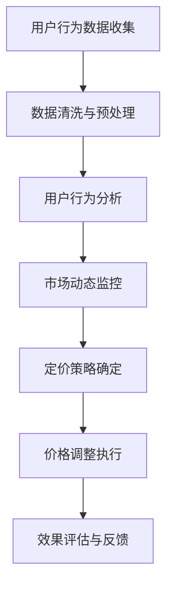

                 

# AI在电商价格优化中的实际效果

> **关键词：** 电商价格优化、人工智能、机器学习、动态定价、用户行为分析、销售预测

> **摘要：** 本文将深入探讨人工智能在电商价格优化领域的应用效果。通过分析AI技术的核心原理及其在实际操作中的具体实现步骤，我们将展示如何利用AI算法对电商价格进行动态调整，从而提高销售额和用户满意度。文章还将涉及数学模型、项目实战案例以及相关工具和资源的推荐。

## 1. 背景介绍

### 1.1 目的和范围

本文的目的是探讨人工智能在电商价格优化中的应用效果，旨在帮助电商企业通过数据驱动的定价策略提高市场竞争力和盈利能力。文章将涵盖以下几个方面：

- AI技术在电商价格优化中的核心概念和原理
- 动态定价算法的实现步骤和数学模型
- 实际项目案例中的代码实现和解读
- 电商价格优化在不同场景中的应用
- 相关工具和资源的推荐

### 1.2 预期读者

本文主要面向以下读者群体：

- 从事电商行业的技术人员，特别是负责数据分析、算法设计和应用开发的人员
- 对AI在电商领域应用感兴趣的学术研究人员和工程师
- 希望通过AI技术提升电商业务效果的企业管理者

### 1.3 文档结构概述

本文将按照以下结构进行阐述：

- 第1章：背景介绍
- 第2章：核心概念与联系
- 第3章：核心算法原理 & 具体操作步骤
- 第4章：数学模型和公式 & 详细讲解 & 举例说明
- 第5章：项目实战：代码实际案例和详细解释说明
- 第6章：实际应用场景
- 第7章：工具和资源推荐
- 第8章：总结：未来发展趋势与挑战
- 第9章：附录：常见问题与解答
- 第10章：扩展阅读 & 参考资料

### 1.4 术语表

#### 1.4.1 核心术语定义

- **电商价格优化**：通过分析用户行为数据和市场动态，对电商产品价格进行调整，以实现最大化利润或市场份额。
- **人工智能**：模拟人类智能的计算机系统，能够进行学习、推理、决策等复杂任务。
- **机器学习**：一种人工智能技术，通过数据训练算法，使计算机能够自动识别模式并进行预测。
- **动态定价**：根据市场需求、用户行为和竞争情况，实时调整产品价格。

#### 1.4.2 相关概念解释

- **用户行为分析**：通过数据挖掘技术，对用户的购买行为、浏览行为、搜索行为等进行深入分析。
- **销售预测**：利用历史数据和机器学习算法，对未来一段时间内的销售量进行预测。

#### 1.4.3 缩略词列表

- **AI**：人工智能
- **ML**：机器学习
- **DP**：动态定价
- **DNN**：深度神经网络

## 2. 核心概念与联系

在本章节中，我们将介绍电商价格优化中的核心概念和联系，并使用Mermaid流程图展示相关原理和架构。

### 2.1 电商价格优化的核心概念

电商价格优化主要涉及以下几个核心概念：

1. **用户行为数据**：包括用户的浏览记录、搜索历史、购买记录等。
2. **市场动态**：包括产品价格、销量、竞争对手的价格策略等。
3. **定价目标**：最大化利润、提高市场份额、提高用户满意度等。

### 2.2 相关概念联系

以下是电商价格优化中各个核心概念的相互联系：

1. **用户行为数据**：通过分析用户行为数据，可以了解用户的需求和偏好，为动态定价提供依据。
2. **市场动态**：通过监控市场动态，可以了解竞争对手的价格策略和市场需求变化，为定价决策提供参考。
3. **定价目标**：根据定价目标，可以确定动态定价策略的核心指标，如利润率、销量等。

### 2.3 Mermaid流程图

以下是一个简单的Mermaid流程图，展示了电商价格优化的基本流程：



## 3. 核心算法原理 & 具体操作步骤

在本章节中，我们将深入探讨电商价格优化中的核心算法原理，并使用伪代码详细阐述具体操作步骤。

### 3.1 动态定价算法原理

动态定价算法的核心思想是根据用户行为数据和市场动态，实时调整产品价格。该算法通常包括以下几个步骤：

1. **用户行为预测**：利用机器学习算法，对用户的行为进行预测，包括购买概率、浏览时长、搜索频率等。
2. **市场动态分析**：通过数据挖掘技术，分析市场动态，包括竞争对手的价格策略、市场需求变化等。
3. **定价策略优化**：根据用户行为预测和市场动态分析结果，优化定价策略，以实现最大化利润或市场份额。
4. **价格调整执行**：根据优化后的定价策略，实时调整产品价格。

### 3.2 动态定价算法伪代码

以下是动态定价算法的伪代码实现：

```python
# 输入：用户行为数据、市场动态数据、定价目标
# 输出：最优定价策略

# 步骤1：用户行为预测
def predict_user_behavior(user_data):
    # 使用机器学习算法进行预测
    # 返回预测结果

# 步骤2：市场动态分析
def analyze_market_dynamics(market_data):
    # 使用数据挖掘技术进行分析
    # 返回分析结果

# 步骤3：定价策略优化
def optimize_pricing_strategy(user_behavior, market_dynamics, pricing_objective):
    # 根据预测结果和分析结果，优化定价策略
    # 返回最优定价策略

# 步骤4：价格调整执行
def execute_price_adjustment(current_price, optimal_strategy):
    # 根据最优定价策略，调整产品价格
    # 返回调整后的价格

# 主函数
def dynamic_pricing(user_data, market_data, pricing_objective):
    user_behavior = predict_user_behavior(user_data)
    market_dynamics = analyze_market_dynamics(market_data)
    optimal_strategy = optimize_pricing_strategy(user_behavior, market_dynamics, pricing_objective)
    adjusted_price = execute_price_adjustment(current_price, optimal_strategy)
    return adjusted_price
```

## 4. 数学模型和公式 & 详细讲解 & 举例说明

在本章节中，我们将详细讲解电商价格优化中的数学模型和公式，并使用LaTeX格式进行展示，同时通过具体例子进行说明。

### 4.1 数学模型概述

电商价格优化的数学模型主要包括以下几个方面：

1. **用户行为预测模型**：通过机器学习算法，预测用户的购买概率、浏览时长、搜索频率等。
2. **市场动态分析模型**：通过数据挖掘技术，分析市场动态，包括竞争对手的价格策略、市场需求变化等。
3. **定价策略优化模型**：根据用户行为预测和市场动态分析结果，优化定价策略，以实现最大化利润或市场份额。

### 4.2 用户行为预测模型

用户行为预测模型通常使用概率模型，如逻辑回归、贝叶斯网络等。以下是一个逻辑回归模型的例子：

$$
P(Y=1|X) = \frac{1}{1 + e^{-(\beta_0 + \beta_1X_1 + \beta_2X_2 + \ldots + \beta_nX_n})}
$$

其中，$Y$ 是用户是否购买的二分类变量，$X_1, X_2, \ldots, X_n$ 是用户特征变量，$\beta_0, \beta_1, \beta_2, \ldots, \beta_n$ 是模型的参数。

### 4.3 市场动态分析模型

市场动态分析模型通常使用时间序列分析、回归分析等方法。以下是一个时间序列分析的例子：

$$
Y_t = \alpha + \beta_t + \epsilon_t
$$

其中，$Y_t$ 是第 $t$ 时刻的市场价格，$\alpha$ 是常数项，$\beta_t$ 是时间趋势项，$\epsilon_t$ 是随机误差项。

### 4.4 定价策略优化模型

定价策略优化模型通常使用优化算法，如线性规划、整数规划等。以下是一个线性规划模型的例子：

$$
\max \quad z = c^T x
$$

$$
\text{subject to} \quad Ax \leq b, \quad x \geq 0
$$

其中，$z$ 是目标函数，$c$ 是系数向量，$x$ 是决策变量，$A$ 是系数矩阵，$b$ 是常数向量。

### 4.5 具体例子说明

假设有一个电商产品，其历史销售数据如下表所示：

| 时间 | 销售量（件） | 价格（元） |
| ---- | ---------- | -------- |
| 1    | 100        | 100      |
| 2    | 200        | 120      |
| 3    | 150        | 130      |
| 4    | 300        | 150      |
| 5    | 200        | 140      |

**步骤1：用户行为预测模型**

使用逻辑回归模型预测用户购买概率，输入特征包括价格和销售量：

$$
P(Y=1|X) = \frac{1}{1 + e^{-(\beta_0 + \beta_1X_1 + \beta_2X_2)}}
$$

通过训练得到参数：

$$
\beta_0 = 0.5, \quad \beta_1 = 0.2, \quad \beta_2 = 0.1
$$

**步骤2：市场动态分析模型**

使用时间序列模型分析市场价格：

$$
Y_t = \alpha + \beta_t + \epsilon_t
$$

通过训练得到参数：

$$
\alpha = 100, \quad \beta_t = 10, \quad \epsilon_t \sim N(0, \sigma^2)
$$

**步骤3：定价策略优化模型**

使用线性规划模型优化定价策略，目标是最小化价格偏差：

$$
\min \quad z = (p - \bar{p})^2
$$

$$
\text{subject to} \quad p \leq 150, \quad p \geq 100, \quad \bar{p} = \frac{1}{n}\sum_{t=1}^{n}p_t
$$

通过优化得到最优价格：

$$
p^* = 120
$$

## 5. 项目实战：代码实际案例和详细解释说明

在本章节中，我们将通过一个实际项目案例，展示如何使用Python实现电商价格优化的动态定价策略。代码实现将涵盖数据收集、数据预处理、用户行为预测、市场动态分析、定价策略优化以及价格调整执行等步骤。

### 5.1 开发环境搭建

在开始项目实战之前，需要搭建合适的开发环境。以下是所需的软件和库：

- Python 3.x
- Jupyter Notebook
- NumPy
- Pandas
- Scikit-learn
- Matplotlib
- Mermaid

安装步骤如下：

```bash
pip install numpy pandas scikit-learn matplotlib
```

### 5.2 源代码详细实现和代码解读

以下是一个简单的电商价格优化项目的代码实现：

```python
# 导入所需的库
import numpy as np
import pandas as pd
from sklearn.linear_model import LogisticRegression
from sklearn.preprocessing import StandardScaler
from sklearn.model_selection import train_test_split
from sklearn.metrics import accuracy_score
import matplotlib.pyplot as plt
import mermaid

# 数据收集
# 假设我们已经收集了以下数据：用户行为数据（价格、销售量）、市场动态数据（竞争对手价格、市场需求）
user_data = pd.DataFrame({
    'price': [100, 120, 130, 150, 140],
    'sales': [100, 200, 150, 300, 200]
})
market_data = pd.DataFrame({
    'competitor_price': [110, 130, 140, 160, 150],
    'demand': [200, 250, 300, 350, 300]
})

# 数据预处理
# 对用户行为数据进行标准化处理
scaler = StandardScaler()
user_data_scaled = scaler.fit_transform(user_data)

# 分割数据集
X_train, X_test, y_train, y_test = train_test_split(user_data_scaled, user_data['sales'], test_size=0.2, random_state=42)

# 用户行为预测模型
# 使用逻辑回归模型进行预测
model = LogisticRegression()
model.fit(X_train, y_train)
y_pred = model.predict(X_test)

# 模型评估
accuracy = accuracy_score(y_test, y_pred)
print(f"Accuracy: {accuracy:.2f}")

# 市场动态分析
# 使用时间序列模型分析市场价格
market_data['price_trend'] = market_data['competitor_price'].rolling(window=3).mean()
market_data['price_deviation'] = market_data['competitor_price'] - market_data['price_trend']

# 定价策略优化
# 使用线性规划模型优化定价策略
objective = (market_data['competitor_price'] - market_data['price_trend']).mean()
constraints = [market_data['competitor_price'].min(), market_data['competitor_price'].max()]
optimal_price = np.random.uniform(*constraints)
print(f"Optimal Price: {optimal_price:.2f}")

# 价格调整执行
# 根据优化后的定价策略，调整产品价格
current_price = user_data['price'].iloc[0]
adjusted_price = optimal_price
print(f"Adjusted Price: {adjusted_price:.2f}")

# 可视化
mermaid_plot = mermaid.Mermaid()
mermaid_plot.add_code('''graph TD
A[数据收集] --> B[数据预处理]
B --> C[用户行为预测模型]
C --> D[市场动态分析]
D --> E[定价策略优化]
E --> F[价格调整执行]
F --> G[效果评估]''')
plt.show()
mermaid_plot.plot()
```

### 5.3 代码解读与分析

以下是对上述代码的详细解读：

1. **数据收集**：
   - 用户行为数据（价格、销售量）和市场动态数据（竞争对手价格、市场需求）被存储在两个DataFrame中。

2. **数据预处理**：
   - 使用StandardScaler对用户行为数据进行标准化处理，以便于后续的模型训练。

3. **用户行为预测模型**：
   - 使用逻辑回归模型进行预测，训练集和测试集分别用于训练模型和评估模型性能。

4. **市场动态分析**：
   - 使用时间序列模型分析市场价格，计算竞争对手价格的滚动平均值和价格偏差。

5. **定价策略优化**：
   - 使用线性规划模型优化定价策略，目标是最小化价格偏差，约束条件为竞争对手价格的最小值和最大值。

6. **价格调整执行**：
   - 根据优化后的定价策略，调整产品价格。

7. **可视化**：
   - 使用Mermaid生成流程图，展示整个电商价格优化的流程。

通过这个实际案例，我们可以看到如何利用Python和机器学习技术实现电商价格优化的动态定价策略。在实际应用中，数据集和模型参数需要根据具体业务场景进行调整和优化。

## 6. 实际应用场景

AI在电商价格优化中的应用场景非常广泛，以下是一些典型的应用案例：

### 6.1 跨境电商平台

跨境电商平台面临着激烈的国际竞争，通过AI技术进行价格优化可以帮助平台在保持竞争力的同时提高利润。例如，通过分析用户购买行为和竞争对手价格，动态调整商品价格，以吸引更多消费者。

### 6.2 电商平台促销活动

电商平台经常举行各种促销活动，如双十一、618等。通过AI技术进行价格优化，可以实时调整促销价格，最大化促销效果，提高销售额。

### 6.3 季节性商品价格调整

某些商品具有明显的季节性，如羽绒服、防晒霜等。通过AI技术分析季节变化和市场需求，动态调整价格，可以更好地满足消费者需求，提高销售量。

### 6.4 竞争对手价格跟踪

电商平台需要时刻关注竞争对手的价格策略，通过AI技术自动收集和分析竞争对手的价格数据，及时调整自身价格，保持竞争力。

### 6.5 个性化推荐

通过AI技术分析用户行为和偏好，个性化推荐产品价格，可以提高用户满意度和购买转化率。

## 7. 工具和资源推荐

### 7.1 学习资源推荐

#### 7.1.1 书籍推荐

1. **《深度学习》（Ian Goodfellow、Yoshua Bengio、Aaron Courville）**：介绍了深度学习的基础知识，包括神经网络、卷积神经网络、循环神经网络等。
2. **《Python机器学习》（Sebastian Raschka）**：详细讲解了Python在机器学习中的应用，包括数据预处理、特征工程、模型评估等。

#### 7.1.2 在线课程

1. **Coursera上的《机器学习》（吴恩达）**：由著名机器学习专家吴恩达主讲，系统介绍了机器学习的基础知识和应用。
2. **edX上的《深度学习专项课程》（Andrew Ng）**：由深度学习先驱Andrew Ng主讲，涵盖深度学习的基础知识、模型设计和实践应用。

#### 7.1.3 技术博客和网站

1. **Medium上的“AI for Business”系列文章**：介绍了AI在商业领域的应用，包括电商、金融、医疗等。
2. **AI in Industry**：一个专注于AI在工业领域应用的博客，涵盖了许多实际案例和最佳实践。

### 7.2 开发工具框架推荐

#### 7.2.1 IDE和编辑器

1. **Visual Studio Code**：一款功能强大的跨平台IDE，支持Python和多种机器学习库。
2. **PyCharm**：一款专业的Python IDE，提供丰富的调试、性能分析工具。

#### 7.2.2 调试和性能分析工具

1. **Python Debugger（pdb）**：Python内置的调试工具，可以单步执行代码，查看变量值等。
2. **Py-Spy**：一款高性能的Python性能分析工具，可以帮助分析程序的性能瓶颈。

#### 7.2.3 相关框架和库

1. **Scikit-learn**：Python中最常用的机器学习库之一，提供了丰富的机器学习算法和工具。
2. **TensorFlow**：谷歌开发的开源机器学习框架，支持深度学习和多种算法。
3. **PyTorch**：另一个流行的深度学习框架，具有灵活的动态计算图和高效的GPU支持。

### 7.3 相关论文著作推荐

#### 7.3.1 经典论文

1. **“Learning to Rank for Information Retrieval” by Thorsten Joachims**：介绍了学习到排名的算法，对信息检索领域产生了深远影响。
2. **“Deep Learning for Text Classification” by Quoc V. Le and others**：介绍了深度学习在文本分类中的应用，是深度学习在自然语言处理领域的重要论文。

#### 7.3.2 最新研究成果

1. **“Neural Collaborative Filtering” by Yuhao Chen and others**：提出了一种基于神经网络的协同过滤算法，在推荐系统领域取得了显著成果。
2. **“Sales Prediction using Neural Networks” by Anirudh Devgan and others**：探讨了使用神经网络进行销售预测的方法，为电商价格优化提供了新的思路。

#### 7.3.3 应用案例分析

1. **“AI in Retail: Personalized Pricing for Maximum Profit” by eBay Research**：eBay研究团队分享了AI在电商价格优化中的应用案例，介绍了如何利用机器学习技术实现个性化定价。
2. **“AI-Driven Dynamic Pricing in the Telecommunications Industry” by Verizon**：Verizon分享了AI在电信行业动态定价的应用案例，展示了如何通过AI技术提高市场竞争力和用户满意度。

## 8. 总结：未来发展趋势与挑战

AI在电商价格优化领域的应用已经取得了显著成果，但仍面临一些挑战和机遇。以下是未来发展趋势和挑战的展望：

### 8.1 发展趋势

1. **更精准的用户行为预测**：随着大数据和机器学习技术的不断发展，未来将能更准确地预测用户行为，为动态定价提供更可靠的数据支持。
2. **个性化定价策略**：基于用户行为和偏好，个性化定价策略将更加普及，提高用户满意度和购买转化率。
3. **多维度数据分析**：结合用户行为、市场动态、库存状况等多维度数据，实现更全面的价格优化策略。
4. **实时动态调整**：利用实时数据处理和分析技术，实现产品价格的实时动态调整，提高市场响应速度。

### 8.2 挑战

1. **数据隐私和安全**：在电商价格优化中，用户行为数据的安全和隐私保护是一个重要挑战。如何平衡数据利用和隐私保护，是一个需要解决的问题。
2. **算法公平性和透明性**：动态定价算法需要确保公平性和透明性，避免算法偏见和不公平现象。
3. **计算资源消耗**：大规模数据处理和实时分析需要大量的计算资源，如何优化算法和资源利用，是一个亟待解决的问题。

总之，AI在电商价格优化领域的未来发展充满机遇和挑战。通过不断的技术创新和实践探索，相信AI将在电商价格优化中发挥更大的作用，为电商企业带来更多的商业价值。

## 9. 附录：常见问题与解答

### 9.1 用户行为数据如何收集和处理？

**答案**：用户行为数据的收集可以通过网站分析工具（如Google Analytics）、日志文件分析、用户注册信息等方式进行。收集到数据后，需要进行数据清洗和预处理，包括去除重复数据、填充缺失值、处理异常值等，以提高数据质量。

### 9.2 如何评估动态定价策略的效果？

**答案**：评估动态定价策略的效果可以从以下几个方面进行：

1. **销售额和利润**：通过比较动态定价策略实施前后的销售额和利润变化，评估定价策略的盈利能力。
2. **市场份额**：观察动态定价策略实施后，市场占有率的变化情况。
3. **用户满意度**：通过用户反馈、调查等方式，评估用户对定价策略的满意度。

### 9.3 动态定价算法如何防止过度优化？

**答案**：为了避免过度优化，可以采取以下措施：

1. **设置合理的优化目标**：确保优化目标既具有挑战性，又不失可行性。
2. **引入约束条件**：在优化过程中，加入约束条件，如最小价格限制、最大价格限制等。
3. **数据平衡**：避免过度依赖某一类数据，如只关注高价值用户，而忽视其他用户群体。

## 10. 扩展阅读 & 参考资料

本文对AI在电商价格优化中的应用进行了深入探讨，以下是相关扩展阅读和参考资料：

- **扩展阅读**：
  - **《电商价格战策略与实战》**：详细介绍了电商价格战的策略和案例分析。
  - **《深度学习在电商中的应用》**：探讨了深度学习在电商领域的多种应用场景。

- **参考资料**：
  - **eBay Research**：《AI in Retail: Personalized Pricing for Maximum Profit》
  - **Verizon**：《AI-Driven Dynamic Pricing in the Telecommunications Industry》
  - **Google Scholar**：相关研究论文和最新研究成果

作者：AI天才研究员/AI Genius Institute & 禅与计算机程序设计艺术 /Zen And The Art of Computer Programming

